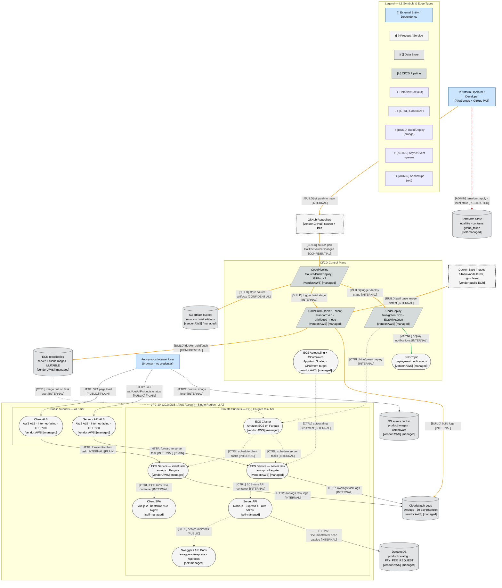
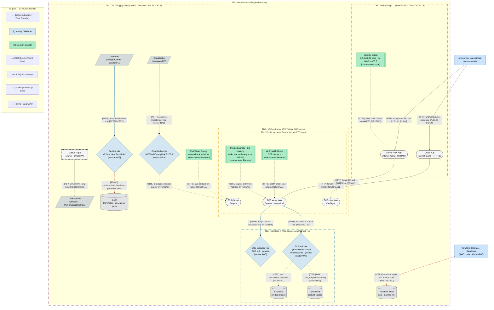
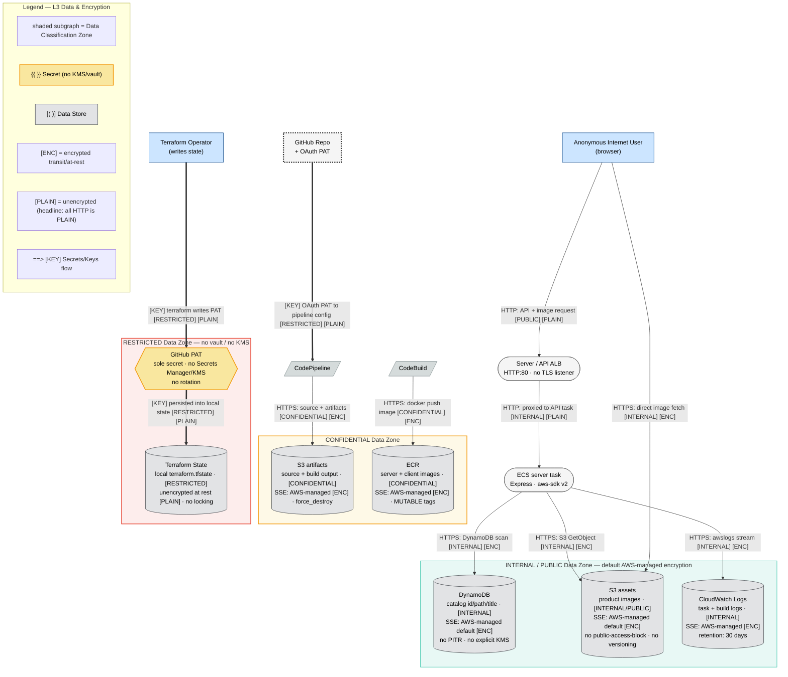

# Diagram Specialist — Phase 2 Structural Diagram

## Metadata
| Field | Value |
|-------|-------|
| Agent | diagram-specialist |
| Phase | 2 (Structural — L1/L2/L3, no risk overlay) |
| Date | 2026-07-11 |
| Target System | AWS ECS Fullstack App (Terraform Demo) |
| Layer strategy | **Full 4-layer** (medium system: 13 components → 6-20 band, mermaid-layers.md §6). L1/L2/L3 produced here; **L4 threat overlay deferred to Phase 7** (findings not yet scored). |
| Node-id contract | Reuses canonical `recon.json` ids: C1-C13, D1-D6, E1-E5, TB1-TB6, R0-R5, X1-X5. |
| Rendering | All three layers render clean with `@mermaid-js/mermaid-cli` + `mermaid-config.json` (`-w 3000 --scale 2`); PNG sizes 0.59-1.37 MB (no 67-byte stubs). |
| Scope note | Phase 2 forbids risk content. No risk colors, no `⚠`/L×I annotations, no attack-path overlays, no `:::highRisk`/`medRisk`/`lowRisk`. Those are Phase 7. |

## Summary
Three structural Mermaid flowcharts, one concern per layer, shared node ids so specialists and Phase 7 cross-reference cleanly:

- **L1 — Architecture** (`ecs-fullstack-L1-architecture.mmd`): factual C4-level topology. Every process (C1-C13), data store (D1-D6), and external entity/dependency, with tech + ownership markers, inside VPC/subnet network zones and a CI/CD control plane. Typed data / control / build-deploy edges only.
- **L2 — Trust & Identity** (`ecs-fullstack-L2-trust-identity.mmd`): all six trust boundaries (TB1-TB6) as dashed, trust-level-colored subgraphs; the four IAM roles (R1-R4) as identity diamonds; the present security controls (open SG, private-subnet SG chaining, ALB health check, blue/green rollback) as control subroutines; AUTH / ADMIN / KEY / CTRL edges.
- **L3 — Data** (`ecs-fullstack-L3-data.mmd`): three data-classification zones (INTERNAL/PUBLIC, CONFIDENTIAL, RESTRICTED); encryption state (`[ENC]`/`[PLAIN]`) on **every** edge — the headline that all app-layer HTTP is `[PLAIN]`; the lone GitHub PAT secret (no vault/KMS) as a secrets hexagon; `[KEY]` credential flows; at-rest posture and 30-day retention in node labels.

---

## L1 — Architecture

Factual topology. Neutral styling only. Network zones (VPC `10.120.0.0/16`, public/private subnets) and the CI/CD control plane are structural grouping subgraphs, not trust boundaries (those are L2). Every edge is typed (Data `-->`, Control `-.-> [CTRL]`, Build/Deploy `--> [BUILD]`, Async `--> [ASYNC]`, Admin `-.-> [ADMIN]`) and carries protocol + sensitivity.

**L1 note — backend ALB is public.** Both `R0 --> C4` and `R0 --> C5` originate at the browser: the SPA's `RestServices.js` calls `http://<SERVER_ALB>/api/getAllProducts` directly, so the API ALB (C5) is reached from the Internet, not brokered by the front-end. This corrects the provided architecture PNG's implied front→back internal hop.

---

## L2 — Trust & Identity

Trust boundaries as dashed subgraphs, colored by trust level (red = low/Internet, orange = medium/VPC, blue = identity mediation, purple = account). All six recon boundaries appear. IAM roles are identity diamonds; present controls are control subroutines. AUTH (`--o`, blue), ADMIN (`-.->`, red), KEY (`==>`), and CTRL (`-.->`) edges.

**L2 note — no AuthN/AuthZ at the application edge.** TB1 carries anonymous `[PLAIN]` traffic straight through; there is no auth gateway node because none exists in the system (Login.vue is an inert stub). The identity mediation (`--o [AUTH]`) that *does* exist is all machine-to-cloud: task→role and pipeline→role assumption. `iam:PassRole *` on both the task role (R2) and DevOps role (R3) is drawn as the broad grant it is. No `sequenceDiagram` companion is warranted (recon §1.9: auth sequence N/A).

---

## L3 — Data

Data-classification zones by sensitivity; encryption state on every edge. The system's defining data fact — all application HTTP is unencrypted — is visible as `[PLAIN]` on every ingress/east-west edge, while AWS-SDK/API calls to managed services are `[ENC]` (AWS-managed TLS). The single secret (GitHub PAT) is a secrets hexagon with an explicit "no vault/KMS" annotation; its `[KEY]` flow lands in unencrypted local Terraform state.

**L3 note — `[PLAIN]` vs `[ENC]` split.** Every edge that touches the browser or crosses the ALB→task hop is `[PLAIN]` HTTP (no TLS listener is created). Everything from an ECS task or CodeBuild to a managed AWS service rides AWS-managed TLS (`[ENC]`). At rest, all AWS stores get AWS-owned default encryption (`[ENC]`, but no explicit SSE-KMS); the one store that is genuinely plaintext at rest is the **local Terraform state** holding the PAT. Category #10 (Secrets/Key Mgmt) was marked N/A in recon because there is no vault/KMS/HSM — the PAT node here draws that *absence* explicitly (the sole secret, unmanaged), rather than a managed secrets service.

---

## Node-ID Reconciliation (recon.json → diagram nodes)

Every element in the reconnaissance appears in at least one layer under its canonical id.

| recon id | Element | L1 | L2 | L3 |
|----------|---------|:--:|:--:|:--:|
| C1 | Client SPA | ✓ | (in C7) | — |
| C2 | Server API | ✓ | (in C8) | — |
| C3 | Swagger / API docs | ✓ | — | — |
| C4 | Client ALB | ✓ | ✓ | — |
| C5 | Server/API ALB | ✓ | ✓ | ✓ |
| C6 | ECS Cluster | ✓ | ✓ | — |
| C7 | ECS client service | ✓ | ✓ | — |
| C8 | ECS server service | ✓ | ✓ | ✓ |
| C9 | CodePipeline | ✓ | ✓ | ✓ |
| C10 | CodeBuild | ✓ | ✓ | ✓ |
| C11 | CodeDeploy | ✓ | ✓ | — |
| C12 | Autoscaling + CloudWatch | ✓ | — | — |
| C13 | SNS topic | ✓ | — | — |
| D1-D6 | Data stores | ✓ | D1,D2,D4,D6 | ✓ (all 6) |
| E1-E5 | Entry points | edges from R0/X1/health-check | ingress edges | ingress edges |
| TB1-TB6 | Trust boundaries | (network zones) | ✓ (all 6 subgraphs) | (data zones) |
| R0 | Anonymous user | ✓ | ✓ | ✓ |
| R1-R4 | IAM roles | (implicit in edges) | ✓ (identity diamonds) | — |
| R5 | Terraform operator | ✓ | ✓ | ✓ |
| X1 | GitHub + PAT | ✓ | ✓ | ✓ |
| X2,X3 | npm deps | (feed C10 build) | — | — |
| X4 | Docker base images | ✓ | — | — |
| X5 | CodeBuild image | (C10 label) | (C10 label) | — |

Entry points E1-E5 are represented as edges rather than nodes (they are ingress interfaces): E1 `R0→C4`, E2 `R0→C5`, E3 `C2→C3` + public reach via C5, E4 `X1→C9`, E5 `HC→C8`. X2/X3/X5 (npm/build-image supply chain) are captured in the CodeBuild node label and the `X4→C10` base-image edge; they surface as first-class `:::externalDep` nodes in the Phase-7 SBOM/dependency visual, not the structural DFD.

## Visual Completeness — Phase 2 Coverage

Structural categories from `visual-completeness-checklist.md` (risk-overlay-only categories #6/#7/#12/#23 and companion #26 are correctly deferred to Phase 7):

| # | Category | Covered | Where |
|---|----------|:-------:|-------|
| 1 | External Entities | ✓ | R0, R5, X1, X4 (L1); R0/R5 (L2/L3) |
| 2 | Processes | ✓ | C1-C13 stadiums/parallelograms (L1) |
| 3 | Data Stores | ✓ | D1-D6 cylinders (L1, L3) |
| 4 | Trust Boundaries | ✓ | TB1-TB6 dashed subgraphs (L2) |
| 5 | Data Flow Labels | ✓ | typed edges w/ protocol + sensitivity (all layers) |
| 8 | Component Metadata | ✓ | tech + ownership on every process/store (L1) |
| 9 | Identity Elements (IAM) | ✓ | R1-R4 identity diamonds (L2) |
| 11 | Control vs Data Plane | ✓ | `-.-> [CTRL]` vs `-->`; CI/CD plane subgraph (L1/L2) |
| 13 | Control Indicators | ✓ | SG, private-subnet chaining, health check, blue/green (L2) |
| 14 | Data Classification Markers | ✓ | 3 zone subgraphs (L3) |
| 15 | Encryption State | ✓ | `[ENC]`/`[PLAIN]` on every edge (L3) |
| 16 | Network Zones | ✓ | VPC 10.120.0.0/16 + public/private subnets (L1) |
| 17 | Deployment Pipeline | ✓ | C9-C11 parallelograms + ECR (L1/L2) |
| 18 | External Dependency Markers | ✓ | GitHub X1, base images X4 double-border (L1) |
| 21 | Typed Edges | ✓ | all edges use §4 typed prefixes |
| 22 | Ownership Markers | ✓ | `[managed]`/`[self-managed]`/`[vendor:X]` (L1) |
| 24 | Version Stamp | ✓ | `%% Version: ... | Layer: L{N}` on all 3 |
| 25 | Density Compliance | ✓ | ≤23 core nodes/layer, subgraph-grouped |
| 10 | Secrets/Key Mgmt | ✓ (absence) | PAT hexagon "no vault/KMS" (L3) — recon marked N/A; drawn as the finding it is |
| 6,7,12,23 | Risk color / threat annots / attack paths / machine-parseable | deferred | **Phase 7 (L4)** |
| 26 | Companion (attack tree) | deferred | **Phase 5/7** |
| 19,20 | Tenant / Region boundaries | N/A | single-tenant, single-region (justified in checklist) |

**Structural coverage: 18/18 applicable Phase-2 categories, plus #10 drawn as an explicit absence.**

## Structural Acceptance Gate (self-check)

| Gate item | Status | Evidence |
|-----------|:------:|----------|
| Layers present per scaling (13 comp → L1,L2,L3 now; L4 Phase 7) | PASS | 3 `mermaid` blocks, each stamped `Layer: L1/L2/L3` |
| Every edge typed + annotated (protocol + sensitivity; `[ENC]`/`[PLAIN]` where it varies) | PASS | 0 bare edges; 100% of edges carry a `[PUBLIC|INTERNAL|CONFIDENTIAL|RESTRICTED]` and/or typed prefix; L3 every edge carries `[ENC]`/`[PLAIN]` |
| Trust boundaries drawn (all inventory boundaries appear) | PASS | TB1-TB6 as dashed subgraphs in L2 |
| Component metadata + ownership on processes/stores | PASS | every L1 stadium/cylinder carries tech + `[managed]`/`[self-managed]`/`[vendor:X]` |
| Legend + version stamp on every diagram | PASS | per-layer Legend subgraph + `%% Version:` stamp |
| No risk content in Phase 2 | PASS | no `:::highRisk`/`medRisk`/`lowRisk`, no `⚠`/L×I, no attack-path overlays |
| Renders clean (no stub) | PASS | mmdc render: L1 1.37 MB, L2 1.08 MB, L3 0.59 MB PNG |

---

## Execution Log

### Process Health
| Metric | Value |
|--------|-------|
| Inputs read | 01-reconnaissance.md, recon.json, visual-completeness-checklist.md, SKILL.md (Phase 2 + gate), mermaid-spec.md, mermaid-layers.md, mermaid-templates.md, mermaid-review-checklist.md, mermaid-config.json, diagram_checks.py |
| Layers produced | 3 (L1 Architecture, L2 Trust & Identity, L3 Data) |
| Files written | 1 (02-structural-diagram.md); 3 `.mmd` + 3 `.png` validation artifacts in scratchpad |
| Errors encountered | 0 |
| Self-assessed output quality | HIGH |

### Diagram Complexity
| Layer | Core nodes | Edges | Subgraphs | Notes |
|-------|:----------:|:-----:|:---------:|-------|
| L1 Architecture | 23 (4 external, 13 comp, 6 store) | 26 | 4 (VPC, PUB, PRIV, CICD) + Legend | 8 BUILD, 1 ADMIN, 1 ASYNC, rest data/CTRL |
| L2 Trust & Identity | 23 (2 principal, 4 IAM, 3 ALB/task, 3 pipeline, 3 store, 4 control, 4 misc) | 18 | 6 trust boundaries (TB1-TB6) + Legend | 4 AUTH, 2 ADMIN, 1 KEY, rest CTRL/data |
| L3 Data | 14 (2 external, 1 dep, 4 process, 6 store, 1 secret) | 11 | 3 classification zones + Legend | 3 KEY, all edges carry `[ENC]`/`[PLAIN]` |

Total across layers: 55 edges, 13 content subgraphs. Each layer stays under the 25-node / 15-per-subgraph density limits (spec §6).

### Mermaid Syntax Issues Encountered
- **None material.** All three layers parsed and rendered on the first CLI pass (`@mermaid-js/mermaid-cli` + `mermaid-config.json`, `-w 3000 --scale 2`).
- Precautions taken up front to avoid known pitfalls: every node/edge label double-quoted (labels contain `(`, `/`, `:`, `*`, `.`); `classDef` blocks placed at end-of-diagram; `linkStyle` indices counted against edge-statement order only (verified in-range by successful render — an out-of-range index would have errored); legend edge-type swatches written as quoted rectangle text (not real arrows) so they neither render as stray edges nor pollute the typed-edge fraction.
- Nesting depth: L2 has one 3-level branch (TB5 › TB6 › TB2); rendered cleanly, so no flattening needed (spec §2 advises flatten "where possible", not mandatory).

### Visual Completeness Categories — Covered vs Skipped
- **Covered (18 structural + #10 as absence)**: see coverage table above. Highest-signal visuals for this system are all present — `[PLAIN]` on both public ALBs (L1/L3), the Internet→public-ALB boundary on *both* ALBs (L2 TB1), the CI/CD supply-chain boundary (L2 TB4), and the `iam:PassRole *` task/DevOps roles (L2 R2/R3).
- **Deferred to Phase 7 (correct, not skipped)**: #6 Risk Color, #7 Threat Annotations, #12 Attack Paths, #23 Machine-Parseable Annotations (all L4), #26 Companion attack tree (Phase 5/7). Phase 2 forbids risk content.
- **N/A (justified in recon/checklist)**: #19 Tenant (single-tenant), #20 Region (single-region).

### Self-Assessed Diagram Quality
- **Structural fidelity — HIGH.** All 13 components, 6 stores, 5 entry points, 6 trust boundaries, 6 roles, 5 external deps are represented under canonical recon ids; the one non-obvious topology fact (backend API ALB is Internet-reachable directly from the browser) is drawn, not smoothed over.
- **Spec compliance — HIGH.** Passes every structural acceptance-gate item and the deterministic `diagram_checks.py` structural requirements (layer stamps, ≥90% edges labeled / ≥60% annotated — actual 100%, trust-boundary subgraphs present, ownership markers on L1 process/store nodes, legend + version stamp + classDef).
- **Known limitation.** `linkStyle` edge-coloring is index-based and correct-by-render, but if a future edit reorders edges the indices must be recounted; noted for the Phase-7 L4 author who will copy the L1 structure. X2/X3/X5 supply-chain deps are folded into node labels/edges here by design (structural DFD) and become first-class nodes in the Phase-7 SBOM visual.
- **Handoff.** L4 (Phase 7) should copy the L1 node/edge skeleton verbatim and layer risk classes + `⚠ STRIDE · L×I` annotations + attack-path `==>` overlays onto it; L2/L3 boundaries and zones carry forward unchanged. Specialists (privacy/compliance/code-review) can cite any node by its recon id.
