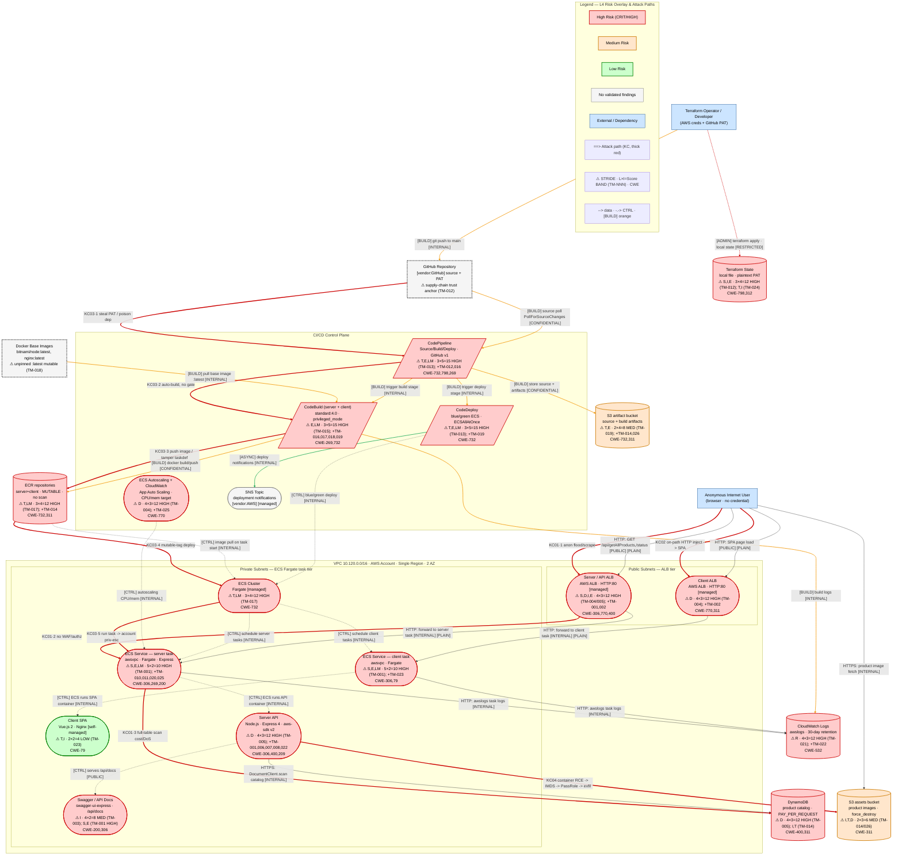
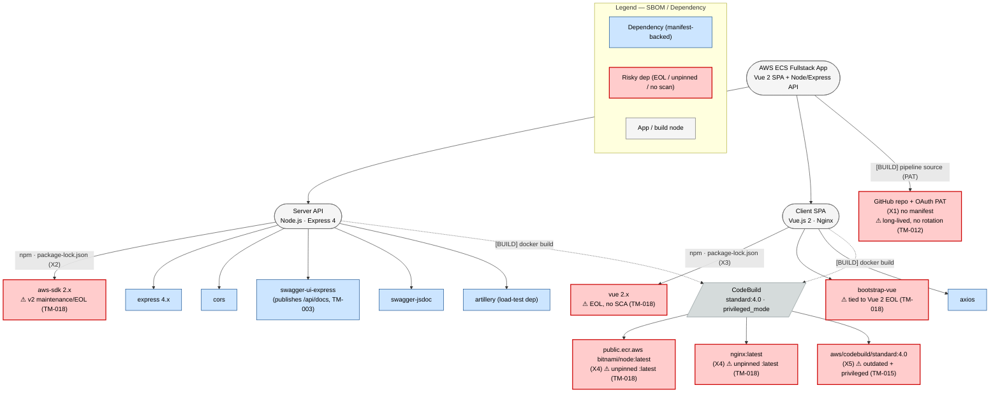
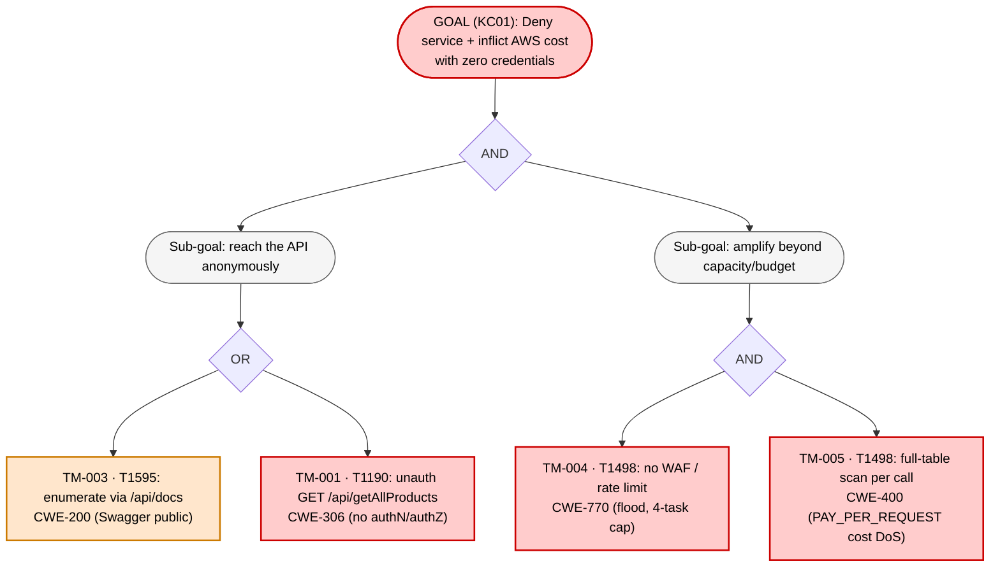
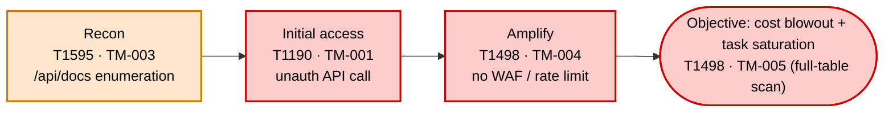
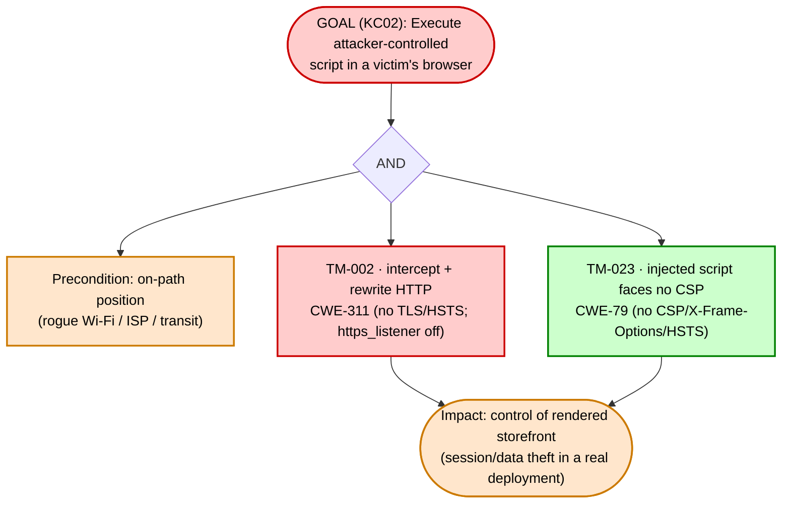
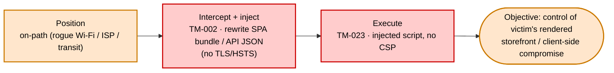
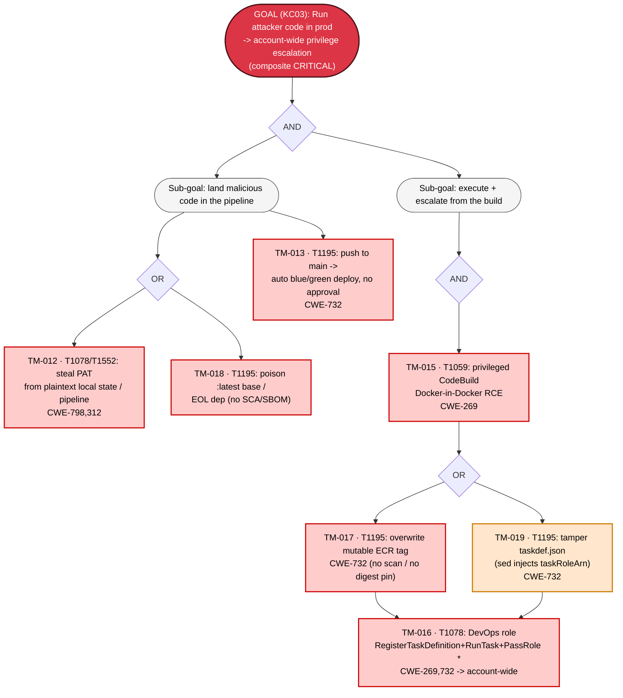
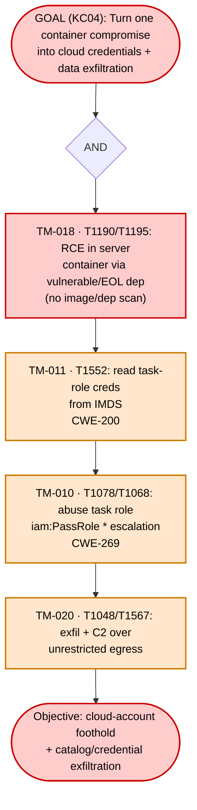
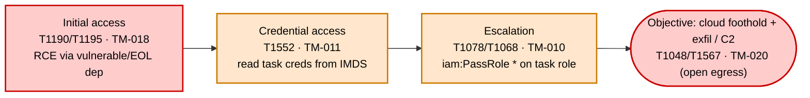

# Diagram Specialist — Phase 7 Visual Validation / L4 Risk Overlay + Analytical Visuals

## Metadata
| Field | Value |
|-------|-------|
| Agent | diagram-specialist (Phase 7 — risk overlay) |
| Phase | 7 (Visual Validation — L4 threat overlay + analytical/communication visuals) |
| Date | 2026-07-11 |
| Target System | AWS ECS Fullstack App (Terraform Demo) |
| Inputs | 02-structural-diagram.md (L1 skeleton copied verbatim), 04-risk-quantification.md, 05-false-negative-hunting.md, 06-validated-findings.md, findings.json (25 validated findings, 4 kill chains KC01-KC04), recon.json (roles R0-R5, dep manifests), visual-completeness-checklist.md; refs: mermaid-spec/layers/diagrams/templates/review-checklist, analytical-visuals.md, analysis-checklists.md, frameworks.md |
| Node-id contract | Reuses canonical recon ids C1-C13, D1-D6, E1-E5, TB1-TB6, R0-R5, X1-X5 — cross-references L1-L3 unchanged. |
| Rendering | All 10 `.mmd` files render clean with `@mermaid-js/mermaid-cli` + `mermaid-config.json` (`-w 3000 --scale 2`); PNG sizes 64 KB–2.06 MB (no 67-byte stubs). |
| Files written | `07-final-diagram.md`; `ecs-fullstack-L4-threat-overlay.mmd`; `ecs-fullstack-sbom.mmd`; `ecs-fullstack-attack-tree-{1..4}.mmd`; `ecs-fullstack-attack-flow-{1..4}.mmd`; `ecs-fullstack-attack-navigator-layer.json`; updated `visual-completeness-checklist.md`. |

## Summary
This phase closes the four risk-overlay-only visual categories (#6 risk color, #7 threat annotations, #12 attack paths, #23 machine-parseable annotations) plus the companion/analytical set (#26). It produces:

- **L4 threat overlay** — the L1 topology, verbatim, re-classed by validated severity (per-component highest-severity finding), each risk-bearing node carrying a machine-parseable `⚠ STRIDE · L×I=Score BAND (TM-NNN) · CWE` label, and the four declared kill chains overlaid as `==>` thick red attack paths.
- **STRIDE-per-element coverage matrix** (always) — every element × 7 STRIDE-LM categories, no blank cells.
- **L×I risk heat map** — all 25 scored findings placed at their own (L,I) cell.
- **MITRE ATT&CK technique layer** — 13 distinct techniques + Navigator JSON (≥5 threshold met).
- **RBAC authorization matrix** — 6 roles R0-R5 including the anonymous row, `allow`/`deny`/`GAP`.
- **SBOM / dependency graph** — rooted at the app, npm lockfile-backed deps + base images, risky deps flagged.
- **Auth sequence — NOT APPLICABLE** (no functional auth; login is an inert stub — one-line reason below).
- **Attack tree + attack flow per kill chain** — one of each for all four declared chains KC01-KC04.

**Headline of the overlay:** this system is dominated by HIGH findings. Of 21 core components/stores, **15 are `:::highRisk`**, 2 `:::medRisk`, 1 `:::lowRisk`, and only **1 (`C13` SNS) has no validated findings**. The single composite-CRITICAL risk is the CI/CD→prod→account chain (KC03), drawn in red across the supply-chain path.

---

## 1. L4 — Threat Overlay

Same node/edge skeleton as L1 (`ecs-fullstack-L1-architecture.mmd`), re-classed by validated severity, enriched with machine-parseable threat annotations, and overlaid with the four kill chains as `==>` thick red arrows (`linkStyle ... stroke:#cc0000,stroke-width:3px`). Structural typed-edge coloring (BUILD orange, ADMIN red, ASYNC green) is preserved from L1. Attack-path overlays appear **only** here (L4), never in L1-L3. No `~~>` is used anywhere.

**File:** `ecs-fullstack-L4-threat-overlay.mmd` · **Render:** 2.06 MB PNG (clean).



**L4 notes.**
- **Risk class = highest-severity validated finding whose `asset_refs` names the component** (deterministic, auditable). Result: `C13` (SNS) is the only `:::noFindings` node; `C1` (SPA) is the only `:::lowRisk` (TM-023 only); `D2`/`D3` are `:::medRisk`; everything else is `:::highRisk`. External actors `R0`/`R5` keep `:::external`; dependency roots `X1`/`X4` keep `:::externalDep` (their dep-level risk lives in the SBOM graph) with a one-line risk note.
- **Attack-path overlays** are drawn as *additional* `==>` edges parallel to the structural build/deploy/data edges, so the reader sees KC03 riding the legitimate GitHub→Pipeline→Build→ECR→Cluster→task path in red. Edge indices 26-35 are the ten overlay arrows; all carry the 3px red `linkStyle`. KC02 (on-path HTTP) is a single interception arrow `R0 ==> C4` — it is a network-position attack, not a multi-hop node walk; its full step sequence is in the KC02 attack tree/flow below.
- **TM-021 (no logging/detection)** lands on `D5` (CloudWatch Logs) as its `R` finding and is the ambient amplifier under all four chains; it is annotated on the node rather than drawn as a chain step (it is not a step in any `kill_chains[]` entry).

---

## 2. STRIDE-per-Element Coverage Matrix

Every DFD element (keyed by recon id) against all seven STRIDE-LM categories. Cells are a finding id, `n/a` (category inapplicable to that element type — e.g., Spoofing/Repudiation/Elevation of a passive data store), or `clean` (examined, no finding). **No blank cells.** Every `TM-NNN` here exists in `findings.json`, and every finding's (element, category) appears in its cell. Grouped by trust zone (>20 elements).

### External entities & dependencies
| Element | S | T | R | I | D | E | LM |
|---------|---|---|---|---|---|---|----|
| R0 Anonymous Internet user | TM-001 | n/a | clean | n/a | n/a | n/a | n/a |
| X1 GitHub repo + PAT | TM-012 | clean | n/a | TM-012 | n/a | TM-012 | n/a |
| X4 Docker base images | n/a | TM-018 | n/a | clean | n/a | clean | clean |

### Edge — public ALB tier
| Element | S | T | R | I | D | E | LM |
|---------|---|---|---|---|---|---|----|
| C4 Client ALB | clean | TM-002 | clean | TM-002 | TM-004 | clean | clean |
| C5 Server/API ALB | TM-001 | TM-002 | clean | TM-002 | TM-004, TM-005 | TM-001 | TM-001 |
| C3 Swagger / API docs | TM-001 | clean | clean | TM-003 | clean | TM-001 | clean |

### App — private ECS task tier
| Element | S | T | R | I | D | E | LM |
|---------|---|---|---|---|---|---|----|
| C1 Client SPA | clean | TM-023 | clean | TM-023 | clean | clean | clean |
| C2 Server API | TM-001, TM-006 | clean | TM-022 | TM-006, TM-007, TM-022 | TM-005, TM-008 | TM-001 | TM-001 |
| C7 ECS client task | TM-001 | TM-023 | clean | TM-023 | clean | TM-001 | TM-001 |
| C8 ECS server task | TM-001 | clean | clean | TM-011, TM-020 | TM-025 | TM-001, TM-010, TM-011 | TM-001, TM-010, TM-011, TM-020 |
| C6 ECS Cluster | clean | TM-017 | clean | clean | clean | clean | TM-017 |
| C12 Autoscaling + CloudWatch | clean | clean | clean | clean | TM-004, TM-025 | clean | clean |

### CI/CD control plane
| Element | S | T | R | I | D | E | LM |
|---------|---|---|---|---|---|---|----|
| C9 CodePipeline | TM-012 | TM-013 | clean | TM-012 | clean | TM-012, TM-013, TM-016 | TM-013, TM-016 |
| C10 CodeBuild | clean | TM-017, TM-018, TM-019 | clean | clean | clean | TM-015, TM-016, TM-019 | TM-015, TM-016, TM-017 |
| C11 CodeDeploy | clean | TM-013, TM-019 | clean | clean | clean | TM-013, TM-019 | TM-013 |
| C13 SNS topic | clean | clean | clean | clean | clean | clean | clean |

### Data stores
| Element | S | T | R | I | D | E | LM |
|---------|---|---|---|---|---|---|----|
| D1 DynamoDB catalog | n/a | TM-014 | n/a | TM-014 | TM-005 | n/a | clean |
| D2 S3 assets | n/a | TM-014, TM-026 | n/a | TM-014 | TM-026 | n/a | clean |
| D3 S3 artifacts | n/a | TM-014, TM-019, TM-026 | n/a | TM-014 | TM-026 | n/a | clean |
| D4 ECR | n/a | TM-014, TM-017 | n/a | TM-014 | clean | n/a | TM-017 |
| D5 CloudWatch Logs | n/a | clean | TM-021 | TM-022 | clean | n/a | clean |
| D6 Terraform state | n/a | TM-024 | n/a | TM-012, TM-024 | clean | n/a | clean |

### Data flows (entry points)
| Element | S | T | R | I | D | E | LM |
|---------|---|---|---|---|---|---|----|
| E1 Client ALB :80 (SPA) | clean | TM-002 | n/a | TM-002 | TM-004 | n/a | n/a |
| E2 Server ALB :80 (API) | TM-001 | TM-002 | n/a | TM-002, TM-006, TM-007 | TM-004, TM-005 | n/a | n/a |
| E3 Swagger /api/docs | clean | clean | n/a | TM-003 | clean | n/a | n/a |
| E4 GitHub source trigger | TM-012 | TM-013 | n/a | clean | clean | n/a | n/a |
| E5 ALB→task health check | clean | clean | n/a | clean | clean | n/a | n/a |

*E5 is the one `no_issue_surface` element in `findings.json` — examined and clean on the internal health-check flow (the public exposure of `/status` is captured under TM-001/E2, not here).*

---

## 3. Risk Heat Map (Likelihood × Impact)

All 25 validated findings placed at the cell matching their own `(likelihood, impact)`. Bands per `frameworks.md` (LOW 1-4, MED 5-9, HIGH 10-16, CRIT 17-25). No single finding is CRITICAL — the CRITICAL-grade risk is the composite KC03 (see §7).

| Impact \ Likelihood | 1 | 2 | 3 | 4 | 5 |
|---------------------|---|---|---|---|---|
| **5** |  | TM-016 | TM-013, TM-015 |  |  |
| **4** |  | TM-010, TM-011, TM-019 | TM-012, TM-017, TM-018 |  |  |
| **3** |  | TM-014, TM-020, TM-024, TM-025, TM-026 | TM-002 | TM-004, TM-005, TM-021 |  |
| **2** |  | TM-008, TM-022, TM-023 | TM-007 | TM-003 | TM-001 |
| **1** |  |  | TM-006 |  |  |

**Band tally (matches `findings.json` `summary_counts`):** CRITICAL 0 · HIGH 10 (TM-001, 004, 005, 012, 013, 015, 016, 017, 018, 021) · MEDIUM 11 · LOW 4 (TM-006, 008, 022, 023) = **25**.

---

## 4. MITRE ATT&CK Technique Coverage

The technique set equals the distinct `mitre` ids across `findings.json` — no technique appears that no finding maps to. Every id verified present in `frameworks.md`. **13 distinct techniques ≥ 5 ⇒ Navigator JSON layer produced** (`ecs-fullstack-attack-navigator-layer.json`).

| Tactic | Technique | ID | Findings |
|--------|-----------|----|----------|
| Reconnaissance | Active Scanning | T1595 | TM-003 |
| Initial Access | Exploit Public-Facing Application | T1190 | TM-001 |
| Initial Access | Supply Chain Compromise | T1195 | TM-013, TM-015, TM-017, TM-018, TM-019 |
| Initial Access / Priv-Esc / Persistence | Valid Accounts | T1078 | TM-010, TM-012, TM-016 |
| Execution | Command and Scripting Interpreter | T1059 | TM-015 |
| Privilege Escalation | Exploitation for Privilege Escalation | T1068 | TM-010 |
| Credential Access | Unsecured Credentials | T1552 | TM-011, TM-012 |
| Defense Evasion | Impair Defenses | T1562 | TM-021 |
| Impact | Network Denial of Service | T1498 | TM-004, TM-005 |
| Impact | Data Destruction | T1485 | TM-026 |
| Impact | Data Encrypted for Impact | T1486 | TM-026 |
| Exfiltration | Exfiltration Over Alternative Protocol | T1048 | TM-020 |
| Exfiltration | Exfiltration Over Web Service | T1567 | TM-020 |

```json
{
  "name": "Threat model — AWS ECS Fullstack App (Terraform Demo)",
  "domain": "enterprise-attack",
  "techniques": [
    { "techniqueID": "T1595", "score": 10, "comment": "TM-003" },
    { "techniqueID": "T1190", "score": 10, "comment": "TM-001" },
    { "techniqueID": "T1195", "score": 25, "comment": "TM-013, TM-015, TM-017, TM-018, TM-019" },
    { "techniqueID": "T1078", "score": 25, "comment": "TM-010, TM-012, TM-016" },
    { "techniqueID": "T1059", "score": 25, "comment": "TM-015" },
    { "techniqueID": "T1068", "score": 20, "comment": "TM-010" },
    { "techniqueID": "T1552", "score": 20, "comment": "TM-011, TM-012" },
    { "techniqueID": "T1562", "score": 15, "comment": "TM-021" },
    { "techniqueID": "T1498", "score": 15, "comment": "TM-004, TM-005" },
    { "techniqueID": "T1485", "score": 15, "comment": "TM-026" },
    { "techniqueID": "T1486", "score": 15, "comment": "TM-026" },
    { "techniqueID": "T1048", "score": 15, "comment": "TM-020" },
    { "techniqueID": "T1567", "score": 15, "comment": "TM-020" }
  ]
}
```
*(Full Navigator layer file, with gradient + legend, is `ecs-fullstack-attack-navigator-layer.json`.)*

---

## 5. Authorization (RBAC) Matrix

Roles × security-relevant resources, with the mandatory `anonymous` (R0) row. `allow` = intended access, `deny` = no access, `GAP` = access is allowed but should not be (points at an authz finding), `n/a` = the role is not an actor for that resource. Roles from `recon.json` `roles[]` (R0-R5).

| Role \ Resource | Public API (`/api/*`) | S3 assets (images) | DynamoDB catalog | ECR push | S3 artifacts | `iam:PassRole *` | GitHub repo | Terraform state (PAT) |
|-----------------|----------------------|--------------------|------------------|----------|--------------|------------------|-------------|-----------------------|
| **R0 anonymous** | GAP (TM-001, TM-003) | allow (public image reads) | deny | deny | deny | deny | deny | deny |
| **R1 ECS task-exec role** | n/a | deny | deny | pull-only | deny | deny | deny | deny |
| **R2 ECS task role** | n/a | allow (GetObject, scoped) | allow (scoped read) | deny | deny | GAP (TM-010) | deny | deny |
| **R3 DevOps role** | n/a | allow | deny | allow | GAP (TM-016, TM-019) | GAP (TM-016) | deny | deny |
| **R4 CodeDeploy role** | n/a | deny | deny | deny | allow (deploy read) | deny | deny | deny |
| **R5 Terraform operator (human)** | allow | allow | allow | allow | allow | allow | allow (holds PAT) | GAP (TM-012, TM-024) |

**GAP readout:** R0's unauthenticated read of the API and Swagger (TM-001/003) is the root access-control gap; R2's `iam:PassRole *` (TM-010) and R3's `PassRole *` + broad ECS/S3 wildcard-resource grants (TM-016/019) are the privilege-escalation gaps that make KC03/KC04 reach the account; R5's PAT-in-plaintext-state (TM-012/024) is the operator-side gap.

---

## 6. SBOM / Dependency Graph

Precondition met: the server and client `package-lock.json` files (recon `X2`/`X3` `manifest`) back the dependency tree. Rooted at the app; external deps as leaves; EOL / unpinned / unscanned deps flagged `:::riskDep` (red). Version stamp carries `Type: SBOM` for the deterministic check.

**File:** `ecs-fullstack-sbom.mmd` · **Render:** 456 KB PNG (clean).



---

## 7. Companion Diagrams — Attack Tree + Attack Flow per Kill Chain

Four declared kill chains (`findings.json` `kill_chains[]`, ≥3 ⇒ required) → one attack **tree** (goal decomposition, AND/OR gates) and one attack **flow** (temporal/lateral progression) each. Each stamped `Type: Attack Tree` / `Type: Attack Flow | Chain: KC{N}`. Steps reference their `TM-NNN` and MITRE ids.

### KC01 — Anonymous economic/availability denial (HIGH) · steps TM-003→TM-001→TM-004→TM-005





### KC02 — On-path HTTP → malicious content in browser (HIGH) · steps TM-002→TM-023





### KC03 — CI/CD → prod RCE → account (composite CRITICAL) · steps TM-012→TM-018→TM-013→TM-015→TM-017→TM-019→TM-016

```mermaid
flowchart LR
    %% Version: 2026-07-11 | Phase: 7 | System: AWS ECS Fullstack Demo | Type: Attack Flow | Chain: KC03
    IA["Initial access\nT1078/T1552 · TM-012 (steal PAT)\nor T1195 · TM-018 (poison dep)"]:::highRisk
    DEL["Delivery\nT1195 · TM-013\nmain-push auto-deploy, no gate"]:::highRisk
    EXE["Execution\nT1059 · TM-015\nprivileged CodeBuild RCE"]:::highRisk
    TAM["Persistence / tamper\nT1195 · TM-017 (mutable ECR)\n/ TM-019 (taskdef)"]:::highRisk
    ESC["Escalation\nT1078 · TM-016\nDevOps PassRole * + RunTask"]:::highRisk
    OBJ(["Objective: account-wide privilege\nescalation (composite CRITICAL)"]):::criticalRisk
    IA --> DEL --> EXE --> TAM --> ESC --> OBJ
    classDef highRisk fill:#ffcccc,stroke:#cc0000,stroke-width:2px,color:#000
    classDef medRisk fill:#ffe6cc,stroke:#cc7a00,stroke-width:2px,color:#000
    classDef criticalRisk fill:#dc3545,stroke:#491217,stroke-width:2px,color:#fff
```





### KC04 — Container foothold → IMDS → cloud priv-esc/exfil (HIGH) · steps TM-018→TM-011→TM-010→TM-020





---

## 8. Auth Sequence — NOT APPLICABLE

**No authentication or authorization exists in the system** — there is no login/session/token flow to sequence; `Login.vue` is an inert stub and all three API routes (`/status`, `/api/getAllProducts`, `/api/docs`) are anonymous (confirmed in `app.js`, Phase 6 §1). The absence itself is the finding (TM-001), drawn on the L4 overlay; a `sequenceDiagram` would have no participants beyond an unauthenticated GET. Consistent with `visual-completeness-checklist.md` #26 ("Auth sequence NOT applicable — no AuthN/AuthZ exists"). *(Data-lifecycle companion also omitted — no personal/regulated data.)*

---

## 9. Visual Completeness — Phase 7 Coverage

Risk-overlay and companion/analytical categories from `visual-completeness-checklist.md`. The 18 structural categories from Phase 2 carry into L4 unchanged; Phase 7 adds the four risk-overlay-only categories and the companion/analytical set.

| # | Category | Covered | Where |
|---|----------|:-------:|-------|
| 6 | Risk Color Coding | ✓ | L4: `:::highRisk/medRisk/lowRisk/noFindings` on every component/store |
| 7 | Threat Annotations | ✓ | L4: enriched `⚠ STRIDE · L×I=Score BAND (TM-NNN)` labels |
| 12 | Attack Paths (kill chains) | ✓ | L4: 10 `==>` red overlay edges (KC01-KC04); + 4 attack trees + 4 attack flows |
| 23 | Machine-Parseable Annotations | ✓ | L4 label format `⚠ {STRIDE} · {L}×{I}={Score} {BAND}` + CWE ids |
| 26 | Companion Diagrams | ✓ | 4 attack trees + 4 attack flows; auth sequence N/A (justified §8) |
| — | STRIDE-per-element matrix | ✓ | §2 (every cell TM-id/n-a/clean) |
| — | L×I risk heat map | ✓ | §3 (all 25 findings at own cell) |
| — | MITRE ATT&CK layer | ✓ | §4 (13 techniques == distinct finding techniques + Navigator JSON) |
| — | RBAC matrix | ✓ | §5 (6 roles R0-R5, anonymous row, allow/deny/GAP) |
| — | SBOM / dependency graph | ✓ | §6 (`Type: SBOM`, npm lockfile-backed) |
| 1-5,8,9,11,13-18,21,22,24,25 | Structural (Phase 2) | ✓ (carried) | L4 inherits L1 topology, ownership, network zones, typed edges, version stamp |
| 10 | Secrets/Key Mgmt | ✓ (absence) | PAT drawn as X1 risk note + D6 store; no vault/KMS to render (Phase 1 N/A) |
| 19, 20 | Tenant / Region boundaries | N/A | single-tenant, single-region (Phase 1) |

**Phase 7 risk-overlay coverage: 23/23 applicable categories** (all 18 structural carried into L4 + #6/#7/#12/#23 risk-overlay + #26 companion). `visual-completeness-checklist.md` scorecard updated to `23/23`.

---

## 10. Risk & Analytical Acceptance Gate (self-check)

| Gate item | Status | Evidence |
|-----------|:------:|----------|
| L4 built from L1 skeleton verbatim (nodes/edges/subgraphs) | PASS | L1 node ids, shapes, 26 structural edges, VPC/PUB/PRIV/CICD subgraphs reproduced unchanged; only classes/labels enriched + overlays appended |
| Risk class = highest validated severity per component | PASS | 15 highRisk / 2 medRisk / 1 lowRisk / 1 noFindings; `:::noFindings` (C13) ≠ `:::lowRisk` (C1) distinction honored |
| Machine-parseable annotations (`⚠ STRIDE · L×I=Score BAND` + CWE) | PASS | every risk-bearing node; STRIDE single letters; L×I arithmetic matches `findings.json`; BAND matches band table |
| CWE ids verified against frameworks.md | PASS | 13 distinct CWEs (306,311,200,770,400,209,755,269,798,312,732,532,79) all present in frameworks.md |
| Attack paths overlaid with `==>` thick red, `~~>` never used | PASS | 10 `==>` overlay edges, `linkStyle 26-35 stroke:#cc0000,stroke-width:3px`; zero `~~>` |
| Attack paths only in L4 | PASS | L1-L3 (Phase 2) unchanged; overlays exist only in this file |
| STRIDE-per-element matrix — always | PASS | §2, no blank cells, faithful projection of findings |
| L×I heat map — findings scored | PASS | §3, 25 findings each at own (L,I) |
| MITRE ATT&CK layer — findings carry mitre ids | PASS | §4, 13 techniques == distinct finding techniques; Navigator JSON at ≥5 |
| RBAC matrix — 6 roles incl. anonymous | PASS | §5, R0-R5 with anonymous row + GAP cells |
| SBOM graph — npm manifests present | PASS | §6, `Type: SBOM`, package-lock-backed |
| Auth sequence — NOT APPLICABLE with reason | PASS | §8, one-line reason (no functional auth) |
| Attack tree + attack flow per declared chain (≥3) | PASS | 4 chains → 4 trees + 4 flows; each `Type:`-stamped |
| Companion diagrams `Type: {kind}` stamped | PASS | `Type: SBOM`, `Type: Attack Tree`, `Type: Attack Flow | Chain: KC{N}` on version lines |
| Individual `.mmd` files saved per naming convention | PASS | L4, sbom, attack-tree-{1..4}, attack-flow-{1..4} written to output dir |
| Renders clean (no stub) | PASS | all 10 PNGs 64 KB–2.06 MB; zero render errors |

---

## Execution Log

### Process Health
| Metric | Value |
|--------|-------|
| Inputs read | 02-structural-diagram.md, 04/05/06 analysis, findings.json, recon.json, visual-completeness-checklist.md; refs: mermaid-spec/layers/diagrams/templates/review-checklist, mermaid-config.json, analytical-visuals.md, analysis-checklists.md, frameworks.md |
| Diagrams produced | 10 `.mmd` (1 L4 overlay, 1 SBOM, 4 attack trees, 4 attack flows) + 1 Navigator JSON + 4 in-doc analytical tables (STRIDE matrix, heat map, ATT&CK table, RBAC matrix) |
| Files written | 07-final-diagram.md; 10 `.mmd`; 1 `.json`; updated visual-completeness-checklist.md |
| Render validation | 10/10 rendered clean via mmdc (`-w 3000 --scale 2`); PNG sizes 64 KB–2.06 MB; 0 stubs |
| Errors encountered | 0 |
| Self-assessed output quality | HIGH |

### Risk Annotations Applied (count by severity, per component/store on L4)
| Class | Count | Nodes |
|-------|:-----:|-------|
| `:::highRisk` (CRIT/HIGH) | 15 | C2, C3, C4, C5, C6, C7, C8, C9, C10, C11, C12, D1, D4, D5, D6 |
| `:::medRisk` (MEDIUM) | 2 | D2, D3 |
| `:::lowRisk` (LOW only) | 1 | C1 |
| `:::noFindings` | 1 | C13 |
| `:::external` / `:::externalDep` (actors/deps, risk-noted not risk-classed) | 4 | R0, R5, X1, X4 |

*(Per-finding band distribution, distinct from per-component class: CRITICAL 0 / HIGH 10 / MEDIUM 11 / LOW 4 = 25 validated findings; the composite CRITICAL is KC03, expressed as a chain.)*

### Analytical Visuals Produced vs Marked N/A
- **Produced:** STRIDE-per-element matrix (always); L×I heat map (25 scored findings); MITRE ATT&CK table + Navigator JSON (13 techniques ≥5); RBAC matrix (6 roles incl. anonymous); SBOM/dependency graph (npm lockfiles); L4 threat overlay; 4 attack trees; 4 attack flows.
- **Marked NOT APPLICABLE:** Auth sequence (no functional auth — login is an inert stub, all routes anonymous). Data-lifecycle companion (no personal/regulated data) — consistent with Phase 1.

### Attack Paths Overlaid
- **KC03** (composite CRITICAL) — 5-edge red overlay across X1→C9→C10→D4→C6→C8 (the legit supply-chain path, walked by the attacker).
- **KC01** (HIGH) — 3-edge red overlay R0→C5→C8→D1 (anon flood → scan cost/DoS).
- **KC04** (HIGH) — 1-edge red overlay C2→D2 (container RCE → IMDS → PassRole → exfil; full sequence in the KC04 tree/flow).
- **KC02** (HIGH) — 1-edge red overlay R0→C4 (on-path HTTP injection to the SPA; a network-position attack, full sequence in the KC02 tree/flow).
- All four also rendered as dedicated attack-tree (goal decomposition) + attack-flow (temporal) companions.

### Findings That Could Not Be Mapped to Diagram Components
- **None.** All 25 validated findings map to at least one node on L4 (via `asset_refs`) and appear in the STRIDE matrix and heat map. TM-021 (no logging/detection) is the one finding with no *chain-step* placement — by design it is the cross-cutting amplifier, annotated on D5 (its `asset_ref`) rather than drawn as a kill-chain edge.
- **Faithful-projection check:** every `TM-NNN` in the matrix/heat map/ATT&CK/RBAC/overlay exists in `findings.json`; no diagram introduces a finding, technique, or CWE that the findings do not carry.

### Self-Assessed Overlay Quality
- **Fidelity — HIGH.** L4 is a strict superset of L1 (verbatim skeleton + risk); risk classes are computed deterministically from `asset_refs` × validated severity, so the overlay is a reproducible projection of `findings.json`, not a re-judgement. The one composite-CRITICAL risk (KC03) is shown as a chain, matching Phase 4/6's honest refusal to inflate any single finding to CRITICAL.
- **Signal — HIGH but alarming-by-truth.** 15/19 components at highRisk is not over-coloring; it reflects a demo with no auth, no TLS, no WAF, plaintext PAT, privileged build, and dual `PassRole *`. C13 (noFindings) and C1 (lowRisk) are the honest exceptions that keep the palette meaningful.
- **Known limitations.** (1) L4 `linkStyle` indices are order-dependent (structural 0-25, overlays 26-35) — a future edge reorder must recount; verified in-range by clean render. (2) C12 (autoscaling) is highRisk because TM-004's `asset_refs` names it (the 4-task cap guarantees saturation) — the color follows the finding data faithfully, though its own contribution is the cap-enables-DoS angle, noted in its label. (3) Attack-path overlays compress multi-step chains to representative node walks for readability; the attack-tree/attack-flow companions carry the full per-step `TM`/MITRE fidelity.
- **Handoff.** Phase 8 / report-analyst: embed the 11 PNGs (L4 + SBOM + 4 trees + 4 flows, all in the output dir) alongside the L1-L3 layers; the Navigator JSON imports directly into ATT&CK Navigator; the STRIDE matrix, heat map, ATT&CK table, and RBAC matrix are report-ready markdown.
