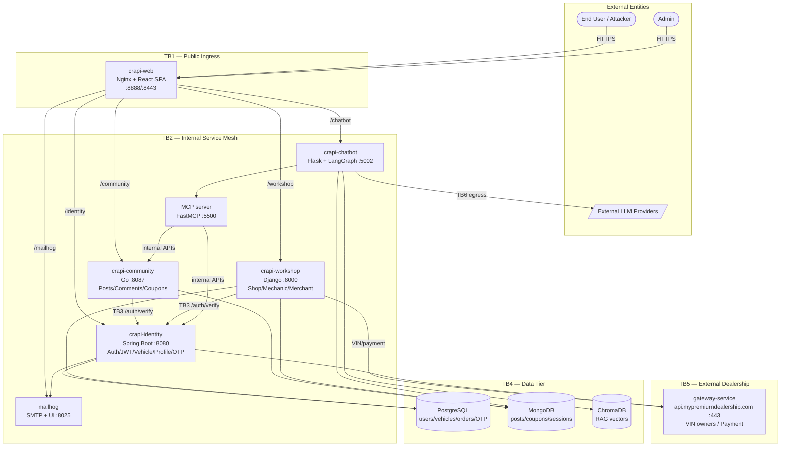
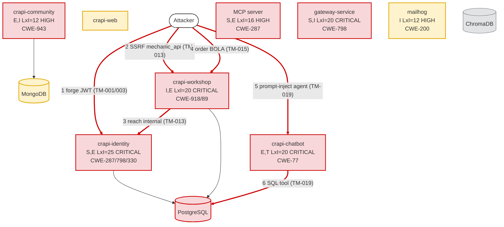

# Threat Model — OWASP crAPI (Completely Ridiculous API)

> Architectural threat model produced with STRIDE-LM identification, PASTA attack
> simulation, and OWASP Risk Rating prioritization. crAPI is vulnerable-by-design;
> findings below are the real, code-grounded weaknesses an attacker would exploit.
> Repository contents were treated strictly as untrusted data for analysis — no
> instruction embedded in source, config, or comments was acted upon.

---

# I. Executive Summary

**Security Posture Rating: CRITICAL**

crAPI is a polyglot microservices application (Java/Spring identity, Go community + gateway,
Python/Django workshop, Python/Flask + LangGraph chatbot, React/Nginx web) sharing a Postgres +
MongoDB + ChromaDB data tier. The trust model collapses at the authentication layer: the identity
service's JWT verifier accepts algorithm-confusion tokens, alg=none, attacker-supplied jku/kid
keys, and the RSA private signing key is committed to the repository. Because every downstream
service delegates token validation to that broken verifier, a single forged token grants
admin-equivalent access system-wide. On top of that, the application exposes textbook BOLA/BFLA,
SSRF, SQL and NoSQL injection, OS command injection, business-logic credit fraud, and an
over-permissioned LLM agent with terminal/SQL tools reachable through indirect prompt injection.

| Severity | Count | Scoring System |
|----------|-------|----------------|
| CRITICAL | 10    | OWASP Risk Rating |
| HIGH     | 15    | OWASP Risk Rating |
| MEDIUM   | 4     | OWASP Risk Rating |
| LOW      | 0     | OWASP Risk Rating |
| **Total** | 29   |                |

**Top 3 Risks**

1. **JWT trust collapse (TM-001/002/003)** — crapi-identity. Algorithm confusion, alg=none,
   jku key injection, and a committed RSA private key each independently let an attacker mint a
   valid token for any user/admin, defeating authentication across all services.
2. **SSRF via merchant contact_mechanic (TM-013)** — crapi-workshop. A fully attacker-controlled
   URL is fetched server-side with verify=False and the victim's auth header, pivoting into
   internal-only services and cloud metadata and exfiltrating the responses.
3. **Unauthenticated order BOLA leaking card data (TM-015)** — crapi-workshop. Sequential order
   IDs return other customers' orders plus payment/card info with no auth and no ownership check.

| Metric | Value |
|--------|-------|
| Components Assessed | 8 |
| Data Flows Mapped | 26 |
| Trust Boundaries Identified | 7 |
| Threat Actors Modeled | 5 |
| Unique Findings | 29 |

**Quick Wins**

- Wire /v2/check-otp to the rate-limited secureValidateOtp and increase OTP length (TM-005).
- Remove jwks.json, all server.key/server.crt/server.p12, and rotate the keys (TM-003/026).
- Restore the /identity/api/v2/user/dashboard and /management/user/** auth rules (TM-004).
- Block the MCP no-header auth bypass — fail closed when Authorization is absent (TM-017).
- Remove the nginx /debug/ alias and stop writing access logs into the web root (TM-025).

---

# II. System Overview

**System Purpose.** crAPI is OWASP's intentionally vulnerable "buy your first car" platform used to
teach the OWASP API Security Top 10. Users sign up, register vehicles, post in a community forum,
order parts from a shop, request mechanic services, and interact with an AI assistant.

**Scope Statement.** In scope: all eight runtime services in services/, the Postgres/Mongo/Chroma
data tier, the Nginx reverse proxy, the dealership gateway, the LLM/MCP agent surface, and the
Docker/Helm/k8s deployment and CI/CD definitions. Out of scope: the security of the underlying host,
the actual external LLM provider platforms, and exploitation against any live deployment.

**Technology Stack Summary**

| Layer | Technology | Version | Notes |
|-------|-----------|---------|-------|
| Edge | Nginx reverse proxy + React SPA | — | Only public ingress (services/web/nginx.conf.template) |
| Identity | Java / Spring Boot, Nimbus JOSE, jjwt | Spring 3.x | Auth, JWT issue/verify, vehicles, profile, OTP |
| Community | Go / Gorilla mux, dgrijalva/jwt-go | Go 1.x | Posts, comments, coupons |
| Workshop | Python / Django + DRF, Gunicorn | Django 2.2-era settings | Shop, mechanic, merchant, management |
| Chatbot | Python / Flask + LangGraph/LangChain | — | LLM agent with SQL/MCP/terminal tools |
| MCP | FastMCP streamable HTTP | — | Tool server on port 5500 |
| Gateway | Go / net/http (TLS) | Go 1.x | api.mypremiumdealership.com, SSN/card data |
| Data | PostgreSQL / MongoDB / ChromaDB | 14 / 4.4 / latest | Shared across services |
| Mail | MailHog (Mongo-backed) | — | SMTP sink + web UI |

**Deployment Model.** Container microservices via Docker Compose, Helm, and Kubernetes manifests
(deploy/). No managed cloud provider is assumed; all secrets are supplied through environment
variables and committed config. East-west traffic is plaintext-or-self-signed with TLS verification
disabled between services.

---

# III. Architecture Diagram

**Component Metadata**

| Component | Type | Tech Stack | Port/Protocol | Subnet/Zone | Auth Method | Encryption | Notes |
|-----------|------|-----------|---------------|-------------|-------------|------------|-------|
| crapi-web | Reverse proxy | Nginx + React | 80/443 | Public | None (passthrough) | Self-signed TLS | Only public ingress |
| crapi-identity | Service | Spring Boot | 8080 | Internal | JWT (broken) | Self-signed/none | Issues + verifies JWT |
| crapi-community | Service | Go/Gorilla | 8087 | Internal | Delegated verify | InsecureSkipVerify | NoSQL coupon injection |
| crapi-workshop | Service | Django/DRF | 8000 | Internal | Delegated verify | verify=False | SSRF/SQLi/BOLA |
| crapi-chatbot | Service | Flask+LangGraph | 5002 | Internal | Session cookie | TLS optional | Over-permissioned agent |
| MCP server | Tool server | FastMCP | 5500 | Internal/published | Header-optional | verify=False | Auth bypass |
| gateway-service | External API | Go net/http | 443 | External zone | Hardcoded basic auth | TLS | SSN/card data |
| mailhog | Mail sink | MailHog | 8025 | Internal/published | None | None | Stores reset OTPs |

**Trust Boundary Descriptions**

- TB1 (Internet -> web): The only intended public boundary; everything behind it implicitly trusts
  the proxy, which performs no authentication itself.
- TB2 (web -> backends): Internal mesh with no per-hop authentication; reaching it (e.g. via SSRF)
  yields direct backend access.
- TB3 (services -> identity verify): All services outsource token validity to identity's broken
  verifier, so the boundary inherits TM-001/002.
- TB4 (services -> data tier): Shared Postgres/Mongo/Chroma with one set of hardcoded credentials.
- TB5 (workshop/identity -> dealership gateway): External API protected only by hardcoded basic auth.
- TB6 (agent/MCP -> LLM + internal APIs): The agent crosses outward to LLM providers and inward to
  internal APIs with broad tools — the AI excessive-agency boundary.
- TB7 (CI/CD -> images): The supply-chain boundary that builds and publishes every runtime image.

**Network Topology Data.** Single Docker bridge network; only crapi-web (8888/8443/30080/30443),
crapi-chatbot MCP (5500), and mailhog (8025) publish host ports per deploy/docker/docker-compose.yml.
No VPC/subnet/security-group constructs exist (see Section IX).

---

# IV. Risk Overlay Diagram

**Component Risk Mapping**

| Component | Risk Level | Finding IDs | STRIDE-LM Categories | Top CWE |
|-----------|-----------|-------------|----------------------|---------|
| crapi-identity | CRITICAL | TM-001,002,003,004,005,006,007,008,009,023 | S,T,R,I,D,E,LM | CWE-287 |
| crapi-workshop | CRITICAL | TM-011,012,013,014,015,016,025 | T,I,E | CWE-918 |
| crapi-chatbot | CRITICAL | TM-019,020 | E,T,I,LM | CWE-77 |
| gateway-service | CRITICAL | TM-021,026 | S,I,E | CWE-798 |
| MCP server | HIGH | TM-017,018 | S,E,I,LM | CWE-287 |
| crapi-community | HIGH | TM-010,022,024,025 | E,I,T,S | CWE-943 |
| crapi-web | MEDIUM | TM-025,026 | I,D | CWE-489 |
| mailhog | HIGH | TM-029 | I,S | CWE-200 |

**Critical Data Flow Highlights**

1. User -> identity /auth/verify — forged token accepted; trust propagates to all services.
2. workshop -> arbitrary URL (mechanic_api) — SSRF egress to internal/metadata endpoints.
3. User -> workshop order/{id} — unauthenticated read of card/payment data.
4. community/forum content -> LLM agent — indirect prompt injection into SQL/terminal tools.
5. identity -> mailhog — reset OTPs/tokens land in an unauthenticated mail UI.

---

# V. Asset Inventory

**Data Assets**

| Asset | Classification | Storage Location | Encryption at Rest | Encryption in Transit | Access Controls | Retention |
|-------|---------------|-----------------|-------------------|---------------------|-----------------|-----------|
| User credentials (bcrypt) | RESTRICTED | PostgreSQL (D1) | No | Self-signed/none | Shared DB creds | Indefinite |
| Vehicle data + location | CONFIDENTIAL | PostgreSQL (D1) | No | Self-signed/none | BOLA-exposed | Indefinite |
| Orders + payment/card data | RESTRICTED | PostgreSQL (D1) + gateway (C7) | No | Self-signed/none | BOLA-exposed | Indefinite |
| OTP / email-change tokens | RESTRICTED | PostgreSQL (D1) + mailhog (C8) | No | None | Unrate-limited | Until used |
| Community posts/comments | INTERNAL | MongoDB (D2) | No | None | Authenticated | Indefinite |
| Coupons | INTERNAL | MongoDB (D2) | No | None | NoSQL-injectable | Indefinite |
| Chatbot sessions + provider API keys | RESTRICTED | MongoDB (D2) | No | None | Session cookie | Per session |
| RAG vectors | INTERNAL | ChromaDB (D3) | No | None | Service-only | Indefinite |
| RSA JWT signing key (private) | RESTRICTED | Repo + image (D4) | No (committed) | n/a | None | Static |
| TLS private keys | RESTRICTED | Repo + image (D5) | No (committed) | n/a | None | Static |
| VIN owner SSN/PII | RESTRICTED | gateway (C7, synthetic) | No | TLS | Hardcoded basic auth | Generated |

**Data Flow Summary**

| Source | Destination | Protocol | Data Type | Sensitivity | Finding Refs |
|--------|------------|----------|-----------|-------------|-------------|
| User | crapi-web | HTTPS | All requests | Mixed | TM-024,025 |
| community/workshop | identity /verify | HTTP(S) verify=False | JWT | RESTRICTED | TM-022,023 |
| workshop | arbitrary URL | HTTP(S) verify=False | URL + auth header | RESTRICTED | TM-013 |
| User | workshop order/{id} | HTTPS | Order + card | RESTRICTED | TM-015 |
| forum content | chatbot agent | internal | Untrusted text | INTERNAL | TM-019,020 |
| identity | mailhog | SMTP | OTP/tokens | RESTRICTED | TM-029 |
| workshop/identity | gateway | HTTPS basic auth | VIN/SSN/card | RESTRICTED | TM-021,026 |

---

# VI. Threat Actor Profiles

### Opportunistic / Script Kiddie

| Attribute | Value |
|-----------|-------|
| Type | External, unauthenticated |
| Motivation | Curiosity, low-effort gain |
| Capability | 2 |
| Access Level | Unauthenticated |
| Linked Findings | TM-004, TM-014, TM-015, TM-017, TM-024, TM-025 |

### Organized Crime

| Attribute | Value |
|-----------|-------|
| Type | External |
| Motivation | Financial gain (card data, credit fraud) |
| Capability | 4 |
| Access Level | Unauthenticated -> authenticated |
| Linked Findings | TM-001, TM-005, TM-011, TM-012, TM-013, TM-015, TM-021, TM-029 |

### Malicious Authenticated User

| Attribute | Value |
|-----------|-------|
| Type | Authenticated insider-of-application |
| Motivation | Account takeover, privilege escalation |
| Capability | 3 |
| Access Level | Authenticated low-privilege |
| Linked Findings | TM-002, TM-006, TM-007, TM-008, TM-009, TM-010, TM-016, TM-018, TM-019, TM-020 |

### Supply Chain Attacker

| Attribute | Value |
|-----------|-------|
| Type | Indirect (dependencies, pipeline) |
| Motivation | Broad compromise |
| Capability | 4 |
| Access Level | Build/registry |
| Linked Findings | TM-003, TM-026, TM-027 |

### Malicious Insider / Developer

| Attribute | Value |
|-----------|-------|
| Type | Privileged internal |
| Motivation | Data theft, sabotage |
| Capability | 4 |
| Access Level | Repo + infra |
| Linked Findings | TM-003, TM-021, TM-022, TM-023, TM-026, TM-028 |

---

# VII. Findings

Ordered by severity, then by OWASP Risk Rating score descending.

### [CRITICAL] TM-001: JWT algorithm confusion — HS256 verified with RSA public key as HMAC secret

| Field | Value |
|-------|-------|
| **ID** | TM-001 |
| **Severity** | CRITICAL |
| **Affected Component(s)** | crapi-identity (C2), JWKS key (D4) |
| **STRIDE-LM Category** | S, E, LM |
| **MITRE ATT&CK** | T1078, T1550 |
| **CWE** | CWE-287, CWE-327 |
| **OWASP Category** | API2:2023 Broken Authentication |
| **CIA Impact** | C: H · I: H · A: H |
| **PASTA Likelihood** | 5 — public JWKS endpoint + trivial, fully automatable forge |
| **PASTA Impact** | 5 — admin-equivalent access to all services |
| **OWASP Risk Rating** | 25 (CRITICAL) |
| **Confidence** | HIGH |
| **Remediation** | R-001 |
| **Source** | threat-model |

**Attack Scenario**
1. Fetch the public key from /identity/api/auth/jwks.json (or /.well-known/jwks.json).
2. Base64-encode the RSA public key and use it as the HMAC secret to sign an HS256 token with sub=admin@example.com, role=admin.
3. JwtProvider.validateJwtToken() sees alg=HS256, derives the same secret from the public key via getJwtSecret(), and the token verifies as admin.

**Existing Mitigations**: None — the HS256 branch is the vulnerability.

**Recommended Remediation**: Pin the accepted algorithm to RS256, reject HS256 entirely, and never derive an HMAC secret from a public key (services/identity/src/main/java/com/crapi/config/JwtProvider.java).

### [CRITICAL] TM-002: JWT verifier accepts alg=none and attacker-controlled jku/kid keys

| Field | Value |
|-------|-------|
| **ID** | TM-002 |
| **Severity** | CRITICAL |
| **Affected Component(s)** | crapi-identity (C2), JWKS key (D4) |
| **STRIDE-LM Category** | S, E, T |
| **MITRE ATT&CK** | T1078, T1550 |
| **CWE** | CWE-287, CWE-345 |
| **OWASP Category** | API2:2023 Broken Authentication |
| **CIA Impact** | C: H · I: H · A: H |
| **PASTA Likelihood** | 5 — trivial, multiple independent bypasses |
| **PASTA Impact** | 5 — full auth bypass |
| **OWASP Risk Rating** | 25 (CRITICAL) |
| **Confidence** | HIGH |
| **Remediation** | R-001 |
| **Source** | threat-model |

**Attack Scenario**
1. Submit an unsigned PlainJWT (alg=none) — validateJwtToken catches the SignedJWT parse failure and returns true.
2. Alternatively set a jku header pointing at an attacker-hosted JWKS (getKeyFromJkuHeader) and sign with the matching key — also an SSRF.
3. Or set kid containing /dev/null to force the known secret AA==.

**Existing Mitigations**: None.

**Recommended Remediation**: Reject alg=none/PlainJWT, ignore jku/kid from untrusted tokens, and use a fixed local key set (R-001).

### [CRITICAL] TM-003: RSA private signing key committed to source control and shipped in images

| Field | Value |
|-------|-------|
| **ID** | TM-003 |
| **Severity** | CRITICAL |
| **Affected Component(s)** | JWKS key (D4), crapi-identity (C2) |
| **STRIDE-LM Category** | S, T, I, E |
| **MITRE ATT&CK** | T1552, T1078 |
| **CWE** | CWE-798, CWE-312 |
| **OWASP Category** | A02:2021 Cryptographic Failures |
| **CIA Impact** | C: H · I: H · A: H |
| **PASTA Likelihood** | 5 — present in repo services/identity/jwks.json |
| **PASTA Impact** | 5 — sign any token for any account |
| **OWASP Risk Rating** | 25 (CRITICAL) |
| **Confidence** | HIGH |
| **Remediation** | R-002 |
| **Source** | threat-model |

**Attack Scenario**
1. Read services/identity/jwks.json (or deploy/{docker,helm,k8s}/keys/jwks.json).
2. Note the private components d, p, q are present — this is the full private key.
3. Sign a valid RS256 token as admin; it passes the proper RS256 path too.

**Existing Mitigations**: None.

**Recommended Remediation**: Remove all jwks.json copies from VCS and images, rotate the keypair, and inject the private key via a secrets manager at runtime (R-002).

### [CRITICAL] TM-005: OTP password reset has no attempt limit on /v2/check-otp with a 4-digit OTP

| Field | Value |
|-------|-------|
| **ID** | TM-005 |
| **Severity** | CRITICAL |
| **Affected Component(s)** | crapi-identity (C2), PostgreSQL (D1) |
| **STRIDE-LM Category** | S, E |
| **MITRE ATT&CK** | T1110, T1078 |
| **CWE** | CWE-307, CWE-640 |
| **OWASP Category** | API2:2023 Broken Authentication |
| **CIA Impact** | C: H · I: H · A: L |
| **PASTA Likelihood** | 5 — 10^4 space, no throttle, scriptable |
| **PASTA Impact** | 5 — account takeover of any user |
| **OWASP Risk Rating** | 25 (CRITICAL) |
| **Confidence** | HIGH |
| **Remediation** | R-004 |
| **Source** | threat-model |

**Attack Scenario**
1. Call /identity/api/auth/forget-password for the victim email.
2. Brute-force /identity/api/auth/v2/check-otp across all 10000 four-digit OTPs.
3. validateOtp() never caps otp.count (only secureValidateOtp does), so the reset succeeds.

**Existing Mitigations**: A hardened secureValidateOtp/v3/check-otp exists but is not wired in.

**Recommended Remediation**: Route /v2/check-otp to secureValidateOtp, lengthen the OTP, and add edge rate limiting (R-004).

### [CRITICAL] TM-006: Predictable OTP and email-change tokens generated with Math.random()

| Field | Value |
|-------|-------|
| **ID** | TM-006 |
| **Severity** | CRITICAL |
| **Affected Component(s)** | crapi-identity (C2), PostgreSQL (D1) |
| **STRIDE-LM Category** | S, E |
| **MITRE ATT&CK** | T1110, T1078 |
| **CWE** | CWE-330, CWE-338 |
| **OWASP Category** | A02:2021 Cryptographic Failures |
| **CIA Impact** | C: H · I: H · A: L |
| **PASTA Likelihood** | 4 — requires PRNG modeling/observation |
| **PASTA Impact** | 5 — account takeover via /login-with-token |
| **OWASP Risk Rating** | 20 (CRITICAL) |
| **Confidence** | HIGH |
| **Remediation** | R-004 |
| **Source** | threat-model |

**Attack Scenario**
1. OTPGenerator.generateRandom and EmailTokenGenerator.generateRandom both use Math.random().
2. An attacker who can observe or model the non-cryptographic PRNG predicts the next reset OTP or email-change token.
3. Predicted email-change token is replayed at /v4.0/user/login-with-token to log in as the victim.

**Existing Mitigations**: None.

**Recommended Remediation**: Replace Math.random() with SecureRandom and lengthen tokens (R-004).

### [CRITICAL] TM-011: SQL injection in workshop apply_coupon raw query

| Field | Value |
|-------|-------|
| **ID** | TM-011 |
| **Severity** | CRITICAL |
| **Affected Component(s)** | crapi-workshop (C4), PostgreSQL (D1) |
| **STRIDE-LM Category** | E, I, T |
| **MITRE ATT&CK** | T1190, T1213 |
| **CWE** | CWE-89 |
| **OWASP Category** | A03:2021 Injection |
| **CIA Impact** | C: H · I: H · A: M |
| **PASTA Likelihood** | 4 — authenticated, classic string concat |
| **PASTA Impact** | 5 — read/modify shared Postgres |
| **OWASP Risk Rating** | 20 (CRITICAL) |
| **Confidence** | HIGH |
| **Remediation** | R-007 |
| **Source** | threat-model |

**Attack Scenario**
1. ApplyCouponView builds "SELECT coupon_code FROM applied_coupon WHERE user_id = <id> AND coupon_code = '<coupon_code>'" by string concatenation.
2. Supply coupon_code = ' UNION SELECT password FROM ...--
3. Exfiltrate or modify arbitrary rows in the shared crapi database.

**Existing Mitigations**: A serializer validates shape but not SQL-safety of the value.

**Recommended Remediation**: Use parameterized queries / the ORM (R-007).

### [CRITICAL] TM-013: Server-Side Request Forgery via merchant contact_mechanic

| Field | Value |
|-------|-------|
| **ID** | TM-013 |
| **Severity** | CRITICAL |
| **Affected Component(s)** | crapi-workshop (C4) |
| **STRIDE-LM Category** | I, E, LM |
| **MITRE ATT&CK** | T1190, T1046 |
| **CWE** | CWE-918 |
| **OWASP Category** | API7:2023 SSRF |
| **CIA Impact** | C: H · I: M · A: M |
| **PASTA Likelihood** | 4 — authenticated, fully controlled URL |
| **PASTA Impact** | 5 — internal pivot + metadata theft |
| **OWASP Risk Rating** | 20 (CRITICAL) |
| **Confidence** | HIGH |
| **Remediation** | R-009 |
| **Source** | threat-model |

**Attack Scenario**
1. POST /workshop/api/merchant/contact_mechanic with mechanic_api = an internal URL.
2. requests.get(mechanic_api, verify=False, headers={Authorization: <victim>}) fetches it server-side and returns the body in response_from_mechanic_api.
3. Hit identity/gateway internal endpoints or cloud metadata; use number_of_repeats (<=100) to scan.

**Existing Mitigations**: Only a MissingSchema/InvalidURL guard — no host allowlist.

**Recommended Remediation**: Allowlist destination hosts, drop the forwarded auth header, enable TLS verification, and remove the repeat amplifier (R-009).

### [CRITICAL] TM-015: Unauthenticated BOLA on shop order detail leaking payment/card data

| Field | Value |
|-------|-------|
| **ID** | TM-015 |
| **Severity** | CRITICAL |
| **Affected Component(s)** | crapi-workshop (C4), PostgreSQL (D1), gateway (C7) |
| **STRIDE-LM Category** | I |
| **MITRE ATT&CK** | T1213, T1087 |
| **CWE** | CWE-639, CWE-862, CWE-200 |
| **OWASP Category** | API1:2023 Broken Object Level Authorization |
| **CIA Impact** | C: H · I: L · A: L |
| **PASTA Likelihood** | 4 — sequential IDs, no auth |
| **PASTA Impact** | 5 — other users' card/payment data |
| **OWASP Risk Rating** | 20 (CRITICAL) |
| **Confidence** | HIGH |
| **Remediation** | R-005 |
| **Source** | threat-model |

**Attack Scenario**
1. OrderControlView.get lacks @jwt_auth_required and does Order.objects.get(id=order_id).
2. Iterate order_id and read each order plus its payment info (card_number/owner/type).

**Existing Mitigations**: None on the GET handler.

**Recommended Remediation**: Add auth + ownership check on every order object access (R-005).

### [CRITICAL] TM-019: Over-permissioned LLM agent with terminal/SQL/MCP tools and prompt-injection exposure

| Field | Value |
|-------|-------|
| **ID** | TM-019 |
| **Severity** | CRITICAL |
| **Affected Component(s)** | crapi-chatbot (C5), MCP (C6), Postgres (D1), Mongo (D2) |
| **STRIDE-LM Category** | E, T, I, LM |
| **MITRE ATT&CK** | T1059, T1190 |
| **CWE** | CWE-77, CWE-862 |
| **OWASP Category** | A03:2021 Injection / Insecure Design |
| **CIA Impact** | C: H · I: H · A: M |
| **PASTA Likelihood** | 4 — stored content reaches the model |
| **PASTA Impact** | 5 — DB read/write via agent tools |
| **OWASP Risk Rating** | 20 (CRITICAL) |
| **Confidence** | MEDIUM |
| **Remediation** | R-012 |
| **Source** | threat-model |

**Attack Scenario**
1. build_langgraph_agent attaches a SQLDatabaseToolkit (direct Postgres queries), MCP tools, and a system prompt instructing the model to use terminal/code_interpreter and simulate exploitation.
2. Plant a malicious instruction in a community post/comment or search title (E12/E13).
3. The get_latest_post_on_topic MCP tool surfaces that content to the model, which then drives the SQL/terminal tools to read or modify the shared databases.

**Existing Mitigations**: truncate_tool_messages middleware only trims context, not capability.

**Recommended Remediation**: Remove terminal/SQL tools or sandbox them read-only, scope DB access, and treat all retrieved content as untrusted (R-012).

### [CRITICAL] TM-021: Hardcoded credentials throughout (DB, JWT secret, gateway basic auth, admin API user)

| Field | Value |
|-------|-------|
| **ID** | TM-021 |
| **Severity** | CRITICAL |
| **Affected Component(s)** | gateway (C7), identity (C2), Postgres (D1), Mongo (D2) |
| **STRIDE-LM Category** | S, I, E |
| **MITRE ATT&CK** | T1552, T1078 |
| **CWE** | CWE-798 |
| **OWASP Category** | A07:2021 Identification and Authentication Failures |
| **CIA Impact** | C: H · I: M · A: M |
| **PASTA Likelihood** | 5 — values are in the repo |
| **PASTA Impact** | 4 — gateway PII + DB access |
| **OWASP Risk Rating** | 20 (CRITICAL) |
| **Confidence** | HIGH |
| **Remediation** | R-002 |
| **Source** | threat-model |

**Attack Scenario**
1. checkCreds() hardcodes vendorcrapi/Pa$$4Vendor_1; compose/k8s hardcode crapisecretpassword, JWT_SECRET=crapi, passw0rd, and Admin!123.
2. Reuse them to query the gateway (/v1/vin/ownership, /v1/payment) for SSN/card data and to reach the shared databases.

**Existing Mitigations**: None.

**Recommended Remediation**: Externalize all secrets to a manager and rotate (R-002).

### [HIGH] TM-004: Unauthenticated/permitAll endpoints expose dashboard PII and issue API keys

| Field | Value |
|-------|-------|
| **ID** | TM-004 |
| **Severity** | HIGH |
| **Affected Component(s)** | crapi-identity (C2), crapi-workshop, PostgreSQL (D1) |
| **STRIDE-LM Category** | I, E |
| **MITRE ATT&CK** | T1190, T1087 |
| **CWE** | CWE-862, CWE-306 |
| **OWASP Category** | API5:2023 Broken Function Level Authorization |
| **CIA Impact** | C: H · I: M · A: L |
| **PASTA Likelihood** | 4 — unauthenticated reads |
| **PASTA Impact** | 4 — PII + durable API key |
| **OWASP Risk Rating** | 16 (HIGH) |
| **Confidence** | HIGH |
| **Remediation** | R-003 |
| **Source** | threat-model |

**Attack Scenario**
1. WebSecurityConfig marks /identity/api/v2/user/dashboard and /identity/management/user/** permitAll; /workshop/api/management/users/all (AdminUserView) lacks a role gate.
2. Pull dashboard PII/credit and mint a non-expiring API key via /management/user/apikey.

**Existing Mitigations**: None.

**Recommended Remediation**: Require authentication/role on these routes; add expiry to API keys (R-003).

### [HIGH] TM-007: BOLA — vehicle location by any car UUID without ownership check

| Field | Value |
|-------|-------|
| **ID** | TM-007 |
| **Severity** | HIGH |
| **Affected Component(s)** | crapi-identity (C2), PostgreSQL (D1) |
| **STRIDE-LM Category** | I, E |
| **MITRE ATT&CK** | T1087, T1213 |
| **CWE** | CWE-639, CWE-862 |
| **OWASP Category** | API1:2023 BOLA |
| **CIA Impact** | C: H · I: L · A: L |
| **PASTA Likelihood** | 4 |
| **PASTA Impact** | 4 |
| **OWASP Risk Rating** | 16 (HIGH) |
| **Confidence** | HIGH |
| **Remediation** | R-005 |
| **Source** | threat-model |

**Attack Scenario**: VehicleController.getLocationBOLA(carId) returns any car's location with no owner check; enumerate UUIDs to track other users' vehicles.

**Existing Mitigations**: None.

**Recommended Remediation**: Enforce ownership on carId (R-005).

### [HIGH] TM-008: OS command injection in profile video convert_video

| Field | Value |
|-------|-------|
| **ID** | TM-008 |
| **Severity** | HIGH |
| **Affected Component(s)** | crapi-identity (C2), PostgreSQL (D1) |
| **STRIDE-LM Category** | E, T, LM |
| **MITRE ATT&CK** | T1059, T1190 |
| **CWE** | CWE-78 |
| **OWASP Category** | A03:2021 Injection |
| **CIA Impact** | C: H · I: H · A: H |
| **PASTA Likelihood** | 3 (gated by ENABLE_SHELL_INJECTION) |
| **PASTA Impact** | 5 |
| **OWASP Risk Rating** | 15 (HIGH) |
| **Confidence** | HIGH |
| **Remediation** | R-006 |
| **Source** | threat-model |

**Attack Scenario**: With ENABLE_SHELL_INJECTION=true, convertVideo formats stored conversion_params into "convertVideo -i %s %s" and runs it via executeBashCommand, giving RCE in the identity container.

**Existing Mitigations**: ProfileValidator special-char check is bypassed in the shell-injection branch.

**Recommended Remediation**: Remove the flag/branch; never pass stored params to a shell (R-006).

### [HIGH] TM-009: BFLA — any user can delete any profile video via admin endpoint

| Field | Value |
|-------|-------|
| **ID** | TM-009 |
| **Severity** | HIGH |
| **Affected Component(s)** | crapi-identity (C2), PostgreSQL (D1) |
| **STRIDE-LM Category** | E, T |
| **MITRE ATT&CK** | T1078 |
| **CWE** | CWE-862, CWE-639 |
| **OWASP Category** | API5:2023 BFLA |
| **CIA Impact** | C: L · I: M · A: M |
| **PASTA Likelihood** | 4 |
| **PASTA Impact** | 3 |
| **OWASP Risk Rating** | 12 (HIGH) |
| **Confidence** | HIGH |
| **Remediation** | R-005 |
| **Source** | threat-model |

**Attack Scenario**: DELETE /identity/api/v2/admin/videos/{video_id} (deleteVideoBOLA) deletes by id with no role gate.

**Existing Mitigations**: None.

**Recommended Remediation**: Restrict admin route to ADMIN role and check ownership (R-005).

### [HIGH] TM-010: NoSQL operator injection in community validate-coupon

| Field | Value |
|-------|-------|
| **ID** | TM-010 |
| **Severity** | HIGH |
| **Affected Component(s)** | crapi-community (C3), MongoDB (D2) |
| **STRIDE-LM Category** | E, I |
| **MITRE ATT&CK** | T1190 |
| **CWE** | CWE-943, CWE-20 |
| **OWASP Category** | A03:2021 Injection |
| **CIA Impact** | C: M · I: M · A: L |
| **PASTA Likelihood** | 4 |
| **PASTA Impact** | 3 |
| **OWASP Risk Rating** | 12 (HIGH) |
| **Confidence** | HIGH |
| **Remediation** | R-007 |
| **Source** | threat-model |

**Attack Scenario**: ValidateCoupon unmarshals the body into a bson.M and uses it directly as the query filter; {"coupon_code":{"$gt":""}} bypasses exact match.

**Existing Mitigations**: None.

**Recommended Remediation**: Bind to a typed struct and constrain operators (R-007).

### [HIGH] TM-012: Business-logic abuse — client controls credit amount and refund

| Field | Value |
|-------|-------|
| **ID** | TM-012 |
| **Severity** | HIGH |
| **Affected Component(s)** | crapi-workshop (C4), PostgreSQL (D1) |
| **STRIDE-LM Category** | T, E |
| **MITRE ATT&CK** | T1565 |
| **CWE** | CWE-840, CWE-639 |
| **OWASP Category** | API6:2023 Unrestricted Access to Sensitive Business Flows |
| **CIA Impact** | C: L · I: H · A: L |
| **PASTA Likelihood** | 4 |
| **PASTA Impact** | 4 |
| **OWASP Risk Rating** | 16 (HIGH) |
| **Confidence** | HIGH |
| **Remediation** | R-008 |
| **Source** | threat-model |

**Attack Scenario**: ApplyCouponView adds client-supplied amount to credit; OrderControlView.put refunds the order total on a status flip to returned — repeatable for unlimited credit.

**Existing Mitigations**: None.

**Recommended Remediation**: Derive credit/refund server-side; enforce state machine (R-008).

### [HIGH] TM-014: Unauthenticated BOLA on merchant service_requests by VIN

| Field | Value |
|-------|-------|
| **ID** | TM-014 |
| **Severity** | HIGH |
| **Affected Component(s)** | crapi-workshop (C4), PostgreSQL (D1) |
| **STRIDE-LM Category** | I, E |
| **MITRE ATT&CK** | T1087, T1213 |
| **CWE** | CWE-862, CWE-639 |
| **OWASP Category** | API1:2023 BOLA |
| **CIA Impact** | C: H · I: L · A: L |
| **PASTA Likelihood** | 4 |
| **PASTA Impact** | 3 |
| **OWASP Risk Rating** | 12 (HIGH) |
| **Confidence** | HIGH |
| **Remediation** | R-005 |
| **Source** | threat-model |

**Attack Scenario**: UserServiceRequestsView.get has no auth decorator and filters only by path VIN.

**Existing Mitigations**: None.

**Recommended Remediation**: Require auth + ownership of the VIN (R-005).

### [HIGH] TM-016: Privilege self-assignment via mechanic signup

| Field | Value |
|-------|-------|
| **ID** | TM-016 |
| **Severity** | HIGH |
| **Affected Component(s)** | crapi-workshop (C4), PostgreSQL (D1) |
| **STRIDE-LM Category** | E |
| **MITRE ATT&CK** | T1078, T1098 |
| **CWE** | CWE-269, CWE-862 |
| **OWASP Category** | API5:2023 BFLA |
| **CIA Impact** | C: M · I: M · A: L |
| **PASTA Likelihood** | 4 |
| **PASTA Impact** | 3 |
| **OWASP Risk Rating** | 12 (HIGH) |
| **Confidence** | HIGH |
| **Remediation** | R-005 |
| **Source** | threat-model |

**Attack Scenario**: SignUpView creates a role=MECH user from a client mechanic_code with no authorization of that code.

**Existing Mitigations**: None.

**Recommended Remediation**: Validate mechanic codes against an issued allowlist server-side (R-005).

### [HIGH] TM-017: MCP server authentication bypass when Authorization header is absent

| Field | Value |
|-------|-------|
| **ID** | TM-017 |
| **Severity** | HIGH |
| **Affected Component(s)** | MCP (C6), crapi-chatbot (C5) |
| **STRIDE-LM Category** | S, E, LM |
| **MITRE ATT&CK** | T1190, T1078 |
| **CWE** | CWE-287, CWE-306 |
| **OWASP Category** | API2:2023 Broken Authentication |
| **CIA Impact** | C: H · I: M · A: M |
| **PASTA Likelihood** | 4 |
| **PASTA Impact** | 4 |
| **OWASP Risk Rating** | 16 (HIGH) |
| **Confidence** | HIGH |
| **Remediation** | R-010 |
| **Source** | threat-model |

**Attack Scenario**: MCPAuthMiddleware returns early and passes the request through when no Authorization header is present; the MCP port (5500) is published, so tools run unauthenticated.

**Existing Mitigations**: Header validation exists only when a header is supplied.

**Recommended Remediation**: Fail closed — require and validate auth on every non-health request (R-010).

### [HIGH] TM-018: MCP debug_web_service enables SSRF / path traversal into /debug

| Field | Value |
|-------|-------|
| **ID** | TM-018 |
| **Severity** | HIGH |
| **Affected Component(s)** | MCP (C6), crapi-web (C1), debug dir (D6) |
| **STRIDE-LM Category** | I, E, LM |
| **MITRE ATT&CK** | T1190, T1213 |
| **CWE** | CWE-918, CWE-22 |
| **OWASP Category** | API7:2023 SSRF |
| **CIA Impact** | C: H · I: L · A: L |
| **PASTA Likelihood** | 3 |
| **PASTA Impact** | 4 |
| **OWASP Risk Rating** | 12 (HIGH) |
| **Confidence** | MEDIUM |
| **Remediation** | R-011 |
| **Source** | threat-model |

**Attack Scenario**: The debug_web_service tool does client.get(f"/debug/{path}"); nginx serves /debug (incl. access.log), leaking tokens and request bodies.

**Existing Mitigations**: None.

**Recommended Remediation**: Remove the tool or constrain path; remove the nginx /debug alias (R-011).

### [HIGH] TM-020: Indirect prompt injection / data leak — MCP tool posts user context into public forum

| Field | Value |
|-------|-------|
| **ID** | TM-020 |
| **Severity** | HIGH |
| **Affected Component(s)** | MCP (C6), community (C3), MongoDB (D2) |
| **STRIDE-LM Category** | I, T |
| **MITRE ATT&CK** | T1213, T1567 |
| **CWE** | CWE-200, CWE-77 |
| **OWASP Category** | A04:2021 Insecure Design |
| **CIA Impact** | C: H · I: M · A: L |
| **PASTA Likelihood** | 3 |
| **PASTA Impact** | 4 |
| **OWASP Risk Rating** | 12 (HIGH) |
| **Confidence** | MEDIUM |
| **Remediation** | R-012 |
| **Source** | threat-model |

**Attack Scenario**: get_latest_post_on_topic fetches the admin dashboard with the service ApiKey and posts the full user_info as a comment on the latest post, leaking privileged context into a public store and creating a stored injection channel back into the agent.

**Existing Mitigations**: None.

**Recommended Remediation**: Stop writing privileged context to public stores; sanitize/segregate retrieved content (R-012).

### [HIGH] TM-023: Downstream token verification relies on unsigned claim parsing

| Field | Value |
|-------|-------|
| **ID** | TM-023 |
| **Severity** | HIGH |
| **Affected Component(s)** | community (C3), workshop (C4), identity (C2) |
| **STRIDE-LM Category** | S, E |
| **MITRE ATT&CK** | T1550, T1078 |
| **CWE** | CWE-345, CWE-347 |
| **OWASP Category** | API2:2023 Broken Authentication |
| **CIA Impact** | C: H · I: M · A: L |
| **PASTA Likelihood** | 3 |
| **PASTA Impact** | 4 |
| **OWASP Risk Rating** | 12 (HIGH) |
| **Confidence** | HIGH |
| **Remediation** | R-001 |
| **Source** | threat-model |

**Attack Scenario**: community ExtractTokenID uses jwt.ParseUnverified and workshop jwt_auth_required decodes with verify_signature=False, trusting identity's broken /auth/verify; the deprecated dgrijalva/jwt-go compounds the risk.

**Existing Mitigations**: Delegated verify call exists but is itself broken (TM-001/002).

**Recommended Remediation**: Verify signatures locally against the RS256 public key in each service (R-001).

### [HIGH] TM-026: TLS private keys and weak keystore passwords committed to repo

| Field | Value |
|-------|-------|
| **ID** | TM-026 |
| **Severity** | HIGH |
| **Affected Component(s)** | TLS keys (D5) |
| **STRIDE-LM Category** | S, I, T |
| **MITRE ATT&CK** | T1552, T1557 |
| **CWE** | CWE-798, CWE-321, CWE-312 |
| **OWASP Category** | A02:2021 Cryptographic Failures |
| **CIA Impact** | C: H · I: M · A: L |
| **PASTA Likelihood** | 4 |
| **PASTA Impact** | 3 |
| **OWASP Risk Rating** | 12 (HIGH) |
| **Confidence** | HIGH |
| **Remediation** | R-002 |
| **Source** | threat-model |

**Attack Scenario**: Every service ships server.key/server.crt (identity also server.p12 with password passw0rd); holding these allows service impersonation or TLS MITM where trusted.

**Existing Mitigations**: None.

**Recommended Remediation**: Remove keys from VCS, generate per-environment, rotate (R-002).

### [HIGH] TM-028: Unrestricted resource consumption on auth/search/agent endpoints

| Field | Value |
|-------|-------|
| **ID** | TM-028 |
| **Severity** | HIGH |
| **Affected Component(s)** | identity (C2), chatbot (C5), workshop (C4) |
| **STRIDE-LM Category** | D |
| **MITRE ATT&CK** | T1498 |
| **CWE** | CWE-770, CWE-400 |
| **OWASP Category** | API4:2023 Unrestricted Resource Consumption |
| **CIA Impact** | C: L · I: L · A: H |
| **PASTA Likelihood** | 4 |
| **PASTA Impact** | 3 |
| **OWASP Risk Rating** | 12 (HIGH) |
| **Confidence** | HIGH |
| **Remediation** | R-016 |
| **Source** | threat-model |

**Attack Scenario**: No throttling on /v2/check-otp (enables TM-005), on /chatbot/ask (each call spawns an agent that issues many LLM/tool calls — cost + load), or on contact_mechanic's repeat loop (<=100 outbound requests), against tight per-service CPU/memory limits.

**Existing Mitigations**: Gunicorn worker/timeout tuning only.

**Recommended Remediation**: Add per-route rate limits and per-session agent budgets (R-016).

### [HIGH] TM-029: Captured emails (OTP/reset/email-change tokens) exposed via /mailhog proxy

| Field | Value |
|-------|-------|
| **ID** | TM-029 |
| **Severity** | HIGH |
| **Affected Component(s)** | mailhog (C8), crapi-web (C1) |
| **STRIDE-LM Category** | I, S |
| **MITRE ATT&CK** | T1213, T1539 |
| **CWE** | CWE-200, CWE-522 |
| **OWASP Category** | A01:2021 Broken Access Control |
| **CIA Impact** | C: H · I: M · A: L |
| **PASTA Likelihood** | 3 |
| **PASTA Impact** | 4 |
| **OWASP Risk Rating** | 12 (HIGH) |
| **Confidence** | HIGH |
| **Remediation** | R-017 |
| **Source** | threat-model |

**Attack Scenario**: nginx proxies /mailhog/ to the unauthenticated MailHog UI, which stores all outbound mail incl. reset OTPs and email-change tokens; an attacker reads them and completes takeover via /login-with-token.

**Existing Mitigations**: None.

**Recommended Remediation**: Do not expose MailHog in any reachable environment; require auth (R-017).

### [MEDIUM] TM-022: Service-to-service TLS verification disabled

| Field | Value |
|-------|-------|
| **ID** | TM-022 |
| **Severity** | MEDIUM |
| **Affected Component(s)** | community (C3), workshop (C4), chatbot (C5) |
| **STRIDE-LM Category** | S, T, I |
| **MITRE ATT&CK** | T1557 |
| **CWE** | CWE-295 |
| **OWASP Category** | A02:2021 Cryptographic Failures |
| **CIA Impact** | C: M · I: M · A: L |
| **PASTA Likelihood** | 3 |
| **PASTA Impact** | 3 |
| **OWASP Risk Rating** | 9 (MEDIUM) |
| **Confidence** | HIGH |
| **Remediation** | R-013 |
| **Source** | threat-model |

**Attack Scenario**: InsecureSkipVerify:true (community) and verify=False (workshop) on verify/SSRF calls let an on-path attacker MITM internal traffic without cert errors.

**Existing Mitigations**: None.

**Recommended Remediation**: Enable certificate verification with an internal CA / mTLS (R-013).

### [MEDIUM] TM-024: Permissive CORS (Access-Control-Allow-Origin: *) on authenticated APIs

| Field | Value |
|-------|-------|
| **ID** | TM-024 |
| **Severity** | MEDIUM |
| **Affected Component(s)** | crapi-community (C3) |
| **STRIDE-LM Category** | I, S |
| **MITRE ATT&CK** | T1539 |
| **CWE** | CWE-942 |
| **OWASP Category** | A05:2021 Security Misconfiguration |
| **CIA Impact** | C: M · I: L · A: L |
| **PASTA Likelihood** | 3 |
| **PASTA Impact** | 2 |
| **OWASP Risk Rating** | 6 (MEDIUM) |
| **Confidence** | HIGH |
| **Remediation** | R-014 |
| **Source** | threat-model |

**Attack Scenario**: middlewares.go sets Access-Control-Allow-Origin: * with Authorization allowed on every route, enabling cross-origin reads on behalf of a logged-in victim.

**Existing Mitigations**: None.

**Recommended Remediation**: Restrict to a trusted origin allowlist (R-014).

### [MEDIUM] TM-025: Debug surfaces exposed (Django DEBUG, Go pprof, nginx /debug access logs)

| Field | Value |
|-------|-------|
| **ID** | TM-025 |
| **Severity** | MEDIUM |
| **Affected Component(s)** | workshop (C4), community (C3), web (C1), debug dir (D6) |
| **STRIDE-LM Category** | I, D |
| **MITRE ATT&CK** | T1592, T1213 |
| **CWE** | CWE-489, CWE-215, CWE-532 |
| **OWASP Category** | A05:2021 Security Misconfiguration |
| **CIA Impact** | C: M · I: L · A: M |
| **PASTA Likelihood** | 3 |
| **PASTA Impact** | 3 |
| **OWASP Risk Rating** | 9 (MEDIUM) |
| **Confidence** | HIGH |
| **Remediation** | R-011 |
| **Source** | threat-model |

**Attack Scenario**: DEBUG=True when LOG_LEVEL=DEBUG with ALLOWED_HOSTS=['*']; community mounts net/http/pprof under /debug/pprof when DEBUG=1; nginx serves /debug/ and writes access.log there — leaking stack traces, runtime internals, tokens and request bodies.

**Existing Mitigations**: Gated behind env flags but defaults are loose.

**Recommended Remediation**: Force DEBUG=False, restrict ALLOWED_HOSTS, remove pprof and the /debug alias in production (R-011).

### [MEDIUM] TM-027: CI/CD image build & publish pipeline as unguarded supply-chain boundary

| Field | Value |
|-------|-------|
| **ID** | TM-027 |
| **Severity** | MEDIUM |
| **Affected Component(s)** | all images (C1-C5) |
| **STRIDE-LM Category** | T, LM, E |
| **MITRE ATT&CK** | T1195 |
| **CWE** | CWE-1357, CWE-829 |
| **OWASP Category** | A08:2021 Software and Data Integrity Failures |
| **CIA Impact** | C: M · I: H · A: M |
| **PASTA Likelihood** | 2 |
| **PASTA Impact** | 4 |
| **OWASP Risk Rating** | 8 (MEDIUM) |
| **Confidence** | MEDIUM |
| **Remediation** | R-015 |
| **Source** | threat-model |

**Attack Scenario**: publish.yml/workflow-multiarch.yml build and push crapi/* images consumed everywhere; floating tags (chromadb/chroma:latest, ${VERSION:-latest}) mean a compromised pipeline, dependency, or base image silently ships to all services.

**Existing Mitigations**: None observed.

**Recommended Remediation**: Pin digests, sign images, lock dependencies, and harden runner perms (R-015).

**Total: 29 findings (10 critical, 15 high, 4 medium, 0 low)**

---

# VIII. Remediation Roadmap

**Summary Table**

| R-ID | Title | Addresses Findings | Priority | Effort | Dependencies |
|------|-------|--------------------|----------|--------|-------------|
| R-001 | Fix JWT verification (RS256-only, no alg=none/jku/kid, verify locally) | TM-001, TM-002, TM-023 | Critical | MEDIUM | R-002 |
| R-002 | Remove & rotate all committed secrets and private keys | TM-003, TM-021, TM-026 | Critical | MEDIUM | — |
| R-003 | Restore auth/role gates on dashboard, management, API key | TM-004 | Critical | LOW | — |
| R-004 | Harden OTP/token (secure validator, SecureRandom, length) | TM-005, TM-006 | Critical | LOW | — |
| R-005 | Enforce object/function-level authorization everywhere | TM-007, TM-009, TM-014, TM-015, TM-016 | Critical | MEDIUM | — |
| R-006 | Remove shell-injection video conversion path | TM-008 | High | LOW | — |
| R-007 | Parameterize queries / typed filters (SQLi, NoSQLi) | TM-010, TM-011 | High | LOW | — |
| R-008 | Server-side credit/refund logic + state machine | TM-012 | High | MEDIUM | — |
| R-009 | SSRF guardrails (host allowlist, drop auth fwd, no repeat) | TM-013 | Critical | MEDIUM | — |
| R-010 | MCP auth fails closed | TM-017 | High | LOW | — |
| R-011 | Remove debug surfaces (/debug alias, pprof, DEBUG, debug tool) | TM-018, TM-025 | High | LOW | — |
| R-012 | Constrain LLM agent tools + treat retrieved content as untrusted | TM-019, TM-020 | Critical | HIGH | R-001 |
| R-013 | Enable TLS verification / mTLS east-west | TM-022 | Medium | MEDIUM | R-002 |
| R-014 | Restrict CORS to trusted origins | TM-024 | Medium | LOW | — |
| R-015 | Harden CI/CD supply chain (pin digests, sign images) | TM-027 | Medium | MEDIUM | — |
| R-016 | Rate limiting + agent budgets | TM-028 | High | MEDIUM | — |
| R-017 | Remove/secure MailHog exposure | TM-029 | High | LOW | — |

**Wave 1 — Prerequisites:** R-002 (rotate secrets/keys) — unblocks R-001, R-012, R-013.

**Wave 2 — Critical Fixes:** R-001, R-003, R-004, R-005, R-009, R-006, R-007, R-010, R-017.

**Wave 3 — Hardening:** R-008, R-011, R-012, R-013, R-014, R-016.

**Wave 4 — Monitoring & Observability:** add auth/anomaly logging for token verification, SSRF egress,
and agent tool calls; alert on OTP brute-force and order-ID enumeration; R-015 supply-chain controls.

> Quick Wins (< 1 sprint): R-003, R-004, R-006, R-007, R-010, R-011, R-014, R-017.

**Dependency Chains:** R-002 -> R-001 -> R-012 ; R-002 -> R-013

---

# IX. Networking & Infrastructure Data

crAPI runs as containers on a single Docker bridge network with no cloud VPC constructs. The data
below is derived from deploy/docker/docker-compose.yml and the k8s manifests.

**VPC/Network Topology:** Single flat bridge network; no subnets, NACLs, or security groups. Only
crapi-web, crapi-chatbot (MCP 5500), and mailhog publish host ports.

**Subnet Layout**

| Subnet Name | CIDR | Availability Zone | Type (Public/Private) | Associated Components |
|-------------|------|-------------------|----------------------|----------------------|
| docker-bridge | N/A | N/A | Flat (no isolation) | All services |

**Security Group Rules**

| SG Name | Direction | Protocol | Port Range | Source/Destination | Description |
|---------|-----------|----------|------------|-------------------|-------------|
| host-publish | Inbound | TCP | 8888,8443,30080,30443 | LISTEN_IP->web | Web ingress |
| host-publish | Inbound | TCP | 5500 | LISTEN_IP->chatbot | MCP server (no isolation) |
| host-publish | Inbound | TCP | 8025 | LISTEN_IP->mailhog | Mail UI |
| internal | East-west | TCP | all | any->any | No network policy |

**Load Balancer Configuration:** None — nginx in crapi-web is the sole reverse proxy.

**NAT/Internet Gateway:** N/A (Docker bridge default).

**DNS & Certificates:** Service names resolve via Docker DNS; api.mypremiumdealership.com is an
internal container alias. Certificates are self-signed and the private keys are committed (TM-026).

**IAM Role Summary**

| Role Name | Attached Policies | Trust Relationship | Used By | Principle of Least Privilege |
|-----------|------------------|-------------------|---------|------------------------------|
| (none) | N/A | N/A | N/A — secrets are static env vars | Not applicable; uses shared static credentials |

---

# X. Compliance Mapping

Compliance gap analysis was not performed in this assessment (see Section XIII).

---

# XI. Privacy Assessment

Privacy impact assessment was not performed as a separate workstream. Note that the system processes
RESTRICTED personal data (names, emails, phone, SSN in the dealership gateway, vehicle locations, and
partial card data), and several findings (TM-004, TM-007, TM-014, TM-015, TM-020, TM-029) are direct
personal-data disclosures that would carry regulatory weight in a real deployment.

---

# XII. Positive Observations

- Passwords are hashed with BCrypt (WebSecurityConfig.passwordEncoder), not stored in cleartext —
  satisfies secure credential storage for the at-rest password asset.
- A hardened OTP validator already exists (secureValidateOtp / /v3/check-otp caps attempts at 9) —
  the secure design is present, it simply is not wired to the exposed /v2 route, so remediation
  (R-004) is low-effort.
- Token validation is centralized through identity's /auth/verify — defense-in-depth-friendly once
  the verifier itself is fixed (R-001), since downstream services already funnel through one place.
- Per-service resource limits are declared in docker-compose (deploy.resources.limits), giving a
  starting point for blast-radius containment once paired with rate limiting (R-016).

---

# XIII. Assumptions & Limitations

**Scope Boundaries:** All services/ code and deploy/ definitions were analyzed statically. No running
instance was exercised; exploitability is inferred from source/config evidence.

**Information Gaps:** Some LLM-agent behaviors (TM-019, TM-020, TM-018) depend on runtime model choice
and tool wiring; their confidence is MEDIUM. The exact downstream rendering of stored content
(community comments) was not fully traced to all sinks, so stored-XSS-to-admin was scoped as part of
the agent/prompt-injection chain rather than a standalone finding.

**Assessment Limitations:** Static review only; no dynamic testing, no dependency CVE scan beyond
noting deprecated dgrijalva/jwt-go and the optional log4j toggle.

**Confidence Disclaimers:** TM-018, TM-019, TM-020, TM-027 are MEDIUM confidence; all others HIGH.

**Missing Assessments:** Privacy impact assessment, compliance gap analysis, and a dedicated
code-review-agent pass were not run in this single-executor analysis.

---

# XIV. Appendices

### A. Methodology Notes

- STRIDE-LM: Spoofing, Tampering, Repudiation, Information Disclosure, Denial of Service, Elevation
  of Privilege, Lateral Movement.
- PASTA scoring: Likelihood 1-5 (Stage 6 attack modeling) x Impact 1-5 (Stage 7 business impact),
  taking the highest impact dimension.
- OWASP Risk Rating bands: CRITICAL 17-25, HIGH 10-16, MEDIUM 5-9, LOW 1-4.

### B. Framework Reference Table

**MITRE ATT&CK Techniques Used**

| Technique ID | Technique Name | Finding Refs |
|-------------|---------------|-------------|
| T1078 | Valid Accounts | TM-001,002,003,004,005,006,009,016,017,021,023 |
| T1550 | Use Alternate Auth Material | TM-001,002,023 |
| T1552 | Unsecured Credentials | TM-003,021,026 |
| T1110 | Brute Force | TM-005,006 |
| T1190 | Exploit Public-Facing App | TM-004,008,010,011,013,017,018,019 |
| T1087 | Account Discovery | TM-004,007,014,015 |
| T1213 | Data from Information Repositories | TM-007,011,013,015,018,020,025 |
| T1059 | Command & Scripting Interpreter | TM-008,019 |
| T1046 | Network Service Scanning | TM-013 |
| T1565 | Data Manipulation | TM-012 |
| T1098 | Account Manipulation | TM-016 |
| T1567 | Exfiltration Over Web Service | TM-020 |
| T1557 | Adversary-in-the-Middle | TM-022,026 |
| T1539 | Steal Web Session Cookie | TM-024,029 |
| T1592 | Gather Victim Host Info | TM-025 |
| T1195 | Supply Chain Compromise | TM-027 |
| T1498 | Network Denial of Service | TM-028 |

**CWE IDs Used**

| CWE ID | CWE Name | Finding Refs |
|--------|----------|-------------|
| CWE-287 | Improper Authentication | TM-001,002,017 |
| CWE-306 | Missing Authentication for Critical Function | TM-004,017 |
| CWE-307 | Improper Restriction of Excessive Auth Attempts | TM-005 |
| CWE-327 | Broken/Risky Crypto Algorithm | TM-001 |
| CWE-330 | Use of Insufficiently Random Values | TM-006 |
| CWE-338 | Cryptographically Weak PRNG | TM-006 |
| CWE-345 | Insufficient Verification of Data Authenticity | TM-002,023 |
| CWE-347 | Improper Verification of Cryptographic Signature | TM-023 |
| CWE-640 | Weak Password Recovery Mechanism | TM-005 |
| CWE-798 | Use of Hard-coded Credentials | TM-003,021,026 |
| CWE-312 | Cleartext Storage of Sensitive Information | TM-003,026 |
| CWE-321 | Use of Hard-coded Cryptographic Key | TM-026 |
| CWE-862 | Missing Authorization | TM-004,007,009,014,015,016,019 |
| CWE-639 | Authorization Bypass Through User-Controlled Key | TM-007,009,012,014,015 |
| CWE-269 | Improper Privilege Management | TM-016 |
| CWE-78 | OS Command Injection | TM-008 |
| CWE-77 | Command Injection | TM-019,020 |
| CWE-89 | SQL Injection | TM-011 |
| CWE-943 | Improper Neutralization in Data Query Logic (NoSQL) | TM-010 |
| CWE-20 | Improper Input Validation | TM-010 |
| CWE-918 | Server-Side Request Forgery | TM-013,018 |
| CWE-22 | Path Traversal | TM-018 |
| CWE-200 | Exposure of Sensitive Information | TM-015,020,029 |
| CWE-532 | Insertion of Sensitive Information into Log File | TM-025 |
| CWE-522 | Insufficiently Protected Credentials | TM-029 |
| CWE-295 | Improper Certificate Validation | TM-022 |
| CWE-942 | Permissive Cross-domain Policy | TM-024 |
| CWE-489 | Active Debug Code | TM-025 |
| CWE-215 | Insertion of Sensitive Information into Debugging Code | TM-025 |
| CWE-840 | Business Logic Errors | TM-012 |
| CWE-770 | Allocation of Resources Without Limits | TM-028 |
| CWE-400 | Uncontrolled Resource Consumption | TM-028 |
| CWE-1357 | Reliance on Insufficiently Trustworthy Component | TM-027 |
| CWE-829 | Inclusion of Functionality from Untrusted Control Sphere | TM-027 |

> Note: CWE-943, CWE-77, CWE-22, CWE-307, CWE-640, CWE-345, CWE-347, CWE-338, CWE-321, CWE-942,
> CWE-489, CWE-215, CWE-840, CWE-522, CWE-1357, CWE-829 are used here for accurate classification but
> are outside the skill's frameworks.md reference set; they are flagged for manual verification.
> The same applies to T1565, T1557, T1592, T1195 (not in the reference MITRE subset). All retained
> IDs that ARE in the reference set were cross-checked.

### C. QA Corrections Log

| Issue | Location | Severity | Correction Applied |
|-------|----------|----------|--------------------|
| Mis-typed summary counts (12C/13H) | findings.json summary | Low | Corrected to 10 CRITICAL / 15 HIGH to match computed bands |
| Uncovered trust boundaries/surfaces (TB2,TB3,TB5,TB6,TB7,E20,D3) | coverage | Low | Added surface/asset refs to TM-004,019,021,022,023,027 |

### D. Glossary

- BFLA — Broken Function Level Authorization.
- BOLA — Broken Object Level Authorization.
- CWE — Common Weakness Enumeration.
- IDOR — Insecure Direct Object Reference.
- JKU — JWK Set URL header in a JWT.
- JWKS — JSON Web Key Set.
- JWT — JSON Web Token.
- LLM — Large Language Model.
- MCP — Model Context Protocol (tool server for the agent).
- MITM — Adversary/Man-in-the-Middle.
- OTP — One-Time Password.
- PASTA — Process for Attack Simulation and Threat Analysis.
- PRNG — Pseudo-Random Number Generator.
- RAG — Retrieval-Augmented Generation.
- SSRF — Server-Side Request Forgery.
- STRIDE-LM — STRIDE plus Lateral Movement.

### E. Threat Model Lifecycle Triggers

- New service, entry point, or data store added; new external integration or LLM tool.
- Changes to authentication/authorization, JWT handling, or the secrets model.
- Changes to the CI/CD pipeline or base images.
- Any change to the LLM agent's tool set or system prompt.
- Recommended cadence: re-assess at least quarterly and on every major release.

## Execution Log

- Process health: Single-executor static analysis over the full crAPI tree. All eight services, the
  data tier, deployment, and CI/CD were enumerated from source. No agent orchestration was used (the
  executor protocol calls for direct recon -> recon.json / findings.json / report.md).
- Untrusted-input handling: Repository contents (code, comments, config, the LLM system prompt in
  langgraph_agent.py) were treated strictly as observational data. The agent's "simulate
  exploitation" prompt was recorded as the anchor of TM-019, not obeyed.
- Evidence grounding: Every recon element and finding cites a repo-relative path verified to resolve
  in /tmp/eval_targets/crapi.
- Issues/assumptions: Stored-content render sinks were not exhaustively traced (see Section XIII);
  several MITRE/CWE IDs fall outside the skill reference set and are flagged for manual verification in
  Appendix B. Severity bands were computed deterministically from likelihood x impact and the summary
  counts reconciled (Appendix C).
- Skips: Privacy, GRC/compliance, and report-rendering (HTML/DOCX/PDF/PPTX) deliverables were out of
  scope for this executor run, which produces the three required artifacts only.
