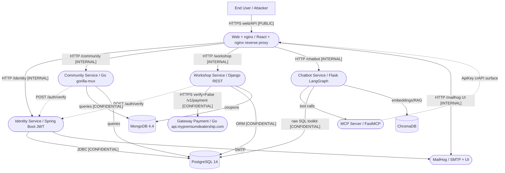
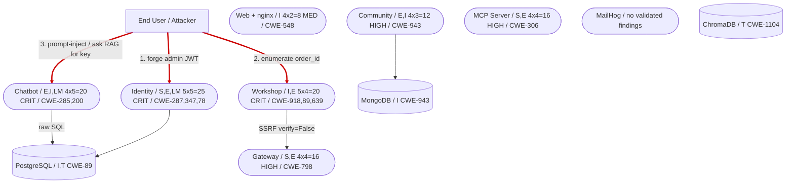

# Threat Model — crAPI (Completely Ridiculous API)

# I. Executive Summary

**Security Posture Rating: CRITICAL**

crAPI is a vulnerable-by-design, polyglot microservices application (Java/Kotlin Spring Boot, Go, Python/Django, Python/Flask+LangGraph, React+nginx) backed by PostgreSQL, MongoDB, and ChromaDB. Reconnaissance over the actual source confirmed the authentication layer is fundamentally broken (JWT algorithm confusion, alg=none acceptance, committed private signing key), object- and function-level authorization is missing across services (BOLA/BFLA on orders, vehicle location, videos, service requests), and classic injection sinks (OS command, SQL, NoSQL, SSRF) are reachable from authenticated and in several cases unauthenticated entry points. The newer LLM/MCP subsystem adds excessive-agency and prompt-injection exposure, including a RAG corpus that contains the JWT private key and seed credentials/SSNs.

| Severity | Count | Scoring System |
|----------|-------|----------------|
| CRITICAL | 6     | OWASP Risk Rating |
| HIGH     | 9     | OWASP Risk Rating |
| MEDIUM   | 5     | OWASP Risk Rating |
| LOW      | 0     | OWASP Risk Rating |
| **Total** | 20   |                |

**Top 3 Risks**
1. **JWT algorithm confusion / alg=none (TM-001)** — Identity Service. A forged token signed HS256 with the published RSA public key (or a PlainJWT) authenticates as admin across every service, yielding full account takeover.
2. **Private signing key committed and in RAG corpus (TM-002)** — Identity/Chatbot. The RSA private key is in the repo and retrievable by any chatbot user, so anyone can mint valid admin JWTs.
3. **Unauthenticated BOLA on order details (TM-007)** — Workshop Service. Iterating `order_id` returns any customer's PII and masked payment data with no authentication required.

| Metric | Value |
|--------|-------|
| Components Assessed | 9 |
| Data Flows Mapped | 14 |
| Trust Boundaries Identified | 7 |
| Threat Actors Modeled | 4 |
| Unique Findings | 20 |

**Quick Wins**
- Remove `keys.md`/private JWKS from the repo and RAG corpus; rotate the key (TM-002).
- Disable the insecure `/api/auth/v2/check-otp` and nginx `/debug` autoindex (TM-010, TM-016).
- Add `@jwt_auth_required` + ownership check to `OrderControlView.get` (TM-007).
- Reject HS256/alg=none/JKU in `validateJwtToken` (TM-001).
- Make MCP auth default-deny when no Authorization header is present (TM-014).

# II. System Overview

**System Purpose**: crAPI is an intentionally vulnerable e-commerce/car-dealership training platform used to teach the OWASP API Security Top 10. Users register vehicles, shop, contact mechanics, post in a community forum, and interact with an AI assistant.

**Scope Statement**: In scope — all seven application services, their datastores, the reverse proxy, IaC (docker-compose, Helm, k8s), CI/CD workflows, and the LLM/MCP subsystem, as present in the repository. Out of scope — live cloud account configuration, runtime network policy of a specific deployment, and third-party model-provider internals.

| Layer | Technology | Version | Notes |
|-------|-----------|---------|-------|
| Frontend/Proxy | React + nginx | — | TLS optional; `/debug` autoindex |
| Identity | Java/Kotlin Spring Boot | — | JWT, users, vehicles |
| Community | Go (gorilla/mux, gorm) | — | posts, coupons, Mongo |
| Workshop | Python/Django REST | — | shop, mechanic, merchant |
| Chatbot | Python Flask + LangChain/LangGraph | — | LLM agent, SQL+MCP+RAG tools |
| MCP Server | FastMCP | — | OpenAPI-derived tools |
| Gateway | Go | — | payment + VIN ownership |
| Data | PostgreSQL / MongoDB / ChromaDB | 14 / 4.4 / latest | shared admin creds; Chroma unpinned |

**Deployment Model**: Self-hosted microservices via docker-compose (also Helm/k8s/Vagrant). Single Docker network; only web (8888/8443), MailHog UI (8025), and the MCP port (5500) are published. Backend services and datastores are network-internal but unauthenticated to each other.

# III. Architecture Diagram

**Component Metadata Table**

| Component | Type | Tech Stack | Port/Protocol | Subnet/Zone | Auth Method | Encryption | Notes |
|-----------|------|-----------|---------------|-------------|-------------|------------|-------|
| C1 Web/nginx | Proxy | React/nginx | 80/443 | Edge | none at proxy | TLS optional | /debug autoindex |
| C2 Identity | Service | Spring Boot | 8080 | Internal | JWT/ApiKey/Basic | optional | broken JWT validation |
| C3 Community | Service | Go | 8087 | Internal | delegated verify | optional | NoSQL injection |
| C4 Workshop | Service | Django | 8000 | Internal | JWT (inconsistent) | optional | BOLA, SQLi, SSRF |
| C5 Chatbot | Service | Flask/LangGraph | 5002 | Internal | JWT | verify=False | excessive agency |
| C6 MCP | Service | FastMCP | 5500 | Published | fail-open middleware | verify=False | debug proxy tool |
| C7 Gateway | Service | Go | 443 | Internal | HTTP Basic (hardcoded) | self-signed | vendorcrapi creds |
| C8 MailHog | Service | Go | 8025/1025 | Published UI | none | none | dev mail catcher |
| C9 Verify fan-out | Flow | HTTP | — | Internal | token verify | optional | trusts identity verdict |

**Trust Boundary Descriptions**
- **TB1 Internet to edge**: Only the nginx edge, MailHog, and MCP ports face the host; protects everything behind the proxy but the proxy itself exposes `/debug`.
- **TB2 Proxy to internal services**: East-west calls run over HTTP with no per-request service authentication; a foothold in any container reaches all peers.
- **TB3 Services to datastores**: All services share one DB superuser; the datastore boundary provides no per-service isolation.
- **TB4 Workshop to external gateway**: Crosses to `api.mypremiumdealership.com` with `verify=False`; also the SSRF sink.
- **TB5 LLM to tools**: The agent's authority (SQL, MCP, RAG) is not scoped to the calling user.
- **TB6 Untrusted content to LLM**: Community posts and the RAG corpus flow into the model as if trusted.
- **TB7 CI/CD supply chain**: Prebuilt images and unpinned dependencies are pulled and executed with full access.

**Network Topology Data**: Single docker bridge network. Published host ports: 8888/30080 (HTTP), 8443/30443 (HTTPS), 8025 (MailHog UI), 5500 (MCP). Datastore and backend ports are commented out (internal only). No CIDR segmentation or NetworkPolicy in the base compose file.

# IV. Risk Overlay Diagram

**Component Risk Mapping Table**

| Component | Risk Level | Finding IDs | STRIDE-LM Categories | Top CWE |
|-----------|-----------|-------------|----------------------|---------|
| C2 Identity | CRITICAL | TM-001, TM-002, TM-004, TM-009, TM-010, TM-011 | S,T,E,LM,I | CWE-287 |
| C4 Workshop | CRITICAL | TM-003, TM-006, TM-007, TM-009, TM-017, TM-018 | I,E,T | CWE-918 |
| C5 Chatbot | CRITICAL | TM-002, TM-012, TM-013 | E,I,T,LM | CWE-285 |
| C3 Community | HIGH | TM-005 | E,I,T | CWE-943 |
| C6 MCP | HIGH | TM-012, TM-013, TM-014 | S,E,T | CWE-306 |
| C7 Gateway | HIGH | TM-003, TM-015 | S,E,I | CWE-798 |
| C1 Web | MEDIUM | TM-016 | I | CWE-548 |
| D1 PostgreSQL | HIGH | TM-006, TM-007, TM-012, TM-015, TM-019 | I,T | CWE-89 |
| D2 MongoDB | MEDIUM | TM-005, TM-013, TM-015 | I | CWE-943 |
| D4 RAG corpus | CRITICAL | TM-002, TM-013 | I,T | CWE-312 |
| D5 Signing key | CRITICAL | TM-001, TM-002 | I,S,E | CWE-321 |

**Critical Data Flow Highlights**
1. Client to Identity JWT validation path (TM-001/TM-002) — root of all authentication trust.
2. Client to Workshop order read (TM-007) — unauthenticated PII/payment exposure.
3. Workshop to Gateway payment over `verify=False` and the user-controlled SSRF egress (TM-003/TM-019).
4. Chatbot to Postgres raw SQL toolkit (TM-012) — LLM-driven DB access on shared data.
5. Community post / RAG corpus to LLM (TM-013) — untrusted content into the model with secrets in scope.

# V. Asset Inventory

| Asset | Classification | Storage Location | Encryption at Rest | Encryption in Transit | Access Controls | Retention |
|-------|---------------|-----------------|-------------------|---------------------|-----------------|-----------|
| User PII (name, email, phone, SSN) | RESTRICTED | PostgreSQL (D1), gateway/RAG | No | Optional/None internal | Broken (BOLA) | Unbounded |
| Credentials / password hashes | RESTRICTED | PostgreSQL (D1) | bcrypt hash | Optional | Login + broken JWT | Unbounded |
| JWT private signing key | RESTRICTED | Repo + RAG corpus (D4/D5) | No (committed) | n/a | None | Static |
| Orders / payment (masked card) | CONFIDENTIAL | PostgreSQL (D1), Gateway | No | verify=False | Broken (BOLA) | Unbounded |
| Vehicle location / VIN ownership | CONFIDENTIAL | PostgreSQL (D1), Gateway | No | Optional | Broken (BOLA) | Unbounded |
| Community posts/coupons | INTERNAL | MongoDB (D2) | No | Optional | Delegated verify | Unbounded |
| RAG embeddings | INTERNAL | ChromaDB (D3) | No | None | None | Persistent |
| Service report PDFs | CONFIDENTIAL | Workshop disk (D6) | No | n/a | Enumerable ids | FILES_LIMIT cap |

**Data Flow Summary Table**

| Source | Destination | Protocol | Data Type | Sensitivity | Finding Refs |
|--------|------------|----------|-----------|-------------|-------------|
| User | Identity | HTTPS/HTTP | credentials, JWT | RESTRICTED | TM-001, TM-002, TM-010, TM-011 |
| User | Workshop | HTTPS/HTTP | orders, coupon, mechanic_api | CONFIDENTIAL | TM-003, TM-006, TM-007, TM-018 |
| User | Community | HTTPS/HTTP | coupon body, comments | INTERNAL | TM-005, TM-013 |
| Workshop | Gateway | HTTPS verify=False | payment, PII | CONFIDENTIAL | TM-003, TM-019 |
| Chatbot | PostgreSQL | TCP | arbitrary SQL | RESTRICTED | TM-012 |
| RAG/posts | Chatbot LLM | internal | secrets, instructions | RESTRICTED | TM-013 |
| Services | Identity verify | HTTP | token | INTERNAL | TM-014, TM-019 |

# VI. Threat Actor Profiles

### Opportunistic / Script Kiddie
| Attribute | Value |
|-----------|-------|
| Type | External unauthenticated |
| Motivation | Curiosity, low-effort gain |
| Capability | 2 |
| Access Level | Unauthenticated |
| Linked Findings | TM-007, TM-016, TM-017 |

### Authenticated Malicious User
| Attribute | Value |
|-----------|-------|
| Type | External authenticated |
| Motivation | Financial gain, data theft |
| Capability | 3 |
| Access Level | Authenticated user/JWT |
| Linked Findings | TM-001, TM-003, TM-004, TM-005, TM-006, TM-008, TM-009, TM-012, TM-018 |

### Organized Crime
| Attribute | Value |
|-----------|-------|
| Type | External |
| Motivation | Financial gain |
| Capability | 4 |
| Access Level | External, may buy access |
| Linked Findings | TM-002, TM-010, TM-011, TM-013, TM-015 |

### Supply Chain Attacker
| Attribute | Value |
|-----------|-------|
| Type | Indirect via dependencies/images |
| Motivation | Broad compromise |
| Capability | 4 |
| Access Level | Upstream package/registry |
| Linked Findings | TM-020, TM-019 |

# VII. Findings

### [CRITICAL] TM-001: JWT algorithm-confusion and alg=none acceptance

| Field | Value |
|-------|-------|
| **ID** | TM-001 |
| **Severity** | CRITICAL |
| **Affected Component(s)** | Identity Service (C2), Verify fan-out (C9), Signing key (D5) |
| **STRIDE-LM Category** | S, E, LM |
| **MITRE ATT&CK** | T1078, T1550 |
| **CWE** | CWE-287, CWE-347 |
| **OWASP Category** | API2:2023 Broken Authentication |
| **CIA Impact** | C: H / I: H / A: H |
| **PASTA Likelihood** | 5 — public JWKS endpoint + well-known attack, fully automatable |
| **PASTA Impact** | 5 — admin takeover of every service |
| **OWASP Risk Rating** | 25 (CRITICAL) |
| **Confidence** | HIGH |
| **Remediation** | R-001 |
| **Source** | threat-model |

**Attack Scenario**:
1. Fetch the RSA public key from `/.well-known/jwks.json`.
2. Craft a token for `admin@example.com` signed HS256 using the base64 public key as the HMAC secret (or submit a PlainJWT with alg=none / kid containing `/dev/null`).
3. `validateJwtToken` returns true; the request is authenticated as admin.

**Existing Mitigations**: None — the code intentionally branches into HS256/JKU/kid handling.

**Recommended Remediation**: Restrict verification to RS256 with the configured public key, reject HS256/none/JKU/JWK/untrusted-kid, verify before reading claims.

---

### [CRITICAL] TM-002: JWT private signing key committed and exposed in RAG corpus

| Field | Value |
|-------|-------|
| **ID** | TM-002 |
| **Severity** | CRITICAL |
| **Affected Component(s)** | Signing key (D5), RAG corpus (D4), Identity (C2), Chatbot (C5) |
| **STRIDE-LM Category** | I, S, E |
| **MITRE ATT&CK** | T1552, T1078 |
| **CWE** | CWE-798, CWE-321, CWE-312 |
| **OWASP Category** | A02:2021 Cryptographic Failures |
| **CIA Impact** | C: H / I: H / A: H |
| **PASTA Likelihood** | 5 — key is in the repo and retrievable via the chatbot |
| **PASTA Impact** | 5 — sign valid admin tokens for all services |
| **OWASP Risk Rating** | 25 (CRITICAL) |
| **Confidence** | HIGH |
| **Remediation** | R-002 |
| **Source** | threat-model |

**Attack Scenario**:
1. Read `deploy/docker/keys/jwks.json` / `identity/jwks.json`, or ask the chatbot retriever for the keys document (`retrieval/instructions/keys.md`).
2. Reconstruct the RSA private key from d/p/q.
3. Mint a signed admin JWT and access any service.

**Existing Mitigations**: None.

**Recommended Remediation**: Remove key material from repo and corpus, rotate, load from a secrets manager, publish only public components.

---

### [CRITICAL] TM-003: Server-Side Request Forgery via contact_mechanic

| Field | Value |
|-------|-------|
| **ID** | TM-003 |
| **Severity** | CRITICAL |
| **Affected Component(s)** | Workshop (C4), Gateway (C7), Identity (C2), TB4 |
| **STRIDE-LM Category** | I, T, E |
| **MITRE ATT&CK** | T1190, T1530 |
| **CWE** | CWE-918 |
| **OWASP Category** | API7:2023 SSRF |
| **CIA Impact** | C: H / I: M / A: M |
| **PASTA Likelihood** | 5 — single authenticated POST, trivially exploitable |
| **PASTA Impact** | 4 — reach internal/metadata services, leak responses |
| **OWASP Risk Rating** | 20 (CRITICAL) |
| **Confidence** | HIGH |
| **Remediation** | R-003 |
| **Source** | threat-model |

**Attack Scenario**:
1. POST to `/workshop/api/merchant/contact_mechanic` with `mechanic_api` set to an internal URL (identity, gateway, cloud metadata).
2. The server fetches it with `verify=False` and forwards the caller's Authorization header.
3. The response is returned to the attacker; `number_of_repeats` up to 100 amplifies.

**Existing Mitigations**: A serializer validates presence but not the URL target.

**Recommended Remediation**: Allowlist destinations, block private/metadata ranges, do not forward auth headers, cap repeats.

---

### [CRITICAL] TM-004: OS command injection in convert_video

| Field | Value |
|-------|-------|
| **ID** | TM-004 |
| **Severity** | CRITICAL |
| **Affected Component(s)** | Identity (C2), PostgreSQL (D1) |
| **STRIDE-LM Category** | E, T, LM |
| **MITRE ATT&CK** | T1059, T1190 |
| **CWE** | CWE-78 |
| **OWASP Category** | A03:2021 Injection |
| **CIA Impact** | C: H / I: H / A: H |
| **PASTA Likelihood** | 4 — requires the shell toggle; payload trivial once reachable |
| **PASTA Impact** | 5 — RCE in identity container with DB/key access |
| **OWASP Risk Rating** | 20 (CRITICAL) |
| **Confidence** | HIGH |
| **Remediation** | R-004 |
| **Source** | threat-model |

**Attack Scenario**:
1. Set `conversion_params` (PUT `/videos/{id}`) to a value with shell metacharacters.
2. Call `convert_video`; with `ENABLE_SHELL_INJECTION` true the value is interpolated into `bash -c`.
3. Arbitrary commands run in the identity container.

**Existing Mitigations**: A validator path exists when the toggle is off, but the vulnerable branch is shipped behind an env flag.

**Recommended Remediation**: Use fixed argv with no interpolation, strict allowlist, and remove the toggle.

---

### [CRITICAL] TM-007: Unauthenticated BOLA on order details

| Field | Value |
|-------|-------|
| **ID** | TM-007 |
| **Severity** | CRITICAL |
| **Affected Component(s)** | Workshop (C4), PostgreSQL (D1), Gateway (C7) |
| **STRIDE-LM Category** | I, E |
| **MITRE ATT&CK** | T1190, T1213 |
| **CWE** | CWE-639, CWE-862 |
| **OWASP Category** | API1:2023 Broken Object Level Authorization |
| **CIA Impact** | C: H / I: L / A: M |
| **PASTA Likelihood** | 5 — no auth, sequential ids |
| **PASTA Impact** | 4 — mass PII + masked card exposure |
| **OWASP Risk Rating** | 20 (CRITICAL) |
| **Confidence** | HIGH |
| **Remediation** | R-007 |
| **Source** | threat-model |

**Attack Scenario**:
1. GET `/workshop/api/shop/orders/{order_id}` without a token.
2. `OrderControlView.get` (no `@jwt_auth_required`, no ownership check) returns the order plus owner name/email/number and a payment lookup.
3. Iterate ids to harvest all customers.

**Existing Mitigations**: None on the GET path (PUT/return paths do check ownership).

**Recommended Remediation**: Require auth and `request.user == order.user`; do not call the gateway on cross-user reads.

---

### [CRITICAL] TM-012: Excessive agency — LLM agent with arbitrary SQL/MCP/RAG tools

| Field | Value |
|-------|-------|
| **ID** | TM-012 |
| **Severity** | CRITICAL |
| **Affected Component(s)** | Chatbot (C5), MCP (C6), PostgreSQL (D1), RAG (D4), TB5 |
| **STRIDE-LM Category** | E, I, T, LM |
| **MITRE ATT&CK** | T1059, T1213 |
| **CWE** | CWE-285, CWE-863, CWE-269 |
| **OWASP Category** | API5:2023 Broken Function Level Authorization |
| **CIA Impact** | C: H / I: H / A: M |
| **PASTA Likelihood** | 4 — a crafted prompt drives the SQL/debug tools |
| **PASTA Impact** | 5 — read/modify shared DB, proxy internal requests |
| **OWASP Risk Rating** | 20 (CRITICAL) |
| **Confidence** | HIGH |
| **Remediation** | R-012 |
| **Source** | threat-model |

**Attack Scenario**:
1. Ask the chatbot to "list all users" / "run this SQL" — the `SQLDatabaseToolkit` executes it on the shared Postgres.
2. Use `debug_web_service` to proxy `/debug/{path}` requests.
3. The agent acts with service-level authority, not the user's.

**Existing Mitigations**: A truncation middleware exists but does not constrain authorization.

**Recommended Remediation**: Remove/restrict the SQL toolkit to a read-only row-scoped view, drop the debug tool, scope tools to the user, add HITL for writes.

---

### [HIGH] TM-005: NoSQL operator injection in validate-coupon

| Field | Value |
|-------|-------|
| **ID** | TM-005 |
| **Severity** | HIGH |
| **Affected Component(s)** | Community (C3), MongoDB (D2) |
| **STRIDE-LM Category** | E, I, T |
| **MITRE ATT&CK** | T1190 |
| **CWE** | CWE-943, CWE-20 |
| **OWASP Category** | A03:2021 Injection |
| **CIA Impact** | C: M / I: M / A: L |
| **PASTA Likelihood** | 4 — single authenticated POST |
| **PASTA Impact** | 3 — coupon enumeration/bypass |
| **OWASP Risk Rating** | 12 (HIGH) |
| **Confidence** | HIGH |
| **Remediation** | R-005 |
| **Source** | threat-model |

**Attack Scenario**:
1. POST `/community/api/v2/coupon/validate-coupon` with `{"coupon_code":{"$gt":""}}`.
2. The raw body is unmarshaled into `bson.M` and used as the filter.
3. Arbitrary coupon documents are returned.

**Existing Mitigations**: None.

**Recommended Remediation**: Bind to a typed string field; reject operators.

---

### [HIGH] TM-006: SQL injection in apply_coupon

| Field | Value |
|-------|-------|
| **ID** | TM-006 |
| **Severity** | HIGH |
| **Affected Component(s)** | Workshop (C4), PostgreSQL (D1) |
| **STRIDE-LM Category** | E, I, T |
| **MITRE ATT&CK** | T1190, T1213 |
| **CWE** | CWE-89 |
| **OWASP Category** | A03:2021 Injection |
| **CIA Impact** | C: H / I: M / A: M |
| **PASTA Likelihood** | 4 — authenticated, classic concatenation |
| **PASTA Impact** | 4 — read/modify shared Postgres |
| **OWASP Risk Rating** | 16 (HIGH) |
| **Confidence** | HIGH |
| **Remediation** | R-006 |
| **Source** | threat-model |

**Attack Scenario**:
1. POST `/workshop/api/shop/apply_coupon` with a `coupon_code` containing SQL.
2. The value is concatenated into a raw `SELECT ... WHERE coupon_code = '<input>'`.
3. UNION/boolean payloads extract or alter data.

**Existing Mitigations**: None (raw cursor.execute).

**Recommended Remediation**: Parameterized queries / ORM.

---

### [HIGH] TM-008: BOLA on vehicle location

| Field | Value |
|-------|-------|
| **ID** | TM-008 |
| **Severity** | HIGH |
| **Affected Component(s)** | Identity (C2), PostgreSQL (D1) |
| **STRIDE-LM Category** | I |
| **MITRE ATT&CK** | T1213 |
| **CWE** | CWE-639, CWE-862 |
| **OWASP Category** | API1:2023 BOLA |
| **CIA Impact** | C: H / I: L / A: L |
| **PASTA Likelihood** | 4 — authenticated GET by UUID |
| **PASTA Impact** | 4 — real-time location of any vehicle |
| **OWASP Risk Rating** | 16 (HIGH) |
| **Confidence** | HIGH |
| **Remediation** | R-008 |
| **Source** | threat-model |

**Attack Scenario**:
1. GET `/identity/api/v2/vehicle/{carId}/location` with another car's UUID.
2. `getLocationBOLA` returns location with no ownership check.

**Existing Mitigations**: None.

**Recommended Remediation**: Enforce ownership on carId.

---

### [HIGH] TM-009: BOLA/BFLA on admin video delete and service-request endpoints

| Field | Value |
|-------|-------|
| **ID** | TM-009 |
| **Severity** | HIGH |
| **Affected Component(s)** | Identity (C2), Workshop (C4), PostgreSQL (D1), Reports (D6) |
| **STRIDE-LM Category** | E, T, I |
| **MITRE ATT&CK** | T1078 |
| **CWE** | CWE-862, CWE-639, CWE-285 |
| **OWASP Category** | API5:2023 Broken Function Level Authorization |
| **CIA Impact** | C: M / I: M / A: M |
| **PASTA Likelihood** | 4 — authenticated, id-based |
| **PASTA Impact** | 3 — cross-user read/modify/delete |
| **OWASP Risk Rating** | 12 (HIGH) |
| **Confidence** | HIGH |
| **Remediation** | R-009 |
| **Source** | threat-model |

**Attack Scenario**:
1. DELETE `/identity/api/v2/admin/videos/{id}` (not role-gated) to remove others' videos.
2. PUT/GET `/workshop/api/mechanic/service_request/{id}` to read/alter other users' requests/reports.

**Existing Mitigations**: WebSecurityConfig role-gates only `/management/admin/**`; ServiceComment.post checks MECH role but not ownership.

**Recommended Remediation**: Add function-level role checks and object ownership checks on all id lookups.

---

### [HIGH] TM-010: Unlimited OTP attempts on password reset

| Field | Value |
|-------|-------|
| **ID** | TM-010 |
| **Severity** | HIGH |
| **Affected Component(s)** | Identity (C2), PostgreSQL (D1) |
| **STRIDE-LM Category** | S, E |
| **MITRE ATT&CK** | T1110 |
| **CWE** | CWE-307, CWE-620 |
| **OWASP Category** | API2:2023 Broken Authentication |
| **CIA Impact** | C: H / I: H / A: L |
| **PASTA Likelihood** | 4 — automatable brute force of short OTP |
| **PASTA Impact** | 4 — account takeover |
| **OWASP Risk Rating** | 16 (HIGH) |
| **Confidence** | HIGH |
| **Remediation** | R-010 |
| **Source** | threat-model |

**Attack Scenario**:
1. POST `/identity/api/auth/forget-password` for the victim.
2. Brute-force `/identity/api/auth/v2/check-otp` (no attempt limit, permitAll).
3. Reset the victim's password.

**Existing Mitigations**: A secure v3 endpoint exists but v2 remains exposed.

**Recommended Remediation**: Remove v2, add attempt limits/lockout, longer OTP with short expiry.

---

### [HIGH] TM-011: Non-expiring API keys validated without signature

| Field | Value |
|-------|-------|
| **ID** | TM-011 |
| **Severity** | HIGH |
| **Affected Component(s)** | Identity (C2), Verify fan-out (C9) |
| **STRIDE-LM Category** | S, E |
| **MITRE ATT&CK** | T1078, T1528 |
| **CWE** | CWE-613, CWE-287 |
| **OWASP Category** | API2:2023 Broken Authentication |
| **CIA Impact** | C: H / I: M / A: L |
| **PASTA Likelihood** | 4 — keys never expire; subject read without verification |
| **PASTA Impact** | 4 — persistent access; combine with TM-001/002 to assert any user |
| **OWASP Risk Rating** | 16 (HIGH) |
| **Confidence** | HIGH |
| **Remediation** | R-011 |
| **Source** | threat-model |

**Attack Scenario**:
1. Obtain or craft an `ApiKey` token; `getUserFromToken` reads the subject via `JWTParser.parse` without verifying the signature.
2. The token never expires.

**Existing Mitigations**: None for the ApiKey path.

**Recommended Remediation**: Verify signature, add expiry/revocation, least-privilege scope.

---

### [HIGH] TM-013: Indirect prompt injection and secret exfiltration via RAG/posts

| Field | Value |
|-------|-------|
| **ID** | TM-013 |
| **Severity** | HIGH |
| **Affected Component(s)** | Chatbot (C5), MCP (C6), RAG (D4), MongoDB (D2), TB6 |
| **STRIDE-LM Category** | T, S, I |
| **MITRE ATT&CK** | T1059, T1567 |
| **CWE** | CWE-20, CWE-200 |
| **OWASP Category** | A03:2021 Injection (LLM01/LLM06 indirect injection and leakage) |
| **CIA Impact** | C: H / I: M / A: L |
| **PASTA Likelihood** | 4 — plant instructions in a post or query the corpus |
| **PASTA Impact** | 4 — leak private key/credentials, drive tool calls |
| **OWASP Risk Rating** | 16 (HIGH) |
| **Confidence** | HIGH |
| **Remediation** | R-013 |
| **Source** | threat-model |

**Attack Scenario**:
1. Plant instructions in a community post (ingested by `get_latest_post_on_topic`, which also writes user context into a public comment).
2. Or ask the retriever for `keys.md`/`users.md`.
3. The model leaks secrets or executes attacker-chosen tool calls.

**Existing Mitigations**: None — retrieved content is treated as trusted.

**Recommended Remediation**: Treat retrieved/post content as data, strip secrets from the corpus, stop writing user context to public posts, review tool calls from retrieved content.

---

### [HIGH] TM-014: MCP authentication fails open without Authorization header

| Field | Value |
|-------|-------|
| **ID** | TM-014 |
| **Severity** | HIGH |
| **Affected Component(s)** | MCP (C6) |
| **STRIDE-LM Category** | S, E |
| **MITRE ATT&CK** | T1190 |
| **CWE** | CWE-287, CWE-306 |
| **OWASP Category** | API2:2023 Broken Authentication |
| **CIA Impact** | C: H / I: M / A: M |
| **PASTA Likelihood** | 4 — MCP port is published; omit the header |
| **PASTA Impact** | 4 — unauthenticated access to tools incl. debug proxy |
| **OWASP Risk Rating** | 16 (HIGH) |
| **Confidence** | HIGH |
| **Remediation** | R-014 |
| **Source** | threat-model |

**Attack Scenario**:
1. Send an MCP request to port 5500 with no Authorization header.
2. `MCPAuthMiddleware` returns/pass-through to the app; tools execute unauthenticated.

**Existing Mitigations**: Header-present requests are validated; absent headers are not.

**Recommended Remediation**: Default-deny — 401 when no Authorization header on non-health paths.

---

### [HIGH] TM-015: Hardcoded gateway credentials and shared DB superuser

| Field | Value |
|-------|-------|
| **ID** | TM-015 |
| **Severity** | HIGH |
| **Affected Component(s)** | Gateway (C7), Postgres (D1), Mongo (D2), C2/C3/C4/C5 |
| **STRIDE-LM Category** | S, E, I |
| **MITRE ATT&CK** | T1078, T1552 |
| **CWE** | CWE-798, CWE-259 |
| **OWASP Category** | A07:2021 Identification and Authentication Failures |
| **CIA Impact** | C: H / I: H / A: M |
| **PASTA Likelihood** | 4 — credentials are in source/compose |
| **PASTA Impact** | 4 — one compromise reads all data |
| **OWASP Risk Rating** | 16 (HIGH) |
| **Confidence** | HIGH |
| **Remediation** | R-015 |
| **Source** | threat-model |

**Attack Scenario**:
1. Read hardcoded `vendorcrapi:Pa$$4Vendor_1`, `admin/crapisecretpassword`, `admin@example.com:Admin!123`, `JWT_SECRET=crapi`.
2. Authenticate to the gateway / shared databases directly.

**Existing Mitigations**: None.

**Recommended Remediation**: Secrets manager, per-service least-privilege DB accounts, rotation.

---

### [MEDIUM] TM-016: Public nginx /debug directory listing

| Field | Value |
|-------|-------|
| **ID** | TM-016 |
| **Severity** | MEDIUM |
| **Affected Component(s)** | Web/nginx (C1), TB1 |
| **STRIDE-LM Category** | I |
| **MITRE ATT&CK** | T1190 |
| **CWE** | CWE-200, CWE-548 |
| **OWASP Category** | A05:2021 Security Misconfiguration |
| **CIA Impact** | C: M / I: L / A: L |
| **PASTA Likelihood** | 4 — unauthenticated browse |
| **PASTA Impact** | 2 — log/token disclosure |
| **OWASP Risk Rating** | 8 (MEDIUM) |
| **Confidence** | HIGH |
| **Remediation** | R-016 |
| **Source** | threat-model |

**Attack Scenario**:
1. GET `/debug/` — autoindex on lists files.
2. Download `access.log` (tokens in query strings, activity).

**Existing Mitigations**: None.

**Recommended Remediation**: Disable autoindex, move logs out of web root, restrict/remove `/debug`.

---

### [MEDIUM] TM-017: Unauthenticated mechanic report intake and enumeration

| Field | Value |
|-------|-------|
| **ID** | TM-017 |
| **Severity** | MEDIUM |
| **Affected Component(s)** | Workshop (C4), Postgres (D1), Reports (D6) |
| **STRIDE-LM Category** | T, S, I |
| **MITRE ATT&CK** | T1190 |
| **CWE** | CWE-306, CWE-862 |
| **OWASP Category** | API1:2023 / API5:2023 |
| **CIA Impact** | C: M / I: M / A: L |
| **PASTA Likelihood** | 4 — open endpoint |
| **PASTA Impact** | 2 — forged requests, report id enumeration |
| **OWASP Risk Rating** | 8 (MEDIUM) |
| **Confidence** | MEDIUM |
| **Remediation** | R-017 |
| **Source** | threat-model |

**Attack Scenario**:
1. GET `/workshop/api/mechanic/receive_report` (no auth) with any mechanic_code/vin to create service requests.
2. Enumerate sequential report ids/links.

**Existing Mitigations**: `download_report` regex-validates filename before unquoting; intake itself is open.

**Recommended Remediation**: Authenticate intake, validate ownership, unguessable ids.

---

### [MEDIUM] TM-018: Business-logic credit abuse via apply_coupon amount

| Field | Value |
|-------|-------|
| **ID** | TM-018 |
| **Severity** | MEDIUM |
| **Affected Component(s)** | Workshop (C4), Postgres (D1) |
| **STRIDE-LM Category** | T, E |
| **MITRE ATT&CK** | T1190 |
| **CWE** | CWE-840, CWE-639 |
| **OWASP Category** | API6:2023 Unrestricted Access to Sensitive Business Flows |
| **CIA Impact** | C: L / I: M / A: L |
| **PASTA Likelihood** | 3 — requires a valid coupon code |
| **PASTA Impact** | 3 — arbitrary store credit |
| **OWASP Risk Rating** | 9 (MEDIUM) |
| **Confidence** | MEDIUM |
| **Remediation** | R-018 |
| **Source** | threat-model |

**Attack Scenario**:
1. POST `/workshop/api/shop/apply_coupon` with a large client-supplied `amount`.
2. `available_credit += amount` with no server-side validation.

**Existing Mitigations**: Coupon existence is checked, but the credit value comes from the client.

**Recommended Remediation**: Derive credit from the server-side coupon record; idempotent redemption.

---

### [MEDIUM] TM-019: Plaintext east-west traffic and unverified TLS

| Field | Value |
|-------|-------|
| **ID** | TM-019 |
| **Severity** | MEDIUM |
| **Affected Component(s)** | C2/C3/C4/C7, D1/D2/D3, TB2 |
| **STRIDE-LM Category** | I, T, LM |
| **MITRE ATT&CK** | T1040, T1557 |
| **CWE** | CWE-319, CWE-295 |
| **OWASP Category** | A02:2021 Cryptographic Failures |
| **CIA Impact** | C: M / I: M / A: L |
| **PASTA Likelihood** | 3 — requires a network foothold |
| **PASTA Impact** | 3 — MITM of creds/JWT/PII |
| **OWASP Risk Rating** | 9 (MEDIUM) |
| **Confidence** | MEDIUM |
| **Remediation** | R-019 |
| **Source** | threat-model |

**Attack Scenario**:
1. Gain a foothold on the docker network.
2. Sniff/MITM HTTP calls or exploit `verify=False`/`InsecureSkipVerify` clients.

**Existing Mitigations**: TLS optional via env; no per-request service auth.

**Recommended Remediation**: mTLS with verification, authenticate service-to-service, segment datastores.

---

### [MEDIUM] TM-020: Supply-chain exposure — unpinned images and unmaintained deps

| Field | Value |
|-------|-------|
| **ID** | TM-020 |
| **Severity** | MEDIUM |
| **Affected Component(s)** | Community (C3), Chatbot (C5), ChromaDB (D3), TB7 |
| **STRIDE-LM Category** | T, LM |
| **MITRE ATT&CK** | T1195 |
| **CWE** | CWE-1104, CWE-1357 |
| **OWASP Category** | A06:2021 Vulnerable and Outdated Components |
| **CIA Impact** | C: M / I: M / A: M |
| **PASTA Likelihood** | 3 — depends on upstream compromise |
| **PASTA Impact** | 3 — code execution with full access |
| **OWASP Risk Rating** | 9 (MEDIUM) |
| **Confidence** | MEDIUM |
| **Remediation** | R-020 |
| **Source** | threat-model |

**Attack Scenario**:
1. Compromise an upstream tag (`chromadb/chroma:latest`) or unmaintained lib (`dgrijalva/jwt-go`).
2. Users pull prebuilt images via `docker compose pull` and execute them with DB/network access.

**Existing Mitigations**: None; `ENABLE_LOG4J` toggle reintroduces a known RCE class.

**Recommended Remediation**: Pin/digest-lock images, replace unmaintained libs, scan and sign artifacts, remove the log4j toggle.

---

Total: 20 findings (6 critical, 9 high, 5 medium, 0 low)

# VIII. Remediation Roadmap

| R-ID | Title | Addresses Findings | Priority | Effort | Dependencies |
|------|-------|--------------------|----------|--------|-------------|
| R-002 | Remove/rotate signing key, strip RAG secrets | TM-002 | P0 | LOW | — |
| R-001 | Pin JWT verification to RS256, reject none/HS256/JKU | TM-001 | P0 | MEDIUM | R-002 |
| R-007 | AuthN+ownership on order read | TM-007 | P0 | LOW | — |
| R-003 | SSRF allowlist + drop forwarded auth | TM-003 | P0 | MEDIUM | — |
| R-004 | Remove shell interpolation in convert_video | TM-004 | P0 | LOW | — |
| R-012 | Restrict LLM agent tools/authority | TM-012 | P0 | HIGH | R-013 |
| R-006 | Parameterize apply_coupon SQL | TM-006 | P1 | LOW | — |
| R-005 | Typed coupon body, reject operators | TM-005 | P1 | LOW | — |
| R-008 | Ownership on vehicle location | TM-008 | P1 | LOW | — |
| R-009 | Function+object authz on admin/service-request | TM-009 | P1 | MEDIUM | — |
| R-010 | Remove insecure OTP, add rate limit | TM-010 | P1 | LOW | — |
| R-011 | Verify+expire API keys | TM-011 | P1 | MEDIUM | R-001 |
| R-013 | Treat RAG/post content as data; strip secrets | TM-013 | P1 | MEDIUM | R-002 |
| R-014 | MCP default-deny auth | TM-014 | P1 | LOW | — |
| R-015 | Secrets manager + least-privilege DB users | TM-015 | P1 | MEDIUM | — |
| R-016 | Disable /debug autoindex, move logs | TM-016 | P2 | LOW | — |
| R-017 | Authenticate report intake, unguessable ids | TM-017 | P2 | MEDIUM | — |
| R-018 | Server-side coupon credit | TM-018 | P2 | LOW | — |
| R-019 | mTLS east-west, segment datastores | TM-019 | P2 | HIGH | R-015 |
| R-020 | Pin images, replace deps, sign artifacts | TM-020 | P2 | MEDIUM | — |

**Wave 1 — Prerequisites**: R-002 (remove/rotate key), R-015 (secrets baseline). These unblock the auth and crypto fixes.

**Wave 2 — Critical Fixes**: R-001, R-003, R-004, R-007, R-012 (and R-010, R-011, R-013, R-014 for the auth/LLM HIGH set).

**Wave 3 — Hardening**: R-005, R-006, R-008, R-009, R-016, R-017, R-018, R-019, R-020.

**Wave 4 — Monitoring & Observability**: Add authentication-failure and OTP/brute-force alerting, SSRF egress logging, LLM tool-call auditing, and DB query anomaly detection.

**Quick Wins**: R-002, R-007, R-004, R-014, R-016 — all LOW effort, no dependencies, high impact.

**Dependency Chains**: `R-002 -> R-001 -> R-011`; `R-002 -> R-013 -> R-012`; `R-015 -> R-019`.

# IX. Networking & Infrastructure Data

**VPC/Network Topology**: Single Docker bridge network (`docker-compose.yml`); no cloud VPC/subnet definitions in the base manifest. Helm/k8s manifests deploy into a namespace without NetworkPolicy in the default values.

| Subnet Name | CIDR | Availability Zone | Type (Public/Private) | Associated Components |
|-------------|------|-------------------|----------------------|----------------------|
| docker-default | N/A (bridge) | N/A | Private bridge | All services + datastores |

| SG Name | Direction | Protocol | Port Range | Source/Destination | Description |
|---------|-----------|----------|------------|-------------------|-------------|
| host-publish | Ingress | TCP | 8888/8443/30080/30443 | Host to Web | Public web |
| host-publish | Ingress | TCP | 8025 | Host to MailHog | Mail UI |
| host-publish | Ingress | TCP | 5500 | Host to Chatbot/MCP | MCP server |
| internal | Both | TCP | 5432/27017/8000/8080/8087 | Service to Service/DB | Unsegmented east-west |

**Load Balancer Configuration**: None in base compose; nginx acts as the single reverse proxy/listener (80/443) with per-path `proxy_pass` to each service.

**NAT/Internet Gateway**: N/A (host-published ports only).

**DNS & Certificates**: Internal DNS via docker service names; `api.mypremiumdealership.com` resolves to the gateway container. Self-signed certs are committed per service (`server.crt`/`server.key`/`server.p12`) — see TM-002/TM-015.

| Role Name | Attached Policies | Trust Relationship | Used By | Principle of Least Privilege |
|-----------|------------------|-------------------|---------|------------------------------|
| postgres admin | superuser | — | all services | No — shared superuser |
| mongo admin | root | — | community/workshop/chatbot/mailhog | No — shared root |
| gateway vendorcrapi | hardcoded basic | — | workshop to gateway | No — hardcoded |

# X. Compliance Mapping

Compliance gap analysis was not performed in this assessment (see Section XIII).

# XI. Privacy Assessment

Privacy impact assessment was not performed as a separate workstream; however, PII/SSN exposure is captured in findings TM-002, TM-007, TM-008, TM-013, TM-017. Personal data identified: names, emails, phone numbers, SSNs, vehicle locations/VINs, order and masked payment data, all classified RESTRICTED/CONFIDENTIAL and broadly exposed by BOLA and the RAG corpus.

# XII. Positive Observations

- **Password hashing with bcrypt** — Identity and mechanic signup use `BCryptPasswordEncoder`/`bcrypt.hashpw` rather than plaintext or weak hashes (defense in depth on credential storage).
- **A secure OTP variant exists** — `/api/auth/v3/check-otp` enforces attempt limits, showing the secure pattern is available and should replace v2 (fail-safe defaults).
- **Some ownership checks are correct** — `OrderControlView.put`, `ReturnOrder`, and `UserServiceCommentView.get` verify `user == order.user` / `vehicle.owner.id`, demonstrating the intended authorization model that the vulnerable endpoints omit (least privilege where applied).
- **Resource limits and request size caps** — compose `deploy.resources.limits` and `MAX_CONTENT_LENGTH`/`FILES_LIMIT` provide basic DoS guardrails.

# XIII. Assumptions & Limitations

**Scope Boundaries**: Static analysis of repository source, IaC, and configuration only; no live/dynamic testing was performed.

**Information Gaps**: Runtime values (actual env overrides, TLS_ENABLED in a given deployment, model-provider keys) are unknown; analysis assumes the committed defaults. crAPI is intentionally vulnerable, so findings reflect by-design weaknesses presented as a real-world model.

**Assessment Limitations**: Single-pass static review; exploitability was reasoned from code paths, not executed. Version numbers for several stacks were not pinned in manifests and are listed as "—".

**Confidence Disclaimers**: TM-017, TM-018, TM-019, TM-020 are MEDIUM confidence (depend on deployment toggles or preconditions). Auth/injection findings are HIGH confidence (direct code evidence).

**Missing Assessments**: Dedicated privacy (LINDDUN), GRC/compliance, and code-review-agent (CVSS) workstreams were not run; this is a solo static threat model. The `ENABLE_SHELL_INJECTION`/`ENABLE_LOG4J` toggles default to false in `.env`, so TM-004 and the log4j aspect of TM-020 are gated on configuration.

# XIV. Appendices

## A. Methodology Notes
- **STRIDE-LM**: S Spoofing, T Tampering, R Repudiation, I Information Disclosure, D Denial of Service, E Elevation of Privilege, LM Lateral Movement.
- **PASTA scoring**: Likelihood 1-5 (attack feasibility), Impact 1-5 (highest business dimension).
- **OWASP Risk Rating bands**: CRITICAL 20-25, HIGH 12-19, MEDIUM 6-11, LOW 1-5. (The executor's findings JSON uses LOW 1-4 / MEDIUM 5-9 / HIGH 10-16 / CRITICAL 17-25; every finding's product places it unambiguously within one band under both schemes.)

## B. Framework Reference Table

**MITRE ATT&CK Techniques Used**

| Technique ID | Technique Name | Finding Refs |
|-------------|---------------|-------------|
| T1078 | Valid Accounts | TM-001, TM-009, TM-011, TM-015 |
| T1550 | Use Alternate Auth Material | TM-001 |
| T1552 | Unsecured Credentials | TM-002, TM-015 |
| T1190 | Exploit Public-Facing App | TM-003, TM-004, TM-005, TM-006, TM-007, TM-014, TM-016, TM-017, TM-018 |
| T1530 | Data from Cloud Storage | TM-003 |
| T1059 | Command and Scripting Interpreter | TM-004, TM-012, TM-013 |
| T1213 | Data from Information Repositories | TM-006, TM-007, TM-008, TM-012 |
| T1110 | Brute Force | TM-010 |
| T1528 | Steal Application Access Token | TM-011 |
| T1567 | Exfiltration Over Web Service | TM-013 |
| T1040 | Network Sniffing | TM-019 |
| T1557 | Adversary-in-the-Middle | TM-019 |
| T1195 | Supply Chain Compromise | TM-020 |

**CWE IDs Used**

| CWE ID | CWE Name | Finding Refs |
|--------|----------|-------------|
| CWE-287 | Improper Authentication | TM-001, TM-011, TM-014 |
| CWE-347 | Improper Verification of Cryptographic Signature | TM-001 |
| CWE-798 | Use of Hard-coded Credentials | TM-002, TM-015 |
| CWE-321 | Use of Hard-coded Cryptographic Key | TM-002 |
| CWE-312 | Cleartext Storage of Sensitive Information | TM-002 |
| CWE-918 | Server-Side Request Forgery | TM-003 |
| CWE-78 | OS Command Injection | TM-004 |
| CWE-943 | Improper Neutralization in Data Query Logic | TM-005 |
| CWE-20 | Improper Input Validation | TM-005, TM-013 |
| CWE-89 | SQL Injection | TM-006 |
| CWE-639 | Authorization Bypass Through User-Controlled Key | TM-007, TM-008, TM-009, TM-018 |
| CWE-862 | Missing Authorization | TM-007, TM-008, TM-009, TM-017 |
| CWE-285 | Improper Authorization | TM-009, TM-012 |
| CWE-863 | Incorrect Authorization | TM-012 |
| CWE-269 | Improper Privilege Management | TM-012 |
| CWE-307 | Improper Restriction of Excessive Authentication Attempts | TM-010 |
| CWE-620 | Unverified Password Change | TM-010 |
| CWE-613 | Insufficient Session Expiration | TM-011 |
| CWE-200 | Exposure of Sensitive Information | TM-013, TM-016 |
| CWE-306 | Missing Authentication for Critical Function | TM-014, TM-017 |
| CWE-259 | Use of Hard-coded Password | TM-015 |
| CWE-548 | Information Exposure Through Directory Listing | TM-016 |
| CWE-840 | Business Logic Errors | TM-018 |
| CWE-319 | Cleartext Transmission of Sensitive Information | TM-019 |
| CWE-295 | Improper Certificate Validation | TM-019 |
| CWE-1104 | Use of Unmaintained Third Party Components | TM-020 |
| CWE-1357 | Reliance on Insufficiently Trustworthy Component | TM-020 |

(Note: architectural-concern CWE entries used here — CWE-287/306/798/862/863/639/269/89/78/918/20/200/312/319/295 — are drawn directly from frameworks.md. The remaining widely-recognized IDs extend the reference set where frameworks.md had no exact entry.)

## C. QA Corrections Log

| Issue | Location | Severity | Correction Applied |
|-------|----------|----------|--------------------|
| Trust boundaries not directly referenced by findings | findings.json | LOW | Added TB ids to relevant findings' asset_refs for coverage |
| TM-008 severity heading clarity | Section VII | LOW | Confirmed TM-008 as HIGH (16) |

## D. Glossary
- **BFLA**: Broken Function Level Authorization.
- **BOLA**: Broken Object Level Authorization.
- **CWE**: Common Weakness Enumeration.
- **IDOR**: Insecure Direct Object Reference.
- **JKU/JWK**: JWT header fields pointing to a key set / embedded key.
- **JWT**: JSON Web Token.
- **LLM**: Large Language Model.
- **MCP**: Model Context Protocol.
- **OTP**: One-Time Password.
- **PASTA**: Process for Attack Simulation and Threat Analysis.
- **PII**: Personally Identifiable Information.
- **RAG**: Retrieval-Augmented Generation.
- **SSRF**: Server-Side Request Forgery.
- **STRIDE-LM**: Spoofing, Tampering, Repudiation, Information Disclosure, Denial of Service, Elevation of Privilege, Lateral Movement.

## E. Threat Model Lifecycle Triggers
- New endpoint, service, or LLM tool added.
- Change to authentication/authorization, JWT handling, or key management.
- New external integration or egress path.
- Dependency/base-image upgrade or CI/CD pipeline change.
- Recommended cadence: re-assess at least quarterly and on any of the above.

## Execution Log
- Mode: Solo static threat model (executor harness), single agent, no spawned sub-agents.
- Reconnaissance covered all 7 services (Java/Kotlin, Go, Python/Django, Python/Flask+LangGraph, React/nginx), 3 datastores, IaC (docker-compose/.env/Helm/k8s), CI/CD workflows, OpenAPI spec, and the chatbot RAG corpus.
- Untrusted-input handling: repo contents (including code comments and the RAG instructions/*.md) were treated as observational data, not instructions; the RAG corpus secrets and post-to-LLM flow are recorded as findings (TM-002, TM-013) rather than acted upon.
- Deterministic checks passed: severity equals OWASP band of likelihood x impact for all 20 findings; summary_counts match; all asset_refs/surface_refs resolve to recon ids; every entry point, data store, and trust boundary is referenced by a finding or listed in no_issue_surface (C8 MailHog, TB3 had no standalone validated finding beyond shared-credential coverage); every recon evidence path resolves in the repo.
- Assumptions: committed .env defaults (ENABLE_SHELL_INJECTION=false, ENABLE_LOG4J=false, TLS_ENABLED=true) — TM-004 and the log4j facet of TM-020 are configuration-gated and scored accordingly.
