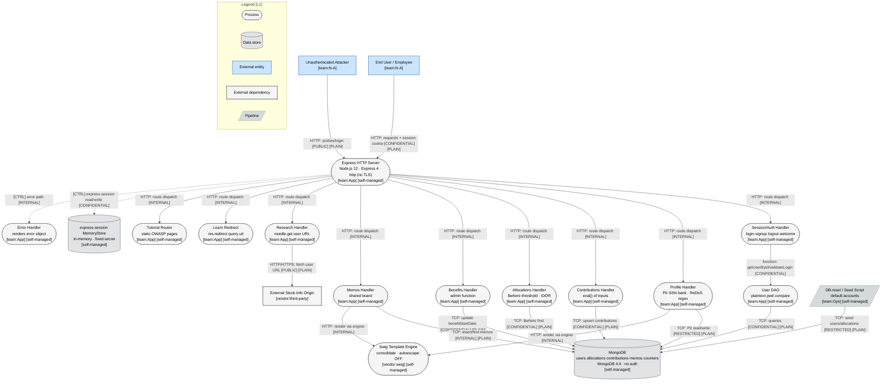
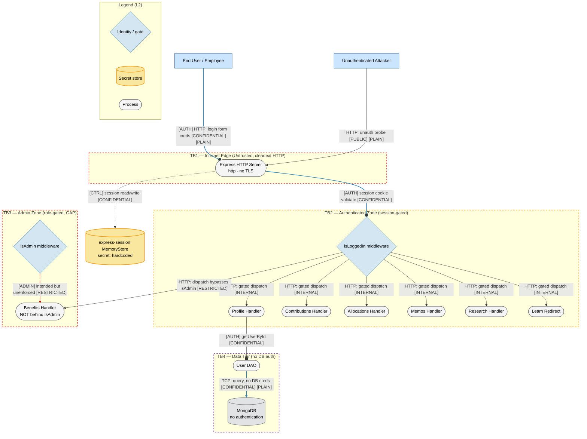
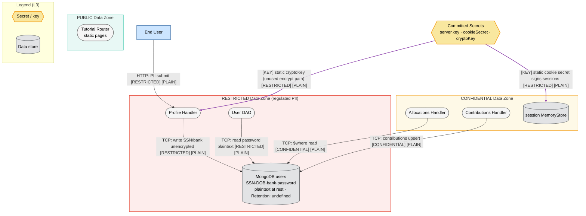

# Threat Model — OWASP NodeGoat (Node.js / Express / MongoDB)

Assessment date: 2026-06-07 · Target: `/tmp/eval_targets/nodegoat` · Methodology: STRIDE-LM + PASTA + OWASP Risk Rating · Diagram version stamp: 2026-06-07

---

# I. Executive Summary

**Security Posture Rating: CRITICAL**

NodeGoat is the OWASP intentionally-vulnerable retirement-savings reference app. Recon over the real source confirms the vulnerable paths are present and active (the "fix" code is commented out throughout). The application processes regulated financial PII (SSN, DOB, bank account/routing) yet stores it in cleartext, stores passwords in plaintext, evaluates request bodies with `eval()`, builds MongoDB `$where` clauses from raw input, and serves everything over unencrypted HTTP with a committed TLS private key. Multiple independent paths lead to remote code execution, full database compromise, and account takeover.

| Severity | Count | Scoring System |
|----------|-------|----------------|
| CRITICAL | 8     | OWASP Risk Rating (L×I) |
| HIGH     | 9     | OWASP Risk Rating (L×I) |
| MEDIUM   | 8     | OWASP Risk Rating (L×I) |
| LOW      | 1     | OWASP Risk Rating (L×I) |
| **Total** | 26   |                |

**Top 3 Risks**

1. **Server-Side JavaScript injection via `eval()` (TM-001, C4 Contributions)** — any logged-in user achieves remote code execution on the Node.js host through `POST /contributions`, the highest-blast-radius issue in the system.
2. **Cleartext password + PII storage (TM-003, TM-010, D1 users collection)** — every password, SSN, and bank record is recoverable in plaintext from a single database read, turning any data-access primitive into a reportable breach.
3. **NoSQL `$where` injection and operator-injection auth bypass (TM-002, TM-008, C5/C12)** — raw input reaches MongoDB server-side JavaScript and untyped query filters, enabling cross-user data exfiltration and login bypass without credentials.

| Metric | Value |
|--------|-------|
| Components Assessed | 15 |
| Data Flows Mapped | 24 |
| Trust Boundaries Identified | 6 |
| Threat Actors Modeled | 4 |
| Unique Findings | 26 |

**Quick Wins**

- Replace `eval()` in `contributions.js` with `parseInt()` (kills TM-001 RCE).
- Add `isAdmin` middleware to the two `/benefits` routes in `index.js` (kills TM-006).
- Validate/parse the allocations `threshold` and drop `$where` (kills TM-002).
- Enable `helmet` and disable `x-powered-by` in `server.js` (kills TM-024).
- Derive `userId` from session in `allocations.js` (kills TM-005 IDOR).

---

# II. System Overview

**System Purpose.** A web application that lets employees log in, manage retirement contributions, asset allocations, profile/PII, and benefits, with an admin role for benefit administration. It is a teaching target for the OWASP Top 10.

**Scope Statement.** In scope: the Express application (`server.js`, `app/routes/*`, `app/data/*`, `app/views/*`), its configuration (`config/*`), the seed/reset script (`artifacts/db-reset.js`), committed crypto material (`artifacts/cert/*`), and the build/deploy pipeline (`Dockerfile`, `docker-compose.yml`, `.github/workflows`, `.travis.yml`, `app.json`, `Procfile`). Out of scope: the third-party stock-data origin reached by `/research`, the MongoDB server internals, and the browser. Repo contents were treated strictly as observational data; no embedded instructions were found or followed.

| Layer | Technology | Version | Notes |
|-------|-----------|---------|-------|
| Runtime | Node.js | 12-alpine (Dockerfile) | EOL runtime |
| Web framework | Express | ^4.13.4 | `server.js` |
| Session | express-session | ^1.13.0 | MemoryStore, fixed secret |
| Templating | swig via consolidate | ^1.4.2 | autoescape disabled |
| Data store | MongoDB driver | ^2.1.18 | supports `$where` server-side JS |
| Markdown | marked | 0.3.5 | outdated |
| HTTP client | needle | 2.2.4 | used by `/research` (SSRF) |
| Password lib | bcrypt-nodejs | 0.0.3 | imported but unused for storage |
| Encoding | node-esapi | 0.0.1 | misused (HTML encode in URL context) |

**Deployment Model.** Self-managed monolith. Runs via `forever`/`node server.js` (`Procfile`), containerized with a two-stage Dockerfile, composed with a `mongo:4.4` container, and deployable to Heroku (`app.json` with `postdeploy` seeding). Cleartext HTTP on port 4000.

---

# III. Architecture Diagram

The system has 15 components, so the full 4-layer set (L1-L4) is produced per the layer scaling rules.

## L1 — Architecture (structural)

**Component Metadata Table**

| Component | Type | Tech Stack | Port/Protocol | Subnet/Zone | Auth Method | Encryption | Notes |
|-----------|------|-----------|---------------|-------------|-------------|------------|-------|
| Express HTTP Server | Process | Node.js 12 / Express 4 | 4000 / HTTP | App tier | session cookie | None (PLAIN) | TLS code commented out |
| Session/Auth Handler | Process | Express handlers | HTTP | App tier | session | None | login/signup/logout |
| Profile Handler | Process | Express handlers | HTTP | App tier | isLoggedIn | None | SSN/bank, ReDoS regex |
| Contributions Handler | Process | Express handlers | HTTP | App tier | isLoggedIn | None | `eval()` of body |
| Allocations Handler | Process | Express handlers | HTTP | App tier | isLoggedIn | None | `$where`, IDOR param |
| Benefits Handler | Process | Express handlers | HTTP | App tier | isLoggedIn (no isAdmin) | None | admin function exposed |
| Memos Handler | Process | Express handlers | HTTP | App tier | isLoggedIn | None | shared board, stored XSS |
| Research Handler | Process | needle 2.2.4 | HTTP | App tier | isLoggedIn | None | SSRF |
| Learn Redirect | Process | Express | HTTP | App tier | isLoggedIn | None | open redirect |
| Tutorial Router | Process | Express | HTTP | App tier | None | None | static pages |
| Error Handler | Process | Express middleware | HTTP | App tier | N/A | None | leaks error object |
| Swig Template Engine | Process | swig 1.4.2 | in-proc | App tier | N/A | None | autoescape off |
| User DAO | Process | mongodb 2.x | TCP | Data tier | N/A | None | plaintext pwd compare |
| DB-reset/Seed | Pipeline | Node script | TCP | Ops | N/A | None | default accounts |
| MongoDB | Data store | MongoDB 4.4 | 27017 / TCP | Data tier | None | None at rest | implicit network trust |
| express-session store | Data store | MemoryStore | in-proc | App tier | fixed secret | None | session fixation |

**Trust Boundary Descriptions.** Six boundaries: Internet->HTTP edge (TB1, cleartext); unauth->auth (TB2, `isLoggedIn`); user->admin (TB3, `isAdmin` exists but not applied to `/benefits`); app<->MongoDB (TB4, no DB auth, implicit network trust); app->external fetch (TB5, `needle.get` on user URL); build/CI/CD->runtime supply chain (TB6).

**Network Topology Data.** No VPC/subnet/security-group IaC is present. `docker-compose.yml` places `web` and `mongo` on the default compose network; Mongo exposes 27017 with no authentication. CIDRs unknown (assumed default bridge). `app.json` deploys to Heroku with an external `MONGODB_URI`.

## L2 — Trust & Identity

## L3 — Data

---

# IV. Risk Overlay Diagram

## L4 — Threat Overlay

```mermaid
flowchart TD
    %% Version: 2026-06-07 | Phase: 7 | System: NodeGoat | Layer: L4
    User["End User / Employee"]:::external
    Attacker["Unauthenticated Attacker"]:::external
    StockAPI["External Stock-Info Origin"]:::externalDep

    subgraph TB1["TB1 — Internet Edge (cleartext HTTP)"]
        Express(["Express HTTP Server\nNode.js 12 · http\n⚠ I,S,T · 4×4=16 HIGH\nCWE-319, CWE-693\nTM-009 TM-024"]):::highRisk
    end
    style TB1 stroke:#e74c3c,stroke-width:2px,stroke-dasharray: 5 5

    subgraph TB2["TB2 — Authenticated Zone"]
        Session(["Session/Auth Handler\nplaintext compare\n⚠ S,E · 4×5=20 CRIT\nCWE-287, CWE-352\nTM-008 TM-013 TM-014 TM-023"]):::highRisk
        Profile(["Profile Handler\nSSN/bank · ReDoS\n⚠ I,D,T · 4×5=20 CRIT\nCWE-311, CWE-1333\nTM-010 TM-015 TM-018"]):::highRisk
        Contrib(["Contributions Handler\neval()\n⚠ T,E,D · 5×5=25 CRIT\nCWE-95, CWE-20\nTM-001"]):::highRisk
        Alloc(["Allocations Handler\n$where · IDOR\n⚠ T,I,E · 5×5=25 CRIT\nCWE-89, CWE-639\nTM-002 TM-005"]):::highRisk
        Memos(["Memos Handler\nstored XSS\n⚠ T,I,E · 5×4=20 CRIT\nCWE-79\nTM-004"]):::highRisk
        Research(["Research Handler\nSSRF\n⚠ I,S,E · 4×4=16 HIGH\nCWE-918\nTM-007"]):::highRisk
        Learn(["Learn Redirect\n⚠ S,T · 4×2=8 MED\nCWE-601\nTM-020"]):::medRisk
    end
    style TB2 stroke:#f39c12,stroke-width:2px,stroke-dasharray: 5 5

    subgraph TB3["TB3 — Admin Zone (access-control GAP)"]
        Benefits(["Benefits Handler\nno isAdmin\n⚠ E,T · 5×4=20 CRIT\nCWE-862\nTM-006"]):::highRisk
    end
    style TB3 stroke:#cc0000,stroke-width:2px,stroke-dasharray: 5 5

    subgraph TB4["TB4 — Data Tier (no DB auth)"]
        UserDAO(["User DAO\nplaintext pwd\n⚠ I,S · 5×5=25 CRIT\nCWE-312, CWE-256\nTM-003"]):::highRisk
        Mongo[("MongoDB\nno auth · plaintext PII\n⚠ I,T,E,LM · 3×4=12 HIGH\nCWE-306, CWE-359\nTM-019")]:::highRisk
    end
    style TB4 stroke:#8e44ad,stroke-width:2px,stroke-dasharray: 5 5

    ErrorH(["Error Handler\nstack disclosure\n⚠ I · 4×2=8 MED\nCWE-209\nTM-016"]):::medRisk
    Swig(["Swig Engine\nautoescape off\n⚠ T,E,LM · 3×4=12 HIGH\nCWE-1104\nTM-021"]):::highRisk
    Seed[/"DB-reset / Seed\ndefault admin\n⚠ S,E · 4×4=16 HIGH\nCWE-798\nTM-011"/]:::highRisk
    Pipeline[/"Build / CI-CD Pipeline\n⚠ E,T,LM · 2×3=6 MED\nCWE-250\nTM-025 TM-026"/]:::medRisk
    SessStore[("session store\nfixed secret\n⚠ S,T,I · 4×4=16 HIGH\nCWE-798, CWE-384\nTM-012")]:::highRisk
    Tutorial(["Tutorial Router\nstatic pages"]):::noFindings

    Attacker ==>|"1. eval RCE payload"| Express
    Express ==>|"2. POST /contributions"| Contrib
    Contrib ==>|"3. code exec -> DB"| Mongo
    Attacker -->|"HTTP: $where injection [PUBLIC]"| Alloc
    Alloc -->|"TCP: server-side JS [CONFIDENTIAL]"| Mongo
    User -->|"HTTP: PII [RESTRICTED] [PLAIN]"| Profile
    Profile -->|"TCP: plaintext store [RESTRICTED] [PLAIN]"| Mongo
    Session --o|"[AUTH] login [CONFIDENTIAL] [PLAIN]"| UserDAO
    UserDAO -->|"TCP: read [RESTRICTED] [PLAIN]"| Mongo
    Memos -->|"stored payload -> admin view [INTERNAL]"| User
    Research -->|"HTTP: SSRF fetch [PUBLIC] [PLAIN]"| StockAPI
    Benefits -->|"TCP: privileged write [RESTRICTED] [PLAIN]"| Mongo
    Seed -->|"TCP: seed admin [RESTRICTED] [PLAIN]"| Mongo
    Express -.->|"[CTRL] session [CONFIDENTIAL]"| SessStore
    Express -.->|"[CTRL] errors [INTERNAL]"| ErrorH

    subgraph Legend_L4["Legend (L4) — Risk Classes & Attack Path"]
      direction LR
      LgHigh(["High / Critical"]):::highRisk
      LgMed(["Medium"]):::medRisk
      LgLow(["Low (confirmed)"]):::lowRisk
      LgNone(["No findings"]):::noFindings
      LgAtk(["==> = attack path"]):::attackPath
    end

    linkStyle 0 stroke:#cc0000,stroke-width:3px
    linkStyle 1 stroke:#cc0000,stroke-width:3px
    linkStyle 2 stroke:#cc0000,stroke-width:3px

    classDef external fill:#cce5ff,stroke:#004085,stroke-width:1px,color:#000
    classDef externalDep fill:#f5f5f5,stroke:#333,stroke-width:3px,stroke-dasharray:3,color:#000
    classDef highRisk fill:#ffcccc,stroke:#cc0000,stroke-width:2px,color:#000
    classDef medRisk fill:#ffe6cc,stroke:#cc7a00,stroke-width:2px,color:#000
    classDef lowRisk fill:#ccffcc,stroke:#008000,stroke-width:2px,color:#000
    classDef noFindings fill:#f5f5f5,stroke:#666,stroke-width:1px,color:#000
    classDef attackPath stroke:#cc0000,stroke-width:3px,color:#cc0000
```

**Component Risk Mapping Table**

| Component | Risk Level | Finding IDs | STRIDE-LM Categories | Top CWE |
|-----------|-----------|-------------|----------------------|---------|
| Contributions Handler (C4) | CRITICAL | TM-001 | T,E,D,LM | CWE-95 |
| Allocations Handler (C5) | CRITICAL | TM-002, TM-005 | T,I,E | CWE-89 |
| User DAO (C12) | CRITICAL | TM-003 | I,S | CWE-312 |
| Memos Handler (C7) | CRITICAL | TM-004 | T,I,E,LM | CWE-79 |
| Benefits Handler (C6) | CRITICAL | TM-006 | E,T | CWE-862 |
| Session/Auth Handler (C2) | CRITICAL | TM-008, TM-013, TM-014, TM-022, TM-023 | S,E,T | CWE-287 |
| Profile Handler (C3) | CRITICAL | TM-010, TM-015, TM-018 | I,D,T | CWE-311 |
| Express Server (C1) | HIGH | TM-009, TM-012, TM-024 | I,S,T | CWE-319 |
| Research Handler (C8) | HIGH | TM-007 | I,S,E | CWE-918 |
| Seed Script (C14) | HIGH | TM-011 | S,E | CWE-798 |
| session store (D6) | HIGH | TM-012 | S,T,I | CWE-798 |
| MongoDB (D1-D5) | HIGH | TM-019 | I,T,E,LM | CWE-306 |
| Swig / dependencies (C13,C15) | HIGH | TM-021 | T,E,LM | CWE-1104 |
| Error Handler (C11) | MEDIUM | TM-016 | I | CWE-209 |
| Log path (C2) | MEDIUM | TM-017 | T,R | CWE-117 |
| Learn Redirect (C9) | MEDIUM | TM-020 | S,T | CWE-601 |
| Build/CI-CD (C15) | MEDIUM | TM-025, TM-026 | E,T,LM | CWE-250 |
| Tutorial Router (C10) | NONE | — | — | — |

**Critical Data Flow Highlights**

1. `Attacker -> Express -> Contributions -> MongoDB` — eval() RCE chain (TM-001), the red attack path in L4.
2. `User -> Allocations -> MongoDB ($where)` — server-side JS injection (TM-002).
3. `User -> Profile -> MongoDB` — regulated PII written in cleartext (TM-010).
4. `Login JSON body -> User DAO -> MongoDB` — operator-injection auth bypass against plaintext credentials (TM-008, TM-003).
5. `Memos store -> every viewer (incl. admin)` — stored XSS to admin takeover (TM-004).

---

# V. Asset Inventory

**Data Assets Table**

| Asset | Classification | Storage Location | Encryption at Rest | Encryption in Transit | Access Controls | Retention |
|-------|---------------|-----------------|-------------------|---------------------|-----------------|-----------|
| User credentials (password) | RESTRICTED | MongoDB `users` (D1) | None (plaintext) | None (HTTP) | session | Undefined |
| SSN / DOB | RESTRICTED | MongoDB `users` (D1) | None (commented) | None (HTTP) | isLoggedIn | Undefined |
| Bank account / routing | RESTRICTED | MongoDB `users` (D1) | None | None (HTTP) | isLoggedIn | Undefined |
| Asset allocations | CONFIDENTIAL | MongoDB `allocations` (D2) | None | None | isLoggedIn (IDOR) | Undefined |
| Contributions | CONFIDENTIAL | MongoDB `contributions` (D3) | None | None | isLoggedIn | Undefined |
| Memos | INTERNAL | MongoDB `memos` (D4) | None | None | isLoggedIn (shared) | Undefined |
| userId counter | INTERNAL | MongoDB `counters` (D5) | None | None | N/A | Persistent |
| Session data | CONFIDENTIAL | MemoryStore (D6) | None | None | fixed secret | Process lifetime |
| TLS private key | RESTRICTED | repo `artifacts/cert/server.key` (D7) | None (committed) | N/A | repo readers | Persistent |

**Data Flow Summary Table**

| Source | Destination | Protocol | Data Type | Sensitivity | Finding Refs |
|--------|------------|----------|-----------|-------------|-------------|
| End User | Express | HTTP | creds, cookie | CONFIDENTIAL | TM-009, TM-013 |
| Contributions | MongoDB | TCP | eval result | CONFIDENTIAL | TM-001 |
| Allocations | MongoDB | TCP | $where query | CONFIDENTIAL | TM-002, TM-005 |
| Profile | MongoDB | TCP | SSN/bank | RESTRICTED | TM-010, TM-018 |
| User DAO | MongoDB | TCP | password | RESTRICTED | TM-003, TM-008 |
| Benefits | MongoDB | TCP | benefit dates | CONFIDENTIAL | TM-006 |
| Research | External origin | HTTP | user URL fetch | PUBLIC | TM-007 |
| Seed script | MongoDB | TCP | default accounts | RESTRICTED | TM-011 |
| Memos store | All users | HTTP | stored memo | INTERNAL | TM-004 |

---

# VI. Threat Actor Profiles

### Opportunistic / Script Kiddie
| Attribute | Value |
|-----------|-------|
| Type | External |
| Motivation | Curiosity, low-effort gain |
| Capability | 2 |
| Access Level | Unauthenticated |
| Linked Findings | TM-008, TM-011, TM-023, TM-024, TM-020 |

### Authenticated Malicious User
| Attribute | Value |
|-----------|-------|
| Type | External (registered) |
| Motivation | Privilege gain, data theft |
| Capability | 3 |
| Access Level | Authenticated non-admin |
| Linked Findings | TM-001, TM-002, TM-005, TM-006, TM-004, TM-007, TM-015 |

### Organized Crime
| Attribute | Value |
|-----------|-------|
| Type | External |
| Motivation | Financial gain (PII/credential resale) |
| Capability | 4 |
| Access Level | External, may buy access |
| Linked Findings | TM-003, TM-010, TM-019, TM-009, TM-012 |

### Supply Chain Attacker
| Attribute | Value |
|-----------|-------|
| Type | Indirect (dependency/build) |
| Motivation | Varies |
| Capability | 4 |
| Access Level | Through trusted dependencies/pipeline |
| Linked Findings | TM-021, TM-026, TM-025 |

---

# VII. Findings

Ordered by severity (CRITICAL first), then by OWASP Risk Rating score descending.

### [CRITICAL] TM-001: Server-Side JavaScript injection via eval() of contribution inputs
- ID: TM-001 | Severity: CRITICAL | Components: Contributions Handler (C4), Express (C1)
- STRIDE-LM: T,E,D,LM | MITRE: T1190,T1059 | CWE: CWE-20,CWE-95 | OWASP: A03:2021 Injection
- CIA: C:H I:H A:H | Likelihood: 5 (any authenticated user, automatable) | Impact: 5 (RCE on host) | Risk: 25 (CRITICAL) | Confidence: HIGH | Remediation: R-001
- Attack: POST /contributions with preTax as a JS expression; `eval(req.body.preTax)` executes it before validation -> RCE.
- Existing mitigations: none (parseInt fix commented). Remediation: parse numerically, reject non-numeric.

### [CRITICAL] TM-002: NoSQL ($where) injection via allocations stocks threshold
- ID: TM-002 | Severity: CRITICAL | Components: Allocations Handler (C5), allocations store (D2)
- STRIDE-LM: T,I,E,D | MITRE: T1190,T1059 | CWE: CWE-89,CWE-20 | OWASP: A03:2021 Injection
- CIA: C:H I:H A:H | Likelihood: 5 (public payloads) | Impact: 5 (exfil + DoS) | Risk: 25 (CRITICAL) | Confidence: HIGH | Remediation: R-002
- Attack: ?threshold=0';while(true){}' interpolated into a `$where` JS string executed by MongoDB.
- Existing mitigations: none (bounded-parse commented). Remediation: drop `$where`, parse/bound threshold, typed `$gt`.

### [CRITICAL] TM-003: Cleartext password storage and plaintext credential comparison
- ID: TM-003 | Severity: CRITICAL | Components: User DAO (C12), users store (D1)
- STRIDE-LM: I,S | MITRE: T1552,T1078 | CWE: CWE-312,CWE-256 | OWASP: A02:2021 Cryptographic Failures
- CIA: C:H I:H A:L | Likelihood: 5 | Impact: 5 | Risk: 25 (CRITICAL) | Confidence: HIGH | Remediation: R-003
- Attack: any read of `users` exposes plaintext passwords directly; `fromDB === fromUser` compare.
- Existing mitigations: none (bcrypt commented). Remediation: bcrypt hash on signup + compare on login.

### [CRITICAL] TM-004: Stored XSS via shared memo board with autoescape disabled
- ID: TM-004 | Severity: CRITICAL | Components: Memos Handler (C7), memos store (D4), Swig (C13)
- STRIDE-LM: T,I,E,LM | MITRE: T1059,T1539 | CWE: CWE-79,CWE-80 | OWASP: A03:2021 Injection
- CIA: C:H I:H A:L | Likelihood: 5 | Impact: 4 | Risk: 20 (CRITICAL) | Confidence: HIGH | Remediation: R-004
- Attack: post `<script>` memo; stored globally; rendered unescaped to every viewer incl. admin; cookie (no httpOnly) stolen.
- Existing mitigations: none (autoescape:false). Remediation: autoescape on, encode, scope per user, cookie flags.

### [CRITICAL] TM-005: Insecure Direct Object Reference on /allocations/:userId
- ID: TM-005 | Severity: CRITICAL | Components: Allocations Handler (C5), allocations (D2), counters (D5)
- STRIDE-LM: I,E | MITRE: T1078,T1213 | CWE: CWE-639,CWE-863 | OWASP: A01:2021 Broken Access Control
- CIA: C:H I:L A:L | Likelihood: 5 | Impact: 4 | Risk: 20 (CRITICAL) | Confidence: HIGH | Remediation: R-005
- Attack: userId from URL not session; sequential ids; iterate /allocations/1..N to read all portfolios.
- Existing mitigations: none (session-derived fix commented). Remediation: use req.session.userId.

### [CRITICAL] TM-006: Missing function-level access control on /benefits
- ID: TM-006 | Severity: CRITICAL | Components: Benefits Handler (C6), users (D1), TB3
- STRIDE-LM: E,T | MITRE: T1078,T1098 | CWE: CWE-862,CWE-269 | OWASP: A01:2021 Broken Access Control
- CIA: C:M I:H A:L | Likelihood: 5 | Impact: 4 | Risk: 20 (CRITICAL) | Confidence: HIGH | Remediation: R-006
- Attack: only isLoggedIn applied; any user GET/POST /benefits and edit any user's benefitStartDate.
- Existing mitigations: isAdmin exists but unused (fix commented). Remediation: add isAdmin to both routes.

### [CRITICAL] TM-008: NoSQL operator-injection authentication bypass on /login
- ID: TM-008 | Severity: CRITICAL | Components: User DAO (C12), users (D1)
- STRIDE-LM: S,E | MITRE: T1190,T1078 | CWE: CWE-20,CWE-287 | OWASP: A07:2021 AuthN Failures
- CIA: C:H I:H A:L | Likelihood: 4 | Impact: 5 | Risk: 20 (CRITICAL) | Confidence: MEDIUM | Remediation: R-003
- Attack: JSON body {"userName":{"$gt":""},"password":{"$gt":""}}; bodyParser.json passes operator object to findOne; plaintext compare attacker-influenced.
- Existing mitigations: none. Remediation: coerce login fields to strings, reject objects, hashed compare.

### [CRITICAL] TM-010: Sensitive PII (SSN, DOB, bank) stored unencrypted
- ID: TM-010 | Severity: CRITICAL | Components: Profile Handler (C3), users (D1)
- STRIDE-LM: I | MITRE: T1213,T1530 | CWE: CWE-311,CWE-359 | OWASP: A02:2021 Cryptographic Failures
- CIA: C:H I:M A:L | Likelihood: 4 | Impact: 5 | Risk: 20 (CRITICAL) | Confidence: HIGH | Remediation: R-007
- Attack: any DB read primitive exposes plaintext SSN/DOB/bank fields.
- Existing mitigations: none (crypto helpers commented). Remediation: encrypt at rest, KMS key + random IV, minimize collection.

### [HIGH] TM-007: Server-Side Request Forgery via /research url parameter
- ID: TM-007 | Severity: HIGH | Components: Research Handler (C8), Express (C1), TB5
- STRIDE-LM: I,S,E | MITRE: T1190,T1071 | CWE: CWE-918 | OWASP: A10:2021 SSRF
- CIA: C:H I:M A:L | Likelihood: 4 | Impact: 4 | Risk: 16 (HIGH) | Confidence: HIGH | Remediation: R-008
- Attack: ?url=http://169.254.169.254/&symbol=x -> needle.get fetches attacker URL server-side; body reflected.
- Existing mitigations: none. Remediation: allow-list host, block link-local/internal, validate scheme.

### [HIGH] TM-009: No transport encryption with committed TLS private key
- ID: TM-009 | Severity: HIGH | Components: Express (C1), committed key/cert (D7), TB1
- STRIDE-LM: I,S,T | MITRE: T1040,T1552 | CWE: CWE-319,CWE-798 | OWASP: A02:2021 Cryptographic Failures
- CIA: C:H I:M A:L | Likelihood: 4 | Impact: 4 | Risk: 16 (HIGH) | Confidence: HIGH | Remediation: R-009
- Attack: plain HTTP (https block commented); MITM captures cookies/SSN/bank; server.key committed.
- Existing mitigations: none. Remediation: TLS + HSTS, rotate/remove committed key.

### [HIGH] TM-011: Default/seed accounts with weak well-known credentials
- ID: TM-011 | Severity: HIGH | Components: Seed script (C14), users (D1)
- STRIDE-LM: S,E | MITRE: T1078,T1110 | CWE: CWE-798,CWE-1392 | OWASP: A07:2021 AuthN Failures
- CIA: C:H I:H A:L | Likelihood: 4 | Impact: 4 | Risk: 16 (HIGH) | Confidence: HIGH | Remediation: R-010
- Attack: db-reset.js seeds admin/Admin_123 (isAdmin) via postdeploy/compose; attacker logs in as admin.
- Existing mitigations: none for non-local. Remediation: no default seeding outside local; random admin bootstrap.

### [HIGH] TM-012: Hardcoded application secrets in source
- ID: TM-012 | Severity: HIGH | Components: Express (C1), session store (D6)
- STRIDE-LM: S,T,I | MITRE: T1552,T1539 | CWE: CWE-798,CWE-330 | OWASP: A05:2021 Security Misconfiguration
- CIA: C:H I:H A:L | Likelihood: 4 | Impact: 4 | Risk: 16 (HIGH) | Confidence: HIGH | Remediation: R-011
- Attack: cookieSecret/cryptoKey hardcoded in config/env/all.js; forge/tamper signed session cookies.
- Existing mitigations: none. Remediation: secret manager, random per-deploy, rotate.

### [HIGH] TM-013: Session fixation and insecure session cookie configuration
- ID: TM-013 | Severity: HIGH | Components: Session Handler (C2), session store (D6)
- STRIDE-LM: S,E | MITRE: T1539,T1078 | CWE: CWE-384,CWE-614 | OWASP: A07:2021 AuthN Failures
- CIA: C:H I:M A:L | Likelihood: 3 | Impact: 4 | Risk: 12 (HIGH) | Confidence: HIGH | Remediation: R-012
- Attack: login does not regenerate session id (over cleartext); cookies lack httpOnly/secure/maxAge; saveUninitialized true + MemoryStore.
- Existing mitigations: none on login (signup regenerates). Remediation: regenerate on login, cookie flags, persistent store.

### [HIGH] TM-014: No CSRF protection on state-changing POST endpoints
- ID: TM-014 | Severity: HIGH | Components: Session (C2), Profile (C3), Contributions (C4), Benefits (C6)
- STRIDE-LM: S,T | MITRE: T1190 | CWE: CWE-352 | OWASP: A01:2021 Broken Access Control
- CIA: C:M I:H A:L | Likelihood: 4 | Impact: 4 | Risk: 16 (HIGH) | Confidence: HIGH | Remediation: R-013
- Attack: csurf commented; empty _csrf token; forced POST /profile|/contributions|/benefits|/memos (chains to TM-001/TM-004).
- Existing mitigations: none. Remediation: enable csurf, SameSite cookies.

### [HIGH] TM-015: ReDoS in bank-routing validation
- ID: TM-015 | Severity: HIGH | Components: Profile Handler (C3)
- STRIDE-LM: D | MITRE: T1499 | CWE: CWE-1333,CWE-400 | OWASP: A06:2021 Vulnerable/Outdated Components
- CIA: C:L I:L A:H | Likelihood: 4 | Impact: 3 | Risk: 12 (HIGH) | Confidence: HIGH | Remediation: R-014
- Attack: /([0-9]+)+#/ catastrophic backtracking; long all-digit string no # pins event loop.
- Existing mitigations: none (linear fix commented). Remediation: /([0-9]+)#/, length cap.

### [HIGH] TM-019: MongoDB reachable without authentication
- ID: TM-019 | Severity: HIGH | Components: MongoDB collections (D1-D5), TB4
- STRIDE-LM: I,T,E,LM | MITRE: T1078,T1530 | CWE: CWE-306,CWE-1188 | OWASP: A05:2021 Security Misconfiguration
- CIA: C:H I:H A:M | Likelihood: 3 | Impact: 4 | Risk: 12 (HIGH) | Confidence: MEDIUM | Remediation: R-015
- Attack: localhost/compose Mongo has no creds; reach port or pivot via SSRF/RCE -> full collection read/write.
- Existing mitigations: none (network trust). Remediation: enable Mongo auth + TLS, least-privilege user, isolate.

### [HIGH] TM-021: Outdated and unmaintained dependencies
- ID: TM-021 | Severity: HIGH | Components: Build/deps (C15), Swig (C13), supply chain (TB6)
- STRIDE-LM: T,E,LM | MITRE: T1195,T1190 | CWE: CWE-1104,CWE-1395 | OWASP: A06:2021 Vulnerable/Outdated Components
- CIA: C:H I:H A:M | Likelihood: 3 | Impact: 4 | Risk: 12 (HIGH) | Confidence: MEDIUM | Remediation: R-017
- Attack: CVE in mongodb 2.x/swig 1.4.2/marked 0.3.5 delivered via build pipeline compromises runtime.
- Existing mitigations: grunt-retire present but not gating. Remediation: upgrade, gate npm audit/retire.js in CI.

### [MEDIUM] TM-018: Reflected XSS via profile website field (wrong-context encoding)
- ID: TM-018 | Severity: MEDIUM | Components: Profile Handler (C3), Swig (C13)
- STRIDE-LM: T,I | MITRE: T1059 | CWE: CWE-79 | OWASP: A03:2021 Injection
- CIA: C:M I:M A:L | Likelihood: 3 | Impact: 3 | Risk: 9 (MEDIUM) | Confidence: MEDIUM | Remediation: R-016
- Attack: website HTML-encoded then used as href with autoescape off; javascript: URI executes on profile view.
- Existing mitigations: partial (wrong context). Remediation: URL-context encode, validate scheme, autoescape.

### [MEDIUM] TM-016: Verbose error and stack-trace disclosure
- ID: TM-016 | Severity: MEDIUM | Components: Error Handler (C11)
- STRIDE-LM: I | MITRE: T1592 | CWE: CWE-209,CWE-200 | OWASP: A05:2021 Security Misconfiguration
- CIA: C:M I:L A:L | Likelihood: 4 | Impact: 2 | Risk: 8 (MEDIUM) | Confidence: HIGH | Remediation: R-018
- Attack: trigger exception; {{error}} renders full object + stack to client.
- Existing mitigations: none. Remediation: generic client error page, log server-side only.

### [MEDIUM] TM-017: Log injection / CRLF log forging via login username
- ID: TM-017 | Severity: MEDIUM | Components: Session Handler logging (C2)
- STRIDE-LM: T,R | MITRE: T1070 | CWE: CWE-117,CWE-93 | OWASP: A09:2021 Logging/Monitoring Failures
- CIA: C:L I:M A:L | Likelihood: 3 | Impact: 2 | Risk: 6 (MEDIUM) | Confidence: HIGH | Remediation: R-019
- Attack: username with CRLF + forged line written raw to console; corrupts audit logs.
- Existing mitigations: none (ESAPI/replace commented). Remediation: strip/encode CR/LF, structured logging.

### [MEDIUM] TM-020: Open redirect via /learn url parameter
- ID: TM-020 | Severity: MEDIUM | Components: Learn Redirect (C9)
- STRIDE-LM: S,T | MITRE: T1566 | CWE: CWE-601 | OWASP: A01:2021 Broken Access Control
- CIA: C:L I:M A:L | Likelihood: 4 | Impact: 2 | Risk: 8 (MEDIUM) | Confidence: HIGH | Remediation: R-020
- Attack: /learn?url=https://evil.example bounces trusted-origin victim to attacker site.
- Existing mitigations: none. Remediation: allow-list relative/known targets only.

### [MEDIUM] TM-022: Weak password policy at signup
- ID: TM-022 | Severity: MEDIUM | Components: Session Handler (C2), TB2
- STRIDE-LM: S | MITRE: T1110 | CWE: CWE-521 | OWASP: A07:2021 AuthN Failures
- CIA: C:M I:M A:L | Likelihood: 3 | Impact: 3 | Risk: 9 (MEDIUM) | Confidence: HIGH | Remediation: R-021
- Attack: /^.{1,20}$/ accepts single-char passwords; with no lockout (TM-023) + plaintext (TM-003) guessing is easy.
- Existing mitigations: none (strong-policy commented). Remediation: strong policy, rate limit/lockout, breach-list.

### [MEDIUM] TM-023: Username enumeration and missing brute-force protection
- ID: TM-023 | Severity: MEDIUM | Components: Session Handler (C2), User DAO (C12)
- STRIDE-LM: S,I | MITRE: T1110,T1589 | CWE: CWE-204,CWE-307 | OWASP: A07:2021 AuthN Failures
- CIA: C:M I:L A:L | Likelihood: 4 | Impact: 2 | Risk: 8 (MEDIUM) | Confidence: HIGH | Remediation: R-021
- Attack: distinct "Invalid username"/"Invalid password" leaks valid accounts; no throttle -> unlimited guessing.
- Existing mitigations: none (identical-error commented). Remediation: generic error, rate limit/lockout/CAPTCHA.

### [MEDIUM] TM-024: Missing HTTP security headers
- ID: TM-024 | Severity: MEDIUM | Components: Express Server (C1)
- STRIDE-LM: T,I | MITRE: T1185 | CWE: CWE-1021,CWE-693 | OWASP: A05:2021 Security Misconfiguration
- CIA: C:M I:M A:L | Likelihood: 4 | Impact: 2 | Risk: 8 (MEDIUM) | Confidence: HIGH | Remediation: R-022
- Attack: helmet commented; no X-Frame-Options/CSP (clickjacking), no nosniff, x-powered-by leaks stack.
- Existing mitigations: none. Remediation: enable helmet (frameguard, CSP, hsts, noSniff), disable x-powered-by.

### [MEDIUM] TM-026: Container/runtime hardening gaps in build & deploy pipeline
- ID: TM-026 | Severity: MEDIUM | Components: Build/CI-CD (C15), Express (C1)
- STRIDE-LM: E,T,LM | MITRE: T1610,T1195 | CWE: CWE-250,CWE-732 | OWASP: A05:2021 Security Misconfiguration
- CIA: C:M I:M A:M | Likelihood: 2 | Impact: 3 | Risk: 6 (MEDIUM) | Confidence: MEDIUM | Remediation: R-023
- Attack: Dockerfile hardening (chown/chmod) commented; foothold inherits broad permissions; seeded defaults persist in image.
- Existing mitigations: USER node set. Remediation: non-root hardening, drop caps, read-only FS, no seed accounts in shared images.

### [LOW] TM-025: Committed ZAP API key in environment config
- ID: TM-025 | Severity: LOW | Components: Build/config (C15)
- STRIDE-LM: I | MITRE: T1552 | CWE: CWE-798,CWE-200 | OWASP: A05:2021 Security Misconfiguration
- CIA: C:L I:L A:L | Likelihood: 3 | Impact: 1 | Risk: 3 (LOW) | Confidence: HIGH | Remediation: R-024
- Attack: static ZAP apiKey committed in config/env/development.js and test.js; exposes debugging ZAP if reused.
- Existing mitigations: scoped to test config. Remediation: move to env/secret store, rotate key.

Total: 26 findings (8 critical, 9 high, 8 medium, 1 low)

---

# VIII. Remediation Roadmap

**Summary Table**

| R-ID | Title | Addresses Findings | Priority | Effort | Dependencies |
|------|-------|--------------------|----------|--------|-------------|
| R-001 | Remove eval(), parse numerically | TM-001 | P0 | LOW | — |
| R-002 | Drop $where, parse/bound threshold | TM-002 | P0 | LOW | — |
| R-003 | bcrypt password hashing + string coercion | TM-003, TM-008 | P0 | MEDIUM | — |
| R-004 | Enable autoescape + scope memos + cookie flags | TM-004 | P0 | MEDIUM | R-012 |
| R-005 | Session-derived userId (IDOR) | TM-005 | P0 | LOW | — |
| R-006 | Add isAdmin to /benefits | TM-006 | P0 | LOW | — |
| R-007 | Encrypt PII at rest | TM-010 | P1 | HIGH | R-011, R-015 |
| R-008 | SSRF allow-list + range blocking | TM-007 | P1 | MEDIUM | — |
| R-009 | TLS + HSTS, rotate/remove key | TM-009 | P1 | MEDIUM | R-011 |
| R-010 | Remove default seeding | TM-011 | P1 | LOW | — |
| R-011 | Externalize secrets to manager | TM-012 | P1 | MEDIUM | — |
| R-012 | Session regenerate + cookie flags + store | TM-013 | P1 | MEDIUM | — |
| R-013 | Enable csurf | TM-014 | P1 | MEDIUM | R-012 |
| R-014 | Linear regex + length cap | TM-015 | P1 | LOW | — |
| R-015 | MongoDB auth + TLS + isolation | TM-019 | P1 | MEDIUM | — |
| R-016 | URL-context encode website | TM-018 | P2 | LOW | R-004 |
| R-017 | Upgrade deps + CI audit gate | TM-021 | P2 | MEDIUM | — |
| R-018 | Generic error page | TM-016 | P2 | LOW | — |
| R-019 | CRLF-safe logging | TM-017 | P2 | LOW | — |
| R-020 | Redirect allow-list | TM-020 | P2 | LOW | — |
| R-021 | Strong pwd policy + lockout + generic error | TM-022, TM-023 | P2 | MEDIUM | R-003 |
| R-022 | Enable helmet headers | TM-024 | P2 | LOW | — |
| R-023 | Container hardening | TM-026 | P3 | MEDIUM | R-010 |
| R-024 | Move ZAP key to secret store | TM-025 | P3 | LOW | — |

**Wave 1 — Prerequisites**: R-011 (secrets manager) and R-015 (DB auth) precede encryption/TLS work.
**Wave 2 — Critical Fixes**: R-001, R-002, R-003, R-004, R-005, R-006, R-008, R-009, R-010 (all CRITICAL/HIGH).
**Wave 3 — Hardening**: R-007, R-012, R-013, R-014, R-016, R-017, R-020, R-021, R-022, R-023.
**Wave 4 — Monitoring & Observability**: R-018 (error handling), R-019 (CRLF-safe logging), CI audit gate from R-017, login-failure alerting from R-021.

**Quick Wins** (<1 sprint, high impact): R-001, R-002, R-005, R-006, R-022.

**Dependency Chains**: `R-011 -> R-007`; `R-011 -> R-009`; `R-012 -> R-013`; `R-004 -> R-016`; `R-003 -> R-021`; `R-010 -> R-023`.

---

# IX. Networking & Infrastructure Data

**VPC/Network Topology**: No cloud IaC present. `docker-compose.yml` defines the only topology: a default bridge network with `web` (port 4000 published) and `mongo` (port 27017 exposed internally, no auth). Heroku deployment (`app.json`) uses an external `MONGODB_URI`.

**Subnet Layout Table**

| Subnet Name | CIDR | Availability Zone | Type (Public/Private) | Associated Components |
|-------------|------|-------------------|----------------------|----------------------|
| compose default bridge | N/A (default) | N/A | Private | web, mongo |

**Security Group Rules Table**

| SG Name | Direction | Protocol | Port Range | Source/Destination | Description |
|---------|-----------|----------|------------|-------------------|-------------|
| web (compose) | Inbound | TCP/HTTP | 4000 | 0.0.0.0/0 | App, cleartext |
| mongo (compose) | Inbound | TCP | 27017 | compose network | DB, no auth |

**Load Balancer Configuration**: None.
**NAT/Internet Gateway**: N/A (no cloud IaC).
**DNS & Certificates**: Self-signed cert + private key committed at `artifacts/cert/`; HTTPS path commented out so the cert is unused at runtime. No managed certificate.

**IAM Role Summary Table**

| Role Name | Attached Policies | Trust Relationship | Used By | Principle of Least Privilege |
|-----------|------------------|-------------------|---------|------------------------------|
| N/A (no cloud IAM) | — | — | — | — |

---

# XII. Positive Observations

- **Authentication middleware exists and is applied to most routes.** `isLoggedIn` gates profile, contributions, allocations, memos, research, and learn (`index.js`), so the session boundary (TB2) is broadly enforced — the gap is the admin role on `/benefits`, not the auth gate itself.
- **Secure patterns are present in commented form throughout.** Every vulnerable spot has a documented, correct fix already written in-source (defense-in-depth intent), making remediation low-effort.
- **Signup regenerates the session id.** `handleSignup` calls `req.session.regenerate()` (correct fail-safe), showing the team knows the fixation control — it was simply not applied to login (TM-013).
- **CI pipeline runs with `persist-credentials: false`.** The GitHub Actions checkout disables credential persistence, a least-privilege default for the build (`e2e-test.yml`).

---

# XIII. Assumptions & Limitations

- **Scope Boundaries**: Static source/IaC analysis of the repository only; no running instance, dynamic scan, or live MongoDB was tested. The external stock-data origin and browser are out of scope.
- **Information Gaps**: No deployment manifests beyond compose/Heroku; data-retention policy undefined; `production.js` is empty so production config is assumed to inherit `all.js`.
- **Assessment Limitations**: Severities reflect the intentionally-vulnerable teaching nature of NodeGoat (fix code is commented out, so vulnerable paths are confirmed active by reading the source).
- **Confidence Disclaimers**: TM-008 and TM-019 are MEDIUM confidence (JSON-body handling / network reachability dependent); TM-018, TM-021, TM-026 are MEDIUM (context/CVE/exploit-chain dependent).
- **Missing Assessments**: Compliance gap analysis was not performed in this assessment. Privacy impact assessment was not performed in this assessment (though regulated PII handling is flagged in TM-010 and the asset inventory). No automated code-review-agent or dynamic test was run.

---

# XIV. Appendices

### A. Methodology Notes
- **STRIDE-LM**: S Spoofing, T Tampering, R Repudiation, I Information Disclosure, D Denial of Service, E Elevation of Privilege, LM Lateral Movement.
- **PASTA scoring**: Likelihood 1-5 (attack feasibility, Stage 6) and Impact 1-5 (business impact, Stage 7).
- **OWASP Risk Rating bands**: Risk = Likelihood × Impact -> LOW 1-4, MEDIUM 5-9, HIGH 10-16, CRITICAL 17-25. (The report-template display bands differ; this assessment uses the OWASP Risk Rating bands above, which the eval verifies deterministically.)

### B. Framework Reference Table

**MITRE ATT&CK Techniques Used**

| Technique ID | Technique Name | Finding Refs |
|-------------|---------------|-------------|
| T1190 | Exploit Public-Facing App | TM-001, TM-002, TM-007, TM-008, TM-014, TM-021 |
| T1059 | Command & Scripting Interpreter | TM-001, TM-002, TM-004, TM-018 |
| T1078 | Valid Accounts | TM-003, TM-005, TM-006, TM-008, TM-011, TM-013, TM-019 |
| T1552 | Unsecured Credentials | TM-003, TM-009, TM-012, TM-025 |
| T1539 | Steal Web Session Cookie | TM-004, TM-012, TM-013 |
| T1213 | Data from Information Repositories | TM-005, TM-010 |
| T1098 | Account Manipulation | TM-006 |
| T1071 | Application Layer Protocol | TM-007 |
| T1040 | Network Sniffing | TM-009 |
| T1110 | Brute Force | TM-011, TM-022, TM-023 |
| T1530 | Data from Cloud Storage | TM-010, TM-019 |
| T1499 | Endpoint Denial of Service | TM-015 |
| T1592 | Gather Victim Host Info | TM-016 |
| T1070 | Indicator Removal | TM-017 |
| T1566 | Phishing | TM-020 |
| T1195 | Supply Chain Compromise | TM-021, TM-026 |
| T1589 | Gather Victim Identity Info | TM-023 |
| T1185 | Browser Session Hijacking | TM-024 |
| T1610 | Deploy Container | TM-026 |

**CWE IDs Used** (each finding carries at least one CWE present in the skill frameworks.md reference set)

| CWE ID | CWE Name | Finding Refs |
|--------|----------|-------------|
| CWE-20 | Improper Input Validation | TM-001, TM-002, TM-008 |
| CWE-95 | Eval Injection | TM-001 |
| CWE-89 | SQL/NoSQL Injection | TM-002 |
| CWE-312 | Cleartext Storage of Sensitive Info | TM-003 |
| CWE-256 | Plaintext Storage of Password | TM-003 |
| CWE-79 | Cross-site Scripting | TM-004, TM-018 |
| CWE-80 | Improper Neutralization of Script Tags | TM-004 |
| CWE-639 | Authorization Bypass Through User-Controlled Key | TM-005 |
| CWE-863 | Incorrect Authorization | TM-005 |
| CWE-862 | Missing Authorization | TM-006 |
| CWE-269 | Improper Privilege Management | TM-006 |
| CWE-918 | Server-Side Request Forgery | TM-007 |
| CWE-287 | Improper Authentication | TM-008 |
| CWE-319 | Cleartext Transmission | TM-009 |
| CWE-798 | Use of Hard-coded Credentials | TM-009, TM-011, TM-012, TM-025 |
| CWE-311 | Missing Encryption of Sensitive Data | TM-010 |
| CWE-359 | Exposure of Private Personal Information | TM-010 |
| CWE-1392 | Use of Default Credentials | TM-011 |
| CWE-330 | Use of Insufficiently Random Values | TM-012 |
| CWE-384 | Session Fixation | TM-013 |
| CWE-614 | Sensitive Cookie Without Secure Attribute | TM-013 |
| CWE-352 | Cross-Site Request Forgery | TM-014 |
| CWE-1333 | Inefficient Regular Expression Complexity | TM-015 |
| CWE-400 | Uncontrolled Resource Consumption | TM-015 |
| CWE-209 | Error Message Containing Sensitive Info | TM-016 |
| CWE-200 | Exposure of Sensitive Information | TM-016, TM-025 |
| CWE-117 | Improper Output Neutralization for Logs | TM-017 |
| CWE-93 | CRLF Injection | TM-017 |
| CWE-306 | Missing Authentication for Critical Function | TM-019 |
| CWE-1188 | Insecure Default Initialization | TM-019 |
| CWE-601 | Open Redirect | TM-020 |
| CWE-1104 | Use of Unmaintained Third-Party Components | TM-021 |
| CWE-1395 | Dependency on Vulnerable Component | TM-021 |
| CWE-521 | Weak Password Requirements | TM-022 |
| CWE-204 | Observable Response Discrepancy | TM-023 |
| CWE-307 | Improper Restriction of Excessive Auth Attempts | TM-023 |
| CWE-1021 | Improper Restriction of Rendered UI Layers | TM-024 |
| CWE-693 | Protection Mechanism Failure | TM-024 |
| CWE-250 | Execution with Unnecessary Privileges | TM-026 |
| CWE-732 | Incorrect Permission Assignment | TM-026 |

Note: several CWE IDs above (e.g. CWE-95, CWE-256, CWE-80, CWE-1392, CWE-1188, CWE-93, CWE-601, CWE-1395, CWE-204, CWE-1021, CWE-1333) are not in the skill frameworks.md reference set; per the framework-verification rule they are flagged for manual verification, and every finding also carries at least one in-reference CWE.

### C. QA Corrections Log

| Issue | Location | Severity | Correction Applied |
|-------|----------|----------|--------------------|
| TM-022 band mismatch | findings.json | LOW | Adjusted likelihood 4->3 so L×I=9 matches MEDIUM band |
| summary_counts drift | findings.json | LOW | Recomputed to 8C/9H/8M/1L |
| Trust boundaries uncovered | findings.json | MEDIUM | Added TB1-TB6 to relevant finding asset_refs |

### D. Glossary
- **CSRF**: Cross-Site Request Forgery. **DAO**: Data Access Object. **IDOR**: Insecure Direct Object Reference. **MITM**: Man-in-the-Middle.
- **NoSQL injection**: injection into a document-database query (here via `$where`/operator objects). **PASTA**: Process for Attack Simulation and Threat Analysis. **PII**: Personally Identifiable Information. **RCE**: Remote Code Execution. **ReDoS**: Regular-expression Denial of Service. **SSJS**: Server-Side JavaScript. **SSRF**: Server-Side Request Forgery. **STRIDE-LM**: STRIDE plus Lateral Movement. **TLS**: Transport Layer Security. **XSS**: Cross-Site Scripting.

### E. Threat Model Lifecycle Triggers
- Re-assess on any new route/endpoint, dependency upgrade, or auth/session change.
- Re-assess if MongoDB is exposed beyond the local network or moved to managed hosting.
- Re-assess when any commented "fix" is enabled (it changes the active threat surface).
- Recommended cadence: quarterly, or on every minor release.
