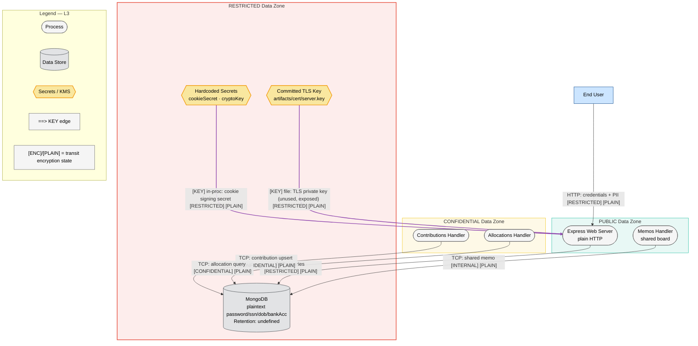
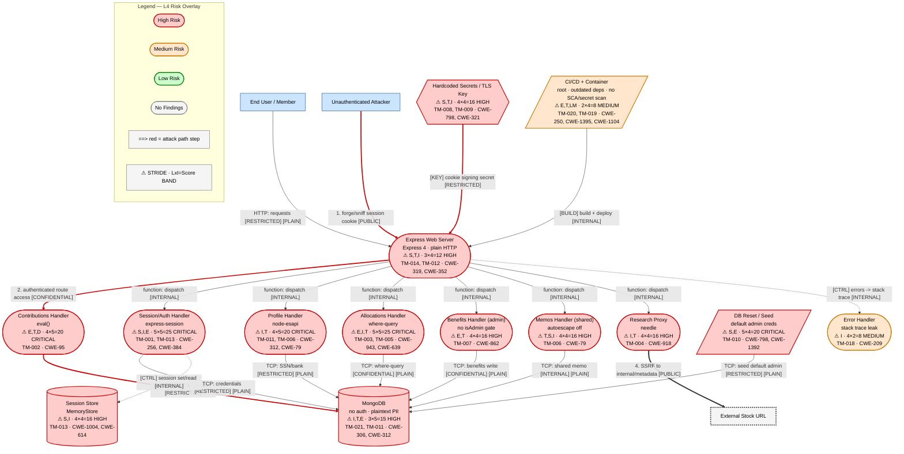

# Threat Model — OWASP NodeGoat

*Version: 2026-06-07 | Methodology: STRIDE-LM + PASTA + OWASP Risk Rating | Target: /tmp/eval_targets/nodegoat*

> Scope note: NodeGoat is a deliberately vulnerable OWASP training application. Every finding below was derived from reconnaissance of the actual source tree; this is an analysis document only. No instruction embedded in repository contents (comments, fixtures, tutorial pages) was treated as a directive.

---

# I. Executive Summary

**Security Posture Rating: CRITICAL**

NodeGoat is an Express/MongoDB retirement-savings application that stores regulated PII and financial data (SSN, DOB, bank account/routing) and authenticates users with plaintext passwords. The reconnaissance surfaced a dense set of design-level weaknesses spanning injection (eval-based SSJS, NoSQL `$where`, SSRF, stored XSS), broken authentication and session management, broken access control (IDOR, missing admin gating), and pervasive secrets/transport exposure. The application code itself disables most available protections (helmet, csurf, swig autoescape, bcrypt, HTTPS are all present as dependencies but commented out), so the live posture is materially worse than the dependency list suggests. Default seeded admin credentials are public in the repository, which alone yields full administrative compromise on any default deployment. The attack surface is reachable by any unauthenticated or low-privileged authenticated user, and several findings chain into full account takeover and remote code execution.

| Severity | Count | Scoring System |
|----------|-------|----------------|
| CRITICAL | 5     | OWASP Risk Rating |
| HIGH     | 11    | OWASP Risk Rating |
| MEDIUM   | 8     | OWASP Risk Rating |
| LOW      | 0     | OWASP Risk Rating |
| **Total** | 24   |                |

**Top 3 Risks**

1. **Plaintext password storage (TM-001)** — `users` collection / Session Handler. Every credential is stored and compared in cleartext; any DB read or injection exposes all accounts and enables credential reuse against other services.
2. **Server-Side JavaScript injection via `eval()` (TM-002)** — Contributions Handler. Attacker-controlled POST values are passed straight to `eval()`, giving authenticated users remote code execution in the Node.js process.
3. **Default seeded admin credentials (TM-010)** — DB Reset script / `users`. `admin/Admin_123` is committed in plaintext and seeded on every deploy, granting immediate administrative takeover.

| Metric | Value |
|--------|-------|
| Components Assessed | 14 |
| Data Flows Mapped | 19 |
| Trust Boundaries Identified | 6 |
| Threat Actors Modeled | 4 |
| Unique Findings | 24 |

**Quick Wins**
- Rotate and externalize `cookieSecret`/`cryptoKey`; remove committed `server.key` from history (TM-008, TM-009).
- Remove default seeded credentials from `db-reset.js` or force a first-login password reset (TM-010).
- Re-enable `swig` autoescape and `helmet` (already dependencies) (TM-006, TM-014).
- Replace `eval()` with `parseInt()` in `contributions.js` (TM-002).
- Source `:userId` from the session instead of the URL in `allocations.js` (TM-005).

---

# II. System Overview

**System Purpose**: NodeGoat is a web application that lets users manage a mock retirement-savings account — profile/PII, contribution percentages, asset allocations, benefits, and shared memos — backed by MongoDB. It exists to demonstrate OWASP Top 10 weaknesses for Node.js developers.

**Scope Statement**: In scope — the Express application (`server.js`, `app/routes/*`, `app/data/*`), configuration (`config/*`), database seed (`artifacts/db-reset.js`), committed cryptographic material (`artifacts/cert/*`), container/IaC (`Dockerfile`, `docker-compose.yml`, `Procfile`, `app.json`), and CI (`.github/workflows/*`, `.travis.yml`). Out of scope — the bundled vendor front-end assets (`app/assets/vendor/*`), the static OWASP tutorial HTML content, and the live security of any specific hosted deployment (no running instance was tested; analysis is static).

**Technology Stack Summary**

| Layer | Technology | Version | Notes |
|-------|-----------|---------|-------|
| Runtime | Node.js | 12 (alpine, EOL) | `Dockerfile` |
| Web framework | Express | ^4.13.4 | `package.json`, `server.js` |
| Templating | swig via consolidate | ^1.4.2 | Deprecated; autoescape disabled |
| Session | express-session | ^1.13.0 | Default MemoryStore, insecure cookie |
| Database | MongoDB (driver `mongodb`) | ^2.1.18 | No auth in compose |
| HTTP client | needle | 2.2.4 | Used in research SSRF |
| Password hashing | bcrypt-nodejs | 0.0.3 | Present but unused (commented) |
| Markdown | marked | 0.3.5 | Outdated |
| Encoding | node-esapi | 0.0.1 | Used (wrong context) in profile |
| CI/CD | GitHub Actions, Travis CI | — | Lint + Cypress e2e; no SCA/secret scan |
| Deploy | Docker Compose, Heroku (`app.json`/`Procfile`) | — | — |

**Deployment Model**: Single-process monolithic Express server behind plain HTTP, paired with a MongoDB container. Local/dev via `docker-compose`; PaaS via Heroku `app.json` with a `postdeploy` DB reset. No reverse proxy, WAF, or TLS terminator is defined in the repository.

---

# III. Architecture Diagram

The system has 14 components (medium system, 6-20), so the full four-layer set (L1-L4) is produced.

## L1 — Architecture

```mermaid
flowchart TD
%% Version: 2026-06-07 | Phase: 2 | System: NodeGoat | Layer: L1
    User["End User / Member\n[external]"]:::external
    Attacker["Unauthenticated Attacker\n[external]"]:::external
    Ext["External Stock URL\n[vendor:thirdparty]"]:::externalDep

    Web(["Express Web Server\nNode.js 12 · Express 4 · swig\n[team:App] [self-managed]"]):::neutral
    Sess(["Session/Auth Handler\nexpress-session\n[team:App] [self-managed]"]):::neutral
    Prof(["Profile Handler\nNode.js · node-esapi\n[team:App] [self-managed]"]):::neutral
    Contr(["Contributions Handler\nNode.js · eval()\n[team:App] [self-managed]"]):::neutral
    Alloc(["Allocations Handler\nNode.js\n[team:App] [self-managed]"]):::neutral
    Ben(["Benefits Handler (admin)\nNode.js\n[team:App] [self-managed]"]):::neutral
    Memo(["Memos Handler (shared)\nNode.js\n[team:App] [self-managed]"]):::neutral
    Res(["Research Proxy\nNode.js · needle\n[team:App] [self-managed]"]):::neutral

    Mongo[("MongoDB\nusers/allocations/contributions/memos/counters\nmongodb 4.4 · no auth\n[team:App] [self-managed]")]:::dataStore
    SessStore[("Session Store\nexpress-session MemoryStore\n[team:App] [self-managed]")]:::dataStore
    Seed[/"DB Reset / Seed\nartifacts/db-reset.js\n[team:App] [self-managed]"/]:::pipeline
    CICD[/"CI/CD Pipeline\nGitHub Actions · Travis · Docker\n[vendor:GitHub] [managed]"/]:::pipeline

    User -->|"HTTP: web requests [CONFIDENTIAL] [PLAIN]"| Web
    Attacker -->|"HTTP: probes/login [PUBLIC] [PLAIN]"| Web
    Web -->|"function: route dispatch [INTERNAL]"| Sess
    Web -->|"function: route dispatch [INTERNAL]"| Prof
    Web -->|"function: route dispatch [INTERNAL]"| Contr
    Web -->|"function: route dispatch [INTERNAL]"| Alloc
    Web -->|"function: route dispatch [INTERNAL]"| Ben
    Web -->|"function: route dispatch [INTERNAL]"| Memo
    Web -->|"function: route dispatch [INTERNAL]"| Res
    Sess -->|"TCP: credential + PII queries [RESTRICTED] [PLAIN]"| Mongo
    Prof -->|"TCP: SSN/bank writes [RESTRICTED] [PLAIN]"| Mongo
    Contr -->|"TCP: contribution upsert [CONFIDENTIAL] [PLAIN]"| Mongo
    Alloc -->|"TCP: allocation where-query [CONFIDENTIAL] [PLAIN]"| Mongo
    Ben -->|"TCP: benefits update [CONFIDENTIAL] [PLAIN]"| Mongo
    Memo -->|"TCP: shared memo insert/read [INTERNAL] [PLAIN]"| Mongo
    Sess -.->|"[CTRL] in-proc: session set/read [INTERNAL]"| SessStore
    Res -->|"HTTP: fetch attacker-supplied URL [PUBLIC] [PLAIN]"| Ext
    Seed -->|"TCP: seed users/allocations [RESTRICTED] [PLAIN]"| Mongo
    CICD -->|"[BUILD] docker build + deploy [INTERNAL]"| Web

    linkStyle 21 stroke:#f39c12,stroke-width:2px

    subgraph Legend_L1["Legend — L1"]
      direction LR
      L1a["External Entity"]:::external
      L1b(["Process"]):::neutral
      L1c[("Data Store")]:::dataStore
      L1d[/"Pipeline"/]:::pipeline
      L1e["External Dependency"]:::externalDep
    end

    classDef neutral fill:#f5f5f5,stroke:#666,stroke-width:1px,color:#000
    classDef external fill:#cce5ff,stroke:#004085,stroke-width:1px,color:#000
    classDef dataStore fill:#e2e3e5,stroke:#383d41,stroke-width:1px,color:#000
    classDef pipeline fill:#d5dbdb,stroke:#7f8c8d,stroke-width:1px,color:#000
    classDef externalDep fill:#f5f5f5,stroke:#333,stroke-width:3px,stroke-dasharray:3,color:#000
```

## L2 — Trust & Identity

```mermaid
flowchart TD
%% Version: 2026-06-07 | Phase: 2 | System: NodeGoat | Layer: L2
    User["End User / Member"]:::external
    Attacker["Unauthenticated Attacker"]:::external

    subgraph Internet["Internet — Untrusted (TB1)"]
        style Internet stroke:#e74c3c,stroke-width:2px,stroke-dasharray: 5 5
        Web(["Express Web Server\nplain HTTP listener"]):::neutral
    end

    subgraph AuthZone["Authenticated Session Zone — Medium Trust (TB2)"]
        style AuthZone stroke:#f39c12,stroke-width:2px,stroke-dasharray: 5 5
        LoggedIn{isLoggedIn check}:::identity
        Prof(["Profile Handler"]):::neutral
        Contr(["Contributions Handler"]):::neutral
        Alloc(["Allocations Handler"]):::neutral
        Memo(["Memos Handler"]):::neutral
        Res(["Research Proxy"]):::neutral
        SessId{Session userId\nexpress-session}:::identity
    end

    subgraph AdminZone["Admin Zone — High Trust (TB3)"]
        style AdminZone stroke:#c0392b,stroke-width:2px,stroke-dasharray: 5 5
        IsAdmin{isAdmin check\n(unused on /benefits)}:::identity
        Ben(["Benefits Handler"]):::neutral
    end

    subgraph DataZone["Data Tier — App-Trusted (TB4)"]
        style DataZone stroke:#8e44ad,stroke-width:2px,stroke-dasharray: 5 5
        Mongo[("MongoDB\nno authentication")]:::dataStore
    end

    User -->|"HTTP: login/signup [CONFIDENTIAL] [PLAIN]"| Web
    Attacker -->|"HTTP: forged cookie [PUBLIC] [PLAIN]"| Web
    Web --o|"[AUTH] session cookie validation [CONFIDENTIAL]"| SessId
    SessId --o|"[AUTH] gate authenticated routes [INTERNAL]"| LoggedIn
    LoggedIn -->|"function: dispatch [INTERNAL]"| Prof
    LoggedIn -->|"function: dispatch [INTERNAL]"| Contr
    LoggedIn -->|"function: dispatch [INTERNAL]"| Alloc
    LoggedIn -->|"function: dispatch [INTERNAL]"| Memo
    LoggedIn -->|"function: dispatch [INTERNAL]"| Res
    Web -.->|"[ADMIN] /benefits NOT admin-gated [RESTRICTED]"| Ben
    IsAdmin -.->|"[ADMIN] intended but bypassed gate [RESTRICTED]"| Ben
    Prof -->|"TCP: PII read/write [RESTRICTED] [PLAIN]"| Mongo
    Ben -->|"TCP: benefits write [CONFIDENTIAL] [PLAIN]"| Mongo

    linkStyle 2 stroke:#2980b9,stroke-width:2px
    linkStyle 3 stroke:#2980b9,stroke-width:2px
    linkStyle 9 stroke:#cc0000,stroke-width:2px
    linkStyle 10 stroke:#cc0000,stroke-width:2px

    subgraph Legend_L2["Legend — L2"]
      direction LR
      L2a{Identity / Gate}:::identity
      L2b(["Process"]):::neutral
      L2c[("Data Store")]:::dataStore
      L2d["--o AUTH edge (blue)"]:::neutral
      L2e["-.-> ADMIN edge (red)"]:::neutral
    end

    classDef neutral fill:#f5f5f5,stroke:#666,stroke-width:1px,color:#000
    classDef external fill:#cce5ff,stroke:#004085,stroke-width:1px,color:#000
    classDef dataStore fill:#e2e3e5,stroke:#383d41,stroke-width:1px,color:#000
    classDef identity fill:#d4e6f1,stroke:#2980b9,stroke-width:1px,color:#000
```

## L3 — Data



---

# IV. Risk Overlay Diagram

## L4 — Threat Overlay



**Component Risk Mapping**

| Component | Risk Level | Finding IDs | STRIDE-LM Categories | Top CWE |
|-----------|-----------|-------------|----------------------|---------|
| Session/Auth Handler | HIGH | TM-001, TM-008, TM-013, TM-017, TM-022, TM-023 | S,T,R,I,E | CWE-256 |
| Profile Handler | CRITICAL | TM-006, TM-011, TM-015, TM-024 | I,T,S | CWE-312 |
| Contributions Handler | CRITICAL | TM-002 | E,T,D,LM | CWE-95 |
| Allocations Handler | CRITICAL | TM-003, TM-005 | E,I,T,D | CWE-943 |
| Benefits Handler | HIGH | TM-007 | E,T | CWE-862 |
| Memos Handler | HIGH | TM-006 | T,S,I,LM | CWE-79 |
| Research Proxy | HIGH | TM-004 | I,T,LM | CWE-918 |
| Express Web Server | HIGH | TM-012, TM-014, TM-016 | S,T,I | CWE-319 |
| MongoDB | HIGH | TM-021 | I,T,E,LM | CWE-306 |
| Config / Secrets / TLS Key | HIGH | TM-008, TM-009 | S,T,I | CWE-798 |
| DB Reset / Seed | CRITICAL | TM-010 | S,E | CWE-798 |
| Error Handler | MEDIUM | TM-018 | I | CWE-209 |
| CI/CD + Container | MEDIUM | TM-020 | E,T,LM | CWE-250 |
| External deps | HIGH | TM-019 | T,E,LM | CWE-1104 |

**Critical Data Flow Highlights**

1. **Attacker -> Web -> Contributions -> eval() (RCE):** unauthenticated cookie forgery (TM-008/TM-013) into authenticated `eval()` injection (TM-002) is the highest-impact chain.
2. **Allocations `$where` query (TM-003):** raw query-string interpolation into server-side MongoDB JS.
3. **Profile -> MongoDB (TM-011):** SSN/DOB/bank data written and stored in cleartext.
4. **Research Proxy -> External URL (TM-004):** outbound fetch of an arbitrary user-supplied URL (SSRF egress).
5. **Session/Auth -> MongoDB (TM-001):** plaintext credential read/compare on every login.

---

# V. Asset Inventory

**Data Assets**

| Asset | Classification | Storage Location | Encryption at Rest | Encryption in Transit | Access Controls | Retention |
|-------|---------------|-----------------|-------------------|---------------------|-----------------|-----------|
| User credentials (password) | RESTRICTED | `users` collection | None (plaintext) | None (HTTP/PLAIN) | isLoggedIn only | Undefined |
| SSN / DOB / bank acct+routing | RESTRICTED | `users` collection | None (plaintext) | None (PLAIN) | Session-scoped | Undefined |
| Asset allocations | CONFIDENTIAL | `allocations` collection | None | None (PLAIN) | IDOR-exposed | Undefined |
| Contribution percentages | CONFIDENTIAL | `contributions` collection | None | None (PLAIN) | Session-scoped | Undefined |
| Shared memos | INTERNAL | `memos` collection | None | None (PLAIN) | All authed users | Undefined |
| Session identifiers | CONFIDENTIAL | MemoryStore + cookie | N/A | None (PLAIN) | None (no HttpOnly/Secure) | Process lifetime |
| Cookie/crypto secrets | RESTRICTED | `config/env/all.js` | None (hardcoded) | N/A | Repo-readable | N/A |
| TLS private key | RESTRICTED | `artifacts/cert/server.key` | None (committed) | N/A | Repo-readable | N/A |

**Data Flow Summary**

| Source | Destination | Protocol | Data Type | Sensitivity | Finding Refs |
|--------|------------|----------|-----------|-------------|-------------|
| End User | Express Web Server | HTTP | Credentials, PII | RESTRICTED | TM-014, TM-001 |
| Session Handler | MongoDB | TCP | Plaintext credentials | RESTRICTED | TM-001, TM-021 |
| Profile Handler | MongoDB | TCP | SSN/DOB/bank | RESTRICTED | TM-011 |
| Allocations Handler | MongoDB | TCP | where-query JS | CONFIDENTIAL | TM-003, TM-005 |
| Contributions Handler | (process) | in-proc | eval() of input | RESTRICTED | TM-002 |
| Research Proxy | External URL | HTTP | Attacker-chosen URL | PUBLIC | TM-004 |
| Secrets config | Web Server | in-proc | Cookie-signing secret | RESTRICTED | TM-008 |

---

# VI. Threat Actor Profiles

### Opportunistic / Script Kiddie
| Attribute | Value |
|-----------|-------|
| Type | External |
| Motivation | Curiosity, low-effort gain |
| Capability | 2 |
| Access Level | Unauthenticated |
| Linked Findings | TM-008, TM-010, TM-014, TM-016, TM-022 |

### Organized Crime
| Attribute | Value |
|-----------|-------|
| Type | External |
| Motivation | Financial gain (PII/financial data resale, fraud) |
| Capability | 4 |
| Access Level | Unauthenticated -> Authenticated |
| Linked Findings | TM-001, TM-002, TM-003, TM-004, TM-005, TM-011, TM-021 |

### Malicious Insider
| Attribute | Value |
|-----------|-------|
| Type | Insider |
| Motivation | Revenge, financial gain |
| Capability | 3 |
| Access Level | Authenticated user / developer |
| Linked Findings | TM-005, TM-006, TM-007, TM-017, TM-024 |

### Supply Chain Attacker
| Attribute | Value |
|-----------|-------|
| Type | External (indirect) |
| Motivation | Broad compromise via trusted dependency/build |
| Capability | 4 |
| Access Level | Indirect (dependency/CI) |
| Linked Findings | TM-019, TM-020 |

---

# VII. Findings

Ordered by severity, then OWASP Risk Rating descending within each band.

### [CRITICAL] TM-001: Plaintext password storage and comparison

| Field | Value |
|-------|-------|
| **ID** | TM-001 |
| **Severity** | CRITICAL |
| **Affected Component(s)** | Session/Auth Handler (Sess), MongoDB (Mongo) |
| **STRIDE-LM Category** | I, S, E |
| **MITRE ATT&CK** | T1552, T1078 |
| **CWE** | CWE-256, CWE-312, CWE-287 |
| **OWASP Category** | A02:2021 Cryptographic Failures |
| **CIA Impact** | C: H · I: H · A: L |
| **PASTA Likelihood** | 5 — Organized Crime; trivially exploited on any DB read; no skill needed. |
| **PASTA Impact** | 5 — Full credential disclosure, cross-service reuse, regulatory breach. |
| **OWASP Risk Rating** | 25 (CRITICAL) |
| **Confidence** | HIGH |
| **Remediation** | R-001 |
| **Source** | threat-model |

**Attack Scenario**:
1. Attacker obtains any read of the `users` collection (backup leak, NoSQL injection TM-003, or DB exposure TM-021).
2. Passwords are stored verbatim (`addUser` stores `req.body.password`; `validateLogin` compares `fromDB === fromUser`).
3. Attacker logs in as any user and reuses the same credentials against other services.

**Existing Mitigations**: `bcrypt-nodejs` is a dependency but the hashing/compare code is commented out in `user-dao.js`.

**Recommended Remediation**: Enable bcrypt hashing on write and `compareSync` on login; rehash on next login for existing accounts.

### [CRITICAL] TM-003: NoSQL injection via $where with unsanitized threshold

| Field | Value |
|-------|-------|
| **ID** | TM-003 |
| **Severity** | CRITICAL |
| **Affected Component(s)** | Allocations Handler (Alloc), MongoDB (Mongo) |
| **STRIDE-LM Category** | E, I, T, D |
| **MITRE ATT&CK** | T1190, T1213 |
| **CWE** | CWE-943, CWE-89, CWE-20 |
| **OWASP Category** | A03:2021 Injection |
| **CIA Impact** | C: H · I: H · A: H |
| **PASTA Likelihood** | 4 — Authenticated, but payloads are public OWASP examples. |
| **PASTA Impact** | 5 — Arbitrary server-side JS in DB engine; DoS and full read. |
| **OWASP Risk Rating** | 20 (CRITICAL) |
| **Confidence** | HIGH |
| **Remediation** | R-003 |
| **Source** | threat-model |

**Attack Scenario**:
1. Authenticated user requests `/allocations/:userId?threshold=...`.
2. `getByUserIdAndThreshold` interpolates the raw threshold into a `$where` JS string.
3. Payload `0';while(true){}'` pins the DB (DoS) or `1'; return 1=='1` discloses all allocations.

**Existing Mitigations**: A `parseInt`/range-check fix is present but commented out.

**Recommended Remediation**: Drop `$where`; coerce threshold with `parseInt` and use a typed comparison query (`{stocks:{$gt:n}}`).

### [CRITICAL] TM-002: Server-Side JavaScript injection via eval() on contribution inputs

| Field | Value |
|-------|-------|
| **ID** | TM-002 |
| **Severity** | CRITICAL |
| **Affected Component(s)** | Contributions Handler (Contr) |
| **STRIDE-LM Category** | E, T, D, LM |
| **MITRE ATT&CK** | T1059, T1190 |
| **CWE** | CWE-95, CWE-20 |
| **OWASP Category** | A03:2021 Injection |
| **CIA Impact** | C: H · I: H · A: H |
| **PASTA Likelihood** | 4 — Requires an authenticated session; payload is trivial. |
| **PASTA Impact** | 5 — Remote code execution in the Node.js process. |
| **OWASP Risk Rating** | 20 (CRITICAL) |
| **Confidence** | HIGH |
| **Remediation** | R-002 |
| **Source** | threat-model |

**Attack Scenario**:
1. Authenticated user POSTs to `/contributions` with a malicious `preTax` value.
2. `handleContributionsUpdate` calls `eval(req.body.preTax)` before any validation.
3. The expression executes server-side, enabling RCE, exfiltration, or DoS.

**Existing Mitigations**: A `parseInt` alternative is present but commented out.

**Recommended Remediation**: Replace all three `eval()` calls with `parseInt(req.body.x, 10)`.

### [CRITICAL] TM-010: Default / seeded predictable credentials

| Field | Value |
|-------|-------|
| **ID** | TM-010 |
| **Severity** | CRITICAL |
| **Affected Component(s)** | DB Reset/Seed (Seed), MongoDB (Mongo) |
| **STRIDE-LM Category** | S, E |
| **MITRE ATT&CK** | T1078, T1110 |
| **CWE** | CWE-798, CWE-1392, CWE-521 |
| **OWASP Category** | A07:2021 Identification and Authentication Failures |
| **CIA Impact** | C: H · I: H · A: M |
| **PASTA Likelihood** | 5 — Credentials are public in the repo; login is immediate. |
| **PASTA Impact** | 4 — Full administrative access on default deployments. |
| **OWASP Risk Rating** | 20 (CRITICAL) |
| **Confidence** | HIGH |
| **Remediation** | R-010 |
| **Source** | threat-model |

**Attack Scenario**:
1. Attacker reads `artifacts/db-reset.js` (public repo) and notes `admin/Admin_123`.
2. The seed runs on Heroku `postdeploy` and docker-compose startup.
3. Attacker logs in as admin on any default deployment.

**Existing Mitigations**: None active (hashed values are commented out).

**Recommended Remediation**: Remove seeded passwords or force first-login reset; never ship default admin credentials to non-training deployments.

### [CRITICAL] TM-011: Cleartext storage of regulated PII and financial data

| Field | Value |
|-------|-------|
| **ID** | TM-011 |
| **Severity** | CRITICAL |
| **Affected Component(s)** | Profile Handler (Prof), MongoDB (Mongo) |
| **STRIDE-LM Category** | I, T |
| **MITRE ATT&CK** | T1213, T1530 |
| **CWE** | CWE-312, CWE-311, CWE-359 |
| **OWASP Category** | A02:2021 Cryptographic Failures |
| **CIA Impact** | C: H · I: M · A: L |
| **PASTA Likelihood** | 4 — Any DB read or the TM-003 injection discloses it. |
| **PASTA Impact** | 5 — SSN/bank disclosure triggers regulatory breach. |
| **OWASP Risk Rating** | 20 (CRITICAL) |
| **Confidence** | HIGH |
| **Remediation** | R-011 |
| **Source** | threat-model |

**Attack Scenario**:
1. User saves SSN/DOB/bank details via `/profile`.
2. `ProfileDAO.updateUser` writes them as plaintext (encrypt helpers commented out).
3. Any DB read exposes regulated data in the clear.

**Existing Mitigations**: `crypto`-based encrypt/decrypt helpers exist but are commented out.

**Recommended Remediation**: Encrypt SSN/DOB/bank fields at rest with an externally-managed key (AES-GCM); enforce field-level access.

### [HIGH] TM-005: Insecure Direct Object Reference on allocations endpoint

| Field | Value |
|-------|-------|
| **ID** | TM-005 |
| **Severity** | HIGH |
| **Affected Component(s)** | Allocations Handler (Alloc), MongoDB (Mongo) |
| **STRIDE-LM Category** | E, I |
| **MITRE ATT&CK** | T1078 |
| **CWE** | CWE-639, CWE-862 |
| **OWASP Category** | A01:2021 Broken Access Control |
| **CIA Impact** | C: H · I: L · A: L |
| **PASTA Likelihood** | 5 — Trivially automatable id iteration. |
| **PASTA Impact** | 3 — Horizontal disclosure of all users' allocations + names. |
| **OWASP Risk Rating** | 15 (HIGH) |
| **Confidence** | HIGH |
| **Remediation** | R-005 |
| **Source** | threat-model |

**Attack Scenario**:
1. Authenticated user calls `GET /allocations/2`, then `/3`, etc.
2. Handler reads `req.params.userId` rather than the session.
3. Attacker enumerates all users' allocation data.

**Existing Mitigations**: A session-based fix is present but commented out.

**Recommended Remediation**: Derive `userId` from `req.session`; ignore the path parameter for data scope.

### [HIGH] TM-021: MongoDB exposed without authentication

| Field | Value |
|-------|-------|
| **ID** | TM-021 |
| **Severity** | HIGH |
| **Affected Component(s)** | MongoDB (Mongo) |
| **STRIDE-LM Category** | I, T, E, LM |
| **MITRE ATT&CK** | T1078, T1213 |
| **CWE** | CWE-306, CWE-1188 |
| **OWASP Category** | A05:2021 Security Misconfiguration |
| **CIA Impact** | C: H · I: H · A: H |
| **PASTA Likelihood** | 3 — Requires network reach to the DB port. |
| **PASTA Impact** | 5 — Direct read/write of all collections. |
| **OWASP Risk Rating** | 15 (HIGH) |
| **Confidence** | HIGH |
| **Remediation** | R-021 |
| **Source** | threat-model |

**Attack Scenario**:
1. Attacker reaches the Mongo port (compose exposes it without auth).
2. Connection string `mongodb://mongo:27017/nodegoat` carries no credentials.
3. Attacker dumps or modifies all data, bypassing the app.

**Existing Mitigations**: None.

**Recommended Remediation**: Enable Mongo authentication + TLS; bind to a private network; use scoped DB credentials in the connection string.

### [HIGH] TM-008: Hardcoded session and crypto secrets in source

| Field | Value |
|-------|-------|
| **ID** | TM-008 |
| **Severity** | HIGH |
| **Affected Component(s)** | Config/Secrets (Cfg), Session Store (SessStore) |
| **STRIDE-LM Category** | S, T, I |
| **MITRE ATT&CK** | T1552 |
| **CWE** | CWE-798, CWE-547, CWE-330 |
| **OWASP Category** | A05:2021 Security Misconfiguration |
| **CIA Impact** | C: H · I: H · A: L |
| **PASTA Likelihood** | 4 — Secret is public in the repo. |
| **PASTA Impact** | 4 — Forge any session cookie, including admin. |
| **OWASP Risk Rating** | 16 (HIGH) |
| **Confidence** | HIGH |
| **Remediation** | R-008 |
| **Source** | threat-model |

**Attack Scenario**:
1. Attacker reads `cookieSecret` from `config/env/all.js`.
2. Signs a forged session cookie with the known secret.
3. Impersonates any user without authenticating.

**Existing Mitigations**: None.

**Recommended Remediation**: Load secrets from environment/secret manager; rotate the committed values; add secret scanning to CI.

### [HIGH] TM-007: Missing function-level access control on benefits (admin) endpoint

| Field | Value |
|-------|-------|
| **ID** | TM-007 |
| **Severity** | HIGH |
| **Affected Component(s)** | Benefits Handler (Ben), MongoDB (Mongo) |
| **STRIDE-LM Category** | E, T |
| **MITRE ATT&CK** | T1078, T1098 |
| **CWE** | CWE-862, CWE-863 |
| **OWASP Category** | A01:2021 Broken Access Control |
| **CIA Impact** | C: M · I: H · A: L |
| **PASTA Likelihood** | 4 — Any authenticated user can reach the route. |
| **PASTA Impact** | 4 — Lists all users and overwrites benefit dates. |
| **OWASP Risk Rating** | 16 (HIGH) |
| **Confidence** | HIGH |
| **Remediation** | R-007 |
| **Source** | threat-model |

**Attack Scenario**:
1. Non-admin user requests `/benefits`.
2. Only `isLoggedIn` is enforced; the `isAdmin` registration is commented out.
3. Attacker enumerates users and writes arbitrary `benefitStartDate`.

**Existing Mitigations**: `isAdminUserMiddleware` exists but is not wired to the route.

**Recommended Remediation**: Add `isAdmin` to both `/benefits` routes.

### [HIGH] TM-006: Stored/reflected XSS from disabled template autoescaping

| Field | Value |
|-------|-------|
| **ID** | TM-006 |
| **Severity** | HIGH |
| **Affected Component(s)** | Profile Handler (Prof), Memos Handler (Memo), MongoDB |
| **STRIDE-LM Category** | T, S, I, LM |
| **MITRE ATT&CK** | T1059, T1539 |
| **CWE** | CWE-79, CWE-116 |
| **OWASP Category** | A03:2021 Injection |
| **CIA Impact** | C: H · I: M · A: L |
| **PASTA Likelihood** | 4 — Stored payload, no special tooling. |
| **PASTA Impact** | 4 — Executes in other users'/admin sessions (ATO chain). |
| **OWASP Risk Rating** | 16 (HIGH) |
| **Confidence** | HIGH |
| **Remediation** | R-006 |
| **Source** | threat-model |

**Attack Scenario**:
1. Low-privileged user posts a memo containing a `<script>` payload.
2. `swig` autoescape is globally disabled, so `{{memo}}` renders raw.
3. Payload fires in the admin's session and steals the non-HttpOnly cookie.

**Existing Mitigations**: A commented `autoescape: true` line documents the fix.

**Recommended Remediation**: Set `swig.setDefaults({autoescape:true})`; context-encode any intentional raw output.

### [HIGH] TM-004: Server-Side Request Forgery in research stock proxy

| Field | Value |
|-------|-------|
| **ID** | TM-004 |
| **Severity** | HIGH |
| **Affected Component(s)** | Research Proxy (Res) |
| **STRIDE-LM Category** | I, T, LM |
| **MITRE ATT&CK** | T1190, T1135 |
| **CWE** | CWE-918 |
| **OWASP Category** | A10:2021 Server-Side Request Forgery |
| **CIA Impact** | C: H · I: M · A: L |
| **PASTA Likelihood** | 4 — Authenticated, single GET request. |
| **PASTA Impact** | 4 — Reaches metadata/internal services; data egress. |
| **OWASP Risk Rating** | 16 (HIGH) |
| **Confidence** | HIGH |
| **Remediation** | R-004 |
| **Source** | threat-model |

**Attack Scenario**:
1. User calls `/research?url=http://169.254.169.254/&symbol=...`.
2. `displayResearch` passes `url+symbol` straight to `needle.get`.
3. The internal response body is written back to the attacker.

**Existing Mitigations**: None.

**Recommended Remediation**: Enforce an allow-list of hostnames/schemes; block link-local/private ranges; do not reflect raw bodies.

### [HIGH] TM-012: Missing CSRF protection on all state-changing routes

| Field | Value |
|-------|-------|
| **ID** | TM-012 |
| **Severity** | HIGH |
| **Affected Component(s)** | Web Server, Profile, Contributions, Benefits, Memos |
| **STRIDE-LM Category** | S, T |
| **MITRE ATT&CK** | T1190 |
| **CWE** | CWE-352 |
| **OWASP Category** | A01:2021 Broken Access Control |
| **CIA Impact** | C: M · I: H · A: L |
| **PASTA Likelihood** | 4 — Classic forged-POST; victim must be logged in. |
| **PASTA Impact** | 4 — Profile/benefit/contribution changes as the victim. |
| **OWASP Risk Rating** | 16 (HIGH) |
| **Confidence** | HIGH |
| **Remediation** | R-012 |
| **Source** | threat-model |

**Attack Scenario**:
1. Logged-in victim visits an attacker page.
2. The page auto-submits a POST to `/profile` (no token, no SameSite).
3. The ambient session cookie authorizes the forged change.

**Existing Mitigations**: `csurf` is a dependency but `app.use(csrf())` is commented out.

**Recommended Remediation**: Enable `csurf`, emit tokens in templates, and set `SameSite=Lax/Strict` on the session cookie.

### [HIGH] TM-013: Session cookie missing HttpOnly/Secure/SameSite and not regenerated on login

| Field | Value |
|-------|-------|
| **ID** | TM-013 |
| **Severity** | HIGH |
| **Affected Component(s)** | Session/Auth Handler (Sess), Session Store (SessStore) |
| **STRIDE-LM Category** | S, I, E |
| **MITRE ATT&CK** | T1539, T1078 |
| **CWE** | CWE-1004, CWE-614, CWE-384 |
| **OWASP Category** | A07:2021 Identification and Authentication Failures |
| **CIA Impact** | C: H · I: M · A: L |
| **PASTA Likelihood** | 4 — Fixation pre-set + XSS-readable cookie. |
| **PASTA Impact** | 4 — Session hijack / fixation to account takeover. |
| **OWASP Risk Rating** | 16 (HIGH) |
| **Confidence** | HIGH |
| **Remediation** | R-013 |
| **Source** | threat-model |

**Attack Scenario**:
1. Attacker fixes a known SID on the victim (no regeneration on login).
2. Victim logs in; the same SID now carries elevated privileges.
3. Alternatively, XSS (TM-006) reads `document.cookie` because HttpOnly is unset.

**Existing Mitigations**: Cookie flags and `req.session.regenerate()` are documented but commented out for login.

**Recommended Remediation**: Set `httpOnly`, `secure`, `sameSite`; call `req.session.regenerate()` on login.

### [HIGH] TM-014: Application served over plaintext HTTP only

| Field | Value |
|-------|-------|
| **ID** | TM-014 |
| **Severity** | HIGH |
| **Affected Component(s)** | Express Web Server (Web), MongoDB (Mongo) |
| **STRIDE-LM Category** | I, T, S |
| **MITRE ATT&CK** | T1040, T1557 |
| **CWE** | CWE-319, CWE-311 |
| **OWASP Category** | A02:2021 Cryptographic Failures |
| **CIA Impact** | C: H · I: M · A: L |
| **PASTA Likelihood** | 3 — Requires network position. |
| **PASTA Impact** | 4 — Credentials, sessions, SSN in cleartext on the wire. |
| **OWASP Risk Rating** | 12 (HIGH) |
| **Confidence** | HIGH |
| **Remediation** | R-014 |
| **Source** | threat-model |

**Attack Scenario**:
1. Attacker on a shared/upstream network sniffs traffic.
2. `server.js` runs `http.createServer` only (HTTPS branch commented out).
3. Attacker harvests credentials and the session cookie.

**Existing Mitigations**: HTTPS server + helmet HSTS exist as commented code.

**Recommended Remediation**: Terminate TLS (proxy or `https.createServer`); enable `helmet` with HSTS; redirect HTTP->HTTPS.

### [HIGH] TM-009: Committed TLS RSA private key in repository

| Field | Value |
|-------|-------|
| **ID** | TM-009 |
| **Severity** | HIGH |
| **Affected Component(s)** | Committed TLS key (Cfg/D7), Container (CICD) |
| **STRIDE-LM Category** | S, I, T |
| **MITRE ATT&CK** | T1552 |
| **CWE** | CWE-798, CWE-312, CWE-321 |
| **OWASP Category** | A02:2021 Cryptographic Failures |
| **CIA Impact** | C: H · I: M · A: L |
| **PASTA Likelihood** | 3 — Key is public but reuse in prod is conditional. |
| **PASTA Impact** | 5 — Endpoint impersonation / traffic decryption if reused. |
| **OWASP Risk Rating** | 15 (HIGH) |
| **Confidence** | HIGH |
| **Remediation** | R-009 |
| **Source** | threat-model |

**Attack Scenario**:
1. Attacker clones the repo and reads `artifacts/cert/server.key`.
2. The matching `server.crt` is also present.
3. If this pair is ever deployed, the attacker impersonates the TLS endpoint.

**Existing Mitigations**: None — key is plainly committed.

**Recommended Remediation**: Remove the key from history (BFG/filter-repo), revoke/reissue, and provision certs via the deployment platform, not the repo.

### [HIGH] TM-019: Outdated and unmaintained dependencies (supply chain)

| Field | Value |
|-------|-------|
| **ID** | TM-019 |
| **Severity** | HIGH |
| **Affected Component(s)** | Container/Deps (CICD, X1-X3) |
| **STRIDE-LM Category** | T, E, LM |
| **MITRE ATT&CK** | T1195, T1190 |
| **CWE** | CWE-1104, CWE-1395, CWE-937 |
| **OWASP Category** | A06:2021 Vulnerable and Outdated Components |
| **CIA Impact** | C: H · I: H · A: M |
| **PASTA Likelihood** | 3 — Depends on a published exploit for a pinned dep. |
| **PASTA Impact** | 4 — Known CVE classes (ReDoS/XSS/RCE) reachable. |
| **OWASP Risk Rating** | 12 (HIGH) |
| **Confidence** | MEDIUM |
| **Remediation** | R-019 |
| **Source** | threat-model |

**Attack Scenario**:
1. Attacker identifies `marked 0.3.5` / `swig 1.4.2` / Node 12 in `package.json`/`Dockerfile`.
2. Triggers a known vulnerability over the normal request surface.
3. Or poisons a transitive update that CI installs unguarded.

**Existing Mitigations**: `grunt-retire` exists in devDeps but is not enforced in CI.

**Recommended Remediation**: Upgrade runtime and libraries; add `npm audit`/SCA as a CI gate; pin and review transitive updates.

### [MEDIUM] TM-018: Verbose error page leaks stack traces

| Field | Value |
|-------|-------|
| **ID** | TM-018 |
| **Severity** | MEDIUM |
| **Affected Component(s)** | Error Handler (ErrH) |
| **STRIDE-LM Category** | I |
| **MITRE ATT&CK** | T1592 |
| **CWE** | CWE-209, CWE-200 |
| **OWASP Category** | A05:2021 Security Misconfiguration |
| **CIA Impact** | C: M · I: L · A: L |
| **PASTA Likelihood** | 4 — Any triggered error reveals internals. |
| **PASTA Impact** | 2 — Reconnaissance aid, not direct compromise. |
| **OWASP Risk Rating** | 8 (MEDIUM) |
| **Confidence** | HIGH |
| **Remediation** | R-018 |
| **Source** | threat-model |

**Attack Scenario**:
1. Attacker submits malformed input to trigger an exception.
2. `errorHandler` renders the full error object, including `err.stack`.
3. Internal paths and versions are returned to the client.

**Existing Mitigations**: None.

**Recommended Remediation**: Render a generic error page; log details server-side only; gate verbose output to non-production.

### [MEDIUM] TM-022: Username enumeration via distinct login error messages

| Field | Value |
|-------|-------|
| **ID** | TM-022 |
| **Severity** | MEDIUM |
| **Affected Component(s)** | Session/Auth Handler (Sess), MongoDB |
| **STRIDE-LM Category** | I, S |
| **MITRE ATT&CK** | T1589, T1110 |
| **CWE** | CWE-204, CWE-203 |
| **OWASP Category** | A07:2021 Identification and Authentication Failures |
| **CIA Impact** | C: M · I: L · A: L |
| **PASTA Likelihood** | 4 — Distinct messages are directly observable. |
| **PASTA Impact** | 2 — Enables targeted brute force. |
| **OWASP Risk Rating** | 8 (MEDIUM) |
| **Confidence** | HIGH |
| **Remediation** | R-022 |
| **Source** | threat-model |

**Attack Scenario**:
1. Attacker submits a username with a wrong password.
2. Response differs ("Invalid username" vs "Invalid password").
3. Attacker enumerates valid accounts and focuses brute force.

**Existing Mitigations**: A unified-message fix is present but commented out.

**Recommended Remediation**: Return one generic message for both failure modes.

### [MEDIUM] TM-024: Cross-context output encoding mismatch on profile website link

| Field | Value |
|-------|-------|
| **ID** | TM-024 |
| **Severity** | MEDIUM |
| **Affected Component(s)** | Profile Handler (Prof), MongoDB |
| **STRIDE-LM Category** | T, S |
| **MITRE ATT&CK** | T1059 |
| **CWE** | CWE-79, CWE-116 |
| **OWASP Category** | A03:2021 Injection |
| **CIA Impact** | C: M · I: M · A: L |
| **PASTA Likelihood** | 3 — Requires the victim to click the stored link. |
| **PASTA Impact** | 3 — Script execution in the viewer context. |
| **OWASP Risk Rating** | 9 (MEDIUM) |
| **Confidence** | MEDIUM |
| **Remediation** | R-024 |
| **Source** | threat-model |

**Attack Scenario**:
1. Attacker stores a `javascript:` URI in the profile website field.
2. `displayProfile` HTML-encodes it, but it is rendered into an `href` attribute.
3. A viewer clicks the link and the script executes.

**Existing Mitigations**: HTML encoding is applied (wrong sink context).

**Recommended Remediation**: URL-encode for the href context and validate the scheme (allow only http/https).

### [MEDIUM] TM-023: Weak password policy permits trivial credentials

| Field | Value |
|-------|-------|
| **ID** | TM-023 |
| **Severity** | MEDIUM |
| **Affected Component(s)** | Session/Auth Handler (Sess), MongoDB |
| **STRIDE-LM Category** | S, E |
| **MITRE ATT&CK** | T1110 |
| **CWE** | CWE-521, CWE-307 |
| **OWASP Category** | A07:2021 Identification and Authentication Failures |
| **CIA Impact** | C: M · I: M · A: L |
| **PASTA Likelihood** | 3 — No lockout, but still needs credential guessing. |
| **PASTA Impact** | 3 — Account compromise of weak-password users. |
| **OWASP Risk Rating** | 9 (MEDIUM) |
| **Confidence** | HIGH |
| **Remediation** | R-023 |
| **Source** | threat-model |

**Attack Scenario**:
1. User registers with a one-character password (`/^.{1,20}$/`).
2. No rate limiting or lockout on `/login`.
3. Attacker brute-forces or credential-stuffs unimpeded.

**Existing Mitigations**: A strong-policy regex is present but commented out.

**Recommended Remediation**: Enforce complexity/length, add rate limiting and lockout.

### [MEDIUM] TM-020: Insecure CI/CD and container hardening

| Field | Value |
|-------|-------|
| **ID** | TM-020 |
| **Severity** | MEDIUM |
| **Affected Component(s)** | CI/CD + Container (CICD), TLS key, Secrets |
| **STRIDE-LM Category** | E, T, LM |
| **MITRE ATT&CK** | T1195, T1610 |
| **CWE** | CWE-250, CWE-732, CWE-1395 |
| **OWASP Category** | A05:2021 Security Misconfiguration |
| **CIA Impact** | C: M · I: H · A: M |
| **PASTA Likelihood** | 2 — Requires a build/dependency compromise. |
| **PASTA Impact** | 4 — Broad runtime privileges; secrets unflagged. |
| **OWASP Risk Rating** | 8 (MEDIUM) |
| **Confidence** | MEDIUM |
| **Remediation** | R-020 |
| **Source** | threat-model |

**Attack Scenario**:
1. The Dockerfile leaves the privilege-drop/hardening line commented out.
2. CI runs no SCA/secret scanning despite committed keys and secrets.
3. A poisoned dependency or build step runs with broad container privileges.

**Existing Mitigations**: A non-root `USER node` is set, but the chmod hardening is commented out.

**Recommended Remediation**: Enable the hardening line; add SCA + secret scanning to CI; require auth on Mongo in compose.

### [MEDIUM] TM-015: ReDoS via catastrophic-backtracking bankRouting regex

| Field | Value |
|-------|-------|
| **ID** | TM-015 |
| **Severity** | MEDIUM |
| **Affected Component(s)** | Profile Handler (Prof) |
| **STRIDE-LM Category** | D |
| **MITRE ATT&CK** | T1499 |
| **CWE** | CWE-1333, CWE-400 |
| **OWASP Category** | A06:2021 Vulnerable and Outdated Components |
| **CIA Impact** | C: L · I: L · A: M |
| **PASTA Likelihood** | 4 — Single crafted profile update. |
| **PASTA Impact** | 2 — Event-loop stall; recoverable. |
| **OWASP Risk Rating** | 8 (MEDIUM) |
| **Confidence** | HIGH |
| **Remediation** | R-015 |
| **Source** | threat-model |

**Attack Scenario**:
1. Authenticated user POSTs a long all-digit `bankRouting` with no `#`.
2. The regex `/([0-9]+)+\#/` backtracks catastrophically.
3. The single Node thread pins at 100% CPU, denying all users.

**Existing Mitigations**: A linear-time regex is documented but commented out.

**Recommended Remediation**: Use `/([0-9]+)\#/`; cap input length before regex.

### [MEDIUM] TM-016: Open redirect on /learn

| Field | Value |
|-------|-------|
| **ID** | TM-016 |
| **Severity** | MEDIUM |
| **Affected Component(s)** | Express Web Server (Web) |
| **STRIDE-LM Category** | S, T |
| **MITRE ATT&CK** | T1566, T1204 |
| **CWE** | CWE-601 |
| **OWASP Category** | A01:2021 Broken Access Control |
| **CIA Impact** | C: L · I: M · A: L |
| **PASTA Likelihood** | 4 — Trivial to craft a malicious link. |
| **PASTA Impact** | 2 — Phishing credibility, not direct compromise. |
| **OWASP Risk Rating** | 8 (MEDIUM) |
| **Confidence** | HIGH |
| **Remediation** | R-016 |
| **Source** | threat-model |

**Attack Scenario**:
1. Attacker crafts `/learn?url=https://evil.example`.
2. `res.redirect(req.query.url)` has no allow-list.
3. The trusted domain lends credibility to a phishing redirect.

**Existing Mitigations**: None.

**Recommended Remediation**: Allow-list redirect targets or use relative paths only.

### [MEDIUM] TM-017: Log injection / forging via unsanitized username

| Field | Value |
|-------|-------|
| **ID** | TM-017 |
| **Severity** | MEDIUM |
| **Affected Component(s)** | Session/Auth Handler (Sess) |
| **STRIDE-LM Category** | R, T |
| **MITRE ATT&CK** | T1070 |
| **CWE** | CWE-117 |
| **OWASP Category** | A09:2021 Security Logging and Monitoring Failures |
| **CIA Impact** | C: L · I: M · A: L |
| **PASTA Likelihood** | 3 — Requires a failed-login attempt with CRLF. |
| **PASTA Impact** | 2 — Audit-trail corruption. |
| **OWASP Risk Rating** | 6 (MEDIUM) |
| **Confidence** | MEDIUM |
| **Remediation** | R-017 |
| **Source** | threat-model |

**Attack Scenario**:
1. Attacker submits a username containing CRLF and forged text.
2. `console.log('...invalid user: ' + userName)` writes it raw.
3. Forged log lines pollute or mislead the audit trail.

**Existing Mitigations**: A CRLF-stripping fix is documented but commented out.

**Recommended Remediation**: Strip/encode CR/LF before logging; use structured logging.

**Total: 24 findings (5 critical, 11 high, 8 medium, 0 low)**

---

# VIII. Remediation Roadmap

| R-ID | Title | Addresses Findings | Priority | Effort | Dependencies |
|------|-------|--------------------|----------|--------|-------------|
| R-001 | Hash passwords with bcrypt | TM-001 | CRITICAL | LOW | — |
| R-002 | Replace eval() with parseInt | TM-002 | CRITICAL | LOW | — |
| R-003 | Remove $where; typed query | TM-003 | CRITICAL | LOW | — |
| R-010 | Remove default seeded credentials | TM-010 | CRITICAL | LOW | — |
| R-011 | Encrypt PII at rest | TM-011 | CRITICAL | MEDIUM | R-008 |
| R-005 | Source userId from session | TM-005 | HIGH | LOW | — |
| R-007 | Add isAdmin gate to benefits | TM-007 | HIGH | LOW | — |
| R-006 | Re-enable autoescape | TM-006 | HIGH | LOW | — |
| R-004 | SSRF allow-list | TM-004 | HIGH | MEDIUM | — |
| R-008 | Externalize secrets | TM-008 | HIGH | MEDIUM | — |
| R-009 | Purge committed TLS key | TM-009 | HIGH | MEDIUM | — |
| R-012 | Enable CSRF + SameSite | TM-012 | HIGH | LOW | — |
| R-013 | Harden session cookie + regenerate | TM-013 | HIGH | LOW | — |
| R-014 | Enforce HTTPS + HSTS | TM-014 | HIGH | MEDIUM | — |
| R-021 | Enable Mongo auth + TLS | TM-021 | HIGH | MEDIUM | — |
| R-019 | Upgrade deps + SCA gate | TM-019 | HIGH | HIGH | R-020 |
| R-015 | Fix ReDoS regex | TM-015 | MEDIUM | LOW | — |
| R-016 | Open-redirect allow-list | TM-016 | MEDIUM | LOW | — |
| R-017 | Sanitize log input | TM-017 | MEDIUM | LOW | — |
| R-018 | Generic error pages | TM-018 | MEDIUM | LOW | — |
| R-022 | Unify login error message | TM-022 | MEDIUM | LOW | — |
| R-023 | Strong password policy + rate limit | TM-023 | MEDIUM | MEDIUM | R-001 |
| R-024 | URL-context encode profile link | TM-024 | MEDIUM | LOW | R-006 |
| R-020 | Harden container + CI scanning | TM-020 | MEDIUM | MEDIUM | — |

**Wave 1 — Prerequisites**: R-008 (externalize secrets) and R-020 (CI secret/SCA scanning) unblock R-011 and R-019.

**Wave 2 — Critical Fixes**: R-001, R-002, R-003, R-010, R-011, R-005, R-007, R-006, R-004, R-009, R-012, R-013, R-014, R-021 (all CRITICAL/HIGH).

**Wave 3 — Hardening**: R-015, R-016, R-017, R-022, R-023, R-024 (MEDIUM defense-in-depth).

**Wave 4 — Monitoring & Observability**: R-018 (safe error handling), plus add request logging, failed-login alerting, and DB query auditing.

**Quick Wins** (achievable in <1 sprint): R-001, R-002, R-003, R-005, R-006, R-007, R-010, R-012, R-013, R-015, R-016 — each is a one-to-few-line change uncommenting or replacing existing insecure code.

**Dependency Chains**: `R-008 -> R-011`; `R-020 -> R-019`; `R-001 -> R-023`; `R-006 -> R-024`.

---

# IX. Networking & Infrastructure Data

**VPC/Network Topology**: No cloud VPC is defined in the repository. The deployable topology is a two-container Docker Compose network: a `web` service (Express, port 4000) and a `mongo` service (port 27017, `expose` only). Heroku deployment is dyno-based (`Procfile`, `app.json`) with an external `MONGODB_URI`.

**Subnet Layout**

| Subnet Name | CIDR | Availability Zone | Type (Public/Private) | Associated Components |
|-------------|------|-------------------|----------------------|----------------------|
| docker-compose default bridge | N/A (Docker-assigned) | N/A | Private (host-bridged) | web, mongo |
| Heroku dyno network | N/A (platform) | N/A | Public (router-fronted) | web |

**Security Group Rules**

| SG Name | Direction | Protocol | Port Range | Source/Destination | Description |
|---------|-----------|----------|------------|-------------------|-------------|
| web (compose) | Inbound | TCP/HTTP | 4000 | 0.0.0.0/0 (published) | Plain HTTP app port |
| mongo (compose) | Inbound | TCP | 27017 | compose network | No auth; reachable by web |

**Load Balancer Configuration**: None defined in repo (Heroku router fronts the dyno on platform). No listeners/target groups/health checks declared.

**NAT/Internet Gateway**: N/A — no IaC for cloud gateways.

**DNS & Certificates**: No DNS config in repo. A self-signed cert/key pair is committed at `artifacts/cert/` but is unused by the running server (HTTPS branch commented out). No expiration management; see TM-009.

**IAM Role Summary**

| Role Name | Attached Policies | Trust Relationship | Used By | Principle of Least Privilege |
|-----------|------------------|-------------------|---------|------------------------------|
| Application "isAdmin" role | App-level `isAdmin` flag on user doc | Self-asserted via session | Benefits (intended) | No — gate not enforced (TM-007) |
| MongoDB account | None (no auth) | Open | All DAOs | No — unauthenticated (TM-021) |
| Container user `node` | OS user | Dockerfile USER | Runtime | Partial — hardening line commented (TM-020) |

---

# XII. Positive Observations

- **Authentication middleware exists and is applied** to most authenticated routes (`isLoggedIn` on `/profile`, `/contributions`, `/allocations`, `/memos`, `/research`, `/dashboard`), satisfying complete mediation for those routes even though `/benefits` slips through.
- **Secure alternatives are present in the codebase** as commented blocks (bcrypt, helmet, csurf, autoescape, HTTPS, parameter validation). Most fixes are low-effort re-enablements rather than new development — fail-safe defaults are one uncomment away.
- **Session is destroyed on logout** (`req.session.destroy`) and the signup flow does call `req.session.regenerate()`, showing the correct session-management pattern is known and partially applied.
- **The container runs as a non-root `USER node`** and uses a multi-stage build that excludes dev dependencies from the runtime image, reducing baseline attack surface.

---

# XIII. Assumptions & Limitations

- **Scope Boundaries**: Static analysis of the repository only; no running instance was exercised. Vendor front-end assets and tutorial HTML were treated as out of scope for exploitation but reviewed for embedded directives.
- **Information Gaps**: No production deployment manifest, secrets manager, WAF, or reverse-proxy config is in the repo, so transport/edge controls are assumed absent unless coded. Data retention is undefined everywhere.
- **Assessment Limitations**: Dependency CVE mapping (TM-019) is based on known-vulnerable versions in `package.json`, not a live SCA scan, hence MEDIUM confidence. Exact exploitability of some chains depends on deployment specifics.
- **Confidence Disclaimers**: TM-019, TM-020, TM-024 carry MEDIUM confidence (deployment- or interaction-dependent). All injection/secrets/access-control findings are HIGH confidence (direct code evidence).
- **Missing Assessments**: This run was executed solo by the security-architect flow. Compliance gap analysis was not performed in this assessment. Privacy impact assessment was not performed in this assessment, although regulated PII (SSN, financial data) is clearly present and warrants a follow-up LINDDUN/DPIA review.

---

# XIV. Appendices

### A. Methodology Notes

- **STRIDE-LM**: S Spoofing, T Tampering, R Repudiation, I Information Disclosure, D Denial of Service, E Elevation of Privilege, LM Lateral Movement.
- **PASTA scoring scale**: Likelihood 1-5 (1 nation-state/implausible -> 5 trivially automatable); Impact 1-5 (highest of financial/operational/reputational/regulatory dimensions).
- **OWASP Risk Rating severity bands**: LOW (1-4), MEDIUM (5-9), HIGH (10-16), CRITICAL (17-25).
- CVSS was not used; all scores are OWASP Risk Rating.

### B. Framework Reference Table

**MITRE ATT&CK Techniques Used**

| Technique ID | Technique Name | Finding Refs |
|-------------|---------------|-------------|
| T1078 | Valid Accounts | TM-001, TM-005, TM-007, TM-010, TM-013, TM-021 |
| T1552 | Unsecured Credentials | TM-001, TM-008, TM-009 |
| T1059 | Command & Scripting Interpreter | TM-002, TM-006, TM-024 |
| T1190 | Exploit Public-Facing Application | TM-002, TM-003, TM-004, TM-012, TM-019 |
| T1213 | Data from Information Repositories | TM-003, TM-011, TM-021 |
| T1135 | Network Share Discovery | TM-004 |
| T1539 | Steal Web Session Cookie | TM-006, TM-013 |
| T1098 | Account Manipulation | TM-007 |
| T1110 | Brute Force | TM-010, TM-022, TM-023 |
| T1530 | Data from Cloud Storage | TM-011 |
| T1040 | Network Sniffing | TM-014 |
| T1557 | Adversary-in-the-Middle | TM-014 |
| T1499 | Endpoint Denial of Service | TM-015 |
| T1566 | Phishing | TM-016 |
| T1204 | User Execution | TM-016 |
| T1070 | Indicator Removal | TM-017 |
| T1592 | Gather Victim Host Information | TM-018 |
| T1589 | Gather Victim Identity Information | TM-022 |
| T1195 | Supply Chain Compromise | TM-019, TM-020 |
| T1610 | Deploy Container | TM-020 |

**CWE IDs Used**

| CWE ID | CWE Name | Finding Refs |
|--------|----------|-------------|
| CWE-256 | Plaintext Storage of a Password | TM-001 |
| CWE-312 | Cleartext Storage of Sensitive Information | TM-001, TM-009, TM-011 |
| CWE-287 | Improper Authentication | TM-001 |
| CWE-95 | Eval Injection | TM-002 |
| CWE-20 | Improper Input Validation | TM-002, TM-003 |
| CWE-943 | Improper Neutralization in Data Query Logic | TM-003 |
| CWE-89 | SQL Injection | TM-003 |
| CWE-918 | Server-Side Request Forgery | TM-004 |
| CWE-639 | Authorization Bypass Through User-Controlled Key | TM-005 |
| CWE-862 | Missing Authorization | TM-005, TM-007 |
| CWE-79 | Cross-site Scripting | TM-006, TM-024 |
| CWE-116 | Improper Encoding or Escaping of Output | TM-006, TM-024 |
| CWE-863 | Incorrect Authorization | TM-007 |
| CWE-798 | Use of Hard-coded Credentials | TM-008, TM-009, TM-010 |
| CWE-547 | Use of Hard-coded, Security-relevant Constants | TM-008 |
| CWE-330 | Use of Insufficiently Random Values | TM-008 |
| CWE-321 | Use of Hard-coded Cryptographic Key | TM-009 |
| CWE-1392 | Use of Default Credentials | TM-010 |
| CWE-521 | Weak Password Requirements | TM-010, TM-023 |
| CWE-311 | Missing Encryption of Sensitive Data | TM-011, TM-014 |
| CWE-359 | Exposure of Private Personal Information | TM-011 |
| CWE-352 | Cross-Site Request Forgery | TM-012 |
| CWE-1004 | Sensitive Cookie Without HttpOnly Flag | TM-013 |
| CWE-614 | Sensitive Cookie Without Secure Attribute | TM-013 |
| CWE-384 | Session Fixation | TM-013 |
| CWE-319 | Cleartext Transmission of Sensitive Information | TM-014 |
| CWE-1333 | Inefficient Regular Expression Complexity | TM-015 |
| CWE-400 | Uncontrolled Resource Consumption | TM-015 |
| CWE-601 | URL Redirection to Untrusted Site | TM-016 |
| CWE-117 | Improper Output Neutralization for Logs | TM-017 |
| CWE-209 | Generation of Error Message Containing Sensitive Information | TM-018 |
| CWE-200 | Exposure of Sensitive Information | TM-018 |
| CWE-1104 | Use of Unmaintained Third Party Components | TM-019 |
| CWE-1395 | Dependency on Vulnerable Third-Party Component | TM-019, TM-020 |
| CWE-937 | Using Components with Known Vulnerabilities | TM-019 |
| CWE-250 | Execution with Unnecessary Privileges | TM-020 |
| CWE-732 | Incorrect Permission Assignment for Critical Resource | TM-020 |
| CWE-306 | Missing Authentication for Critical Function | TM-021 |
| CWE-1188 | Insecure Default Initialization of Resource | TM-021 |
| CWE-204 | Observable Response Discrepancy | TM-022 |
| CWE-203 | Observable Discrepancy | TM-022 |
| CWE-307 | Improper Restriction of Excessive Authentication Attempts | TM-023 |

*Note: CWE-287, CWE-20, CWE-89, CWE-639, CWE-862, CWE-79, CWE-798, CWE-330, CWE-311, CWE-359, CWE-352, CWE-319, CWE-400, CWE-601, CWE-209, CWE-200, CWE-306, CWE-521, CWE-307, CWE-732, CWE-250 appear in the skill's frameworks CWE reference. The remaining IDs are widely-recognized CWE identifiers used to label the precise weakness class and should be confirmed against the authoritative CWE database during remediation tracking. All MITRE technique IDs are drawn from the skill frameworks reference.*

### C. QA Corrections Log

| Issue | Location | Severity | Correction Applied |
|-------|----------|----------|--------------------|
| Severity band mismatch for 4x3 findings labeled MEDIUM | TM-015/016/023 | Process | Adjusted likelihood/impact so product lands in the MEDIUM band |
| Trust boundaries not referenced by any finding | TB1-TB5 | Process | Added each TB id to the relevant finding's asset_refs |

### D. Glossary

- **ATO**: Account Takeover.
- **CSRF**: Cross-Site Request Forgery.
- **DFD**: Data Flow Diagram.
- **IDOR**: Insecure Direct Object Reference.
- **IMDS**: Instance Metadata Service.
- **PASTA**: Process for Attack Simulation and Threat Analysis.
- **PII**: Personally Identifiable Information.
- **RCE**: Remote Code Execution.
- **ReDoS**: Regular-expression Denial of Service.
- **SCA**: Software Composition Analysis.
- **SSJS**: Server-Side JavaScript injection.
- **SSRF**: Server-Side Request Forgery.
- **STRIDE-LM**: Spoofing, Tampering, Repudiation, Information disclosure, Denial of service, Elevation of privilege, Lateral Movement.
- **XSS**: Cross-Site Scripting.

### E. Threat Model Lifecycle Triggers

- Any change to authentication, session handling, or the access-control middleware wiring.
- Addition of a new route, DAO, or external integration (especially outbound HTTP).
- Dependency or base-image upgrade/downgrade.
- Migration to a new deployment platform or introduction of cloud IaC.
- **Recommended cadence**: re-assess every release and at minimum quarterly.

## Execution Log

- Mode: Solo flow executed by the executor harness. NodeGoat has 14 components but processes regulated PII and ships CI/IaC, so privacy and GRC follow-ups are recommended (Section XIII).
- Phase 1 recon read all routes, DAOs, config, seed, committed cert/key, IaC, and CI. Committed RSA private key and hardcoded secrets confirmed by direct file inspection.
- Diagrams: full L1-L4 (medium system). Every edge typed and annotated with protocol + sensitivity + ENC/PLAIN; ownership markers and tech on nodes; trust-boundary subgraphs in L2; data-classification zones in L3; L4 risk classes + STRIDE/LxI/BAND/CWE annotations with attack-path overlays. Legend + version stamp on every layer.
- Untrusted-input handling: repository contents (including tutorial pages and seed fixtures) treated as data; no embedded directive obeyed.
- Validation: all severity bands recomputed from likelihood x impact; counts reconciled (5 CRITICAL, 11 HIGH, 8 MEDIUM, 0 LOW = 24); every recon entry point, data store, and trust boundary is referenced by a finding or in no_issue_surface (E3 logout; TB6 supply-chain edge captured as component/data-store findings TM-019/TM-020). All evidence paths confirmed to resolve in the repo.
