# Threat Model — OWASP NodeGoat (RetireEasy Retirement-Savings Web App)

> Architectural threat model produced with the threat-model skill (STRIDE-LM identification, PASTA attack
> simulation, OWASP Risk Rating). Target: the source repository at `/tmp/eval_targets/nodegoat`.
> All repo contents were treated strictly as observational data. No instruction embedded in any repo file
> was acted upon; the secrets sweep found no prompt-injection / instruction-channel content in the tree.

---

# I. Executive Summary

**Security Posture Rating: CRITICAL**

NodeGoat is an intentionally vulnerable Node.js/Express/MongoDB application (the "RetireEasy" employee
retirement portal). It processes regulated financial PII (SSN, date of birth, bank account and routing
numbers) and credentials at scale, yet ships with output encoding, transport encryption, CSRF protection,
security headers, and password hashing all explicitly disabled in source. The result is multiple
authenticated-to-RCE paths, mass PII disclosure, and trivial administrative account takeover. This is by
design (a teaching target), and the model reflects the as-shipped insecure code, not the commented-out fixes.

| Severity | Count | Scoring System |
|----------|-------|----------------|
| CRITICAL | 7     | OWASP Risk Rating (L×I) |
| HIGH     | 15    | OWASP Risk Rating (L×I) |
| MEDIUM   | 4     | OWASP Risk Rating (L×I) |
| LOW      | 0     | OWASP Risk Rating (L×I) |
| **Total** | **26** |               |

**Top 3 Risks**

1. **TM-001 — Server-Side JS injection via `eval()` on `/contributions`** (Contributions Handler). Any
   logged-in user achieves remote code execution on the app server, exposing the entire database and the
   host. Business impact: full system compromise and breach of all customer financial data.
2. **TM-003 / TM-004 — Plaintext passwords and unencrypted SSN/bank PII** (User DAO, Profile DAO, MongoDB
   users collection). A single database read (reachable via TM-001/TM-002) discloses every credential and
   every regulated PII record. Business impact: mass-breach notification, regulatory penalty, loss of trust.
3. **TM-010 — Default admin account `admin/Admin_123`** seeded on deploy (DB Reset script). An attacker
   logs in as administrator with publicly known credentials. Business impact: immediate privileged access
   to all employee benefit and identity data.

| Metric | Value |
|--------|-------|
| Components Assessed | 16 |
| Data Flows Mapped | 24 |
| Trust Boundaries Identified | 6 |
| Threat Actors Modeled | 5 |
| Unique Findings | 26 |

**Quick Wins** (high impact, low effort, no dependencies)

- Enable Swig `autoescape: true` (closes the stored/reflected XSS surface — TM-008, TM-009, TM-021).
- Replace `eval()` in `contributions.js` with `parseInt()` (closes RCE — TM-001).
- Remove the seeded `admin/Admin_123` account from production deploy (closes TM-010).
- Switch `/allocations/:userId` to read the id from `req.session` (closes IDOR — TM-006).
- Uncomment the `helmet` block and `app.disable("x-powered-by")` (closes TM-020, hardens TM-008/TM-019).

---

# II. System Overview

**System Purpose.** RetireEasy is a web portal where employees view and edit retirement allocations,
contribution percentages, and personal/benefit data, and where administrators manage benefit start dates.
It is the OWASP NodeGoat teaching application, deliberately seeded with OWASP Top 10 weaknesses.

**Scope Statement.** In scope: the application source under `app/`, `config/`, `server.js`, `artifacts/`,
the IaC/deploy descriptors (`Dockerfile`, `docker-compose.yml`, `app.json`, `Procfile`), and the CI
pipelines (`.github/workflows/`, `.travis.yml`). Out of scope: the MongoDB server internals and the host
operating system (assessed only at their trust-boundary interfaces); third-party SaaS internals; the
tutorial lesson content (`app/views/tutorial/*`, static).

**Technology Stack**

| Layer | Technology | Version | Notes |
|-------|-----------|---------|-------|
| Runtime | Node.js | 12 (Docker base) / 8-14 (CI) | `Dockerfile`, CI matrix |
| Web framework | Express | ^4.13.4 | `server.js`, `package.json` |
| Sessions | express-session | ^1.13.0 | MemoryStore, insecure cookie config |
| Template engine | Swig via consolidate | ^1.4.2 | `autoescape:false` set in `server.js` |
| Markdown | marked | 0.3.5 | `sanitize:true`, but version is bypassable |
| Datastore | MongoDB + driver | server 4.x / driver ^2.1.18 | `config/env/all.js`, `docker-compose.yml` |
| HTTP client | needle | 2.2.4 | outbound fetch in `research.js` |
| Password hashing | bcrypt-nodejs | 0.0.3 | present but the hashing path is commented out |
| Output encoding | node-esapi | 0.0.1 | used in one context, wrong context for the sink |

**Deployment Model.** Monolithic Node process. Containerized via Docker Compose (`web` + `mongo`) and
deployable to Heroku (`app.json`, `Procfile` runs `forever`). Served over plaintext HTTP (the HTTPS branch
in `server.js` is commented out). No cloud IaC (Terraform/CloudFormation/K8s) is present; cloud-native
threat patterns are limited to the SSRF-to-metadata path (TM-005).

---

# III. Architecture Diagram

The system has 16 components (medium system, 6-20 band), so the full four-layer set is produced:
**L1 Architecture**, **L2 Trust & Identity**, **L3 Data**, and **L4 Threat Overlay** (Section IV).
Node IDs are stable across all layers.

### L1 — Architecture (`nodegoat-L1-architecture.mmd`)

```mermaid
flowchart TD
%% Version: 2026-06-07 | Phase: 2 | System: NodeGoat | Layer: L1
    User["End User / Employee\n(browser)"]:::external
    Admin["Administrator\n(browser)"]:::external
    Attacker["Anonymous Internet Client"]:::external
    StockAPI["External Stock Data Provider\n[vendor:third-party]"]:::externalDep

    Server(["Express HTTP Server\nNode.js · Express 4 · HTTP\n[team:AppDev] [self-managed]"]):::neutral
    Session(["Session/Auth Handler\nNode.js\n[team:AppDev] [self-managed]"]):::neutral
    UserDAO(["User DAO\nNode.js · Mongo driver\n[team:AppDev] [self-managed]"]):::neutral
    Profile(["Profile Handler+DAO\nNode.js · ESAPI\n[team:AppDev] [self-managed]"]):::neutral
    Alloc(["Allocations Handler+DAO\nNode.js · $where\n[team:AppDev] [self-managed]"]):::neutral
    Contrib(["Contributions Handler+DAO\nNode.js · eval()\n[team:AppDev] [self-managed]"]):::neutral
    Benefits(["Benefits Handler+DAO\nNode.js · admin fn\n[team:AppDev] [self-managed]"]):::neutral
    Memos(["Memos Handler+DAO\nNode.js · marked\n[team:AppDev] [self-managed]"]):::neutral
    Research(["Research Handler\nNode.js · needle\n[team:AppDev] [self-managed]"]):::neutral
    Learn(["Learn Redirect Handler\nNode.js\n[team:AppDev] [self-managed]"]):::neutral
    Tutorial(["Tutorial Router\nNode.js · static\n[team:AppDev] [self-managed]"]):::neutral
    ErrorH(["Error Handler\nNode.js\n[team:AppDev] [self-managed]"]):::neutral
    Swig(["Swig Template Engine\nautoescape:false\n[team:AppDev] [self-managed]"]):::neutral
    Marked(["Marked Renderer\nmarked 0.3.5\n[vendor:OSS] [self-managed]"]):::neutral
    Config(["Config Loader\nNode.js\n[team:AppDev] [self-managed]"]):::neutral

    Mongo[("MongoDB\nusers · allocations · contributions · memos · counters\nMongoDB 4.x\n[self-managed]")]:::dataStore
    SeedSvc(["DB Reset/Seed Script\nNode.js\n[team:AppDev] [self-managed]"]):::neutral
    Pipeline[/"Build/Deploy Pipeline\nDocker · Heroku · GH Actions · npm\n[team:DevOps] [self-managed]"/]:::pipeline

    User -->|"HTTP: web requests/forms [CONFIDENTIAL] [PLAIN]"| Server
    Admin -->|"HTTP: admin requests [CONFIDENTIAL] [PLAIN]"| Server
    Attacker -->|"HTTP: probes/attacks [PUBLIC] [PLAIN]"| Server
    Server -->|"Node call: route dispatch [INTERNAL]"| Session
    Server -->|"Node call: route dispatch [INTERNAL]"| Profile
    Server -->|"Node call: route dispatch [INTERNAL]"| Alloc
    Server -->|"Node call: route dispatch [INTERNAL]"| Contrib
    Server -->|"Node call: route dispatch [INTERNAL]"| Benefits
    Server -->|"Node call: route dispatch [INTERNAL]"| Memos
    Server -->|"Node call: route dispatch [INTERNAL]"| Research
    Server -->|"Node call: route dispatch [INTERNAL]"| Learn
    Server -->|"Node call: route dispatch [INTERNAL]"| Tutorial
    Server -->|"Node call: error render [INTERNAL]"| ErrorH
    Session -->|"Node call: user lookup [INTERNAL]"| UserDAO
    Session -.->|"[CTRL] read cookieSecret/scripts [RESTRICTED]"| Config
    Profile -.->|"[CTRL] read crypto config [RESTRICTED]"| Config
    UserDAO -->|"TCP: query/insert users [CONFIDENTIAL] [PLAIN]"| Mongo
    Profile -->|"TCP: update PII fields [RESTRICTED] [PLAIN]"| Mongo
    Alloc -->|"TCP: $where allocations query [CONFIDENTIAL] [PLAIN]"| Mongo
    Contrib -->|"TCP: upsert contributions [CONFIDENTIAL] [PLAIN]"| Mongo
    Benefits -->|"TCP: list/update users [CONFIDENTIAL] [PLAIN]"| Mongo
    Memos -->|"TCP: insert/read memos [INTERNAL] [PLAIN]"| Mongo
    Research -->|"HTTP: fetch attacker-supplied URL [PUBLIC] [PLAIN]"| StockAPI
    Profile -->|"Node call: render [INTERNAL]"| Swig
    Memos -->|"Node call: render markdown [INTERNAL]"| Marked
    SeedSvc -->|"TCP: drop+seed collections [RESTRICTED] [PLAIN]"| Mongo
    Pipeline -->|"[BUILD] docker build/push, postdeploy seed [INTERNAL]"| SeedSvc

    linkStyle 30 stroke:#f39c12,stroke-width:2px

    subgraph Legend["Legend — L1 Structural"]
        direction LR
        LE1["External Entity"]:::external
        LP1(["Process"]):::neutral
        LD1[("Data Store")]:::dataStore
        LX1["External Dependency"]:::externalDep
        LPipe1[/"Pipeline"/]:::pipeline
        LE1 -. "Data flow / Control [CTRL] / Build [BUILD]" .- LP1
    end

classDef neutral fill:#f5f5f5,stroke:#666,stroke-width:1px,color:#000
classDef external fill:#cce5ff,stroke:#004085,stroke-width:1px,color:#000
classDef dataStore fill:#e2e3e5,stroke:#383d41,stroke-width:1px,color:#000
classDef pipeline fill:#d5dbdb,stroke:#7f8c8d,stroke-width:1px,color:#000
classDef externalDep fill:#f5f5f5,stroke:#333,stroke-width:3px,stroke-dasharray:3,color:#000
```

### L2 — Trust & Identity (`nodegoat-L2-trust-identity.mmd`)

```mermaid
flowchart TD
%% Version: 2026-06-07 | Phase: 2 | System: NodeGoat | Layer: L2
    User["End User / Employee"]:::external
    Admin["Administrator"]:::external

    subgraph Edge["TB1 — Internet Edge (Untrusted)"]
        style Edge stroke:#e74c3c,stroke-width:2px,stroke-dasharray: 5 5
        Server(["Express HTTP Server\nNode.js · Express 4\n[team:AppDev] [self-managed]"]):::neutral
    end

    subgraph AuthZone["TB2 — Authenticated Session Zone (Medium Trust)"]
        style AuthZone stroke:#f39c12,stroke-width:2px,stroke-dasharray: 5 5
        LoginGate{isLoggedIn?}:::identity
        Session(["Session/Auth Handler\nNode.js\n[team:AppDev]"]):::neutral
        SessStore[("Session Store\nMemoryStore\n[self-managed]")]:::dataStore
        Contrib(["Contributions Handler\n[team:AppDev]"]):::neutral
        Alloc(["Allocations Handler\n[team:AppDev]"]):::neutral
        Profile(["Profile Handler\n[team:AppDev]"]):::neutral
        Memos(["Memos Handler\n[team:AppDev]"]):::neutral
        Research(["Research Handler\n[team:AppDev]"]):::neutral
    end

    subgraph AdminZone["TB3 — Admin Privilege Zone (guard disabled)"]
        style AdminZone stroke:#cc0000,stroke-width:2px,stroke-dasharray: 5 5
        AdminGate{isAdmin? DISABLED}:::identity
        Benefits(["Benefits Handler\n[team:AppDev]"]):::neutral
    end

    subgraph DataTier["TB4 — Data Tier (High Trust expected)"]
        style DataTier stroke:#8e44ad,stroke-width:2px,stroke-dasharray: 5 5
        UserDAO(["User DAO\n[team:AppDev]"]):::neutral
        Mongo[("MongoDB\n[self-managed]")]:::dataStore
    end

    Config{{Config Secrets\ncookieSecret hardcoded\n[team:AppDev]}}:::secrets

    User --o|"[AUTH] HTTP: login credentials [RESTRICTED] [PLAIN]"| Server
    Admin --o|"[AUTH] HTTP: admin login [RESTRICTED] [PLAIN]"| Server
    Server --o|"[AUTH] session cookie validation [CONFIDENTIAL]"| LoginGate
    LoginGate -->|"pass: dispatch [INTERNAL]"| Session
    LoginGate -->|"pass: dispatch [INTERNAL]"| Contrib
    LoginGate -->|"pass: dispatch [INTERNAL]"| Alloc
    LoginGate -->|"pass: dispatch [INTERNAL]"| Profile
    LoginGate -->|"pass: dispatch [INTERNAL]"| Memos
    LoginGate -->|"pass: dispatch [INTERNAL]"| Research
    Server -.->|"[ADMIN] benefits route (NO isAdmin) [RESTRICTED]"| AdminGate
    AdminGate -->|"unenforced: dispatch [INTERNAL]"| Benefits
    Session -->|"read/write session [CONFIDENTIAL]"| SessStore
    Session -->|"user lookup [INTERNAL]"| UserDAO
    UserDAO -->|"TCP: query users [CONFIDENTIAL] [PLAIN]"| Mongo
    Config ==>|"[KEY] static session secret [RESTRICTED] [PLAIN]"| Server

    linkStyle 11 stroke:#cc0000,stroke-width:2px

    subgraph LegendL2["Legend — L2 Trust & Identity"]
        direction LR
        LI["Identity/Gate"]:::identity
        LS["Secrets"]:::secrets
        LN2(["Process"]):::neutral
        LI --o|"[AUTH]"| LN2
    end

classDef neutral fill:#f5f5f5,stroke:#666,stroke-width:1px,color:#000
classDef external fill:#cce5ff,stroke:#004085,stroke-width:1px,color:#000
classDef dataStore fill:#e2e3e5,stroke:#383d41,stroke-width:1px,color:#000
classDef identity fill:#d4e6f1,stroke:#2980b9,stroke-width:1px,color:#000
classDef secrets fill:#f9e79f,stroke:#f39c12,stroke-width:2px,color:#000
```

### L3 — Data (`nodegoat-L3-data.mmd`)

```mermaid
flowchart TD
%% Version: 2026-06-07 | Phase: 2 | System: NodeGoat | Layer: L3
    User["End User / Employee"]:::external

    subgraph PublicZone["PUBLIC Data Zone"]
        style PublicZone fill:#e8f8f5,stroke:#1abc9c,stroke-width:1px
        Server(["Express HTTP Server\nNode.js\n[self-managed]"]):::neutral
        StockAPI["External Stock Provider\n[vendor:third-party]"]:::externalDep
    end

    subgraph RestrictedZone["RESTRICTED Data Zone (no encryption applied)"]
        style RestrictedZone fill:#fdedec,stroke:#e74c3c,stroke-width:2px
        UserDAO(["User DAO\nplaintext passwords\n[self-managed]"]):::neutral
        Profile(["Profile DAO\nSSN/DOB/bank cleartext\n[self-managed]"]):::neutral
        Mongo[("MongoDB users\npassword, ssn, dob, bankAcc\nNo AES · Retention: indefinite\n[self-managed]")]:::dataStore
        Cert{{Committed TLS Key\nRSA-1024 in VCS\n[self-managed]}}:::secrets
        Config{{Config Secrets\ncryptoKey hardcoded\n[self-managed]}}:::secrets
    end

    subgraph ConfZone["CONFIDENTIAL Data Zone"]
        style ConfZone fill:#fef9e7,stroke:#f39c12,stroke-width:1px
        AllocDB[("MongoDB allocations\nNo AES\n[self-managed]")]:::dataStore
        ContribDB[("MongoDB contributions\nNo AES\n[self-managed]")]:::dataStore
    end

    User -->|"HTTP: credentials/PII [RESTRICTED] [PLAIN]"| Server
    Server -->|"login/signup [RESTRICTED] [PLAIN]"| UserDAO
    Server -->|"profile update [RESTRICTED] [PLAIN]"| Profile
    UserDAO -->|"TCP: store/read password [RESTRICTED] [PLAIN]"| Mongo
    Profile -->|"TCP: store SSN/bank [RESTRICTED] [PLAIN]"| Mongo
    Server -->|"TCP: allocations [CONFIDENTIAL] [PLAIN]"| AllocDB
    Server -->|"TCP: contributions [CONFIDENTIAL] [PLAIN]"| ContribDB
    Server -->|"HTTP: outbound fetch [PUBLIC] [PLAIN]"| StockAPI
    Config ==>|"[KEY] static crypto key [RESTRICTED] [PLAIN]"| Profile
    Cert ==>|"[KEY] private key (unused, exposed) [RESTRICTED] [PLAIN]"| Server

    linkStyle 8 stroke:#f39c12,stroke-width:2px
    linkStyle 9 stroke:#f39c12,stroke-width:2px

    subgraph LegendL3["Legend — L3 Data"]
        direction LR
        LSec["Secrets/KMS"]:::secrets
        LDS[("Data Store")]:::dataStore
        LSec ==>|"[KEY]"| LDS
    end

classDef neutral fill:#f5f5f5,stroke:#666,stroke-width:1px,color:#000
classDef external fill:#cce5ff,stroke:#004085,stroke-width:1px,color:#000
classDef dataStore fill:#e2e3e5,stroke:#383d41,stroke-width:1px,color:#000
classDef secrets fill:#f9e79f,stroke:#f39c12,stroke-width:2px,color:#000
classDef externalDep fill:#f5f5f5,stroke:#333,stroke-width:3px,stroke-dasharray:3,color:#000
```

**Component Metadata Table**

| Component | Type | Tech Stack | Port/Protocol | Subnet/Zone | Auth Method | Encryption | Notes |
|-----------|------|-----------|---------------|-------------|-------------|------------|-------|
| Express HTTP Server (C1) | Process | Node.js/Express 4 | 4000/HTTP | App tier | session cookie | None (plaintext) | HTTPS branch commented |
| Session/Auth Handler (C2) | Process | Node.js | in-proc | App tier | session cookie | None | no regen on login |
| User DAO (C3) | Process | Node.js/Mongo driver | in-proc | App tier | N/A | None | plaintext pw compare |
| Profile Handler+DAO (C4) | Process | Node.js/ESAPI | in-proc | App tier | session | None | PII stored cleartext |
| Allocations Handler+DAO (C5) | Process | Node.js | in-proc | App tier | session | None | `$where` injection |
| Contributions Handler+DAO (C6) | Process | Node.js | in-proc | App tier | session | None | `eval()` of input |
| Benefits Handler+DAO (C7) | Process | Node.js | in-proc | App tier | session (no admin) | None | FLAC missing |
| Memos Handler+DAO (C8) | Process | Node.js/marked | in-proc | App tier | session | None | shared store, stored XSS |
| Research Handler (C9) | Process | Node.js/needle | 80,443/HTTP out | Egress | session | None | SSRF |
| Learn Redirect (C10) | Process | Node.js | in-proc | App tier | session | None | open redirect |
| Tutorial Router (C11) | Process | Node.js | in-proc | App tier | none | None | static lessons |
| Error Handler (C12) | Process | Node.js | in-proc | App tier | N/A | None | leaks stack trace |
| Swig Engine (C13) | Process | Swig 1.4.2 | in-proc | App tier | N/A | N/A | autoescape off |
| Marked Renderer (C14) | Process | marked 0.3.5 | in-proc | App tier | N/A | N/A | sanitize bypassable |
| Config Loader (C15) | Process | Node.js | in-proc | App tier | N/A | N/A | hardcoded secrets |
| DB Reset/Seed (C16) | Process | Node.js | TCP to Mongo | App/Deploy | N/A | None | seeds default admin |
| MongoDB (D1-D5) | Data Store | MongoDB 4.x | 27017/TCP | Data tier | none enforced | None at rest/transit | PII + creds cleartext |
| Session Store (D6) | Data Store | MemoryStore | in-proc | App tier | N/A | N/A | not prod-safe |
| Committed Cert/Key (D7) | Data Store | RSA-1024 PEM | file | Repo | N/A | private key in VCS | committed |

**Trust Boundary Descriptions**

- **TB1 — Internet -> Express edge.** Separates anonymous network clients from the app. Crossed by all
  inbound HTTP; carries credentials and PII in cleartext (no TLS). Protects nothing today (TM-019).
- **TB2 — Authenticated session boundary.** Enforced by `isLoggedIn` middleware. Once crossed, a user can
  reach IDOR (TM-006) and injection (TM-001, TM-002) surfaces with no per-resource authorization.
- **TB3 — Admin privilege boundary.** Should be enforced by `isAdmin`, but the guard is commented out on
  `/benefits` (TM-007); the boundary is effectively absent for that feature, and the seeded admin (TM-010)
  hands the boundary away outright.
- **TB4 — App -> MongoDB.** Application-to-datastore link. No transport encryption and no encryption at
  rest; confidentiality of credentials and PII rests on network reachability of port 27017 (TM-004).
- **TB5 — App -> external egress.** The research feature crosses this boundary with a fully attacker-chosen
  URL, collapsing it into an SSRF pivot into internal/metadata services (TM-005).
- **TB6 — Build/deploy supply chain.** Docker base images, GitHub Actions, npm registry, and the
  `postdeploy` seed step. A compromise here injects code into the deployed artifact (TM-025, TM-026).

**Network Topology Data.** No VPC/subnet/security-group definitions are present in the repository
(no Terraform/CloudFormation/K8s). Known network facts: the app listens on port 4000 (HTTP);
MongoDB is exposed on 27017 within the compose network (`expose: 27017`). CIDRs, security groups, and
NACLs are unknown — assumed default. See Section IX.

---

# IV. Risk Overlay Diagram

### L4 — Threat Overlay (`nodegoat-L4-threat-overlay.mmd`)

Risk colors reflect the highest-severity validated finding per component. `:::noFindings` (grey) marks
components with no validated threat. Threat annotations carry `⚠ {STRIDE} · {L}×{I}={Score} {BAND}` and
the `TM-NNN` id so each overlay risk traces to a finding in Section VII. The two thick red `==>` arrows are
the top kill-chain overlay.

```mermaid
flowchart TD
%% Version: 2026-06-07 | Phase: 7 | System: NodeGoat | Layer: L4
    User["End User / Employee"]:::external
    Admin["Administrator"]:::external
    Attacker["Anonymous Internet Client"]:::external
    StockAPI["External Stock Data Provider\n[vendor:third-party]"]:::externalDep

    subgraph Edge["TB1 — Internet Edge (Untrusted, plaintext HTTP)"]
        style Edge stroke:#e74c3c,stroke-width:2px,stroke-dasharray: 5 5
        Server(["Express HTTP Server\nExpress 4 · HTTP\n⚠ I,S,T · 4×4=16 HIGH\nTM-011,TM-015,TM-016,TM-018,TM-019,TM-020,TM-025 · CWE-311,CWE-200,CWE-352"]):::highRisk
    end

    subgraph AuthZone["TB2 — Authenticated Session Zone"]
        style AuthZone stroke:#f39c12,stroke-width:2px,stroke-dasharray: 5 5
        Session(["Session/Auth Handler\n⚠ S,E · 4×4=16 HIGH\nTM-014, TM-017 · CWE-287"]):::highRisk
        Contrib(["Contributions Handler\neval()\n⚠ T,E · 5×5=25 CRIT\nTM-001 · CWE-78,CWE-20"]):::highRisk
        Alloc(["Allocations Handler\n$where + IDOR\n⚠ T,E · 5×5=25 CRIT\nTM-002,TM-006 · CWE-89,CWE-639"]):::highRisk
        Profile(["Profile Handler+DAO\n⚠ I,T · 4×5=20 CRIT\nTM-004,TM-009,TM-013 · CWE-312,CWE-79"]):::highRisk
        Memos(["Memos Handler\nmarked\n⚠ T,I,E · 4×4=16 HIGH\nTM-008 · CWE-79"]):::highRisk
        Research(["Research Handler\nneedle\n⚠ I,T,E · 4×5=20 CRIT\nTM-005 · CWE-918"]):::highRisk
        Learn(["Learn Redirect\n⚠ S,T · 4×3=12 HIGH\nTM-016 · CWE-20"]):::highRisk
        ErrorH(["Error Handler\n⚠ I · 4×2=8 MED\nTM-021 · CWE-209"]):::medRisk
        Swig(["Swig Engine\nautoescape:false\n⚠ T,I,E · 4×4=16 HIGH\nTM-009 · CWE-79"]):::highRisk
        Tutorial(["Tutorial Router\nstatic"]):::noFindings
    end

    subgraph AdminZone["TB3 — Admin Privilege Zone (guard disabled)"]
        style AdminZone stroke:#cc0000,stroke-width:2px,stroke-dasharray: 5 5
        Benefits(["Benefits Handler\n⚠ E,T · 4×4=16 HIGH\nTM-007,TM-024 · CWE-862"]):::highRisk
    end

    subgraph DataZone["TB4 — Data Tier (no enc at rest/transit)"]
        style DataZone stroke:#cc0000,stroke-width:2px,stroke-dasharray: 5 5
        UserDAO(["User DAO\nplaintext pw\n⚠ I,S,E · 5×5=25 CRIT\nTM-003,TM-023 · CWE-312,CWE-287"]):::highRisk
        Mongo[("MongoDB\nPII + creds cleartext\n⚠ I,T · 4×5=20 CRIT\nTM-004 · CWE-312")]:::highRisk
    end

    subgraph SupplyChain["TB6 — Build/Deploy Supply Chain"]
        style SupplyChain stroke:#f39c12,stroke-width:2px,stroke-dasharray: 5 5
        Config(["Config Loader\nhardcoded secrets\n⚠ S,T,I · 4×4=16 HIGH\nTM-011 · CWE-798"]):::highRisk
        Marked(["Marked 0.3.5\n⚠ T,E · 3×4=12 HIGH\nTM-025 · CWE-79"]):::highRisk
        SeedSvc(["DB Reset/Seed\ndefault admin\n⚠ S,E · 5×4=20 CRIT\nTM-010,TM-026 · CWE-798"]):::highRisk
        Pipeline[/"Build/Deploy Pipeline\n⚠ T,E · 2×4=8 MED\nTM-026 · CWE-732"/]:::medRisk
        Cert[("Committed Cert/Key\nRSA-1024 in VCS\n⚠ S,I,T · 4×4=16 HIGH\nTM-012 · CWE-798,CWE-326")]:::highRisk
    end

    Attacker ==>|"1. POST /contributions eval payload [RESTRICTED]"| Contrib
    Contrib ==>|"2. RCE reads DB creds [RESTRICTED]"| Mongo
    User -->|"HTTP: requests [CONFIDENTIAL] [PLAIN]"| Server
    Admin -->|"HTTP: admin requests [CONFIDENTIAL] [PLAIN]"| Server
    Server --o|"[AUTH] session cookie check [CONFIDENTIAL]"| Session
    Server -->|"dispatch [INTERNAL]"| Contrib
    Server -->|"dispatch [INTERNAL]"| Alloc
    Server -->|"dispatch [INTERNAL]"| Profile
    Server -->|"dispatch [INTERNAL]"| Memos
    Server -->|"dispatch [INTERNAL]"| Research
    Server -->|"dispatch [INTERNAL]"| Learn
    Server -->|"dispatch [INTERNAL]"| Benefits
    Server -->|"render [INTERNAL]"| Swig
    Server -->|"error render [INTERNAL]"| ErrorH
    Server -->|"dispatch [INTERNAL]"| Tutorial
    Session -->|"user lookup [INTERNAL]"| UserDAO
    UserDAO -->|"TCP: users query [CONFIDENTIAL] [PLAIN]"| Mongo
    Profile -->|"TCP: PII update [RESTRICTED] [PLAIN]"| Mongo
    Alloc -->|"TCP: $where query [CONFIDENTIAL] [PLAIN]"| Mongo
    Benefits -->|"TCP: user update [CONFIDENTIAL] [PLAIN]"| Mongo
    Memos -->|"render markdown [INTERNAL]"| Marked
    Research -->|"HTTP: attacker URL [PUBLIC] [PLAIN]"| StockAPI
    Session -.->|"[CTRL] read cookieSecret [RESTRICTED]"| Config
    SeedSvc -->|"TCP: seed default admin [RESTRICTED] [PLAIN]"| Mongo
    Pipeline -->|"[BUILD] build + postdeploy seed [INTERNAL]"| SeedSvc

    linkStyle 0 stroke:#cc0000,stroke-width:3px
    linkStyle 1 stroke:#cc0000,stroke-width:3px

    subgraph LegendL4["Legend — L4 Risk Overlay"]
        direction LR
        LH["High Risk"]:::highRisk
        LM2["Medium Risk"]:::medRisk
        LL["Low Risk"]:::lowRisk
        LN["No Findings"]:::noFindings
    end

classDef external fill:#cce5ff,stroke:#004085,stroke-width:1px,color:#000
classDef externalDep fill:#f5f5f5,stroke:#333,stroke-width:3px,stroke-dasharray:3,color:#000
classDef dataStore fill:#e2e3e5,stroke:#383d41,stroke-width:1px,color:#000
classDef pipeline fill:#d5dbdb,stroke:#7f8c8d,stroke-width:1px,color:#000
classDef highRisk fill:#ffcccc,stroke:#cc0000,stroke-width:2px,color:#000
classDef medRisk fill:#ffe6cc,stroke:#cc7a00,stroke-width:2px,color:#000
classDef lowRisk fill:#ccffcc,stroke:#008000,stroke-width:2px,color:#000
classDef noFindings fill:#f5f5f5,stroke:#666,stroke-width:1px,color:#000
```



**Component Risk Mapping Table**

| Component | Risk Level | Finding IDs | STRIDE-LM Categories | Top CWE |
|-----------|-----------|-------------|----------------------|---------|
| Contributions Handler (C6) | CRITICAL | TM-001 | T,E,D,LM | CWE-78 |
| Allocations Handler (C5) | CRITICAL | TM-002, TM-006 | T,I,E,D | CWE-89 |
| User DAO (C3) | CRITICAL | TM-003, TM-023 | I,S,E | CWE-312 |
| Profile Handler+DAO (C4) | CRITICAL | TM-004, TM-009, TM-013, TM-024 | I,T,E,D | CWE-312 |
| Research Handler (C9) | CRITICAL | TM-005 | I,T,E,LM | CWE-918 |
| MongoDB (D1) | CRITICAL | TM-002,TM-003,TM-004,TM-006,TM-007,TM-010,TM-023 | I,T,E | CWE-312 |
| DB Reset/Seed (C16) | CRITICAL | TM-010, TM-026 | S,E,T | CWE-798 |
| Benefits Handler (C7) | HIGH | TM-007, TM-015, TM-024 | E,T | CWE-862 |
| Memos Handler (C8) | HIGH | TM-008 | T,I,E,LM | CWE-79 |
| Swig Engine (C13) | HIGH | TM-009, TM-008, TM-020 | T,I,E | CWE-79 |
| Session/Auth Handler (C2) | HIGH | TM-014, TM-017, TM-022 | S,D,E,R | CWE-287 |
| Express HTTP Server (C1) | HIGH | TM-011,TM-015,TM-016,TM-018,TM-019,TM-020,TM-025 | I,S,T | CWE-311 |
| Config Loader (C15) | HIGH | TM-011 | S,T,I | CWE-798 |
| Learn Redirect (C10) | HIGH | TM-016 | S,T | CWE-20 |
| Committed Cert/Key (D7) | HIGH | TM-012 | S,I,T | CWE-798 |
| Marked Renderer (C14) | HIGH | TM-008, TM-025 | T,E | CWE-79 |
| Error Handler (C12) | MEDIUM | TM-021 | I | CWE-209 |
| Build/Deploy Pipeline | MEDIUM | TM-026 | T,E,LM | CWE-732 |
| Tutorial Router (C11) | NO FINDINGS | — | — | — |

**Critical Data Flow Highlights**

1. **User -> /contributions -> MongoDB.** `eval()` on `preTax/afterTax/roth` turns a routine form post into
   RCE (TM-001), then the process reaches Mongo with full privileges.
2. **User -> /allocations/:userId?threshold -> MongoDB `$where`.** Attacker-controlled JS executes in the DB
   engine (TM-002); the path param also leaks other users' data (TM-006).
3. **Profile update -> MongoDB.** SSN/DOB/bank written cleartext (TM-004), readable by any DB-read primitive.
4. **Research -> external URL.** Fully attacker-chosen egress (TM-005) reaching cloud metadata / internal hosts.
5. **Seed -> MongoDB.** Default `admin/Admin_123` planted on deploy (TM-010), bypassing the whole auth flow.

---

# V. Asset Inventory

**Data Assets Table**

| Asset | Classification | Storage Location | Encryption at Rest | Encryption in Transit | Access Controls | Retention |
|-------|---------------|-----------------|-------------------|---------------------|-----------------|-----------|
| User passwords | RESTRICTED | MongoDB `users` (D1) | None (plaintext) | None (plaintext TCP) | none enforced | indefinite |
| SSN / DOB | RESTRICTED | MongoDB `users` (D1) | None | None | session only | indefinite |
| Bank account / routing | RESTRICTED | MongoDB `users` (D1) | None | None | session only | indefinite |
| Name / email | CONFIDENTIAL | MongoDB `users` (D1) | None | None | session only | indefinite |
| Allocations | CONFIDENTIAL | MongoDB `allocations` (D2) | None | None | broken (IDOR) | indefinite |
| Contributions | CONFIDENTIAL | MongoDB `contributions` (D3) | None | None | session only | indefinite |
| Memos | INTERNAL | MongoDB `memos` (D4) | None | None | shared all-users | indefinite |
| ID counters | INTERNAL | MongoDB `counters` (D5) | None | None | internal | indefinite |
| Session data | CONFIDENTIAL | MemoryStore (D6) | None | None (cleartext cookie) | cookie | process lifetime |
| TLS private key | RESTRICTED | repo `artifacts/cert/` (D7) | None (committed) | N/A | repo readers | committed |
| Session/crypto secrets | RESTRICTED | `config/env/all.js` (C15) | None (in source) | N/A | repo readers | committed |

**Data Flow Summary Table**

| Source | Destination | Protocol | Data Type | Sensitivity | Finding Refs |
|--------|------------|----------|-----------|-------------|-------------|
| End User | Express Server | HTTP | credentials, PII, forms | CONFIDENTIAL | TM-019, TM-015, TM-018 |
| Session Handler | User DAO | in-proc | username/password | RESTRICTED | TM-003, TM-023, TM-014 |
| Contributions Handler | MongoDB | TCP | eval'd input | RESTRICTED | TM-001 |
| Allocations Handler | MongoDB | TCP | `$where` query | CONFIDENTIAL | TM-002, TM-006 |
| Profile DAO | MongoDB | TCP | SSN/DOB/bank | RESTRICTED | TM-004 |
| User DAO | MongoDB | TCP | passwords | RESTRICTED | TM-003 |
| Memos Handler | Marked -> page | in-proc | user markdown | INTERNAL | TM-008 |
| Research Handler | External provider | HTTP | attacker URL | PUBLIC | TM-005 |
| Learn Handler | Browser (redirect) | HTTP | redirect URL | PUBLIC | TM-016 |
| Seed Script | MongoDB | TCP | default admin | RESTRICTED | TM-010, TM-026 |
| Config Loader | Session/Profile | in-proc | secrets | RESTRICTED | TM-011 |

---

# VI. Threat Actor Profiles

### Opportunistic / Script Kiddie
| Attribute | Value |
|-----------|-------|
| Type | External, unauthenticated |
| Motivation | Curiosity, notoriety, low-effort gain |
| Capability | 2 |
| Access Level | Unauthenticated (can self-register, can try default creds) |
| Linked Findings | TM-010, TM-014, TM-016, TM-019, TM-020 |

### Organized Crime
| Attribute | Value |
|-----------|-------|
| Type | External |
| Motivation | Financial gain (PII/credential resale, fraud) |
| Capability | 4 |
| Access Level | Unauthenticated -> authenticated via registration/default creds |
| Linked Findings | TM-001, TM-002, TM-003, TM-004, TM-005, TM-008, TM-023 |

### Malicious Insider
| Attribute | Value |
|-----------|-------|
| Type | Internal (employee with a valid account) |
| Motivation | Revenge, financial gain |
| Capability | 3 |
| Access Level | Authenticated user |
| Linked Findings | TM-006, TM-007, TM-024, TM-022 |

### Competitor
| Attribute | Value |
|-----------|-------|
| Type | External |
| Motivation | Commercial advantage, data theft |
| Capability | 3 |
| Access Level | Authenticated (registered) |
| Linked Findings | TM-004, TM-006, TM-008, TM-009 |

### Supply Chain Attacker
| Attribute | Value |
|-----------|-------|
| Type | Indirect (dependency / build pipeline) |
| Motivation | Broad compromise via trusted channel |
| Capability | 4 |
| Access Level | Upstream package / image / CI |
| Linked Findings | TM-011, TM-012, TM-025, TM-026 |

---

# VII. Findings

Ordered by severity (CRITICAL first), then by OWASP Risk Rating score descending within each band.

> Framework-ID note: every CWE and MITRE ATT&CK id below is drawn from the threat-model skill's
> `frameworks.md` reference tables (verified in Phase 6). Where the precise canonical CWE for an issue
> (CWE-352 CSRF, CWE-601 open redirect, CWE-95 eval, CWE-943 NoSQL operator injection, CWE-1333 ReDoS,
> CWE-384 session fixation, CWE-1392 default credentials) lies outside that curated set, the closest in-set
> id is used and the exact canonical id is named in prose — manual verification recommended for those.

### [CRITICAL] TM-001: Server-Side JavaScript injection via eval() on contribution amounts
| Field | Value |
|-------|-------|
| **ID** | TM-001 |
| **Severity** | CRITICAL |
| **Affected Component(s)** | Contributions Handler (C6), MongoDB (D1/D3), Express Server (C1) |
| **STRIDE-LM Category** | T, E, D, LM |
| **MITRE ATT&CK** | T1190, T1059 |
| **CWE** | CWE-78, CWE-20 (canonical: CWE-95 Code Injection) |
| **OWASP Category** | A03:2021 Injection |
| **CIA Impact** | C: H · I: H · A: H |
| **PASTA Likelihood** | 5 — any authenticated user (open registration); unconditional eval() on three request fields; automatable |
| **PASTA Impact** | 5 — RCE driving full host/DB compromise |
| **OWASP Risk Rating** | 25 (CRITICAL) |
| **Confidence** | HIGH |
| **Remediation** | R-001 |
| **Source** | threat-model |

**Attack Scenario**:
1. Register or log in (default `user1/User1_123` works).
2. POST `/contributions` with `preTax = global.process.mainModule.require('child_process').execSync('id')`.
3. `handleContributionsUpdate` calls `eval(req.body.preTax)` before validation; the command runs in Node.
4. Use RCE to read MongoDB connection details and dump credentials/PII.

**Existing Mitigations**: None active; a parseInt fix is commented out in `app/routes/contributions.js`.

**Recommended Remediation**: Parse the three fields with parseInt()/Number(), reject NaN; never eval request data.

### [CRITICAL] TM-002: NoSQL / server-side JS injection via $where on allocations threshold
| Field | Value |
|-------|-------|
| **ID** | TM-002 |
| **Severity** | CRITICAL |
| **Affected Component(s)** | Allocations Handler+DAO (C5), MongoDB (D1/D2) |
| **STRIDE-LM Category** | T, I, E, D |
| **MITRE ATT&CK** | T1190, T1059 |
| **CWE** | CWE-89, CWE-20 (canonical: CWE-943 NoSQL injection) |
| **OWASP Category** | A03:2021 Injection |
| **CIA Impact** | C: H · I: M · A: H |
| **PASTA Likelihood** | 5 — string interpolated directly into $where; trivially exploitable |
| **PASTA Impact** | 5 — arbitrary JS in the DB engine: exfiltration and DoS |
| **OWASP Risk Rating** | 25 (CRITICAL) |
| **Confidence** | HIGH |
| **Remediation** | R-002 |
| **Source** | threat-model |

**Attack Scenario**:
1. Authenticate, request `/allocations/2?threshold=0';while(true){}'` -> busy-loop DoS in MongoDB.
2. Or `/allocations/2?threshold=1';return true;//` -> return every allocation document.
3. Combine with TM-006 to enumerate all users' financial data.

**Existing Mitigations**: None active; a parseInt+range-check fix is commented out in `app/data/allocations-dao.js`.

**Recommended Remediation**: Drop $where; validate threshold numerically and use `{stocks:{$gt:n}}`.

### [CRITICAL] TM-003: Passwords stored and compared in plaintext
| Field | Value |
|-------|-------|
| **ID** | TM-003 |
| **Severity** | CRITICAL |
| **Affected Component(s)** | User DAO (C3), MongoDB users (D1), counters (D5) |
| **STRIDE-LM Category** | I, S, E |
| **MITRE ATT&CK** | T1552, T1078 |
| **CWE** | CWE-312, CWE-287 (canonical: CWE-256 Plaintext Storage of Password) |
| **OWASP Category** | A02:2021 Cryptographic Failures |
| **CIA Impact** | C: H · I: M · A: L |
| **PASTA Likelihood** | 5 — any read of the users collection yields cleartext credentials |
| **PASTA Impact** | 5 — mass credential breach + cross-system reuse |
| **OWASP Risk Rating** | 25 (CRITICAL) |
| **Confidence** | HIGH |
| **Remediation** | R-003 |
| **Source** | threat-model |

**Attack Scenario**:
1. Obtain DB read (via TM-001/TM-002, exposed port, or backup).
2. `addUser` stored every password as cleartext; read them all.
3. `validateLogin` uses `fromDB === fromUser` (no hashing, not constant-time).

**Existing Mitigations**: bcrypt-nodejs installed but the hashing path is commented out in `app/data/user-dao.js`.

**Recommended Remediation**: Hash with bcrypt on signup; compareSync on login; migrate on next login.

### [CRITICAL] TM-004: Sensitive PII (SSN, DOB, bank) stored unencrypted
| Field | Value |
|-------|-------|
| **ID** | TM-004 |
| **Severity** | CRITICAL |
| **Affected Component(s)** | Profile Handler+DAO (C4), MongoDB users (D1), TB4 |
| **STRIDE-LM Category** | I, T |
| **MITRE ATT&CK** | T1552, T1530 |
| **CWE** | CWE-312, CWE-311, CWE-200 (also CWE-359 PII exposure) |
| **OWASP Category** | A02:2021 Cryptographic Failures |
| **CIA Impact** | C: H · I: M · A: L |
| **PASTA Likelihood** | 4 — requires a DB-read primitive, which several other findings provide |
| **PASTA Impact** | 5 — regulated financial PII breach (regulatory dimension) |
| **OWASP Risk Rating** | 20 (CRITICAL) |
| **Confidence** | HIGH |
| **Remediation** | R-004 |
| **Source** | threat-model |

**Attack Scenario**:
1. Gain DB read (TM-001/TM-002) or reach exposed Mongo.
2. Read `ssn`, `dob`, `bankAcc`, `bankRouting` as cleartext for all users.

**Existing Mitigations**: Encryption helper exists but is commented out in `app/data/profile-dao.js`.

**Recommended Remediation**: Encrypt PII at rest with a KMS key and per-record random IV; TLS to Mongo; restrict DB exposure.

### [CRITICAL] TM-005: Server-Side Request Forgery via attacker-controlled research URL
| Field | Value |
|-------|-------|
| **ID** | TM-005 |
| **Severity** | CRITICAL |
| **Affected Component(s)** | Research Handler (C9), Express Server (C1), TB5 |
| **STRIDE-LM Category** | I, T, E, LM |
| **MITRE ATT&CK** | T1190, T1071 |
| **CWE** | CWE-918, CWE-20 |
| **OWASP Category** | A10:2021 SSRF / API7:2023 |
| **CIA Impact** | C: H · I: M · A: M |
| **PASTA Likelihood** | 4 — authenticated, but the URL is fully attacker-chosen and the body is echoed back |
| **PASTA Impact** | 5 — read internal/metadata services; credential theft and pivot |
| **OWASP Risk Rating** | 20 (CRITICAL) |
| **Confidence** | HIGH |
| **Remediation** | R-005 |
| **Source** | threat-model |

**Attack Scenario**:
1. Request `/research?url=http://169.254.169.254/latest/meta-data/iam/security-credentials/&symbol=x`.
2. `needle.get(req.query.url + req.query.symbol)` fetches it and writes the body back to the response.
3. Read cloud instance credentials or internal-only endpoints.

**Existing Mitigations**: None.

**Recommended Remediation**: Pin the provider host server-side; allow-list schemes/hosts; block link-local/RFC1918; never echo the raw body.

### [CRITICAL] TM-006: Insecure Direct Object Reference on /allocations/:userId
| Field | Value |
|-------|-------|
| **ID** | TM-006 |
| **Severity** | CRITICAL |
| **Affected Component(s)** | Allocations Handler+DAO (C5), MongoDB (D1/D2), TB2 |
| **STRIDE-LM Category** | E, I |
| **MITRE ATT&CK** | T1078, T1087 |
| **CWE** | CWE-639, CWE-862 |
| **OWASP Category** | A01:2021 Broken Access Control / API1:2023 |
| **CIA Impact** | C: H · I: L · A: L |
| **PASTA Likelihood** | 5 — change one URL integer; no auth check at all |
| **PASTA Impact** | 4 — every user's financial + identity data exposed horizontally |
| **OWASP Risk Rating** | 20 (CRITICAL) |
| **Confidence** | HIGH |
| **Remediation** | R-006 |
| **Source** | threat-model |

**Attack Scenario**:
1. Authenticate as any user.
2. Iterate `/allocations/1`, `/allocations/2`, ... reading each user's allocations and names.

**Existing Mitigations**: None active; a req.session fix is commented out in `app/routes/allocations.js`.

**Recommended Remediation**: Use `req.session.userId`; add an explicit ownership check.

### [CRITICAL] TM-010: Default/seed accounts with weak, predictable credentials
| Field | Value |
|-------|-------|
| **ID** | TM-010 |
| **Severity** | CRITICAL |
| **Affected Component(s)** | DB Reset/Seed (C16), MongoDB users (D1), TB3 |
| **STRIDE-LM Category** | S, E |
| **MITRE ATT&CK** | T1078, T1110 |
| **CWE** | CWE-798, CWE-521 (also CWE-1392 Default Credentials) |
| **OWASP Category** | A07:2021 Identification & Authentication Failures |
| **CIA Impact** | C: H · I: H · A: M |
| **PASTA Likelihood** | 5 — credentials are public in the repo; login is unthrottled |
| **PASTA Impact** | 4 — full admin access to all benefit/identity data |
| **OWASP Risk Rating** | 20 (CRITICAL) |
| **Confidence** | HIGH |
| **Remediation** | R-010 |
| **Source** | threat-model |

**Attack Scenario**:
1. Read `artifacts/db-reset.js`: `admin/Admin_123` (isAdmin), `user1/User1_123`, `user2/User2_123`.
2. Deploy runs db-reset (`app.json` postdeploy, docker-compose command).
3. Log in as `admin/Admin_123`.

**Existing Mitigations**: None; signup password policy is `/^.{1,20}$/` (any chars).

**Recommended Remediation**: Remove seed users from production; force a strong unique admin password at first run; enforce a real policy.

### [HIGH] TM-007: Missing function-level access control on admin Benefits feature
| Field | Value |
|-------|-------|
| **ID** | TM-007 |
| **Severity** | HIGH |
| **Affected Component(s)** | Benefits Handler+DAO (C7), MongoDB users (D1) |
| **STRIDE-LM Category** | E, T |
| **MITRE ATT&CK** | T1078, T1098 |
| **CWE** | CWE-862, CWE-269, CWE-863 |
| **OWASP Category** | A01:2021 Broken Access Control / API5:2023 |
| **CIA Impact** | C: M · I: H · A: L |
| **PASTA Likelihood** | 4 — any logged-in user reaches the route; only isLoggedIn is enforced |
| **PASTA Impact** | 4 — non-admin alters other users' benefit dates |
| **OWASP Risk Rating** | 16 (HIGH) |
| **Confidence** | HIGH |
| **Remediation** | R-007 |
| **Source** | threat-model |

**Attack Scenario**:
1. Authenticate as a non-admin user.
2. GET/POST `/benefits`; the isAdmin guard is commented out in `app/routes/index.js`.
3. List all non-admin users and change benefitStartDate.

**Existing Mitigations**: None active; the isAdmin variant is commented out.

**Recommended Remediation**: Add isAdmin to both /benefits routes; stop forcing isAdmin:true in the view context.

### [HIGH] TM-008: Stored XSS via memos rendered to all users
| Field | Value |
|-------|-------|
| **ID** | TM-008 |
| **Severity** | HIGH |
| **Affected Component(s)** | Memos Handler+DAO (C8), Marked (C14), Swig (C13), MongoDB memos (D4) |
| **STRIDE-LM Category** | T, I, E, LM |
| **MITRE ATT&CK** | T1059, T1539 |
| **CWE** | CWE-79 |
| **OWASP Category** | A03:2021 Injection (XSS) |
| **CIA Impact** | C: H · I: H · A: L |
| **PASTA Likelihood** | 4 — stored, shared collection rendered to every viewer; autoescape:false |
| **PASTA Impact** | 4 — session theft / account takeover, incl. admins viewing memos |
| **OWASP Risk Rating** | 16 (HIGH) |
| **Confidence** | HIGH |
| **Remediation** | R-008 |
| **Source** | threat-model |

**Attack Scenario**:
1. POST a memo containing HTML/script (marked 0.3.5 sanitize is bypassable).
2. `/memos` renders `marked(doc.memo)` for every user, including any admin.
3. Script runs in the victim's session and steals the (non-httpOnly) cookie.

**Existing Mitigations**: `marked.setOptions({sanitize:true})` — known-bypassable in 0.3.5.

**Recommended Remediation**: Enable Swig autoescape; replace/upgrade marked and post-sanitize with DOMPurify; httpOnly+Secure cookies; CSP.

### [HIGH] TM-009: Reflected/stored XSS through disabled template autoescaping
| Field | Value |
|-------|-------|
| **ID** | TM-009 |
| **Severity** | HIGH |
| **Affected Component(s)** | Swig (C13), Profile (C4), Error Handler (C12), Session (C2) |
| **STRIDE-LM Category** | T, I, E |
| **MITRE ATT&CK** | T1059, T1539 |
| **CWE** | CWE-79, CWE-20 (also CWE-116 Improper Encoding) |
| **OWASP Category** | A03:2021 Injection (XSS) |
| **CIA Impact** | C: H · I: M · A: L |
| **PASTA Likelihood** | 4 — global autoescape:false; many unescaped sinks |
| **PASTA Impact** | 4 — session theft / account takeover |
| **OWASP Risk Rating** | 16 (HIGH) |
| **Confidence** | HIGH |
| **Remediation** | R-008 |
| **Source** | threat-model |

**Attack Scenario**:
1. Store a payload in a profile field (`ssn`, `address`, `lastName`) or supply a crafted `userName` reflected on login.
2. Profile, error, and login templates render the value without encoding.
3. The profile "Google search" link uses `firstNameSafeString` as an href, allowing a `javascript:` URI.

**Existing Mitigations**: `website` is HTML-encoded once but reused in a URL context (wrong context).

**Recommended Remediation**: autoescape:true; encode per output context; use encodeForURL for href.

### [HIGH] TM-011: Hardcoded session secret and crypto key in source
| Field | Value |
|-------|-------|
| **ID** | TM-011 |
| **Severity** | HIGH |
| **Affected Component(s)** | Config Loader (C15), Express Server (C1), Session Store (D6) |
| **STRIDE-LM Category** | S, T, I |
| **MITRE ATT&CK** | T1552, T1539 |
| **CWE** | CWE-798, CWE-330 (also CWE-547 Hardcoded Constant) |
| **OWASP Category** | A02:2021 Cryptographic Failures / A05:2021 |
| **CIA Impact** | C: H · I: H · A: L |
| **PASTA Likelihood** | 4 — the secret is published in a public repo |
| **PASTA Impact** | 4 — forge/predict session cookies -> auth bypass |
| **OWASP Risk Rating** | 16 (HIGH) |
| **Confidence** | HIGH |
| **Remediation** | R-011 |
| **Source** | threat-model |

**Attack Scenario**:
1. Read `cookieSecret` and `cryptoKey` from `config/env/all.js`.
2. Forge a signed session cookie binding an arbitrary userId.

**Existing Mitigations**: None.

**Recommended Remediation**: Load secrets from env/secret-manager; rotate; remove from VCS; per-record random IV.

### [HIGH] TM-012: TLS private key and certificate committed to the repository
| Field | Value |
|-------|-------|
| **ID** | TM-012 |
| **Severity** | HIGH |
| **Affected Component(s)** | Committed Cert/Key (D7), Express Server (C1) |
| **STRIDE-LM Category** | S, I, T |
| **MITRE ATT&CK** | T1552, T1078 |
| **CWE** | CWE-798, CWE-327, CWE-326 (also CWE-321 Hardcoded Crypto Key) |
| **OWASP Category** | A02:2021 Cryptographic Failures |
| **CIA Impact** | C: H · I: H · A: L |
| **PASTA Likelihood** | 4 — key is in the repo; 1024-bit is itself weak |
| **PASTA Impact** | 4 — decrypt captured traffic / impersonate server |
| **OWASP Risk Rating** | 16 (HIGH) |
| **Confidence** | HIGH |
| **Remediation** | R-011 |
| **Source** | threat-model |

**Attack Scenario**:
1. Read `artifacts/cert/server.key` (RSA-1024) from the repo.
2. If used for TLS, MITM or decrypt traffic.

**Existing Mitigations**: None.

**Recommended Remediation**: Revoke/rotate; purge from git history; generate a 2048-bit+ key managed outside VCS.

### [HIGH] TM-013: ReDoS via catastrophic backtracking in bank-routing regex
| Field | Value |
|-------|-------|
| **ID** | TM-013 |
| **Severity** | HIGH |
| **Affected Component(s)** | Profile Handler (C4), Express Server (C1) |
| **STRIDE-LM Category** | D |
| **MITRE ATT&CK** | T1498 |
| **CWE** | CWE-400, CWE-20 (canonical: CWE-1333 Inefficient Regex) |
| **OWASP Category** | A06:2021 / API4:2023 Unrestricted Resource Consumption |
| **CIA Impact** | C: L · I: L · A: H |
| **PASTA Likelihood** | 4 — a single crafted POST; Node is single-threaded |
| **PASTA Impact** | 4 — full event-loop stall (whole-app DoS) |
| **OWASP Risk Rating** | 16 (HIGH) |
| **Confidence** | HIGH |
| **Remediation** | R-013 |
| **Source** | threat-model |

**Attack Scenario**:
1. POST `/profile` with `bankRouting` = a long digit run without a trailing `#`.
2. `/([0-9]+)+\#/` backtracks exponentially, pinning the CPU and stalling all requests.

**Existing Mitigations**: None active; linear-regex fix is commented out in `app/routes/profile.js`.

**Recommended Remediation**: Use `/([0-9]+)\#/`; bound input length.

### [HIGH] TM-014: Missing rate limiting / lockout on login (brute force, enumeration)
| Field | Value |
|-------|-------|
| **ID** | TM-014 |
| **Severity** | HIGH |
| **Affected Component(s)** | Session Handler (C2), User DAO (C3), MongoDB (D1) |
| **STRIDE-LM Category** | S, D |
| **MITRE ATT&CK** | T1110, T1078 |
| **CWE** | CWE-287, CWE-209 (also CWE-307 Excessive Auth Attempts) |
| **OWASP Category** | A07:2021 Identification & Authentication Failures |
| **CIA Impact** | C: H · I: M · A: L |
| **PASTA Likelihood** | 4 — no throttling; distinct username/password errors enable enumeration |
| **PASTA Impact** | 4 — account takeover at scale, esp. with weak seed passwords |
| **OWASP Risk Rating** | 16 (HIGH) |
| **Confidence** | HIGH |
| **Remediation** | R-014 |
| **Source** | threat-model |

**Attack Scenario**:
1. Enumerate valid usernames via "Invalid username" vs "Invalid password" responses.
2. Brute-force / credential-stuff the confirmed accounts with no lockout.

**Existing Mitigations**: None; a single-generic-error fix is commented out in `session.js`.

**Recommended Remediation**: Per-account + per-IP rate limit and lockout; single generic error; alert on failures.

### [HIGH] TM-015: No CSRF protection on state-changing POST routes
| Field | Value |
|-------|-------|
| **ID** | TM-015 |
| **Severity** | HIGH |
| **Affected Component(s)** | Express Server (C1), Profile (C4), Contributions (C6), Benefits (C7) |
| **STRIDE-LM Category** | S, T |
| **MITRE ATT&CK** | T1190 |
| **CWE** | CWE-306, CWE-862 (canonical: CWE-352 CSRF) |
| **OWASP Category** | A01:2021 Broken Access Control |
| **CIA Impact** | C: L · I: H · A: L |
| **PASTA Likelihood** | 4 — cookie sessions, no token, no SameSite; classic CSRF preconditions |
| **PASTA Impact** | 4 — forced financial changes / stored-XSS planting in victim context |
| **OWASP Risk Rating** | 16 (HIGH) |
| **Confidence** | HIGH |
| **Remediation** | R-015 |
| **Source** | threat-model |

**Attack Scenario**:
1. Lure a logged-in victim to an attacker page that auto-submits a form to `/profile` or `/benefits`.
2. The browser attaches the session cookie; the action executes.

**Existing Mitigations**: csurf is a dependency but `app.use(csrf())` is commented out; `{{csrftoken}}` is never populated.

**Recommended Remediation**: Enable csurf; populate and validate tokens; set SameSite on the session cookie.

### [HIGH] TM-016: Open redirect via /learn?url=
| Field | Value |
|-------|-------|
| **ID** | TM-016 |
| **Severity** | HIGH |
| **Affected Component(s)** | Learn Redirect Handler (C10), Express Server (C1) |
| **STRIDE-LM Category** | S, T |
| **MITRE ATT&CK** | T1190 |
| **CWE** | CWE-20 (canonical: CWE-601 Open Redirect) |
| **OWASP Category** | A01:2021 Broken Access Control |
| **CIA Impact** | C: L · I: M · A: L |
| **PASTA Likelihood** | 4 — one URL parameter, no validation |
| **PASTA Impact** | 3 — phishing/token-theft lure under the trusted domain |
| **OWASP Risk Rating** | 12 (HIGH) |
| **Confidence** | HIGH |
| **Remediation** | R-016 |
| **Source** | threat-model |

**Attack Scenario**:
1. Send `/learn?url=https://evil.example/phish`.
2. The trusted app issues a redirect to the attacker site.

**Existing Mitigations**: None.

**Recommended Remediation**: Allow-list internal targets or drop the parameter.

### [HIGH] TM-017: Session fixation — session ID not regenerated on login
| Field | Value |
|-------|-------|
| **ID** | TM-017 |
| **Severity** | HIGH |
| **Affected Component(s)** | Session Handler (C2), Session Store (D6) |
| **STRIDE-LM Category** | S, E |
| **MITRE ATT&CK** | T1539, T1078 |
| **CWE** | CWE-287 (canonical: CWE-384 Session Fixation) |
| **OWASP Category** | A07:2021 Identification & Authentication Failures |
| **CIA Impact** | C: H · I: M · A: L |
| **PASTA Likelihood** | 3 — needs the attacker to set/know the pre-login id (eased by plaintext HTTP) |
| **PASTA Impact** | 4 — authenticated session takeover |
| **OWASP Risk Rating** | 12 (HIGH) |
| **Confidence** | HIGH |
| **Remediation** | R-014 |
| **Source** | threat-model |

**Attack Scenario**:
1. Fix a victim's session id (e.g. over HTTP).
2. Victim logs in; `handleLoginRequest` sets userId without regenerate(), so the fixed id is now authenticated.

**Existing Mitigations**: Signup regenerates the session; login does not.

**Recommended Remediation**: Call `req.session.regenerate()` on successful login.

### [HIGH] TM-018: Insecure session cookie configuration
| Field | Value |
|-------|-------|
| **ID** | TM-018 |
| **Severity** | HIGH |
| **Affected Component(s)** | Express Server (C1), Session Store (D6) |
| **STRIDE-LM Category** | I, S, T |
| **MITRE ATT&CK** | T1539 |
| **CWE** | CWE-311, CWE-200 (also CWE-1004 missing httpOnly, CWE-614 missing Secure) |
| **OWASP Category** | A05:2021 Security Misconfiguration |
| **CIA Impact** | C: H · I: M · A: L |
| **PASTA Likelihood** | 4 — defaults: no httpOnly/secure/SameSite, saveUninitialized:true |
| **PASTA Impact** | 4 — cookie theft via XSS / network sniffing |
| **OWASP Risk Rating** | 16 (HIGH) |
| **Confidence** | HIGH |
| **Remediation** | R-018 |
| **Source** | threat-model |

**Attack Scenario**:
1. Inject script (TM-008/TM-009) and read `document.cookie` (no httpOnly), or sniff it over HTTP (no Secure).
2. Replay the session.

**Existing Mitigations**: None active; `cookie:{httpOnly:true}` and a generic name are commented out.

**Recommended Remediation**: cookie:{httpOnly,secure,sameSite,maxAge}, saveUninitialized:false, persistent store, renamed cookie.

### [HIGH] TM-019: Application served over plaintext HTTP
| Field | Value |
|-------|-------|
| **ID** | TM-019 |
| **Severity** | HIGH |
| **Affected Component(s)** | Express Server (C1), MongoDB (D1), TB1 |
| **STRIDE-LM Category** | I, S, T, LM |
| **MITRE ATT&CK** | T1552, T1078 |
| **CWE** | CWE-311, CWE-200 (canonical: CWE-319 Cleartext Transmission) |
| **OWASP Category** | A02:2021 Cryptographic Failures |
| **CIA Impact** | C: H · I: H · A: L |
| **PASTA Likelihood** | 4 — on-path/shared-network attacker |
| **PASTA Impact** | 4 — credentials, sessions, PII sniffed/MITM'd |
| **OWASP Risk Rating** | 16 (HIGH) |
| **Confidence** | HIGH |
| **Remediation** | R-019 |
| **Source** | threat-model |

**Attack Scenario**:
1. Sit on the same network path.
2. Capture login credentials and the session cookie in cleartext; optionally inject responses.

**Existing Mitigations**: None active; the HTTPS branch is commented in `server.js`.

**Recommended Remediation**: Terminate TLS; redirect HTTP->HTTPS; HSTS; Secure cookies.

### [HIGH] TM-020: Missing security HTTP headers (helmet disabled)
| Field | Value |
|-------|-------|
| **ID** | TM-020 |
| **Severity** | HIGH |
| **Affected Component(s)** | Express Server (C1), Swig (C13) |
| **STRIDE-LM Category** | I, T |
| **MITRE ATT&CK** | T1190 |
| **CWE** | CWE-200, CWE-79 (also CWE-1021 clickjacking, CWE-693 protection failure) |
| **OWASP Category** | A05:2021 Security Misconfiguration |
| **CIA Impact** | C: M · I: M · A: L |
| **PASTA Likelihood** | 4 — defaults; no CSP, frameguard, or nosniff |
| **PASTA Impact** | 3 — amplifies XSS, enables clickjacking, leaks stack info |
| **OWASP Risk Rating** | 12 (HIGH) |
| **Confidence** | HIGH |
| **Remediation** | R-020 |
| **Source** | threat-model |

**Attack Scenario**:
1. With no CSP, the XSS in TM-008/TM-009 executes freely.
2. With no frameguard, frame an authenticated page for clickjacking; `x-powered-by` aids targeting.

**Existing Mitigations**: None active; the entire helmet block is commented out.

**Recommended Remediation**: Enable helmet (CSP, frameguard, noSniff, HSTS); disable x-powered-by.

### [HIGH] TM-023: NoSQL operator injection on login via untyped request body
| Field | Value |
|-------|-------|
| **ID** | TM-023 |
| **Severity** | HIGH |
| **Affected Component(s)** | User DAO (C3), Session Handler (C2), MongoDB users (D1) |
| **STRIDE-LM Category** | S, E |
| **MITRE ATT&CK** | T1190 |
| **CWE** | CWE-20, CWE-287 (canonical: CWE-943 NoSQL injection) |
| **OWASP Category** | A03:2021 Injection / API2:2023 |
| **CIA Impact** | C: H · I: M · A: L |
| **PASTA Likelihood** | 3 — requires a JSON body with operator objects; plaintext compare blunts a pure $ne bypass but enables record selection |
| **PASTA Impact** | 4 — unintended/arbitrary user record selection -> auth bypass chain |
| **OWASP Risk Rating** | 12 (HIGH) |
| **Confidence** | MEDIUM |
| **Remediation** | R-002 |
| **Source** | threat-model |

**Attack Scenario**:
1. POST `/login` JSON `{"userName":{"$gt":""},"password":"..."}`.
2. `findOne({userName})` matches an arbitrary user document.

**Existing Mitigations**: None; `bodyParser.json()` accepts object-typed fields.

**Recommended Remediation**: Coerce userName/password to strings; use a query sanitizer.

### [HIGH] TM-025: Outdated and vulnerable dependencies
| Field | Value |
|-------|-------|
| **ID** | TM-025 |
| **Severity** | HIGH |
| **Affected Component(s)** | Express Server (C1), Marked (C14) |
| **STRIDE-LM Category** | T, E, LM |
| **MITRE ATT&CK** | T1195, T1190 |
| **CWE** | CWE-79, CWE-400 (also CWE-1104 unmaintained, CWE-1395) |
| **OWASP Category** | A06:2021 Vulnerable & Outdated Components |
| **CIA Impact** | C: H · I: M · A: M |
| **PASTA Likelihood** | 3 — known CVEs in pinned old versions, reachable from memos/research |
| **PASTA Impact** | 4 — XSS/ReDoS/RCE depending on the component CVE |
| **OWASP Risk Rating** | 12 (HIGH) |
| **Confidence** | MEDIUM |
| **Remediation** | R-025 |
| **Source** | threat-model |

**Attack Scenario**:
1. Trigger a known marked 0.3.5 XSS/ReDoS via a memo, or a needle 2.2.4 issue via research.
2. Floating dev deps (`grunt-env: latest`, git/tarball deps) widen the supply-chain window.

**Existing Mitigations**: `marked sanitize:true` (bypassable).

**Recommended Remediation**: npm audit; upgrade and pin exact versions; replace abandoned packages; SCA in CI.

### [MEDIUM] TM-021: Verbose error handler leaks stack traces
| Field | Value |
|-------|-------|
| **ID** | TM-021 |
| **Severity** | MEDIUM |
| **Affected Component(s)** | Error Handler (C12) |
| **STRIDE-LM Category** | I |
| **MITRE ATT&CK** | T1592 |
| **CWE** | CWE-209, CWE-200, CWE-755 |
| **OWASP Category** | A05:2021 Security Misconfiguration |
| **CIA Impact** | C: M · I: L · A: L |
| **PASTA Likelihood** | 4 — easy to trigger an exception |
| **PASTA Impact** | 2 — internal-detail disclosure aiding further attacks |
| **OWASP Risk Rating** | 8 (MEDIUM) |
| **Confidence** | HIGH |
| **Remediation** | R-021 |
| **Source** | threat-model |

**Attack Scenario**:
1. Trigger an error; the handler renders the raw `{{error}}` (with autoescape off).
2. Read stack/paths; the unescaped value is also a residual XSS sink.

**Existing Mitigations**: None.

**Recommended Remediation**: Generic client error page; full detail server-side only; escape displayed values.

### [MEDIUM] TM-022: Log injection / forging via unsanitized username
| Field | Value |
|-------|-------|
| **ID** | TM-022 |
| **Severity** | MEDIUM |
| **Affected Component(s)** | Session Handler (C2), User DAO (C3) |
| **STRIDE-LM Category** | T, R |
| **MITRE ATT&CK** | T1070 |
| **CWE** | CWE-20, CWE-532 (canonical: CWE-117 Log Neutralization) |
| **OWASP Category** | A09:2021 Security Logging & Monitoring Failures |
| **CIA Impact** | C: L · I: M · A: L |
| **PASTA Likelihood** | 4 — newline-bearing username on failed login |
| **PASTA Impact** | 2 — forged log lines, defeated accountability, broken parsers |
| **OWASP Risk Rating** | 8 (MEDIUM) |
| **Confidence** | HIGH |
| **Remediation** | R-022 |
| **Source** | threat-model |

**Attack Scenario**:
1. Submit a username with CRLF + a fabricated log line.
2. `console.log` writes it verbatim, forging entries / hiding activity.

**Existing Mitigations**: None active; an ESAPI encode fix is commented out in `session.js`.

**Recommended Remediation**: Strip CRLF / encode before logging; structured logging.

### [MEDIUM] TM-024: Mass assignment / unrestricted benefit date and HPP
| Field | Value |
|-------|-------|
| **ID** | TM-024 |
| **Severity** | MEDIUM |
| **Affected Component(s)** | Profile (C4), Benefits (C7), MongoDB users (D1) |
| **STRIDE-LM Category** | T, E |
| **MITRE ATT&CK** | T1190 |
| **CWE** | CWE-20, CWE-862 (also CWE-915 Mass Assignment) |
| **OWASP Category** | A08:2021 Software & Data Integrity / API3:2023 |
| **CIA Impact** | C: L · I: M · A: M |
| **PASTA Likelihood** | 3 — needs crafted body; type checks absent |
| **PASTA Impact** | 3 — unauthorized data writes; HPP-driven errors/DoS |
| **OWASP Risk Rating** | 9 (MEDIUM) |
| **Confidence** | MEDIUM |
| **Remediation** | R-024 |
| **Source** | threat-model |

**Attack Scenario**:
1. POST `/benefits` with an arbitrary userId and benefitStartDate (no validation).
2. Or send array-valued profile fields (HPP) to break string ops and cause errors.

**Existing Mitigations**: None; `profile.js` comments flag the HPP risk.

**Recommended Remediation**: Whitelist editable fields; enforce scalar types; reject arrays/objects.

### [MEDIUM] TM-026: CI/CD and container supply-chain weaknesses
| Field | Value |
|-------|-------|
| **ID** | TM-026 |
| **Severity** | MEDIUM |
| **Affected Component(s)** | DB Reset/Seed (C16), Express Server (C1), TB6 |
| **STRIDE-LM Category** | T, E, LM |
| **MITRE ATT&CK** | T1195, T1078 |
| **CWE** | CWE-732, CWE-798 (also CWE-1357 untrustworthy components) |
| **OWASP Category** | A08:2021 Software & Data Integrity Failures |
| **CIA Impact** | C: M · I: H · A: M |
| **PASTA Likelihood** | 2 — requires upstream/registry/CI compromise |
| **PASTA Impact** | 4 — code injected into the deployed artifact; possible data wipe via seed |
| **OWASP Risk Rating** | 8 (MEDIUM) |
| **Confidence** | MEDIUM |
| **Remediation** | R-026 |
| **Source** | threat-model |

**Attack Scenario**:
1. Compromise the mutable `node:12-alpine` base, an unpinned GitHub Action, or an npm package.
2. The build embeds attacker code; `postdeploy` seed may also clobber a real database.

**Existing Mitigations**: CI uses `persist-credentials:false`; production permission-hardening line exists but is commented.

**Recommended Remediation**: Pin base images and action SHAs; enable prod permission-hardening; run non-root; gate db-reset to non-prod; image/dependency scanning.

**Total: 26 findings (7 critical, 15 high, 4 medium, 0 low).**

---

# VIII. Remediation Roadmap

**Summary Table**

| R-ID | Title | Addresses Findings | Priority | Effort | Dependencies |
|------|-------|--------------------|----------|--------|-------------|
| R-001 | Remove eval() from contributions | TM-001 | P0 | LOW | — |
| R-002 | Remove $where / sanitize Mongo queries | TM-002, TM-023 | P0 | LOW | — |
| R-003 | Hash passwords with bcrypt | TM-003 | P0 | MEDIUM | — |
| R-004 | Encrypt PII at rest + TLS to DB | TM-004 | P0 | HIGH | R-019 |
| R-005 | Lock down research egress (SSRF) | TM-005 | P0 | MEDIUM | — |
| R-006 | Fix allocations IDOR (session id) | TM-006 | P0 | LOW | — |
| R-007 | Enforce isAdmin on benefits | TM-007 | P1 | LOW | — |
| R-008 | Enable autoescape + sanitize output | TM-008, TM-009 | P1 | LOW | — |
| R-010 | Remove default seed accounts | TM-010 | P0 | LOW | — |
| R-011 | Externalize secrets / rotate | TM-011, TM-012 | P0 | MEDIUM | — |
| R-013 | Linear bank-routing regex | TM-013 | P1 | LOW | — |
| R-014 | Login rate limit + regen + generic error | TM-014, TM-017 | P1 | MEDIUM | — |
| R-015 | Enable CSRF + SameSite | TM-015 | P1 | LOW | R-008 |
| R-016 | Validate /learn redirect target | TM-016 | P1 | LOW | — |
| R-018 | Harden session cookie flags | TM-018 | P1 | LOW | R-019 |
| R-019 | Enable TLS + HSTS | TM-019 | P0 | MEDIUM | — |
| R-020 | Enable helmet headers | TM-020 | P1 | LOW | — |
| R-021 | Generic error page | TM-021 | P2 | LOW | — |
| R-022 | Sanitize log input | TM-022 | P2 | LOW | — |
| R-024 | Validate/whitelist body fields | TM-024 | P2 | MEDIUM | — |
| R-025 | Upgrade/pin dependencies | TM-025 | P1 | MEDIUM | — |
| R-026 | Harden CI/CD + container | TM-026 | P2 | MEDIUM | R-010 |

**Wave 1 — Prerequisites.** R-019 (TLS) underpins R-004 and R-018; R-010 (remove seed) underpins R-026.

**Wave 2 — Critical Fixes (CRITICAL/HIGH).** R-001, R-002, R-003, R-004, R-005, R-006, R-010, R-011, then
R-007, R-008, R-013, R-014, R-015, R-016, R-018, R-019, R-020, R-025.

**Wave 3 — Hardening (MEDIUM).** R-021, R-022, R-024.

**Wave 4 — Monitoring & Observability.** Failed-login alerting (supports R-014), SSRF egress logging
(R-005), dependency/SCA + image scanning in CI (R-025, R-026), structured logging (R-022).

**Quick Wins (<=1 sprint, no deps):** R-001, R-002, R-006, R-008, R-010, R-016, R-020.

**Dependency Chains:** `R-019 -> R-004`; `R-019 -> R-018`; `R-008 -> R-015`; `R-010 -> R-026`.

---

# IX. Networking & Infrastructure Data

No cloud IaC (Terraform/CloudFormation/Kubernetes) or VPC/subnet/security-group definitions are present in
the repository. The data below reflects only what the repo declares.

**VPC/Network Topology.** None defined. Docker Compose creates a default bridge network containing `web`
and `mongo`; the app binds port 4000 (HTTP) and MongoDB exposes 27017 inside that network.

**Subnet Layout Table**

| Subnet Name | CIDR | Availability Zone | Type (Public/Private) | Associated Components |
|-------------|------|-------------------|----------------------|----------------------|
| compose-default | unknown | N/A | N/A | web (C1), mongo (D1) |

**Security Group Rules Table**

| SG Name | Direction | Protocol | Port Range | Source/Destination | Description |
|---------|-----------|----------|------------|-------------------|-------------|
| N/A | Inbound | TCP/HTTP | 4000 | any | App listener (Dockerfile EXPOSE 4000) |
| N/A | Internal | TCP | 27017 | web -> mongo | Mongo (compose expose) |

**Load Balancer Configuration.** None defined. Heroku provides routing externally (`Procfile` forever).

**NAT/Internet Gateway.** Not defined in repo.

**DNS & Certificates.** No production DNS in repo. A committed self-signed RSA-1024 cert/key
(`artifacts/cert/`) exists (see TM-012); not wired into the running HTTP server.

**IAM Role Summary Table**

| Role Name | Attached Policies | Trust Relationship | Used By | Principle of Least Privilege |
|-----------|------------------|-------------------|---------|------------------------------|
| N/A | — | — | — | No IAM defined in repo |

---

# XII. Positive Observations

- **Signup regenerates the session id.** `handleSignup` calls `req.session.regenerate()`, showing the team
  knows the correct pattern — it just needs the same call on login (defense-in-depth / fail-safe).
- **Correct fixes are documented inline.** Nearly every weakness has the secure variant present as a comment
  (helmet, autoescape, bcrypt, csurf, IDOR session-id, linear regex), lowering remediation effort.
- **CI checks out with `persist-credentials: false`.** The GitHub Actions workflows avoid leaving the
  checkout token in the working tree (least privilege in the pipeline).
- **Input length bounds exist on signup fields.** Username/name/password fields are length-bounded via
  regex, a partial input-validation control even though the password policy itself is weak.

---

# XIII. Assumptions & Limitations

- **Scope Boundaries.** Source-only static review of the repository at `/tmp/eval_targets/nodegoat`. No
  running instance, no dynamic testing, no live MongoDB inspected. Host OS and MongoDB internals were
  modeled only at their boundary interfaces.
- **Information Gaps.** No production deployment topology (real DNS, TLS termination, network controls,
  IAM) is in the repo; Section IX is therefore mostly N/A. Cloud provider, if any, is unknown.
- **Assessment Limitations.** Single-pass static analysis. Dependency CVEs (TM-025) were inferred from
  pinned versions, not from a live `npm audit`; exact CVE-to-reachability mapping is MEDIUM confidence.
- **Confidence Disclaimers.** TM-023, TM-024, TM-025, TM-026 are MEDIUM confidence (require crafted inputs
  or upstream compromise). All CRITICAL findings are HIGH confidence, confirmed against source.
- **Framework-ID Caveat.** CWE/MITRE ids are constrained to the skill's `frameworks.md` reference set; the
  exact canonical ids for CSRF (CWE-352), open redirect (CWE-601), eval code injection (CWE-95), NoSQL
  injection (CWE-943), ReDoS (CWE-1333), session fixation (CWE-384), and default credentials (CWE-1392)
  are named in prose and recommended for manual verification.
- **Missing Assessments.** This run did not execute the optional team specialists. Compliance gap analysis
  was not performed (Section X omitted). Privacy impact assessment was not performed (Section XI omitted) —
  though the system processes SSN/DOB/bank PII and a LINDDUN/GDPR review is strongly recommended.

---

# XIV. Appendices

## A. Methodology Notes

- **STRIDE-LM:** S Spoofing, T Tampering, R Repudiation, I Information Disclosure, D Denial of Service,
  E Elevation of Privilege, LM Lateral Movement.
- **PASTA scoring:** Likelihood 1-5 (Stage 6 attack modeling) and Impact 1-5 (Stage 7 business impact,
  highest of financial/operational/reputational/regulatory).
- **OWASP Risk Rating bands (as applied):** Risk = Likelihood x Impact -> LOW 1-4, MEDIUM 5-9, HIGH 10-16,
  CRITICAL 17-25.
- No code-review (CVSS) findings are included; all scoring is OWASP Risk Rating.

## B. Framework Reference Table

**MITRE ATT&CK Techniques Used**

| Technique ID | Technique Name | Finding Refs |
|-------------|---------------|-------------|
| T1190 | Exploit Public-Facing Application | TM-001, TM-002, TM-005, TM-015, TM-016, TM-020, TM-023, TM-024, TM-025 |
| T1059 | Command & Scripting Interpreter | TM-001, TM-002, TM-008, TM-009 |
| T1078 | Valid Accounts | TM-003, TM-006, TM-007, TM-010, TM-012, TM-014, TM-017, TM-019, TM-026 |
| T1552 | Unsecured Credentials | TM-003, TM-004, TM-011, TM-012, TM-019 |
| T1530 | Data from Cloud Storage Object | TM-004 |
| T1071 | Application Layer Protocol | TM-005 |
| T1087 | Account Discovery | TM-006 |
| T1098 | Account Manipulation | TM-007 |
| T1539 | Steal Web Session Cookie | TM-008, TM-009, TM-011, TM-017, TM-018 |
| T1110 | Brute Force | TM-010, TM-014 |
| T1498 | Network Denial of Service | TM-013 |
| T1070 | Indicator Removal | TM-022 |
| T1592 | Gather Victim Host Information | TM-021 |
| T1195 | Supply Chain Compromise | TM-025, TM-026 |

**CWE IDs Used**

| CWE ID | CWE Name | Finding Refs |
|--------|----------|-------------|
| CWE-78 | OS Command Injection (proxy for code injection) | TM-001 |
| CWE-20 | Improper Input Validation | TM-001, TM-002, TM-009, TM-013, TM-016, TM-022, TM-023, TM-024 |
| CWE-89 | SQL Injection (proxy for NoSQL $where) | TM-002 |
| CWE-312 | Cleartext Storage of Sensitive Information | TM-003, TM-004 |
| CWE-287 | Improper Authentication | TM-003, TM-014, TM-017, TM-023 |
| CWE-311 | Missing Encryption of Sensitive Data | TM-004, TM-018, TM-019 |
| CWE-200 | Exposure of Sensitive Information | TM-004, TM-018, TM-019, TM-020, TM-021 |
| CWE-918 | Server-Side Request Forgery | TM-005 |
| CWE-639 | Authorization Bypass Through User-Controlled Key (IDOR) | TM-006 |
| CWE-862 | Missing Authorization | TM-006, TM-007, TM-015, TM-024 |
| CWE-269 | Improper Privilege Management | TM-007 |
| CWE-863 | Incorrect Authorization | TM-007 |
| CWE-79 | Cross-site Scripting | TM-008, TM-009, TM-020, TM-025 |
| CWE-798 | Use of Hard-coded Credentials | TM-010, TM-011, TM-012, TM-026 |
| CWE-521 | Weak Password Requirements | TM-010 |
| CWE-330 | Use of Insufficiently Random Values | TM-011 |
| CWE-327 | Broken/Risky Cryptographic Algorithm | TM-012 |
| CWE-326 | Inadequate Encryption Strength | TM-012 |
| CWE-400 | Uncontrolled Resource Consumption | TM-013, TM-025 |
| CWE-209 | Error Message Containing Sensitive Information | TM-014, TM-021 |
| CWE-306 | Missing Authentication for Critical Function | TM-015 |
| CWE-532 | Insertion of Sensitive Information into Log File | TM-022 |
| CWE-755 | Improper Handling of Exceptional Conditions | TM-021 |
| CWE-732 | Incorrect Permission Assignment | TM-026 |

## C. QA Corrections Log

| Issue | Location | Severity | Correction Applied |
|-------|----------|----------|--------------------|
| Initial L×I band miss, TM-006/TM-010 (score 20) | findings | Process | Reclassified HIGH->CRITICAL to match OWASP bands |
| CWE/MITRE ids outside reference set | findings | Process | Replaced with in-set ids; canonical ids named in prose |
| Trust-boundary + E8/D5 coverage gaps | recon/findings | Process | Added TB1-TB6, E8, D5 to relevant findings' refs |

## D. Glossary

- **CSRF** — Cross-Site Request Forgery.
- **DAO** — Data Access Object.
- **DFD** — Data Flow Diagram.
- **HPP** — HTTP Parameter Pollution.
- **IDOR** — Insecure Direct Object Reference.
- **IMDS** — Instance Metadata Service.
- **MITM** — Man-in-the-Middle.
- **PII** — Personally Identifiable Information.
- **RCE** — Remote Code Execution.
- **ReDoS** — Regular-expression Denial of Service.
- **SCA** — Software Composition Analysis.
- **SSJS** — Server-Side JavaScript injection.
- **SSRF** — Server-Side Request Forgery.
- **STRIDE-LM** — Spoofing, Tampering, Repudiation, Information disclosure, DoS, Elevation, Lateral Movement.
- **XSS** — Cross-Site Scripting.

## E. Threat Model Lifecycle Triggers

- Re-assess when authentication/session handling, the data model, or any injection-prone sink changes.
- Re-assess on new external integrations or egress paths (new SSRF surface).
- Re-assess on dependency upgrades or base-image changes (supply chain).
- Re-assess before any production deployment and before enabling TLS/secret management.
- Cadence: at minimum quarterly, and on every release that touches `app/routes`, `app/data`, `config`, or IaC.

---

## Execution Log

- **Process health:** Single-pass static reconnaissance over the full repository tree (excluding
  node_modules/.git). All routes, DAOs, config, views, IaC, CI, and committed artifacts were read.
- **Recon grounding:** All 55 recon elements carry repo-relative evidence paths that resolve in the target.
- **Secrets sweep:** Performed across the tree. Confirmed hardcoded cookieSecret/cryptoKey
  (config/env/all.js), zapApiKey (dev/test configs), default seed credentials (artifacts/db-reset.js),
  and a committed RSA-1024 private key (artifacts/cert/server.key). No prompt-injection / instruction-
  channel content was found in any repo file.
- **Diagram acceptance gate:** Medium system (16 components) -> L1 + L2 + L3 + L4 produced, each version-
  stamped; every edge typed and annotated with protocol + sensitivity (+ ENC/PLAIN where varying); trust-
  boundary subgraphs present (TB1-TB6); ownership markers on nodes; L4 risk classDefs + TM-NNN threat
  annotations matching findings; legends on every layer.
- **Issues/assumptions:** No live instance or DB; dependency CVE reachability inferred from versions
  (MEDIUM confidence). Out-of-set canonical CWE/MITRE ids named in prose per the skill's verification rule.
- **Validation:** Severity bands, summary counts, ref integrity, and surface coverage verified
  programmatically against recon.json (all pass).
