# Threat Model — OWASP NodeGoat

> Architectural threat model produced with STRIDE-LM identification, PASTA attack
> simulation, and OWASP Risk Rating prioritization. Target: the NodeGoat repository
> (`owasp-nodejs-goat` v1.3.0) at `/tmp/eval_targets/nodegoat`.
>
> NodeGoat is an intentionally vulnerable retirement-savings web application used to
> teach the OWASP Top 10. The findings below are real, code-grounded weaknesses in the
> shipped code; each "fix" is the commented-out remediation the project keeps next to
> the vulnerable line. This document is an analysis of that code — no instruction found
> inside the repository's files was treated as a directive.

---

## 1. Executive Summary

NodeGoat is a Node.js/Express application (server-rendered with the Swig template engine,
MongoDB backing store) that handles member identity and financial data: SSNs, dates of
birth, bank account and routing numbers, and retirement allocations. The security posture
is **CRITICAL**. The application combines arbitrary code execution sinks, plaintext
credential and PII storage, broken access control, and a cleartext transport — a
combination that lets a low-privilege user reach remote code execution or full PII
exfiltration with little effort.

Twenty-three validated findings were identified: **5 CRITICAL, 11 HIGH, 7 MEDIUM, 0 LOW**.

| Severity | Count |
|----------|-------|
| CRITICAL | 5 |
| HIGH | 11 |
| MEDIUM | 7 |
| LOW | 0 |

**Top 3 risks (business impact):**

1. **TM-001 — `eval()` on `/contributions` inputs (CRITICAL).** Any authenticated member
   can run arbitrary JavaScript inside the Node process, leading to full host compromise
   and total loss of the database.
2. **TM-014 / TM-003 — plaintext PII and passwords (CRITICAL).** SSNs, DOBs, bank details,
   and every password are stored unencrypted, so a single database read (e.g. via TM-002
   NoSQL injection) discloses regulated identity and financial data for all members.
3. **TM-011 — seeded default admin `admin/Admin_123` (CRITICAL).** A guessable,
   hardcoded admin account with no lockout gives an attacker an administrative session
   immediately.

**Key strengths observed:** the codebase is small and well-structured, input validation
exists on contribution ranges, ESAPI HTML encoding is applied to one profile field, and
every weakness has a documented in-line fix — remediation is well understood, just not
enabled.

---

## 2. System Overview

### 2.1 Architecture

NodeGoat is a single Express process that wires per-feature route handlers to MongoDB DAOs.
All dynamic routes except `/`, `/login`, `/signup`, and `/logout` sit behind the
`isLoggedIn` session-cookie middleware (`app/routes/session.js`); only the (disabled)
`isAdmin` middleware separates members from administrators.

| Layer | Components |
|-------|-----------|
| Edge | Express HTTP server (`server.js`), cleartext `http.createServer` |
| Application | Session/Auth, Profile, Contributions, Allocations, Benefits, Memos, Research handlers |
| Rendering | Swig template engine (`autoescape:false`), `marked` markdown renderer |
| Data | MongoDB (`users`, `allocations`, `contributions`, `memos`, `counters`), in-memory session store |
| Supply chain | npm dependencies (`package.json`), GitHub Actions / Travis CI, Dockerfile |

System size: 11 processes + 5 data stores = 16 elements → **medium**, so the diagram set
below uses the full four layers (L1–L4).

### 2.2 Trust Boundaries

- **TB1 — Internet edge** (`network`): browser ↔ Express over **plaintext HTTP**.
- **TB2 — App ↔ MongoDB** (`network`): driver connection, no auth credentials in the URI.
- **TB3 — CI/CD & dependency supply chain** (`process`): npm install, GitHub Actions,
  Docker build; also where the committed TLS key and hardcoded secrets live.
- **TB4 — Authenticated session / privilege boundary** (`process`):
  `isLoggedIn` / `isAdmin` middleware that gates member vs. admin function.

### 2.3 Actors and Roles

| Role | Description | Origin |
|------|-------------|--------|
| anonymous | Unauthenticated visitor | `/login`, `/signup` |
| user | Authenticated member | session cookie, `isLoggedIn` |
| admin | Administrator (`isAdmin:true`) | seeded `admin` account |

---

## 3. Data Flow Diagrams (Mermaid)

The four layers share node IDs so they cross-reference. Each carries a version stamp and a
legend. L1 = architecture, L2 = trust & identity, L3 = data, L4 = threat overlay.

### 3.1 L1 — Architecture

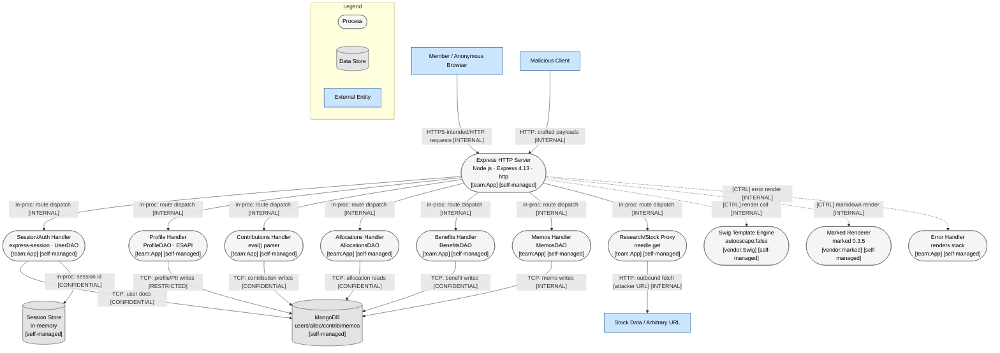

### 3.2 L2 — Trust & Identity

```mermaid
flowchart TD
    %% Version: 2026-06-07 | Phase: 2 | System: NodeGoat | Layer: L2
    subgraph Untrusted["TB1 — Internet Edge (Untrusted, cleartext HTTP)"]
        Browser["Member / Anonymous Browser"]:::external
        Attacker["Malicious Client"]:::external
    end

    subgraph AppZone["TB4 — Authenticated Session / Privilege Boundary"]
        C1(["Express HTTP Server\nNode.js · Express"]):::neutral
        LoginGate{isLoggedIn?}:::identity
        AdminGate{isAdmin? (DISABLED on /benefits)}:::identity
        C2(["Session/Auth Handler"]):::neutral
        C6(["Benefits Handler"]):::neutral
        SessCtl[[express-session cookie\nno httpOnly/secure/sameSite]]:::control
    end

    subgraph DataZone["TB2 — Data Tier"]
        D1[("MongoDB\nno DB auth in URI")]:::dataStore
        D2[("Session Store (in-memory)")]:::dataStore
    end

    Browser --o|"[AUTH] HTTP: session cookie (no flags) [CONFIDENTIAL] [PLAIN]"| C1
    Attacker --o|"[AUTH] HTTP: forged/fixed session [CONFIDENTIAL] [PLAIN]"| C1
    C1 --o|"[AUTH] in-proc: session check [INTERNAL]"| LoginGate
    LoginGate -.->|"[CTRL] pass to handler [INTERNAL]"| C2
    LoginGate -.->|"[CTRL] reaches /benefits w/o admin [INTERNAL]"| C6
    AdminGate -.->|"[ADMIN] commented out — not enforced [RESTRICTED]"| C6
    C2 -->|"TCP: credential lookup (plaintext compare) [RESTRICTED] [PLAIN]"| D1
    C2 --o|"[AUTH] in-proc: set userId (no regenerate) [CONFIDENTIAL]"| SessCtl
    SessCtl -->|"in-proc: session record [CONFIDENTIAL]"| D2

    subgraph Legend_L2["Legend"]
        LgId{Identity/Gate}:::identity
        LgCtl[[Security Control]]:::control
        LgZone["Dashed subgraph = trust boundary"]:::external
    end

    style Untrusted stroke:#e74c3c,stroke-width:2px,stroke-dasharray: 5 5
    style AppZone stroke:#f39c12,stroke-width:2px,stroke-dasharray: 5 5
    style DataZone stroke:#27ae60,stroke-width:2px,stroke-dasharray: 5 5

    classDef neutral fill:#f5f5f5,stroke:#666,stroke-width:1px,color:#000
    classDef external fill:#cce5ff,stroke:#004085,stroke-width:1px,color:#000
    classDef dataStore fill:#e2e3e5,stroke:#383d41,stroke-width:1px,color:#000
    classDef identity fill:#d4e6f1,stroke:#2980b9,stroke-width:1px,color:#000
    classDef control fill:#abebc6,stroke:#27ae60,stroke-width:1px,color:#000
```

### 3.3 L3 — Data

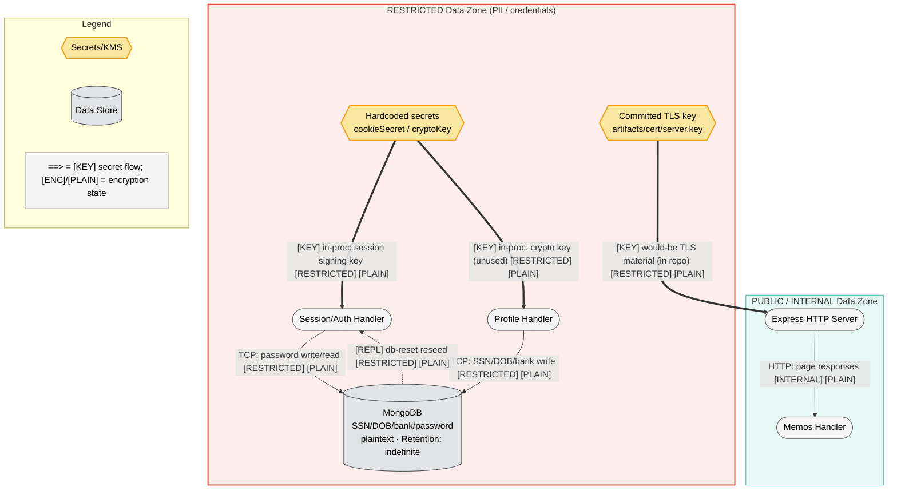

### 3.4 L4 — Threat Overlay

Risk colors and `⚠ STRIDE · L×I=Score BAND` annotations applied; every node carries its
`TM-NNN` finding id. Thick red arrows are the top kill-chain attack paths.

```mermaid
flowchart TD
    %% Version: 2026-06-07 | Phase: 7 | System: NodeGoat | Layer: L4 | Type: threat-overlay
    Browser["Member / Anonymous Browser"]:::external
    Attacker["Malicious Client"]:::external

    C1(["Express HTTP Server\nhttp · no helmet · no csurf\n⚠ I,S,T · 4×4=16 HIGH\nTM-010, TM-017, TM-018 · CWE-319, CWE-352, CWE-693"]):::highRisk
    C2(["Session/Auth Handler\nplaintext creds · no regenerate\n⚠ S,I,E · 4×5=20 CRITICAL\nTM-003, TM-011, TM-015, TM-016, TM-019, TM-023 · CWE-256, CWE-287"]):::criticalRisk
    C3(["Profile Handler\nReDoS regex\n⚠ I,D · 4×5=20 CRITICAL\nTM-014, TM-013 · CWE-311, CWE-1333"]):::criticalRisk
    C4(["Contributions Handler\neval()\n⚠ T,I,E · 5×5=25 CRITICAL\nTM-001 · CWE-95"]):::criticalRisk
    C5(["Allocations Handler\n$where injection · IDOR\n⚠ T,I · 4×5=20 CRITICAL\nTM-002, TM-006 · CWE-943, CWE-639"]):::criticalRisk
    C6(["Benefits Handler\nno isAdmin\n⚠ E,T · 4×4=16 HIGH\nTM-007 · CWE-862"]):::highRisk
    C7(["Memos Handler\nstored XSS\n⚠ T,I,E · 4×4=16 HIGH\nTM-005 · CWE-79"]):::highRisk
    C8(["Research Proxy\nSSRF\n⚠ I,T · 4×4=16 HIGH\nTM-004 · CWE-918"]):::highRisk
    C9(["Swig Engine\nautoescape:false\n⚠ T,I · 4×4=16 HIGH\nTM-005 · CWE-79"]):::highRisk
    C10(["Marked Renderer\nmarked 0.3.5\n⚠ T,LM · 4×4=16 HIGH\nTM-020 · CWE-1104"]):::highRisk
    C11(["Error Handler\nstack leak\n⚠ I · 3×2=6 MEDIUM\nTM-021 · CWE-209"]):::medRisk

    D1[("MongoDB\nplaintext PII + creds\n⚠ I · 4×5=20 CRITICAL\nTM-014, TM-003 · CWE-312")]:::criticalRisk
    D2[("Session Store\ninsecure cookie\n⚠ S,T · 3×4=12 HIGH\nTM-015 · CWE-384")]:::highRisk
    Secrets{{Hardcoded secrets\n⚠ S,I · 4×4=16 HIGH\nTM-009 · CWE-798}}:::highRisk
    Cert{{Committed TLS key\n⚠ S,I · 3×5=15 HIGH\nTM-008 · CWE-321}}:::highRisk
    Supply[/CI/CD + npm deps\n⚠ T,LM · 4×4=16 HIGH\nTM-020 · CWE-1035/]:::highRisk
    Redirect{/learn open redirect\n⚠ S,T · 3×2=6 MEDIUM\nTM-012 · CWE-601}:::medRisk

    %% structural edges (typed)
    Browser -->|"HTTP: requests [INTERNAL] [PLAIN]"| C1
    Attacker -->|"HTTP: payloads [INTERNAL] [PLAIN]"| C1
    C1 -->|"in-proc: dispatch [INTERNAL]"| C2
    C1 -->|"in-proc: dispatch [INTERNAL]"| C4
    C1 -->|"in-proc: dispatch [INTERNAL]"| C5
    C1 -->|"in-proc: dispatch [INTERNAL]"| C6
    C1 -->|"in-proc: dispatch [INTERNAL]"| C7
    C1 -->|"in-proc: dispatch [INTERNAL]"| C8
    C1 -.->|"[CTRL] render [INTERNAL]"| C9
    C1 -.->|"[CTRL] markdown [INTERNAL]"| C10
    C1 -.->|"[CTRL] error render [INTERNAL]"| C11
    C1 -.->|"[CTRL] redirect [INTERNAL]"| Redirect
    C2 -->|"TCP: creds [RESTRICTED] [PLAIN]"| D1
    C3 -->|"TCP: PII [RESTRICTED] [PLAIN]"| D1
    C4 -->|"TCP: contrib [CONFIDENTIAL]"| D1
    C5 -->|"TCP: alloc [CONFIDENTIAL]"| D1
    C2 -->|"in-proc: session [CONFIDENTIAL]"| D2
    Secrets ==>|"[KEY] signing key [RESTRICTED] [PLAIN]"| C2
    Cert ==>|"[KEY] TLS material [RESTRICTED] [PLAIN]"| C1
    Supply -->|"[BUILD] npm install / docker [INTERNAL]"| C1

    %% attack-path overlays (top kill chains)
    Attacker ==>|"KC1-1 default creds TM-011"| C2
    C2 ==>|"KC1-2 RCE via eval TM-001"| C4
    C4 ==>|"KC1-3 exfiltrate DB TM-014"| D1
    Attacker ==>|"KC4-1 SSRF TM-004"| C8

    linkStyle 21 stroke:#cc0000,stroke-width:3px
    linkStyle 22 stroke:#cc0000,stroke-width:3px
    linkStyle 23 stroke:#cc0000,stroke-width:3px
    linkStyle 24 stroke:#cc0000,stroke-width:3px

    subgraph Legend_L4["Legend — Risk"]
        LgC(["criticalRisk"]):::criticalRisk
        LgH(["highRisk"]):::highRisk
        LgM(["medRisk"]):::medRisk
        LgN(["noFindings"]):::noFindings
        LgAtk["==> red = attack path"]:::neutral
    end

    classDef neutral fill:#f5f5f5,stroke:#666,stroke-width:1px,color:#000
    classDef external fill:#cce5ff,stroke:#004085,stroke-width:1px,color:#000
    classDef dataStore fill:#e2e3e5,stroke:#383d41,stroke-width:1px,color:#000
    classDef secrets fill:#f9e79f,stroke:#f39c12,stroke-width:2px,color:#000
    classDef pipeline fill:#d5dbdb,stroke:#7f8c8d,stroke-width:1px,color:#000
    classDef highRisk fill:#ffcccc,stroke:#cc0000,stroke-width:2px,color:#000
    classDef medRisk fill:#ffe6cc,stroke:#cc7a00,stroke-width:2px,color:#000
    classDef lowRisk fill:#ccffcc,stroke:#008000,stroke-width:2px,color:#000
    classDef criticalRisk fill:#dc3545,stroke:#491217,stroke-width:2px,color:#fff
    classDef noFindings fill:#f5f5f5,stroke:#666,stroke-width:1px,color:#000
```

---

## 4. Analytical & Communication Visuals

### 4.1 STRIDE-per-Element Coverage Matrix

Every element examined against every STRIDE-LM category. Cells hold a `TM-NNN`, `n/a`
(category inapplicable to that element type), or `clean` (examined, no finding).

| Element | S | T | R | I | D | E | LM |
|---------|---|---|---|---|---|---|----|
| E1 POST /login | TM-023 | TM-019 | TM-019 | TM-016 | clean | TM-011 | clean |
| E2 POST /signup | TM-022 | clean | clean | clean | clean | clean | clean |
| E3 POST /profile | clean | TM-017 | clean | TM-014 | TM-013 | clean | clean |
| E4 POST /contributions | clean | TM-001 | clean | TM-001 | TM-001 | TM-001 | TM-001 |
| E5 GET /allocations/:userId | clean | TM-002 | clean | TM-006 | TM-002 | TM-006 | clean |
| E6 GET/POST /benefits | clean | TM-007 | clean | TM-007 | clean | TM-007 | clean |
| E7 POST /memos | clean | TM-005 | clean | TM-005 | clean | TM-005 | TM-005 |
| E8 GET /research | clean | TM-004 | clean | TM-004 | clean | clean | TM-004 |
| E9 GET /learn | TM-012 | TM-012 | clean | clean | clean | clean | clean |
| D1 MongoDB | n/a | TM-003 | n/a | TM-014 | clean | n/a | clean |
| D2 Session store | TM-015 | TM-015 | n/a | clean | clean | n/a | n/a |
| D3 Committed TLS key | TM-008 | TM-008 | n/a | TM-008 | n/a | n/a | n/a |
| D4 Hardcoded secrets | TM-009 | TM-009 | n/a | TM-009 | n/a | n/a | n/a |
| D5 Seeded accounts | TM-011 | n/a | n/a | clean | n/a | TM-011 | n/a |
| C1 Express server | TM-010 | TM-018 | clean | TM-010 | clean | clean | clean |
| C2 Session/Auth | TM-003 | TM-023 | TM-019 | TM-016 | clean | TM-011 | clean |
| C3 Profile handler | clean | clean | clean | TM-014 | TM-013 | clean | clean |
| C4 Contributions handler | clean | TM-001 | clean | TM-001 | TM-001 | TM-001 | TM-001 |
| C5 Allocations handler | clean | TM-002 | clean | TM-006 | TM-002 | TM-006 | clean |
| C6 Benefits handler | clean | TM-007 | clean | TM-007 | clean | TM-007 | clean |
| C7 Memos handler | clean | TM-005 | clean | TM-005 | clean | TM-005 | TM-005 |
| C8 Research proxy | clean | TM-004 | clean | TM-004 | clean | clean | TM-004 |
| C9 Swig engine | clean | TM-005 | clean | TM-005 | clean | clean | clean |
| C10 Marked renderer | clean | TM-020 | clean | clean | clean | clean | TM-020 |
| C11 Error handler | n/a | clean | clean | TM-021 | clean | n/a | n/a |
| TB1 Internet edge | TM-010 | TM-018 | clean | TM-010 | clean | clean | n/a |
| TB2 App↔Mongo | clean | TM-002 | n/a | TM-002 | clean | n/a | TM-004 |
| TB3 Supply chain | TM-009 | TM-020 | clean | TM-008 | clean | clean | TM-020 |
| TB4 Privilege boundary | clean | TM-007 | clean | TM-006 | clean | TM-007 | clean |

### 4.2 Likelihood × Impact Risk Heat Map

5×5 grid; each finding plotted at its own (Likelihood, Impact) cell. Bands per OWASP Risk
Rating: LOW 1–4, MED 5–9, HIGH 10–16, CRIT 17–25.

| Impact \ Likelihood | 1 | 2 | 3 | 4 | 5 |
|---------------------|---|---|---|---|---|
| **5** |  |  | TM-008 | TM-003, TM-011, TM-014, TM-002 | TM-001 |
| **4** |  |  | TM-015, TM-017 | TM-004, TM-005, TM-006, TM-007, TM-009, TM-010, TM-020, TM-023 |  |
| **3** |  |  | TM-013, TM-022 |  |  |
| **2** |  |  | TM-012, TM-018, TM-019, TM-021 | TM-016 |  |
| **1** |  |  |  |  |  |

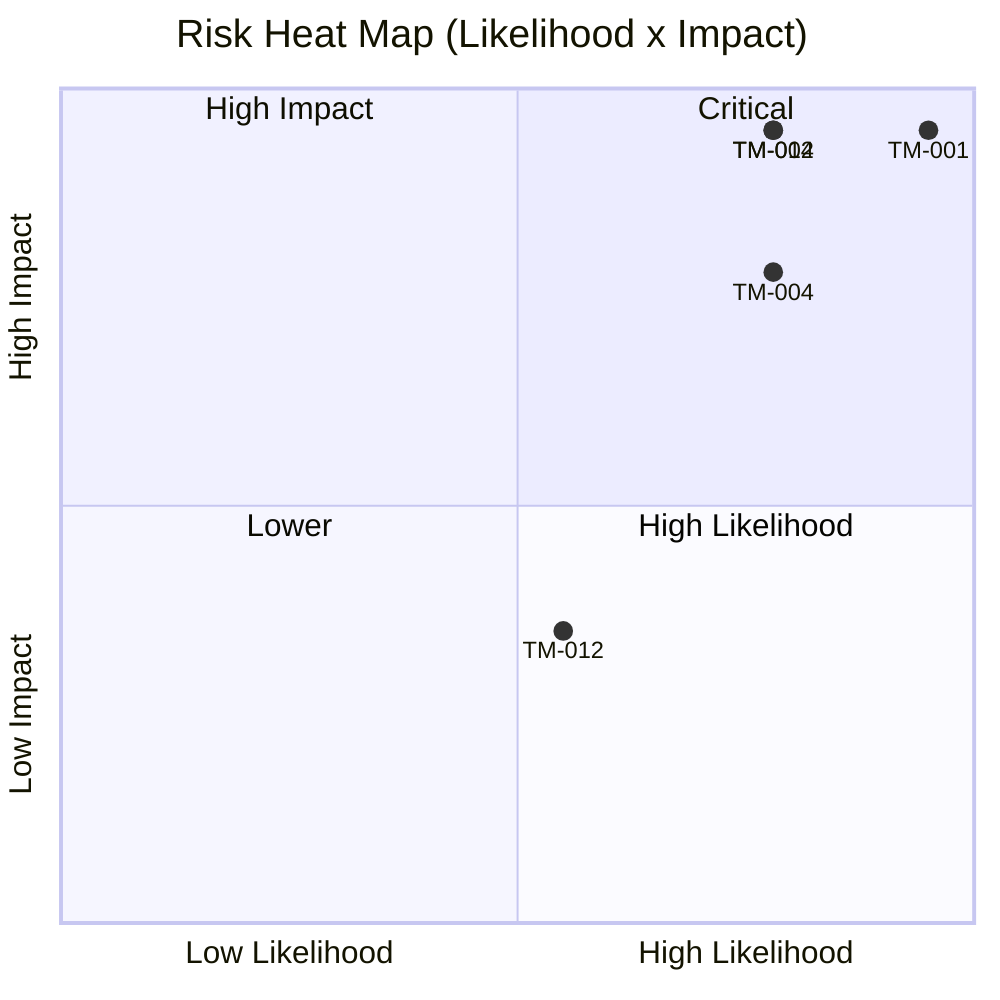

### 4.3 MITRE ATT&CK Technique Coverage

Set of techniques equals the distinct `mitre` ids across the findings.

| Tactic | Technique | ID | Findings |
|--------|-----------|----|----------|
| Initial Access | Exploit Public-Facing Application | T1190 | TM-002, TM-004, TM-006, TM-023 |
| Initial Access | Valid Accounts: Default Accounts | T1078.001 | TM-011 |
| Initial Access | Valid Accounts | T1078 | TM-007 |
| Execution | Command and Scripting Interpreter | T1059 | TM-001 |
| Execution | Command and Scripting Interpreter: JavaScript | T1059.007 | TM-005 |
| Credential Access | Unsecured Credentials | T1552 | TM-003 |
| Credential Access | Unsecured Credentials: Credentials in Files | T1552.001 | TM-009 |
| Credential Access | Unsecured Credentials: Private Keys | T1552.004 | TM-008 |
| Credential Access | Brute Force | T1110 | TM-022 |
| Credential Access | Steal Web Session Cookie | T1539 | TM-015 |
| Collection | Data from Cloud Storage | T1530 | TM-014 |
| Network Effects | Network Sniffing | T1040 | TM-010 |
| Reconnaissance | Gather Victim Identity Info | T1589 | TM-016 |
| Reconnaissance | Gather Victim Host Information | T1592 | TM-021 |
| Impact | Endpoint Denial of Service | T1499 | TM-013 |
| Impact | Stored Data Manipulation | T1565 | TM-019 |
| Defense Evasion / Impact | Browser Session Hijacking | T1185 | TM-017, TM-018 |
| Initial Access | Supply Chain Compromise: Software Dependencies | T1195.001 | TM-020 |
| Initial Access | Phishing | T1566 | TM-012 |

```json
{
  "name": "Threat model — NodeGoat",
  "domain": "enterprise-attack",
  "techniques": [
    {"techniqueID": "T1190", "score": 90, "comment": "TM-002, TM-004, TM-006, TM-023"},
    {"techniqueID": "T1078.001", "score": 90, "comment": "TM-011"},
    {"techniqueID": "T1078", "score": 80, "comment": "TM-007"},
    {"techniqueID": "T1059", "score": 100, "comment": "TM-001"},
    {"techniqueID": "T1059.007", "score": 80, "comment": "TM-005"},
    {"techniqueID": "T1552", "score": 90, "comment": "TM-003"},
    {"techniqueID": "T1552.001", "score": 80, "comment": "TM-009"},
    {"techniqueID": "T1552.004", "score": 75, "comment": "TM-008"},
    {"techniqueID": "T1110", "score": 50, "comment": "TM-022"},
    {"techniqueID": "T1539", "score": 60, "comment": "TM-015"},
    {"techniqueID": "T1530", "score": 90, "comment": "TM-014"},
    {"techniqueID": "T1040", "score": 70, "comment": "TM-010"},
    {"techniqueID": "T1589", "score": 40, "comment": "TM-016"},
    {"techniqueID": "T1592", "score": 40, "comment": "TM-021"},
    {"techniqueID": "T1499", "score": 50, "comment": "TM-013"},
    {"techniqueID": "T1565", "score": 40, "comment": "TM-019"},
    {"techniqueID": "T1185", "score": 60, "comment": "TM-017, TM-018"},
    {"techniqueID": "T1195.001", "score": 70, "comment": "TM-020"},
    {"techniqueID": "T1566", "score": 35, "comment": "TM-012"}
  ]
}
```

### 4.4 Authorization (RBAC) Matrix

`GAP` = access allowed where it should not be; these cells point at the broken-access-control
findings. Anonymous row included.

| Role \ Resource | /login, /signup | /dashboard, /profile | /contributions | /allocations/:userId | /benefits (admin fn) | /memos (shared) | /research, /learn |
|-----------------|------------------|----------------------|----------------|----------------------|----------------------|-----------------|-------------------|
| anonymous       | allow            | deny                 | deny           | deny                 | deny                 | deny            | deny              |
| user            | allow            | allow (own)          | allow (own)    | GAP (IDOR, TM-006)   | GAP (no isAdmin, TM-007) | GAP (all memos, TM-005) | allow (SSRF, TM-004) |
| admin           | allow            | allow                | allow          | allow                | allow                | allow           | allow             |

### 4.5 SBOM / Dependency Graph

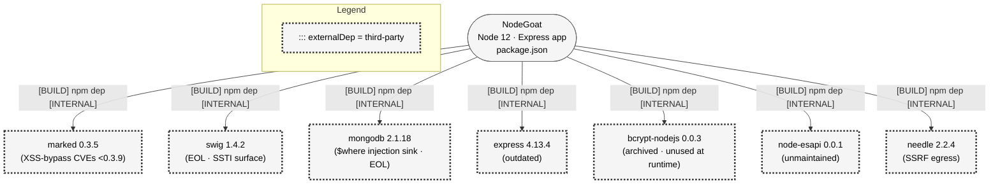

| Package | Version | Manifest | Risk | Related finding |
|---------|---------|----------|------|-----------------|
| marked | 0.3.5 | package.json | Known XSS-bypass CVEs (<0.3.9) | TM-020, TM-005 |
| swig | 1.4.2 | package.json | EOL / unmaintained, SSTI surface | TM-020, TM-005 |
| mongodb | 2.1.18 | package.json | EOL driver; `$where` JS eval | TM-020, TM-002 |
| express | 4.13.4 | package.json | Outdated | TM-020 |
| bcrypt-nodejs | 0.0.3 | package.json | Archived, deprecated (not invoked) | TM-020, TM-003 |
| node-esapi | 0.0.1 | package.json | Unmaintained | TM-020 |
| needle | 2.2.4 | package.json | Outdated; SSRF egress client | TM-020, TM-004 |

### 4.6 Authentication Sequence

Participant IDs match the DFD node IDs. Both success and failure paths shown; the `rect`
block highlights the plaintext credential comparison.

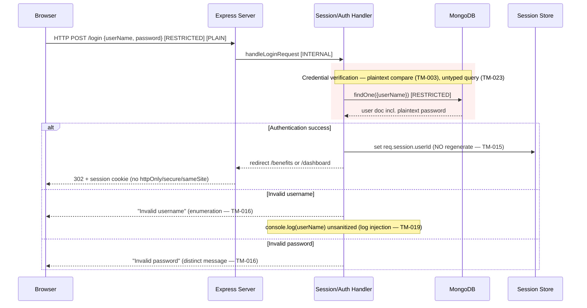

---

## 5. Findings

Severity = OWASP band of Likelihood × Impact (LOW 1–4, MEDIUM 5–9, HIGH 10–16,
CRITICAL 17–25). IDs match `findings.json`.

### [CRITICAL] TM-001: Server-side JavaScript injection via `eval()` on contribution inputs
- **STRIDE-LM:** T, I, E, D, LM · **CWE:** CWE-95, CWE-94 · **MITRE:** T1059
- **L×I:** 5×5 = 25 · **Affected:** C4 Contributions handler, D1 MongoDB · **Surface:** E4
- `app/routes/contributions.js` runs `eval(req.body.preTax)` (and `afterTax`, `roth`) on raw
  body fields. An authenticated member submits a JavaScript payload and executes arbitrary
  code in the Node process — full host and database compromise.
- **Remediation:** replace `eval()` with `parseInt(..., 10)` and reject `NaN` (the commented A1 fix).

### [CRITICAL] TM-002: NoSQL JavaScript injection via `$where` in allocations threshold
- **STRIDE-LM:** T, I, D · **CWE:** CWE-943, CWE-89 · **MITRE:** T1190
- **L×I:** 4×5 = 20 · **Affected:** C5 Allocations handler, D1 MongoDB · **Surface:** E5
- `allocations-dao.js` interpolates `threshold` into `{$where: "...this.stocks > '<threshold>'"}`.
  Payloads such as `0';while(true){}'` or `1'; return 1 == '1` execute attacker JS in the DB,
  enabling data exfiltration and DoS.
- **Remediation:** `parseInt` and range-check the threshold; never build `$where` from user input.

### [CRITICAL] TM-003: Passwords stored and compared in plaintext
- **STRIDE-LM:** I, S · **CWE:** CWE-256, CWE-257 · **MITRE:** T1552
- **L×I:** 4×5 = 20 · **Affected:** C2, D1 MongoDB, D5 seeded accounts · **Surface:** E1
- `user-dao.js` `addUser` stores `password` as-is and `validateLogin` uses `fromDB === fromUser`.
  Any DB read yields cleartext credentials for reuse.
- **Remediation:** `bcrypt.hashSync` on signup, `bcrypt.compareSync` on login (commented A2 fix).

### [CRITICAL] TM-011: Seeded default admin account with weak password
- **STRIDE-LM:** S, E · **CWE:** CWE-1392, CWE-521 · **MITRE:** T1078.001
- **L×I:** 4×5 = 20 · **Affected:** D5 seeded accounts, C2 · **Surface:** E1
- `artifacts/db-reset.js` seeds `admin/Admin_123` (`isAdmin:true`) plus guessable user accounts.
  With plaintext storage and no lockout, an attacker logs straight in as admin.
- **Remediation:** never ship default creds to production; seed only in test, force rotation.

### [CRITICAL] TM-014: Sensitive PII (SSN, DOB, bank details) stored unencrypted
- **STRIDE-LM:** I · **CWE:** CWE-311, CWE-312 · **MITRE:** T1530
- **L×I:** 4×5 = 20 · **Affected:** D1 MongoDB, C3 Profile handler · **Surface:** E3
- `profile-dao.js` stores `ssn/dob/bankAcc/bankRouting` in plaintext (the crypto helpers are
  commented out). Any DB compromise discloses regulated identity/financial data for all members.
- **Remediation:** encrypt SSN/DOB/bank fields at rest with a KMS-managed key (commented A6 fix).

### [HIGH] TM-004: Server-side request forgery in stock research proxy
- **STRIDE-LM:** I, T, LM · **CWE:** CWE-918 · **MITRE:** T1190
- **L×I:** 4×4 = 16 · **Affected:** C8 Research proxy, TB2 · **Surface:** E8
- `research.js` builds `url = req.query.url + req.query.symbol` and passes it to `needle.get`
  with no allowlist; an attacker targets cloud metadata or internal services and the body is echoed.
- **Remediation:** drop the user URL; pin a fixed provider host, validate `symbol`, block internal ranges.

### [HIGH] TM-005: Stored XSS via shared memos with auto-escaping disabled
- **STRIDE-LM:** T, I, E, LM · **CWE:** CWE-79 · **MITRE:** T1059.007
- **L×I:** 4×4 = 16 · **Affected:** C7 Memos handler, C9 Swig, D1 · **Surface:** E7
- `memos.js` stores `req.body.memo` unsanitized; `getAllMemos` returns memos to **every** user
  and Swig runs with `autoescape:false`, so a script payload fires in other users' (including
  admins') sessions — an account-takeover chain, not a self-XSS.
- **Remediation:** set Swig `autoescape:true`, contextually encode memo output, scope visibility.

### [HIGH] TM-006: IDOR — allocations addressed by URL `userId`
- **STRIDE-LM:** I, E · **CWE:** CWE-639, CWE-284 · **MITRE:** T1190
- **L×I:** 4×4 = 16 · **Affected:** C5, D1 · **Surface:** E5
- `allocations.js` reads `userId` from `req.params` instead of the session; any member enumerates
  `/allocations/<n>` to read other members' portfolios.
- **Remediation:** derive `userId` from `req.session`, ignore the path param (commented A4 fix).

### [HIGH] TM-007: Missing function-level access control on benefits admin
- **STRIDE-LM:** E, T, I · **CWE:** CWE-862, CWE-285 · **MITRE:** T1078
- **L×I:** 4×4 = 16 · **Affected:** C6, TB4 · **Surface:** E6
- `/benefits` is guarded only by `isLoggedIn`; the handler hardcodes `isAdmin:true`, so any
  user lists non-admin users and rewrites `benefitStartDate`.
- **Remediation:** add `isAdmin` middleware to both `/benefits` routes (commented A7 fix).

### [HIGH] TM-008: TLS private key and certificate committed to the repository
- **STRIDE-LM:** S, I, T · **CWE:** CWE-798, CWE-321 · **MITRE:** T1552.004
- **L×I:** 3×5 = 15 · **Affected:** D3 committed key, TB3 · **Surface:** TB3
- `artifacts/cert/server.key` holds a usable `RSA PRIVATE KEY` in version control; anyone with
  repo access can impersonate the TLS endpoint or decrypt captured traffic.
- **Remediation:** purge from history, rotate, inject certs from a secrets manager at deploy.

### [HIGH] TM-009: Hardcoded session, crypto, and scanner secrets in config
- **STRIDE-LM:** S, I, T · **CWE:** CWE-798 · **MITRE:** T1552.001
- **L×I:** 4×4 = 16 · **Affected:** D4 hardcoded secrets, C1, C2 · **Surface:** TB3
- `config/env/all.js` ships `cookieSecret` and `cryptoKey` as fixed strings and env files commit a
  `zapApiKey`. A known `cookieSecret` lets an attacker forge/seal session cookies.
- **Remediation:** load secrets from env/secret store, generate strong random values per deploy.

### [HIGH] TM-010: Application served over cleartext HTTP
- **STRIDE-LM:** I, S, T · **CWE:** CWE-319 · **MITRE:** T1040
- **L×I:** 4×4 = 16 · **Affected:** C1, D1 · **Surface:** TB1
- `server.js` starts `http.createServer`; the HTTPS block is commented out, so credentials,
  session cookies, and PII cross the internet edge in plaintext.
- **Remediation:** terminate TLS (the commented HTTPS server), set secure cookies, add HSTS.

### [HIGH] TM-015: No session regeneration on login; insecure cookie flags
- **STRIDE-LM:** S, T · **CWE:** CWE-384, CWE-614 · **MITRE:** T1539
- **L×I:** 3×4 = 12 · **Affected:** C2, D2 session store · **Surface:** E1
- `handleLoginRequest` sets `req.session.userId` without `regenerate()`, and the session cookie has
  no `httpOnly/secure/sameSite` — session fixation plus theft over the cleartext channel.
- **Remediation:** call `req.session.regenerate()` on login; set `httpOnly, secure, sameSite=strict`.

### [HIGH] TM-017: No CSRF protection on state-changing POST routes
- **STRIDE-LM:** T, S · **CWE:** CWE-352 · **MITRE:** T1185
- **L×I:** 3×4 = 12 · **Affected:** C1, C3 · **Surface:** E3, E4, E6, E7
- `csurf` is commented out; a logged-in victim visiting a malicious page silently submits profile,
  contribution, benefit, or memo changes using the ambient session cookie.
- **Remediation:** enable `csurf` and verify a CSRF token on every form (commented A8 fix).

### [HIGH] TM-020: Vulnerable and outdated third-party dependencies
- **STRIDE-LM:** T, LM, I · **CWE:** CWE-1104, CWE-1035 · **MITRE:** T1195.001
- **L×I:** 4×4 = 16 · **Affected:** C1, C10 marked · **Surface:** TB3
- `package.json` pins `marked 0.3.5` (XSS-bypass CVEs), `swig 1.4.2` (EOL SSTI), `mongodb 2.x`,
  `express 4.13` — known exploits are directly reachable.
- **Remediation:** upgrade to maintained versions, add `npm audit`/Snyk to CI, replace abandoned packages.

### [HIGH] TM-023: NoSQL operator injection on login via untyped body
- **STRIDE-LM:** S, T, I · **CWE:** CWE-943 · **MITRE:** T1190
- **L×I:** 3×4 = 12 · **Affected:** C2, D1 · **Surface:** E1
- `userName` from the JSON body reaches `usersCol.findOne({userName})` untyped; a body such as
  `{"userName":{"$gt":""}}` matches an arbitrary user, and with plaintext comparison can bypass auth.
- **Remediation:** coerce `userName`/`password` to strings before querying; reject non-string types.

### [MEDIUM] TM-012: Open redirect via `/learn` `url` parameter
- **STRIDE-LM:** S, T · **CWE:** CWE-601 · **MITRE:** T1566 · **L×I:** 3×2 = 6 · **Surface:** E9
- `index.js` calls `res.redirect(req.query.url)` with no allowlist — phishing bounce under the app's trust.
- **Remediation:** redirect only to a vetted allowlist of relative paths.

### [MEDIUM] TM-013: ReDoS in bank-routing validation
- **STRIDE-LM:** D · **CWE:** CWE-1333, CWE-400 · **MITRE:** T1499 · **L×I:** 3×3 = 9 · **Surface:** E3
- `profile.js` validates `bankRouting` with `/([0-9]+)+#/` (nested quantifier); a long digit string
  without `#` triggers catastrophic backtracking that pins the event loop.
- **Remediation:** use `/([0-9]+)#/` and cap input length.

### [MEDIUM] TM-016: Username enumeration via distinct login errors
- **STRIDE-LM:** I · **CWE:** CWE-203, CWE-204 · **MITRE:** T1589 · **L×I:** 4×2 = 8 · **Surface:** E1
- `validateLogin` returns "Invalid username" vs "Invalid password" distinctly, enabling username harvesting.
- **Remediation:** return one generic message for both cases.

### [MEDIUM] TM-018: Security response headers disabled
- **STRIDE-LM:** T, I · **CWE:** CWE-693, CWE-1021 · **MITRE:** T1185 · **L×I:** 3×2 = 6 · **Surface:** TB1
- `helmet`, frameguard, noSniff, CSP, HSTS are all commented out and `x-powered-by` is exposed —
  clickjacking and MIME-sniffing are possible.
- **Remediation:** enable `helmet` with frameguard/noSniff/CSP/HSTS and disable `x-powered-by` (commented A5 fix).

### [MEDIUM] TM-019: Log injection / CRLF via unsanitized username
- **STRIDE-LM:** T, R · **CWE:** CWE-117 · **MITRE:** T1565 · **L×I:** 3×2 = 6 · **Surface:** E1
- `console.log` writes the raw `userName` on a bad login; CRLF forges additional log lines.
- **Remediation:** encode/strip CRLF before logging (commented ESAPI A1-3 fix).

### [MEDIUM] TM-021: Verbose error handler leaks stack traces
- **STRIDE-LM:** I · **CWE:** CWE-209 · **MITRE:** T1592 · **L×I:** 3×2 = 6 · **Surface:** E8
- `error.js` renders the raw error object (including stack) into `error-template`, exposing paths,
  versions, and internal logic.
- **Remediation:** render a generic error page in production; log details server-side only.

### [MEDIUM] TM-022: Weak signup password policy
- **STRIDE-LM:** S · **CWE:** CWE-521 · **MITRE:** T1110 · **L×I:** 3×3 = 9 · **Surface:** E2
- `validateSignup` `PASS_RE` is `/^.{1,20}$/` — a single character passes; with no lockout this enables brute force.
- **Remediation:** require >=8 chars with mixed classes (commented stronger `PASS_RE`) and add rate limiting.

---

## 6. Kill Chains, Attack Trees, and Attack Flows

Four multi-step kill chains were declared (`findings.json` `kill_chains[]`). Each gets one
attack tree (goal decomposition) and one attack flow (temporal progression).

### KC1 — Remote code execution and host control (TM-011 → TM-001)

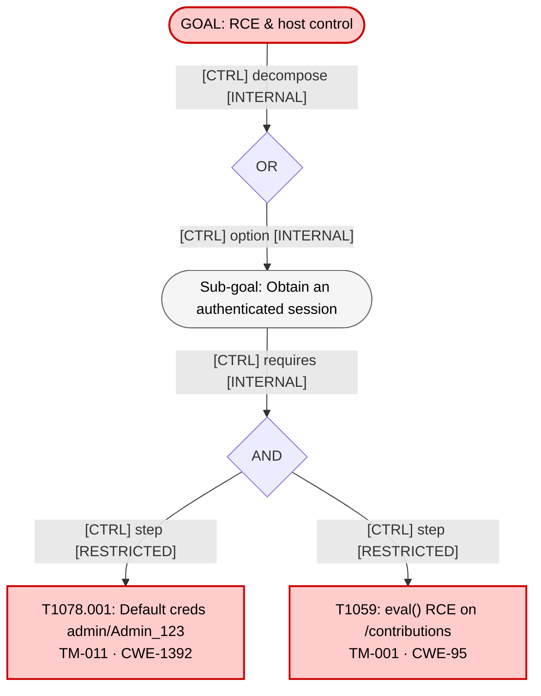

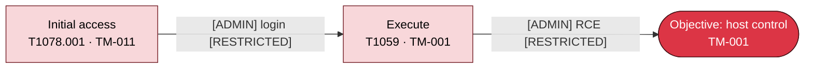

### KC2 — Exfiltrate member PII and credentials (TM-010 → TM-023 → TM-002 → TM-014 → TM-003)

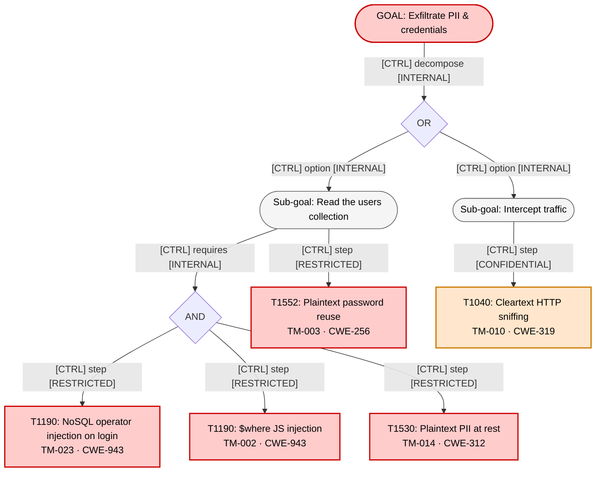

```mermaid
flowchart LR
    %% Version: 2026-06-07 | Phase: 5 | System: NodeGoat | Type: attack-flow | Chain: KC2
    %% type: attack-flow
    IA["Initial access\nT1040 · TM-010"]:::highRisk
    S2["Auth bypass\nT1190 · TM-023"]:::highRisk
    S3["DB query injection\nT1190 · TM-002"]:::highRisk
    S4["Read plaintext PII\nT1530 · TM-014"]:::highRisk
    OBJ(["Objective: exfiltrate PII + creds\nT1552 · TM-003"]):::criticalRisk
    IA -->|"[ADMIN] sniff [CONFIDENTIAL]"| S2
    S2 -->|"[ADMIN] bypass [RESTRICTED]"| S3
    S3 -->|"[ADMIN] inject [RESTRICTED]"| S4
    S4 -->|"[ADMIN] read [RESTRICTED]"| OBJ
    classDef highRisk fill:#f8d7da,stroke:#721c24,color:#000
    classDef criticalRisk fill:#dc3545,stroke:#491217,color:#fff
```

### KC3 — Privilege escalation to admin via stored XSS (TM-022 → TM-005 → TM-007)

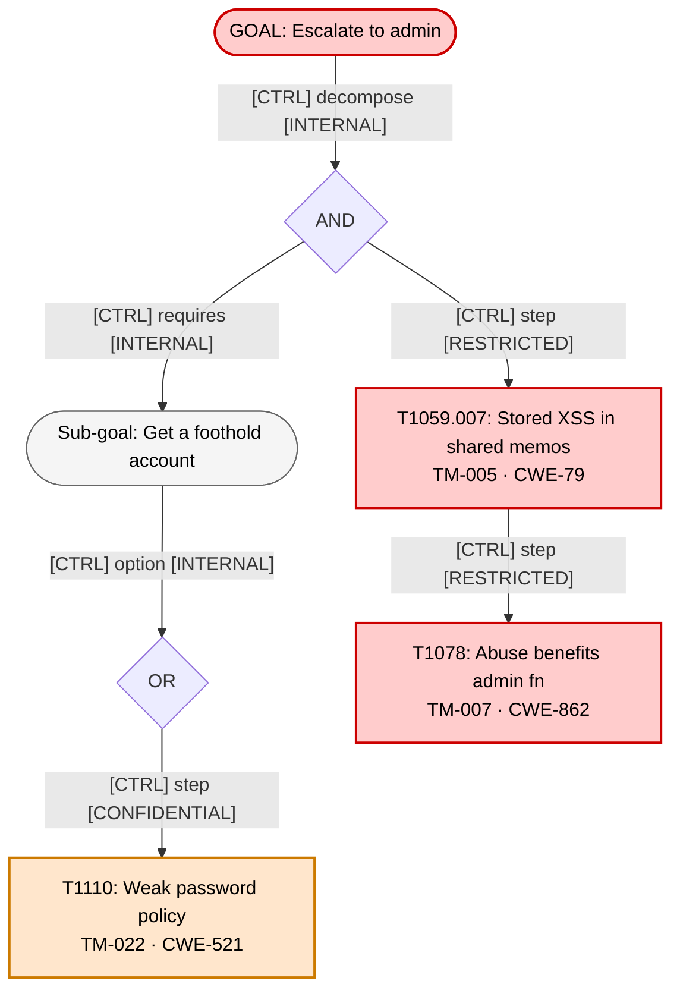

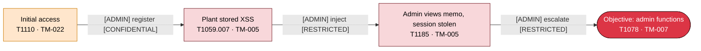

### KC4 — Pivot to internal network via SSRF (TM-010 → TM-004)

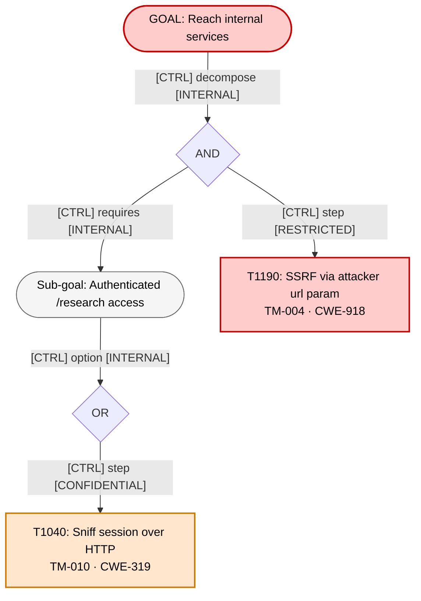

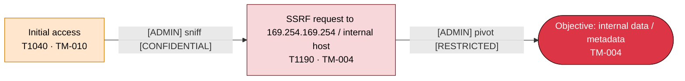

---

## 7. Remediation

Grouped by wave; quick wins are high-impact, low-effort, and dependency-free.

### Wave 1 — Stop active compromise (immediate)
| R-ID | Title | Addresses | Effort | Quick win |
|------|-------|-----------|--------|-----------|
| R-001 | Replace `eval()` with `parseInt` | TM-001 | LOW | yes |
| R-002 | Remove `$where`; parse/range-check threshold | TM-002 | LOW | yes |
| R-003 | Coerce login body fields to strings | TM-023 | LOW | yes |
| R-004 | Remove seeded admin from production seed | TM-011 | LOW | yes |
| R-005 | Add `isAdmin` middleware to `/benefits` | TM-007 | LOW | yes |
| R-006 | Use session `userId`, drop `:userId` param | TM-006 | LOW | yes |

### Wave 2 — Protect data and credentials
| R-ID | Title | Addresses | Effort | Dependencies |
|------|-------|-----------|--------|--------------|
| R-007 | bcrypt-hash passwords | TM-003 | MEDIUM | — |
| R-008 | Encrypt SSN/DOB/bank at rest | TM-014 | MEDIUM | R-010 |
| R-009 | Purge & rotate committed TLS key/cert | TM-008 | MEDIUM | — |
| R-010 | Move secrets to env/secret store | TM-009 | MEDIUM | — |
| R-011 | Serve over HTTPS + HSTS | TM-010 | MEDIUM | R-009 |

### Wave 3 — Harden the web layer
| R-ID | Title | Addresses | Effort | Dependencies |
|------|-------|-----------|--------|--------------|
| R-012 | Enable Swig auto-escape, encode memo output | TM-005 | LOW | — |
| R-013 | Enable `csurf` on state-changing routes | TM-017 | MEDIUM | — |
| R-014 | Session `regenerate()` + secure cookie flags | TM-015 | LOW | R-011 |
| R-015 | Enable `helmet` (frameguard/noSniff/CSP/HSTS) | TM-018 | LOW | — |
| R-016 | Allowlist `/learn` and `/research` URLs | TM-004, TM-012 | MEDIUM | — |

### Wave 4 — Reduce residual risk
| R-ID | Title | Addresses | Effort | Dependencies |
|------|-------|-----------|--------|--------------|
| R-017 | Upgrade/replace vulnerable deps; add `npm audit` to CI | TM-020 | MEDIUM | — |
| R-018 | Generic login errors + rate limiting | TM-016, TM-022 | LOW | — |
| R-019 | Fix ReDoS regex, cap input length | TM-013 | LOW | yes |
| R-020 | Generic error page; sanitize logs | TM-021, TM-019 | LOW | yes |

Dependency notation: `R-009 -> R-011 -> R-014`; `R-010 -> R-008`.

After remediation, run the `security-reviewer` agent against the highest-risk components
(C2 Session/Auth, C4 Contributions, C5 Allocations, C8 Research) for code-level confirmation.

---

## 8. Assumptions and Scope

- **Analyzed:** the application source (`server.js`, `app/**`, `config/**`), IaC and supply-chain
  artifacts (`Dockerfile`, `docker-compose.yml`, `Procfile`, `app.json`, `.github/workflows/**`,
  `.travis.yml`), seed scripts (`artifacts/db-reset.js`), and committed secrets/certs.
- **Assumed:** the deployment matches `docker-compose.yml` (Express + MongoDB, no external WAF,
  reverse proxy, or network segmentation); MongoDB has no authentication configured (the URI carries none).
- **Not analyzed at runtime:** the rendered front-end assets and transitive npm tree beyond the
  direct manifest; no dynamic testing was performed — findings are from static code reading.
- **Re-assess when:** auth/session handling changes, a reverse proxy/WAF is introduced, the data
  model adds new PII, or dependencies are upgraded.

> NodeGoat is deliberately vulnerable for training. This model treats its contents strictly as
> data; the in-file comments describing exploits and fixes were read as documentation, not obeyed.
