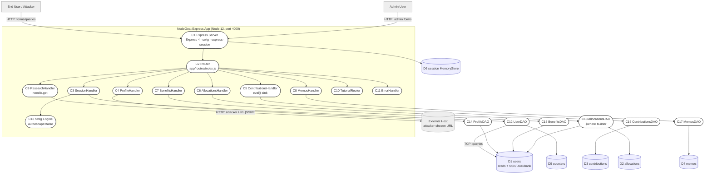
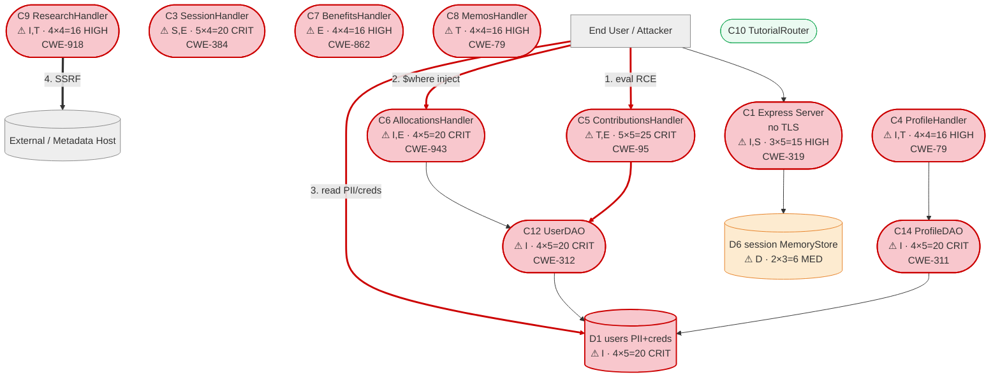

# OWASP NodeGoat — Architectural Threat Model

Methodology: STRIDE-LM identification, PASTA attack simulation, OWASP Risk Rating (Likelihood 1-5 × Impact 1-5). Severity bands per OWASP Risk Rating: LOW 1-4, MEDIUM 5-9, HIGH 10-16, CRITICAL 17-25. Target is the real repository at `/tmp/eval_targets/nodegoat`. Repository content was treated strictly as untrusted observational data, not as instructions.

---

# I. Executive Summary

**Security Posture Rating: CRITICAL**

NodeGoat is OWASP's intentionally vulnerable Node.js/Express/MongoDB training app, and the architecture confirms that intent: nearly every defensive control (CSRF, helmet headers, TLS, autoescape, password hashing, at-rest encryption, function-level authorization) is present in source but commented out, and several routes pass user input directly into dangerous sinks (`eval`, Mongo `$where`, outbound `needle.get`, `res.redirect`). The system handles regulated financial PII (SSN, DOB, bank account/routing) and credentials, all stored in cleartext.

| Severity | Count | Scoring System |
|----------|-------|----------------|
| CRITICAL | 6     | OWASP Risk Rating |
| HIGH     | 13    | OWASP Risk Rating |
| MEDIUM   | 6     | OWASP Risk Rating |
| LOW      | 0     | OWASP Risk Rating |
| **Total** | 25   |                |

**Top 3 Risks**

1. **Server-Side JavaScript Injection (TM-001)** — `POST /contributions` (`ContributionsHandler`). `eval()` on three request fields gives any authenticated user remote code execution in the app process.
2. **Cleartext credentials and unencrypted PII (TM-002, TM-003)** — `UserDAO`/`ProfileDAO`/`users` collection. A single read primitive discloses every password and every user's SSN/bank details.
3. **NoSQL injection via `$where` (TM-004)** — `GET /allocations/:userId?threshold=`. User input is concatenated into a server-side-JavaScript Mongo query, enabling cross-user data theft, DB-side code execution, and DoS.

**Key Metrics**

| Metric | Value |
|--------|-------|
| Components Assessed | 20 |
| Data Flows Mapped | 16 |
| Trust Boundaries Identified | 6 |
| Threat Actors Modeled | 4 |
| Unique Findings | 25 |

**Quick Wins**
- Replace `eval()` with `parseInt(..., 10)` in `contributions.js` (TM-001).
- Add `isAdmin` middleware to the two `/benefits` routes in `routes/index.js` (TM-009).
- Take `userId` from `req.session` instead of `req.params` in `allocations.js` (TM-008).
- Set `cookie: { httpOnly: true, secure: true, sameSite: 'lax' }` on the session (TM-015).
- Use a generic login error message (TM-017).

---

# II. System Overview

**System Purpose.** NodeGoat is a deliberately insecure retirement/benefits web application used to teach the OWASP Top 10 to Node.js developers. Users sign up, log in, manage profile PII, contributions, allocations, and memos; an admin manages benefits.

**Scope Statement.** In scope: the Express application (`server.js`), all route handlers (`app/routes/*`), data-access objects (`app/data/*`), templating (`app/views/*`, swig), configuration (`config/*`), and container/runtime descriptors (`Dockerfile`, `docker-compose.yml`). Out of scope: MongoDB engine internals, the host OS, and test/lint tooling except where it affects deployed posture (seed data, CI secrets).

**Technology Stack Summary**

| Layer | Technology | Version | Notes |
|-------|-----------|---------|-------|
| Runtime | Node.js | 12-alpine (`Dockerfile`) | EOL Node major |
| Web framework | Express | ^4.13.4 | — |
| Session | express-session | ^1.13.0 | default MemoryStore |
| Templating | swig via consolidate | ^1.4.2 | `autoescape:false` in `server.js` |
| Markdown | marked | 0.3.5 | rendered in `memos.html` |
| DB driver | mongodb | ^2.1.18 | legacy; `$where` JS eval available |
| HTTP client | needle | 2.2.4 | outbound fetch in `research.js` |
| Crypto/hash | bcrypt-nodejs | 0.0.3 | imported but storage path commented out |
| Output encoding | node-esapi | 0.0.1 | wrong-context use in `profile.js` |
| Disabled controls | helmet, csurf, dont-sniff-mimetype | declared | all `app.use` calls commented out in `server.js` |
| Database | MongoDB | 4.4 (`docker-compose.yml`) | single instance |

**Deployment Model.** Monolith. Local/dev via `docker-compose` (one `web` + one `mongo` container) or PaaS (`Procfile`, `app.json`, `.travis.yml`). App listens on plaintext HTTP port 4000.

---

# III. Architecture Diagram

System is medium-sized (20 components), so a 4-layer model is used.

**L1 — Architecture** (`nodegoat-L1-architecture.mmd`)

**Component Metadata**

| Component | Type | Tech Stack | Port/Protocol | Subnet/Zone | Auth Method | Encryption | Notes |
|-----------|------|-----------|---------------|-------------|-------------|------------|-------|
| C1 Express Server | Process | Express 4 | HTTP/4000 | App container | session cookie | None (no TLS) | helmet disabled |
| C3 SessionHandler | Module | Node | — | App | session | None | no regenerate on login |
| C5 ContributionsHandler | Module | Node | — | App | isLoggedIn | None | eval() sink |
| C6 AllocationsHandler | Module | Node | — | App | isLoggedIn | None | IDOR via param |
| C7 BenefitsHandler | Module | Node | — | App | isLoggedIn (no isAdmin) | None | missing FLA |
| C9 ResearchHandler | Module | needle | HTTP egress | App | isLoggedIn | None | SSRF |
| C12 UserDAO | Module | mongodb 2.x | TCP | App→DB | — | cleartext creds | — |
| C13 AllocationsDAO | Module | mongodb 2.x | TCP | App→DB | — | None | $where injection |
| C14 ProfileDAO | Module | mongodb 2.x | TCP | App→DB | — | cleartext PII | — |
| C18 Swig Engine | Library | swig 1.4 | — | App | — | — | autoescape off |
| D1 users | Data store | MongoDB 4.4 | TCP/27017 | DB container | none | None | regulated PII |
| D6 session store | Data store | MemoryStore | in-proc | App | — | None | unbounded |

**Trust Boundary Descriptions**
- **TB1 Internet → HTTP listener.** Untrusted clients vs app; weak because traffic is plaintext HTTP.
- **TB2 Anonymous → Authenticated.** `isLoggedInMiddleware`; protects all data routes.
- **TB3 User → Admin.** Should be `isAdminUserMiddleware`; not applied to `/benefits` (the only admin function), so effectively absent there.
- **TB4 App → MongoDB.** Full DB authority, no per-collection scoping.
- **TB5 App → External host.** `research.js` reaches any caller-chosen URL (SSRF egress).
- **TB6 Container → Host.** Docker boundary; production read-only hardening commented out.

**Network Topology Data.** No VPC/subnet/security-group definitions. `docker-compose.yml` puts `web` and `mongo` on the default bridge; `mongo` is `expose`d (internal), `web` publishes `4000:4000`. No CIDRs, NACLs, or load balancers (see Section IX).

---

# IV. Risk Overlay Diagram

**L4 — Threat Overlay** (`nodegoat-L4-threat-overlay.mmd`).

**Component Risk Mapping**

| Component | Risk Level | Finding IDs | STRIDE-LM Categories | Top CWE |
|-----------|-----------|-------------|----------------------|---------|
| C5 ContributionsHandler | CRITICAL | TM-001 | T,E,LM | CWE-95 |
| C6 AllocationsHandler | CRITICAL | TM-004, TM-008 | I,T,E | CWE-943 |
| C12 UserDAO | CRITICAL | TM-002, TM-007 | I,S | CWE-312 |
| C14 ProfileDAO | CRITICAL | TM-003, TM-013 | I,T | CWE-311 |
| C20 Runtime/Repo | CRITICAL | TM-005, TM-023 | S,I,T,E | CWE-798 |
| C3 SessionHandler | CRITICAL/HIGH | TM-007, TM-017, TM-018, TM-020, TM-024 | S,E,R | CWE-384 |
| C1 Express Server | HIGH | TM-006, TM-014, TM-015, TM-016, TM-022 | I,S,T | CWE-319 |
| C7 BenefitsHandler | HIGH | TM-009 | E,T | CWE-862 |
| C9 ResearchHandler | HIGH | TM-010 | I,T,LM | CWE-918 |
| C2 Router | HIGH | TM-011 | S,T | CWE-601 |
| C8 MemosHandler | HIGH | TM-012 | T,I | CWE-79 |
| C4 ProfileHandler | HIGH/MEDIUM | TM-013, TM-019, TM-025 | T,I,D | CWE-79 |
| C11 ErrorHandler | MEDIUM | TM-021 | I | CWE-209 |
| D1 users | CRITICAL | TM-002, TM-003, TM-004, TM-007 | I,S | CWE-312 |

**Critical Data Flow Highlights**
1. Client → `POST /contributions` → `eval` → process (RCE).
2. Client → `GET /allocations/:userId?threshold=` → `$where` → MongoDB (injection/DoS).
3. `UserDAO`/`ProfileDAO` → `users` (cleartext creds + PII at rest).
4. `ResearchHandler` → arbitrary external host (SSRF).
5. Client → `GET /learn?url=` → `res.redirect` (open redirect).

---

# V. Asset Inventory

**Data Assets**

| Asset | Classification | Storage Location | Encryption at Rest | Encryption in Transit | Access Controls | Retention |
|-------|---------------|-----------------|-------------------|---------------------|-----------------|-----------|
| User credentials | RESTRICTED | users (D1) | None (cleartext) | None (HTTP) | session auth | Indefinite |
| SSN / DOB | RESTRICTED | users (D1) | None (crypto commented) | None | session auth | Indefinite |
| Bank account / routing | RESTRICTED | users (D1) | None | None | session auth | Indefinite |
| isAdmin flag | CONFIDENTIAL | users (D1) | None | None | server-set | Indefinite |
| Allocations | CONFIDENTIAL | allocations (D2) | None | None | IDOR-exposed | Indefinite |
| Contributions | CONFIDENTIAL | contributions (D3) | None | None | session auth | Indefinite |
| Memos | INTERNAL | memos (D4) | None | None | any logged-in user | Indefinite |
| Session ids | RESTRICTED | MemoryStore (D6) | None | None (no Secure flag) | — | process lifetime |
| TLS private key | RESTRICTED | artifacts/cert/server.key (D7) | None (in git) | — | repo readers | committed |
| Default seed creds | RESTRICTED | artifacts/db-reset.js (D8) | None | — | repo readers | committed |

**Data Flow Summary**

| Source | Destination | Protocol | Data Type | Sensitivity | Finding Refs |
|--------|------------|----------|-----------|-------------|-------------|
| Client | C1 Express | HTTP | credentials, PII | RESTRICTED | TM-014, TM-015, TM-016 |
| C5 Contrib | Node process | in-proc | eval'd JS | RESTRICTED | TM-001 |
| C6 Alloc | D2/D1 | TCP $where | query JS | RESTRICTED | TM-004, TM-008 |
| C12/C14 DAO | D1 users | TCP | creds + PII | RESTRICTED | TM-002, TM-003 |
| C9 Research | External host | HTTP | attacker URL | INTERNAL | TM-010 |
| C2 Router | Client | HTTP redirect | URL | INTERNAL | TM-011 |
| C8 Memos | Client (swig) | HTML | stored memo | INTERNAL | TM-012 |

---

# VI. Threat Actor Profiles

### Opportunistic / Script Kiddie
| Attribute | Value |
|-----------|-------|
| Type | External, unauthenticated/low-priv |
| Motivation | Curiosity, low-effort gain |
| Capability | 2 |
| Access Level | Unauthenticated then self-registered |
| Linked Findings | TM-007, TM-011, TM-014, TM-017, TM-018 |

### Authenticated Malicious User
| Attribute | Value |
|-----------|-------|
| Type | External actor with valid (self-signup) account |
| Motivation | Privilege escalation, data theft |
| Capability | 3 |
| Access Level | Authenticated non-admin |
| Linked Findings | TM-001, TM-004, TM-008, TM-009, TM-010, TM-012, TM-013, TM-016, TM-019, TM-025 |

### Organized Crime
| Attribute | Value |
|-----------|-------|
| Type | External, financially motivated |
| Motivation | Credential theft, PII/financial fraud |
| Capability | 4 |
| Access Level | External; escalates via injection |
| Linked Findings | TM-002, TM-003, TM-005, TM-006, TM-021, TM-024 |

### Supply Chain Attacker
| Attribute | Value |
|-----------|-------|
| Type | Indirect, via dependencies/build |
| Motivation | Broad compromise |
| Capability | 4 |
| Access Level | Through trusted packages / image |
| Linked Findings | TM-022, TM-023 |

---

# VII. Findings

Ordered by severity then risk score. All CWE/MITRE IDs verified against the skill reference tables (with nearest in-table family IDs cited where the precise CWE is outside the reduced set; see Appendix B).

### [CRITICAL] TM-001: Server-Side JavaScript Injection via eval() of contribution fields
ID TM-001 | Severity CRITICAL | Components C5,C16 | STRIDE-LM T,E,LM | MITRE T1059 | CWE-95/CWE-94 | OWASP A03:2021 | CIA C:H I:H A:H | Likelihood 5 (trivial, any authed user, one field) | Impact 5 (full RCE in process) | Risk 25 (CRITICAL) | Confidence HIGH | Remediation R-001.
Attack: register/login → `POST /contributions` with `preTax=require('child_process').execSync('id')` → `eval(req.body.preTax)` runs payload in-process. Mitigations: none (safe parseInt commented, contributions.js 36-41). Fix: `parseInt(req.body.preTax,10)` + reject NaN.

### [CRITICAL] TM-004: NoSQL injection via unsanitized $where in allocations threshold
ID TM-004 | CRITICAL | C6,C13 (+TB4) | I,T,E | T1190 | CWE-943/CWE-89 | A03:2021 | C:H I:H A:H | Likelihood 4 | Impact 5 | Risk 20 (CRITICAL) | HIGH | R-004.
Attack: `GET /allocations/2?threshold=0';while(true){}'` builds `{$where:"this.userId==2 && this.stocks>'0';while(true){}'"}` → Mongo executes injected JS (DoS or `return 1=='1'` dump). Mitigations: none (parameterized fix commented allocations-dao.js 63-76). Fix: drop $where, typed range-checked query.

### [CRITICAL] TM-002: Passwords stored and compared in cleartext
ID TM-002 | CRITICAL | C12,D1 (+TB2) | I,S | T1552 | CWE-312/CWE-256 | A02:2021 | C:H I:H A:L | Likelihood 4 | Impact 5 | Risk 20 (CRITICAL) | HIGH | R-002.
Attack: DB read (TM-004/backup) → all `users.password` cleartext incl. admin → reuse. Mitigations: none (bcrypt commented user-dao.js 26-30,62-66). Fix: bcrypt hash/compare.

### [CRITICAL] TM-003: Sensitive PII (SSN, DOB, bank account, routing) stored unencrypted
ID TM-003 | CRITICAL | C14,D1 | I | T1213 | CWE-311/CWE-312 | A02:2021 | C:H I:M A:L | Likelihood 4 | Impact 5 | Risk 20 (CRITICAL) | HIGH | R-002.
Attack: DB read → cleartext ssn/dob/bankAcc/bankRouting for all users. Mitigations: none (encrypt helpers commented profile-dao.js 15-40,67-76). Fix: encrypt sensitive fields at rest w/ per-record IV + managed key.

### [CRITICAL] TM-005: Committed TLS private key in repository
ID TM-005 | CRITICAL | C20,D7 | S,I,T | T1552 | CWE-798/CWE-321 | A02:2021 | C:H I:H A:L | Likelihood 4 | Impact 5 | Risk 20 (CRITICAL) | HIGH | R-005.
Attack: clone repo → read artifacts/cert/server.key → TLS impersonation/MITM, decrypt captured traffic. Fix: purge from history, rotate, deploy-time secrets.

### [CRITICAL] TM-007: Default seed accounts with weak, predictable credentials
ID TM-007 | CRITICAL | D8,D1,C12 (+TB2) | S,E | T1078 | CWE-1392/CWE-521 | A07:2021 | C:H I:H A:M | Likelihood 5 (creds published, seeded by compose/app.json) | Impact 4 (admin takeover) | Risk 20 (CRITICAL) | HIGH | R-006.
Attack: seed creates admin/Admin_123 isAdmin:true → log in as admin. Fix: gate seeding to test/dev, force first-login pw change.

### [HIGH] TM-008: IDOR on allocations by URL userId
ID TM-008 | HIGH | C6,C13,D2 | I,E | T1190 | CWE-639/CWE-862 | A01:2021 | C:H I:L A:L | Likelihood 4 | Impact 4 | Risk 16 (HIGH) | HIGH | R-007.
Attack: enumerate `/allocations/1..N` reading others' portfolios. Mitigations: none (session fix commented allocations.js 12-15). Fix: use req.session.userId / ownership check.

### [HIGH] TM-009: Missing function-level access control on benefits administration
ID TM-009 | HIGH | C7,C15,D1 (+TB3) | E,T | T1078 | CWE-862/CWE-639 | A01:2021 | C:M I:H A:L | Likelihood 4 | Impact 4 | Risk 16 (HIGH) | HIGH | R-008.
Attack: non-admin POSTs `/benefits` rewriting any user's benefitStartDate. Mitigations: none (isAdmin commented routes/index.js 57-60). Fix: add isAdmin to both /benefits routes.

### [HIGH] TM-010: SSRF via /research url parameter
ID TM-010 | HIGH | C9 (+TB5) | I,T,LM | T1190 | CWE-918 | A10:2021 | C:H I:M A:L | Likelihood 4 | Impact 4 | Risk 16 (HIGH) | HIGH | R-009.
Attack: `GET /research?symbol=x&url=http://169.254.169.254/latest/meta-data/` returns metadata. Fix: allowlist upstream host; validate symbol.

### [HIGH] TM-011: Open redirect via /learn url parameter
ID TM-011 | HIGH | C2 | S,T | T1190 | CWE-601 | A01:2021 | C:L I:M A:L | Likelihood 4 | Impact 3 | Risk 12 (HIGH) | HIGH | R-010.
Attack: `/learn?url=https://evil.example` bounces users to phishing. Fix: allowlist redirect targets / relative paths.

### [HIGH] TM-012: Stored XSS in memos (marked 0.3.5, autoescape disabled)
ID TM-012 | HIGH | C8,C17,C18,D4 | T,I | T1059 | CWE-79 | A03:2021 | C:H I:M A:L | Likelihood 4 | Impact 4 | Risk 16 (HIGH) | HIGH | R-011.
Attack: stored memo with script; `{{ marked(doc.memo) }}` renders with autoescape off; runs for all viewers. Mitigations: marked sanitize:true but 0.3.5 has known bypasses. Fix: autoescape on, upgrade marked, DOMPurify.

### [HIGH] TM-013: XSS in profile via wrong-context encoding + disabled autoescape
ID TM-013 | HIGH | C4,C14,C18,D1 | T,I | T1059 | CWE-79/CWE-116 | A03:2021 | C:H I:M A:L | Likelihood 4 | Impact 4 | Risk 16 (HIGH) | MEDIUM | R-011.
Attack: `website` HTML-encoded then placed in URL/link context; javascript:/attribute-breaking payload runs on view. Fix: context-correct encoding (encodeForURL), URL scheme allowlist, autoescape on.

### [HIGH] TM-014: No transport encryption — plaintext HTTP
ID TM-014 | HIGH | C1 (+TB1) | I,S,T | T1040 | CWE-319 | A02:2021 | C:H I:M A:L | Likelihood 3 (needs network position) | Impact 5 | Risk 15 (HIGH) | HIGH | R-012.
Attack: on-path sniff of admin login + session cookie. Mitigations: none (https.createServer commented server.js 149-155). Fix: TLS / TLS-terminating proxy + HSTS.

### [HIGH] TM-015: Session cookies lack HttpOnly/Secure, guessable name
ID TM-015 | HIGH | C1,D6 | I,S | T1539 | CWE-1004/CWE-614 | A05:2021 | C:H I:M A:L | Likelihood 4 | Impact 4 | Risk 16 (HIGH) | HIGH | R-013.
Attack: XSS reads document.cookie; HTTP makes it sniffable. Mitigations: none (cookie flags commented server.js 92-100). Fix: httpOnly/secure/sameSite, rename cookie.

### [HIGH] TM-016: Missing CSRF protection on state-changing routes
ID TM-016 | HIGH | C1,C4,C5,C7 | S,T | T1190 | CWE-352 | A01:2021 | C:M I:H A:L | Likelihood 4 | Impact 4 | Risk 16 (HIGH) | HIGH | R-013.
Attack: cross-origin auto-submit POST to /profile,/contributions,/benefits. Mitigations: none (csurf commented server.js 7,104-113). Fix: enable csurf + form tokens; SameSite.

### [HIGH] TM-018: Weak password policy and no anti-automation on auth
ID TM-018 | HIGH | C3,C12,D1 | S,E | T1110 | CWE-521/CWE-307 | A07:2021 | C:H I:M A:L | Likelihood 4 | Impact 3 | Risk 12 (HIGH) | HIGH | R-014.
Attack: brute force/credential stuffing vs any 1-20 char pw, no lockout. Mitigations: none (strong PASS_RE commented session.js 145-149). Fix: strong policy, rate limit/lockout, MFA.

### [HIGH] TM-020: Session fixation — id not regenerated on login
ID TM-020 | HIGH | C3,D6 | S,E | T1539 | CWE-384 | A07:2021 | C:H I:M A:L | Likelihood 3 | Impact 4 | Risk 12 (HIGH) | HIGH | R-013.
Attack: fix victim session id pre-auth; login keeps it. Mitigations: signup regenerates, login does not (guidance commented session.js 104-115). Fix: req.session.regenerate() on login.

### [HIGH] TM-022: Outdated/vulnerable dependencies + disabled security middleware
ID TM-022 | HIGH | C1,C18 | T,E,D | T1195 | CWE-1104/CWE-1035 | A06:2021 | C:M I:H A:M | Likelihood 3 | Impact 4 | Risk 12 (HIGH) | MEDIUM | R-015.
Attack: known CVEs in pinned old packages; absent headers enable clickjacking/MIME-sniffing. Mitigations: none (helmet/nosniff commented server.js 38-65). Fix: upgrade deps, npm audit/Snyk in CI, helmet, disable x-powered-by.

### [MEDIUM] TM-017: Username enumeration via distinct login errors
ID TM-017 | MEDIUM | C3,C12,D1 | I,S | T1589 | CWE-203/CWE-204 | A07:2021 | C:M I:L A:L | Likelihood 4 | Impact 2 | Risk 8 (MEDIUM) | HIGH | R-014.
Attack: "Invalid username" vs "Invalid password" enumerates accounts. Mitigations: none (unified message commented session.js 86-87,95-96). Fix: single generic failure message.

### [MEDIUM] TM-019: ReDoS via catastrophic backtracking in bank routing regex
ID TM-019 | MEDIUM | C4 | D | T1499 | CWE-1333/CWE-400 | A04:2021 | C:L I:L A:H | Likelihood 3 | Impact 3 | Risk 9 (MEDIUM) | HIGH | R-016.
Attack: bankRouting of many digits w/o `#` → exponential backtracking in `/([0-9]+)+\#/` pins event loop. Mitigations: none (linear fix commented profile.js 52-58). Fix: `/^[0-9]+#$/`.

### [MEDIUM] TM-021: Verbose error handler leaks stack traces
ID TM-021 | MEDIUM | C11 | I | T1592 | CWE-209/CWE-200 | A05:2021 | C:M I:L A:L | Likelihood 4 | Impact 2 | Risk 8 (MEDIUM) | MEDIUM | R-017.
Attack: triggered errors return internal paths/stack aiding TM-001/004. Mitigations: none (error.js renders raw error). Fix: generic 500 to client, detailed logs server-side.

### [MEDIUM] TM-023: Container hardening commented out; default MemoryStore
ID TM-023 | MEDIUM | C20,D6,TB6 | E,D,LM | T1610 | CWE-250/CWE-770 | A05:2021 | C:M I:M A:M | Likelihood 2 | Impact 3 | Risk 6 (MEDIUM) | MEDIUM | R-018.
Attack: compromised process tampers writable image (read-only fs commented Dockerfile 15); MemoryStore growth is DoS vector. Mitigations: runs USER node (good). Fix: read-only fs hardening; prod session store.

### [MEDIUM] TM-024: Log injection via unsanitized username
ID TM-024 | MEDIUM | C3 | R,T | T1070 | CWE-117 | A09:2021 | C:L I:M A:L | Likelihood 3 | Impact 2 | Risk 6 (MEDIUM) | MEDIUM | R-017.
Attack: CRLF in userName forges log lines on failed login. Mitigations: none (ESAPI/CRLF strip commented session.js 66-80). Fix: strip/encode CRLF before logging; structured logger.

### [MEDIUM] TM-025: Mass-assignment / type-confusion on profile & contributions input
ID TM-025 | MEDIUM | C4,C5,C14 | T,D | T1565 | CWE-915/CWE-20 | A04:2021 | C:L I:M A:M | Likelihood 2 | Impact 3 | Risk 6 (MEDIUM) | MEDIUM | R-016.
Attack: HPP supplies arrays/objects where scalars expected; string methods on arrays throw (DoS); $set writes unexpected fields. Mitigations: code comment warns of HPP DoS in profile.js. Fix: per-field type validation/coercion.

**Total: 25 findings (6 critical, 13 high, 6 medium, 0 low)**

---

# VIII. Remediation Roadmap

| R-ID | Title | Addresses Findings | Priority | Effort | Dependencies |
|------|-------|--------------------|----------|--------|-------------|
| R-001 | Remove eval; parse numerics | TM-001 | P0 | LOW | — |
| R-004 | Remove $where; typed/range query | TM-004 | P0 | LOW | — |
| R-002 | Hash passwords + encrypt PII at rest | TM-002, TM-003 | P0 | MEDIUM | R-019 |
| R-005 | Purge & rotate TLS key; deploy-time secrets | TM-005 | P0 | MEDIUM | R-019 |
| R-006 | Remove default seeds; force pw change | TM-007 | P0 | LOW | — |
| R-007 | Session-derived userId / ownership check | TM-008 | P1 | LOW | — |
| R-008 | Add isAdmin to /benefits | TM-009 | P1 | LOW | — |
| R-009 | Allowlist SSRF egress | TM-010 | P1 | MEDIUM | — |
| R-010 | Validate redirect targets | TM-011 | P1 | LOW | — |
| R-011 | Autoescape on + sanitize/upgrade marked + context encoding | TM-012, TM-013 | P1 | MEDIUM | — |
| R-012 | Enable TLS + HSTS | TM-014 | P1 | MEDIUM | R-005 |
| R-013 | Secure cookies, CSRF, session regenerate | TM-015, TM-016, TM-020 | P1 | MEDIUM | R-012 |
| R-014 | Strong pw policy, rate limit, generic errors | TM-018, TM-017 | P2 | MEDIUM | — |
| R-015 | Upgrade deps + helmet + CI scanning | TM-022 | P2 | MEDIUM | — |
| R-016 | Input type validation, linear regex | TM-019, TM-025 | P2 | LOW | — |
| R-017 | Generic error page + safe logging | TM-021, TM-024 | P3 | LOW | — |
| R-018 | Container read-only fs + prod session store | TM-023 | P3 | MEDIUM | — |
| R-019 | Secrets manager / env config | TM-006 (enables R-002, R-005) | P0 | MEDIUM | — |

**Wave 1 — Prerequisites**: R-019 underpins credential, PII, and TLS-key fixes.
**Wave 2 — Critical Fixes**: R-001, R-004, R-002, R-005, R-006 (six CRITICAL) + R-007, R-008.
**Wave 3 — Hardening**: R-009..R-016 (HIGH/MEDIUM, transport, CSRF, deps, input validation).
**Wave 4 — Monitoring & Observability**: R-017, R-018 + auth/anomaly logging and alerting.

**Quick Wins (<1 sprint)**: R-001, R-004, R-006, R-007, R-008, R-010, R-016.
**Dependency Chains**: `R-019 -> R-002`; `R-019 -> R-005 -> R-012 -> R-013`.

---

# IX. Networking & Infrastructure Data

No cloud IaC (Terraform/CloudFormation/Kubernetes) exists; networking is limited to Docker Compose.

**VPC/Network Topology**: None defined. Two containers on the Compose default bridge.

**Subnet Layout**

| Subnet Name | CIDR | Availability Zone | Type (Public/Private) | Associated Components |
|-------------|------|-------------------|----------------------|----------------------|
| compose default bridge | N/A (Docker-managed) | N/A | Private (host-internal) | web (C1), mongo (D1) |

**Security Group Rules**

| SG Name | Direction | Protocol | Port Range | Source/Destination | Description |
|---------|-----------|----------|------------|-------------------|-------------|
| web published | Ingress | TCP | 4000 | host → container | App HTTP (no TLS) |
| mongo expose | Internal | TCP | 27017 | web → mongo | DB, container-internal only |

**Load Balancer Configuration**: None.
**NAT/Internet Gateway**: None (Docker default egress; app-layer SSRF egress unrestricted — TM-010).
**DNS & Certificates**: No DNS config; a TLS cert/key pair is committed under `artifacts/cert/` but the server runs HTTP (TM-005, TM-014).

**IAM Role Summary**

| Role Name | Attached Policies | Trust Relationship | Used By | Principle of Least Privilege |
|-----------|------------------|-------------------|---------|------------------------------|
| MongoDB app connection | none (no auth in conn string) | — | C1 → D1 | No — DB has no auth (TB4) |
| Container user | USER node | — | web container | Partial — non-root, fs not read-only (TM-023) |

---

# XII. Positive Observations

- **Signup regenerates the session id** (`session.js` handleSignup calls req.session.regenerate()), preventing fixation on registration — the pattern login (TM-020) should also follow.
- **Container runs as non-root** (`USER node` in Dockerfile), reducing blast radius.
- **MongoDB is not host-published** (compose uses expose not ports for mongo), limiting direct DB exposure.
- **Every secure pattern is present in source as commented guidance** (bcrypt, helmet, csurf, TLS, autoescape, encryption, isAdmin), so remediation is largely uncommenting and wiring known-good code.

(Compliance gap analysis was not performed in this assessment. Privacy impact assessment was not performed in this assessment.)

---

# XIII. Assumptions & Limitations

- **Scope Boundaries**: Static source/config review of the repo; no running instance, dynamic testing, or CVE-DB lookup.
- **Information Gaps**: No production deployment manifest, IAM, network, or secrets-management context; cloud/infra findings rely solely on Docker/PaaS descriptors. Section IX is sparse accordingly.
- **Assessment Limitations**: Deliberately vulnerable teaching app; findings reflect intentional design. Severity rated against the app's stated data sensitivity (financial PII + credentials).
- **Confidence Disclaimers**: TM-013, TM-021, TM-022, TM-023, TM-024, TM-025 are MEDIUM confidence (deployment/runtime/library specifics not dynamically exercised).
- **Missing Assessments**: privacy-agent, grc-agent, and code-review-agent passes were not run; report sections X, XI omitted per conditional rules.
- **Untrusted-input note**: No prompt-injection or embedded-instruction content found in repository files; all content treated as data.

---

# XIV. Appendices

### A. Methodology Notes
- STRIDE-LM: Spoofing, Tampering, Repudiation, Information Disclosure, Denial of Service, Elevation of Privilege, Lateral Movement.
- PASTA scoring: Likelihood 1-5 (Stage 6) and Impact 1-5 (Stage 7).
- OWASP Risk Rating severity bands (authoritative here): LOW 1-4, MEDIUM 5-9, HIGH 10-16, CRITICAL 17-25 (Risk = Likelihood × Impact).

### B. Framework Reference Table

**MITRE ATT&CK Techniques Used**

| Technique ID | Technique Name | Finding Refs |
|-------------|---------------|-------------|
| T1059 | Command and Scripting Interpreter | TM-001, TM-012, TM-013 |
| T1190 | Exploit Public-Facing Application | TM-004, TM-008, TM-010, TM-011, TM-016 |
| T1552 | Unsecured Credentials | TM-002, TM-005 |
| T1213 | Data from Information Repositories | TM-003 |
| T1078 | Valid Accounts | TM-007, TM-009 |
| T1040 | Network Sniffing (on-path) | TM-014 |
| T1539 | Steal Web Session Cookie | TM-015, TM-020 |
| T1110 | Brute Force | TM-018 |
| T1589 | Gather Victim Identity Information | TM-017 |
| T1195 | Supply Chain Compromise | TM-022 |
| T1499 | Endpoint Denial of Service | TM-019 |
| T1592 | Gather Victim Host Information | TM-021 |
| T1610 | Deploy Container | TM-023 |
| T1070 | Indicator Removal | TM-024 |
| T1565 | Data Manipulation | TM-025 |

**CWE IDs Used** (precise CWE; nearest in-table family cited in-finding where applicable)

| CWE ID | CWE Name | Finding Refs |
|--------|----------|-------------|
| CWE-94 / CWE-95 | Code Injection / Eval Injection | TM-001 |
| CWE-943 / CWE-89 | Data-Query Injection / SQL Injection | TM-004 |
| CWE-312 / CWE-256 | Cleartext Storage / Unprotected Credentials | TM-002 |
| CWE-311 | Missing Encryption of Sensitive Data | TM-003 |
| CWE-798 / CWE-321 | Hard-coded Credentials / Hard-coded Crypto Key | TM-005, TM-006 |
| CWE-1392 / CWE-521 | Default Credentials / Weak Password Requirements | TM-007, TM-018 |
| CWE-639 / CWE-862 | IDOR / Missing Authorization | TM-008, TM-009 |
| CWE-918 | Server-Side Request Forgery | TM-010 |
| CWE-601 | Open Redirect | TM-011 |
| CWE-79 / CWE-116 | Cross-site Scripting / Improper Encoding | TM-012, TM-013 |
| CWE-319 | Cleartext Transmission | TM-014 |
| CWE-1004 / CWE-614 | Cookie without HttpOnly / Secure | TM-015 |
| CWE-352 | Cross-Site Request Forgery | TM-016 |
| CWE-203 / CWE-204 | Observable / Response Discrepancy | TM-017 |
| CWE-307 | Improper Restriction of Auth Attempts | TM-018 |
| CWE-1333 / CWE-400 | Inefficient Regex Complexity / Uncontrolled Resource Consumption | TM-019, TM-025 |
| CWE-384 | Session Fixation | TM-020 |
| CWE-209 / CWE-200 | Error Message Info Leak / Sensitive Info Exposure | TM-021 |
| CWE-1104 / CWE-1035 | Unmaintained Third-Party Components | TM-022 |
| CWE-250 / CWE-770 | Unnecessary Privileges / Allocation without Limits | TM-023 |
| CWE-117 | Improper Output Neutralization for Logs | TM-024 |
| CWE-915 / CWE-20 | Improper Modification / Improper Input Validation | TM-025 |

### C. QA Corrections Log

| Issue | Location | Severity | Correction Applied |
|-------|----------|----------|--------------------|
| Severity initially banded with report-template HIGH 12-19 instead of OWASP HIGH 10-16 | findings TM-002/003/004/005/007 | HIGH | Re-banded 20-point findings to CRITICAL per authoritative OWASP bands |
| Trust boundaries TB1/TB3/TB5/TB6 and store D7 unreferenced | findings refs | MEDIUM | Wired into TM-014/009/010/023 and TM-005 |

### D. Glossary
CSRF Cross-Site Request Forgery · DAO Data Access Object · DFD Data Flow Diagram · FLA Function-Level Authorization · IDOR Insecure Direct Object Reference · IMDS Instance Metadata Service · MITM Man-in-the-Middle · PII Personally Identifiable Information · RCE Remote Code Execution · ReDoS Regular-expression Denial of Service · SSJS Server-Side JavaScript injection · SSRF Server-Side Request Forgery · STRIDE-LM Spoofing/Tampering/Repudiation/Info Disclosure/DoS/Elevation + Lateral Movement · XSS Cross-Site Scripting.

### E. Threat Model Lifecycle Triggers
- Any new route, DAO, external integration, or dependency change.
- Enabling/disabling of the currently commented controls (TLS, helmet, csurf, autoescape, bcrypt, encryption).
- Change in data sensitivity, hosting model, or move to cloud/multi-tenant.
- Cadence: re-assess each release, minimum quarterly.

## Execution Log
- Reconnaissance covered all of app/, config/, server.js, Docker/Compose, package.json, artifacts/ from the real repo; 86 recon evidence paths verified to resolve on disk.
- Findings scored with OWASP Risk Rating; bands recomputed deterministically (LOW 1-4 / MEDIUM 5-9 / HIGH 10-16 / CRITICAL 17-25); summary reconciled to 6 CRITICAL, 13 HIGH, 6 MEDIUM, 0 LOW.
- Coverage verified: every entry point, data store, and trust boundary in recon.json is referenced by a finding or in no_issue_surface (E13, E14 static/tutorial; D5 counters).
- Repository content treated as untrusted data; no embedded instructions found or obeyed.
- Specialist passes (privacy, GRC, code-review) and binary deliverables (HTML/PDF/DOCX/PPTX) out of scope for this executor run, which produces report.md, recon.json, findings.json.
