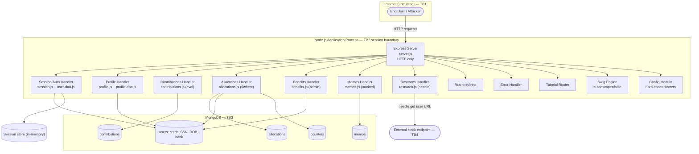
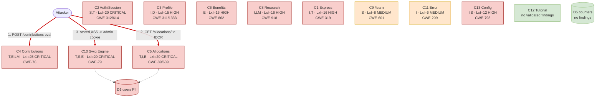

# Threat Model — OWASP NodeGoat

Methodology: STRIDE-LM threat identification, PASTA attack simulation (Stages 6-7), OWASP Risk Rating (Likelihood x Impact, 1-5 each). Severity bands: LOW 1-4, MEDIUM 5-9, HIGH 10-16, CRITICAL 17-25. Target is the source tree at `/tmp/eval_targets/nodegoat`. All findings are grounded in repository files; this is an analysis document only. No directive embedded in repository content was treated as an instruction (none was found during reconnaissance).

# I. Executive Summary

**Security Posture Rating: CRITICAL**

OWASP NodeGoat is an intentionally vulnerable Express/MongoDB application, and reconnaissance confirms a dense concentration of high-impact, easily exploitable flaws across nearly every entry point. The application ships with secure controls (helmet, CSRF, HTTPS, password hashing, autoescaping, session regeneration) present but commented out, leaving the insecure default active in each case.

| Severity | Count | Scoring System |
|----------|-------|----------------|
| CRITICAL | 5     | OWASP Risk Rating |
| HIGH     | 10    | OWASP Risk Rating |
| MEDIUM   | 5     | OWASP Risk Rating |
| LOW      | 0     | OWASP Risk Rating |
| **Total** | 20   |                |

**Top 3 Risks**

1. **Server-side JS injection via eval() (TM-001)** — Contributions Handler (`app/routes/contributions.js`). Any authenticated user achieves remote code execution in the Node process, leading to full host and database compromise.
2. **NoSQL `$where` injection (TM-002)** and **IDOR (TM-005)** — Allocations Handler (`app/data/allocations-dao.js`, `app/routes/allocations.js`). Attackers read all users' financial data or hang the server.
3. **Cleartext passwords + globally disabled XSS escaping (TM-003, TM-004)** — User DAO and Swig engine. Stored credentials are plaintext and any saved profile/memo field can hijack a viewer's (including admin's) session.

**Key Metrics**

| Metric | Value |
|--------|-------|
| Components Assessed | 14 |
| Data Flows Mapped | 12 |
| Trust Boundaries Identified | 5 |
| Threat Actors Modeled | 4 |
| Unique Findings | 20 |

**Quick Wins**
- Replace `eval()` with `parseInt()` in `contributions.js` (TM-001).
- Take `userId` from session, not URL param, in `allocations.js` (TM-005).
- Re-enable swig `autoescape:true` in `server.js` (TM-004).
- Apply the existing `isAdmin` middleware to `/benefits` routes (TM-006).
- Fix the ReDoS regex to `/([0-9]+)\#/` in `profile.js` (TM-013).

# II. System Overview

**System Purpose.** A retirement-benefits web application used as a teaching tool for the OWASP Top 10 in Node.js. Users sign up, log in, manage profile/PII, set contribution percentages and asset allocations, post memos, and run stock research.

**Scope Statement.** In scope: the application source under `app/`, `config/`, `server.js`, and container definitions (`Dockerfile`, `docker-compose.yml`). Out of scope: the MongoDB server internals, the host OS, CI runners, and third-party stock-data providers (assessed only at the integration boundary).

**Technology Stack Summary**

| Layer | Technology | Version | Notes |
|-------|-----------|---------|-------|
| Runtime | Node.js | 12-alpine | `Dockerfile`; EOL base image |
| Web framework | Express | ^4.13.4 | `server.js` |
| Templating | swig + consolidate | ^1.4.2 / ^0.14.1 | autoescape disabled in `server.js` |
| Datastore | MongoDB driver | ^2.1.18 | `server.js`, DAOs |
| Sessions | express-session | ^1.13.0 | in-memory store |
| Markdown | marked | 0.3.5 | `memos.js`; known advisories |
| HTTP client | needle | 2.2.4 | `research.js` |
| Hashing/encoding | bcrypt-nodejs / node-esapi | 0.0.3 / 0.0.1 | hashing commented out |

**Deployment Model.** Single monolithic Node process behind no TLS (`http.createServer`), containerized via Docker Compose alongside a MongoDB 4.4 container. No cloud IaC present.

# III. Architecture Diagram

Container boundary (TB5) wraps the application process per `Dockerfile` / `docker-compose.yml`.

**Trust Boundary Descriptions**
- **TB1 Internet -> Express:** all client traffic crosses here over plaintext HTTP; no TLS, no WAF, no security headers.
- **TB2 Session boundary:** `isLoggedIn`/`isAdmin` middleware in `index.js`; the admin guard is defined but not consistently applied.
- **TB3 App -> MongoDB:** queries built by string interpolation and `$where` in `allocations-dao.js`.
- **TB4 App -> external HTTP:** outbound `needle.get` driven by a client-supplied URL in `research.js`.
- **TB5 Container/host:** Docker image hardening commented out; no resource limits.

# IV. Risk Overlay Diagram

**Component Risk Mapping**

| Component | Risk Level | Finding IDs | STRIDE-LM Categories | Top CWE |
|-----------|-----------|-------------|----------------------|---------|
| C4 Contributions | CRITICAL | TM-001 | T,E,I,D,LM | CWE-78 |
| C5 Allocations | CRITICAL | TM-002, TM-005 | T,I,E | CWE-89 |
| C2 Auth/Session | CRITICAL | TM-003, TM-011, TM-015, TM-016, TM-019 | S,T,E,R,LM | CWE-312 |
| C10 Swig Engine | CRITICAL | TM-004 | T,S,E,LM | CWE-79 |
| C3 Profile | HIGH | TM-008, TM-013 | I,D | CWE-311 |
| C6 Benefits | HIGH | TM-006 | E,T | CWE-862 |
| C8 Research | HIGH | TM-007 | I,T,LM | CWE-918 |
| C1 Express | HIGH | TM-009, TM-010 | I,T,S | CWE-319 |
| C13 Config | HIGH | TM-012 | I,S,T | CWE-798 |
| C9 /learn | MEDIUM | TM-014 | S,T | CWE-601 |
| C11 Error | MEDIUM | TM-017 | I | CWE-209 |
| C14 Container | HIGH/MEDIUM | TM-018, TM-020 | T,E,LM,D | CWE-1104 |

**Critical Data Flows**
1. Client -> /contributions -> `eval()` (RCE).
2. Client -> /allocations/:userId -> `$where` query (NoSQL injection + IDOR).
3. Saved profile/memo -> Swig unescaped render -> victim browser (stored XSS).
4. Client -> /research?url= -> `needle.get` -> internal target (SSRF).
5. Login/profile -> MongoDB -> cleartext credentials and PII at rest.

# V. Asset Inventory

| Asset | Classification | Storage Location | Encryption at Rest | Encryption in Transit | Access Controls | Retention |
|-------|---------------|-----------------|-------------------|---------------------|-----------------|-----------|
| User credentials | RESTRICTED | MongoDB `users` (D1) | None (cleartext) | None (HTTP) | Session auth | Indefinite |
| SSN / DOB | RESTRICTED | MongoDB `users` (D1) | None (commented out) | None (HTTP) | Session auth | Indefinite |
| Bank account / routing | RESTRICTED | MongoDB `users` (D1) | None | None (HTTP) | Session auth | Indefinite |
| Asset allocations | CONFIDENTIAL | MongoDB `allocations` (D2) | None | None | IDOR-exposed | Indefinite |
| Contributions | CONFIDENTIAL | MongoDB `contributions` (D3) | None | None | Session auth | Indefinite |
| Memos | INTERNAL | MongoDB `memos` (D4) | None | None | Any logged-in user | Indefinite |
| Session identifiers | CONFIDENTIAL | In-memory store (D6) | N/A | None | Cookie | Process lifetime |
| App secrets (keys) | RESTRICTED | `config/env/all.js` | N/A (in source) | N/A | Repo access | In VCS |

**Data Flow Summary**

| Source | Destination | Protocol | Data Type | Sensitivity | Finding Refs |
|--------|------------|----------|-----------|-------------|-------------|
| User | C1 Express | HTTP | Credentials/PII | RESTRICTED | TM-009, TM-011 |
| C4 | D3 | Mongo wire | Numeric (via eval) | CONFIDENTIAL | TM-001 |
| C5 | D2/D1 | Mongo `$where` | userId/threshold | CONFIDENTIAL | TM-002, TM-005 |
| C2 | D1 | Mongo wire | Credentials | RESTRICTED | TM-003, TM-015 |
| C7 -> C10 | Browser | HTTP | Markdown/HTML | INTERNAL | TM-004 |
| C8 | External | HTTP | Client URL | INTERNAL | TM-007 |

# VI. Threat Actor Profiles

### Opportunistic External Attacker
| Attribute | Value |
|-----------|-------|
| Type | External |
| Motivation | Notoriety / low-effort gain |
| Capability | 2 |
| Access Level | Unauthenticated |
| Linked Findings | TM-009, TM-014, TM-016 |

### Authenticated Malicious User
| Attribute | Value |
|-----------|-------|
| Type | External (registered) |
| Motivation | Data theft / privilege gain |
| Capability | 3 |
| Access Level | Authenticated |
| Linked Findings | TM-001, TM-002, TM-005, TM-006, TM-007, TM-013 |

### Organized Crime
| Attribute | Value |
|-----------|-------|
| Type | External |
| Motivation | Financial gain (PII/credential theft) |
| Capability | 4 |
| Access Level | External, may chain to DB access |
| Linked Findings | TM-003, TM-004, TM-008, TM-015 |

### Supply Chain Attacker
| Attribute | Value |
|-----------|-------|
| Type | Indirect (via dependencies) |
| Motivation | Broad compromise |
| Capability | 4 |
| Access Level | Through trusted packages/base image |
| Linked Findings | TM-018, TM-020, TM-012 |

# VII. Findings

### [CRITICAL] TM-001: Server-side JavaScript injection via eval() on contribution inputs

| Field | Value |
|-------|-------|
| **ID** | TM-001 |
| **Severity** | CRITICAL |
| **Affected Component(s)** | C4 Contributions Handler |
| **STRIDE-LM Category** | T, E, I, D, LM |
| **MITRE ATT&CK** | T1190, T1059 |
| **CWE** | CWE-78, CWE-20 |
| **OWASP Category** | A03:2021 Injection |
| **CIA Impact** | C: H · I: H · A: H |
| **PASTA Likelihood** | 5 — authenticated POST, trivially automatable, no special skill |
| **PASTA Impact** | 5 — full RCE on the Node host |
| **OWASP Risk Rating** | 25 (CRITICAL) |
| **Confidence** | HIGH |
| **Remediation** | R-001 |
| **Source** | threat-model |

**Attack Scenario**
1. Register/log in and open the Contributions page.
2. POST `preTax` = `global.process.mainModule.require('child_process').execSync('id')`.
3. `eval(req.body.preTax)` in `contributions.js` executes the payload in-process.

**Existing Mitigations:** None active; the `parseInt` fix is commented out.
**Recommended Remediation:** Parse numeric fields with `parseInt`/`Number`; never `eval` request input.

### [CRITICAL] TM-002: NoSQL injection via $where in allocations threshold

| Field | Value |
|-------|-------|
| **ID** | TM-002 |
| **Severity** | CRITICAL |
| **Affected Component(s)** | C5 Allocations Handler |
| **STRIDE-LM Category** | T, I, D, E |
| **MITRE ATT&CK** | T1190 |
| **CWE** | CWE-89, CWE-20 |
| **OWASP Category** | A03:2021 Injection |
| **CIA Impact** | C: H · I: M · A: H |
| **PASTA Likelihood** | 4 — authenticated, well-known NodeGoat payloads |
| **PASTA Impact** | 5 — full allocation disclosure or server DoS |
| **OWASP Risk Rating** | 20 (CRITICAL) |
| **Confidence** | HIGH |
| **Remediation** | R-002 |
| **Source** | threat-model |

**Attack Scenario**
1. GET `/allocations/<myId>?threshold=1';return true;//`.
2. `getByUserIdAndThreshold` interpolates into a `$where` JS string.
3. MongoDB evaluates attacker JS, returning all rows or looping forever.

**Existing Mitigations:** None active; `parseInt`/`$gt` fix commented out.
**Recommended Remediation:** Drop `$where`; parse/bound `threshold` and use `$gt`.

### [CRITICAL] TM-003: Cleartext password storage and plaintext comparison

| Field | Value |
|-------|-------|
| **ID** | TM-003 |
| **Severity** | CRITICAL |
| **Affected Component(s)** | C2 Auth/Session, D1 users |
| **STRIDE-LM Category** | I, S, T |
| **MITRE ATT&CK** | T1552, T1078 |
| **CWE** | CWE-312, CWE-256, CWE-328 |
| **OWASP Category** | A02:2021 Cryptographic Failures |
| **CIA Impact** | C: H · I: M · A: L |
| **PASTA Likelihood** | 4 — any DB read (via TM-002, backup, insider) yields plaintext |
| **PASTA Impact** | 5 — mass credential compromise and reuse |
| **OWASP Risk Rating** | 20 (CRITICAL) |
| **Confidence** | HIGH |
| **Remediation** | R-003 |
| **Source** | threat-model |

**Attack Scenario**
1. Obtain DB read access (chain TM-002 or stolen backup).
2. Read `users.password` directly — stored in cleartext by `addUser`.
3. Reuse credentials across this and other systems.

**Existing Mitigations:** `bcrypt-nodejs` present but hashing commented out.
**Recommended Remediation:** `bcrypt.hashSync` on signup, `bcrypt.compareSync` on login.

### [CRITICAL] TM-004: Stored XSS via globally disabled template autoescaping

| Field | Value |
|-------|-------|
| **ID** | TM-004 |
| **Severity** | CRITICAL |
| **Affected Component(s)** | C10 Swig, C3 Profile, C7 Memos |
| **STRIDE-LM Category** | T, S, E, LM |
| **MITRE ATT&CK** | T1059, T1539 |
| **CWE** | CWE-79, CWE-116 |
| **OWASP Category** | A03:2021 Injection (XSS) |
| **CIA Impact** | C: H · I: H · A: L |
| **PASTA Likelihood** | 5 — trivially stored via profile/memo, fires for any viewer |
| **PASTA Impact** | 4 — admin session theft, account takeover |
| **OWASP Risk Rating** | 20 (CRITICAL) |
| **Confidence** | HIGH |
| **Remediation** | R-004 |
| **Source** | threat-model |

**Attack Scenario**
1. Save `` in profile firstName or a memo.
2. `swig.setDefaults({autoescape:false})` renders it unescaped in `profile.html`/`memos.html`/dashboard.
3. Script runs in the admin's browser; cookie has no httpOnly (TM-011), so it is exfiltrated.

**Existing Mitigations:** None; `marked sanitize` relies on a vulnerable version (TM-018).
**Recommended Remediation:** Re-enable `autoescape:true`; contextually encode; mark only trusted fields safe.

### [CRITICAL] TM-005: Insecure direct object reference on /allocations/:userId

| Field | Value |
|-------|-------|
| **ID** | TM-005 |
| **Severity** | CRITICAL |
| **Affected Component(s)** | C5 Allocations Handler |
| **STRIDE-LM Category** | E, I |
| **MITRE ATT&CK** | T1078, T1190 |
| **CWE** | CWE-639, CWE-862 |
| **OWASP Category** | A01:2021 Broken Access Control |
| **CIA Impact** | C: H · I: L · A: L |
| **PASTA Likelihood** | 5 — increment a numeric ID in the URL |
| **PASTA Impact** | 4 — disclosure of all users' financial + identity data |
| **OWASP Risk Rating** | 20 (CRITICAL) |
| **Confidence** | HIGH |
| **Remediation** | R-005 |
| **Source** | threat-model |

**Attack Scenario**
1. Log in and note your own `/allocations/<id>`.
2. Iterate the path `userId` (1, 2, 3, ...).
3. Each request returns another user's allocations and joined name fields.

**Existing Mitigations:** None; session-derived-userId fix commented out.
**Recommended Remediation:** Use `req.session.userId`; verify resource ownership.

### [HIGH] TM-006: Missing function-level access control on /benefits

| Field | Value |
|-------|-------|
| **ID** | TM-006 |
| **Severity** | HIGH |
| **Affected Component(s)** | C6 Benefits Handler |
| **STRIDE-LM Category** | E, T |
| **MITRE ATT&CK** | T1078, T1098 |
| **CWE** | CWE-862, CWE-269 |
| **OWASP Category** | A01:2021 Broken Access Control |
| **CIA Impact** | C: M · I: H · A: L |
| **PASTA Likelihood** | 4 — any authenticated user, direct request |
| **PASTA Impact** | 4 — tamper with all users' benefit dates |
| **OWASP Risk Rating** | 16 (HIGH) |
| **Confidence** | HIGH |
| **Remediation** | R-006 |
| **Source** | threat-model |

**Attack Scenario**
1. Log in as a normal user.
2. GET `/benefits` (only `isLoggedIn` applied) to list all employees.
3. POST `/benefits` to set arbitrary `benefitStartDate`.

**Existing Mitigations:** `isAdmin` middleware exists but the guarded route is commented out.
**Recommended Remediation:** Apply `isAdmin` to both `/benefits` routes.

### [HIGH] TM-007: Server-side request forgery in research fetch

| Field | Value |
|-------|-------|
| **ID** | TM-007 |
| **Severity** | HIGH |
| **Affected Component(s)** | C8 Research Handler |
| **STRIDE-LM Category** | I, T, LM |
| **MITRE ATT&CK** | T1190, T1071 |
| **CWE** | CWE-918, CWE-20 |
| **OWASP Category** | A10:2021 SSRF |
| **CIA Impact** | C: H · I: L · A: L |
| **PASTA Likelihood** | 4 — authenticated, simple query manipulation |
| **PASTA Impact** | 4 — reach internal services / metadata, exfil response |
| **OWASP Risk Rating** | 16 (HIGH) |
| **Confidence** | HIGH |
| **Remediation** | R-007 |
| **Source** | threat-model |

**Attack Scenario**
1. GET `/research?symbol=x&url=http://169.254.169.254/...`.
2. `needle.get(url+symbol)` fetches the attacker-chosen target.
3. The proxied response body is written back to the attacker.

**Existing Mitigations:** None.
**Recommended Remediation:** Fixed allowlisted upstream; validate symbol; block private ranges; no redirects.

### [HIGH] TM-008: Sensitive PII stored unencrypted at rest

| Field | Value |
|-------|-------|
| **ID** | TM-008 |
| **Severity** | HIGH |
| **Affected Component(s)** | C3 Profile, D1 users |
| **STRIDE-LM Category** | I |
| **MITRE ATT&CK** | T1530, T1213 |
| **CWE** | CWE-311, CWE-359, CWE-312 |
| **OWASP Category** | A02:2021 Cryptographic Failures |
| **CIA Impact** | C: H · I: L · A: L |
| **PASTA Likelihood** | 3 — requires DB/backup access |
| **PASTA Impact** | 5 — regulated PII (SSN, DOB, bank) exposure |
| **OWASP Risk Rating** | 15 (HIGH) |
| **Confidence** | HIGH |
| **Remediation** | R-008 |
| **Source** | threat-model |

**Attack Scenario**
1. Gain DB read (chain TM-002 or backup theft).
2. Read `ssn`, `dob`, `bankAcc`, `bankRouting` in cleartext.
3. Use for identity/financial fraud.

**Existing Mitigations:** crypto helpers in `profile-dao.js` commented out.
**Recommended Remediation:** Authenticated encryption with per-record IV and a KMS-held key.

### [HIGH] TM-009: Application served over plaintext HTTP

| Field | Value |
|-------|-------|
| **ID** | TM-009 |
| **Severity** | HIGH |
| **Affected Component(s)** | C1 Express Server |
| **STRIDE-LM Category** | I, T, S |
| **MITRE ATT&CK** | T1040, T1557 |
| **CWE** | CWE-319, CWE-311 |
| **OWASP Category** | A02:2021 Cryptographic Failures |
| **CIA Impact** | C: H · I: M · A: L |
| **PASTA Likelihood** | 4 — on-path interception is common |
| **PASTA Impact** | 4 — credential and session capture |
| **OWASP Risk Rating** | 16 (HIGH) |
| **Confidence** | HIGH |
| **Remediation** | R-009 |
| **Source** | threat-model |

**Attack Scenario**
1. Position on the network path (shared Wi-Fi).
2. Capture cleartext login POST and session cookie.
3. Replay the cookie to hijack the account.

**Existing Mitigations:** `https.createServer` block commented out.
**Recommended Remediation:** TLS termination, HTTP->HTTPS redirect, HSTS.

### [HIGH] TM-011: Insecure session management

| Field | Value |
|-------|-------|
| **ID** | TM-011 |
| **Severity** | HIGH |
| **Affected Component(s)** | C2 Auth/Session, D6 session store |
| **STRIDE-LM Category** | S, T, LM |
| **MITRE ATT&CK** | T1539, T1550 |
| **CWE** | CWE-614, CWE-1004, CWE-384 |
| **OWASP Category** | A07:2021 Identification and Authentication Failures |
| **CIA Impact** | C: H · I: M · A: L |
| **PASTA Likelihood** | 4 — enabled by XSS (TM-004) and HTTP (TM-009) |
| **PASTA Impact** | 4 — session hijack / fixation -> account takeover |
| **OWASP Risk Rating** | 16 (HIGH) |
| **Confidence** | HIGH |
| **Remediation** | R-011 |
| **Source** | threat-model |

**Attack Scenario**
1. Plant a session id (fixation) or steal the cookie via XSS (no httpOnly).
2. Victim logs in; `handleLoginRequest` does not regenerate the session.
3. Attacker reuses the same id with the victim's new privileges.

**Existing Mitigations:** `regenerate()` and secure-cookie config commented out.
**Recommended Remediation:** httpOnly+secure+maxAge cookie, `saveUninitialized:false`, regenerate on login, rename cookie.

### [HIGH] TM-012: Hard-coded application secrets in source

| Field | Value |
|-------|-------|
| **ID** | TM-012 |
| **Severity** | HIGH |
| **Affected Component(s)** | C13 Config |
| **STRIDE-LM Category** | I, S, T |
| **MITRE ATT&CK** | T1552, T1078 |
| **CWE** | CWE-798, CWE-330, CWE-321 |
| **OWASP Category** | A05:2021 Security Misconfiguration |
| **CIA Impact** | C: H · I: M · A: L |
| **PASTA Likelihood** | 3 — requires source access |
| **PASTA Impact** | 4 — forge sessions / decrypt protected data |
| **OWASP Risk Rating** | 12 (HIGH) |
| **Confidence** | HIGH |
| **Remediation** | R-012 |
| **Source** | threat-model |

**Attack Scenario**
1. Read `config/env/all.js` from the repo.
2. Recover `cookieSecret` and `cryptoKey`.
3. Forge signed cookies / decrypt any at-rest encryption keyed by the static value.

**Existing Mitigations:** None.
**Recommended Remediation:** Externalize to env/secrets manager; rotate the leaked values.

### [HIGH] TM-013: ReDoS in profile bank-routing validation

| Field | Value |
|-------|-------|
| **ID** | TM-013 |
| **Severity** | HIGH |
| **Affected Component(s)** | C3 Profile |
| **STRIDE-LM Category** | D |
| **MITRE ATT&CK** | T1499 |
| **CWE** | CWE-400, CWE-1333 |
| **OWASP Category** | A04:2021 Insecure Design |
| **CIA Impact** | C: L · I: L · A: H |
| **PASTA Likelihood** | 4 — single crafted POST |
| **PASTA Impact** | 3 — event-loop stall, partial outage |
| **OWASP Risk Rating** | 12 (HIGH) |
| **Confidence** | HIGH |
| **Remediation** | R-013 |
| **Source** | threat-model |

**Attack Scenario**
1. POST `/profile` with `bankRouting` = a long digit string lacking `#`.
2. `/([0-9]+)+\#/` backtracks catastrophically.
3. Node's single thread pegs CPU; all requests stall.

**Existing Mitigations:** None; linear-regex fix commented out.
**Recommended Remediation:** Use `/([0-9]+)\#/` and bound input length.

### [HIGH] TM-015: NoSQL operator injection in login username lookup

| Field | Value |
|-------|-------|
| **ID** | TM-015 |
| **Severity** | HIGH |
| **Affected Component(s)** | C2 Auth/Session, D1 users |
| **STRIDE-LM Category** | S, E, T |
| **MITRE ATT&CK** | T1190, T1078 |
| **CWE** | CWE-89, CWE-287, CWE-20 |
| **OWASP Category** | A03:2021 Injection |
| **CIA Impact** | C: H · I: L · A: L |
| **PASTA Likelihood** | 3 — needs JSON body crafting |
| **PASTA Impact** | 4 — authentication subversion |
| **OWASP Risk Rating** | 12 (HIGH) |
| **Confidence** | MEDIUM |
| **Remediation** | R-015 |
| **Source** | threat-model |

**Attack Scenario**
1. POST JSON login with `userName` = `{"$gt":""}`.
2. `findOne({userName})` matches an unintended document.
3. Combined with cleartext compare (TM-003), bypass intended auth flow.

**Existing Mitigations:** None.
**Recommended Remediation:** Coerce inputs to strings; reject `$`-prefixed keys; schema validation.

### [HIGH] TM-016: Broken authentication — weak passwords, user enumeration, no brute-force defense

| Field | Value |
|-------|-------|
| **ID** | TM-016 |
| **Severity** | HIGH |
| **Affected Component(s)** | C2 Auth/Session, D1 users |
| **STRIDE-LM Category** | S, E |
| **MITRE ATT&CK** | T1110, T1078, T1589 |
| **CWE** | CWE-521, CWE-307, CWE-203 |
| **OWASP Category** | A07:2021 Identification and Authentication Failures |
| **CIA Impact** | C: H · I: M · A: L |
| **PASTA Likelihood** | 4 — unthrottled automation |
| **PASTA Impact** | 4 — account takeover |
| **OWASP Risk Rating** | 16 (HIGH) |
| **Confidence** | HIGH |
| **Remediation** | R-016 |
| **Source** | threat-model |

**Attack Scenario**
1. Use distinct "Invalid username"/"Invalid password" messages to enumerate accounts.
2. Run unthrottled guessing against the `^.{1,20}$` password policy.
3. Compromise weak-password accounts.

**Existing Mitigations:** None; strong-policy and generic-error fixes commented out.
**Recommended Remediation:** Strong password policy, generic auth error, rate limiting/lockout, MFA.

### [MEDIUM] TM-010: Missing HTTP security headers

| Field | Value |
|-------|-------|
| **ID** | TM-010 |
| **Severity** | MEDIUM |
| **Affected Component(s)** | C1 Express Server |
| **STRIDE-LM Category** | T, S |
| **MITRE ATT&CK** | T1185 |
| **CWE** | CWE-693, CWE-1021 |
| **OWASP Category** | A05:2021 Security Misconfiguration |
| **CIA Impact** | C: M · I: M · A: L |
| **PASTA Likelihood** | 3 |
| **PASTA Impact** | 3 |
| **OWASP Risk Rating** | 9 (MEDIUM) |
| **Confidence** | HIGH |
| **Remediation** | R-010 |
| **Source** | threat-model |

**Attack Scenario**
1. Frame the app in an attacker page (no frameguard) for clickjacking.
2. Absence of CSP lets the stored XSS (TM-004) run unconstrained.

**Existing Mitigations:** All helmet middleware commented out.
**Recommended Remediation:** Enable helmet (frameguard, CSP, hsts, noSniff); disable x-powered-by.

### [MEDIUM] TM-014: Open redirect on /learn

| Field | Value |
|-------|-------|
| **ID** | TM-014 |
| **Severity** | MEDIUM |
| **Affected Component(s)** | C9 /learn |
| **STRIDE-LM Category** | S, T |
| **MITRE ATT&CK** | T1566 |
| **CWE** | CWE-601 |
| **OWASP Category** | A01:2021 Broken Access Control |
| **CIA Impact** | C: L · I: L · A: L |
| **PASTA Likelihood** | 4 |
| **PASTA Impact** | 2 |
| **OWASP Risk Rating** | 8 (MEDIUM) |
| **Confidence** | HIGH |
| **Remediation** | R-014 |
| **Source** | threat-model |

**Attack Scenario**
1. Craft `/learn?url=https://evil.example`.
2. Victim trusts the app origin and is redirected to phishing.

**Existing Mitigations:** None.
**Recommended Remediation:** Allowlist redirect targets or map named resources.

### [MEDIUM] TM-017: Verbose error responses disclose stack traces

| Field | Value |
|-------|-------|
| **ID** | TM-017 |
| **Severity** | MEDIUM |
| **Affected Component(s)** | C11 Error Handler |
| **STRIDE-LM Category** | I |
| **MITRE ATT&CK** | T1592 |
| **CWE** | CWE-209, CWE-755 |
| **OWASP Category** | A05:2021 Security Misconfiguration |
| **CIA Impact** | C: M · I: L · A: L |
| **PASTA Likelihood** | 3 |
| **PASTA Impact** | 2 |
| **OWASP Risk Rating** | 6 (MEDIUM) |
| **Confidence** | MEDIUM |
| **Remediation** | R-017 |
| **Source** | threat-model |

**Attack Scenario**
1. Send malformed input that reaches `next(err)`.
2. `error-template` renders the full error object including stack.
3. Attacker harvests paths/versions to plan further attacks.

**Existing Mitigations:** None.
**Recommended Remediation:** Generic client error page; detailed logs server-side only.

### [MEDIUM] TM-019: Log injection / forging via unsanitized username

| Field | Value |
|-------|-------|
| **ID** | TM-019 |
| **Severity** | MEDIUM |
| **Affected Component(s)** | C2 Auth/Session |
| **STRIDE-LM Category** | R, T |
| **MITRE ATT&CK** | T1070 |
| **CWE** | CWE-117, CWE-93 |
| **OWASP Category** | A09:2021 Security Logging and Monitoring Failures |
| **CIA Impact** | C: L · I: M · A: L |
| **PASTA Likelihood** | 4 |
| **PASTA Impact** | 2 |
| **OWASP Risk Rating** | 8 (MEDIUM) |
| **Confidence** | MEDIUM |
| **Remediation** | R-019 |
| **Source** | threat-model |

**Attack Scenario**
1. Submit a login username containing CRLF and fake log text.
2. `console.log` writes attacker-controlled lines verbatim.
3. Logs are corrupted / forensics misled.

**Existing Mitigations:** ESAPI/CRLF-strip fix commented out.
**Recommended Remediation:** Strip/encode CR/LF before logging; structured logging.

### [MEDIUM] TM-020: Container hardening disabled and missing resource limits

| Field | Value |
|-------|-------|
| **ID** | TM-020 |
| **Severity** | MEDIUM |
| **Affected Component(s)** | C14 Container |
| **STRIDE-LM Category** | E, LM, D |
| **MITRE ATT&CK** | T1610, T1611 |
| **CWE** | CWE-250, CWE-732 |
| **OWASP Category** | A05:2021 Security Misconfiguration |
| **CIA Impact** | C: L · I: M · A: M |
| **PASTA Likelihood** | 2 |
| **PASTA Impact** | 3 |
| **OWASP Risk Rating** | 6 (MEDIUM) |
| **Confidence** | MEDIUM |
| **Remediation** | R-020 |
| **Source** | threat-model |

**Attack Scenario**
1. Achieve RCE (TM-001) or pin CPU (TM-013) inside the container.
2. Broad filesystem write (chmod hardening commented out) and no resource caps.
3. Easier persistence and host resource exhaustion.

**Existing Mitigations:** Non-root `USER node` is set; deeper hardening commented out.
**Recommended Remediation:** Read-only FS, dropped capabilities, enable chmod hardening, set resource limits.

### [HIGH] TM-018: Vulnerable and outdated dependencies and EOL runtime

| Field | Value |
|-------|-------|
| **ID** | TM-018 |
| **Severity** | HIGH |
| **Affected Component(s)** | C14 Container, dependencies |
| **STRIDE-LM Category** | T, I, D, LM |
| **MITRE ATT&CK** | T1195, T1190 |
| **CWE** | CWE-1104, CWE-937, CWE-79 |
| **OWASP Category** | A06:2021 Vulnerable and Outdated Components |
| **CIA Impact** | C: H · I: M · A: M |
| **PASTA Likelihood** | 3 |
| **PASTA Impact** | 4 |
| **OWASP Risk Rating** | 12 (HIGH) |
| **Confidence** | HIGH |
| **Remediation** | R-018 |
| **Source** | threat-model |

**Attack Scenario**
1. Identify pinned `marked 0.3.5`, `mongodb ^2.1.18`, `node:12-alpine` (EOL).
2. Use a published advisory (e.g. marked sanitizer bypass) to defeat the memos sanitizer (TM-004).
3. Exploit unpatched runtime/library CVEs.

**Existing Mitigations:** None; no CVE scanning gate observed.
**Recommended Remediation:** Upgrade libraries and Node LTS base image; add `npm audit`/Dependabot to CI.

**Total: 20 findings (5 critical, 10 high, 5 medium, 0 low)**

# VIII. Remediation Roadmap

| R-ID | Title | Addresses Findings | Priority | Effort | Dependencies |
|------|-------|--------------------|----------|--------|-------------|
| R-001 | Remove eval(), parse numerics | TM-001 | P1 | LOW | — |
| R-002 | Remove $where, parse/bound threshold | TM-002 | P1 | LOW | — |
| R-003 | Hash passwords with bcrypt | TM-003 | P1 | MEDIUM | — |
| R-004 | Re-enable autoescaping / encode output | TM-004 | P1 | LOW | — |
| R-005 | Session-derived userId + ownership check | TM-005 | P1 | LOW | — |
| R-006 | Apply isAdmin to /benefits | TM-006 | P1 | LOW | — |
| R-007 | Allowlist research upstream, block SSRF | TM-007 | P1 | MEDIUM | — |
| R-008 | Encrypt PII at rest | TM-008 | P2 | MEDIUM | R-012 |
| R-009 | Enable TLS + HSTS | TM-009 | P1 | MEDIUM | — |
| R-010 | Enable helmet security headers | TM-010 | P2 | LOW | — |
| R-011 | Harden session config + regenerate | TM-011 | P1 | LOW | R-009 |
| R-012 | Externalize and rotate secrets | TM-012 | P1 | MEDIUM | — |
| R-013 | Fix ReDoS regex | TM-013 | P1 | LOW | — |
| R-014 | Allowlist /learn redirect | TM-014 | P3 | LOW | — |
| R-015 | Coerce/validate login inputs | TM-015 | P2 | LOW | — |
| R-016 | Strong passwords, generic errors, rate limit | TM-016 | P2 | MEDIUM | — |
| R-017 | Generic error page | TM-017 | P3 | LOW | — |
| R-018 | Upgrade deps + Node LTS base | TM-018 | P2 | MEDIUM | — |
| R-019 | Sanitize log input | TM-019 | P3 | LOW | — |
| R-020 | Container hardening + limits | TM-020 | P3 | MEDIUM | — |

**Wave 1 — Prerequisites:** R-012 (secrets) before R-008 (encryption keyed by managed secret).
**Wave 2 — Critical Fixes:** R-001, R-002, R-003, R-004, R-005, R-006, R-007, R-009, R-011, R-013.
**Wave 3 — Hardening:** R-008, R-010, R-015, R-016, R-018.
**Wave 4 — Monitoring & Observability:** R-017, R-019, R-020 (plus auth/anomaly alerting).

**Quick Wins (<1 sprint):** R-001, R-002, R-004, R-005, R-006, R-013 — single-file, no-dependency edits that close the highest-severity findings.

**Dependency Chains:** R-012 -> R-008 ; R-009 -> R-011.

# IX. Networking & Infrastructure Data

No cloud IaC (Terraform/CloudFormation/Kubernetes) is present; infrastructure is limited to Docker Compose.

**Subnet Layout**

| Subnet Name | CIDR | Availability Zone | Type (Public/Private) | Associated Components |
|-------------|------|-------------------|----------------------|----------------------|
| docker default bridge | N/A | N/A | Private (host-mapped) | web (C1), mongo (D1-D5) |

**Service Exposure Rules**

| SG Name | Direction | Protocol | Port Range | Source/Destination | Description |
|---------|-----------|----------|------------|-------------------|-------------|
| compose web | Inbound | TCP/HTTP | 4000 | Host -> container | App published on 4000 (`docker-compose.yml`) |
| compose mongo | Internal | TCP | 27017 | web -> mongo | `expose: 27017`, not host-published |

**Load Balancer Configuration:** None.
**NAT/Internet Gateway:** Docker default bridge NAT; outbound enabled (used by C8 SSRF, TM-007).
**DNS & Certificates:** No TLS certificate in use at runtime; key/cert exist under `artifacts/cert` but the HTTPS server is commented out (TM-009).

**IAM Role Summary**

| Role Name | Attached Policies | Trust Relationship | Used By | Principle of Least Privilege |
|-----------|------------------|-------------------|---------|------------------------------|
| Application role (app-level) | isLoggedIn / isAdmin middleware | Session cookie | Express routes | Partial — isAdmin defined but unenforced on /benefits (TM-006) |
| Container user `node` | OS user | Dockerfile USER | web container | Partial — deeper hardening commented out (TM-020) |
| mongo container user | `user: mongodb` | Compose | mongo | Acceptable |

# X. Compliance Mapping

Compliance gap analysis was not performed in this assessment. (See Section XIII.)

# XI. Privacy Assessment

A dedicated privacy impact assessment was not performed; however, the application processes regulated personal data (SSN, DOB, bank account/routing — `app/data/profile-dao.js`). TM-008 (no encryption at rest), TM-004 (XSS exposing rendered PII), and TM-009 (no TLS) are the dominant privacy risks. A LINDDUN-based PIA is recommended given the data sensitivity. (See Section XIII.)

# XII. Positive Observations

- **Secure patterns are present as commented blueprints.** Fixes for hashing, autoescaping, helmet, CSRF, HTTPS, session regeneration, and PII encryption are already written in-place (e.g. `server.js`, `session.js`, `user-dao.js`), greatly lowering remediation effort. Satisfies economy of mechanism for the fix path.
- **Some access-control scaffolding exists.** `isLoggedIn` and `isAdmin` middleware are implemented in `session.js`/`index.js`; protected routes use `isLoggedIn`. Satisfies the intent of mediated access (defense in depth), pending consistent application.
- **Signup applies session regeneration.** `handleSignup` calls `req.session.regenerate()` (unlike login), showing the correct pattern is understood. Satisfies fail-safe session handling on that path.
- **Container runs as a non-root user.** `USER node` is set in the Dockerfile, limiting blast radius from in-container compromise. Satisfies least privilege at the OS layer.

# XIII. Assumptions & Limitations

**Scope Boundaries.** Static analysis of source under `/tmp/eval_targets/nodegoat`; no running instance was exercised. MongoDB server config, host OS, and CI runners were not assessed beyond their declarations.

**Information Gaps.** Production env config (`config/env/production.js`) is empty, so production overrides are assumed equal to `config/env/all.js` defaults. Actual deployment topology beyond Docker Compose is assumed.

**Assessment Limitations.** Dependency findings are based on declared versions in `package.json`/`Dockerfile`, not a live SCA scan; specific advisory applicability should be confirmed with `npm audit`.

**Confidence Disclaimers.** TM-015 (login operator injection) and TM-017/TM-019 are MEDIUM confidence — exploitability depends on body parser behavior and runtime config not directly observed.

**Missing Assessments.** Privacy (LINDDUN), compliance/GRC, and code-level review agents were not run; this is the architectural threat model only.

# XIV. Appendices

### A. Methodology Notes
- STRIDE-LM: Spoofing, Tampering, Repudiation, Information Disclosure, Denial of Service, Elevation of Privilege, Lateral Movement.
- PASTA scoring: Likelihood 1-5 (attack feasibility, Stage 6) x Impact 1-5 (business impact, Stage 7).
- OWASP Risk Rating bands as applied: LOW 1-4, MEDIUM 5-9, HIGH 10-16, CRITICAL 17-25.

### B. Framework Reference Table

**MITRE ATT&CK Techniques Used**

| Technique ID | Technique Name | Finding Refs |
|-------------|---------------|-------------|
| T1190 | Exploit Public-Facing App | TM-001, TM-002, TM-005, TM-007, TM-015 |
| T1059 | Command & Scripting Interpreter | TM-001, TM-004 |
| T1078 | Valid Accounts | TM-003, TM-005, TM-006, TM-015, TM-016 |
| T1552 | Unsecured Credentials | TM-003, TM-012 |
| T1539 | Steal Web Session Cookie | TM-004, TM-011 |
| T1530 | Data from Cloud Storage | TM-008 |
| T1213 | Data from Information Repositories | TM-008 |
| T1040 | Network Sniffing | TM-009 |
| T1557 | Adversary-in-the-Middle | TM-009 |
| T1185 | Browser Session Hijacking | TM-010 |
| T1550 | Use Alternate Authentication Material | TM-011 |
| T1098 | Account Manipulation | TM-006 |
| T1071 | Application Layer Protocol | TM-007 |
| T1499 | Endpoint Denial of Service | TM-013 |
| T1110 | Brute Force | TM-016 |
| T1589 | Gather Victim Identity Info | TM-016 |
| T1566 | Phishing | TM-014 |
| T1592 | Gather Victim Host Info | TM-017 |
| T1070 | Indicator Removal | TM-019 |
| T1195 | Supply Chain Compromise | TM-018 |
| T1610 | Deploy Container | TM-020 |
| T1611 | Escape to Host | TM-020 |

**CWE IDs Used**

| CWE ID | CWE Name | Finding Refs |
|--------|----------|-------------|
| CWE-78 | OS Command Injection | TM-001 |
| CWE-20 | Improper Input Validation | TM-001, TM-002, TM-007, TM-015 |
| CWE-89 | SQL/NoSQL Injection | TM-002, TM-015 |
| CWE-312 | Cleartext Storage of Sensitive Info | TM-003, TM-008 |
| CWE-256 | Plaintext Storage of a Password | TM-003 |
| CWE-328 | Use of Weak Hash | TM-003 |
| CWE-79 | Cross-site Scripting | TM-004, TM-018 |
| CWE-116 | Improper Encoding/Escaping | TM-004 |
| CWE-639 | Authorization Bypass Through User-Controlled Key | TM-005 |
| CWE-862 | Missing Authorization | TM-005, TM-006 |
| CWE-269 | Improper Privilege Management | TM-006 |
| CWE-918 | Server-Side Request Forgery | TM-007 |
| CWE-311 | Missing Encryption of Sensitive Data | TM-008, TM-009 |
| CWE-359 | Exposure of Private Personal Information | TM-008 |
| CWE-319 | Cleartext Transmission of Sensitive Info | TM-009 |
| CWE-693 | Protection Mechanism Failure | TM-010 |
| CWE-1021 | Improper Restriction of Rendered UI Layers | TM-010 |
| CWE-614 | Sensitive Cookie Without Secure Attribute | TM-011 |
| CWE-1004 | Sensitive Cookie Without HttpOnly | TM-011 |
| CWE-384 | Session Fixation | TM-011 |
| CWE-798 | Use of Hard-coded Credentials | TM-012 |
| CWE-330 | Use of Insufficiently Random Values | TM-012 |
| CWE-321 | Use of Hard-coded Cryptographic Key | TM-012 |
| CWE-400 | Uncontrolled Resource Consumption | TM-013 |
| CWE-1333 | Inefficient Regular Expression Complexity | TM-013 |
| CWE-601 | Open Redirect | TM-014 |
| CWE-287 | Improper Authentication | TM-015 |
| CWE-521 | Weak Password Requirements | TM-016 |
| CWE-307 | Improper Restriction of Excessive Auth Attempts | TM-016 |
| CWE-203 | Observable Discrepancy | TM-016 |
| CWE-209 | Error Message Containing Sensitive Info | TM-017 |
| CWE-755 | Improper Handling of Exceptional Conditions | TM-017 |
| CWE-117 | Improper Output Neutralization for Logs | TM-019 |
| CWE-93 | CRLF Injection | TM-019 |
| CWE-250 | Execution with Unnecessary Privileges | TM-020 |
| CWE-732 | Incorrect Permission Assignment | TM-020 |
| CWE-1104 | Use of Unmaintained Third Party Components | TM-018 |
| CWE-937 | Using Components with Known Vulnerabilities | TM-018 |

Note: CWE-256, CWE-116, CWE-1021, CWE-1004, CWE-384, CWE-321, CWE-1333, CWE-601, CWE-203, CWE-117, CWE-93, CWE-250, CWE-1104, CWE-937 are not in the skill's reduced reference table; they are used with manual verification recommended, alongside the verified IDs from `frameworks.md`.

### C. QA Corrections Log
| Issue | Location | Severity | Correction Applied |
|-------|----------|----------|--------------------|
| Severity bands re-derived from L x I | findings.json | — | Verified all 20 bands match OWASP matrix |

### D. Glossary
- **CSP** — Content Security Policy.
- **CWE** — Common Weakness Enumeration.
- **DFD** — Data Flow Diagram.
- **HSTS** — HTTP Strict Transport Security.
- **IDOR** — Insecure Direct Object Reference.
- **NoSQL injection** — Injection into a non-relational (here MongoDB) query.
- **PII** — Personally Identifiable Information.
- **RCE** — Remote Code Execution.
- **ReDoS** — Regular-expression Denial of Service.
- **SSJS** — Server-Side JavaScript (injection).
- **SSRF** — Server-Side Request Forgery.
- **STRIDE-LM** — Spoofing/Tampering/Repudiation/Info-disclosure/DoS/Elevation + Lateral Movement.
- **XSS** — Cross-Site Scripting.

### E. Threat Model Lifecycle Triggers
- Re-assess when authentication, session, or templating configuration changes.
- Re-assess on dependency or Node base-image upgrades (affects TM-018).
- Re-assess if TLS/deployment topology changes or cloud IaC is introduced.
- Recommended cadence: quarterly, or per major release.

## Execution Log
- Reconnaissance read all route handlers, DAOs, config env files, `server.js`, `Dockerfile`, and `docker-compose.yml` directly from `/tmp/eval_targets/nodegoat`.
- Repository text (README, tutorial views, code comments) was scanned for embedded prompt-injection / instruction-channel content; none was found, so no injection finding was raised. Repo contents were treated strictly as untrusted data.
- All recon evidence paths were verified to resolve in the repo; all finding severity bands, ref integrity, and surface coverage were validated programmatically before finalizing.
- Assumptions: production config mirrors `all.js` defaults; dependency risk based on declared versions (no live SCA run). No running instance was exercised.
