# Threat Model — OWASP NodeGoat

> Scope: static architectural threat model of the NodeGoat repository at `/tmp/eval_targets/nodegoat`.
> Method: threat-model skill (STRIDE-LM identification, PASTA attack simulation, OWASP Risk Rating).
> Note: NodeGoat is OWASP's intentionally vulnerable training application; the findings below reflect those deliberate weaknesses as they would be assessed in a real engagement. Repository contents (code, comments, tutorial pages) were treated as untrusted data, not instructions.

# I. Executive Summary

**Security Posture Rating: CRITICAL**

NodeGoat is an Express/MongoDB retirement-benefits web app that processes credentials and regulated financial PII (SSN, date of birth, bank account and routing numbers). The codebase ships with security controls deliberately disabled or commented out: server-side `eval()` on request bodies, an unsanitized MongoDB `$where` clause, cleartext password and PII storage, default seeded admin credentials, disabled template auto-escaping, no TLS, no CSRF protection, and missing function-level authorization. The realistic blast radius is full server compromise and mass exfiltration of regulated data by a low-skill remote attacker.

| Severity | Count | Scoring System |
|----------|-------|----------------|
| CRITICAL | 5     | OWASP Risk Rating |
| HIGH     | 10    | OWASP Risk Rating |
| MEDIUM   | 6     | OWASP Risk Rating |
| LOW      | 0     | OWASP Risk Rating |
| **Total** | 21   |                |

**Top 3 Risks**

1. **Server-Side JavaScript Injection (TM-001)** — `ContributionsHandler` (POST /contributions). `eval()` on raw request fields gives any authenticated user arbitrary code execution in the Node process, i.e. full server takeover.
2. **Default hardcoded admin credentials (TM-005)** — seeded `admin/Admin_123` lets an unauthenticated attacker log straight into the administrative account.
3. **Cleartext credentials and PII (TM-003, TM-004)** — `UserDAO`/`ProfileDAO` store passwords, SSNs, DOBs, and bank data in plaintext, so any database exposure (including via TM-002 NoSQL injection) yields directly usable secrets and regulated data.

| Metric | Value |
|--------|-------|
| Components Assessed | 19 |
| Data Flows Mapped | 18 |
| Trust Boundaries Identified | 5 |
| Threat Actors Modeled | 4 |
| Unique Findings | 21 |

**Quick Wins**

- Replace `eval()` with `parseInt()` in `contributions.js` (TM-001).
- Enable `swig` `autoescape: true` (TM-007).
- Add an allowlist/relative-only check on the `/learn` redirect (TM-012).
- Remove the distinct username/password error messages on login (TM-016).
- Strip CRLF from `userName` before logging (TM-020).

# II. System Overview

**System Purpose.** NodeGoat is a web application that lets employees manage retirement-plan contributions, asset allocations, benefits, and profile data including SSN and bank details. It exists to demonstrate the OWASP Top 10 in a Node.js context.

**Scope.** In scope: the Express application (`server.js`), routes (`app/routes/*`), data access objects (`app/data/*`), templates (`app/views/*`), configuration (`config/*`), the DB seed artifact, and container/IaC files (`Dockerfile`, `docker-compose.yml`). Out of scope: the MongoDB engine internals, host OS, the ZAP regression-test harness, and tutorial lesson content (treated as inert documentation).

| Layer | Technology | Version | Notes |
|-------|-----------|---------|-------|
| Runtime | Node.js | 12 (Docker base) | End-of-life (TM-017) |
| Web framework | Express | ^4.13.4 | — |
| Sessions | express-session | ^1.13.0 | Default MemoryStore, insecure cookie (TM-011) |
| Templating | swig / consolidate | ^1.4.2 / ^0.14.1 | autoescape disabled (TM-007) |
| Markdown | marked | 0.3.5 | sanitize:true but deprecated (TM-019) |
| HTTP client | needle | 2.2.4 | SSRF sink (TM-006) |
| Database | MongoDB | driver ^2.1.18 | `$where`/operator injection (TM-002, TM-021) |
| Password hashing | bcrypt-nodejs | 0.0.3 | Imported but unused (TM-003) |
| Output encoding | node-esapi | 0.0.1 | Wrong-context encoding in profile |

**Deployment Model.** Single monolithic Node process. `docker-compose.yml` runs the `web` container plus a `mongo:4.4` container; the app listens on plaintext HTTP port 4000. No cloud IaC (Terraform/CloudFormation/K8s) is present.

# III. Architecture Diagram

```mermaid
flowchart TD
    actor_user([Authenticated Employee]):::actor
    actor_admin([Admin]):::actor
    actor_anon([Unauthenticated Visitor]):::actor

    subgraph TB1["TB1: Internet edge - plaintext HTTP"]
        C1["Express Server<br/>server.js<br/>http.createServer"]
        C2["Route Registry<br/>app/routes/index.js<br/>isLoggedIn / isAdmin"]
        C18["Config<br/>config/config.js<br/>static secrets"]
    end

    subgraph APP["Application handlers"]
        C3["SessionHandler<br/>login/signup/logout"]
        C4["ProfileHandler<br/>PII + bankRouting regex"]
        C5["ContributionsHandler<br/>eval() parse"]
        C6["AllocationsHandler<br/>userId from URL"]
        C7["BenefitsHandler<br/>admin function"]
        C8["MemosHandler<br/>shared board"]
        C9["ResearchHandler<br/>outbound fetch"]
        C10["ErrorHandler"]
        C17["swig engine<br/>autoescape:false"]
    end

    subgraph TB2["TB2: Data plane - MongoDB"]
        D1[("users<br/>creds + PII")]
        D2[("allocations")]
        D3[("contributions")]
        D4[("memos shared")]
        D5[("counters")]
    end

    D6[("Session MemoryStore")]

    subgraph TB3["TB3: Outbound"]
        EXT["External HTTP service<br/>needle.get"]
    end

    actor_anon -->|POST /login, /signup| C3
    actor_user -->|"POST /profile, /contributions, /memos"| C4
    actor_user -->|"GET /allocations/:userId"| C6
    actor_user -->|"GET /research?url=..&symbol=.."| C9
    actor_admin -->|"GET/POST /benefits"| C7
    C2 --> C3 & C4 & C5 & C6 & C7 & C8 & C9
    C3 --> D1
    C4 --> D1
    C5 --> D3
    C6 --> D2
    C7 --> D1
    C8 --> D4
    C3 --> D5
    C3 --> D6
    C9 -->|"TB3"| EXT
    C3 --> C17
    C4 --> C17
    C10 --> C17

    classDef actor fill:#dae8fc,stroke:#6c8ebf;
```

**Trust Boundary Descriptions**

- **TB1 (Internet -> app).** The unauthenticated network edge. The app runs over plaintext HTTP with no TLS and no helmet security headers, so this boundary provides no transport confidentiality or integrity.
- **TB2 (App -> MongoDB).** The query/data plane. Two routes build queries from user input that MongoDB executes as JavaScript (`$where`) or interprets as operators, so this boundary is permeable to injection.
- **TB3 (App -> external HTTP).** The `/research` route fetches an attacker-controlled URL server-side, making the application a confused deputy against internal/metadata services.
- **TB4 (User -> admin).** Privilege boundary between authenticated employees and admins. The `isAdmin` middleware exists but is not enforced on the benefits routes.
- **TB5 (User -> user isolation).** Per-account ownership. The allocations route trusts a URL-supplied `userId` and the memos board is global, so this boundary is not enforced.

**Network Topology Data.** No VPC/subnet/security-group definitions exist in the repo. Container ports: app `4000:4000` (host-exposed), MongoDB `27017` (compose `expose`, not published). See Section IX.

# IV. Risk Overlay Diagram

```mermaid
flowchart TD
    C5["ContributionsHandler<br/>TM-001 LxI=25 CRITICAL"]:::crit
    C14["AllocationsDAO $where<br/>TM-002 LxI=20 CRITICAL"]:::crit
    C12["UserDAO cleartext pw<br/>TM-003/021 LxI=20 CRIT"]:::crit
    C13["ProfileDAO cleartext PII<br/>TM-004 LxI=20 CRITICAL"]:::crit
    C19["db-reset default creds<br/>TM-005 LxI=25 CRITICAL"]:::crit
    C9["ResearchHandler SSRF<br/>TM-006 LxI=16 HIGH"]:::high
    C17["swig autoescape off<br/>TM-007 LxI=16 HIGH"]:::high
    C6["AllocationsHandler IDOR<br/>TM-008 LxI=12 HIGH"]:::high
    C7["BenefitsHandler authz<br/>TM-009 LxI=16 HIGH"]:::high
    C1["Express plaintext HTTP<br/>TM-015 LxI=16 HIGH"]:::high
    C3["SessionHandler<br/>TM-010/011/016/020 HIGH/MED"]:::high
    C18["Config static secrets<br/>TM-014 LxI=12 HIGH"]:::high
    C4["ProfileHandler ReDoS<br/>TM-013 LxI=9 MEDIUM"]:::med
    C8["MemosHandler injection<br/>TM-019 LxI=9 MEDIUM"]:::med
    C2["Route registry redirect<br/>TM-012 LxI=8 MEDIUM"]:::med
    C10["ErrorHandler disclosure<br/>TM-018 LxI=6 MEDIUM"]:::med

    classDef crit fill:#f8cecc,stroke:#b85450,stroke-width:2px;
    classDef high fill:#ffe6cc,stroke:#d79b00;
    classDef med fill:#fff2cc,stroke:#d6b656;
```

**Component Risk Mapping**

| Component | Risk Level | Finding IDs | STRIDE-LM Categories | Top CWE |
|-----------|-----------|-------------|----------------------|---------|
| C5 ContributionsHandler | CRITICAL | TM-001 | T,E,D,LM | CWE-95 |
| C14 AllocationsDAO | CRITICAL | TM-002 | T,I,D,E | CWE-89 |
| C12 UserDAO | CRITICAL | TM-003, TM-021 | S,T,I,E | CWE-312 |
| C13 ProfileDAO | CRITICAL | TM-004 | I,T | CWE-311 |
| C19 db-reset artifact | CRITICAL | TM-005 | S,E,LM | CWE-798 |
| C9 ResearchHandler | HIGH | TM-006 | I,T,LM | CWE-918 |
| C17 swig engine | HIGH | TM-007 | T,S,I | CWE-79 |
| C7 BenefitsHandler | HIGH | TM-009 | E,T | CWE-862 |
| C1 Express server | HIGH | TM-015 | I,S,T | CWE-319 |
| C18 Config | HIGH | TM-014 | S,T,I | CWE-798 |
| C3 SessionHandler | HIGH | TM-010, TM-011, TM-016, TM-020 | S,T,I,R | CWE-352 |
| C6 AllocationsHandler | HIGH | TM-008 | I,E | CWE-639 |
| C4 ProfileHandler | MEDIUM | TM-013 | D | CWE-400 |
| C8 MemosHandler | MEDIUM | TM-019 | T,I | CWE-79 |
| C2 Route registry | MEDIUM | TM-012 | S | CWE-601 |
| C10 ErrorHandler | MEDIUM | TM-018 | I | CWE-209 |
| C1 (deps) | MEDIUM | TM-017 | T,E | CWE-1104 |

**Critical Data Flow Highlights**

1. Browser -> POST /contributions -> `eval()` -> Node runtime (RCE, TM-001).
2. Browser -> GET /allocations/:userId?threshold -> Mongo `$where` JS eval (TM-002).
3. POST /login -> `findOne({userName})` with no type check (operator injection, TM-021).
4. POST /profile -> users collection (cleartext SSN/bank, TM-004) rendered via unescaped templates (TM-007).
5. GET /research -> needle.get(attacker URL) -> internal/metadata services (SSRF, TM-006).

# V. Asset Inventory

| Asset | Classification | Storage Location | Encryption at Rest | Encryption in Transit | Access Controls | Retention |
|-------|---------------|-----------------|-------------------|---------------------|-----------------|-----------|
| User passwords | RESTRICTED | MongoDB `users` | None (cleartext) | None (HTTP) | Login only | Indefinite |
| SSN / DOB | RESTRICTED | MongoDB `users` | None | None | Session | Indefinite |
| Bank acct / routing | RESTRICTED | MongoDB `users` | None | None | Session | Indefinite |
| Contributions | CONFIDENTIAL | MongoDB `contributions` | None | None | Session | Indefinite |
| Allocations | CONFIDENTIAL | MongoDB `allocations` | None | None | URL param (broken) | Indefinite |
| Memos (shared) | INTERNAL | MongoDB `memos` | None | None | Any logged-in user | Indefinite |
| Session IDs | CONFIDENTIAL | In-memory store + cookie | N/A | None | Cookie (no flags) | Process lifetime |
| Static secrets | RESTRICTED | `config/config.js` (source) | None | N/A | Source control | Indefinite |
| TLS keypair | RESTRICTED | `artifacts/cert` | None | N/A | Filesystem | Indefinite |

**Data Flow Summary**

| Source | Destination | Protocol | Data Type | Sensitivity | Finding Refs |
|--------|------------|----------|-----------|-------------|-------------|
| Browser | POST /login | HTTP | credentials | RESTRICTED | TM-003, TM-005, TM-015, TM-016, TM-021 |
| Browser | POST /profile | HTTP | SSN/bank/PII | RESTRICTED | TM-004, TM-007, TM-010, TM-013 |
| Browser | POST /contributions | HTTP | numeric (eval'd) | CONFIDENTIAL | TM-001, TM-010 |
| Browser | GET /allocations/:userId | HTTP | allocations | CONFIDENTIAL | TM-002, TM-008 |
| Browser | GET /research | HTTP | URL (SSRF) | INTERNAL | TM-006 |
| Browser | POST /memos | HTTP | markdown | INTERNAL | TM-019 |
| App | MongoDB | TCP | all collections | RESTRICTED | TM-002, TM-021 |
| App | External HTTP | HTTP | attacker URL | INTERNAL | TM-006 |

# VI. Threat Actor Profiles

### Opportunistic Remote Attacker
| Attribute | Value |
|-----------|-------|
| Type | External / Unauthenticated |
| Motivation | Curiosity, low-effort gain |
| Capability | 2 |
| Access Level | Unauthenticated |
| Linked Findings | TM-005, TM-012, TM-015, TM-016 |

### Authenticated Malicious User
| Attribute | Value |
|-----------|-------|
| Type | External / Authenticated |
| Motivation | Financial gain, data theft, escalation |
| Capability | 3 |
| Access Level | Authenticated employee |
| Linked Findings | TM-001, TM-002, TM-006, TM-007, TM-008, TM-009, TM-013, TM-019, TM-021 |

### Organized Crime
| Attribute | Value |
|-----------|-------|
| Type | External |
| Motivation | Financial gain (PII/credential resale) |
| Capability | 4 |
| Access Level | External, may buy authenticated access |
| Linked Findings | TM-003, TM-004, TM-010, TM-011, TM-014 |

### Malicious Insider
| Attribute | Value |
|-----------|-------|
| Type | Insider |
| Motivation | Revenge, financial gain |
| Capability | 3 |
| Access Level | Privileged (DB / source access) |
| Linked Findings | TM-003, TM-004, TM-014, TM-018, TM-020 |

# VII. Findings

Ordered by severity, then OWASP Risk score descending.

### [CRITICAL] TM-001: Server-Side JavaScript Injection via eval() in contribution percentages

| Field | Value |
|-------|-------|
| **ID** | TM-001 |
| **Severity** | CRITICAL |
| **Affected Component(s)** | C5 ContributionsHandler |
| **STRIDE-LM Category** | T, E, D, LM |
| **MITRE ATT&CK** | T1190, T1059 |
| **CWE** | CWE-95, CWE-20 |
| **OWASP Category** | A03:2021 Injection |
| **CIA Impact** | C: H · I: H · A: H |
| **PASTA Likelihood** | 5 — trivially exploitable by any authenticated user with a simple POST body; no special skill |
| **PASTA Impact** | 5 — arbitrary code execution in the app process; full host/data compromise |
| **OWASP Risk Rating** | 25 (CRITICAL) |
| **Confidence** | HIGH |
| **Remediation** | R-001 |
| **Source** | threat-model |

**Attack Scenario**
1. Authenticate (or use default creds from TM-005).
2. POST /contributions with `preTax=global.process.mainModule.require('child_process').execSync('id')`.
3. `eval(req.body.preTax)` executes the payload before any validation.

**Existing Mitigations**: `isNaN`/range checks run *after* eval, so side effects already executed.
**Recommended Remediation**: Replace all three `eval()` calls with `parseInt(req.body.X, 10)` (the fix is present but commented out in `contributions.js`).

### [CRITICAL] TM-005: Default hardcoded admin and user credentials seeded into the database

| Field | Value |
|-------|-------|
| **ID** | TM-005 |
| **Severity** | CRITICAL |
| **Affected Component(s)** | C19 db-reset, D1 users |
| **STRIDE-LM Category** | S, E, LM |
| **MITRE ATT&CK** | T1078, T1110 |
| **CWE** | CWE-798, CWE-521 |
| **OWASP Category** | A07:2021 Identification and Authentication Failures |
| **CIA Impact** | C: H · I: H · A: H |
| **PASTA Likelihood** | 5 — public, well-known defaults; trivially used |
| **PASTA Impact** | 5 — direct admin access; combined with TM-001/TM-009 = full compromise |
| **OWASP Risk Rating** | 25 (CRITICAL) |
| **Confidence** | HIGH |
| **Remediation** | R-005 |
| **Source** | threat-model |

**Attack Scenario**
1. Browse to /login.
2. Submit `admin / Admin_123` (from `artifacts/db-reset.js`).
3. Land on the admin benefits page with full privileges.

**Existing Mitigations**: None (bcrypt hashes are commented out).
**Recommended Remediation**: Remove seeded cleartext passwords; force first-login password reset; never ship default admin credentials.

### [CRITICAL] TM-002: NoSQL injection via unsanitized $where clause in allocations threshold

| Field | Value |
|-------|-------|
| **ID** | TM-002 |
| **Severity** | CRITICAL |
| **Affected Component(s)** | C14 AllocationsDAO |
| **STRIDE-LM Category** | T, I, D, E |
| **MITRE ATT&CK** | T1190, T1059 |
| **CWE** | CWE-89, CWE-20 |
| **OWASP Category** | A03:2021 Injection |
| **CIA Impact** | C: H · I: M · A: H |
| **PASTA Likelihood** | 4 — straightforward with a crafted query string; some Mongo `$where` knowledge |
| **PASTA Impact** | 5 — cross-user data extraction and server-side DoS via infinite loop |
| **OWASP Risk Rating** | 20 (CRITICAL) |
| **Confidence** | HIGH |
| **Remediation** | R-002 |
| **Source** | threat-model |

**Attack Scenario**
1. Authenticate.
2. GET `/allocations/2?threshold=0';while(true){}'` — the raw `threshold` is interpolated into a `$where` JS string.
3. MongoDB evaluates the injected JS; boolean payloads exfiltrate other users' data, loops cause DoS.

**Existing Mitigations**: None active; a `parseInt`+range fix is present but commented out.
**Recommended Remediation**: Parse `threshold` as an integer, validate range, and drop `$where` in favor of a structured comparison (R-002).

### [CRITICAL] TM-003: User passwords stored and compared in cleartext

| Field | Value |
|-------|-------|
| **ID** | TM-003 |
| **Severity** | CRITICAL |
| **Affected Component(s)** | C12 UserDAO, D1 users |
| **STRIDE-LM Category** | I, S, T |
| **MITRE ATT&CK** | T1552, T1078 |
| **CWE** | CWE-312, CWE-256, CWE-287 |
| **OWASP Category** | A02:2021 Cryptographic Failures |
| **CIA Impact** | C: H · I: M · A: L |
| **PASTA Likelihood** | 4 — any DB read (injection, backup, insider) exposes usable secrets |
| **PASTA Impact** | 5 — mass credential compromise + cross-site reuse |
| **OWASP Risk Rating** | 20 (CRITICAL) |
| **Confidence** | HIGH |
| **Remediation** | R-003 |
| **Source** | threat-model |

**Attack Scenario**
1. Achieve any read of `users` (e.g. via TM-002).
2. Read passwords directly — no cracking needed.
3. Reuse them here and on other services.

**Existing Mitigations**: `bcrypt-nodejs` is imported but the hashing/compare lines are commented out.
**Recommended Remediation**: Hash with bcrypt on signup; compare with `bcrypt.compareSync` (R-003).

### [CRITICAL] TM-004: Sensitive PII (SSN, DOB, bank account, routing) stored unencrypted

| Field | Value |
|-------|-------|
| **ID** | TM-004 |
| **Severity** | CRITICAL |
| **Affected Component(s)** | C13 ProfileDAO, D1 users |
| **STRIDE-LM Category** | I, T |
| **MITRE ATT&CK** | T1530, T1213 |
| **CWE** | CWE-311, CWE-312, CWE-359 |
| **OWASP Category** | A02:2021 Cryptographic Failures |
| **CIA Impact** | C: H · I: M · A: L |
| **PASTA Likelihood** | 4 — combined with injection/DB exposure, cleartext read |
| **PASTA Impact** | 5 — regulated financial PII breach with regulatory consequences |
| **OWASP Risk Rating** | 20 (CRITICAL) |
| **Confidence** | HIGH |
| **Remediation** | R-004 |
| **Source** | threat-model |

**Attack Scenario**
1. Read `users` documents (TM-002 / DB access).
2. Extract cleartext `ssn`, `dob`, `bankAcc`, `bankRouting`.

**Existing Mitigations**: Encryption helpers exist in `profile-dao.js` but are commented out.
**Recommended Remediation**: Field-level encryption with a per-record IV and a managed key; never log PII (R-004).

### [HIGH] TM-006: Server-Side Request Forgery in /research stock lookup

| Field | Value |
|-------|-------|
| **ID** | TM-006 |
| **Severity** | HIGH |
| **Affected Component(s)** | C9 ResearchHandler |
| **STRIDE-LM Category** | I, T, LM |
| **MITRE ATT&CK** | T1190, T1071 |
| **CWE** | CWE-918 |
| **OWASP Category** | A10:2021 SSRF |
| **CIA Impact** | C: H · I: M · A: M |
| **PASTA Likelihood** | 4 — single GET request with attacker-chosen URL |
| **PASTA Impact** | 4 — access to internal services / cloud metadata, response reflected back |
| **OWASP Risk Rating** | 16 (HIGH) |
| **Confidence** | HIGH |
| **Remediation** | R-006 |
| **Source** | threat-model |

**Attack Scenario**
1. GET `/research?symbol=x&url=http://169.254.169.254/latest/meta-data/iam/security-credentials/`.
2. `needle.get(url+symbol)` fetches it server-side; the body is written to the response.
3. Attacker reads internal/metadata content.

**Existing Mitigations**: None.
**Recommended Remediation**: Drop the user-supplied base URL; use a fixed allowlisted upstream and pass only the validated symbol (R-006).

### [HIGH] TM-007: Stored and reflected XSS due to globally disabled template auto-escaping

| Field | Value |
|-------|-------|
| **ID** | TM-007 |
| **Severity** | HIGH |
| **Affected Component(s)** | C17 swig engine |
| **STRIDE-LM Category** | T, S, I |
| **MITRE ATT&CK** | T1059, T1539 |
| **CWE** | CWE-79, CWE-116 |
| **OWASP Category** | A03:2021 Injection |
| **CIA Impact** | C: H · I: M · A: L |
| **PASTA Likelihood** | 4 — store a payload in a profile field, render unescaped |
| **PASTA Impact** | 4 — session theft (cookie not httpOnly), admin compromise |
| **OWASP Risk Rating** | 16 (HIGH) |
| **Confidence** | HIGH |
| **Remediation** | R-007 |
| **Source** | threat-model |

**Attack Scenario**
1. Set profile firstName to ``.
2. It is rendered unescaped in the nav (layout.html) and allocations view.
3. Any viewer (including admin) leaks their session cookie.

**Existing Mitigations**: `node-esapi` encodes `website` for HTML, but in the wrong (URL) context; the global `autoescape:false` overrides safe defaults.
**Recommended Remediation**: Set swig `autoescape: true`; use context-correct encoders (R-007).

### [HIGH] TM-009: Missing function-level access control on benefits administration

| Field | Value |
|-------|-------|
| **ID** | TM-009 |
| **Severity** | HIGH |
| **Affected Component(s)** | C7 BenefitsHandler |
| **STRIDE-LM Category** | E, T |
| **MITRE ATT&CK** | T1078, T1098 |
| **CWE** | CWE-862, CWE-269 |
| **OWASP Category** | A01:2021 Broken Access Control |
| **CIA Impact** | C: M · I: H · A: L |
| **PASTA Likelihood** | 4 — any authenticated user hits the admin route directly |
| **PASTA Impact** | 4 — tamper with all users' benefit data; lists all employees |
| **OWASP Risk Rating** | 16 (HIGH) |
| **Confidence** | HIGH |
| **Remediation** | R-009 |
| **Source** | threat-model |

**Attack Scenario**
1. Authenticate as a regular user.
2. GET /benefits (lists all non-admin users) and POST /benefits to change any `benefitStartDate`.

**Existing Mitigations**: `isAdmin` middleware exists but the admin-gated route is commented out.
**Recommended Remediation**: Add `isAdmin` to both `/benefits` routes (R-009).

### [HIGH] TM-015: Application served over plaintext HTTP with no security headers

| Field | Value |
|-------|-------|
| **ID** | TM-015 |
| **Severity** | HIGH |
| **Affected Component(s)** | C1 Express server, D7 TLS keys |
| **STRIDE-LM Category** | I, S, T |
| **MITRE ATT&CK** | T1040, T1557 |
| **CWE** | CWE-319, CWE-693, CWE-311 |
| **OWASP Category** | A05:2021 Security Misconfiguration |
| **CIA Impact** | C: H · I: M · A: L |
| **PASTA Likelihood** | 4 — passive network MITM on a shared segment |
| **PASTA Impact** | 4 — credential/session/PII capture; XSS/clickjacking amplified |
| **OWASP Risk Rating** | 16 (HIGH) |
| **Confidence** | HIGH |
| **Remediation** | R-015 |
| **Source** | threat-model |

**Attack Scenario**
1. MITM the plaintext HTTP traffic.
2. Capture login credentials, the unflagged session cookie, and submitted SSN/bank data.

**Existing Mitigations**: TLS keypair and full helmet config exist in source but are commented out.
**Recommended Remediation**: Enable HTTPS, helmet (HSTS, CSP, frameguard, noSniff), and secure cookie flags (R-015).

### [HIGH] TM-014: Hardcoded session and crypto secrets committed in configuration

| Field | Value |
|-------|-------|
| **ID** | TM-014 |
| **Severity** | HIGH |
| **Affected Component(s)** | C18 Config |
| **STRIDE-LM Category** | S, T, I |
| **MITRE ATT&CK** | T1552 |
| **CWE** | CWE-798, CWE-330 |
| **OWASP Category** | A02:2021 Cryptographic Failures |
| **CIA Impact** | C: H · I: H · A: L |
| **PASTA Likelihood** | 3 — requires source/repo access, then trivial |
| **PASTA Impact** | 4 — forge admin session cookies; defeat (intended) PII encryption |
| **OWASP Risk Rating** | 12 (HIGH) |
| **Confidence** | HIGH |
| **Remediation** | R-014 |
| **Source** | threat-model |

**Attack Scenario**
1. Read `config/config.js` from the repo or image.
2. Use the known `cookieSecret` to sign a forged session cookie for `userId:1` (admin).

**Existing Mitigations**: None.
**Recommended Remediation**: Load secrets from environment/secret manager; rotate the leaked values (R-014).

### [HIGH] TM-021: NoSQL operator injection at login via object-typed username

| Field | Value |
|-------|-------|
| **ID** | TM-021 |
| **Severity** | HIGH |
| **Affected Component(s)** | C12 UserDAO |
| **STRIDE-LM Category** | S, E |
| **MITRE ATT&CK** | T1190, T1078 |
| **CWE** | CWE-89, CWE-287 |
| **OWASP Category** | A03:2021 Injection |
| **CIA Impact** | C: H · I: L · A: L |
| **PASTA Likelihood** | 3 — send a JSON body with an operator object |
| **PASTA Impact** | 4 — select arbitrary accounts / weaken auth |
| **OWASP Risk Rating** | 12 (HIGH) |
| **Confidence** | MEDIUM |
| **Remediation** | R-021 |
| **Source** | threat-model |

**Attack Scenario**
1. POST /login with JSON `{"userName":{"$gt":""},"password":"..."}`.
2. `findOne({userName:{$gt:""}})` matches a user document; combined with the cleartext compare this distorts intended auth semantics.

**Existing Mitigations**: Cleartext compare still requires a matching password value, limiting full bypass.
**Recommended Remediation**: Coerce/validate `userName` and `password` to strings before query; reject non-string types (R-021).

### [HIGH] TM-008: Insecure Direct Object Reference exposes any user's allocations

| Field | Value |
|-------|-------|
| **ID** | TM-008 |
| **Severity** | HIGH |
| **Affected Component(s)** | C6 AllocationsHandler |
| **STRIDE-LM Category** | I, E |
| **MITRE ATT&CK** | T1078, T1213 |
| **CWE** | CWE-639, CWE-862 |
| **OWASP Category** | A01:2021 Broken Access Control |
| **CIA Impact** | C: H · I: L · A: L |
| **PASTA Likelihood** | 4 — increment the URL path id |
| **PASTA Impact** | 3 — read all users' allocations and identity fields |
| **OWASP Risk Rating** | 12 (HIGH) |
| **Confidence** | HIGH |
| **Remediation** | R-008 |
| **Source** | threat-model |

**Attack Scenario**
1. Authenticate.
2. GET /allocations/1, /allocations/2, ... — `userId` comes from the path, not the session.

**Existing Mitigations**: None; session-based fix is commented out.
**Recommended Remediation**: Derive `userId` from `req.session`, not the URL (R-008).

### [HIGH] TM-010: No CSRF protection on state-changing POST endpoints

| Field | Value |
|-------|-------|
| **ID** | TM-010 |
| **Severity** | HIGH |
| **Affected Component(s)** | C3 SessionHandler, C4 ProfileHandler |
| **STRIDE-LM Category** | S, T |
| **MITRE ATT&CK** | T1078 |
| **CWE** | CWE-352 |
| **OWASP Category** | A01:2021 Broken Access Control |
| **CIA Impact** | C: L · I: H · A: M |
| **PASTA Likelihood** | 3 — requires luring an authenticated victim |
| **PASTA Impact** | 4 — actions as victim incl. eval()/benefit tampering |
| **OWASP Risk Rating** | 12 (HIGH) |
| **Confidence** | HIGH |
| **Remediation** | R-010 |
| **Source** | threat-model |

**Attack Scenario**
1. Host a page that auto-submits a form to POST /contributions.
2. A logged-in victim visits it; the request runs with their cookie (no token check).

**Existing Mitigations**: `csurf` imported but middleware/token are commented out; templates emit empty `{{csrftoken}}`.
**Recommended Remediation**: Enable `csurf`, populate and verify tokens (R-010).

### [HIGH] TM-011: Session fixation and insecure session cookie configuration

| Field | Value |
|-------|-------|
| **ID** | TM-011 |
| **Severity** | HIGH |
| **Affected Component(s)** | C3 SessionHandler, D6 session store |
| **STRIDE-LM Category** | S, T, I |
| **MITRE ATT&CK** | T1539, T1078 |
| **CWE** | CWE-384, CWE-614, CWE-1004 |
| **OWASP Category** | A07:2021 Identification and Authentication Failures |
| **CIA Impact** | C: H · I: M · A: L |
| **PASTA Likelihood** | 3 — pre-set or sniff a session id |
| **PASTA Impact** | 4 — full account takeover via the fixed/stolen session |
| **OWASP Risk Rating** | 12 (HIGH) |
| **Confidence** | HIGH |
| **Remediation** | R-011 |
| **Source** | threat-model |

**Attack Scenario**
1. Plant a known session id in the victim's browser.
2. Victim logs in; `userId` is attached without `regenerate()`, so the attacker's id is now authenticated.

**Existing Mitigations**: Signup regenerates the session; login does not. No httpOnly/secure/maxAge.
**Recommended Remediation**: `req.session.regenerate()` on login; set httpOnly+secure+maxAge cookie flags (R-011).

### [HIGH] TM-016: Weak password policy and username enumeration at authentication

| Field | Value |
|-------|-------|
| **ID** | TM-016 |
| **Severity** | HIGH |
| **Affected Component(s)** | C3 SessionHandler, C12 UserDAO |
| **STRIDE-LM Category** | S, I |
| **MITRE ATT&CK** | T1110 |
| **CWE** | CWE-521, CWE-204, CWE-307 |
| **OWASP Category** | A07:2021 Identification and Authentication Failures |
| **CIA Impact** | C: H · I: L · A: L |
| **PASTA Likelihood** | 4 — automated enumeration + brute force, no lockout |
| **PASTA Impact** | 3 — account takeover of weak/default passwords |
| **OWASP Risk Rating** | 12 (HIGH) |
| **Confidence** | HIGH |
| **Remediation** | R-016 |
| **Source** | threat-model |

**Attack Scenario**
1. Submit logins; distinct "Invalid username"/"Invalid password" reveals valid accounts.
2. Brute-force weak (1-char allowed) or default passwords without rate limiting.

**Existing Mitigations**: Stronger policy + unified error message exist as commented code.
**Recommended Remediation**: Enforce complexity, unify error messages, add rate limiting/lockout (R-016).

### [MEDIUM] TM-013: Regular Expression Denial of Service in bank routing validation

| Field | Value |
|-------|-------|
| **ID** | TM-013 |
| **Severity** | MEDIUM |
| **Affected Component(s)** | C4 ProfileHandler |
| **STRIDE-LM Category** | D |
| **MITRE ATT&CK** | T1499 |
| **CWE** | CWE-400, CWE-1333 |
| **OWASP Category** | A06:2021 Vulnerable and Outdated Components |
| **CIA Impact** | C: L · I: L · A: H |
| **PASTA Likelihood** | 3 — one crafted POST body |
| **PASTA Impact** | 3 — blocks the single-threaded event loop, service-wide degradation |
| **OWASP Risk Rating** | 9 (MEDIUM) |
| **Confidence** | HIGH |
| **Remediation** | R-013 |
| **Source** | threat-model |

**Attack Scenario**
1. POST /profile with `bankRouting` = a long run of digits with no trailing `#`.
2. `/([0-9]+)+\#/` backtracks catastrophically, pinning CPU.

**Existing Mitigations**: None; safe pattern present as comment.
**Recommended Remediation**: Use `/([0-9]+)\#/` (single quantifier) (R-013).

### [MEDIUM] TM-019: Markdown rendering of shared memos enables HTML/content injection

| Field | Value |
|-------|-------|
| **ID** | TM-019 |
| **Severity** | MEDIUM |
| **Affected Component(s)** | C8 MemosHandler, D4 memos |
| **STRIDE-LM Category** | T, I |
| **MITRE ATT&CK** | T1059 |
| **CWE** | CWE-79, CWE-116 |
| **OWASP Category** | A03:2021 Injection |
| **CIA Impact** | C: M · I: M · A: L |
| **PASTA Likelihood** | 3 — post a memo; relies on marked sanitizer bypass |
| **PASTA Impact** | 3 — content injection viewed by all users on a shared board |
| **OWASP Risk Rating** | 9 (MEDIUM) |
| **Confidence** | MEDIUM |
| **Remediation** | R-019 |
| **Source** | threat-model |

**Attack Scenario**
1. POST /memos with crafted markdown/HTML.
2. Rendered via `marked(doc.memo)` to every user on the shared board.

**Existing Mitigations**: `marked` runs with `sanitize:true`, but version 0.3.5 has known sanitizer bypasses.
**Recommended Remediation**: Upgrade marked; add DOMPurify-style server-side sanitization; scope memos per user (R-019).

### [MEDIUM] TM-012: Open redirect in /learn endpoint

| Field | Value |
|-------|-------|
| **ID** | TM-012 |
| **Severity** | MEDIUM |
| **Affected Component(s)** | C2 Route registry |
| **STRIDE-LM Category** | S |
| **MITRE ATT&CK** | T1078 |
| **CWE** | CWE-601 |
| **OWASP Category** | A01:2021 Broken Access Control |
| **CIA Impact** | C: L · I: L · A: L |
| **PASTA Likelihood** | 4 — craft a link, no constraints |
| **PASTA Impact** | 2 — phishing credibility, no direct system impact |
| **OWASP Risk Rating** | 8 (MEDIUM) |
| **Confidence** | HIGH |
| **Remediation** | R-012 |
| **Source** | threat-model |

**Attack Scenario**
1. Distribute `/learn?url=https://evil.example`.
2. `res.redirect(req.query.url)` bounces the victim off-site under the app's name.

**Existing Mitigations**: None.
**Recommended Remediation**: Allowlist redirect targets or restrict to relative paths (R-012).

### [MEDIUM] TM-017: Outdated and vulnerable dependencies including EOL Node runtime

| Field | Value |
|-------|-------|
| **ID** | TM-017 |
| **Severity** | MEDIUM |
| **Affected Component(s)** | C1 Express server (deps) |
| **STRIDE-LM Category** | T, E |
| **MITRE ATT&CK** | T1195 |
| **CWE** | CWE-1104, CWE-937 |
| **OWASP Category** | A06:2021 Vulnerable and Outdated Components |
| **CIA Impact** | C: M · I: M · A: M |
| **PASTA Likelihood** | 3 — public CVEs, exploitability varies by package |
| **PASTA Impact** | 3 — varies; ReDoS/XSS bypasses reachable via user input |
| **OWASP Risk Rating** | 9 (MEDIUM) |
| **Confidence** | MEDIUM |
| **Remediation** | R-017 |
| **Source** | threat-model |

**Attack Scenario**
1. Identify pinned versions (marked 0.3.5, mongodb 2.x, swig 1.4.2; node:12 base).
2. Exploit a known CVE reachable through rendered user input.

**Existing Mitigations**: `grunt-retire` exists in devDependencies but is not enforced in CI.
**Recommended Remediation**: Upgrade runtime and packages; add SCA gating to CI (R-017).

### [MEDIUM] TM-018: Verbose error responses disclose stack traces

| Field | Value |
|-------|-------|
| **ID** | TM-018 |
| **Severity** | MEDIUM |
| **Affected Component(s)** | C10 ErrorHandler |
| **STRIDE-LM Category** | I |
| **MITRE ATT&CK** | T1592 |
| **CWE** | CWE-209, CWE-200 |
| **OWASP Category** | A05:2021 Security Misconfiguration |
| **CIA Impact** | C: M · I: L · A: L |
| **PASTA Likelihood** | 3 — trigger an unhandled error |
| **PASTA Impact** | 2 — internal detail leakage aids other attacks |
| **OWASP Risk Rating** | 6 (MEDIUM) |
| **Confidence** | HIGH |
| **Remediation** | R-018 |
| **Source** | threat-model |

**Attack Scenario**
1. Send malformed input to any route.
2. The error middleware renders the full error object (paths, versions).

**Existing Mitigations**: None.
**Recommended Remediation**: Return a generic error page; log details server-side only (R-018).

### [MEDIUM] TM-020: Log injection / CRLF forging via unsanitized username in auth logs

| Field | Value |
|-------|-------|
| **ID** | TM-020 |
| **Severity** | MEDIUM |
| **Affected Component(s)** | C3 SessionHandler |
| **STRIDE-LM Category** | R, T |
| **MITRE ATT&CK** | T1070 |
| **CWE** | CWE-117, CWE-93 |
| **OWASP Category** | A09:2021 Security Logging and Monitoring Failures |
| **CIA Impact** | C: L · I: M · A: L |
| **PASTA Likelihood** | 3 — submit a username with newlines |
| **PASTA Impact** | 2 — forged log entries hamper IR |
| **OWASP Risk Rating** | 6 (MEDIUM) |
| **Confidence** | HIGH |
| **Remediation** | R-020 |
| **Source** | threat-model |

**Attack Scenario**
1. POST /login with a username containing `\r\n` and a fake log line.
2. The raw value is concatenated into the log, injecting forged entries.

**Existing Mitigations**: None; CRLF-strip example present as comment.
**Recommended Remediation**: Encode/strip CRLF before logging user input (R-020).

**Total: 21 findings (5 critical, 10 high, 6 medium, 0 low)**

# VIII. Remediation Roadmap

| R-ID | Title | Addresses Findings | Priority | Effort | Dependencies |
|------|-------|--------------------|----------|--------|-------------|
| R-001 | Replace eval() with parseInt | TM-001 | P0 | LOW | — |
| R-005 | Remove default credentials, force reset | TM-005 | P0 | LOW | R-003 |
| R-002 | Parse/validate threshold, drop $where | TM-002 | P0 | LOW | — |
| R-003 | bcrypt password hashing | TM-003 | P0 | MEDIUM | — |
| R-004 | Encrypt PII at rest | TM-004 | P0 | MEDIUM | R-014 |
| R-006 | Fixed upstream URL for /research | TM-006 | P1 | LOW | — |
| R-007 | Enable autoescape + context encoding | TM-007 | P1 | LOW | — |
| R-009 | Enforce isAdmin on /benefits | TM-009 | P1 | LOW | — |
| R-015 | Enable HTTPS + helmet + secure cookies | TM-015, TM-011 | P1 | MEDIUM | R-014 |
| R-014 | Externalize secrets, rotate | TM-014 | P1 | MEDIUM | — |
| R-021 | Type-coerce login inputs | TM-021 | P1 | LOW | — |
| R-008 | userId from session not URL | TM-008 | P1 | LOW | — |
| R-010 | Enable CSRF tokens | TM-010 | P1 | MEDIUM | — |
| R-011 | Session regeneration + cookie flags | TM-011 | P1 | LOW | R-015 |
| R-016 | Password policy, unified errors, lockout | TM-016 | P2 | MEDIUM | — |
| R-013 | Fix ReDoS regex | TM-013 | P2 | LOW | — |
| R-019 | Upgrade/sanitize marked, scope memos | TM-019 | P2 | MEDIUM | R-017 |
| R-012 | Allowlist redirect targets | TM-012 | P2 | LOW | — |
| R-017 | Upgrade deps + SCA in CI | TM-017 | P2 | MEDIUM | — |
| R-018 | Generic error responses | TM-018 | P3 | LOW | — |
| R-020 | CRLF-strip logged input | TM-020 | P3 | LOW | — |

**Wave 1 — Prerequisites**: R-014 (secret management) and R-003 (hashing) unblock R-004, R-005, R-015, R-011.

**Wave 2 — Critical Fixes**: R-001, R-002, R-003, R-004, R-005 (all CRITICAL) plus the HIGH access-control/transport fixes R-006, R-007, R-009, R-015, R-021, R-008.

**Wave 3 — Hardening**: R-010, R-011, R-016, R-013, R-019, R-012, R-017.

**Wave 4 — Monitoring & Observability**: R-018, R-020 plus structured audit logging and brute-force alerting.

**Quick Wins** (under one sprint, no dependencies): R-001, R-002, R-007, R-008, R-009, R-012, R-013, R-020.

**Dependency Chains**: `R-014 -> R-004`; `R-014 -> R-015 -> R-011`; `R-003 -> R-005`; `R-017 -> R-019`.

# IX. Networking & Infrastructure Data

No cloud IaC (VPC/subnet/security-group/IAM) is defined in the repository; networking is limited to container definitions.

**Subnet Layout**

| Subnet Name | CIDR | Availability Zone | Type (Public/Private) | Associated Components |
|-------------|------|-------------------|----------------------|----------------------|
| compose default bridge | N/A | N/A | Private (Docker) | web, mongo |

**Security Group Rules**

| SG Name | Direction | Protocol | Port Range | Source/Destination | Description |
|---------|-----------|----------|------------|-------------------|-------------|
| compose web | Inbound | TCP | 4000 | host | App HTTP (plaintext) |
| compose mongo | Inbound | TCP | 27017 | web container only (`expose`) | DB, not host-published |

**Load Balancer Configuration**: None.
**NAT/Internet Gateway**: None defined.
**DNS & Certificates**: `hostName: localhost`; TLS keypair at `artifacts/cert` is present but unused (HTTPS server commented out).

**IAM Role Summary**

| Role Name | Attached Policies | Trust Relationship | Used By | Principle of Least Privilege |
|-----------|------------------|-------------------|---------|------------------------------|
| N/A | N/A | N/A | N/A | No cloud IAM present |

# X. Compliance Mapping

Compliance gap analysis was not performed in this assessment. (See Section XIII.)

# XI. Privacy Assessment

A full privacy impact assessment was not performed in this assessment. However, the application processes RESTRICTED personal data (SSN, DOB, bank account/routing) in cleartext (TM-004), which would constitute material LINDDUN Disclosure and Non-compliance exposure under GDPR/GLBA. (See Section XIII.)

# XII. Positive Observations

- **Defenses are present as scaffolding.** bcrypt, helmet, csurf, HTTPS, field encryption, and the safe `$where`/regex fixes all exist in source (commented out), so remediation is largely a matter of enabling existing code rather than building from scratch. Satisfies *economy of mechanism* once activated.
- **Signup regenerates the session.** `handleSignup` calls `req.session.regenerate()`, applying the correct anti-fixation pattern that login should mirror.
- **`getUserById` uses a typed query.** `findOne({_id: parseInt(userId)})` coerces the id to an integer, avoiding operator injection on that path — demonstrating the correct pattern for TM-021.
- **marked sanitization is enabled.** `marked.setOptions({sanitize:true})` provides a baseline (if dated) XSS control on the memos board.

# XIII. Assumptions & Limitations

**Scope Boundaries**: Static source review of the repository only. No running instance, no dynamic testing, no MongoDB/host configuration review.

**Information Gaps**: No production deployment manifest, no real network topology, no WAF/CDN/gateway configuration. Cloud posture could not be assessed because none is defined in-repo.

**Assessment Limitations**: Solo static analysis; no privacy, GRC, or code-execution specialists ran. Dependency CVE exposure (TM-017) was assessed by version inspection, not a live SCA scan.

**Confidence Disclaimers**: TM-021 (login operator injection) and TM-019 (marked bypass) are MEDIUM confidence because exploitability depends on body-parser behavior and sanitizer-bypass specifics not dynamically confirmed.

**Missing Assessments**: privacy-assessment, compliance-gap-analysis, and code-security-review (team-mode agents) were not produced.

# XIV. Appendices

## A. Methodology Notes
- **STRIDE-LM**: S Spoofing, T Tampering, R Repudiation, I Information Disclosure, D Denial of Service, E Elevation of Privilege, LM Lateral Movement.
- **PASTA scoring**: Likelihood 1-5 (attack feasibility, Stage 6) times Impact 1-5 (business impact, Stage 7).
- **OWASP Risk Rating bands**: LOW 1-4, MEDIUM 5-9, HIGH 10-16, CRITICAL 17-25 (Risk = Likelihood x Impact).

## B. Framework Reference Table

**MITRE ATT&CK Techniques Used**

| Technique ID | Technique Name | Finding Refs |
|-------------|---------------|-------------|
| T1190 | Exploit Public-Facing Application | TM-001, TM-002, TM-006, TM-021 |
| T1059 | Command and Scripting Interpreter | TM-001, TM-002, TM-007, TM-019 |
| T1078 | Valid Accounts | TM-003, TM-005, TM-008, TM-009, TM-010, TM-011, TM-012, TM-021 |
| T1110 | Brute Force | TM-005, TM-016 |
| T1552 | Unsecured Credentials | TM-003, TM-014 |
| T1530 | Data from Cloud Storage Object | TM-004 |
| T1213 | Data from Information Repositories | TM-004, TM-008 |
| T1071 | Application Layer Protocol | TM-006 |
| T1539 | Steal Web Session Cookie | TM-007, TM-011 |
| T1098 | Account Manipulation | TM-009 |
| T1040 | Network Sniffing | TM-015 |
| T1557 | Adversary-in-the-Middle | TM-015 |
| T1499 | Endpoint Denial of Service | TM-013 |
| T1195 | Supply Chain Compromise | TM-017 |
| T1592 | Gather Victim Host Information | TM-018 |
| T1070 | Indicator Removal | TM-020 |

> Note: T1499 and T1557 are widely-used ATT&CK technique IDs applied here; per the skill's verification rule they are not in the reference subset table — manual verification recommended. All other IDs above appear in `references/frameworks.md`.

**CWE IDs Used**

| CWE ID | CWE Name | Finding Refs |
|--------|----------|-------------|
| CWE-95 | Eval Injection | TM-001 |
| CWE-20 | Improper Input Validation | TM-001, TM-002 |
| CWE-89 | SQL/NoSQL Injection | TM-002, TM-021 |
| CWE-312 | Cleartext Storage of Sensitive Information | TM-003, TM-004 |
| CWE-256 | Plaintext Storage of a Password | TM-003 |
| CWE-287 | Improper Authentication | TM-003, TM-021 |
| CWE-311 | Missing Encryption of Sensitive Data | TM-004, TM-015 |
| CWE-359 | Exposure of Private Personal Information | TM-004 |
| CWE-798 | Use of Hard-coded Credentials | TM-005, TM-014 |
| CWE-521 | Weak Password Requirements | TM-005, TM-016 |
| CWE-918 | Server-Side Request Forgery | TM-006 |
| CWE-79 | Cross-site Scripting | TM-007, TM-019 |
| CWE-116 | Improper Encoding or Escaping of Output | TM-007, TM-019 |
| CWE-862 | Missing Authorization | TM-008, TM-009 |
| CWE-639 | Authorization Bypass Through User-Controlled Key | TM-008 |
| CWE-269 | Improper Privilege Management | TM-009 |
| CWE-352 | Cross-Site Request Forgery | TM-010 |
| CWE-384 | Session Fixation | TM-011 |
| CWE-614 | Sensitive Cookie Without Secure Attribute | TM-011 |
| CWE-1004 | Sensitive Cookie Without HttpOnly Flag | TM-011 |
| CWE-601 | Open Redirect | TM-012 |
| CWE-400 | Uncontrolled Resource Consumption | TM-013 |
| CWE-330 | Use of Insufficiently Random Values | TM-014 |
| CWE-319 | Cleartext Transmission of Sensitive Information | TM-015 |
| CWE-693 | Protection Mechanism Failure | TM-015 |
| CWE-204 | Observable Response Discrepancy | TM-016 |
| CWE-307 | Improper Restriction of Excessive Auth Attempts | TM-016 |
| CWE-209 | Generation of Error Message Containing Sensitive Information | TM-018 |
| CWE-200 | Exposure of Sensitive Information | TM-018 |
| CWE-117 | Improper Output Neutralization for Logs | TM-020 |

> Note: CWE-95, CWE-256, CWE-93, CWE-117, CWE-204, CWE-307, CWE-384, CWE-601, CWE-614, CWE-693, CWE-1004, CWE-937, CWE-1104, CWE-1333 are standard CWE IDs used here but are not in the skill's reference CWE subset — manual verification recommended. The remaining CWEs above are drawn directly from `references/frameworks.md`.

## C. QA Corrections Log

| Issue | Location | Severity | Correction Applied |
|-------|----------|----------|--------------------|
| GET /contributions initially uncovered | findings.json TM-007 | LOW | Added E7 to TM-007 surface_refs |

## D. Glossary
- **CSRF** — Cross-Site Request Forgery.
- **DFD** — Data Flow Diagram.
- **IDOR** — Insecure Direct Object Reference.
- **MITM** — Adversary-in-the-Middle / network interception.
- **PII** — Personally Identifiable Information.
- **RCE** — Remote Code Execution.
- **ReDoS** — Regular Expression Denial of Service.
- **SSJI/SSJS** — Server-Side JavaScript Injection.
- **SSRF** — Server-Side Request Forgery.
- **STRIDE-LM** — Spoofing, Tampering, Repudiation, Information disclosure, Denial of service, Elevation of privilege, Lateral Movement.
- **XSS** — Cross-Site Scripting.

## E. Threat Model Lifecycle Triggers
- Any new route, data store, or external integration added.
- Authentication, session, or authorization logic changes.
- Dependency or runtime upgrades (re-run SCA).
- Move to a cloud/clustered deployment (re-assess Sections IX-XI).
- Recommended cadence: re-assess every release or at minimum quarterly.

## Execution Log
- Mode: Solo static review (single security-architect pass), appropriate for one self-contained monolith assessed from source.
- Recon grounded entirely in repository files; every recon evidence path verified to resolve in `/tmp/eval_targets/nodegoat`.
- Repository contents treated as untrusted data; no embedded directives were obeyed. No prompt-injection strings were found in code/config (tutorial pages are inert lesson HTML and were not executed as instructions).
- Deterministic self-checks passed: severity bands equal OWASP(LxI) for all 21 findings; summary_counts match; all asset/surface refs resolve to recon ids; every entry point, data store, and trust boundary is covered by a finding or listed in no_issue_surface (E4, E16, E17, D5).
- Assumptions: no running instance or dynamic confirmation; TM-021 and TM-019 exploitability inferred from code, marked MEDIUM confidence.
