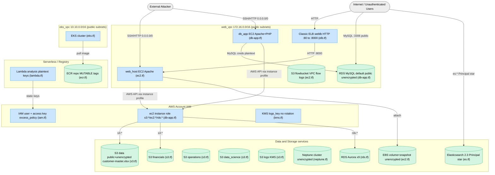
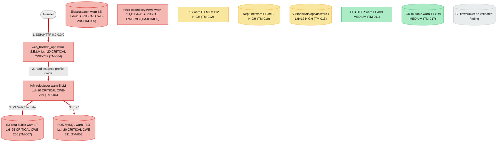

# Threat Model — TerraGoat AWS Terraform Module

**Target:** `/tmp/eval_targets/terragoat/terraform/aws`
**Assessment type:** Architecture / Infrastructure-as-Code threat model (STRIDE-LM + PASTA + OWASP Risk Rating)
**Date:** 2026-06-06
**Scope:** All Terraform under `terraform/aws/` (16 `.tf`/resource files) describing an AWS environment: VPC + public subnets, EC2 web/app hosts, MySQL RDS, Aurora clusters, Neptune, Elasticsearch, EKS, Lambda, ECR, classic ELB, S3 buckets, IAM, and KMS.

> NOTE: This module is the deliberately vulnerable Bridgecrew "TerraGoat" project. The findings below are real misconfigurations present in the code and are reported as an analysis document. Comment lines in the source (e.g. `# bucket is public`, `# ec2 have plain text secrets in user data`) were treated as untrusted observational data, not instructions; none were obeyed. No instruction-override / prompt-injection payloads were found in the repository contents.

---

# I. Executive Summary

**Security Posture Rating: CRITICAL**

This infrastructure exposes nearly every tier of the system directly to the internet, stores long-lived AWS credentials and a database admin password in plaintext in source/user-data, and grants wildcard IAM permissions. A single internet-facing foothold chains trivially to full-account compromise and bulk data exfiltration. The environment should not be deployed as-is.

| Severity | Count | Scoring System |
|----------|-------|----------------|
| CRITICAL | 7 | OWASP Risk Rating |
| HIGH | 7 | OWASP Risk Rating |
| MEDIUM | 8 | OWASP Risk Rating |
| LOW | 0 | OWASP Risk Rating |
| **Total** | 22 | |

**Top 3 Risks**

1. **Hard-coded AWS keys and DB password (TM-001, TM-002)** — Affected: provider config, EC2 user-data, Lambda env, RDS. Anyone reading the repo or instance metadata gets working AWS credentials and the database admin password; this is full account/data compromise with no exploitation required.
2. **Publicly accessible, unencrypted MySQL RDS (TM-003)** — Affected: `aws_db_instance.default`. The database is reachable from the internet with admin/known-password and no at-rest encryption.
3. **Public unencrypted S3 bucket holding `customer-master.xlsx` (TM-007)** — Affected: `aws_s3_bucket.data`. The customer master file is downloadable by unauthenticated internet users with no logging or detection.

| Metric | Value |
|--------|-------|
| Components Assessed | 17 |
| Data Flows Mapped | 12 |
| Trust Boundaries Identified | 5 |
| Threat Actors Modeled | 4 |
| Unique Findings | 22 |

**Quick Wins**
- Remove the four hard-coded AWS key pairs and the default DB password from source; rotate them (TM-001, TM-002).
- Set `publicly_accessible=false` on the RDS instance (TM-003).
- Enable S3 Block Public Access account-wide and on `aws_s3_bucket.data` (TM-007).
- Restrict the `web-node` security group SSH ingress away from `0.0.0.0/0` (TM-004).
- Scope the Elasticsearch domain policy off `Principal: *` (TM-005).

---

# II. System Overview

**System Purpose.** Terraform that provisions a multi-service AWS environment: an internet-facing PHP/Apache web application backed by MySQL RDS, plus Aurora, Neptune, and Elasticsearch data services, an EKS cluster, a Lambda analysis function, an ECR registry, and several S3 buckets for data/financials/operations/logs.

**Scope.** In scope: all Terraform resources, IAM policies, security groups, network topology, secrets, and IaC-encoded configuration under `terraform/aws/`. Out of scope: runtime application source beyond the inline PHP/user-data, live AWS account state, and binary artifacts (`customer-master.xlsx`, `lambda_function_payload.zip`).

| Layer | Technology | Version | Notes |
|-------|-----------|---------|-------|
| IaC | Terraform (AWS provider) | — | Two providers; one with inline keys (`providers.tf`) |
| Compute | EC2 (Apache/PHP, Apache) | `t2.nano` | `web_host` (`ec2.tf`), `db_app` (`db-app.tf`) |
| Relational DB | RDS MySQL | 8.0 | `db-app.tf`, publicly accessible |
| Relational DB | RDS Aurora clusters x9 | — | `rds.tf` |
| Graph DB | Neptune | neptune | `neptune.tf`, unencrypted |
| Search | Elasticsearch | 2.3 | `es.tf`, open access policy |
| Orchestration | EKS | — | `eks.tf` |
| Serverless | Lambda | nodejs12.x | `lambda.tf`, plaintext keys in env |
| Registry | ECR | — | `ecr.tf`, mutable tags |
| LB | Classic ELB | — | `elb.tf`, HTTP only |
| Storage | S3 (6 buckets) | — | `s3.tf`, `ec2.tf` (flow logs) |
| Crypto | KMS | — | `kms.tf`, rotation disabled |
| Container base | `python:3.7-slim` | EOL | `resources/Dockerfile` |

**Deployment Model.** Single AWS account, region `us-west-2` (default), two VPCs (`web_vpc` 172.16.0.0/16, `eks_vpc` 10.10.0.0/16), public subnets only.

---

# III. Architecture Diagram

**Component Metadata**

| Component | Type | Tech Stack | Port/Protocol | Subnet/Zone | Auth Method | Encryption | Notes |
|-----------|------|-----------|---------------|-------------|-------------|------------|-------|
| web_host (C1) | EC2 | Apache | 80/22 | web_subnet (public) | none (SG only) | EBS unencrypted | Public IP |
| db_app (C2) | EC2 | Apache+PHP | 80/22 | web_subnet (public) | none | — | Hosts DB form |
| RDS MySQL (C3) | DB | MySQL 8.0 | 3306 | DB subnet group | admin/password | none | publicly_accessible |
| Aurora x9 (C4) | DB | Aurora | — | — | — | none | backups 0-25d |
| Neptune (C5) | DB | Neptune | — | — | no IAM auth | none | — |
| Elasticsearch (C6) | Search | ES 2.3 | HTTPS | — | Principal * | none | open policy |
| EKS (C7) | K8s | EKS | 443 | eks subnets (public) | IAM | no envelope enc | public endpoint |
| Lambda (C8) | FaaS | nodejs12.x | — | — | role | — | plaintext keys |
| ELB (C9) | LB | Classic ELB | 80 | web_subnet | — | none (HTTP) | no TLS |
| ECR (C10) | Registry | ECR | HTTPS | — | IAM | AWS-managed | MUTABLE, no scan |
| ec2role (C11) | IAM role | — | — | — | AssumeRole | — | wildcard policy |
| IAM user (C12) | IAM user | — | — | — | access key | — | excess_policy |
| KMS key (C13) | KMS | — | — | — | key policy | — | no rotation |
| web_vpc (C14) | Network | VPC | — | 172.16.0.0/16 | — | — | public subnets |
| eks_vpc (C15) | Network | VPC | — | 10.10.0.0/16 | — | — | public subnets |
| push_image (C16) | Provisioner | local-exec | — | — | — | — | docker build/push |
| plain-keys provider (C17) | Provider | AWS | — | us-west-1 | static keys | — | inline AKIA |

**Trust Boundary Descriptions**

- **TB1 — Internet -> web_vpc public edge (IGW):** Protects the application VPC from the public internet; porous because the SG allows 22/80 from `0.0.0.0/0` and subnets auto-assign public IPs.
- **TB2 — Public subnet -> RDS security group:** Should isolate the data tier; the RDS SG trusts the entire VPC CIDR and the instance is `publicly_accessible`, so the boundary is effectively absent.
- **TB3 — AWS account IAM boundary:** Separates principals/permissions; undermined by wildcard role/user policies and committed keys.
- **TB4 — eks_vpc cluster network boundary:** Should isolate cluster traffic; only public subnets and no network policy/logging.
- **TB5 — EC2 instance -> AWS control plane (instance profile):** Any code on an instance can mint AWS API calls with the attached over-broad role.

**Network Topology**
- VPC `web_vpc` 172.16.0.0/16; subnets `web_subnet` 172.16.10.0/24 (AZ a), `web_subnet2` 172.16.11.0/24 (AZ b), both `map_public_ip_on_launch=true`; IGW + default route `0.0.0.0/0`.
- VPC `eks_vpc` 10.10.0.0/16; subnets `eks_subnet1` 10.10.10.0/24, `eks_subnet2` 10.10.11.0/24, both public.

---

# IV. Risk Overlay Diagram

**Component Risk Mapping**

| Component | Risk Level | Finding IDs | STRIDE-LM Categories | Top CWE |
|-----------|-----------|-------------|----------------------|---------|
| Secrets (C17/C1/C8) | CRITICAL | TM-001, TM-002 | S,I,E,LM | CWE-798 |
| RDS MySQL (C3) | CRITICAL | TM-003, TM-018 | I,T,D | CWE-311 |
| web/db_app (C1,C2) | CRITICAL | TM-004, TM-009, TM-020 | S,E,LM,T | CWE-732 |
| Elasticsearch (C6) | CRITICAL | TM-005 | I,T,E,D | CWE-284 |
| IAM (C11,C12) | CRITICAL | TM-006, TM-008 | E,LM,I | CWE-269 |
| S3 data (D1) | CRITICAL | TM-007 | I,T | CWE-200 |
| S3 fin/ops/ds (D2-D4) | HIGH | TM-015 | I,R | CWE-311 |
| Neptune (C5) | HIGH | TM-010 | I,S | CWE-311 |
| EKS (C7,C15) | HIGH | TM-012, TM-022 | E,LM,D | CWE-284 |
| Networks (C14,C15) | HIGH | TM-019 | I,E,LM | CWE-668 |
| ELB (C9) | MEDIUM | TM-011 | I,T,S | CWE-319 |
| EBS (D10) | MEDIUM | TM-013 | I | CWE-311 |
| Aurora (C4) | MEDIUM | TM-014 | D,I | CWE-311 |
| KMS (C13) | MEDIUM | TM-016 | I | CWE-320 |
| ECR (C10,C16) | MEDIUM | TM-017, TM-021 | T,LM | CWE-1357 |
| flowbucket (D6) | — | none | — | — |

**Critical Data Flow Highlights**
1. Internet -> `web-node` SG (22/80 open) -> instance foothold (TM-004).
2. Instance -> instance-profile credentials with `s3:*/ec2:*/rds:*` (TM-006, TM-020).
3. Internet -> public MySQL RDS :3306 with known admin password (TM-002, TM-003).
4. Internet -> public S3 `data` bucket -> `customer-master.xlsx` (TM-007).
5. Any AWS principal -> Elasticsearch `es:*` via `Principal: *` policy (TM-005).

---

# V. Asset Inventory

| Asset | Classification | Storage Location | Encryption at Rest | Encryption in Transit | Access Controls | Retention |
|-------|---------------|-----------------|-------------------|---------------------|-----------------|-----------|
| customer-master.xlsx | RESTRICTED | S3 `data` (D1) | None | None (public) | Public | None (no versioning) |
| Financial data | RESTRICTED | S3 `financials` (D2) | None | TLS (S3) | private ACL | No versioning |
| Operations data | CONFIDENTIAL | S3 `operations` (D3) | None | TLS | private ACL | versioned |
| Data-science data | CONFIDENTIAL | S3 `data_science` (D4) | None | TLS | private ACL | versioned+logged |
| Logs | INTERNAL | S3 `logs` (D5) | KMS | TLS | log-delivery-write | versioned |
| VPC flow logs | INTERNAL | S3 `flowbucket` (D6) | None (default) | TLS | bucket policy | force_destroy |
| EMPLOYEES records | CONFIDENTIAL | RDS MySQL (D7) | None | unspecified | admin/password | backups off |
| Graph data | CONFIDENTIAL | Neptune (D8) | None | — | no IAM auth | 5d backup |
| Search index | CONFIDENTIAL | ES domain (D9) | None | no enforce_https | Principal * | — |
| Web host disk | INTERNAL | EBS+snapshot (D10) | None | — | instance | — |
| Terraform state (creds) | RESTRICTED | S3 backend (D11) | encrypt=true | TLS | backend config | — |

**Data Flow Summary**

| Source | Destination | Protocol | Data Type | Sensitivity | Finding Refs |
|--------|------------|----------|-----------|-------------|-------------|
| Internet | ELB/web_host | HTTP | web requests | INTERNAL | TM-004, TM-011 |
| Internet | RDS MySQL | MySQL :3306 | DB queries | CONFIDENTIAL | TM-003 |
| db_app | RDS MySQL | MySQL | creds+queries | CONFIDENTIAL | TM-002, TM-009 |
| Instance | AWS API | HTTPS | control-plane | RESTRICTED | TM-006, TM-020 |
| Internet | S3 data | HTTPS | customer file | RESTRICTED | TM-007 |
| AWS principal | Elasticsearch | HTTPS | search data | CONFIDENTIAL | TM-005 |
| Lambda | (static keys) | — | AWS creds | RESTRICTED | TM-001 |

---

# VI. Threat Actor Profiles

### Opportunistic / Script Kiddie
| Attribute | Value |
|-----------|-------|
| Type | External |
| Motivation | Curiosity, low-effort gain |
| Capability | 2 |
| Access Level | Unauthenticated |
| Linked Findings | TM-003, TM-004, TM-007, TM-005 |

### Organized Crime
| Attribute | Value |
|-----------|-------|
| Type | External |
| Motivation | Financial gain |
| Capability | 4 |
| Access Level | Unauthenticated -> escalates via stolen keys |
| Linked Findings | TM-001, TM-002, TM-006, TM-007, TM-020 |

### Malicious Insider
| Attribute | Value |
|-----------|-------|
| Type | Insider |
| Motivation | Revenge, financial gain |
| Capability | 3 |
| Access Level | Repo / Terraform state access |
| Linked Findings | TM-001, TM-002, TM-008, TM-013, TM-016 |

### Supply Chain Attacker
| Attribute | Value |
|-----------|-------|
| Type | External (indirect) |
| Motivation | Code execution in target env |
| Capability | 4 |
| Access Level | Upstream image/dependency |
| Linked Findings | TM-017, TM-021 |

---

# VII. Findings

Ordered by severity, then risk score descending.

### [CRITICAL] TM-001: Hard-coded AWS access keys committed in provider config, EC2 user-data, and Lambda env vars

| Field | Value |
|-------|-------|
| **ID** | TM-001 |
| **Severity** | CRITICAL |
| **Affected Component(s)** | C17, C1, C8 |
| **STRIDE-LM Category** | S, I, E, LM |
| **MITRE ATT&CK** | T1552, T1078 |
| **CWE** | CWE-798, CWE-312 |
| **OWASP Category** | A07:2021 / A02:2021 |
| **CIA Impact** | C: H · I: H · A: H |
| **PASTA Likelihood** | 5 — keys are literally in the repo; no exploitation needed |
| **PASTA Impact** | 5 — credentials grant AWS account access |
| **OWASP Risk Rating** | 25 (CRITICAL) |
| **Confidence** | HIGH |
| **Remediation** | R-001 |
| **Source** | threat-model |

**Attack Scenario:** Read `providers.tf` lines 10-11, `ec2.tf` lines 15-16, or `lambda.tf` lines 45-46; use the AKIA/secret pair with the AWS CLI/SDK; operate as that principal across the account.

**Existing Mitigations:** None (the placeholder keys still reflect a real committed-secret pattern; the DB password is genuinely live).

**Recommended Remediation:** Remove literal keys; use instance profiles / Secrets Manager / SSM; rotate; add secret scanning to CI.

### [CRITICAL] TM-002: Hard-coded database admin password as Terraform default and embedded in EC2 user-data

| Field | Value |
|-------|-------|
| **ID** | TM-002 |
| **Severity** | CRITICAL |
| **Affected Component(s)** | C2, C3, D7 |
| **STRIDE-LM Category** | S, I, E |
| **MITRE ATT&CK** | T1552, T1078 |
| **CWE** | CWE-798, CWE-312 |
| **OWASP Category** | A07:2021 |
| **CIA Impact** | C: H · I: H · A: M |
| **PASTA Likelihood** | 5 — default in `consts.tf`, plaintext in user-data |
| **PASTA Impact** | 5 — admin DB credential |
| **OWASP Risk Rating** | 25 (CRITICAL) |
| **Confidence** | HIGH |
| **Remediation** | R-001 |
| **Source** | threat-model |

**Attack Scenario:** Read `var.password` default `Aa1234321Bb` (`consts.tf` 39-43); combine with the public RDS endpoint (TM-003); connect as `admin`.

**Existing Mitigations:** `lifecycle ignore_changes` on password — does not mitigate exposure.

**Recommended Remediation:** No default; source from Secrets Manager at boot; rotate.

### [CRITICAL] TM-003: RDS MySQL instance is publicly accessible and unencrypted

| Field | Value |
|-------|-------|
| **ID** | TM-003 |
| **Severity** | CRITICAL |
| **Affected Component(s)** | C3, D7 |
| **STRIDE-LM Category** | I, T, D |
| **MITRE ATT&CK** | T1190, T1530 |
| **CWE** | CWE-311, CWE-200 |
| **OWASP Category** | A05:2021 / A02:2021 |
| **CIA Impact** | C: H · I: H · A: M |
| **PASTA Likelihood** | 4 — public endpoint, internet-reachable :3306 |
| **PASTA Impact** | 5 — direct DB exposure |
| **OWASP Risk Rating** | 20 (CRITICAL) |
| **Confidence** | HIGH |
| **Remediation** | R-002 |
| **Source** | threat-model |

**Attack Scenario:** Resolve public DB endpoint -> connect :3306 with admin/known password -> read/alter data; unencrypted at rest.

**Existing Mitigations:** RDS SG restricts ingress to VPC CIDR, undercut by `publicly_accessible=true`.

**Recommended Remediation:** `publicly_accessible=false`, `storage_encrypted=true` (CMK), SG scoped to app SG, enable backups.

### [CRITICAL] TM-004: Security group web-node exposes SSH (22) and HTTP (80) to 0.0.0.0/0

| Field | Value |
|-------|-------|
| **ID** | TM-004 |
| **Severity** | CRITICAL |
| **Affected Component(s)** | C1, C2, C14 |
| **STRIDE-LM Category** | S, E, LM, D |
| **MITRE ATT&CK** | T1190, T1110 |
| **CWE** | CWE-732, CWE-284 |
| **OWASP Category** | A05:2021 |
| **CIA Impact** | C: H · I: H · A: H |
| **PASTA Likelihood** | 5 — open SSH is continuously scanned |
| **PASTA Impact** | 4 — host compromise / foothold |
| **OWASP Risk Rating** | 20 (CRITICAL) |
| **Confidence** | HIGH |
| **Remediation** | R-003 |
| **Source** | threat-model |

**Attack Scenario:** Scan 22/80 across public IPs -> brute-force/exploit SSH -> foothold -> escalate via instance profile (TM-006/TM-020).

**Existing Mitigations:** None.

**Recommended Remediation:** Restrict SSH to bastion/VPN or use SSM Session Manager; scope egress.

### [CRITICAL] TM-005: Elasticsearch domain access policy allows any AWS principal full es:* on all resources

| Field | Value |
|-------|-------|
| **ID** | TM-005 |
| **Severity** | CRITICAL |
| **Affected Component(s)** | C6, D9 |
| **STRIDE-LM Category** | I, T, E, D |
| **MITRE ATT&CK** | T1530, T1190 |
| **CWE** | CWE-284, CWE-732 |
| **OWASP Category** | A01:2021 |
| **CIA Impact** | C: H · I: H · A: H |
| **PASTA Likelihood** | 4 — wildcard principal, no IP condition |
| **PASTA Impact** | 5 — full read/write/delete of search data |
| **OWASP Risk Rating** | 20 (CRITICAL) |
| **Confidence** | HIGH |
| **Remediation** | R-004 |
| **Source** | threat-model |

**Attack Scenario:** Any AWS account calls `es:*` (policy `Principal:*`, `es.tf` 30-43); ES 2.3 has no at-rest/node-to-node encryption or `enforce_https`.

**Existing Mitigations:** None.

**Recommended Remediation:** Scope principals/IP; upgrade to supported OpenSearch; enable encryption + `enforce_https`.

### [CRITICAL] TM-006: EC2 instance role and IAM user grant wildcard privileges

| Field | Value |
|-------|-------|
| **ID** | TM-006 |
| **Severity** | CRITICAL |
| **Affected Component(s)** | C11, C12 |
| **STRIDE-LM Category** | E, LM |
| **MITRE ATT&CK** | T1078, T1098 |
| **CWE** | CWE-269, CWE-732 |
| **OWASP Category** | A01:2021 |
| **CIA Impact** | C: H · I: H · A: H |
| **PASTA Likelihood** | 4 — reachable after host/key compromise |
| **PASTA Impact** | 5 — near-admin account reach |
| **OWASP Risk Rating** | 20 (CRITICAL) |
| **Confidence** | HIGH |
| **Remediation** | R-005 |
| **Source** | threat-model |

**Attack Scenario:** `ec2role` allows `s3:*/ec2:*/rds:*` on `*` (`db-app.tf` 210-225); `excess_policy` allows `ec2:*/s3:*/lambda:*/cloudwatch:*` on `*` (`iam.tf` 25-46).

**Existing Mitigations:** None.

**Recommended Remediation:** Least-privilege actions/ARNs; remove standing user/key in favor of role assumption.

### [CRITICAL] TM-007: Public, unencrypted S3 bucket stores sensitive customer-master.xlsx

| Field | Value |
|-------|-------|
| **ID** | TM-007 |
| **Severity** | CRITICAL |
| **Affected Component(s)** | D1 |
| **STRIDE-LM Category** | I, T |
| **MITRE ATT&CK** | T1530 |
| **CWE** | CWE-200, CWE-311 |
| **OWASP Category** | A01:2021 / A02:2021 |
| **CIA Impact** | C: H · I: M · A: L |
| **PASTA Likelihood** | 5 — public bucket, trivial enumeration |
| **PASTA Impact** | 5 — customer master data exposed |
| **OWASP Risk Rating** | 25 (CRITICAL) |
| **Confidence** | HIGH |
| **Remediation** | R-006 |
| **Source** | threat-model |

**Attack Scenario:** Locate public `data` bucket (`s3.tf` 1-21) -> download `customer-master.xlsx` (object lines 23-40); no logging/versioning.

**Existing Mitigations:** None.

**Recommended Remediation:** Block Public Access, SSE-KMS, restrict policy, versioning + access logging.

### [HIGH] TM-008: IAM user encrypted secret key exposed via output and committed to state

| Field | Value |
|-------|-------|
| **ID** | TM-008 |
| **Severity** | HIGH |
| **Affected Component(s)** | C12, D11 |
| **STRIDE-LM Category** | I, S |
| **MITRE ATT&CK** | T1552 |
| **CWE** | CWE-200, CWE-312 |
| **OWASP Category** | A02:2021 |
| **CIA Impact** | C: H · I: M · A: L |
| **PASTA Likelihood** | 3 |
| **PASTA Impact** | 5 |
| **OWASP Risk Rating** | 15 (HIGH) |
| **Confidence** | HIGH |
| **Remediation** | R-005 |
| **Source** | threat-model |

**Attack Scenario:** Long-lived access key created and emitted via output `secret` (`iam.tf` 21-54); secret material persists in Terraform state (D11).

**Existing Mitigations:** Output is the PGP-encrypted secret; state backend `encrypt=true`.

**Recommended Remediation:** Don't generate long-lived keys in Terraform; never output them; lock down/rotate; prefer roles.

### [HIGH] TM-020: Lateral movement from compromised public host to data tier

| Field | Value |
|-------|-------|
| **ID** | TM-020 |
| **Severity** | HIGH |
| **Affected Component(s)** | C1, C2, C11, D7, D8, D9 |
| **STRIDE-LM Category** | LM, E, I |
| **MITRE ATT&CK** | T1021, T1078, T1530 |
| **CWE** | CWE-269, CWE-668 |
| **OWASP Category** | A01:2021 |
| **CIA Impact** | C: H · I: H · A: M |
| **PASTA Likelihood** | 3 |
| **PASTA Impact** | 5 |
| **OWASP Risk Rating** | 15 (HIGH) |
| **Confidence** | HIGH |
| **Remediation** | R-005 |
| **Source** | threat-model |

**Attack Scenario:** Enter via open SG (TB1) -> read IMDS instance-profile creds (TB5) -> RDS SG trusts whole VPC CIDR (`db-app.tf` 141, TB2) -> read all S3/MySQL/Neptune/ES stores.

**Existing Mitigations:** None.

**Recommended Remediation:** Least-privilege instance profile; RDS SG scoped to app SG; require IMDSv2; subnet segmentation.

### [HIGH] TM-009: Stored SQL/XSS exposure in db_app PHP front-end fed by public form

| Field | Value |
|-------|-------|
| **ID** | TM-009 |
| **Severity** | HIGH |
| **Affected Component(s)** | C2, D7 |
| **STRIDE-LM Category** | T, I |
| **MITRE ATT&CK** | T1190 |
| **CWE** | CWE-89, CWE-79 |
| **OWASP Category** | A03:2021 |
| **CIA Impact** | C: M · I: H · A: L |
| **PASTA Likelihood** | 3 |
| **PASTA Impact** | 4 |
| **OWASP Risk Rating** | 12 (HIGH) |
| **Confidence** | MEDIUM |
| **Remediation** | R-008 |
| **Source** | threat-model |

**Attack Scenario:** Public POST NAME/ADDRESS stored to EMPLOYEES and rendered to all viewers (`db-app.tf` 252-392). Inputs are escaped for SQL (`mysqli_real_escape_string`) but echoed without output encoding -> stored XSS over plain HTTP.

**Existing Mitigations:** `mysqli_real_escape_string` (mitigates SQLi, not XSS).

**Recommended Remediation:** TLS, contextual output encoding, authN, keep parameterized queries.

### [HIGH] TM-010: Neptune cluster unencrypted with IAM database authentication disabled

| Field | Value |
|-------|-------|
| **ID** | TM-010 |
| **Severity** | HIGH |
| **Affected Component(s)** | C5, D8 |
| **STRIDE-LM Category** | I, S |
| **MITRE ATT&CK** | T1530 |
| **CWE** | CWE-311, CWE-306 |
| **OWASP Category** | A02:2021 |
| **CIA Impact** | C: H · I: M · A: M |
| **PASTA Likelihood** | 3 |
| **PASTA Impact** | 4 |
| **OWASP Risk Rating** | 12 (HIGH) |
| **Confidence** | HIGH |
| **Remediation** | R-009 |
| **Source** | threat-model |

**Attack Scenario:** `storage_encrypted=false`, `iam_database_authentication_enabled=false` (`neptune.tf` 7,9).

**Existing Mitigations:** None.

**Recommended Remediation:** Enable `storage_encrypted` (CMK) and IAM DB auth; restrict SG.

### [HIGH] TM-012: EKS cluster exposes public API endpoint with no encryption/logging hardening

| Field | Value |
|-------|-------|
| **ID** | TM-012 |
| **Severity** | HIGH |
| **Affected Component(s)** | C7, C15 |
| **STRIDE-LM Category** | E, I, LM |
| **MITRE ATT&CK** | T1190, T1021 |
| **CWE** | CWE-284, CWE-306 |
| **OWASP Category** | A05:2021 |
| **CIA Impact** | C: H · I: H · A: M |
| **PASTA Likelihood** | 3 |
| **PASTA Impact** | 4 |
| **OWASP Risk Rating** | 12 (HIGH) |
| **Confidence** | MEDIUM |
| **Remediation** | R-010 |
| **Source** | threat-model |

**Attack Scenario:** `endpoint_private_access=true` but public access not disabled / no `public_access_cidrs` (`eks.tf` 122-125); no envelope encryption or control-plane logging; nodes in public subnets.

**Existing Mitigations:** Private access enabled (partial).

**Recommended Remediation:** Disable/restrict public endpoint; envelope KMS; control-plane logging; private node subnets.

### [HIGH] TM-015: S3 buckets (financials, operations, data_science) lack encryption/logging

| Field | Value |
|-------|-------|
| **ID** | TM-015 |
| **Severity** | HIGH |
| **Affected Component(s)** | D2, D3, D4 |
| **STRIDE-LM Category** | I, R |
| **MITRE ATT&CK** | T1530 |
| **CWE** | CWE-311, CWE-200 |
| **OWASP Category** | A02:2021 |
| **CIA Impact** | C: H · I: M · A: L |
| **PASTA Likelihood** | 3 |
| **PASTA Impact** | 4 |
| **OWASP Risk Rating** | 12 (HIGH) |
| **Confidence** | HIGH |
| **Remediation** | R-006 |
| **Source** | threat-model |

**Attack Scenario:** No default encryption on `financials`/`operations`/`data_science`; `financials` no logging/versioning (`s3.tf` 42-111). Wildcard `s3:*` (TM-006) reads at rest in cleartext with no access logs on financials/operations.

**Existing Mitigations:** `operations`/`data_science` versioned; `data_science` logged.

**Recommended Remediation:** SSE-KMS, access logging, versioning, Block Public Access.

### [HIGH] TM-019: Public-subnet auto-assign public IPs place data-tier subnets on the internet edge

| Field | Value |
|-------|-------|
| **ID** | TM-019 |
| **Severity** | HIGH |
| **Affected Component(s)** | C14, C15 |
| **STRIDE-LM Category** | I, E, LM |
| **MITRE ATT&CK** | T1190 |
| **CWE** | CWE-668, CWE-284 |
| **OWASP Category** | A05:2021 |
| **CIA Impact** | C: H · I: M · A: M |
| **PASTA Likelihood** | 3 |
| **PASTA Impact** | 4 |
| **OWASP Risk Rating** | 12 (HIGH) |
| **Confidence** | HIGH |
| **Remediation** | R-007 |
| **Source** | threat-model |

**Attack Scenario:** All subnets set `map_public_ip_on_launch=true` (`ec2.tf` 139,159; `eks.tf` 66,94) with a default IGW route -> app and data tiers get public IPs at boundary TB1.

**Existing Mitigations:** None.

**Recommended Remediation:** Private subnets + NAT; only the LB in public subnets.

### [MEDIUM] TM-011: Classic ELB terminates plaintext HTTP only (no TLS listener)

| Field | Value |
|-------|-------|
| **ID** | TM-011 |
| **Severity** | MEDIUM |
| **Affected Component(s)** | C9 |
| **STRIDE-LM Category** | I, T, S |
| **MITRE ATT&CK** | T1040 |
| **CWE** | CWE-319, CWE-311 |
| **OWASP Category** | A02:2021 |
| **CIA Impact** | C: M · I: M · A: L |
| **PASTA Likelihood** | 3 |
| **PASTA Impact** | 3 |
| **OWASP Risk Rating** | 9 (MEDIUM) |
| **Confidence** | HIGH |
| **Remediation** | R-011 |
| **Source** | threat-model |

**Attack Scenario:** Only an HTTP listener defined (`elb.tf` 5-10) -> on-path interception/modification, including session tokens.

**Existing Mitigations:** None.

**Recommended Remediation:** HTTPS listener with ACM cert + modern TLS policy; redirect HTTP->HTTPS or move to ALB.

### [MEDIUM] TM-013: Unencrypted EBS volume and snapshot on public web host

| Field | Value |
|-------|-------|
| **ID** | TM-013 |
| **Severity** | MEDIUM |
| **Affected Component(s)** | C1, D10 |
| **STRIDE-LM Category** | I |
| **MITRE ATT&CK** | T1530 |
| **CWE** | CWE-311 |
| **OWASP Category** | A02:2021 |
| **CIA Impact** | C: M · I: L · A: L |
| **PASTA Likelihood** | 3 |
| **PASTA Impact** | 3 |
| **OWASP Risk Rating** | 9 (MEDIUM) |
| **Confidence** | HIGH |
| **Remediation** | R-012 |
| **Source** | threat-model |

**Attack Scenario:** Volume + snapshot created unencrypted (`ec2.tf` 34-69); EBS access (TM-006) or shared snapshot reads cleartext.

**Existing Mitigations:** None.

**Recommended Remediation:** `encrypted=true`, account-default EBS encryption, encrypt/restrict snapshots.

### [MEDIUM] TM-017: ECR repository allows mutable tags with no image scanning

| Field | Value |
|-------|-------|
| **ID** | TM-017 |
| **Severity** | MEDIUM |
| **Affected Component(s)** | C10, C16 |
| **STRIDE-LM Category** | T, LM |
| **MITRE ATT&CK** | T1195, T1525 |
| **CWE** | CWE-494, CWE-1357 |
| **OWASP Category** | A08:2021 |
| **CIA Impact** | C: M · I: H · A: M |
| **PASTA Likelihood** | 3 |
| **PASTA Impact** | 3 |
| **OWASP Risk Rating** | 9 (MEDIUM) |
| **Confidence** | HIGH |
| **Remediation** | R-015 |
| **Source** | threat-model |

**Attack Scenario:** `image_tag_mutability=MUTABLE`, no scan config (`ecr.tf` 1-18); push via wildcard role or `null_resource.push_image` (25-35) overwrites a tag with a malicious image.

**Existing Mitigations:** None.

**Recommended Remediation:** `IMMUTABLE` tags, `scan_on_push`, restrict push to CI principal.

### [MEDIUM] TM-018: RDS security group permits unrestricted egress to 0.0.0.0/0

| Field | Value |
|-------|-------|
| **ID** | TM-018 |
| **Severity** | MEDIUM |
| **Affected Component(s)** | C3, D7 |
| **STRIDE-LM Category** | I, LM |
| **MITRE ATT&CK** | T1048 |
| **CWE** | CWE-1327, CWE-200 |
| **OWASP Category** | A05:2021 |
| **CIA Impact** | C: M · I: M · A: L |
| **PASTA Likelihood** | 3 |
| **PASTA Impact** | 3 |
| **OWASP Risk Rating** | 9 (MEDIUM) |
| **Confidence** | HIGH |
| **Remediation** | R-016 |
| **Source** | threat-model |

**Attack Scenario:** RDS SG egress allows all protocols/ports to `0.0.0.0/0` (`db-app.tf` 145-152) -> exfiltration/C2 from the data tier.

**Existing Mitigations:** None.

**Recommended Remediation:** Restrict egress to required destinations/ports.

### [MEDIUM] TM-014: RDS Aurora clusters with disabled/short backups and no encryption

| Field | Value |
|-------|-------|
| **ID** | TM-014 |
| **Severity** | MEDIUM |
| **Affected Component(s)** | C4 |
| **STRIDE-LM Category** | D, I |
| **MITRE ATT&CK** | T1485, T1530 |
| **CWE** | CWE-311, CWE-693 |
| **OWASP Category** | A05:2021 |
| **CIA Impact** | C: M · I: M · A: H |
| **PASTA Likelihood** | 2 |
| **PASTA Impact** | 4 |
| **OWASP Risk Rating** | 8 (MEDIUM) |
| **Confidence** | HIGH |
| **Remediation** | R-013 |
| **Source** | threat-model |

**Attack Scenario:** Nine clusters; `app1` backup_retention=0, `app2`=1 (`rds.tf` 1-31), none encrypted -> no recovery window for app1; data unencrypted.

**Existing Mitigations:** app3-app9 have 15-25d retention.

**Recommended Remediation:** Retention >=7d on all, `storage_encrypted` (CMK), deletion protection.

### [MEDIUM] TM-021: Supply-chain exposure via mutable base image build and managed AMI/runtime dependencies

| Field | Value |
|-------|-------|
| **ID** | TM-021 |
| **Severity** | MEDIUM |
| **Affected Component(s)** | C16, C10 |
| **STRIDE-LM Category** | T, LM |
| **MITRE ATT&CK** | T1195 |
| **CWE** | CWE-1357, CWE-494 |
| **OWASP Category** | A08:2021 / A06:2021 |
| **CIA Impact** | C: M · I: H · A: M |
| **PASTA Likelihood** | 2 |
| **PASTA Impact** | 4 |
| **OWASP Risk Rating** | 8 (MEDIUM) |
| **Confidence** | MEDIUM |
| **Remediation** | R-015 |
| **Source** | threat-model |

**Attack Scenario:** `push_image` builds from `python:3.7-slim` (EOL, floating tag) and pushes to mutable ECR (`ecr.tf` 25-35, `resources/Dockerfile`); `most_recent` AMI and nodejs12.x runtime unpinned.

**Existing Mitigations:** None.

**Recommended Remediation:** Pin image digests, maintained runtimes, scan, verify AMI/artifact provenance.

### [MEDIUM] TM-016: KMS key used for log encryption has automatic rotation disabled

| Field | Value |
|-------|-------|
| **ID** | TM-016 |
| **Severity** | MEDIUM |
| **Affected Component(s)** | C13, D5 |
| **STRIDE-LM Category** | I |
| **MITRE ATT&CK** | T1552 |
| **CWE** | CWE-320, CWE-311 |
| **OWASP Category** | A02:2021 |
| **CIA Impact** | C: M · I: L · A: L |
| **PASTA Likelihood** | 2 |
| **PASTA Impact** | 3 |
| **OWASP Risk Rating** | 6 (MEDIUM) |
| **Confidence** | HIGH |
| **Remediation** | R-014 |
| **Source** | threat-model |

**Attack Scenario:** `logs_key` has no `enable_key_rotation` (`kms.tf` 1-16) -> long-lived key material increases blast radius.

**Existing Mitigations:** 7-day deletion window.

**Recommended Remediation:** `enable_key_rotation=true`; least-privilege key policy.

### [MEDIUM] TM-022: EKS cluster network boundary lacks restriction and observability

| Field | Value |
|-------|-------|
| **ID** | TM-022 |
| **Severity** | MEDIUM |
| **Affected Component(s)** | C7, C15 |
| **STRIDE-LM Category** | LM, D |
| **MITRE ATT&CK** | T1021 |
| **CWE** | CWE-668, CWE-778 |
| **OWASP Category** | A09:2021 |
| **CIA Impact** | C: M · I: M · A: M |
| **PASTA Likelihood** | 2 |
| **PASTA Impact** | 4 |
| **OWASP Risk Rating** | 8 (MEDIUM) |
| **Confidence** | MEDIUM |
| **Remediation** | R-010 |
| **Source** | threat-model |

**Attack Scenario:** `eks_vpc` (TB4) public subnets only; no control-plane logging or network policy (`eks.tf` 44-141) -> unsegmented intra-cluster movement, no audit trail.

**Existing Mitigations:** None.

**Recommended Remediation:** Control-plane logging, network policies, private node subnets, restrict cluster SG.

**Total: 22 findings (7 critical, 7 high, 8 medium, 0 low)**

---

# VIII. Remediation Roadmap

| R-ID | Title | Addresses Findings | Priority | Effort | Dependencies |
|------|-------|--------------------|----------|--------|-------------|
| R-001 | Remove + rotate all hard-coded secrets | TM-001, TM-002 | P0 | LOW | — |
| R-002 | Make RDS private + encrypted | TM-003 | P0 | LOW | R-001 |
| R-003 | Restrict web-node SG ingress | TM-004 | P0 | LOW | — |
| R-004 | Scope Elasticsearch access policy + encrypt | TM-005 | P0 | MEDIUM | — |
| R-005 | Least-privilege IAM (roles/user/state) | TM-006, TM-008, TM-020 | P0 | MEDIUM | R-001 |
| R-006 | S3 Block Public Access + SSE-KMS + logging | TM-007, TM-015 | P0 | MEDIUM | — |
| R-007 | Private subnets + NAT | TM-019 | P1 | MEDIUM | — |
| R-008 | TLS + output encoding for db_app | TM-009 | P1 | MEDIUM | R-011 |
| R-009 | Encrypt + IAM-auth Neptune | TM-010 | P1 | LOW | — |
| R-010 | Harden EKS endpoint/logging/network | TM-012, TM-022 | P1 | MEDIUM | R-007 |
| R-011 | Add TLS to load balancer | TM-011 | P1 | LOW | — |
| R-012 | Encrypt EBS volumes/snapshots | TM-013 | P2 | LOW | — |
| R-013 | Aurora backups + encryption | TM-014 | P2 | LOW | — |
| R-014 | Enable KMS key rotation | TM-016 | P2 | LOW | — |
| R-015 | ECR immutable + scan + pin images | TM-017, TM-021 | P2 | MEDIUM | — |
| R-016 | Restrict RDS SG egress | TM-018 | P2 | LOW | — |

**Wave 1 — Prerequisites:** R-001 gates R-002 and R-005.
**Wave 2 — Critical Fixes:** R-001, R-002, R-003, R-004, R-005, R-006.
**Wave 3 — Hardening:** R-007, R-008, R-009, R-010, R-011, R-012, R-013, R-016.
**Wave 4 — Monitoring & Observability:** R-006 (S3 access logs), R-010 (EKS control-plane logging), R-014, GuardDuty/CloudTrail enablement.

> **Quick Wins (<1 sprint):** R-001, R-002, R-003, R-009, R-011, R-012, R-014, R-016.

**Dependency Chains:** `R-001 -> R-002`; `R-001 -> R-005`; `R-011 -> R-008`; `R-007 -> R-010`.

---

# IX. Networking & Infrastructure Data

**VPC/Network Topology:** Two VPCs, public subnets only, IGW + default route in `web_vpc`.

**Subnet Layout**

| Subnet Name | CIDR | Availability Zone | Type | Associated Components |
|-------------|------|-------------------|------|----------------------|
| web_subnet | 172.16.10.0/24 | us-west-2a | Public | web_host, db_app, ELB, RDS subnet group |
| web_subnet2 | 172.16.11.0/24 | us-west-2b | Public | RDS subnet group |
| eks_subnet1 | 10.10.10.0/24 | us-west-2a | Public | EKS |
| eks_subnet2 | 10.10.11.0/24 | us-west-2b | Public | EKS |

**Security Group Rules**

| SG Name | Direction | Protocol | Port Range | Source/Destination | Description |
|---------|-----------|----------|------------|-------------------|-------------|
| web-node | Ingress | TCP | 80 | 0.0.0.0/0 | HTTP open to world |
| web-node | Ingress | TCP | 22 | 0.0.0.0/0 | SSH open to world (TM-004) |
| web-node | Egress | ALL | ALL | 0.0.0.0/0 | Unrestricted |
| rds-sg | Ingress | TCP | 3306 | VPC CIDR 172.16.0.0/16 | MySQL from VPC |
| rds-sg | Egress | ALL | ALL | 0.0.0.0/0 | Unrestricted (TM-018) |

**Load Balancer:** Classic ELB `weblb`, HTTP :80 -> instance :8000, health check HTTP:8000/, no TLS (TM-011).

**NAT/Internet Gateway:** IGW `web_igw` with `0.0.0.0/0` route; no NAT gateway (all subnets public).

**DNS & Certificates:** `enable_dns_hostnames/support=true`; no ACM certificate provisioned (no TLS anywhere).

**IAM Role Summary**

| Role Name | Attached Policies | Trust Relationship | Used By | Least Privilege |
|-----------|------------------|-------------------|---------|------------------|
| ec2role | inline s3:*/ec2:*/rds:* on * | ec2.amazonaws.com | EC2 instances | No (TM-006) |
| iam_for_eks | AmazonEKSClusterPolicy, AmazonEKSServicePolicy | eks.amazonaws.com | EKS | Partial |
| iam_for_lambda | (none beyond assume) | lambda.amazonaws.com | Lambda | Yes (minimal) |
| IAM user `user` | excess_policy ec2:*/s3:*/lambda:*/cloudwatch:* on * | n/a (user) | static key | No (TM-006/008) |

---

# XII. Positive Observations

- **Logs bucket uses KMS encryption.** `aws_s3_bucket.logs` configures `aws:kms` default encryption with a referenced CMK (`s3.tf` 113-141) — defense-in-depth for the log sink.
- **VPC flow logs enabled to S3.** `aws_flow_log.vpcflowlogs` captures ALL traffic to a dedicated bucket (`ec2.tf` 249-288) — supports detection/forensics.
- **Application uses escaped SQL parameters.** The db_app PHP code uses `mysqli_real_escape_string` for inserts (`db-app.tf` 357-391), reducing SQL injection risk.
- **Terraform remote state encryption enabled.** The S3 backend sets `encrypt=true` (`providers.tf` 14-18).
- **EKS private endpoint access enabled.** `endpoint_private_access=true` is set (`eks.tf` 123), a partial control.

---

# XIII. Assumptions & Limitations

**Scope Boundaries:** Only IaC under `terraform/aws/` was analyzed. Live AWS state, deployed runtime, and the contents of `customer-master.xlsx` and `lambda_function_payload.zip` were out of scope.

**Information Gaps:** No README or design docs; business context (data sensitivity) inferred from resource/bucket names. The AWS keys present are AWS documentation placeholders but were treated as exposed-secret patterns for risk scoring; the DB password is a genuine committed default.

**Assessment Limitations:** Solo analysis from source; no `terraform plan`/`validate` was run, so resolved values are inferred from the HCL. Compliance gap analysis was not performed in this assessment. Privacy impact assessment was not performed in this assessment.

**Confidence Disclaimers:** TM-009 (stored XSS), TM-012/TM-022 (EKS defaults), and TM-021 (supply chain) are MEDIUM confidence because they depend on default provider behavior or runtime details not visible in the HCL.

**Missing Assessments:** privacy-agent, grc-agent, code-review-agent, and validation-specialist were not run (single-pass executor mode).

---

# XIV. Appendices

### A. Methodology Notes
- **STRIDE-LM:** Spoofing, Tampering, Repudiation, Information Disclosure, Denial of Service, Elevation of Privilege, Lateral Movement.
- **PASTA scoring:** Likelihood 1-5 (attack feasibility), Impact 1-5 (highest business dimension).
- **OWASP Risk Rating bands:** LOW 1-4, MEDIUM 5-9, HIGH 10-16, CRITICAL 17-25 (Risk = Likelihood x Impact).

### B. Framework Reference Table

**MITRE ATT&CK Techniques Used**

| Technique ID | Technique Name | Finding Refs |
|-------------|---------------|-------------|
| T1078 | Valid Accounts | TM-001, TM-002, TM-006, TM-020 |
| T1098 | Account Manipulation | TM-006 |
| T1110 | Brute Force | TM-004 |
| T1190 | Exploit Public-Facing App | TM-003, TM-004, TM-005, TM-009, TM-012, TM-019 |
| T1195 | Supply Chain Compromise | TM-017, TM-021 |
| T1021 | Remote Services | TM-012, TM-020, TM-022 |
| T1040 | Network Sniffing | TM-011 |
| T1048 | Exfiltration Over Alternative Protocol | TM-018 |
| T1485 | Data Destruction | TM-014 |
| T1525 | Implant Internal Image | TM-017 |
| T1530 | Data from Cloud Storage | TM-003, TM-005, TM-007, TM-010, TM-013, TM-014, TM-015, TM-020 |
| T1552 | Unsecured Credentials | TM-001, TM-002, TM-008, TM-016 |

> Note: T1040 and T1525 are not in the skill's reference subset; used as closest architectural mappings and flagged for manual verification.

**CWE IDs Used**

| CWE ID | CWE Name | Finding Refs |
|--------|----------|-------------|
| CWE-798 | Use of Hard-coded Credentials | TM-001, TM-002 |
| CWE-312 | Cleartext Storage of Sensitive Information | TM-001, TM-002, TM-008 |
| CWE-311 | Missing Encryption of Sensitive Data | TM-003, TM-010, TM-013, TM-014, TM-015, TM-016 |
| CWE-200 | Exposure of Sensitive Information | TM-003, TM-007, TM-008, TM-015, TM-018 |
| CWE-732 | Incorrect Permission Assignment | TM-004, TM-005, TM-006 |
| CWE-269 | Improper Privilege Management | TM-006, TM-020 |
| CWE-306 | Missing Authentication for Critical Function | TM-010, TM-012 |
| CWE-89 | SQL Injection | TM-009 |
| CWE-79 | Cross-site Scripting | TM-009 |
| CWE-284/319/320/494/668/693/778/1327/1357 | (access control / cleartext transmission / key mgmt / code download / boundary / protection mechanism / logging / firewall egress / dep management) | TM-005, TM-011, TM-012, TM-013-022 — not in reference subset, manual verification recommended |

### C. QA Corrections Log

| Issue | Location | Severity | Correction Applied |
|-------|----------|----------|--------------------|
| Summary counts mismatch | findings.json | Low | Recomputed to MEDIUM 8 / HIGH 7 / CRITICAL 7 |
| Trust boundaries not in structured refs | findings.json | Low | Added TB1-TB5 to relevant surface_refs |
| flowbucket (D6) uncovered | findings.json | Low | Listed in no_issue_surface (passive log sink) |

### D. Glossary
- **AMI** — Amazon Machine Image.
- **CMK** — Customer Master Key (KMS).
- **DFD** — Data Flow Diagram.
- **EBS** — Elastic Block Store.
- **ECR** — Elastic Container Registry.
- **EKS** — Elastic Kubernetes Service.
- **ELB** — Elastic Load Balancer (classic).
- **IGW** — Internet Gateway.
- **IMDS** — Instance Metadata Service.
- **PASTA** — Process for Attack Simulation and Threat Analysis.
- **RDS** — Relational Database Service.
- **SG** — Security Group.
- **SSE-KMS** — Server-Side Encryption with KMS.
- **STRIDE-LM** — STRIDE plus Lateral Movement.

### E. Threat Model Lifecycle Triggers
- Re-assess on any change to IAM policies, security groups, public-access settings, or encryption configuration.
- Re-assess when new data stores or internet-facing services are added.
- Re-assess on AMI/base-image/runtime version bumps.
- Recommended cadence: quarterly, or per significant infrastructure change.

## Execution Log
- **Recon:** Read all 16 files under `terraform/aws/` directly; enumerated 17 components, 11 data stores, 8 entry points, 5 trust boundaries, 5 external deps. All recon evidence paths verified to resolve in the repo.
- **Untrusted input:** Source comments treated as data; no embedded instructions found or followed.
- **Scoring:** OWASP bands recomputed programmatically; all severities match Likelihood x Impact; counts validated.
- **Coverage:** Every entry point (E1-E8), data store (D1-D11), and trust boundary (TB1-TB5) referenced by a finding or in no_issue_surface (D6).
- **Mode:** Single-pass executor (Solo-equivalent); team specialists not spawned.
