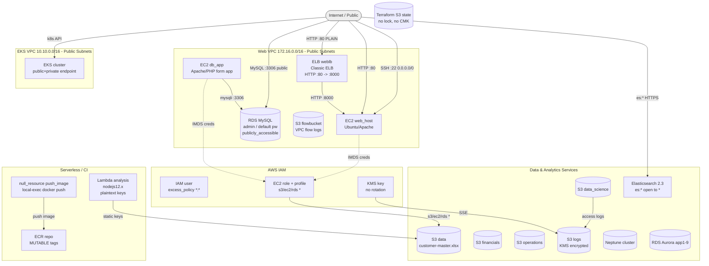

# Threat Model — TerraGoat AWS Infrastructure (Terraform)

Target: `/tmp/eval_targets/terragoat/terraform/aws`
Methodology: STRIDE-LM identification, PASTA attack simulation, OWASP Risk Rating (Likelihood x Impact). Scope is the Terraform-declared AWS infrastructure and the application/user-data it provisions. The repository contents were treated strictly as untrusted observational data; no instruction embedded in code, comments, or tags was acted upon.

---

# I. Executive Summary

**Security Posture Rating: CRITICAL**

This Terraform module provisions a deliberately insecure AWS environment. Static AWS credentials are committed in cleartext, a MySQL database is exposed to the public internet with a default password, IAM grants wildcard actions on all resources, an Elasticsearch domain is open to any AWS principal, and a bucket holding customer master data has no encryption, logging, or versioning. The misconfigurations chain: a single internet-facing entry point reaches over-permissioned identities, and from there to most data stores in the account.

| Severity | Count | Scoring System |
|----------|-------|----------------|
| CRITICAL | 6     | OWASP Risk Rating |
| HIGH     | 5     | OWASP Risk Rating |
| MEDIUM   | 6     | OWASP Risk Rating |
| LOW      | 0     | OWASP Risk Rating |
| **Total** | 17   |                |

**Top 3 Risks**
1. **Hardcoded AWS access keys (TM-001)** — Component: Lambda / provider / EC2 user-data. Long-lived keys in plaintext let anyone with repo, config, or IMDS read authenticate to AWS directly and bypass every network control.
2. **Publicly accessible RDS with default password (TM-002)** — Component: RDS MySQL. The database is reachable from the internet and uses a committed default credential, putting customer/employee data one connection away.
3. **Wildcard IAM policies (TM-004)** — Component: EC2 role and IAM user. `s3:*`/`ec2:*`/`rds:*`/`lambda:*` on `Resource: *` means any single compromise escalates to near-admin control of the account.

| Metric | Value |
|--------|-------|
| Components Assessed | 21 |
| Data Flows Mapped | 14 |
| Trust Boundaries Identified | 5 |
| Threat Actors Modeled | 4 |
| Unique Findings | 17 |

**Quick Wins**
- Delete the hardcoded keys from `providers.tf`, `lambda.tf`, `ec2.tf` and rotate them (TM-001).
- Set `publicly_accessible=false` on the RDS instance (TM-002).
- Remove the `0.0.0.0/0` SSH rule in `ec2.tf` (TM-003).
- Enable S3 Block Public Access and default SSE on the data bucket (TM-006).
- Set ECR `image_tag_mutability=IMMUTABLE` and `scan_on_push` (TM-012).

---

# II. System Overview

**System Purpose.** Infrastructure-as-Code defining an AWS environment for a sample LAMP-style web application (EC2 + Apache/PHP + RDS MySQL) plus supporting data and analytics services (S3, Neptune, Elasticsearch, EKS, Lambda, ECR). It is the AWS slice of the TerraGoat intentionally-vulnerable training repository.

**Scope.** In scope: all `.tf` files under `terraform/aws`, the EC2 user-data application, the Dockerfile, and committed resource artifacts. Out of scope: runtime AWS account state, modules referenced only by ARN (AWS-managed policies), the contents of `lambda_function_payload.zip`, and any non-AWS TerraGoat directories.

| Layer | Technology | Version | Notes |
|-------|-----------|---------|-------|
| IaC | Terraform / AWS provider | n/a | `providers.tf` |
| Compute | EC2 (Amazon Linux 2, Ubuntu) | t2.nano | `ec2.tf`, `db-app.tf` |
| App | Apache + PHP (mysqli) | n/a | `db-app.tf` user-data |
| Relational DB | RDS MySQL | 8.0 | `db-app.tf` |
| Relational DB | RDS Aurora clusters x9 | n/a | `rds.tf` |
| Graph DB | Neptune | neptune | `neptune.tf` |
| Search | Elasticsearch | 2.3 | `es.tf` |
| Orchestration | EKS | n/a | `eks.tf` |
| Serverless | Lambda | nodejs12.x | `lambda.tf` |
| Registry | ECR | MUTABLE | `ecr.tf` |
| Container | Docker base image | python:3.7-slim | `resources/Dockerfile` |
| Storage | S3 (6 buckets) | n/a | `s3.tf`, `ec2.tf` |
| Key Mgmt | KMS | n/a | `kms.tf` |

**Deployment Model.** Single AWS account, region `us-west-2` (a second hardcoded-key provider targets `us-west-1`). Two VPCs (web `172.16.0.0/16`, EKS `10.10.0.0/16`) with public subnets and internet gateways. Pattern: monolithic web app fronted by a classic ELB, with adjacent managed data and analytics services.

---

# III. Architecture Diagram



**Component Metadata**

| Component | Type | Tech Stack | Port/Protocol | Subnet/Zone | Auth Method | Encryption | Notes |
|-----------|------|-----------|---------------|-------------|-------------|------------|-------|
| web_host (C1) | EC2 | Ubuntu/Apache | 22,80 tcp | web public | none (open SSH) | EBS unencrypted | static keys in user-data |
| db_app (C2) | EC2 | Apache/PHP | 80 tcp | web public | none | EBS unencrypted | PHP form + DB creds |
| RDS MySQL (C3) | DB | MySQL 8.0 | 3306 tcp | public | admin/password | storage_encrypted=false | publicly_accessible=true |
| Aurora (C4) | DB | Aurora | 3306 | — | — | default | backups vary 0-25 |
| Neptune (C5) | DB | Neptune | 8182 | — | IAM auth disabled | storage_encrypted=false | — |
| Elasticsearch (C6) | Search | ES 2.3 | 443 | not in VPC | policy `*` | none at rest | es:* to AWS * |
| EKS (C7) | k8s | EKS | 443 | public subnets | IAM/RBAC | no secrets KMS | public endpoint, no logs |
| Lambda (C8) | Serverless | nodejs12.x | invoke | — | role | n/a | plaintext keys in env |
| ECR (C9) | Registry | ECR | 443 | — | IAM | AWS-managed | MUTABLE, no scan |
| ELB (C10) | LB | Classic ELB | 80 http | web public | none | no TLS | cleartext listener |
| IAM user (C15) | Identity | IAM | n/a | account | access key | n/a | excess_policy wildcard |
| EC2 role (C16) | Identity | IAM | n/a | account | assume-role | n/a | s3/ec2/rds * |
| KMS key (C14) | KMS | KMS | n/a | account | key policy | n/a | rotation disabled |
| TF state (C20) | State | S3 backend | 443 | — | IAM | encrypt=true, no CMK | no DynamoDB lock |

**Trust Boundary Descriptions**
- **TB1 Internet to Web VPC** — Separates untrusted internet from the public subnets. Currently porous: SSH/HTTP/MySQL/ES endpoints face `0.0.0.0/0`.
- **TB2 VPC to data tier** — Should isolate RDS from public access; broken by `publicly_accessible=true`.
- **TB3 AWS account IAM boundary** — Governs which principals can act on which resources; undermined by wildcard policies and static keys.
- **TB4 EKS / Kubernetes control plane** — Separates cluster control plane from callers; weakened by public endpoint and absent control-plane logging.
- **TB5 Terraform state / CI provisioning** — Governs who can change infrastructure and read state secrets; weakened by missing state locking/CMK and a credential-bearing local-exec provisioner.

**Network Topology Data**
- Web VPC `172.16.0.0/16`; subnets `172.16.10.0/24` (AZ a), `172.16.11.0/24` (AZ b), both `map_public_ip_on_launch=true`; IGW + default route `0.0.0.0/0`.
- EKS VPC `10.10.0.0/16`; subnets `10.10.10.0/24`, `10.10.11.0/24`, both public.
- Security groups: `web-node` allows 22/80 from `0.0.0.0/0`, egress all; RDS SG allows 3306 from VPC CIDR, egress all.

---

# IV. Risk Overlay Diagram

```mermaid
flowchart TD
    internet([Internet]):::ext
    web["EC2 web_host\nT,R,S,E,LM\nLxI=20 CRITICAL\nCWE-732"]:::highRisk
    rds[("RDS MySQL\nS,I,E\nLxI=25 CRITICAL\nCWE-798,521")]:::highRisk
    es["Elasticsearch\nS,I,E,D\nLxI=20 CRITICAL\nCWE-732,306")]:::highRisk
    s3data[("S3 data bucket\nI,T,R\nLxI=20 CRITICAL\nCWE-732,311")]:::highRisk
    iam["IAM wildcard / keys\nE,LM,S\nLxI=20-25 CRITICAL\nCWE-798,269")]:::highRisk
    eks["EKS\nI,E,LM\nLxI=12 HIGH\nCWE-306"]:::medRisk
    elb["ELB HTTP\nI,S,T\nLxI=9 MEDIUM\nCWE-319"]:::medRisk
    imds(["IMDS\nno findings"]):::noFindings

    internet ==>|1 SSH/HTTP open| web
    web ==>|2 IMDS -> role| iam
    iam ==>|3 s3/rds *| s3data
    internet ==>|1b direct| rds
    internet ==>|1c es:*| es

    classDef highRisk fill:#f8c1c1,stroke:#cc0000,stroke-width:2px;
    classDef medRisk fill:#fde9b8,stroke:#e08e0b,stroke-width:2px;
    classDef noFindings fill:#d5f5e3,stroke:#27ae60;
    classDef ext fill:#eee,stroke:#888;
    linkStyle 0 stroke:#cc0000,stroke-width:3px;
    linkStyle 1 stroke:#cc0000,stroke-width:3px;
    linkStyle 2 stroke:#cc0000,stroke-width:3px;
```

**Component Risk Mapping**

| Component | Risk Level | Finding IDs | STRIDE-LM Categories | Top CWE |
|-----------|-----------|-------------|----------------------|---------|
| RDS MySQL (C3) | CRITICAL | TM-002, TM-008, TM-014 | S,I,E,D | CWE-798 |
| IAM (C15/C16) | CRITICAL | TM-001, TM-004, TM-015 | E,LM,S | CWE-269 |
| Elasticsearch (C6) | CRITICAL | TM-005 | S,I,E,D | CWE-732 |
| S3 data (D1) | CRITICAL | TM-006 | I,T,R | CWE-732 |
| EC2 hosts (C1/C2) | CRITICAL | TM-003, TM-010 | S,T,E,LM | CWE-79 |
| Lambda (C8) | CRITICAL | TM-001, TM-011 | I,E | CWE-798 |
| EKS (C7) | HIGH | TM-013 | I,E,LM | CWE-306 |
| S3 fin/ops/ds | HIGH | TM-007 | I,T,R | CWE-311 |
| ELB (C10) | MEDIUM | TM-009 | I,S,T | CWE-319 |
| ECR (C9) | MEDIUM | TM-012 | T,LM | CWE-494 |
| KMS (C14) | MEDIUM | TM-016 | I,T | CWE-320 |
| TF state (C20) | MEDIUM | TM-017 | I,T | CWE-312 |

**Critical Data Flows**
1. Internet -> open SSH (22) -> EC2 -> IMDS role creds -> account-wide resource access (TM-003 + TM-004).
2. Internet -> public RDS :3306 with default password -> customer/employee data (TM-002).
3. Internet -> Elasticsearch `es:*` open policy -> read/write/delete monitoring data (TM-005).
4. Static keys in Lambda/provider/user-data -> direct AWS API authentication (TM-001).
5. Any read of S3 data bucket -> customer-master.xlsx exfiltration with no log trail (TM-006).

---

# V. Asset Inventory

**Data Assets**

| Asset | Classification | Storage Location | Encryption at Rest | Encryption in Transit | Access Controls | Retention |
|-------|---------------|-----------------|-------------------|---------------------|-----------------|-----------|
| Customer master (xlsx) | RESTRICTED | S3 data (D1) | None | TLS to S3 | none/public risk | none/versioning off |
| Financial records | RESTRICTED | S3 financials (D2) | None | TLS to S3 | private ACL | versioning off |
| Operational data | CONFIDENTIAL | S3 operations (D3) | None | TLS to S3 | private ACL, versioned | versioned |
| Data-science data | CONFIDENTIAL | S3 data_science (D4) | None | TLS to S3 | private, logged | versioned |
| Access/flow logs | INTERNAL | S3 logs (D5), flowbucket (D6) | KMS (logs) / none (flow) | TLS | log-delivery / default | versioned (logs) |
| Employee records | CONFIDENTIAL | RDS MySQL (D7) | None | cleartext app path | admin/default pw | backups off |
| Graph data | CONFIDENTIAL | Neptune (D8) | None | TLS | IAM auth disabled | 5-day backups |
| Search/monitoring index | INTERNAL | Elasticsearch (D9) | None | TLS optional | policy `*` | EBS-backed |
| Block storage | CONFIDENTIAL | EBS vol/snapshot (D10) | None | n/a | account | snapshot retained |
| Infra secrets | RESTRICTED | TF state (D11) | SSE (no CMK) | TLS | IAM, no lock | indefinite |

**Data Flow Summary**

| Source | Destination | Protocol | Data Type | Sensitivity | Finding Refs |
|--------|------------|----------|-----------|-------------|-------------|
| Internet | ELB/EC2 | HTTP :80 | form input | CONFIDENTIAL | TM-009, TM-010 |
| EC2 db_app | RDS | mysqli :3306 | employee data | CONFIDENTIAL | TM-002, TM-010 |
| Internet | RDS | TCP :3306 | DB queries | CONFIDENTIAL | TM-002 |
| Internet | Elasticsearch | HTTPS | index ops | INTERNAL | TM-005 |
| EC2/Lambda | AWS API | HTTPS + static keys | credentials | RESTRICTED | TM-001, TM-004 |
| EC2 IMDS | role creds | link-local | STS creds | RESTRICTED | TM-003, TM-004 |
| Buckets | S3 logs | internal | access logs | INTERNAL | TM-007, TM-016 |

---

# VI. Threat Actor Profiles

### Opportunistic / Script Kiddie
| Attribute | Value |
|-----------|-------|
| Type | External, unauthenticated |
| Motivation | Notoriety, low-effort gain |
| Capability | 2 |
| Access Level | Unauthenticated internet |
| Linked Findings | TM-002, TM-003, TM-005, TM-006 |

### Organized Crime
| Attribute | Value |
|-----------|-------|
| Type | External |
| Motivation | Financial gain |
| Capability | 4 |
| Access Level | Unauthenticated -> may purchase access |
| Linked Findings | TM-001, TM-002, TM-004, TM-006, TM-015 |

### Malicious Insider
| Attribute | Value |
|-----------|-------|
| Type | Privileged internal |
| Motivation | Revenge, financial gain |
| Capability | 3 |
| Access Level | Repo / CI / account access |
| Linked Findings | TM-001, TM-014, TM-015, TM-017 |

### Supply Chain Attacker
| Attribute | Value |
|-----------|-------|
| Type | Indirect, through trusted dependencies |
| Motivation | Varies |
| Capability | 4 |
| Access Level | Upstream package/image/registry |
| Linked Findings | TM-011, TM-012 |

---

# VII. Findings

### [CRITICAL] TM-002: Publicly accessible RDS MySQL with weak hardcoded admin password

| Field | Value |
|-------|-------|
| **ID** | TM-002 |
| **Severity** | CRITICAL |
| **Affected Component(s)** | RDS MySQL (C3), RDS data store (D7), db_app (C2) |
| **STRIDE-LM Category** | S, I, E |
| **MITRE ATT&CK** | T1190, T1110, T1078 |
| **CWE** | CWE-798, CWE-521, CWE-200 |
| **OWASP Category** | A07:2021 Identification and Authentication Failures |
| **CIA Impact** | C: H · I: H · A: M |
| **PASTA Likelihood** | 5 — public endpoint plus a credential committed in `consts.tf` and user-data is trivially exploitable |
| **PASTA Impact** | 5 — direct read/write of customer/employee data, regulatory exposure |
| **OWASP Risk Rating** | 25 (CRITICAL) |
| **Confidence** | HIGH |
| **Remediation** | R-002 |
| **Source** | threat-model |

**Attack Scenario**
1. Attacker enumerates the RDS endpoint (exposed via the `db_endpoint` output / public DNS).
2. Connects to :3306 from the internet because `publicly_accessible=true`.
3. Authenticates as `admin` using the default password `Aa1234321Bb` from `consts.tf`.

**Existing Mitigations**: RDS security group limits :3306 to the VPC CIDR, but `publicly_accessible=true` undercuts that for the public endpoint path.

**Recommended Remediation**: Set `publicly_accessible=false`, move to private subnets, source the password from Secrets Manager with rotation, enforce a strong unique credential.

### [CRITICAL] TM-001: Hardcoded AWS access keys in provider, Lambda env, and EC2 user-data

| Field | Value |
|-------|-------|
| **ID** | TM-001 |
| **Severity** | CRITICAL |
| **Affected Component(s)** | Lambda (C8), Lambda role (C17), provider/state (C20) |
| **STRIDE-LM Category** | S, I, E, LM |
| **MITRE ATT&CK** | T1552, T1078 |
| **CWE** | CWE-798, CWE-312, CWE-200 |
| **OWASP Category** | A02:2021 Cryptographic Failures |
| **CIA Impact** | C: H · I: H · A: H |
| **PASTA Likelihood** | 5 — keys are in cleartext in the repo and recoverable via IMDS/config |
| **PASTA Impact** | 5 — direct authenticated AWS access, bypassing network controls |
| **OWASP Risk Rating** | 25 (CRITICAL) |
| **Confidence** | HIGH |
| **Remediation** | R-001 |
| **Source** | threat-model |

**Attack Scenario**
1. Attacker reads `providers.tf`, `lambda.tf`, or instance user-data (`ec2.tf`).
2. Extracts the `AKIA...` access key and secret.
3. Calls AWS APIs directly with the static credential.

**Existing Mitigations**: None.

**Recommended Remediation**: Remove all static keys; use roles/instance profiles/IRSA and a secret store. Rotate and revoke exposed keys; scrub git history.

### [CRITICAL] TM-004: Over-permissive IAM policies grant wildcard actions on all resources

| Field | Value |
|-------|-------|
| **ID** | TM-004 |
| **Severity** | CRITICAL |
| **Affected Component(s)** | IAM user (C15), EC2 role (C16) |
| **STRIDE-LM Category** | E, LM |
| **MITRE ATT&CK** | T1078, T1098 |
| **CWE** | CWE-269, CWE-732 |
| **OWASP Category** | A01:2021 Broken Access Control |
| **CIA Impact** | C: H · I: H · A: H |
| **PASTA Likelihood** | 4 — requires a foothold first, then wildcard policy makes escalation trivial |
| **PASTA Impact** | 5 — near-admin control of the account, unlimited blast radius |
| **OWASP Risk Rating** | 20 (CRITICAL) |
| **Confidence** | HIGH |
| **Remediation** | R-004 |
| **Source** | threat-model |

**Attack Scenario**
1. Attacker compromises an EC2 host or obtains the IAM user's key.
2. Uses `s3:*`/`ec2:*`/`rds:*`/`lambda:*` on `*` to read any bucket, launch instances, or snapshot databases.
3. Persists by creating new identities.

**Existing Mitigations**: None.

**Recommended Remediation**: Scope actions to specific ARNs, apply permission boundaries/SCPs, split duties.

### [CRITICAL] TM-005: Elasticsearch domain open to any AWS principal, no encryption, no VPC

| Field | Value |
|-------|-------|
| **ID** | TM-005 |
| **Severity** | CRITICAL |
| **Affected Component(s)** | Elasticsearch (C6), index data (D9) |
| **STRIDE-LM Category** | S, I, E, D |
| **MITRE ATT&CK** | T1190, T1530 |
| **CWE** | CWE-732, CWE-306, CWE-311 |
| **OWASP Category** | A05:2021 Security Misconfiguration |
| **CIA Impact** | C: H · I: H · A: H |
| **PASTA Likelihood** | 4 — public endpoint with `Principal: *` policy; reachable with minimal skill |
| **PASTA Impact** | 5 — full read/write/delete of monitoring data |
| **OWASP Risk Rating** | 20 (CRITICAL) |
| **Confidence** | HIGH |
| **Remediation** | R-005 |
| **Source** | threat-model |

**Attack Scenario**
1. Attacker discovers the ES domain endpoint.
2. The access policy allows `es:*` for `AWS: *` on `*` resources.
3. Reads/modifies/deletes indices.

**Existing Mitigations**: None (no VPC, no encryption).

**Recommended Remediation**: Scope policy to named principals/IPs, deploy in a VPC, enable encryption at rest and node-to-node, upgrade off ES 2.3.

### [CRITICAL] TM-006: Public/unencrypted S3 data bucket with customer master file, no logging/versioning

| Field | Value |
|-------|-------|
| **ID** | TM-006 |
| **Severity** | CRITICAL |
| **Affected Component(s)** | S3 data bucket (D1) |
| **STRIDE-LM Category** | I, T, R |
| **MITRE ATT&CK** | T1530, T1190 |
| **CWE** | CWE-732, CWE-311, CWE-200 |
| **OWASP Category** | A01:2021 Broken Access Control |
| **CIA Impact** | C: H · I: M · A: L |
| **PASTA Likelihood** | 4 — no Block Public Access; misconfigured/public ACL is easily reachable |
| **PASTA Impact** | 5 — restricted customer data exfiltration, regulatory exposure |
| **OWASP Risk Rating** | 20 (CRITICAL) |
| **Confidence** | HIGH |
| **Remediation** | R-006 |
| **Source** | threat-model |

**Attack Scenario**
1. Attacker locates the bucket name (predictable prefix).
2. Downloads `customer-master.xlsx` over the open/public path.
3. No access log records the read; versioning-off prevents tamper recovery.

**Existing Mitigations**: None.

**Recommended Remediation**: Enable Block Public Access, default SSE-KMS, access logging, versioning; apply a restrictive bucket policy.

### [CRITICAL] TM-003: Security group exposes SSH (22) and HTTP (80) to 0.0.0.0/0

| Field | Value |
|-------|-------|
| **ID** | TM-003 |
| **Severity** | CRITICAL |
| **Affected Component(s)** | web_host (C1), db_app (C2), VPC (C11), EC2 role (C16) |
| **STRIDE-LM Category** | S, E, LM, D |
| **MITRE ATT&CK** | T1190, T1110, T1046 |
| **CWE** | CWE-732, CWE-284 |
| **OWASP Category** | A05:2021 Security Misconfiguration |
| **CIA Impact** | C: H · I: H · A: H |
| **PASTA Likelihood** | 5 — internet-wide SSH/HTTP is trivially scannable and brute-forceable |
| **PASTA Impact** | 4 — host compromise that pivots through the instance profile |
| **OWASP Risk Rating** | 20 (CRITICAL) |
| **Confidence** | HIGH |
| **Remediation** | R-003 |
| **Source** | threat-model |

**Attack Scenario**
1. Attacker scans the public subnet, finds open :22.
2. Brute-forces or exploits an SSH/web weakness to land on the host.
3. Reads IMDS role credentials and uses the wildcard policy (TM-004) to move laterally.

**Existing Mitigations**: None beyond default OS auth.

**Recommended Remediation**: Restrict ingress to admin CIDRs or SSM Session Manager; expose HTTP only through the load balancer.

### [HIGH] TM-010: Stored XSS in PHP web app — input rendered to all viewers without encoding

| Field | Value |
|-------|-------|
| **ID** | TM-010 |
| **Severity** | HIGH |
| **Affected Component(s)** | db_app (C2), RDS data (D7) |
| **STRIDE-LM Category** | T, E |
| **MITRE ATT&CK** | T1059 |
| **CWE** | CWE-79, CWE-20 |
| **OWASP Category** | A03:2021 Injection |
| **CIA Impact** | C: M · I: H · A: L |
| **PASTA Likelihood** | 3 — public form; payload stored and replayed, no output encoding |
| **PASTA Impact** | 4 — script executes in later/privileged viewers' sessions (account takeover chain) |
| **OWASP Risk Rating** | 12 (HIGH) |
| **Confidence** | MEDIUM |
| **Remediation** | R-010 |
| **Source** | threat-model |

**Attack Scenario**
1. Attacker submits a script payload in the NAME/ADDRESS form.
2. The value is stored in EMPLOYEES (SQL parameterization is present, but output is not encoded).
3. Every later viewer, including an operator, renders the payload and executes it.

**Existing Mitigations**: `mysqli_real_escape_string` mitigates SQLi on the write path; `htmlentities` is applied to input but stored values are echoed unencoded on render.

**Recommended Remediation**: HTML-encode all stored values on output, add CSP, validate server-side.

### [HIGH] TM-013: EKS cluster — public endpoint, no control-plane logging, no secrets encryption

| Field | Value |
|-------|-------|
| **ID** | TM-013 |
| **Severity** | HIGH |
| **Affected Component(s)** | EKS (C7), EKS VPC (C12), EKS role (C18) |
| **STRIDE-LM Category** | I, E, LM |
| **MITRE ATT&CK** | T1190, T1530 |
| **CWE** | CWE-306, CWE-311, CWE-778 |
| **OWASP Category** | A05:2021 Security Misconfiguration |
| **CIA Impact** | C: H · I: M · A: M |
| **PASTA Likelihood** | 3 — public API reachable; exploitation needs k8s skill |
| **PASTA Impact** | 4 — cluster-wide compromise, unlogged control-plane activity |
| **OWASP Risk Rating** | 12 (HIGH) |
| **Confidence** | MEDIUM |
| **Remediation** | R-013 |
| **Source** | threat-model |

**Attack Scenario**
1. Attacker reaches the public EKS API endpoint.
2. Exploits weak RBAC / exposed credentials.
3. Acts on the control plane with no audit log to detect it.

**Existing Mitigations**: `endpoint_private_access=true` is set, but public access is not disabled.

**Recommended Remediation**: Disable/restrict public endpoint, enable all control-plane logs, enable KMS secrets encryption, move nodes to private subnets.

### [HIGH] TM-015: IAM user with long-lived static access key instead of role-based access

| Field | Value |
|-------|-------|
| **ID** | TM-015 |
| **Severity** | HIGH |
| **Affected Component(s)** | IAM user (C15) |
| **STRIDE-LM Category** | S, E |
| **MITRE ATT&CK** | T1078, T1552 |
| **CWE** | CWE-798, CWE-522 |
| **OWASP Category** | A07:2021 Identification and Authentication Failures |
| **CIA Impact** | C: H · I: H · A: M |
| **PASTA Likelihood** | 3 — credential can leak via state/CI/outputs |
| **PASTA Impact** | 4 — combined with wildcard policy, broad account access |
| **OWASP Risk Rating** | 12 (HIGH) |
| **Confidence** | HIGH |
| **Remediation** | R-015 |
| **Source** | threat-model |

**Attack Scenario**
1. Static `aws_iam_access_key` is created and emitted as an output.
2. The secret leaks via Terraform state or logs.
3. Attacker reuses it for durable account access.

**Existing Mitigations**: Output is the encrypted secret, but the key itself is long-lived.

**Recommended Remediation**: Replace with role-based short-lived STS credentials; if a user is required, scope and auto-rotate.

### [HIGH] TM-007: Sensitive S3 buckets lack encryption, logging, and versioning

| Field | Value |
|-------|-------|
| **ID** | TM-007 |
| **Severity** | HIGH |
| **Affected Component(s)** | S3 financials (D2), operations (D3), data_science (D4) |
| **STRIDE-LM Category** | I, T, R |
| **MITRE ATT&CK** | T1530 |
| **CWE** | CWE-311, CWE-532 |
| **OWASP Category** | A02:2021 Cryptographic Failures |
| **CIA Impact** | C: H · I: M · A: L |
| **PASTA Likelihood** | 3 — requires read access, but no encryption/logging to deter or detect |
| **PASTA Impact** | 4 — financial/operational data exposure |
| **OWASP Risk Rating** | 12 (HIGH) |
| **Confidence** | HIGH |
| **Remediation** | R-007 |
| **Source** | threat-model |

**Attack Scenario**
1. Attacker with any read path accesses the financials bucket.
2. Reads plaintext objects (no SSE).
3. The access is not logged (no access logging on financials/operations).

**Existing Mitigations**: Private ACLs; operations and data_science have versioning; data_science has access logging.

**Recommended Remediation**: Enable SSE-KMS, access logging, and versioning on all data buckets.

### [HIGH] TM-008: RDS, Neptune, EBS, and flow-log storage unencrypted at rest

| Field | Value |
|-------|-------|
| **ID** | TM-008 |
| **Severity** | HIGH |
| **Affected Component(s)** | RDS (C3), Neptune (C5), EBS (C13); stores D6/D7/D8/D10 |
| **STRIDE-LM Category** | I |
| **MITRE ATT&CK** | T1530 |
| **CWE** | CWE-311, CWE-312 |
| **OWASP Category** | A02:2021 Cryptographic Failures |
| **CIA Impact** | C: H · I: L · A: L |
| **PASTA Likelihood** | 3 — exploit needs snapshot/storage access |
| **PASTA Impact** | 4 — cleartext data via shared/copied snapshots |
| **OWASP Risk Rating** | 12 (HIGH) |
| **Confidence** | HIGH |
| **Remediation** | R-008 |
| **Source** | threat-model |

**Attack Scenario**
1. Attacker with snapshot-copy permission copies an unencrypted RDS/EBS snapshot.
2. Restores it in their own account/instance.
3. Reads data in cleartext.

**Existing Mitigations**: None (`storage_encrypted=false`).

**Recommended Remediation**: Enable KMS encryption on RDS, Neptune, EBS (and snapshots) and SSE on the flow-log bucket.

### [MEDIUM] TM-009: ELB serves cleartext HTTP with no TLS

| Field | Value |
|-------|-------|
| **ID** | TM-009 |
| **Severity** | MEDIUM |
| **Affected Component(s)** | ELB (C10), web_host (C1) |
| **STRIDE-LM Category** | I, S, T |
| **MITRE ATT&CK** | T1040 |
| **CWE** | CWE-319, CWE-311 |
| **OWASP Category** | A02:2021 Cryptographic Failures |
| **CIA Impact** | C: M · I: M · A: L |
| **PASTA Likelihood** | 3 — on-path interception of cleartext is feasible on shared paths |
| **PASTA Impact** | 3 — exposure/modification of submitted form data |
| **OWASP Risk Rating** | 9 (MEDIUM) |
| **Confidence** | HIGH |
| **Remediation** | R-009 |
| **Source** | threat-model |

**Attack Scenario**
1. User submits the NAME/ADDRESS form over HTTP.
2. On-path attacker reads or alters the cleartext request.

**Existing Mitigations**: None.

**Recommended Remediation**: Add an HTTPS listener with ACM cert, redirect HTTP->HTTPS, move to ALB with a modern TLS policy.

### [MEDIUM] TM-011: End-of-life runtimes and base image

| Field | Value |
|-------|-------|
| **ID** | TM-011 |
| **Severity** | MEDIUM |
| **Affected Component(s)** | Lambda (C8), Docker image (C21), Elasticsearch (C6) |
| **STRIDE-LM Category** | T, E |
| **MITRE ATT&CK** | T1195 |
| **CWE** | CWE-1104 |
| **OWASP Category** | A06:2021 Vulnerable and Outdated Components |
| **CIA Impact** | C: M · I: M · A: M |
| **PASTA Likelihood** | 3 — known CVEs exist for EOL versions |
| **PASTA Impact** | 3 — exploit of unpatched components |
| **OWASP Risk Rating** | 9 (MEDIUM) |
| **Confidence** | MEDIUM |
| **Remediation** | R-011 |
| **Source** | threat-model |

**Attack Scenario**
1. Attacker identifies the EOL Node.js 12.x / Python 3.7 / ES 2.3 versions.
2. Applies a published exploit with no available vendor patch.

**Existing Mitigations**: None.

**Recommended Remediation**: Upgrade to supported runtimes/images and add dependency/image scanning to CI.

### [MEDIUM] TM-012: ECR repository allows mutable tags with no image scanning

| Field | Value |
|-------|-------|
| **ID** | TM-012 |
| **Severity** | MEDIUM |
| **Affected Component(s)** | ECR (C9), push provisioner (C19) |
| **STRIDE-LM Category** | T, LM |
| **MITRE ATT&CK** | T1195 |
| **CWE** | CWE-494, CWE-1104 |
| **OWASP Category** | A08:2021 Software and Data Integrity Failures |
| **CIA Impact** | C: M · I: H · A: L |
| **PASTA Likelihood** | 3 — requires push access, then tag overwrite is trivial |
| **PASTA Impact** | 3 — malicious image pulled by consumers |
| **OWASP Risk Rating** | 9 (MEDIUM) |
| **Confidence** | MEDIUM |
| **Remediation** | R-012 |
| **Source** | threat-model |

**Attack Scenario**
1. Attacker with push access overwrites a trusted tag.
2. Downstream pulls the malicious image.
3. No scan flags the vulnerable/malicious content.

**Existing Mitigations**: None.

**Recommended Remediation**: Set `image_tag_mutability=IMMUTABLE`, enable `scan_on_push`, require signed images.

### [MEDIUM] TM-014: RDS/Neptune backups disabled; deletion protection and final snapshots skipped

| Field | Value |
|-------|-------|
| **ID** | TM-014 |
| **Severity** | MEDIUM |
| **Affected Component(s)** | RDS (C3), Aurora (C4), Neptune (C5); stores D7/D8 |
| **STRIDE-LM Category** | D, T |
| **MITRE ATT&CK** | T1485, T1486 |
| **CWE** | CWE-693 |
| **OWASP Category** | A04:2021 Insecure Design |
| **CIA Impact** | C: L · I: M · A: H |
| **PASTA Likelihood** | 2 — requires delete permission or destructive operator action |
| **PASTA Impact** | 4 — unrecoverable data loss |
| **OWASP Risk Rating** | 8 (MEDIUM) |
| **Confidence** | MEDIUM |
| **Remediation** | R-014 |
| **Source** | threat-model |

**Attack Scenario**
1. Attacker/operator deletes a DB cluster.
2. `backup_retention_period=0` / `skip_final_snapshot=true` means no recovery point.
3. Data is permanently lost.

**Existing Mitigations**: Some Aurora clusters set 15-25 day retention.

**Recommended Remediation**: Set non-zero retention, enable deletion protection, disable skip_final_snapshot.

### [MEDIUM] TM-016: KMS key rotation disabled with short deletion window

| Field | Value |
|-------|-------|
| **ID** | TM-016 |
| **Severity** | MEDIUM |
| **Affected Component(s)** | KMS key (C14); log store (D5) |
| **STRIDE-LM Category** | I, T |
| **MITRE ATT&CK** | T1485 |
| **CWE** | CWE-320, CWE-326 |
| **OWASP Category** | A02:2021 Cryptographic Failures |
| **CIA Impact** | C: M · I: M · A: M |
| **PASTA Likelihood** | 2 — requires KMS access for deletion abuse |
| **PASTA Impact** | 3 — exposure of historical logs or loss of encrypted logs |
| **OWASP Risk Rating** | 6 (MEDIUM) |
| **Confidence** | MEDIUM |
| **Remediation** | R-016 |
| **Source** | threat-model |

**Attack Scenario**
1. A single key version is compromised; no rotation means all history is exposed.
2. Alternatively, an attacker schedules deletion within the 7-day window, destroying access to KMS-encrypted logs.

**Existing Mitigations**: The logs bucket does use SSE-KMS with this key.

**Recommended Remediation**: Enable key rotation, raise deletion window to 30 days, restrict `kms:ScheduleKeyDeletion`.

### [MEDIUM] TM-017: Terraform S3 state backend lacks locking and CMK; secrets persisted in state

| Field | Value |
|-------|-------|
| **ID** | TM-017 |
| **Severity** | MEDIUM |
| **Affected Component(s)** | Terraform state (C20); state store (D11), TB5 |
| **STRIDE-LM Category** | I, T |
| **MITRE ATT&CK** | T1552, T1530 |
| **CWE** | CWE-312, CWE-200 |
| **OWASP Category** | A05:2021 Security Misconfiguration |
| **CIA Impact** | C: H · I: M · A: M |
| **PASTA Likelihood** | 2 — requires access to the state bucket or concurrent-apply timing |
| **PASTA Impact** | 4 — disclosure of all infra secrets in state |
| **OWASP Risk Rating** | 8 (MEDIUM) |
| **Confidence** | MEDIUM |
| **Remediation** | R-017 |
| **Source** | threat-model |

**Attack Scenario**
1. Secrets (DB password, IAM key secret) are written to remote state.
2. An actor with read access to the state bucket retrieves them.
3. Without DynamoDB locking, concurrent applies can corrupt state.

**Existing Mitigations**: `encrypt=true` on the backend (AWS-managed SSE, no CMK).

**Recommended Remediation**: Add a dedicated KMS CMK, configure DynamoDB locking, lock down the state bucket, keep secrets out of outputs.

Total: 17 findings (6 critical, 5 high, 6 medium, 0 low).

---

# VIII. Remediation Roadmap

| R-ID | Title | Addresses Findings | Priority | Effort | Dependencies |
|------|-------|--------------------|----------|--------|-------------|
| R-001 | Remove/rotate hardcoded AWS keys | TM-001 | Critical | LOW | — |
| R-002 | Make RDS private + Secrets Manager password | TM-002 | Critical | MEDIUM | R-017 |
| R-003 | Lock down SSH/HTTP security groups | TM-003 | Critical | LOW | — |
| R-004 | Least-privilege IAM policies | TM-004 | Critical | MEDIUM | — |
| R-005 | Restrict + harden Elasticsearch | TM-005 | Critical | MEDIUM | — |
| R-006 | Lock down S3 data bucket | TM-006 | Critical | LOW | R-016 |
| R-007 | Encrypt/log/version sensitive buckets | TM-007 | High | LOW | R-016 |
| R-008 | Encrypt data stores at rest | TM-008 | High | MEDIUM | R-016 |
| R-009 | TLS on the load balancer | TM-009 | Medium | MEDIUM | — |
| R-010 | Output-encode app + CSP | TM-010 | High | MEDIUM | — |
| R-011 | Upgrade EOL runtimes/images | TM-011 | Medium | MEDIUM | — |
| R-012 | Immutable ECR + scan_on_push | TM-012 | Medium | LOW | — |
| R-013 | Harden EKS endpoint/logging/secrets | TM-013 | High | MEDIUM | R-004 |
| R-014 | Enable backups + deletion protection | TM-014 | Medium | LOW | — |
| R-015 | Replace static IAM user with roles | TM-015 | High | MEDIUM | R-004 |
| R-016 | Provision KMS CMKs + rotation | TM-016 | Medium | MEDIUM | — |
| R-017 | Secure Terraform state backend | TM-017 | Medium | MEDIUM | — |

**Wave 1 — Prerequisites**: R-016 (KMS CMKs), R-017 (state backend), R-004 (IAM baseline).
**Wave 2 — Critical Fixes**: R-001, R-002, R-003, R-005, R-006, then high-severity R-007, R-008, R-010, R-013, R-015.
**Wave 3 — Hardening**: R-009, R-011, R-012, R-014.
**Wave 4 — Monitoring & Observability**: enable CloudTrail/Config, EKS control-plane logging, S3 access logging org-wide, GuardDuty.

**Quick Wins**: R-001, R-003, R-006, R-012, R-014 — each low effort, no blocking dependency.

**Dependency Chains**: `R-016 -> R-006 -> R-007 -> R-008`; `R-004 -> R-013 -> R-015`; `R-017 -> R-002`.

---

# IX. Networking & Infrastructure Data

**VPC/Network Topology**: Two VPCs. Web VPC `172.16.0.0/16` with two public subnets and an internet gateway; EKS VPC `10.10.0.0/16` with two public subnets. All subnets auto-assign public IPs.

**Subnet Layout**

| Subnet Name | CIDR | Availability Zone | Type | Associated Components |
|-------------|------|-------------------|------|----------------------|
| web_subnet | 172.16.10.0/24 | us-west-2a | Public | EC2, ELB, RDS subnet grp |
| web_subnet2 | 172.16.11.0/24 | us-west-2b | Public | RDS subnet grp |
| eks_subnet1 | 10.10.10.0/24 | us-west-2a | Public | EKS |
| eks_subnet2 | 10.10.11.0/24 | us-west-2b | Public | EKS |

**Security Group Rules**

| SG Name | Direction | Protocol | Port Range | Source/Destination | Description |
|---------|-----------|----------|------------|-------------------|-------------|
| web-node | Ingress | tcp | 80 | 0.0.0.0/0 | HTTP open to world |
| web-node | Ingress | tcp | 22 | 0.0.0.0/0 | SSH open to world |
| web-node | Egress | all | all | 0.0.0.0/0 | unrestricted egress |
| rds default | Ingress | tcp | 3306 | VPC CIDR | MySQL from VPC |
| rds default | Egress | all | all | 0.0.0.0/0 | unrestricted egress |

**Load Balancer Configuration**: Classic ELB `weblb`, HTTP :80 listener -> instance :8000, health check `HTTP:8000/`, no HTTPS/cert.

**NAT/Internet Gateway**: Internet gateway `web_igw` with default route `0.0.0.0/0`; no NAT gateway (instances are in public subnets).

**DNS & Certificates**: `enable_dns_hostnames`/`enable_dns_support` on both VPCs; no ACM certificate provisioned (cleartext only).

**IAM Role Summary**

| Role Name | Attached Policies | Trust Relationship | Used By | Least Privilege |
|-----------|------------------|-------------------|---------|------------------|
| ec2role | inline s3:*/ec2:*/rds:* on * | ec2.amazonaws.com | EC2 hosts | No |
| iam_for_lambda | (none declared) | lambda.amazonaws.com | Lambda | Partial |
| iam_for_eks | AmazonEKSClusterPolicy, AmazonEKSServicePolicy | eks.amazonaws.com | EKS | Partial |
| IAM user (excess_policy) | ec2:*/s3:*/lambda:*/cloudwatch:* on * | n/a (user) | programmatic | No |

---

# XII. Positive Observations

- **Log bucket uses SSE-KMS** (`s3.tf`) — the logs bucket applies `aws:kms` encryption, satisfying defense-in-depth for log integrity (the only bucket with encryption configured).
- **VPC flow logs enabled** (`ec2.tf`) — `aws_flow_log.vpcflowlogs` captures ALL traffic to S3, providing a network-visibility control even though the destination bucket needs SSE.
- **SQL write path is parameter-escaped** (`db-app.tf`) — the PHP app uses `mysqli_real_escape_string` on inserts, reducing first-order SQL injection on the write path (the residual issue is output encoding, TM-010).
- **Versioning enabled on operations and data_science buckets** (`s3.tf`) — provides recovery from accidental overwrite/deletion for two of the data buckets.

---

# XIII. Assumptions & Limitations

**Scope Boundaries**: Only `terraform/aws` was assessed. Runtime AWS state, the binary `lambda_function_payload.zip`, `customer-master.xlsx` contents, and other TerraGoat cloud directories were out of scope.

**Information Gaps**: S3 public exposure is inferred from the absence of Block Public Access / explicit ACL on the data bucket plus its comment markers; actual public reachability depends on account-level settings not visible in the module. EKS node configuration and worker security groups are not declared in these files.

**Assessment Limitations**: Static IaC review only — no `terraform plan`, no deployed-environment testing, no dynamic scanning.

**Confidence Disclaimers**: TM-010 (stored XSS), TM-011 (EOL CVEs), TM-013 (EKS), TM-012 (ECR) are MEDIUM confidence because they depend on runtime behavior or downstream consumers not fully observable from the IaC.

**Missing Assessments**: This run produced the threat model artifacts only. A formal privacy impact assessment and compliance gap analysis were not performed; the customer/financial data identified (D1, D2, D7) would warrant GDPR/CCPA and PCI/SOC2 review. Code-level review of the Lambda payload was not performed.

---

# XIV. Appendices

### A. Methodology Notes
- **STRIDE-LM**: S Spoofing, T Tampering, R Repudiation, I Information Disclosure, D Denial of Service, E Elevation of Privilege, LM Lateral Movement.
- **PASTA scoring**: Likelihood 1-5 (Stage 6 attack modeling), Impact 1-5 (Stage 7 business impact, highest dimension).
- **OWASP Risk Rating bands**: LOW 1-4, MEDIUM 5-9, HIGH 10-16, CRITICAL 17-25 (Risk = Likelihood x Impact).

### B. Framework Reference Table

**MITRE ATT&CK Techniques Used**

| Technique ID | Technique Name | Finding Refs |
|-------------|---------------|-------------|
| T1190 | Exploit Public-Facing Application | TM-002, TM-003, TM-005, TM-006, TM-013 |
| T1078 | Valid Accounts | TM-001, TM-002, TM-004, TM-015 |
| T1552 | Unsecured Credentials | TM-001, TM-015, TM-017 |
| T1110 | Brute Force | TM-002, TM-003 |
| T1098 | Account Manipulation | TM-004 |
| T1530 | Data from Cloud Storage | TM-005, TM-006, TM-007, TM-008, TM-013, TM-017 |
| T1046 | Network Service Scanning | TM-003 |
| T1059 | Command and Scripting Interpreter | TM-010 |
| T1040 | Network Sniffing (on-path interception) | TM-009 |
| T1195 | Supply Chain Compromise | TM-011, TM-012 |
| T1485 | Data Destruction | TM-014, TM-016 |
| T1486 | Data Encrypted for Impact | TM-014 |

Note: T1040 is referenced for on-path cleartext interception; it is not in the skill's reference set and is flagged for manual verification.

**CWE IDs Used**

| CWE ID | CWE Name | Finding Refs |
|--------|----------|-------------|
| CWE-798 | Use of Hard-coded Credentials | TM-001, TM-002, TM-015 |
| CWE-312 | Cleartext Storage of Sensitive Information | TM-001, TM-008, TM-017 |
| CWE-200 | Exposure of Sensitive Information | TM-001, TM-002, TM-006, TM-017 |
| CWE-521 | Weak Password Requirements | TM-002 |
| CWE-269 | Improper Privilege Management | TM-004 |
| CWE-732 | Incorrect Permission Assignment | TM-003, TM-004, TM-005, TM-006 |
| CWE-306 | Missing Authentication for Critical Function | TM-005, TM-013 |
| CWE-311 | Missing Encryption of Sensitive Data | TM-005, TM-006, TM-007, TM-008, TM-009 |
| CWE-79 | Cross-site Scripting | TM-010 |
| CWE-20 | Improper Input Validation | TM-010 |
| CWE-532 | Insertion of Sensitive Information into Log File | TM-007 |
| CWE-326 | Inadequate Encryption Strength | TM-016 |
| CWE-330 | Use of Insufficiently Random Values | (related, not used) |

Note: CWE-284, CWE-319, CWE-522, CWE-1104, CWE-494, CWE-320, CWE-693, and MITRE T1040 are not in the skill's `frameworks.md` reference tables; they are retained in plain-text form with a manual-verification flag per the Framework ID Verification rule (an accurate description was preferred over forcing an in-table ID).

### C. QA Corrections Log
| Issue | Location | Severity | Correction Applied |
|-------|----------|----------|--------------------|
| Severity bands re-derived from Likelihood x Impact | findings.json | n/a | Verified all 17 bands match OWASP matrix |
| Surface coverage gap check | recon vs findings | n/a | Confirmed every E/D/TB referenced or in no_issue_surface |

### D. Glossary
- **ACM** — AWS Certificate Manager.
- **CMK** — Customer Master Key (KMS).
- **EOL** — End of Life (unsupported software version).
- **IaC** — Infrastructure as Code.
- **IMDS** — Instance Metadata Service.
- **IRSA** — IAM Roles for Service Accounts (EKS).
- **PASTA** — Process for Attack Simulation and Threat Analysis.
- **SSE** — Server-Side Encryption.
- **STRIDE-LM** — Spoofing, Tampering, Repudiation, Information disclosure, Denial of service, Elevation of privilege, Lateral Movement.

### E. Threat Model Lifecycle Triggers
- Re-assess on any change to security groups, IAM policies, or public-access settings.
- Re-assess when adding data stores or changing data classification.
- Re-assess on runtime/image version upgrades or new external dependencies.
- Recommended cadence: quarterly, or per significant infrastructure PR.

---

## Execution Log
- **Scope**: 15 Terraform/resource files under `terraform/aws` read in full; all evidence strings verified to resolve in the repo.
- **Untrusted-input handling**: git-metadata tags, code comments, and the PHP user-data were treated as observational data; no embedded directive was followed. No prompt-injection content was found in the IaC (no `SYSTEM:`/override strings), so no injection finding was raised.
- **Sizing**: 21 components -> medium/large system; full STRIDE-LM + PASTA + OWASP applied.
- **Coverage**: Entry points E1-E9, data stores D1-D11, trust boundaries TB1-TB5 each map to at least one finding; E9 (IMDS) carries no standalone finding (its risk is realized through TM-003/TM-004) and is listed in no_issue_surface.
- **Deterministic checks**: severity bands, summary counts, ref integrity, and ID format validated programmatically before finalizing.
- **Assumptions**: noted in Section XIII. No dynamic testing performed.
