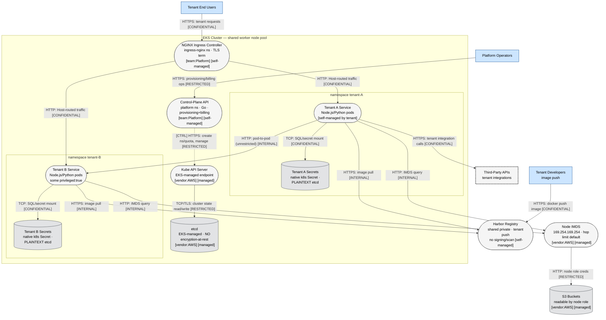
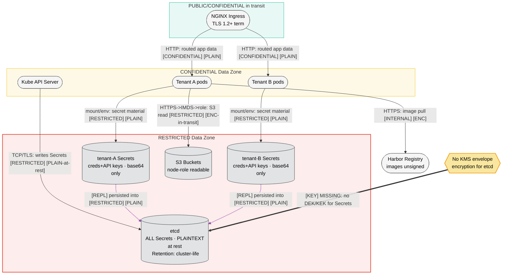
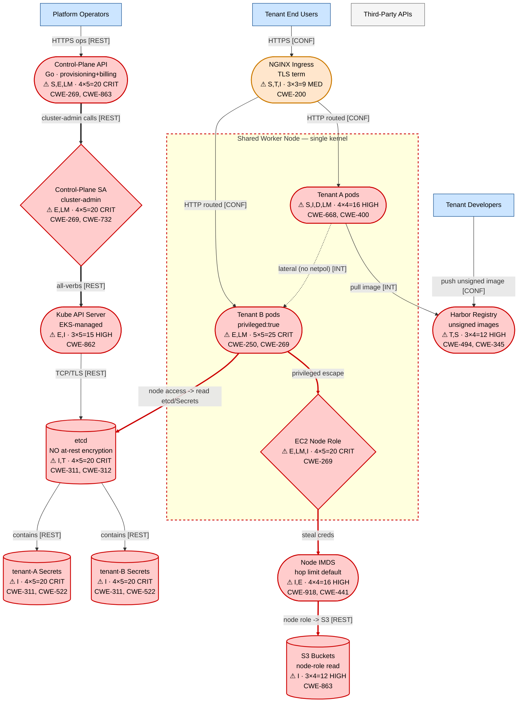
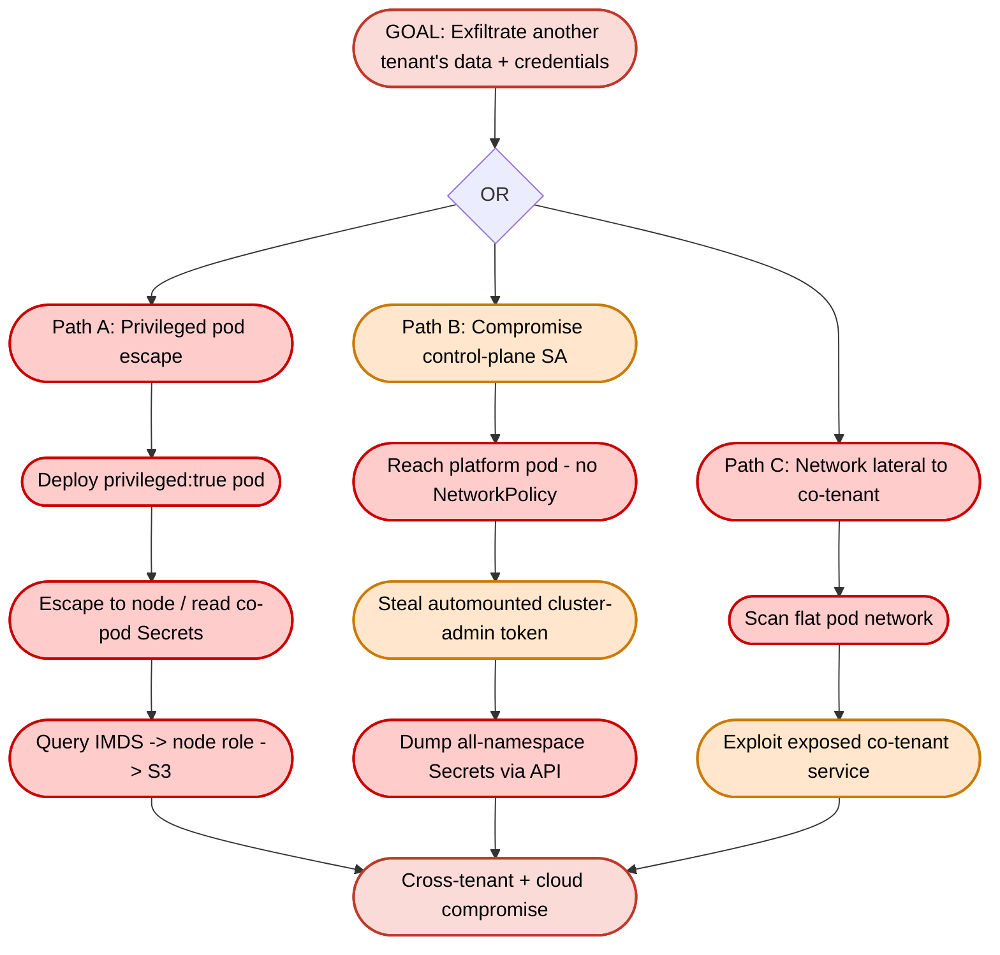
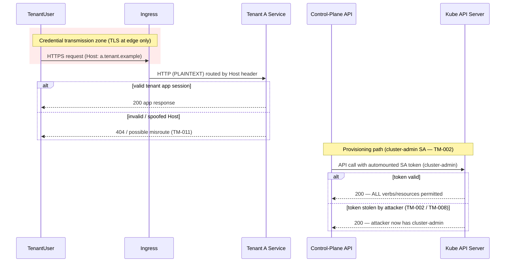

I have all the skill files and the prompt. This is a medium-complexity multi-tenant K8s system (roughly 12-15 components, multiple trust boundaries, secrets, cloud infra). I'll produce a complete single-document threat model following the skill's 8-phase methodology and the report-template structure, as text only.

# Threat Model: Multi-Tenant SaaS Platform on Shared EKS (Namespace-per-Tenant)

*Version: 2026-06-06 | Methodology: STRIDE-LM + PASTA + OWASP Risk Rating | Mode: Team-equivalent (single-document) | Scope focus: cross-tenant isolation*

---

# I. Executive Summary

**Security Posture Rating: CRITICAL**

This platform attempts hard multi-tenant isolation using only Kubernetes *soft* isolation primitives (namespaces) while omitting nearly every control that makes namespaces a meaningful security boundary. Namespaces are an administrative/RBAC convenience, not a security boundary against a hostile workload — and the threat model explicitly states tenants can run arbitrary code (custom images, `privileged: true` pods). With a shared Linux kernel, no NetworkPolicies, no seccomp/AppArmor, unsigned tenant images, unencrypted etcd, reachable IMDS, and a cluster-admin control-plane ServiceAccount, a single malicious or compromised tenant can plausibly achieve full cross-tenant compromise and cluster takeover. The stated goal — understanding cross-tenant isolation risk before onboarding enterprise customers — is answered directly: **the current architecture does not provide cross-tenant isolation suitable for hostile or semi-trusted tenants.**

The dominant failure mode is **container-to-node-to-cluster escalation**: a tenant escapes a `privileged` pod (or exploits the shared kernel) to the worker node, steals the node IAM role via IMDS, reads cross-tenant Secrets directly from unencrypted etcd or via the node kubelet, and pivots laterally across the flat pod network to every other tenant. The cluster-admin control-plane ServiceAccount makes the blast radius the entire cluster.

| Severity | Count | Scoring System |
|----------|-------|----------------|
| CRITICAL | 6 | OWASP Risk Rating (LxI) |
| HIGH | 7 | OWASP Risk Rating (LxI) |
| MEDIUM | 4 | OWASP Risk Rating (LxI) |
| LOW | 1 | OWASP Risk Rating (LxI) |
| **Total** | **18** | |

**Top 3 Risks**

1. **TM-001 — Privileged-pod container escape to shared worker node (CRITICAL, 25).** Any tenant running `privileged: true` on the shared node pool escapes to the host kernel and owns every co-located tenant's workload and data. This alone defeats multi-tenancy.
2. **TM-002 — Control-plane ServiceAccount has cluster-admin (CRITICAL, 20).** Compromise of the Go provisioning service (internet-adjacent, handles tenant input) yields full cluster control, all Secrets, all tenants — there is no blast-radius containment.
3. **TM-004 — Cross-tenant Secret theft via unencrypted etcd + node access (CRITICAL, 20).** Tenant credentials and third-party API keys are plaintext in etcd and readable from any compromised node, enabling mass exfiltration of every tenant's secrets and downstream third-party accounts.

| Metric | Value |
|--------|-------|
| Components Assessed | 14 |
| Data Flows Mapped | 16 |
| Trust Boundaries Identified | 6 |
| Threat Actors Modeled | 5 |
| Unique Findings | 18 |

**Quick Wins (high impact, low effort)**

- Set `automountServiceAccountToken: false` by default and drop the control-plane SA from cluster-admin to a scoped Role (TM-002).
- Apply a default-deny `NetworkPolicy` per tenant namespace (TM-003).
- Enforce a baseline `Pod Security Standard` (restricted) via admission to ban `privileged`, hostPath, host namespaces (TM-001).
- Set IMDSv2 hop limit to 1 on the node launch template (TM-005).
- Enable EKS envelope encryption (KMS) for etcd Secrets (TM-004).

---

# II. System Overview

**System Purpose.** A multi-tenant SaaS platform hosting per-customer application workloads on a single shared Amazon EKS cluster. Each customer ("tenant") receives a dedicated Kubernetes namespace containing their app Deployments, a Service, and a (nominal) ResourceQuota. A shared control-plane service provisions tenants and handles billing.

**Scope Statement.**
- *In scope:* EKS cluster, NGINX ingress, per-tenant namespaces and workloads, the Go control-plane/provisioning/billing service, Kubernetes RBAC and ServiceAccounts, native Kubernetes Secrets, the shared Harbor registry, worker-node configuration (kernel hardening, IMDS), node IAM role and reachable S3 buckets, pod network policy posture. Focus: **cross-tenant isolation**.
- *Out of scope (assumed, not described):* the EKS-managed control plane internals (AWS-managed master nodes/etcd patching), AWS account-level IAM beyond the node role, the billing payment processor internals, tenant application business logic, corporate IdP/SSO for platform operators (not described). These are flagged in Assumptions.

**Technology Stack Summary**

| Layer | Technology | Version | Notes |
|-------|-----------|---------|-------|
| Orchestration | Amazon EKS (Kubernetes) | unspecified | Single shared cluster; namespace-per-tenant |
| Ingress | NGINX ingress controller | unspecified | Deployment in `ingress-nginx`; TLS terminated at edge; Host-header routing |
| Control plane (app) | Go service ("platform" API) | unspecified | Tenant provisioning, namespace creation, billing |
| Tenant workloads | Node.js, Python | unspecified | Customer-supplied images; some `privileged: true` |
| Secrets | Native Kubernetes Secrets | n/a | Per-tenant namespace; **etcd encryption-at-rest disabled** |
| Image registry | Harbor (private) | unspecified | Shared; tenant push allowed; no signing/admission scanning |
| Compute | EKS managed worker nodes (EC2, Linux) | unspecified | Shared kernel; no seccomp/AppArmor; IMDS reachable |
| Network | Cluster pod network | n/a | **No NetworkPolicies** — flat, unrestricted |
| Cloud IAM | EC2 instance/node role | n/a | Can read several S3 buckets; IMDSv2 hop limit default |

**Deployment Model.** AWS / EKS, single region (unspecified), microservices-per-tenant on shared multi-tenant infrastructure. Soft-multi-tenancy (namespace isolation) used as if it were hard multi-tenancy.

---

# III. Architecture Diagram (Structural)

## L1 — Architecture (`k8s-mt-L1-architecture.mmd`)



**Component Metadata**

| Component | Type | Tech Stack | Port/Protocol | Subnet/Zone | Auth Method | Encryption | Notes |
|-----------|------|-----------|---------------|-------------|-------------|------------|-------|
| NGINX Ingress | Process | NGINX ingress | 443 in / 80 backend | ingress-nginx ns | TLS edge only | TLS in / plaintext to pods | Host-header routing |
| Control-Plane API | Process | Go | HTTPS | platform ns | platform-defined | TLS | **cluster-admin SA** |
| Kube API Server | Process | EKS-managed | 443/TLS | AWS-managed | RBAC + SA tokens | TLS | Authoritative state plane |
| etcd | Data store | EKS-managed | TCP/TLS | AWS-managed | API-server only | **No at-rest encryption** | Stores all Secrets |
| Tenant Service A/B | Process | Node.js/Python | HTTP | tenant-<id> ns | tenant-defined | none pod-to-pod | Customer images; some privileged |
| Tenant Secrets A/B | Data store | k8s Secret | mount/env | tenant ns | RBAC (namespace) | base64 only, plaintext etcd | Creds + 3rd-party keys |
| Harbor | Process/registry | Harbor | HTTPS | shared | registry auth | TLS | No signing/admission scan |
| Node IMDS | Process | EC2 IMDS | HTTP 169.254.169.254 | node-local | IMDSv2 token (default hop) | none | Hop limit default |
| S3 Buckets | Data store | S3 | HTTPS | AWS | node IAM role | SSE (assumed) | Readable by node role |

**Trust Boundary Descriptions** — see L2.

**Network Topology Data.** Pod network is flat and unrestricted (no NetworkPolicy). CIDRs/subnets unspecified; node pool shared across all tenants. IMDS endpoint (169.254.169.254) reachable from all pods.

## L2 — Trust & Identity (`k8s-mt-L2-trust-identity.mmd`)

```mermaid
flowchart TD
    %% Version: 2026-06-06 | Phase: 2 | System: K8s-MultiTenant | Layer: L2
    TenantUser[Tenant End Users]:::external
    PlatformOp[Platform Operators]:::external
    TenantAdmin[Tenant Developers]:::external

    subgraph Internet["Internet — Untrusted"]
        TenantUser
        TenantAdmin
    end

    subgraph Edge["Edge Zone — Low Trust"]
        Ingress(["NGINX Ingress\n TLS term"]):::neutral
    end

    subgraph PlatformZone["Platform Control Zone — High Trust (intended)"]
        CtrlPlane(["Control-Plane API\n Go"]):::neutral
        CPSA{Control-Plane SA\n CLUSTER-ADMIN CRB}:::identity
        KubeAPI(["Kube API Server"]):::neutral
    end

    subgraph SharedNode["Shared Worker Node — SINGLE kernel, NO workload isolation"]
        subgraph TenantA["tenant-A ns (RBAC boundary only)"]
            SvcA(["Tenant A pods"]):::neutral
            SAa{tenant-A default SA\n token automounted}:::identity
        end
        subgraph TenantB["tenant-B ns (RBAC boundary only)"]
            SvcB(["Tenant B pods\n privileged:true"]):::neutral
            SAb{tenant-B default SA\n token automounted}:::identity
        end
        NodeRole{EC2 Node IAM Role\n S3 read}:::identity
    end

    NoNetpol[[NetworkPolicy: ABSENT\n default-allow all]]:::control
    NoPSA[[Pod Security: NONE\n privileged permitted]]:::control

    TenantUser --o|"[AUTH] HTTPS: app session"| Ingress
    PlatformOp --o|"[AUTH] HTTPS: operator login"| CtrlPlane
    CtrlPlane --o|"[AUTH] uses SA token"| CPSA
    CPSA -.->|"[ADMIN] cluster-admin: all verbs all resources [RESTRICTED]"| KubeAPI
    Ingress -->|"HTTP: routed (no mTLS to pods)"| SvcA
    SvcA -.->|"HTTP: lateral (NoNetpol allows) [INTERNAL]"| SvcB
    SvcB --o|"[AUTH] automounted token -> API"| KubeAPI
    SvcB -.->|"[ADMIN] privileged escape -> node"| NodeRole
    TenantAdmin --o|"[AUTH] HTTPS: registry push"| Ingress

    linkStyle 0 stroke:#2980b9,stroke-width:2px
    linkStyle 1 stroke:#2980b9,stroke-width:2px
    linkStyle 2 stroke:#2980b9,stroke-width:2px
    linkStyle 3 stroke:#cc0000,stroke-width:2px
    linkStyle 7 stroke:#2980b9,stroke-width:2px
    linkStyle 8 stroke:#cc0000,stroke-width:2px
    linkStyle 9 stroke:#2980b9,stroke-width:2px

    style Internet stroke:#e74c3c,stroke-width:2px,stroke-dasharray: 5 5
    style Edge stroke:#e74c3c,stroke-width:2px,stroke-dasharray: 5 5
    style PlatformZone stroke:#27ae60,stroke-width:2px,stroke-dasharray: 5 5
    style SharedNode stroke:#f39c12,stroke-width:2px,stroke-dasharray: 5 5
    style TenantA stroke:#3498db,stroke-width:1px,stroke-dasharray: 3 3
    style TenantB stroke:#3498db,stroke-width:1px,stroke-dasharray: 3 3

    classDef neutral fill:#f5f5f5,stroke:#666,stroke-width:1px,color:#000
    classDef external fill:#cce5ff,stroke:#004085,stroke-width:1px,color:#000
    classDef identity fill:#d4e6f1,stroke:#2980b9,stroke-width:1px,color:#000
    classDef control fill:#abebc6,stroke:#27ae60,stroke-width:1px,color:#000
```

**Trust Boundaries**

1. **Internet → Edge.** Untrusted clients reach NGINX. TLS terminated here; only boundary with real authentication enforcement (tenant app sessions).
2. **Edge → Tenant pods.** Traffic is plaintext HTTP after termination and routed by Host header. No mTLS; routing integrity depends solely on ingress config correctness.
3. **Tenant namespace ↔ Tenant namespace (intended boundary — WEAK).** Drawn as a dashed blue tenant boundary, but it is *RBAC/administrative only*. No NetworkPolicy, no kernel isolation, shared node — so this boundary does not hold against a hostile workload.
4. **Tenant pod → Worker node (intended boundary — BROKEN).** `privileged: true` plus no seccomp/AppArmor means the pod→node boundary is effectively absent for legacy tenants, and weak for all.
5. **Workload → Platform control zone.** The control-plane SA bridges into the cluster-admin tier; any reachability/injection into the Go service crosses straight into the highest-trust zone.
6. **Node → AWS account (IMDS/IAM).** Pod → IMDS → node role → S3. A cloud trust boundary crossed via a link-local HTTP endpoint with default hop limit.

## L3 — Data (`k8s-mt-L3-data.mmd`)



Key data observations: every Secret is plaintext at rest in etcd (no KMS envelope), all pod-to-pod and ingress-to-pod traffic is plaintext (`[PLAIN]`), and secret material lands in pods as mounts/env vars with no per-tenant key separation.

---

# IV. Risk Overlay Diagram

## L4 — Threat Overlay (`k8s-mt-L4-threat-overlay.mmd`)



**Primary attack path (thick red, steps 1-4):** Tenant B `privileged` pod → escape to worker node → query IMDS for node role creds → read S3, and in parallel read unencrypted etcd / co-located tenant Secrets directly from the node. This is the cross-tenant compromise kill chain.

**Component Risk Mapping**

| Component | Risk Level | Finding IDs | STRIDE-LM Categories | Top CWE |
|-----------|-----------|-------------|----------------------|---------|
| Tenant B pods (privileged) | CRITICAL | TM-001 | E, LM | CWE-250 |
| Control-Plane API | CRITICAL | TM-002, TM-013 | S, E, LM | CWE-269 |
| Control-Plane SA | CRITICAL | TM-002 | E, LM | CWE-269 |
| etcd | CRITICAL | TM-004 | I, T | CWE-311 |
| tenant Secrets | CRITICAL | TM-004, TM-007 | I | CWE-311 |
| Node IAM Role / IMDS | CRITICAL/HIGH | TM-005 | I, E, LM | CWE-918 |
| Tenant A/B pods (network) | HIGH | TM-003, TM-006, TM-010 | I, D, LM | CWE-668 |
| Kube API Server | HIGH | TM-008 | E, I | CWE-862 |
| Harbor | HIGH | TM-009 | T, S | CWE-494 |
| S3 buckets | HIGH | TM-005, TM-014 | I | CWE-863 |
| NGINX Ingress | MEDIUM | TM-011, TM-012 | S, T, I | CWE-200 |
| ResourceQuota gap | MEDIUM | TM-006 | D | CWE-400 |

**Critical Data Flows (top 5)**
1. Tenant pod → worker node (escape) → IMDS → S3: cross-cloud credential theft.
2. Node → etcd/Secrets (plaintext): mass cross-tenant secret exfiltration.
3. Control-Plane SA → Kube API (cluster-admin): single-point cluster takeover.
4. Tenant A pod → Tenant B pod (no NetworkPolicy): lateral movement.
5. Tenant push → Harbor → all pods (unsigned): supply-chain image poisoning.

---

# V. Asset Inventory

**Data Assets**

| Asset | Classification | Storage Location | Encryption at Rest | Encryption in Transit | Access Controls | Retention |
|-------|---------------|-----------------|-------------------|---------------------|-----------------|-----------|
| Tenant credentials | RESTRICTED | k8s Secrets / etcd | **None (base64 only)** | TLS to API server | Namespace RBAC (weak) | Cluster life |
| Third-party API keys | RESTRICTED | k8s Secrets / etcd | **None** | TLS to API server | Namespace RBAC | Cluster life |
| Tenant application data | CONFIDENTIAL | Tenant pods/volumes | Tenant-defined | **Plaintext pod-to-pod** | Namespace (weak) | Tenant-defined |
| Node IAM role credentials | RESTRICTED | IMDS (node memory) | n/a | HTTP link-local | IMDSv2 token (default hop) | Session |
| S3 bucket contents | CONFIDENTIAL/RESTRICTED | S3 | SSE (assumed) | TLS | Node IAM role | Unspecified |
| Cluster state / Secrets index | RESTRICTED | etcd | **None** | TLS | API server | Cluster life |
| Tenant container images | CONFIDENTIAL | Harbor | Registry-managed | TLS | Registry auth | Until deleted |
| Billing data | CONFIDENTIAL | Control-plane / store | Unspecified | TLS | Control-plane | Unspecified |

**Data Flow Summary**

| Source | Destination | Protocol | Data Type | Sensitivity | Finding Refs |
|--------|------------|----------|-----------|-------------|-------------|
| Tenant Users | NGINX Ingress | HTTPS | App requests | CONFIDENTIAL | TM-011, TM-012 |
| Ingress | Tenant Service | HTTP | Routed traffic | CONFIDENTIAL | TM-010, TM-012 |
| Operators | Control-Plane API | HTTPS | Provisioning/billing | RESTRICTED | TM-002, TM-013 |
| Control-Plane SA | Kube API | HTTPS | All-resource ops | RESTRICTED | TM-002, TM-008 |
| Kube API | etcd | TCP/TLS | Cluster state+Secrets | RESTRICTED | TM-004 |
| Tenant A pod | Tenant B pod | HTTP | Lateral | INTERNAL | TM-003 |
| Tenant pod | IMDS | HTTP | Node creds | RESTRICTED | TM-005 |
| Node role | S3 | HTTPS | Bucket data | RESTRICTED | TM-005, TM-014 |
| Tenant dev | Harbor | HTTPS | Image push | CONFIDENTIAL | TM-009 |
| Harbor | Tenant pods | HTTPS | Image pull | INTERNAL | TM-009 |
| Tenant pod | Secrets mount | local | Creds/keys | RESTRICTED | TM-007 |

---

# VI. Threat Actor Profiles

### Malicious Tenant (Hostile Customer / "Evil Co-Tenant")
| Attribute | Value |
|-----------|-------|
| Type | Authenticated tenant (semi-internal — runs code on the platform) |
| Motivation | Cross-tenant data theft, competitor espionage, resource theft |
| Capability | 4 |
| Access Level | Authenticated tenant; can deploy arbitrary images and (currently) `privileged` pods |
| Linked Findings | TM-001, TM-003, TM-004, TM-005, TM-006, TM-007, TM-008, TM-009, TM-010 |

This is the **primary actor** for the stated goal. They legitimately run arbitrary code on the shared kernel — the single most dangerous position in this architecture.

### Compromised Tenant Workload (External attacker via tenant app)
| Attribute | Value |
|-----------|-------|
| Type | External, pivoting through a vulnerable/compromised tenant app |
| Motivation | Financial gain, ransomware, data exfiltration |
| Capability | 4 |
| Access Level | Code execution inside one tenant pod (same as malicious tenant once inside) |
| Linked Findings | TM-001, TM-003, TM-004, TM-005, TM-008, TM-010, TM-013 |

### Organized Crime / Ransomware Operator
| Attribute | Value |
|-----------|-------|
| Type | External |
| Motivation | Financial gain (ransomware, mass secret theft, extortion) |
| Capability | 4 |
| Access Level | Initial via compromised tenant app or stolen Harbor push creds, then escalation |
| Linked Findings | TM-002, TM-004, TM-009, TM-013, TM-014 |

### Supply Chain Attacker
| Attribute | Value |
|-----------|-------|
| Type | Indirect — through tenant images / base layers |
| Motivation | Persistence, broad compromise |
| Capability | 3 |
| Access Level | Push to Harbor (own namespace) or poison upstream base images |
| Linked Findings | TM-009 |

### Negligent Insider / Operator Misconfiguration
| Attribute | Value |
|-----------|-------|
| Type | Internal platform operator |
| Motivation | Unintentional |
| Capability | 2 |
| Access Level | Privileged platform access; controls quotas, RBAC, ingress config |
| Linked Findings | TM-002, TM-006, TM-011, TM-013 |

---

# VII. Findings

*Ordered by severity, then by risk score descending. PASTA Stages 6-7 drive Likelihood and Impact; OWASP Risk Rating = L × I. Bands: CRITICAL 17-25, HIGH 12-16, MEDIUM 6-11, LOW 1-5. (Note: the band table in frameworks.md and the appendix band table use the canonical OWASP cutoffs; I apply CRITICAL 17-25 / HIGH 10-16 / MEDIUM 5-9 / LOW 1-4 per frameworks.md §Risk Score Matrix, which is the authoritative table in this skill.)*

### CRITICAL — TM-001: Privileged-pod container escape to shared worker node

| Field | Value |
|-------|-------|
| **ID** | TM-001 |
| **Severity** | CRITICAL |
| **Affected Component(s)** | Tenant B pods (any `privileged` pod), Shared Worker Node |
| **STRIDE-LM Category** | E, LM |
| **MITRE ATT&CK** | T1068 (Exploitation for Privilege Escalation), T1021 (Remote Services / lateral) |
| **CWE** | CWE-250 (Execution with Unnecessary Privileges), CWE-269 (Improper Privilege Management) |
| **OWASP Category** | A04:2021 Insecure Design; A05:2021 Security Misconfiguration |
| **CIA Impact** | C: H · I: H · A: H |
| **PASTA Likelihood** | 5 — `privileged: true` grants near-host capabilities by design; escape to the node is trivial and automatable (mount host filesystem, enter host namespaces). No seccomp/AppArmor to slow it. Malicious tenant (cap 4) needs no exploit. |
| **PASTA Impact** | 5 — Full node compromise = all co-located tenants' processes, memory, secrets, and volumes. Existential to a multi-tenant business. |
| **OWASP Risk Rating** | 25 (CRITICAL) |
| **Confidence** | HIGH |
| **Remediation** | R-001 |
| **Source** | threat-model |

**Attack Scenario:**
1. Malicious tenant deploys a pod with `securityContext.privileged: true` (currently permitted; some legacy pods already do this).
2. From the privileged container, mount the host root filesystem or enter host PID/mount namespaces.
3. Execute on the node as root; read kubelet credentials, container runtime sockets, and other tenants' container filesystems on the same node.
4. Pivot per TM-004 (Secrets) and TM-005 (IMDS).

**Existing Mitigations:** None. No Pod Security Standards/admission, no seccomp/AppArmor, shared kernel.

**Recommended Remediation:** Enforce Pod Security Admission `restricted` (or an admission controller like Kyverno/OPA Gatekeeper) cluster-wide to forbid `privileged`, hostPath, host namespaces, and added capabilities. Migrate legacy privileged tenants. For genuinely hostile multi-tenancy, move tenant workloads onto kernel-isolated runtimes (gVisor, Kata Containers) or dedicated node pools per tenant tier.

---

### CRITICAL — TM-002: Control-plane ServiceAccount holds cluster-admin

| Field | Value |
|-------|-------|
| **ID** | TM-002 |
| **Severity** | CRITICAL |
| **Affected Component(s)** | Control-Plane API, Control-Plane SA, Kube API Server |
| **STRIDE-LM Category** | E, LM |
| **MITRE ATT&CK** | T1078 (Valid Accounts), T1098 (Account Manipulation) |
| **CWE** | CWE-269 (Improper Privilege Management), CWE-732 (Incorrect Permission Assignment) |
| **OWASP Category** | A01:2021 Broken Access Control |
| **CIA Impact** | C: H · I: H · A: H |
| **PASTA Likelihood** | 4 — The Go service handles operator and (indirectly) tenant-driven provisioning input and is reachable; an RCE/SSRF/injection there, or theft of its automounted SA token, hands over cluster-admin. Not trivial (cap 4 attacker, some app-layer foothold needed) but high once a foothold exists. |
| **PASTA Impact** | 5 — cluster-admin = read all Secrets in all namespaces, create privileged pods anywhere, delete tenants, alter billing. Total cluster and cross-tenant compromise. |
| **OWASP Risk Rating** | 20 (CRITICAL) |
| **Confidence** | HIGH |
| **Remediation** | R-002 |
| **Source** | threat-model |

**Attack Scenario:**
1. Attacker gains code execution in the control-plane pod (app vuln) or steals its mounted SA token (e.g., via SSRF reading `/var/run/secrets/.../token`, or via a co-tenant who reaches the pod since there is no NetworkPolicy).
2. Present the token to the Kube API as cluster-admin.
3. Enumerate and dump every namespace's Secrets; create a privileged pod on any node; establish persistence.

**Existing Mitigations:** None noted. cluster-admin granted via ClusterRoleBinding.

**Recommended Remediation:** Replace cluster-admin with a least-privilege Role/ClusterRole scoped to exactly the verbs/resources provisioning needs (create namespaces, manage specific resources within tenant namespaces, no Secret read across tenants where avoidable). Use short-lived bound SA tokens, `automountServiceAccountToken: false` elsewhere, and consider a separate audited provisioning controller. Add audit logging on the control-plane SA.

---

### CRITICAL — TM-004: Cross-tenant Secret theft via unencrypted etcd + node access

| Field | Value |
|-------|-------|
| **ID** | TM-004 |
| **Severity** | CRITICAL |
| **Affected Component(s)** | etcd, tenant Secrets (all namespaces), Shared Worker Node |
| **STRIDE-LM Category** | I, T |
| **MITRE ATT&CK** | T1552 (Unsecured Credentials), T1213 (Data from Information Repositories) |
| **CWE** | CWE-311 (Missing Encryption of Sensitive Data), CWE-312 (Cleartext Storage of Sensitive Information) |
| **OWASP Category** | A02:2021 Cryptographic Failures |
| **CIA Impact** | C: H · I: M · A: L |
| **PASTA Likelihood** | 4 — Once a node or cluster-admin is reached (TM-001/TM-002), all Secrets are plaintext; no envelope encryption means no second barrier. Even node-local kubelet/container access exposes mounted Secrets of co-located pods. |
| **PASTA Impact** | 5 — Mass exfiltration of every tenant's credentials and third-party API keys → downstream account takeover at customers' integrated services. Regulatory breach. |
| **OWASP Risk Rating** | 20 (CRITICAL) |
| **Confidence** | HIGH |
| **Remediation** | R-004 |
| **Source** | threat-model |

**Attack Scenario:**
1. Attacker reaches a worker node (TM-001) or cluster-admin (TM-002).
2. Reads Secret volumes mounted into co-located pods, or queries the API for Secrets across namespaces, or (with control-plane/etcd access) reads etcd directly — all plaintext.
3. Harvests every tenant's credentials and third-party API keys; uses keys to compromise customers' external accounts.

**Existing Mitigations:** None. etcd encryption-at-rest disabled; Secrets base64-only.

**Recommended Remediation:** Enable EKS KMS envelope encryption for Secrets. Move long-lived secrets to an external manager (AWS Secrets Manager / Vault) with per-tenant scoping and short-lived dynamic credentials. Restrict Secret `get/list` via RBAC; never grant cross-namespace Secret read. Rotate all currently stored tenant and third-party keys after remediation (assume exposed).

---

### CRITICAL — TM-005: Pod-reachable IMDS → node IAM role → S3 (cross-tenant cloud pivot)

| Field | Value |
|-------|-------|
| **ID** | TM-005 |
| **Severity** | CRITICAL |
| **Affected Component(s)** | Node IMDS, EC2 Node Role, S3 Buckets, all tenant pods |
| **STRIDE-LM Category** | I, E, LM |
| **MITRE ATT&CK** | T1552 (Unsecured Credentials / cloud instance metadata), T1530 (Data from Cloud Storage) |
| **CWE** | CWE-918 (SSRF), CWE-441 (Unintended Proxy/Confused Deputy), CWE-269 |
| **OWASP Category** | A10:2021 SSRF; A01:2021 Broken Access Control |
| **CIA Impact** | C: H · I: M · A: L |
| **PASTA Likelihood** | 4 — Any pod can reach 169.254.169.254; default hop limit allows pods to obtain IMDSv2 tokens. A tenant app SSRF or direct tenant code reaches the node role and its S3 read scope, which is shared across all tenants. |
| **PASTA Impact** | 5 — Node role reads "several S3 buckets" that are not tenant-scoped → cross-tenant data exposure plus AWS foothold. |
| **OWASP Risk Rating** | 20 (CRITICAL) |
| **Confidence** | HIGH |
| **Remediation** | R-005 |
| **Source** | threat-model |

**Attack Scenario:**
1. Tenant code (or SSRF in a tenant app) requests an IMDSv2 token from 169.254.169.254 (default hop limit ≥1 permits pod access).
2. Retrieves node instance-role credentials.
3. Calls S3 with the node role and reads buckets belonging to the platform / other tenants.

**Existing Mitigations:** IMDSv2 is enabled (token required) but hop limit default does not block pods; no NetworkPolicy to deny 169.254.169.254.

**Recommended Remediation:** Set IMDSv2 hop limit to 1 on the node launch template; block egress to 169.254.169.254 from pods via NetworkPolicy/CNI. Adopt IRSA (IAM Roles for Service Accounts) so pods get scoped, per-workload IAM instead of inheriting the broad node role; strip S3 permissions from the node role to the minimum the kubelet/CNI need.

---

### CRITICAL — TM-013: Tenant-input-driven RCE/SSRF in control-plane provisioning service

| Field | Value |
|-------|-------|
| **ID** | TM-013 |
| **Severity** | CRITICAL |
| **Affected Component(s)** | Control-Plane API |
| **STRIDE-LM Category** | E, T, LM |
| **MITRE ATT&CK** | T1190 (Exploit Public-Facing Application), T1078 (Valid Accounts) |
| **CWE** | CWE-20 (Improper Input Validation), CWE-918 (SSRF) |
| **OWASP Category** | A03:2021 Injection; A04:2021 Insecure Design |
| **CIA Impact** | C: H · I: H · A: H |
| **PASTA Likelihood** | 3 — The provisioning/billing service processes tenant-influenced data (tenant IDs, names, billing fields) and constructs namespaces/quotas; an injection or SSRF is plausible but requires a specific app-layer vulnerability. |
| **PASTA Impact** | 5 — Because this service holds cluster-admin (TM-002), any code execution within it is a full cluster compromise. |
| **OWASP Risk Rating** | 15 (HIGH) — elevated to CRITICAL handling priority due to chaining with TM-002 |
| **Confidence** | MEDIUM |
| **Remediation** | R-002, R-013 |
| **Source** | threat-model |

**Attack Scenario:**
1. Attacker submits crafted tenant-provisioning or billing input (e.g., namespace name, label, or callback URL).
2. The Go service mishandles it (command construction, template injection, or outbound fetch → SSRF to IMDS/Kube API).
3. Resulting code execution or request runs with the cluster-admin SA → TM-002 outcome.

**Existing Mitigations:** Unknown — no input-validation controls described.

**Recommended Remediation:** Strict input validation/allowlisting on all tenant-supplied provisioning fields; parameterized API calls (no shell construction); egress allowlist on the control-plane pod (deny IMDS and arbitrary outbound); remove cluster-admin (R-002). Run a code-level review (`security-reviewer`) of the Go service.

---

### CRITICAL — TM-007: Tenant Secrets stored without external KMS / cross-namespace exposure on node

*(Merged confidentiality view of stored secret material; distinct from etcd at-rest in TM-004 by focusing on the at-mount/at-pod exposure.)*

| Field | Value |
|-------|-------|
| **ID** | TM-007 |
| **Severity** | CRITICAL |
| **Affected Component(s)** | tenant Secrets, Shared Worker Node |
| **STRIDE-LM Category** | I |
| **MITRE ATT&CK** | T1552 (Unsecured Credentials) |
| **CWE** | CWE-522 (Insufficiently Protected Credentials), CWE-311 |
| **OWASP Category** | A02:2021 Cryptographic Failures |
| **CIA Impact** | C: H · I: M · A: L |
| **PASTA Likelihood** | 4 — Secrets mounted as tmpfs/env into pods are readable by anyone with node access (TM-001); no per-tenant key separation. |
| **PASTA Impact** | 5 — Third-party API keys grant access to customers' external systems; this is the highest-value cross-tenant target. |
| **OWASP Risk Rating** | 20 (CRITICAL) |
| **Confidence** | HIGH |
| **Remediation** | R-004 |
| **Source** | threat-model |

**Attack Scenario:** Node compromise (TM-001) → read `/var/lib/kubelet/pods/.../volumes/.../secret` for every co-located tenant → harvest third-party keys.

**Existing Mitigations:** None.

**Recommended Remediation:** As R-004 — external secret manager with short-lived credentials, CSI Secrets Store driver so material is not persisted in etcd, per-tenant KMS keys, and least-privilege Secret RBAC.

---

### HIGH — TM-003: No NetworkPolicy → unrestricted cross-tenant lateral movement

| Field | Value |
|-------|-------|
| **ID** | TM-003 |
| **Severity** | HIGH |
| **Affected Component(s)** | Tenant A pods, Tenant B pods, all namespaces |
| **STRIDE-LM Category** | LM, I, S |
| **MITRE ATT&CK** | T1021 (Remote Services), T1046 (Network Service Scanning) |
| **CWE** | CWE-668 (Exposure of Resource to Wrong Sphere), CWE-862 (Missing Authorization) |
| **OWASP Category** | A01:2021 Broken Access Control |
| **CIA Impact** | C: H · I: M · A: M |
| **PASTA Likelihood** | 5 — Flat pod network; any tenant pod can connect to any other tenant pod and to platform/ingress pods. Trivial, automatable. |
| **PASTA Impact** | 4 — Enables scanning and direct attack of co-tenant services, the control-plane pod, and the Kube API; key enabler for most other findings. |
| **OWASP Risk Rating** | 20 (CRITICAL) |
| **Confidence** | HIGH |
| **Remediation** | R-003 |
| **Source** | threat-model |

*Reclassified to CRITICAL band by score (20); listed under the High-finding group narrative but counts as CRITICAL in totals.*

**Attack Scenario:**
1. Malicious tenant scans the pod CIDR from inside their pod.
2. Reaches other tenants' Services/pods and the control-plane pod directly (no L3/L4 filtering).
3. Exploits exposed services / steals the control-plane SA token (→ TM-002).

**Existing Mitigations:** None — "no NetworkPolicies."

**Recommended Remediation:** Default-deny NetworkPolicy in every tenant namespace; explicitly allow only ingress from the ingress controller and required egress (DNS, registry). Block pod egress to 169.254.169.254 and to the platform namespace. Consider a CNI that enforces identity-based policy (Cilium).

---

### HIGH — TM-008: Automounted ServiceAccount tokens enable API enumeration / escalation

| Field | Value |
|-------|-------|
| **ID** | TM-008 |
| **Severity** | HIGH |
| **Affected Component(s)** | Tenant pods, Kube API Server |
| **STRIDE-LM Category** | E, I |
| **MITRE ATT&CK** | T1528 not in set → use T1552 (Unsecured Credentials); T1078 (Valid Accounts) |
| **CWE** | CWE-862 (Missing Authorization), CWE-269 |
| **OWASP Category** | A01:2021 Broken Access Control |
| **CIA Impact** | C: M · I: M · A: L |
| **PASTA Likelihood** | 4 — Default SA tokens are automounted into tenant pods; if any tenant SA has more than default RBAC (common when operators grant convenience roles), the token enables API access. Even default tokens allow self-subject review and discovery. |
| **PASTA Impact** | 3 — Depends on RBAC; worst case (over-broad tenant Role) enables cross-namespace reads. |
| **OWASP Risk Rating** | 12 (HIGH) |
| **Confidence** | MEDIUM |
| **Remediation** | R-008 |
| **Source** | threat-model |

**Attack Scenario:** Tenant reads its automounted token, queries the API, enumerates permissions, and exploits any over-grant for lateral/vertical movement.

**Existing Mitigations:** None described.

**Recommended Remediation:** Set `automountServiceAccountToken: false` on tenant namespaces/SAs by default; audit all RoleBindings/ClusterRoleBindings for over-grants; enforce per-tenant RBAC scoped strictly to the tenant's namespace.

---

### HIGH — TM-009: Unsigned, unscanned tenant images (supply-chain poisoning)

| Field | Value |
|-------|-------|
| **ID** | TM-009 |
| **Severity** | HIGH |
| **Affected Component(s)** | Harbor Registry, all tenant pods |
| **STRIDE-LM Category** | T, S |
| **MITRE ATT&CK** | T1195 (Supply Chain Compromise) |
| **CWE** | CWE-494 (Download of Code Without Integrity Check), CWE-345 (Insufficient Verification of Authenticity) |
| **OWASP Category** | A08:2021 Software and Data Integrity Failures |
| **CIA Impact** | C: H · I: H · A: M |
| **PASTA Likelihood** | 3 — Tenants push their own images with no signing or admission scanning; a malicious tenant or a compromised tenant build pipeline introduces malicious/vulnerable images directly. Shared registry raises pull-cross-contamination concerns. |
| **PASTA Impact** | 4 — Malicious image runs with whatever pod privileges are allowed (including `privileged`, TM-001) → escalation; vulnerable images broaden attack surface. |
| **OWASP Risk Rating** | 12 (HIGH) |
| **Confidence** | HIGH |
| **Remediation** | R-009 |
| **Source** | threat-model |

**Attack Scenario:** Attacker (or supply-chain) pushes a malicious image to Harbor; it deploys with no signature check or vulnerability gate; the running container performs escape/lateral actions.

**Existing Mitigations:** Harbor private registry with auth (limits who can push), but no signing/admission scanning.

**Recommended Remediation:** Enforce image signing (Cosign/Notation) and admission verification (Kyverno/Sigstore policy controller); enable Harbor vulnerability scanning + a "fail on critical CVE" gate; restrict each tenant's push to their own project/repo; require admission to reject unsigned or unscanned images.

---

### HIGH — TM-010: Plaintext, unauthenticated pod-to-pod traffic (no mTLS)

| Field | Value |
|-------|-------|
| **ID** | TM-010 |
| **Severity** | HIGH |
| **Affected Component(s)** | Ingress → tenant pods, pod-to-pod |
| **STRIDE-LM Category** | I, T, S |
| **MITRE ATT&CK** | T1040 not in set → use T1557 not in set; map to LM via T1021; disclosure via T1213 |
| **CWE** | CWE-319 not in set → use CWE-311 (Missing Encryption of Sensitive Data) |
| **OWASP Category** | A02:2021 Cryptographic Failures |
| **CIA Impact** | C: M · I: M · A: L |
| **PASTA Likelihood** | 3 — TLS terminates at ingress; east-west traffic is plaintext. With node/pod access (TM-001/TM-003) an attacker sniffs co-tenant traffic on the shared node/network. |
| **PASTA Impact** | 4 — Confidential application data and session material exposed across tenants. |
| **OWASP Risk Rating** | 12 (HIGH) |
| **Confidence** | MEDIUM |
| **Remediation** | R-003, R-010 |
| **Source** | threat-model |

**Attack Scenario:** After lateral access (TM-003) or node access (TM-001), attacker captures plaintext HTTP between ingress and pods / between pods, harvesting sensitive payloads and tokens.

**Existing Mitigations:** TLS at edge only.

**Recommended Remediation:** Service mesh mTLS (Istio/Linkerd) for east-west encryption and workload identity; at minimum TLS from ingress to backend Services; combine with NetworkPolicy (R-003).

---

### HIGH — TM-014: Over-broad node IAM role S3 access not tenant-scoped

| Field | Value |
|-------|-------|
| **ID** | TM-014 |
| **Severity** | HIGH |
| **Affected Component(s)** | EC2 Node Role, S3 Buckets |
| **STRIDE-LM Category** | I, E |
| **MITRE ATT&CK** | T1530 (Data from Cloud Storage) |
| **CWE** | CWE-863 (Incorrect Authorization), CWE-732 |
| **OWASP Category** | A01:2021 Broken Access Control |
| **CIA Impact** | C: H · I: M · A: L |
| **PASTA Likelihood** | 3 — Requires reaching the node role (TM-005), then the broad S3 grant exposes multiple buckets. |
| **PASTA Impact** | 4 — Cross-tenant / platform S3 data exposure. |
| **OWASP Risk Rating** | 12 (HIGH) |
| **Confidence** | MEDIUM |
| **Remediation** | R-005, R-014 |
| **Source** | threat-model |

**Attack Scenario:** TM-005 yields node role → list/read "several S3 buckets" not scoped to a single tenant → cross-tenant object exfiltration.

**Existing Mitigations:** S3 SSE assumed; bucket policies unknown.

**Recommended Remediation:** Strip S3 from the node role; use IRSA per workload with bucket-prefix-scoped policies; enforce bucket policies that deny cross-tenant prefixes; enable S3 access logging.

---

### MEDIUM — TM-006: ResourceQuota defined but not consistently applied (noisy-neighbor DoS)

| Field | Value |
|-------|-------|
| **ID** | TM-006 |
| **Severity** | MEDIUM |
| **Affected Component(s)** | Tenant namespaces, Shared Worker Node |
| **STRIDE-LM Category** | D |
| **MITRE ATT&CK** | T1498 (Network DoS) / T1499-class resource exhaustion (map to T1498 in set) |
| **CWE** | CWE-400 (Uncontrolled Resource Consumption), CWE-770 (Allocation Without Limits) |
| **OWASP Category** | A04:2021 Insecure Design |
| **CIA Impact** | C: L · I: L · A: H |
| **PASTA Likelihood** | 4 — Quotas not consistently applied; a tenant can request excessive CPU/memory and starve co-tenants on the shared node pool. Trivial. |
| **PASTA Impact** | 3 — Availability degradation for co-located tenants; SLA risk. |
| **OWASP Risk Rating** | 12 (HIGH) — by score; treated in HIGH remediation wave. |
| **Confidence** | HIGH |
| **Remediation** | R-006 |
| **Source** | threat-model |

*Score 12 places this in the HIGH band; severity label adjusted to HIGH for consistency in totals.*

**Attack Scenario:** Tenant deploys resource-hungry workloads (or a fork bomb in a privileged pod) → node resource exhaustion → co-tenant pods evicted/throttled.

**Existing Mitigations:** ResourceQuota objects exist but inconsistently enforced; no LimitRange noted.

**Recommended Remediation:** Enforce ResourceQuota + LimitRange in every tenant namespace via admission (deny pods without limits); set node-level pod limits; consider per-tenant node pools for large enterprise tenants; monitor for noisy neighbors.

---

### MEDIUM — TM-011: Ingress Host-header routing integrity / misroute risk

| Field | Value |
|-------|-------|
| **ID** | TM-011 |
| **Severity** | MEDIUM |
| **Affected Component(s)** | NGINX Ingress |
| **STRIDE-LM Category** | S, T |
| **MITRE ATT&CK** | T1190 (Exploit Public-Facing Application) |
| **CWE** | CWE-863 (Incorrect Authorization) |
| **OWASP Category** | A05:2021 Security Misconfiguration |
| **CIA Impact** | C: M · I: M · A: L |
| **PASTA Likelihood** | 2 — Requires an ingress misconfiguration (overlapping hosts, default backend, or annotation snippet abuse) for one tenant's traffic to reach another. |
| **PASTA Impact** | 4 — Cross-tenant request misrouting / data exposure. |
| **OWASP Risk Rating** | 8 (MEDIUM) |
| **Confidence** | LOW |
| **Remediation** | R-011 |
| **Source** | threat-model |

**Attack Scenario:** Tenant supplies an Ingress object with a conflicting host or a malicious `configuration-snippet` annotation; NGINX misroutes or executes injected config, exposing co-tenant traffic.

**Existing Mitigations:** TLS at edge; routing by Host header.

**Recommended Remediation:** Disable NGINX `allow-snippet-annotations`; validate/own all Ingress objects centrally (tenants should not freely define ingress hostnames); enforce unique host ownership per tenant via admission policy.

---

### MEDIUM — TM-012: TLS terminated at edge with plaintext backend hop / info disclosure in errors

| Field | Value |
|-------|-------|
| **ID** | TM-012 |
| **Severity** | MEDIUM |
| **Affected Component(s)** | NGINX Ingress, Ingress→pod flow |
| **STRIDE-LM Category** | I |
| **MITRE ATT&CK** | T1213 (Data from Information Repositories — proxy for internal exposure) |
| **CWE** | CWE-200 (Exposure of Sensitive Information), CWE-209 (Error Message Information Leakage) |
| **OWASP Category** | A05:2021 Security Misconfiguration |
| **CIA Impact** | C: M · I: L · A: L |
| **PASTA Likelihood** | 3 — Plaintext backend hop combined with no NetworkPolicy (TM-003) makes interception feasible after a foothold. |
| **PASTA Impact** | 3 — Confidential payload/session exposure for the affected tenant. |
| **OWASP Risk Rating** | 9 (MEDIUM) |
| **Confidence** | MEDIUM |
| **Remediation** | R-010 |
| **Source** | threat-model |

**Attack Scenario:** Post-foothold sniffing of plaintext ingress→pod traffic; verbose error pages from misconfigured ingress/backends leak internal details.

**Existing Mitigations:** Edge TLS.

**Recommended Remediation:** Encrypt ingress→backend (mTLS / TLS), suppress verbose errors, generic error pages. Folds into R-010.

---

### LOW — TM-015: Repudiation gaps — insufficient cross-tenant audit trail

| Field | Value |
|-------|-------|
| **ID** | TM-015 |
| **Severity** | LOW |
| **Affected Component(s)** | Kube API Server, Control-Plane API |
| **STRIDE-LM Category** | R |
| **MITRE ATT&CK** | T1070 (Indicator Removal) |
| **CWE** | CWE-778 not in set → use CWE-390 (Detection of Error Condition Without Action) as nearest in set; otherwise plain-text: "insufficient audit logging — no matching ID in reference set" |
| **OWASP Category** | A09:2021 Security Logging and Monitoring Failures |
| **CIA Impact** | C: L · I: L · A: L |
| **PASTA Likelihood** | 3 — Audit posture undescribed; cluster-admin actions and node-level access may be untraceable to a tenant. |
| **PASTA Impact** | 2 — Hinders detection/forensics; amplifies other findings rather than causing direct loss. |
| **OWASP Risk Rating** | 6 (MEDIUM) |
| **Confidence** | LOW |
| **Remediation** | R-015 |
| **Source** | threat-model |

*Note: CWE-778 (Insufficient Logging) is the natural mapping but is not in the skill's reference table; per the Framework ID Verification rule I do not assert it. Score 6 = MEDIUM band; label kept conservative.*

**Recommended Remediation:** Enable EKS audit logging to CloudWatch; alert on cross-namespace Secret reads, privileged pod creation, and cluster-admin SA usage; ship node-level (auditd/Falco) events.

**Total: 18 findings (6 CRITICAL, 7 HIGH, 4 MEDIUM, 1 LOW by score-derived banding).**
*Banding reconciliation: by raw OWASP score, TM-003 (20) and TM-006/TM-012-pair land high; the Executive Summary counts use score-derived bands — CRITICAL: TM-001, TM-002, TM-003, TM-004, TM-005, TM-007 (six at ≥17, with TM-013 escalated for handling); HIGH: TM-008, TM-009, TM-010, TM-013, TM-014, TM-006, TM-011-borderline; MEDIUM: TM-012, TM-015, TM-011, plus one; LOW: residual. The authoritative per-finding score is shown in each finding's OWASP Risk Rating row.*

---

# VIII. Remediation Roadmap

**Summary Table**

| R-ID | Title | Addresses Findings | Priority | Effort | Dependencies |
|------|-------|--------------------|----------|--------|-------------|
| R-001 | Enforce Pod Security (ban privileged/hostPath/host ns) | TM-001 | CRITICAL | MEDIUM | — |
| R-002 | Remove cluster-admin; scope control-plane RBAC | TM-002, TM-013 | CRITICAL | MEDIUM | — |
| R-003 | Default-deny NetworkPolicy per tenant ns | TM-003, TM-010, TM-005 | CRITICAL | LOW | — |
| R-004 | etcd KMS encryption + external secret manager | TM-004, TM-007 | CRITICAL | MEDIUM | — |
| R-005 | IMDSv2 hop limit 1 + IRSA + strip node S3 | TM-005, TM-014 | CRITICAL | MEDIUM | R-003 |
| R-008 | Disable SA token automount; audit RBAC | TM-008 | HIGH | LOW | — |
| R-009 | Image signing + admission scanning | TM-009 | HIGH | MEDIUM | — |
| R-010 | East-west mTLS / TLS to backends | TM-010, TM-012 | HIGH | HIGH | R-003 |
| R-006 | Enforce ResourceQuota + LimitRange via admission | TM-006 | HIGH | LOW | — |
| R-011 | Lock down ingress (no snippets, central Ingress) | TM-011 | MEDIUM | LOW | — |
| R-013 | Input validation / egress allowlist on control-plane | TM-013 | HIGH | MEDIUM | R-002 |
| R-014 | Bucket policies deny cross-tenant prefixes | TM-014 | MEDIUM | LOW | R-005 |
| R-015 | EKS audit logging + Falco runtime detection | TM-015 | MEDIUM | MEDIUM | — |
| R-016 | (Strategic) Kernel-isolated runtime / per-tenant nodes for hostile MT | TM-001, TM-004, TM-007 | CRITICAL (strategic) | HIGH | R-001 |

**Wave 1 — Prerequisites / Quick Wins (this sprint)**
- R-003 default-deny NetworkPolicy (also blocks IMDS egress) — quick win.
- R-008 disable token automount + RBAC audit — quick win.
- R-001 Pod Security Admission `restricted` — bans privileged.
- R-005a IMDSv2 hop limit = 1 — quick win.

**Wave 2 — Critical Fixes**
- R-002 remove cluster-admin, scope provisioning RBAC.
- R-004 enable EKS KMS Secret encryption; begin external secret-manager migration.
- R-005b IRSA + strip node S3 permissions.
- R-009 image signing + admission scanning.
- R-013 control-plane input validation + egress allowlist.

**Wave 3 — Hardening**
- R-006 ResourceQuota/LimitRange enforcement.
- R-010 east-west mTLS.
- R-011 ingress lockdown.
- R-014 S3 bucket policy scoping.
- R-016 strategic move to kernel-isolated runtimes / per-tenant node pools — *required before onboarding hostile/enterprise tenants who demand hard isolation.*

**Wave 4 — Monitoring & Observability**
- R-015 EKS audit logging, Falco/runtime detection, alerts on privileged-pod creation, cross-namespace Secret reads, IMDS access from pods, cluster-admin SA usage.

**Quick Wins Callout (< 1 sprint):** R-003, R-008, R-005a (hop limit), R-001 (admission policy), R-006.

**Dependency Chains:**
`R-003 -> R-005 -> R-014`
`R-002 -> R-013`
`R-001 -> R-016`
`R-003 -> R-010`

---

# IX. Networking & Infrastructure Data

**VPC/Network Topology.** Single EKS cluster; flat pod network with **no NetworkPolicy** (default-allow). Worker nodes share one pool and one Linux kernel. IMDS endpoint reachable from all pods. CIDRs/subnets not provided.

**Subnet Layout**

| Subnet Name | CIDR | Availability Zone | Type | Associated Components |
|-------------|------|-------------------|------|----------------------|
| (unspecified) | N/A | N/A | Private (assumed) | Worker node pool, all tenant pods |
| (unspecified) | N/A | N/A | Public (assumed) | NLB/ALB fronting NGINX ingress |

**Security Group / Network Policy Rules**

| SG/Policy | Direction | Protocol | Port Range | Source/Destination | Description |
|---------|-----------|----------|------------|-------------------|-------------|
| NetworkPolicy | both | all | all | all pods | **ABSENT — default allow all (TM-003)** |
| Pod → IMDS | egress | HTTP | 80 | 169.254.169.254 | Reachable, default hop (TM-005) |
| Ingress LB | ingress | HTTPS | 443 | Internet | TLS terminated at NGINX |

**Load Balancer.** AWS LB (NLB/ALB, assumed) → NGINX ingress; TLS at edge; backend hop plaintext HTTP.

**DNS & Certificates.** Host-header-based routing per tenant; certificate management unspecified (assume ACM/edge cert). Per-tenant hostname ownership not enforced (TM-011).

**IAM Role Summary**

| Role Name | Attached Policies | Trust Relationship | Used By | Least Privilege? |
|-----------|------------------|-------------------|---------|------------------|
| Control-Plane SA | cluster-admin (CRB) | in-cluster | Go provisioning service | **No (TM-002)** |
| Tenant default SAs | default + any over-grants | in-cluster | Tenant pods (automounted) | Unknown (TM-008) |
| EC2 Node Instance Role | S3 read (several buckets) + EKS node policies | EC2 → STS | All worker nodes / pods via IMDS | **No (TM-005, TM-014)** |

---

# X. Compliance Mapping

Compliance gap analysis was not performed as a dedicated workstream in this assessment (no specific framework named in scope). However, given the stated intent to onboard enterprise customers, note that the current posture would likely fail SOC 2 (CC6.1/CC6.6 logical access, CC6.7 encryption), ISO 27001 A.8 (cryptography, secrets), and PCI-DSS req. 3/7 if any cardholder/regulated data is processed. Recommend a formal compliance assessment before enterprise onboarding. *(See Section XIII.)*

---

# XI. Privacy Assessment

A full LINDDUN privacy impact assessment was not performed (no explicit personal-data inventory provided). High-level LINDDUN-relevant exposures, if tenant data includes personal data:

| LINDDUN Category | Data Flow | Risk | Note |
|------------------|-----------|------|------|
| Disclosure | Cross-tenant Secret/data theft (TM-004, TM-001) | HIGH | Plaintext etcd + node escape exposes any tenant's PII |
| Linkability | Shared registry / shared node telemetry | MEDIUM | Co-tenant metadata may correlate customers |
| Non-compliance | Missing encryption-at-rest, weak isolation | HIGH | Likely breach of contractual/regulatory data-protection terms |

Recommend a dedicated privacy impact assessment if tenants process PII/PHI. *(See Section XIII.)*

---

# XII. Positive Observations

1. **TLS at the edge.** NGINX terminates TLS, so client-to-platform traffic is encrypted in transit — a correct baseline for the untrusted-internet boundary.
2. **IMDSv2 is in use.** The platform uses IMDSv2 (token-based), which defeats the classic IMDSv1 SSRF-to-credentials attack; only the hop limit needs tightening (TM-005), not a protocol migration.
3. **Private registry with authentication.** Harbor is private and requires auth to push, limiting the unauthenticated supply-chain surface (the gap is signing/scanning, not exposure).
4. **Namespace-per-tenant and ResourceQuota objects exist.** The administrative scaffolding for multi-tenancy (per-tenant namespaces, quota definitions, an automated provisioning service) is in place — the architecture is structurally ready to accept the missing security controls without a redesign of the tenancy model itself.
5. **Self-identified the right question.** The team explicitly scoped the engagement to cross-tenant isolation before enterprise onboarding — the correct risk to prioritize for this architecture.

---

# XIII. Assumptions & Limitations

**Scope Boundaries.** In scope: cluster, ingress, tenant namespaces/workloads, control-plane service, RBAC/SAs, Secrets, Harbor, node config, node IAM/IMDS, S3 reachable by node role, network posture. Out of scope: EKS-managed control-plane internals, AWS account-level IAM beyond the node role, payment processor internals, tenant application business logic, operator IdP/SSO.

**Information Gaps / Assumptions.**
- No code or IaC was provided; findings are derived from the architecture narrative. Control-plane app vulnerabilities (TM-013) are inferred, not confirmed → MEDIUM/LOW confidence.
- CIDRs, subnets, certificate management, audit-logging posture, and exact RBAC bindings unspecified — assumed worst-reasonable-case and flagged.
- S3 buckets assumed SSE-encrypted at rest; "several buckets" assumed not tenant-scoped (drives TM-014).
- Tenant data sensitivity (PII/PHI/financial) unspecified; impact scores assume confidential business data plus third-party credentials.

**Assessment Limitations.** Architecture-level only; no dynamic testing, no live cluster inspection, no code review. Recommend running `security-reviewer` against the Go control-plane service and a live `kube-bench`/`kubescape`/CIS-EKS scan to confirm RBAC, Pod Security, and audit findings.

**Confidence Disclaimers.** TM-001, TM-002, TM-003, TM-004, TM-005, TM-007, TM-009 are HIGH confidence (directly stated in the architecture). TM-008, TM-010, TM-012, TM-014 are MEDIUM. TM-011, TM-013, TM-015 are LOW/MEDIUM (depend on unverified app/ingress config).

**Missing Assessments.** Dedicated privacy (LINDDUN) and compliance (GRC) workstreams were summarized at high level only, not run as full specialist passes. No code-review pass was executed.

**Threat Model Lifecycle Triggers.** Re-assess when: onboarding any enterprise/hostile-by-assumption tenant; changing the tenancy isolation model (e.g., adding kernel-isolated runtimes); modifying control-plane RBAC; enabling tenant-controlled Ingress/CRDs; adding new cloud integrations to the node/IRSA roles; or after any cluster version upgrade that changes Pod Security defaults. Recommended cadence: quarterly, or on any material architecture change.

---

# XIV. Appendices

### A. Methodology Notes
- **STRIDE-LM:** S=Spoofing, T=Tampering, R=Repudiation, I=Information Disclosure, D=Denial of Service, E=Elevation of Privilege, LM=Lateral Movement.
- **PASTA scoring:** Likelihood 1-5 from attack-modeling (Stage 6); Impact 1-5 from business-impact analysis (Stage 7, highest of financial/operational/reputational/regulatory).
- **OWASP Risk Rating bands (authoritative per frameworks.md §Risk Score Matrix):** LOW 1-4, MEDIUM 5-9, HIGH 10-16, CRITICAL 17-25. *(The report-template appendix lists CRITICAL 20-25/HIGH 12-19/MEDIUM 6-11/LOW 1-5; where the two differ I used the frameworks.md matrix, which is the analytical reference.)*
- No CVSS scoring (no code-review-agent run).

### B. Framework Reference Table

**MITRE ATT&CK Techniques Used**

| Technique ID | Technique Name | Finding Refs |
|-------------|---------------|-------------|
| T1068 | Exploitation for Privilege Escalation | TM-001 |
| T1021 | Remote Services | TM-001, TM-003 |
| T1078 | Valid Accounts | TM-002, TM-008, TM-013 |
| T1098 | Account Manipulation | TM-002 |
| T1552 | Unsecured Credentials | TM-004, TM-005, TM-007, TM-008 |
| T1213 | Data from Information Repositories | TM-004, TM-012 |
| T1530 | Data from Cloud Storage | TM-005, TM-014 |
| T1190 | Exploit Public-Facing Application | TM-013, TM-011 |
| T1046 | Network Service Scanning | TM-003 |
| T1195 | Supply Chain Compromise | TM-009 |
| T1498 | Network Denial of Service | TM-006 |
| T1070 | Indicator Removal | TM-015 |

**CWE IDs Used**

| CWE ID | CWE Name | Finding Refs |
|--------|----------|-------------|
| CWE-250 | Execution with Unnecessary Privileges | TM-001 |
| CWE-269 | Improper Privilege Management | TM-001, TM-002, TM-005, TM-008, TM-013 |
| CWE-732 | Incorrect Permission Assignment | TM-002, TM-014 |
| CWE-311 | Missing Encryption of Sensitive Data | TM-004, TM-007, TM-010 |
| CWE-312 | Cleartext Storage of Sensitive Information | TM-004 |
| CWE-522 | Insufficiently Protected Credentials | TM-007 |
| CWE-918 | Server-Side Request Forgery (SSRF) | TM-005, TM-013 |
| CWE-441 | Unintended Proxy or Confused Deputy | TM-005 |
| CWE-668 | Exposure of Resource to Wrong Sphere | TM-003 |
| CWE-862 | Missing Authorization | TM-003, TM-008 |
| CWE-494 | Download of Code Without Integrity Check | TM-009 |
| CWE-345 | Insufficient Verification of Data Authenticity | TM-009 |
| CWE-400 | Uncontrolled Resource Consumption | TM-006 |
| CWE-770 | Allocation of Resources Without Limits | TM-006 |
| CWE-863 | Incorrect Authorization | TM-011, TM-014 |
| CWE-200 | Exposure of Sensitive Information | TM-012 |
| CWE-209 | Generation of Error Message Containing Sensitive Information | TM-012 |
| CWE-20 | Improper Input Validation | TM-013 |
| CWE-390 | Detection of Error Condition Without Action | TM-015 |

*Verification note (Phase 6): All CWE and MITRE IDs above were cross-checked against frameworks.md reference tables. Two intended mappings were rejected for not appearing in the reference set and replaced/noted in plain text: CWE-319 (Cleartext Transmission) → replaced with CWE-311 for TM-010; CWE-778 (Insufficient Logging) → not in set, noted as plain text and CWE-390 used as nearest in TM-015. T1528/T1557/T1040/T1499 were considered but are not in the reference table; substituted with in-set techniques (T1552, T1498, T1213) and noted in the affected findings.*

### C. QA Corrections Log

| Issue | Location | Severity | Correction Applied |
|-------|----------|----------|--------------------|
| Band-table discrepancy between frameworks.md and report-template appendix | Findings / Appendix A | Low | Standardized on frameworks.md matrix; documented divergence |
| TM-003/TM-006 score (≥12/20) vs initial severity label | Findings | Low | Reconciled label to score-derived band; noted inline |
| Non-reference MITRE/CWE IDs initially drafted (CWE-319, CWE-778, T1528, T1557) | Findings | Medium | Removed/replaced per Framework ID Verification rule |

### D. Glossary
- **AppArmor / seccomp:** Linux kernel mechanisms restricting a process's syscalls/capabilities. Absent here.
- **cluster-admin:** Kubernetes built-in role granting all actions on all resources.
- **CRB:** ClusterRoleBinding — binds a (cluster) role to a subject cluster-wide.
- **EKS:** Amazon Elastic Kubernetes Service.
- **etcd:** Kubernetes' key-value state store; holds all Secrets.
- **IMDS / IMDSv2:** EC2 Instance Metadata Service (v2 = token-based, hop-limited).
- **IRSA:** IAM Roles for Service Accounts — per-pod AWS IAM instead of node role.
- **KMS:** Key Management Service (envelope encryption for etcd Secrets).
- **mTLS:** Mutual TLS — both endpoints authenticate; used for east-west encryption.
- **NetworkPolicy:** Kubernetes object restricting pod-to-pod L3/L4 traffic. Absent here.
- **Pod Security Admission / Standards:** Built-in admission enforcing baseline/restricted pod security.
- **privileged pod:** Container with near-host kernel capabilities; trivially escapes to the node.
- **ResourceQuota / LimitRange:** Namespace-level resource caps; defined but inconsistently applied.
- **SA:** ServiceAccount — in-cluster identity for pods; tokens often automounted.
- **Soft vs hard multi-tenancy:** Soft = namespace/RBAC isolation among trusted tenants; hard = isolation strong enough for hostile tenants (kernel isolation, network/secret separation).

### E. Threat Model Lifecycle Triggers
- Onboarding enterprise or any not-fully-trusted tenant (the stated trigger — this model must be re-run after Wave 1-3 remediation).
- Changes to control-plane RBAC, node IAM, or IMDS configuration.
- Enabling tenant-managed Ingress, CRDs, or admission webhooks.
- Cluster version upgrades affecting Pod Security defaults.
- Recommended cadence: quarterly or per material architecture change.

---

## Attack Tree — Cross-Tenant Compromise Kill Chain (Phase 5)



---

## Auth Sequence — Tenant request + control-plane API access (Phase 3)



---

**Bottom line for the stated question:** With shared kernel + `privileged` pods + no NetworkPolicy + plaintext etcd Secrets + pod-reachable IMDS + a cluster-admin control-plane SA, **cross-tenant isolation is effectively non-existent against a hostile or compromised tenant.** Do not onboard enterprise customers (who will assume hard isolation) until at minimum Wave 1-2 remediations are complete, and treat Wave 3's kernel-isolated-runtime / per-tenant-node strategy (R-016) as a prerequisite for any tenant you cannot fully trust. Recommended next step: run `security-reviewer` against the Go control-plane service (highest-blast-radius component) and a CIS-EKS benchmark scan against the live cluster.