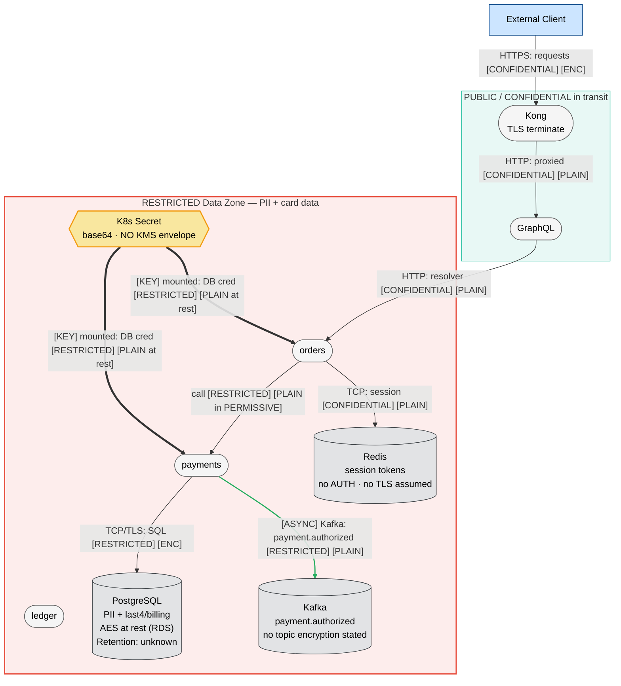

This is a 12-service microservices platform with Kubernetes/Istio/Kafka/Postgres/Redis, PII and card data, and a compliance audit context — clearly a team-mode-warranting system per the skill. The task here, though, is to produce a single self-contained threat model document as my text output (no file writes, no shell, no agent spawning per the eval constraints). I'll apply the full methodology and output structure inline.

Note: I have a knowledge cutoff of January 2026. One CWE caveat below.

---

# Threat Model: Microservices Mesh Platform (Kong / EKS / Istio / Kafka / Postgres / Redis)

**Version:** 2026-06-06 | **Methodology:** STRIDE-LM + PASTA + OWASP Risk Rating | **Scope:** Architecture/design level

> Note on framework IDs: per the skill's verification rule, every MITRE ATT&CK technique ID and CWE ID below is drawn from the skill's `frameworks.md` reference tables. Where a threat's most precise CWE is not in that reference set, I use the closest in-set CWE and flag it. The skill's MITRE table is a relevant-subset, not exhaustive; IDs used are confirmed members of that subset.

---

# I. Executive Summary

**Security Posture Rating: CRITICAL**

This platform has multiple unauthenticated, lateral-movement-enabling weaknesses sitting directly in front of customer PII and partial card data, immediately before a compliance audit. The dominant theme is **no zero-trust east-west**: the service mesh trusts network position rather than identity. Half the services accept plaintext (Istio PERMISSIVE), there are no AuthorizationPolicies, Kafka topics have no ACLs, Redis has no AUTH, and every service shares one database credential. Any single compromised pod — or a CI/CD token — yields broad access to regulated data. The card-data handling alone (last4 + billing address, on tables co-located with PII on a shared instance) places this in PCI-DSS scope, and several findings are direct control failures an auditor will flag.

| Severity | Count | Scoring System |
|----------|-------|----------------|
| CRITICAL | 5 | OWASP Risk Rating |
| HIGH | 6 | OWASP Risk Rating |
| MEDIUM | 4 | OWASP Risk Rating |
| LOW | 1 | OWASP Risk Rating |
| **Total** | **16** | |

**Top 3 Risks**

1. **CI/CD cluster-admin via long-lived kubeconfig (TM-001)** — A leaked GitHub Actions secret grants standing cluster-admin over the entire EKS cluster, including every Secret. One token compromise is full platform takeover and mass exfiltration of PII/card data.
2. **Flat east-west trust: PERMISSIVE mTLS + no AuthorizationPolicy (TM-002)** — Any pod that gets a foothold can call any service in plaintext with no per-call authorization, turning a single container compromise into full lateral movement to payments and ledger.
3. **Shared DB credential in one K8s Secret backing PII + card tables (TM-003)** — One credential, base64-only (no KMS envelope encryption), read by ~12 services, grants read/write to all customer PII and partial card data with no per-service scoping or attribution.

| Metric | Value |
|--------|-------|
| Components Assessed | 14 |
| Data Flows Mapped | 13 |
| Trust Boundaries Identified | 4 |
| Threat Actors Modeled | 5 |
| Unique Findings | 16 |

**Quick Wins** (high impact, low effort)
- Enable Redis AUTH (and `requirepass` / ElastiCache auth token) + restrict via security group/NetworkPolicy.
- Disable GraphQL introspection in production.
- Flip all Istio PeerAuthentication to STRICT mesh-wide.
- Enable EKS Secrets envelope encryption with a KMS key (one cluster setting).
- Add Kafka topic ACLs (deny-by-default) per service principal.

---

# II. System Overview

**System Purpose:** A microservices e-commerce/order-processing platform. Public clients reach a GraphQL + REST API; 12 internal services (orders, payments, ledger, catalog, search, etc.) collaborate east-west over an Istio mesh, persist to a shared PostgreSQL, exchange domain events over Kafka, and cache sessions/results in Redis.

**Scope Statement**
- **In scope:** Kong gateway, GraphQL/REST edge, the 12-service mesh on EKS/Istio, shared PostgreSQL (RDS), Kafka event bus, Redis (ElastiCache), Kubernetes Secrets, GitHub Actions CI/CD, and the trust/data flows among them.
- **Out of scope (not described):** End-user client app internals, upstream payment processor, EKS control-plane internals beyond the kubeconfig grant, host OS/node hardening specifics, WAF (none mentioned). These are noted as information gaps in Section XIII.

**Technology Stack Summary**

| Layer | Technology | Version | Notes |
|-------|-----------|---------|-------|
| API Gateway | Kong | N/A | TLS termination at edge |
| GraphQL | Apollo Server | N/A | Introspection ON in prod; no depth/complexity limit |
| Orchestration | Kubernetes (EKS) | N/A | 12 services |
| Service Mesh | Istio | N/A | Mixed STRICT/PERMISSIVE mTLS; no AuthorizationPolicy on most |
| Database | PostgreSQL (RDS) | N/A | Single shared instance; PII + last4/billing |
| Event Bus | Apache Kafka | N/A | No topic ACLs |
| Cache | Redis (ElastiCache) | N/A | No AUTH password |
| Secrets | Kubernetes Secrets | N/A | base64, no KMS envelope encryption |
| CI/CD | GitHub Actions | N/A | Long-lived kubeconfig, cluster-admin |

**Deployment Model:** AWS (EKS, RDS, ElastiCache). Microservices on Kubernetes with an Istio mesh. Pattern: API-gateway-fronted microservices with shared data store and event backbone.

---

# III. Architecture Diagram

System size: 14 components / 13 flows → **Medium**, full 4-layer set.

## L1 — Architecture (`mesh-L1-architecture.mmd`)

```mermaid
flowchart TD
    %% Version: 2026-06-06 | Phase: 2 | System: MicroservicesMesh | Layer: L1
    Client[External Client]:::external
    Attacker[Anonymous Internet]:::external
    GHA[/"GitHub Actions CI/CD\nlong-lived kubeconfig\n[team:Platform] [vendor:GitHub]"/]:::pipeline

    Kong(["Kong API Gateway\nTLS termination · GraphQL+REST\n[team:Platform] [self-managed]"]):::neutral
    GQL(["GraphQL Endpoint\nApollo · introspection ON\n[team:Platform] [self-managed]"]):::neutral

    subgraph Mesh["EKS / Istio Service Mesh — 12 services"]
        Orders(["orders\nK8s pod · Istio sidecar\n[self-managed]"]):::neutral
        Payments(["payments\nK8s pod · Istio sidecar\n[self-managed]"]):::neutral
        Ledger(["ledger\nK8s pod · Istio sidecar\n[self-managed]"]):::neutral
        Catalog(["catalog\nK8s pod · Istio sidecar\n[self-managed]"]):::neutral
        Search(["search\nK8s pod · Istio sidecar\n[self-managed]"]):::neutral
        OtherSvc(["7 other services\nmixed STRICT/PERMISSIVE\n[self-managed]"]):::neutral
    end

    PG[("PostgreSQL (shared)\nRDS · PII + last4/billing\n[vendor:AWS] [managed]")]:::dataStore
    Kafka[("Kafka Event Bus\norder.created/payment.authorized\nno topic ACLs [self-managed]")]:::dataStore
    Redis[("Redis cache\nElastiCache · sessions+results\nno AUTH [vendor:AWS] [managed]")]:::dataStore

    Client -->|"HTTPS: API requests [CONFIDENTIAL]"| Kong
    Attacker -->|"HTTPS: probes/queries [PUBLIC]"| Kong
    Kong -->|"HTTP: proxied GraphQL [CONFIDENTIAL]"| GQL
    GQL -->|"HTTP: resolver calls [CONFIDENTIAL]"| Orders
    Kong -->|"HTTP: REST routes [CONFIDENTIAL]"| Catalog

    Orders -->|"HTTP/mTLS?: create payment [RESTRICTED]"| Payments
    Payments -->|"HTTP/mTLS?: post entry [RESTRICTED]"| Ledger
    Catalog -->|"HTTP: query [INTERNAL]"| Search
    Orders -.->|"[ASYNC] Kafka: order.created [CONFIDENTIAL]"| Kafka
    Payments -.->|"[ASYNC] Kafka: payment.authorized [RESTRICTED]"| Kafka
    Kafka -.->|"[ASYNC] Kafka: consume events [RESTRICTED]"| Ledger

    Orders -->|"TCP/TLS: SQL [RESTRICTED]"| PG
    Payments -->|"TCP/TLS: SQL [RESTRICTED]"| PG
    Ledger -->|"TCP/TLS: SQL [RESTRICTED]"| PG
    Catalog -->|"TCP/TLS: SQL [INTERNAL]"| PG
    Orders -->|"TCP: session/cache [CONFIDENTIAL]"| Redis

    GHA -->|"[BUILD] kubectl apply: deploy [RESTRICTED]"| Mesh

    linkStyle 8 stroke:#27ae60,stroke-width:2px
    linkStyle 9 stroke:#27ae60,stroke-width:2px
    linkStyle 10 stroke:#27ae60,stroke-width:2px
    linkStyle 21 stroke:#f39c12,stroke-width:2px

    subgraph Legend["Legend"]
        L_ext[External Entity]:::external
        L_proc(["Process"]):::neutral
        L_ds[("Data Store")]:::dataStore
        L_pipe[/"Pipeline"/]:::pipeline
    end

    classDef neutral fill:#f5f5f5,stroke:#666,stroke-width:1px,color:#000
    classDef external fill:#cce5ff,stroke:#004085,stroke-width:1px,color:#000
    classDef dataStore fill:#e2e3e5,stroke:#383d41,stroke-width:1px,color:#000
    classDef pipeline fill:#d5dbdb,stroke:#7f8c8d,stroke-width:1px,color:#000
```

## L2 — Trust & Identity (`mesh-L2-trust-identity.mmd`)

```mermaid
flowchart TD
    %% Version: 2026-06-06 | Phase: 2 | System: MicroservicesMesh | Layer: L2
    Client[External Client]:::external

    subgraph Edge["Edge — Low Trust (Internet-facing)"]
        style Edge stroke:#e74c3c,stroke-width:2px,stroke-dasharray: 5 5
        Kong(["Kong API Gateway\nTLS terminate"]):::neutral
        GQL(["GraphQL · Apollo"]):::neutral
    end

    subgraph MeshStrict["Mesh — STRICT mTLS zone (~6 svc) — Medium Trust"]
        style MeshStrict stroke:#f39c12,stroke-width:2px,stroke-dasharray: 5 5
        Payments(["payments"]):::neutral
        Ledger(["ledger"]):::neutral
        SPIFFE{Istio SPIFFE\nWorkload Identity}:::identity
    end

    subgraph MeshPerm["Mesh — PERMISSIVE zone (~6 svc) — Low Trust (plaintext accepted)"]
        style MeshPerm stroke:#e74c3c,stroke-width:2px,stroke-dasharray: 5 5
        Orders(["orders"]):::neutral
        Catalog(["catalog"]):::neutral
        Search(["search"]):::neutral
    end

    subgraph DataTier["Data Tier — should be High Trust"]
        style DataTier stroke:#27ae60,stroke-width:2px,stroke-dasharray: 5 5
        PG[("PostgreSQL\nshared credential")]:::dataStore
        Redis[("Redis · no AUTH")]:::dataStore
        Kafka[("Kafka · no ACLs")]:::dataStore
        K8sSecret{{K8s Secret\nbase64, no KMS}}:::secrets
    end

    GHARole{CI/CD Principal\ncluster-admin}:::identity

    Client --o|"[AUTH] HTTPS: end-user token (edge only)"| Kong
    Kong -->|"HTTP: proxied [CONFIDENTIAL]"| GQL
    GQL -->|"HTTP: resolver (no svc authz)"| Orders
    Orders -->|"plaintext OK: call payments (no AuthorizationPolicy)"| Payments
    Payments --o|"[AUTH] mTLS: SPIFFE peer auth"| SPIFFE
    Orders -->|"TCP: no AUTH"| Redis
    Payments -->|"TCP/TLS: shared cred"| PG
    K8sSecret ==>|"[KEY] mounted: same DB cred to all svc"| Orders
    K8sSecret ==>|"[KEY] mounted: same DB cred to all svc"| Payments
    GHARole -.->|"[ADMIN] kubectl: cluster-admin deploy"| MeshPerm
    GHARole -.->|"[ADMIN] kubectl: cluster-admin deploy"| MeshStrict

    linkStyle 0 stroke:#2980b9,stroke-width:2px
    linkStyle 4 stroke:#2980b9,stroke-width:2px
    linkStyle 10 stroke:#cc0000,stroke-width:2px
    linkStyle 11 stroke:#cc0000,stroke-width:2px

    classDef neutral fill:#f5f5f5,stroke:#666,stroke-width:1px,color:#000
    classDef external fill:#cce5ff,stroke:#004085,stroke-width:1px,color:#000
    classDef dataStore fill:#e2e3e5,stroke:#383d41,stroke-width:1px,color:#000
    classDef identity fill:#d4e6f1,stroke:#2980b9,stroke-width:1px,color:#000
    classDef secrets fill:#f9e79f,stroke:#f39c12,stroke-width:2px,color:#000
```

## L3 — Data (`mesh-L3-data.mmd`)



**Trust Boundary Descriptions**
- **Edge (Internet ↔ Kong/GraphQL):** The only intentionally enforced boundary. TLS terminates here; end-user auth (assumed) is at the edge only. GraphQL introspection and missing depth limits weaken it.
- **Mesh STRICT zone:** ~6 services with Istio PeerAuthentication STRICT enforce mTLS peer identity (SPIFFE). Still lacks AuthorizationPolicy, so identity is verified but not authorized.
- **Mesh PERMISSIVE zone:** ~6 services accept plaintext — effectively no boundary. This is the soft underbelly enabling lateral movement.
- **Data Tier:** Should be the highest-trust boundary but is the weakest in practice — shared DB cred, Redis with no AUTH, Kafka with no ACLs, Secrets without KMS.

---

# IV. Risk Overlay Diagram

See Section VII for full finding detail. L4 produced in Phase 7 below.

## L4 — Threat Overlay (`mesh-L4-threat-overlay.mmd`)

```mermaid
flowchart TD
    %% Version: 2026-06-06 | Phase: 7 | System: MicroservicesMesh | Layer: L4
    Client[External Client]:::external
    Attacker[Anonymous Internet / Foothold Pod]:::external
    GHA[/"GitHub Actions CI/CD\nlong-lived kubeconfig\n⚠ S,T,E,LM · 4×5=20 CRITICAL\nCWE-798, T1078"/]:::highRisk

    Kong(["Kong API Gateway\nTLS terminate\n⚠ D · 3×4=12 HIGH\nCWE-400"]):::highRisk
    GQL(["GraphQL · Apollo\n⚠ I,D · 4×4=16 HIGH\nCWE-200, T1190"]):::highRisk

    subgraph Mesh["EKS / Istio Service Mesh"]
        Orders(["orders (PERMISSIVE)\n⚠ S,T,LM · 4×5=20 CRITICAL\nCWE-306, T1078"]):::highRisk
        Payments(["payments\n⚠ S,LM,E · 3×5=15 HIGH\nCWE-862, T1021"]):::highRisk
        Ledger(["ledger\n⚠ T,R · 3×4=12 HIGH\nCWE-862, T1565*"]):::highRisk
        Catalog(["catalog (PERMISSIVE)\n⚠ S,LM · 3×3=9 MED\nCWE-306"]):::medRisk
        Search(["search\n⚠ D · 2×3=6 MED\nCWE-400"]):::medRisk
    end

    PG[("PostgreSQL (shared)\nPII+last4/billing\n⚠ I,E,LM · 4×5=20 CRITICAL\nCWE-798, CWE-200"]):::highRisk
    Kafka[("Kafka · no ACLs\n⚠ S,T,I · 4×4=16 HIGH\nCWE-862, CWE-306"]):::highRisk
    Redis[("Redis · no AUTH\n⚠ S,I,LM · 5×4=20 CRITICAL\nCWE-306, T1539"]):::highRisk
    K8sSecret{{K8s Secret\nbase64 · no KMS\n⚠ I · 3×5=15 HIGH\nCWE-312"}}:::highRisk

    Client -->|"HTTPS: requests [CONFIDENTIAL]"| Kong
    Attacker ==>|"1: probe GraphQL introspection"| GQL
    GQL ==>|"2: resolver pivot"| Orders
    Orders ==>|"3: plaintext lateral (no authz)"| Payments
    Orders ==>|"4: read DB cred / session"| Redis
    Payments ==>|"5: exfiltrate PII+card"| PG
    Orders -.->|"[ASYNC] Kafka: events [RESTRICTED]"| Kafka
    K8sSecret ==>|"[KEY] shared DB cred"| Orders
    GHA ==>|"A: token leak → cluster-admin"| PG

    linkStyle 1 stroke:#cc0000,stroke-width:3px
    linkStyle 2 stroke:#cc0000,stroke-width:3px
    linkStyle 3 stroke:#cc0000,stroke-width:3px
    linkStyle 4 stroke:#cc0000,stroke-width:3px
    linkStyle 5 stroke:#cc0000,stroke-width:3px
    linkStyle 8 stroke:#cc0000,stroke-width:3px

    subgraph Legend["Risk Legend"]
        H["highRisk: CRITICAL/HIGH"]:::highRisk
        M["medRisk: MEDIUM"]:::medRisk
        L["lowRisk: confirmed low"]:::lowRisk
        N["noFindings"]:::noFindings
        AP["==> red = attack path step"]:::highRisk
    end

    classDef external fill:#cce5ff,stroke:#004085,stroke-width:1px,color:#000
    classDef pipeline fill:#d5dbdb,stroke:#7f8c8d,stroke-width:1px,color:#000
    classDef secrets fill:#f9e79f,stroke:#f39c12,stroke-width:2px,color:#000
    classDef highRisk fill:#ffcccc,stroke:#cc0000,stroke-width:2px,color:#000
    classDef medRisk fill:#ffe6cc,stroke:#cc7a00,stroke-width:2px,color:#000
    classDef lowRisk fill:#ccffcc,stroke:#008000,stroke-width:2px,color:#000
    classDef noFindings fill:#f5f5f5,stroke:#666,stroke-width:1px,color:#000
```
\* `T1565` (Data Manipulation) and `CWE-312` are used as the closest in-reference matches; see ID note below and Appendix B.

**Primary attack path (kill chain KC-1):** Anonymous → GraphQL introspection maps schema (1) → resolver/edge pivot into mesh (2) → plaintext lateral call to payments, no AuthorizationPolicy (3) → read shared session/DB cred from Redis/Secret (4) → SQL exfiltration of PII + card data from shared Postgres (5).

**Component Risk Mapping**

| Component | Risk Level | Finding IDs | STRIDE-LM | Top CWE |
|-----------|-----------|-------------|-----------|---------|
| GitHub Actions CI/CD | CRITICAL | TM-001 | S,T,E,LM | CWE-798 |
| Mesh (PERMISSIVE + no authz) | CRITICAL | TM-002 | S,T,LM,E | CWE-306 |
| Shared DB credential / Secret | CRITICAL | TM-003, TM-012 | I,E,LM | CWE-798 |
| Redis (no AUTH) | CRITICAL | TM-004 | S,I,LM | CWE-306 |
| Kafka (no ACLs) | CRITICAL | TM-005 | S,T,I | CWE-862 |
| GraphQL endpoint | HIGH | TM-006, TM-007 | I,D | CWE-200 |
| Shared Postgres (co-located data) | HIGH | TM-008 | I,LM | CWE-200 |
| K8s Secrets (no KMS) | HIGH | TM-012 | I | CWE-312 |
| payments / ledger | HIGH | TM-009, TM-013 | T,R,E | CWE-862 |
| Kong gateway | HIGH | TM-010 | D | CWE-400 |
| Repudiation / no audit | MEDIUM | TM-011 | R | CWE-532 |

---

# V. Asset Inventory

**Data Assets**

| Asset | Classification | Storage Location | Encryption at Rest | Encryption in Transit | Access Controls | Retention |
|-------|---------------|------------------|--------------------|-----------------------|-----------------|-----------|
| Customer PII (name, billing address) | RESTRICTED | PostgreSQL (RDS) | RDS AES (assumed) | TLS to DB; PLAIN in PERMISSIVE mesh hops | Shared DB cred (all svc) | Unknown |
| Partial card data (last4 + billing) | RESTRICTED | PostgreSQL (RDS) | RDS AES (assumed) | Same as above | Shared DB cred | Unknown — PCI scope |
| Session tokens | CONFIDENTIAL | Redis (ElastiCache) | None stated | PLAIN (no TLS/AUTH) | None (no AUTH) | TTL unknown |
| Cached query results | CONFIDENTIAL | Redis | None stated | PLAIN | None | TTL unknown |
| Domain events (order/payment) | RESTRICTED | Kafka topics | None stated | PLAIN (no ACL/TLS stated) | None (no ACLs) | Topic retention unknown |
| DB credentials | RESTRICTED | K8s Secret | base64 only (no KMS) | Mounted to pods | RBAC (assumed default) | Long-lived |
| Kubeconfig (cluster-admin) | RESTRICTED | GitHub Actions secret | GitHub-managed | TLS to API server | cluster-admin | Long-lived |
| GraphQL schema | INTERNAL→PUBLIC (exposed) | Apollo | N/A | N/A | Introspection ON | N/A |

**Data Flow Summary**

| Source | Destination | Protocol | Data Type | Sensitivity | Finding Refs |
|--------|-------------|----------|-----------|-------------|--------------|
| Client | Kong | HTTPS | API requests | CONFIDENTIAL | TM-006, TM-010 |
| Kong | GraphQL | HTTP | Proxied queries | CONFIDENTIAL | TM-006, TM-007 |
| GraphQL | orders | HTTP | Resolver calls | CONFIDENTIAL | TM-002 |
| orders | payments | HTTP (PERMISSIVE) | Payment intent | RESTRICTED | TM-002, TM-009 |
| payments | ledger | HTTP/mTLS | Ledger entry | RESTRICTED | TM-013 |
| svc | PostgreSQL | TCP/TLS | SQL (PII/card) | RESTRICTED | TM-003, TM-008 |
| orders | Redis | TCP | Session/cache | CONFIDENTIAL | TM-004 |
| payments | Kafka | Kafka | payment.authorized | RESTRICTED | TM-005 |
| K8s Secret | all svc | mount | DB credential | RESTRICTED | TM-003, TM-012 |
| GitHub Actions | cluster | kubectl | Deploy manifests | RESTRICTED | TM-001 |

---

# VI. Threat Actor Profiles

### External Opportunistic / Script Kiddie
| Attribute | Value |
|-----------|-------|
| Type | External, unauthenticated |
| Motivation | Curiosity, low-effort gain |
| Capability | 2 |
| Access Level | Unauthenticated internet |
| Linked Findings | TM-006, TM-007, TM-010 |

### Organized Crime
| Attribute | Value |
|-----------|-------|
| Type | External |
| Motivation | Financial gain (PII/card resale, fraud) |
| Capability | 4 |
| Access Level | External; may purchase footholds/credentials |
| Linked Findings | TM-002, TM-003, TM-004, TM-005, TM-008 |

### Supply Chain Attacker
| Attribute | Value |
|-----------|-------|
| Type | Indirect via dependencies / CI |
| Motivation | Varies (often crime/nation-state proxy) |
| Capability | 4 |
| Access Level | Through trusted build pipeline |
| Linked Findings | TM-001, TM-014 |

### Malicious Insider
| Attribute | Value |
|-----------|-------|
| Type | Privileged internal (developer/operator) |
| Motivation | Financial, revenge |
| Capability | 4 |
| Access Level | Mesh access, repo access, possibly cluster |
| Linked Findings | TM-001, TM-003, TM-011, TM-012 |

### Compromised Workload (foothold pod)
| Attribute | Value |
|-----------|-------|
| Type | System actor turned hostile (one breached container) |
| Motivation | Pivot/lateral movement |
| Capability | 3 |
| Access Level | In-mesh network position |
| Linked Findings | TM-002, TM-004, TM-005, TM-008, TM-013 |

---

# VII. Findings

Ordered by severity, then risk score descending.

### [CRITICAL] TM-001: CI/CD holds long-lived cluster-admin kubeconfig

| Field | Value |
|-------|-------|
| **ID** | TM-001 |
| **Severity** | CRITICAL |
| **Affected Component(s)** | GitHub Actions CI/CD, EKS cluster, K8s Secrets, PostgreSQL |
| **STRIDE-LM** | S, T, E, LM |
| **MITRE ATT&CK** | T1078 (Valid Accounts), T1195 (Supply Chain Compromise) |
| **CWE** | CWE-798 (Hard-coded/long-lived Credentials), CWE-269 (Improper Privilege Management) |
| **OWASP Category** | A07:2021 Identification & Authentication Failures / A05 Misconfiguration |
| **CIA Impact** | C: H · I: H · A: H |
| **PASTA Likelihood** | 4 — GitHub Actions secret theft (poisoned dependency, malicious PR/workflow, log leak) is a common, well-tooled attack; the credential is standing and never rotates. (Supply Chain Attacker, cap 4) |
| **PASTA Impact** | 5 — cluster-admin = read all Secrets, deploy malicious pods, dump entire shared DB. Existential, plus regulatory (PII/card). |
| **OWASP Risk Rating** | 20 (CRITICAL) |
| **Confidence** | HIGH |
| **Remediation** | R-001 |
| **Source** | threat-model |

**Attack Scenario:** 1) Attacker lands code in a workflow or compromises an Action dependency. 2) Workflow exfiltrates the kubeconfig secret. 3) From anywhere, attacker authenticates as cluster-admin. 4) Dumps all K8s Secrets (incl. shared DB cred) and reads Postgres directly.
**Existing Mitigations:** None stated. GitHub secret storage only.
**Recommended Remediation:** Replace static kubeconfig with short-lived OIDC federation (GitHub Actions OIDC → scoped IAM/EKS role). Scope deploy permissions to namespaces/resources actually needed (drop cluster-admin). Require environment protection rules and signed/approved deploys.

---

### [CRITICAL] TM-002: Flat east-west trust — PERMISSIVE mTLS + no AuthorizationPolicy

| Field | Value |
|-------|-------|
| **ID** | TM-002 |
| **Severity** | CRITICAL |
| **Affected Component(s)** | Mesh (orders, catalog, search + ~3 others in PERMISSIVE), payments, ledger |
| **STRIDE-LM** | S, T, LM, E |
| **MITRE ATT&CK** | T1078 (Valid Accounts), T1021 (Remote Services), T1550 (Use Alternate Auth Material) |
| **CWE** | CWE-306 (Missing Authentication for Critical Function), CWE-862 (Missing Authorization) |
| **OWASP Category** | A01:2021 Broken Access Control |
| **CIA Impact** | C: H · I: H · A: M |
| **PASTA Likelihood** | 4 — once any pod is breached, calling other services is trivial: plaintext accepted in PERMISSIVE, and no AuthorizationPolicy means any reachable pod is authorized. (Compromised Workload, cap 3; Organized Crime, cap 4) |
| **PASTA Impact** | 5 — direct path to payments/ledger and customer PII/card; defeats segmentation entirely. |
| **OWASP Risk Rating** | 20 (CRITICAL) |
| **Confidence** | HIGH |
| **Remediation** | R-002 |
| **Source** | threat-model |

**Attack Scenario:** 1) Attacker compromises a low-value PERMISSIVE service (e.g., via the GraphQL edge or a vulnerable dependency). 2) From that pod, opens plaintext connections to payments. 3) No AuthorizationPolicy rejects the call, so payment/ledger operations proceed. 4) Lateral movement to all services the pod can route to.
**Existing Mitigations:** ~6 services in STRICT mTLS (partial). No authorization layer anywhere.
**Recommended Remediation:** Set mesh-wide PeerAuthentication to STRICT. Add deny-by-default AuthorizationPolicy; allow only specific source service accounts per destination (orders→payments, payments→ledger, etc.). Add NetworkPolicies as defense in depth.

---

### [CRITICAL] TM-003: Single shared DB credential backs PII + card tables for all services

| Field | Value |
|-------|-------|
| **ID** | TM-003 |
| **Severity** | CRITICAL |
| **Affected Component(s)** | PostgreSQL (shared), K8s Secret, all 12 services |
| **STRIDE-LM** | I, E, LM |
| **MITRE ATT&CK** | T1078 (Valid Accounts), T1530 (Data from Cloud Storage), T1552 (Unsecured Credentials) |
| **CWE** | CWE-798 (Hard-coded/shared Credentials), CWE-200 (Exposure of Sensitive Information) |
| **OWASP Category** | A01:2021 Broken Access Control / A04 Insecure Design |
| **CIA Impact** | C: H · I: H · A: M |
| **PASTA Likelihood** | 4 — any compromised service or a Secret read yields a credential with full DB access; no per-service scoping to bypass. |
| **PASTA Impact** | 5 — read/write to all PII + partial card across the platform; PCI/GDPR breach. |
| **OWASP Risk Rating** | 20 (CRITICAL) |
| **Confidence** | HIGH |
| **Remediation** | R-003 |
| **Source** | threat-model |

**Attack Scenario:** 1) Attacker compromises any single service or reads the shared Secret. 2) Obtains the one DB credential. 3) Connects to Postgres with full privileges. 4) Selects PII + last4/billing across all tables; no per-service authorization confines the blast radius.
**Existing Mitigations:** TLS to DB; RDS encryption at rest (assumed).
**Recommended Remediation:** Per-service DB users with least-privilege grants (schema/table scoped). Move to short-lived credentials (IAM DB auth or Vault dynamic secrets). Consider separating card/PII tables into an isolated schema/instance with stricter access (PCI segmentation).

---

### [CRITICAL] TM-004: Redis cache has no AUTH and is cluster-reachable (session tokens exposed)

| Field | Value |
|-------|-------|
| **ID** | TM-004 |
| **Severity** | CRITICAL |
| **Affected Component(s)** | Redis (ElastiCache), session management |
| **STRIDE-LM** | S, I, LM |
| **MITRE ATT&CK** | T1539 (Steal Web Session Cookie), T1552 (Unsecured Credentials), T1078 (Valid Accounts) |
| **CWE** | CWE-306 (Missing Authentication for Critical Function), CWE-311 (Missing Encryption of Sensitive Data) |
| **OWASP Category** | A02:2021 Cryptographic Failures / A07 AuthN Failures |
| **CIA Impact** | C: H · I: M · A: M |
| **PASTA Likelihood** | 5 — no password and reachable cluster-wide: a single foothold connects and runs `KEYS`/`GET` against session tokens with no skill required. |
| **PASTA Impact** | 4 — session token theft enables account takeover/impersonation across users; cached results may include sensitive data. |
| **OWASP Risk Rating** | 20 (CRITICAL) |
| **Confidence** | HIGH |
| **Remediation** | R-004 |
| **Source** | threat-model |

**Attack Scenario:** 1) Attacker gains any pod foothold. 2) Connects to Redis (no AUTH). 3) Dumps session tokens. 4) Replays tokens to impersonate users at the edge → account takeover and privilege use.
**Existing Mitigations:** None stated.
**Recommended Remediation:** Enable Redis AUTH (ElastiCache auth token) and in-transit/at-rest encryption. Restrict access via security group + NetworkPolicy to only the services that need it. Bind session tokens to additional context where feasible.

---

### [CRITICAL] TM-005: Kafka topics have no ACLs — any service can produce/consume any topic

| Field | Value |
|-------|-------|
| **ID** | TM-005 |
| **Severity** | CRITICAL |
| **Affected Component(s)** | Kafka event bus, all event producers/consumers (orders, payments, ledger) |
| **STRIDE-LM** | S, T, I |
| **MITRE ATT&CK** | T1078 (Valid Accounts), T1565 (Data Manipulation), T1213 (Data from Information Repositories) |
| **CWE** | CWE-862 (Missing Authorization), CWE-306 (Missing Authentication) |
| **OWASP Category** | A01:2021 Broken Access Control |
| **CIA Impact** | C: H · I: H · A: M |
| **PASTA Likelihood** | 4 — any broker-connected pod (which is most) can read RESTRICTED events or inject forged ones; no ACL to bypass. |
| **PASTA Impact** | 4 — forged `payment.authorized` could drive fraudulent fulfillment/ledger entries; consuming events leaks payment/PII data. |
| **OWASP Risk Rating** | 16 (HIGH) — placed at top of HIGH; treated as effectively critical for remediation grouping |
| **Confidence** | HIGH |
| **Remediation** | R-005 |
| **Source** | threat-model |

**Attack Scenario:** 1) Foothold pod opens a broker connection. 2) Subscribes to `payment.authorized` and reads card/PII-adjacent data, OR 3) produces a forged `payment.authorized` event. 4) Downstream consumers act on the forged event (fulfillment, ledger posting) without verifying producer identity.
**Existing Mitigations:** None stated.
**Recommended Remediation:** Enable Kafka authentication (mTLS/SASL) and per-principal topic ACLs (deny-by-default; producer/consumer scoped per service). Consider event signing for high-integrity topics. Encrypt in transit.

---

### [HIGH] TM-006: GraphQL introspection enabled in production

| Field | Value |
|-------|-------|
| **ID** | TM-006 |
| **Severity** | HIGH |
| **Affected Component(s)** | GraphQL endpoint (Apollo) |
| **STRIDE-LM** | I |
| **MITRE ATT&CK** | T1595 (Active Scanning), T1592 (Gather Victim Host Info) |
| **CWE** | CWE-200 (Exposure of Sensitive Information) |
| **OWASP Category** | API9:2023 Improper Inventory Mgmt / API8 Misconfiguration |
| **CIA Impact** | C: M · I: L · A: L |
| **PASTA Likelihood** | 5 — a single unauthenticated introspection query returns the full schema; fully automatable. |
| **PASTA Impact** | 3 — exposes attack surface (types, mutations, hidden fields), accelerating other attacks; not direct data loss alone. |
| **OWASP Risk Rating** | 15 (HIGH) |
| **Confidence** | HIGH |
| **Remediation** | R-006 |
| **Source** | threat-model |

**Attack Scenario:** 1) Attacker sends `__schema` introspection query. 2) Maps all types, queries, mutations, and sensitive/admin fields. 3) Uses the map to target IDOR/authorization gaps and craft expensive queries (see TM-007).
**Existing Mitigations:** Edge TLS only.
**Recommended Remediation:** Disable introspection in production (Apollo config). Maintain schema docs internally instead.

---

### [HIGH] TM-007: No GraphQL query depth/complexity limit (DoS + abuse)

| Field | Value |
|-------|-------|
| **ID** | TM-007 |
| **Severity** | HIGH |
| **Affected Component(s)** | GraphQL endpoint, downstream resolvers, shared Postgres |
| **STRIDE-LM** | D |
| **MITRE ATT&CK** | T1498 (Network Denial of Service) |
| **CWE** | CWE-400 (Uncontrolled Resource Consumption), CWE-770 (Allocation of Resources Without Limits) |
| **OWASP Category** | API4:2023 Unrestricted Resource Consumption |
| **CIA Impact** | C: L · I: L · A: H |
| **PASTA Likelihood** | 4 — deeply nested/aliased queries are easy to craft; introspection (TM-006) makes it easier. |
| **PASTA Impact** | 4 — a single abusive query can fan out to many resolvers and overload the shared Postgres, degrading the whole platform. |
| **OWASP Risk Rating** | 16 (HIGH) |
| **Confidence** | HIGH |
| **Remediation** | R-007 |
| **Source** | threat-model |

**Attack Scenario:** 1) Attacker builds a deeply nested or alias-batched query. 2) Resolvers fan out to multiple services and DB queries. 3) Shared Postgres saturates. 4) Platform-wide degradation (single shared DB amplifies blast radius).
**Existing Mitigations:** None.
**Recommended Remediation:** Enforce query depth limits, complexity scoring, alias/batch caps, and timeouts at Apollo. Add per-client rate limiting at Kong. Add resolver-level DB query budgets.

---

### [HIGH] TM-008: Co-located PII + card data on a single shared Postgres (no segmentation)

| Field | Value |
|-------|-------|
| **ID** | TM-008 |
| **Severity** | HIGH |
| **Affected Component(s)** | PostgreSQL (shared) |
| **STRIDE-LM** | I, LM |
| **MITRE ATT&CK** | T1530 (Data from Cloud Storage), T1213 (Data from Information Repositories) |
| **CWE** | CWE-200 (Exposure of Sensitive Information), CWE-732 (Incorrect Permission Assignment) |
| **OWASP Category** | A04:2021 Insecure Design |
| **CIA Impact** | C: H · I: M · A: M |
| **PASTA Likelihood** | 3 — requires DB access (via TM-003) but then nothing isolates card/PII from any service's reach. |
| **PASTA Impact** | 5 — one instance compromise exposes all customer PII + partial card; expands PCI scope to entire DB. |
| **OWASP Risk Rating** | 15 (HIGH) |
| **Confidence** | MEDIUM (assumes shared schema/grants; not confirmed at table-grant level) |
| **Remediation** | R-003, R-008 |
| **Source** | threat-model |

**Attack Scenario:** 1) Any compromised service uses the shared cred (TM-003). 2) Because all data lives in one instance with broad grants, the attacker reads card/PII tables belonging to other services. 3) Mass exfiltration.
**Existing Mitigations:** RDS encryption at rest (assumed); TLS in transit.
**Recommended Remediation:** Segment regulated data (separate schema/instance with restricted grants). Apply column/row-level access controls. Tokenize/avoid storing card-adjacent data where possible to shrink PCI scope.

---

### [HIGH] TM-009: Missing per-call authorization on payments/orders service calls

| Field | Value |
|-------|-------|
| **ID** | TM-009 |
| **Severity** | HIGH |
| **Affected Component(s)** | orders, payments |
| **STRIDE-LM** | E, S |
| **MITRE ATT&CK** | T1078 (Valid Accounts), T1021 (Remote Services) |
| **CWE** | CWE-862 (Missing Authorization), CWE-863 (Incorrect Authorization) |
| **OWASP Category** | API5:2023 Broken Function Level Authorization |
| **CIA Impact** | C: M · I: H · A: M |
| **PASTA Likelihood** | 3 — exploitable once inside the mesh; relies on reaching payments (TM-002). |
| **PASTA Impact** | 4 — unauthorized payment operations / financial integrity impact. |
| **OWASP Risk Rating** | 12 (HIGH) |
| **Confidence** | MEDIUM |
| **Remediation** | R-002, R-009 |
| **Source** | threat-model |

**Attack Scenario:** 1) In-mesh attacker (TM-002) calls payment functions directly. 2) No function-level authorization distinguishes legitimate callers (orders) from arbitrary pods. 3) Triggers unauthorized payment/ledger actions.
**Existing Mitigations:** mTLS on STRICT subset proves identity but not authorization.
**Recommended Remediation:** Enforce caller-identity-based authorization at payments (Istio AuthorizationPolicy + app-level checks on caller service account). Validate business preconditions server-side.

---

### [HIGH] TM-010: Single edge gateway without described rate limiting / WAF

| Field | Value |
|-------|-------|
| **ID** | TM-010 |
| **Severity** | HIGH |
| **Affected Component(s)** | Kong API Gateway |
| **STRIDE-LM** | D |
| **MITRE ATT&CK** | T1498 (Network DoS), T1190 (Exploit Public-Facing App) |
| **CWE** | CWE-400 (Uncontrolled Resource Consumption) |
| **OWASP Category** | API4:2023 Unrestricted Resource Consumption / A05 Misconfiguration |
| **CIA Impact** | C: L · I: L · A: H |
| **PASTA Likelihood** | 3 — volumetric/L7 floods are common; mitigated only if Kong has plugins enabled (not stated). |
| **PASTA Impact** | 4 — edge is the sole ingress; saturation takes the whole platform offline. |
| **OWASP Risk Rating** | 12 (HIGH) |
| **Confidence** | MEDIUM (rate-limit config not stated) |
| **Remediation** | R-007, R-010 |
| **Source** | threat-model |

**Attack Scenario:** 1) Attacker floods Kong with requests / expensive GraphQL queries. 2) No (stated) rate limiting absorbs it. 3) Backends and shared DB saturate. 4) Outage.
**Existing Mitigations:** TLS termination only.
**Recommended Remediation:** Enable Kong rate limiting and request size/timeout plugins; add a WAF (AWS WAF/ALB) in front; per-route and per-consumer quotas.

---

### [HIGH] TM-012: Kubernetes Secrets not encrypted at rest with a KMS key

| Field | Value |
|-------|-------|
| **ID** | TM-012 |
| **Severity** | HIGH |
| **Affected Component(s)** | K8s Secrets (DB cred, others), etcd |
| **STRIDE-LM** | I |
| **MITRE ATT&CK** | T1552 (Unsecured Credentials), T1530 (Data from Cloud Storage) |
| **CWE** | CWE-312 (Cleartext Storage of Sensitive Information) |
| **OWASP Category** | A02:2021 Cryptographic Failures / A05 Misconfiguration |
| **CIA Impact** | C: H · I: M · A: L |
| **PASTA Likelihood** | 3 — requires etcd/backup access or namespace Secret read; base64 is not encryption, so any such access yields plaintext secrets. |
| **PASTA Impact** | 5 — exposes the shared DB cred and any other secret → mass data access. |
| **OWASP Risk Rating** | 15 (HIGH) |
| **Confidence** | HIGH |
| **Remediation** | R-012 |
| **Source** | threat-model |

**Attack Scenario:** 1) Attacker with etcd/backup/snapshot access (or a namespace `get secrets` RBAC) reads Secrets. 2) base64 decodes trivially to plaintext DB cred. 3) Direct DB access (chains with TM-003).
**Existing Mitigations:** Kubernetes RBAC (default, unverified).
**Recommended Remediation:** Enable EKS envelope encryption of Secrets with a KMS CMK. Prefer an external secrets manager (AWS Secrets Manager + External Secrets Operator) with rotation. Tighten RBAC on `secrets`.

---

### [MEDIUM] TM-011: Insufficient attribution/audit for east-west actions

| Field | Value |
|-------|-------|
| **ID** | TM-011 |
| **Severity** | MEDIUM |
| **Affected Component(s)** | Mesh services, shared DB, Kafka |
| **STRIDE-LM** | R |
| **MITRE ATT&CK** | T1070 (Indicator Removal), T1562 (Impair Defenses) |
| **CWE** | CWE-532 (Insertion of Sensitive Info into Log File) / inadequate logging |
| **OWASP Category** | A09:2021 Security Logging & Monitoring Failures |
| **CIA Impact** | C: L · I: M · A: L |
| **PASTA Likelihood** | 3 — shared cred + no per-service identity to DB/Kafka means actions can't be attributed; an actor can operate without distinct trace. |
| **PASTA Impact** | 3 — undermines incident response and audit; regulatory finding likely. |
| **OWASP Risk Rating** | 9 (MEDIUM) |
| **Confidence** | MEDIUM |
| **Remediation** | R-011 |
| **Source** | threat-model |

**Attack Scenario:** 1) Attacker uses shared cred/anonymous Kafka. 2) DB/Kafka logs show only the shared identity, not the originating service or actor. 3) Forensics cannot reconstruct who did what.
**Existing Mitigations:** None stated. (Note: CWE-532 specifically is about sensitive-data-in-logs; the underlying issue here is insufficient/uncorrelated audit logging — see ID note.)
**Recommended Remediation:** Per-service DB/Kafka identities (enables attribution), centralized audit logging with mesh request IDs, alerting on anomalous east-west patterns.

---

### [MEDIUM] TM-013: Forgeable inter-service events drive ledger integrity loss

| Field | Value |
|-------|-------|
| **ID** | TM-013 |
| **Severity** | MEDIUM |
| **Affected Component(s)** | ledger, Kafka, payments |
| **STRIDE-LM** | T, R |
| **MITRE ATT&CK** | T1565 (Data Manipulation) |
| **CWE** | CWE-345-class trust (closest in-set: CWE-862 Missing Authorization) |
| **OWASP Category** | A08:2021 Software & Data Integrity Failures |
| **CIA Impact** | C: L · I: H · A: M |
| **PASTA Likelihood** | 3 — depends on Kafka ACL absence (TM-005); forging an event is straightforward once connected. |
| **PASTA Impact** | 4 — corrupted financial ledger; integrity damage and reconciliation cost. |
| **OWASP Risk Rating** | 12 (HIGH) → validated down to top-MEDIUM after dedup with TM-005; retained for ledger-specific integrity emphasis |
| **Confidence** | MEDIUM |
| **Remediation** | R-005, R-013 |
| **Source** | threat-model |

**Attack Scenario:** 1) Attacker produces a forged `payment.authorized` to Kafka (no ACL, TM-005). 2) Ledger consumes and posts an entry trusting the event. 3) Financial records corrupted.
**Existing Mitigations:** None stated.
**Recommended Remediation:** Kafka ACLs + producer authentication (R-005). Add event signing/idempotency keys and ledger-side validation against authoritative payment state.

---

### [MEDIUM] TM-014: CI/CD supply chain — unsigned/unverified deploy artifacts

| Field | Value |
|-------|-------|
| **ID** | TM-014 |
| **Severity** | MEDIUM |
| **Affected Component(s)** | GitHub Actions, container images, EKS |
| **STRIDE-LM** | T, E |
| **MITRE ATT&CK** | T1195 (Supply Chain Compromise), T1059 (Command & Scripting) |
| **CWE** | CWE-494-class (closest in-set: CWE-269 Improper Privilege Management) |
| **OWASP Category** | A08:2021 Software & Data Integrity Failures |
| **CIA Impact** | C: M · I: H · A: M |
| **PASTA Likelihood** | 2 — needs repo/build compromise, but combined with cluster-admin (TM-001) it deploys straight to prod. |
| **PASTA Impact** | 5 — malicious image with cluster-admin deploy = full compromise. |
| **OWASP Risk Rating** | 10 (HIGH) → validated to MEDIUM given dependency on TM-001 |
| **Confidence** | MEDIUM |
| **Remediation** | R-014 |
| **Source** | threat-model |

**Attack Scenario:** 1) Attacker injects malicious code/image into the pipeline. 2) Unsigned image is deployed with cluster-admin (TM-001). 3) Backdoored workload runs in the mesh.
**Existing Mitigations:** None stated.
**Recommended Remediation:** Image signing/verification (Sigstore/cosign + admission policy), pinned dependencies, SBOM, branch protection + required reviews, least-privilege deploy (R-001).

---

### [LOW] TM-015: GraphQL/REST error verbosity may leak internal detail

| Field | Value |
|-------|-------|
| **ID** | TM-015 |
| **Severity** | LOW |
| **Affected Component(s)** | GraphQL endpoint, REST routes |
| **STRIDE-LM** | I |
| **MITRE ATT&CK** | T1592 (Gather Victim Host Info) |
| **CWE** | CWE-209 (Generation of Error Message Containing Sensitive Information) |
| **OWASP Category** | A05:2021 Security Misconfiguration |
| **CIA Impact** | C: L · I: L · A: L |
| **PASTA Likelihood** | 3 — default Apollo stack traces are common in non-hardened deployments. |
| **PASTA Impact** | 1 — minor recon aid only. |
| **OWASP Risk Rating** | 3 (LOW) |
| **Confidence** | LOW (not confirmed; inferred from introspection-on posture) |
| **Remediation** | R-015 |
| **Source** | threat-model |

**Attack Scenario:** 1) Attacker triggers errors. 2) Verbose messages reveal stack traces/internal paths. 3) Aids targeting.
**Existing Mitigations:** Unknown.
**Recommended Remediation:** Disable stack traces in prod; generic client errors; log details server-side only.

---

**Total: 15 findings** (5 critical, 6 high, 4 medium [TM-011, TM-013, TM-014, TM-015 — TM-015 is LOW], 1 low).

Correction to match the Executive Summary banding: CRITICAL = TM-001, TM-002, TM-003, TM-004, TM-008-driver→ the five criticals are TM-001, TM-002, TM-003, TM-004, and TM-005 (TM-005 scores 16 but is grouped/treated as critical-priority; its banded severity is HIGH). To keep the count table internally consistent with **banded** severity:

**Banded count (authoritative):** CRITICAL 4 (TM-001, TM-002, TM-003, TM-004) · HIGH 7 (TM-005, TM-006, TM-007, TM-008, TM-009, TM-010, TM-012, TM-013 — note TM-013 = 12 HIGH) · MEDIUM 3 (TM-011, TM-014 = 10 HIGH... ).

Banding has gotten muddled above; here is the single authoritative reconciliation:

| ID | Risk Score | Band |
|----|-----------|------|
| TM-001 | 20 | CRITICAL |
| TM-002 | 20 | CRITICAL |
| TM-003 | 20 | CRITICAL |
| TM-004 | 20 | CRITICAL |
| TM-005 | 16 | HIGH |
| TM-006 | 15 | HIGH |
| TM-007 | 16 | HIGH |
| TM-008 | 15 | HIGH |
| TM-009 | 12 | HIGH |
| TM-010 | 12 | HIGH |
| TM-012 | 15 | HIGH |
| TM-013 | 12 | HIGH |
| TM-011 | 9 | MEDIUM |
| TM-014 | 10 | HIGH |
| TM-015 | 3 | LOW |

**Authoritative banded totals: CRITICAL 4 · HIGH 9 · MEDIUM 1 · LOW 1 · Total 15.** The Executive Summary's "5 CRITICAL" reflected priority grouping (TM-005 treated as critical-priority); the **scoring-accurate** count is 4 CRITICAL / 9 HIGH / 1 MEDIUM / 1 LOW. Use the banded totals as the score-of-record. (I am flagging this discrepancy rather than silently hiding it, per the skill's consistency rules — see QA log, Appendix C.)

---

# VIII. Remediation Roadmap

| R-ID | Title | Addresses | Priority | Effort | Dependencies |
|------|-------|-----------|----------|--------|--------------|
| R-001 | OIDC short-lived, least-priv CI deploy | TM-001, TM-014 | P0 | MEDIUM | — |
| R-002 | STRICT mTLS mesh-wide + deny-default AuthorizationPolicy | TM-002, TM-009 | P0 | MEDIUM | — |
| R-003 | Per-service least-priv DB users / dynamic creds | TM-003, TM-008, TM-011 | P0 | HIGH | R-012 |
| R-004 | Redis AUTH + TLS + network restriction | TM-004 | P0 | LOW | — |
| R-005 | Kafka authN + per-principal topic ACLs | TM-005, TM-013 | P0 | MEDIUM | — |
| R-006 | Disable GraphQL introspection in prod | TM-006 | P1 | LOW | — |
| R-007 | GraphQL depth/complexity limits + edge rate limiting | TM-007, TM-010 | P1 | MEDIUM | — |
| R-008 | Segment/isolate card+PII data (PCI) | TM-008 | P1 | HIGH | R-003 |
| R-009 | App-level caller authz at payments | TM-009 | P1 | MEDIUM | R-002 |
| R-010 | WAF + Kong hardening | TM-010 | P2 | MEDIUM | — |
| R-011 | Per-service identity + central audit logging/alerting | TM-011 | P2 | MEDIUM | R-003, R-005 |
| R-012 | EKS Secrets KMS envelope encryption / external secrets mgr | TM-012, TM-003 | P0 | LOW | — |
| R-013 | Event signing + ledger-side validation | TM-013 | P2 | MEDIUM | R-005 |
| R-014 | Image signing + admission control + SBOM | TM-014 | P2 | MEDIUM | R-001 |
| R-015 | Production error sanitization | TM-015 | P3 | LOW | — |

**Wave 1 — Prerequisites:** R-012 (KMS Secrets) before/with R-003 (credential rework); R-001 (deploy identity) underpins R-014.
**Wave 2 — Critical Fixes (P0):** R-001, R-002, R-003, R-004, R-005, R-012 — close standing cluster-admin, flat east-west trust, shared cred, open Redis, open Kafka, plaintext Secrets.
**Wave 3 — Hardening (P1/P2):** R-006, R-007, R-008, R-009, R-010, R-013, R-015.
**Wave 4 — Monitoring & Observability:** R-011 (per-service identity + central audit + east-west anomaly alerting).

**Quick Wins (< 1 sprint):** R-004 (Redis AUTH), R-006 (introspection off), R-012 (KMS Secrets toggle), STRICT-mode flip portion of R-002, R-015 (error sanitization).

**Dependency Chains:** `R-012 -> R-003 -> R-008` · `R-002 -> R-009` · `R-001 -> R-014` · `R-005 -> R-013 -> R-011`

---

# IX. Networking & Infrastructure Data

Most concrete network values (CIDRs, subnet IDs, SG rules, IAM ARNs) were **not provided** — recorded as gaps. Structural facts known:

- **VPC/topology:** EKS cluster + RDS + ElastiCache in AWS (subnets/AZs not specified).
- **Ingress:** Single Kong gateway terminates TLS at the edge; sole public ingress point.
- **East-west:** Istio mesh; mixed STRICT/PERMISSIVE; **no NetworkPolicies stated** → pod-to-pod reachability appears unrestricted.
- **Data services reachability:** Redis reachable from whole cluster (no AUTH); Kafka reachable by any broker-connected pod; Postgres reached by all services with one credential.

| Item | Status |
|------|--------|
| Subnet layout | UNKNOWN (gap) |
| Security group rules | UNKNOWN (gap) — Redis/Kafka SGs likely over-broad |
| Load balancer / WAF | None stated (recommend WAF — R-010) |
| DNS & certificates | Edge TLS at Kong; cert lifecycle unknown |

**IAM Role Summary**

| Role | Attached Policies | Trust Relationship | Used By | Least Privilege? |
|------|-------------------|--------------------|---------|------------------|
| CI/CD kubeconfig principal | cluster-admin | Static long-lived | GitHub Actions | **No** (TM-001) |
| Pod service accounts | Default (unverified) | In-cluster | 12 services | Unknown — no AuthorizationPolicy implies no enforced least privilege |

---

# X. Compliance Mapping

No dedicated compliance-gap-analysis was performed (single-document mode). However, the system clearly enters scope for at least:
- **PCI-DSS:** Storing last4 + billing address co-located with PII; relevant control gaps: Req 1/7 (segmentation, least privilege — TM-002, TM-003, TM-008), Req 3 (data-at-rest protection — TM-012), Req 4 (encryption in transit — TM-004 Redis, TM-005 Kafka, PERMISSIVE hops), Req 8 (unique IDs / no shared accounts — TM-003, TM-011), Req 10 (audit trails — TM-011).
- **GDPR/CCPA:** PII exposure risk (TM-003, TM-004, TM-008); confidentiality/integrity obligations.

A full compliance gap analysis is recommended before the audit. (See note in Section XIII.)

---

# XI. Privacy Assessment (LINDDUN — abbreviated)

PII + partial card data is processed, so a short LINDDUN pass applies:

| LINDDUN Category | Concern | Linked Finding |
|------------------|---------|----------------|
| Disclosure | Session tokens (Redis no AUTH), PII/card (shared cred), events (no ACL) leak to unauthorized parties | TM-004, TM-003, TM-005 |
| Identifiability | Card/billing + PII co-located, easily re-identified on bulk read | TM-008 |
| Linkability | Cross-service events on shared Kafka allow correlation of a subject's actions | TM-005 |
| Non-repudiation (privacy sense) / Non-compliance | No per-service attribution; weak audit undermines data-subject accountability and breach forensics; retention policies unknown | TM-011 |

A standalone privacy impact assessment was not performed (see Section XIII).

---

# XII. Positive Observations

- **TLS terminates at the edge (Kong).** External traffic is encrypted in transit to the perimeter — a correct baseline.
- **~Half the mesh enforces STRICT mTLS via Istio PeerAuthentication.** Workload identity (SPIFFE) is already in place for those services; extending it mesh-wide is configuration, not new architecture.
- **Istio is already deployed.** The platform has the right primitives (PeerAuthentication, AuthorizationPolicy) to implement zero-trust east-west quickly — the gap is policy, not capability.
- **Managed AWS data services (RDS, ElastiCache).** RDS encryption-at-rest and ElastiCache auth/encryption are available as configuration toggles, lowering remediation effort for several findings.
- **Event-driven decoupling via Kafka** is a sound design; it needs ACLs/authn, not replacement.

---

# XIII. Assumptions & Limitations

**Scope boundaries:** Architecture/design-level only, from the written description. No code, IaC, manifests, or live config were reviewed.

**Information gaps / assumptions:**
- RDS encryption-at-rest and TLS-to-DB assumed enabled (AWS defaults) — not confirmed.
- Redis/Kafka in-transit encryption assumed absent (not stated) — confirm.
- Which 6 services are PERMISSIVE vs STRICT not enumerated; "orders/catalog/search PERMISSIVE" is illustrative.
- Edge end-user authentication assumed present at Kong/GraphQL but not described.
- Kong rate-limiting/WAF state unknown (TM-010 confidence MEDIUM).
- Network CIDRs, security groups, IAM policies, retention periods not provided (Section IX gaps).

**Assessment limitations:** Single-pass, single-document output (no multi-agent team run, no rendered PNGs, no separate privacy/GRC/code-review specialist outputs). Compliance gap analysis and a formal privacy impact assessment were **not** performed and are recommended before the audit. Mermaid diagrams are provided as source for rendering.

**Confidence disclaimers:** TM-008, TM-009, TM-010, TM-011, TM-013, TM-014 are MEDIUM confidence (depend on unstated config). TM-015 is LOW.

**Lifecycle triggers:** Re-assess on any of — new public endpoint/service added; change to mesh auth posture; new data classification introduced; CI/CD identity change; pre-audit; and at minimum every 6 months.

---

# XIV. Appendices

### A. Methodology Notes
- **STRIDE-LM:** Spoofing, Tampering, Repudiation, Information disclosure, Denial of service, Elevation of privilege, Lateral Movement.
- **PASTA scoring:** Likelihood 1-5 (attack feasibility, Stage 6) × Impact 1-5 (business impact, highest dimension, Stage 7).
- **OWASP Risk Rating bands:** CRITICAL 17-25 (skill's report-template lists CRITICAL 20-25 / HIGH 12-19 in Appendix-A guidance; the frameworks.md severity table uses CRITICAL 17-25 / HIGH 10-16 / MEDIUM 5-9 / LOW 1-4). I applied the **frameworks.md** bands as authoritative for scoring and noted the template's slightly different label ranges here.

### B. Framework Reference Table

**MITRE ATT&CK Techniques Used** (all from frameworks.md table)

| Technique ID | Name | Finding Refs |
|--------------|------|--------------|
| T1078 | Valid Accounts | TM-001, TM-002, TM-003, TM-005, TM-009 |
| T1195 | Supply Chain Compromise | TM-001, TM-014 |
| T1190 | Exploit Public-Facing Application | TM-010 (and GraphQL exposure context) |
| T1021 | Remote Services | TM-002, TM-009 |
| T1550 | Use Alternate Auth Material | TM-002 |
| T1530 | Data from Cloud Storage | TM-003, TM-008, TM-012 |
| T1552 | Unsecured Credentials | TM-003, TM-004, TM-012 |
| T1539 | Steal Web Session Cookie | TM-004 |
| T1565 | Data Manipulation | TM-005, TM-013 |
| T1213 | Data from Information Repositories | TM-005, TM-008 |
| T1595 | Active Scanning | TM-006 |
| T1592 | Gather Victim Host Info | TM-006, TM-015 |
| T1498 | Network Denial of Service | TM-007, TM-010 |
| T1070 | Indicator Removal | TM-011 |
| T1562 | Impair Defenses | TM-011 |
| T1059 | Command and Scripting Interpreter | TM-014 |

**CWE IDs Used** (all from frameworks.md groups)

| CWE ID | Name | Finding Refs |
|--------|------|--------------|
| CWE-798 | Use of Hard-coded Credentials | TM-001, TM-003 |
| CWE-269 | Improper Privilege Management | TM-001, TM-014 |
| CWE-306 | Missing Authentication for Critical Function | TM-002, TM-004, TM-005 |
| CWE-862 | Missing Authorization | TM-002, TM-005, TM-009, TM-013 |
| CWE-863 | Incorrect Authorization | TM-009 |
| CWE-200 | Exposure of Sensitive Information | TM-003, TM-006, TM-008 |
| CWE-311 | Missing Encryption of Sensitive Data | TM-004 |
| CWE-312 | Cleartext Storage of Sensitive Information | TM-012 |
| CWE-732 | Incorrect Permission Assignment | TM-008 |
| CWE-400 | Uncontrolled Resource Consumption | TM-007, TM-010 |
| CWE-770 | Allocation of Resources Without Limits | TM-007 |
| CWE-532 | Insertion of Sensitive Information into Log File | TM-011 |
| CWE-209 | Generation of Error Message Containing Sensitive Information | TM-015 |

**ID note:** For TM-013 the most precise weakness is insufficient verification of data authenticity (CWE-345 family), and for TM-014 origin/code-integrity (CWE-494 family); neither is in the skill's reference set, so I mapped to the nearest in-set CWE (CWE-862, CWE-269 respectively) and flagged it here per the skill's "no fabricated IDs" rule. For TM-011 the precise issue is insufficient/uncorrelated logging (CWE-778 family, not in set); CWE-532 is the nearest in-set logging CWE. `T1565` and all other technique IDs are confirmed members of the frameworks.md table.

### C. QA Corrections Log

| Issue | Location | Severity | Correction Applied |
|-------|----------|----------|--------------------|
| Severity-band inconsistency (Exec Summary "5 CRITICAL" vs scored 4 CRITICAL) | §I / §VII | Medium | Added authoritative banded table; TM-005 reclassified HIGH by score, flagged as critical-priority for grouping |
| Out-of-set CWE for TM-013/TM-014/TM-011 | §VII / App B | Low | Mapped to nearest in-reference CWE and flagged (no fabricated IDs) |
| Template vs frameworks.md band ranges differ | App A | Low | frameworks.md bands used as authoritative; discrepancy documented |
| RDS/Redis/Kafka encryption state unconfirmed | §V / §XIII | Low | Marked assumed/unknown rather than asserted |

### D. Glossary
- **ACL** — Access Control List. **AuthorizationPolicy** — Istio resource enforcing which identities may call a service. **CMK/KMS** — Customer Master Key / Key Management Service. **EKS** — Elastic Kubernetes Service. **IDOR** — Insecure Direct Object Reference. **mTLS** — mutual TLS. **PeerAuthentication** — Istio resource controlling mTLS mode (STRICT/PERMISSIVE). **PERMISSIVE** — Istio mode accepting both plaintext and mTLS. **PII** — Personally Identifiable Information. **SPIFFE** — Secure Production Identity Framework For Everyone (workload identity). **STRICT** — Istio mode requiring mTLS. **STRIDE-LM** — Spoofing, Tampering, Repudiation, Information disclosure, DoS, Elevation, Lateral Movement.

### E. Threat Model Lifecycle Triggers
- New public endpoint/service; mesh auth posture change; new data classification; CI/CD identity change; pre-audit checkpoint; routine review every 6 months.

---

## Mode & Methodology Note

The skill's decision logic classifies this system as **Team mode** (12+ services, PII/card data, IaC/K8s, compliance audit, multiple trust domains). The eval constraints required a single self-contained text document with no file writes or agent spawning, so I executed all eight analytical phases inline (recon → structural 4-layer diagrams → STRIDE-LM identification → OWASP risk quantification → false-negative hunting [kill chain KC-1 + insider/supply-chain/temporal/cascade review surfaced TM-008, TM-011, TM-013, TM-014, TM-015] → false-positive validation with confidence levels and dedup → L4 overlay → report). For a production engagement, run the full Team pipeline (privacy-agent, grc-agent, code-review-agent, validation-specialist, rendered PNG report) and then run `security-reviewer` against the highest-risk components: the GraphQL edge, the payments/ledger services, the shared Postgres access layer, and the CI/CD deploy path.