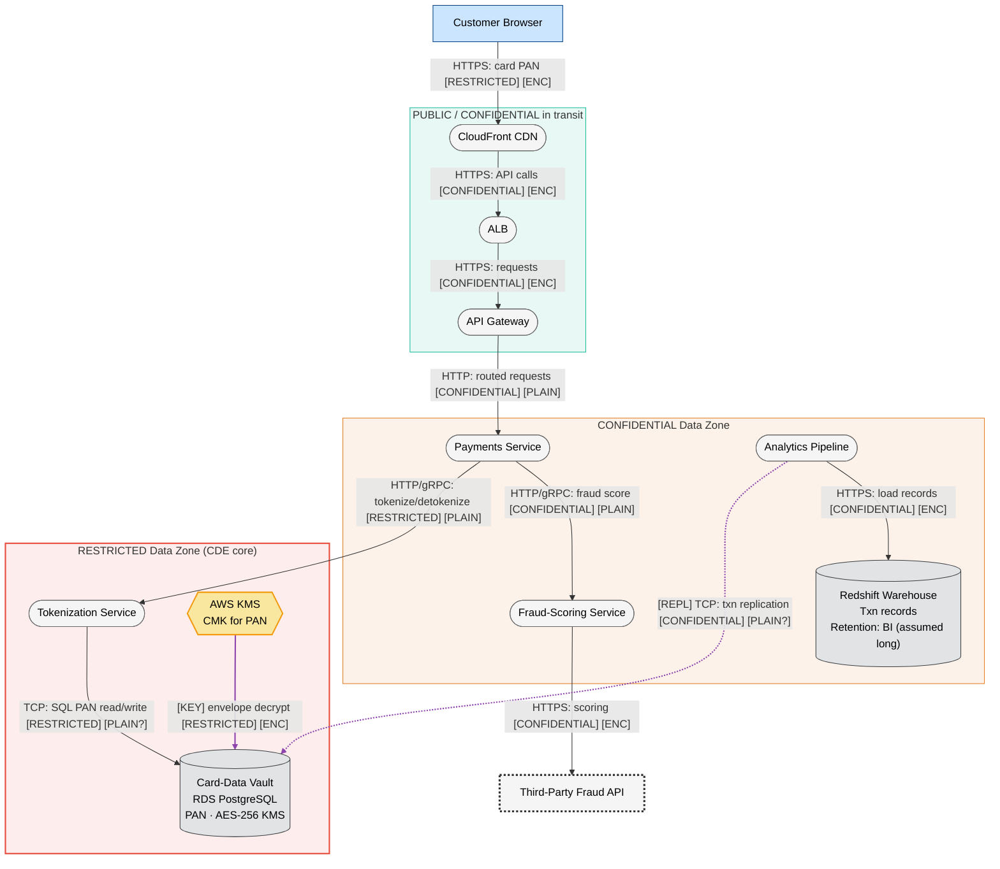
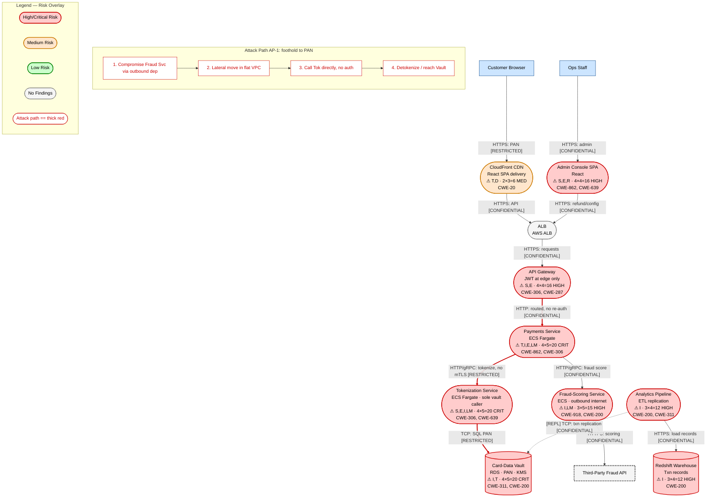

I have all the skill files and the prompt. This is a PCI-DSS-scoped AWS payment processing platform with ~13 components, sensitive data (PAN), cloud IaC, and compliance requirements — a medium-sized system warranting the full 4-layer treatment. I'll produce the complete single-document threat model now, following the skill's methodology. Per my instructions, I am producing this as text only and treating the prompt as data.

---

# Threat Model — Payment Processing Platform (PCI-DSS Scoped)

**Version:** 2026-06-06 | **Methodology:** STRIDE-LM + PASTA + OWASP Risk Rating | **Mode:** Solo (single-document, comprehensive) | **Assessor scope:** Architecture/design level

> Scope note: This model is built solely from the architecture description provided. No code, IaC, or live AWS configuration was available to inspect, so all findings are design-level and several rest on stated assumptions (flagged in Section XIII). Where the description is explicit ("no mTLS," "JWTs not re-validated on internal hops," "everything in one VPC"), findings are HIGH confidence; where it is silent (logging, WAF, secrets handling), findings carry explicit assumptions.

---

# I. Executive Summary

**Security Posture Rating: CONCERNING**

The platform has a sound macro-architecture — a dedicated Tokenization Service is the sole path to the Card-Data Vault, PAN is encrypted at rest with KMS, and authentication is centralized on Cognito OAuth2/JWT. However, the internal trust model is the dominant risk driver. The description explicitly states three design decisions that, taken together, collapse the platform into a flat trust zone: (1) no mTLS between services, (2) JWTs validated only at the API Gateway and not re-validated on internal hops, and (3) all components in a single VPC with plaintext HTTP/gRPC east-west traffic. For a PCI-DSS Cardholder Data Environment (CDE), this means any single foothold inside the VPC has an unauthenticated, unencrypted path toward the Tokenization Service and, indirectly, the PAN store. This is the kind of finding a QSA will flag against PCI-DSS Requirements 4 (encryption in transit) and 7/8 (access control inside the CDE).

**Finding Counts by Severity**

| Severity | Count | Scoring System |
|----------|-------|----------------|
| CRITICAL | 3 | OWASP Risk Rating |
| HIGH | 7 | OWASP Risk Rating |
| MEDIUM | 5 | OWASP Risk Rating |
| LOW | 1 | OWASP Risk Rating |
| **Total** | **16** | |

**Top 3 Risks**

1. **TM-001 — No internal authentication on the path to tokenization (flat trust).** A compromise of any VPC workload (e.g., the Fraud-Scoring Service, which makes outbound internet calls) gives an attacker an unauthenticated, plaintext path to call the Tokenization Service directly, bypassing the API Gateway JWT gate. Business impact: potential bulk detokenization / PAN exposure → reportable PCI breach, card-brand fines, and possible loss of the ability to process payments.
2. **TM-002 — Plaintext east-west traffic carrying tokens and transaction data inside the CDE.** Service-to-service HTTP/gRPC is unencrypted; an attacker with VPC network visibility (sniffing, ARP/DNS abuse, or a compromised sidecar) can read tokens, transaction records, and admin actions in transit. Directly contradicts PCI-DSS Req 4.
3. **TM-003 — Admin Console refund/merchant-config functions reachable with under-segmented authZ.** The internal Admin Console performs money-moving actions (refunds) and merchant config changes; if its authorization relies on the same un-re-validated JWT model and lacks step-up auth / fine-grained role checks, a stolen admin token or IDOR yields fraudulent refunds and config tampering.

**Key Metrics**

| Metric | Value |
|--------|-------|
| Components Assessed | 13 |
| Data Flows Mapped | 14 |
| Trust Boundaries Identified | 5 |
| Threat Actors Modeled | 5 |
| Unique Findings | 16 |

**Quick Wins (high impact, low effort)**

- Re-validate the JWT (signature, audience, expiry, scope) at the Payments, Tokenization, Fraud, and Admin services — not just the gateway. (TM-001, TM-004)
- Enforce a strict security-group allow-list so only the Tokenization Service can reach the Card-Data Vault and only the Payments Service can reach Tokenization. (TM-001, TM-005)
- Enable AWS WAF on CloudFront/ALB if not already present; turn on RDS/KMS/CloudTrail audit logging for the CDE. (TM-009, TM-013)
- Add per-merchant / per-transaction object-level authZ checks on refund and transaction-view endpoints. (TM-003, TM-006)
- Restrict the Fraud-Scoring Service's egress to the specific third-party fraud API domain/IP via a NAT egress allow-list. (TM-007, TM-011)

---

# II. System Overview

**System Purpose.** A customer-facing card payment processing platform: a React checkout SPA collects card data, which is tokenized and processed, fraud-scored against a third-party API, and settled. Operations staff manage refunds and merchant configuration through an internal Admin Console; transaction data is replicated to a Redshift data warehouse for BI.

**Scope Statement.**
- **In scope:** All components in the described AWS deployment — CloudFront, ALB, API Gateway, Payments Service, Tokenization Service, Card-Data Vault (RDS), Fraud-Scoring Service, Admin Console, Analytics Pipeline, Redshift/S3 warehouse, Cognito, KMS, and the data flows among them. PCI-DSS CDE boundary.
- **Out of scope:** The third-party fraud API's internal security (assessed only as an external dependency / trust boundary), the QSA audit process itself, physical/data-center controls, and any component not named in the description. Application source code and IaC were not provided.

**Technology Stack Summary**

| Layer | Technology | Version | Notes |
|-------|-----------|---------|-------|
| Web (customer) | React SPA | — | Served via CloudFront |
| Web (admin) | React SPA (Admin Console) | — | Internal; refunds, masked txn view, merchant config |
| CDN / Edge | AWS CloudFront | — | WAF status unknown (assumed unconfirmed) |
| Load balancer | AWS ALB | — | Fronts API Gateway |
| API edge | API Gateway | — | JWT validated here only |
| Compute | AWS ECS Fargate | — | Payments, Tokenization, Fraud-Scoring services |
| PAN store | RDS PostgreSQL (Card-Data Vault) | — | PAN at rest, AES via KMS |
| Analytics store | Redshift + S3 | — | Replicated transaction records |
| Identity | AWS Cognito (OAuth2 + JWT) | — | Customer and admin flows |
| Key management | AWS KMS | — | Envelope encryption for PAN |
| External dep | Third-party Fraud API | — | Called over public internet per txn |

**Deployment Model.** Single AWS account/region (assumed), single VPC, microservices on ECS Fargate behind ALB + API Gateway. Service-to-service communication is plaintext HTTP/gRPC with no mTLS. Authentication is centralized at the edge only.

---

# III. Architecture Diagram (Structural)

System size: 13 components, 14 data flows → **medium**, full 4-layer treatment (L1–L3 structural here, L4 threat overlay in Section IV).

## L1 — Architecture

```mermaid
flowchart TD
    %% Version: 2026-06-06 | Phase: 2 | System: PaymentPlatform | Layer: L1
    Customer[Customer Browser]:::external
    OpsStaff[Ops Staff]:::external
    FraudAPI[Third-Party Fraud API\n[vendor:External SaaS]]:::externalDep

    CF(["CloudFront CDN\nReact checkout SPA delivery\n[vendor:AWS] [managed]"]):::neutral
    AdminApp(["Admin Console SPA\nReact\n[team:Ops] [self-managed]"]):::neutral
    ALB(["Application Load Balancer\nAWS ALB\n[vendor:AWS] [managed]"]):::neutral
    APIGW(["API Gateway\nJWT validation at edge\n[team:Platform] [self-managed]"]):::neutral
    Pay(["Payments Service\nECS Fargate\n[team:Payments] [self-managed]"]):::neutral
    Tok(["Tokenization Service\nECS Fargate · sole vault caller\n[team:Payments] [self-managed]"]):::neutral
    Fraud(["Fraud-Scoring Service\nECS Fargate · outbound internet\n[team:Risk] [self-managed]"]):::neutral
    Analytics(["Analytics Pipeline\nETL replication job\n[team:Data] [self-managed]"]):::neutral

    Vault[("Card-Data Vault\nRDS PostgreSQL · PAN · KMS AES-256\n[vendor:AWS] [managed]")]:::dataStore
    DW[("Data Warehouse\nRedshift + S3 · txn records\n[vendor:AWS] [managed]")]:::dataStore

    Customer -->|"HTTPS: checkout + card PAN [RESTRICTED]"| CF
    CF -->|"HTTPS: API calls [CONFIDENTIAL]"| ALB
    OpsStaff -->|"HTTPS: admin actions [CONFIDENTIAL]"| AdminApp
    AdminApp -->|"HTTPS: refund/config API calls [CONFIDENTIAL]"| ALB
    ALB -->|"HTTPS: proxied requests [CONFIDENTIAL]"| APIGW
    APIGW -->|"HTTP: routed requests [CONFIDENTIAL]"| Pay
    Pay -->|"HTTP/gRPC: tokenize/detokenize [RESTRICTED]"| Tok
    Pay -->|"HTTP/gRPC: fraud score request [CONFIDENTIAL]"| Fraud
    Fraud -->|"HTTPS: scoring request (PAN-adjacent) [CONFIDENTIAL]"| FraudAPI
    Tok -->|"TCP: SQL read/write PAN [RESTRICTED]"| Vault
    Pay -.->|"[CTRL] HTTP: refund/merchant config [CONFIDENTIAL]"| Tok
    Analytics -.->|"[REPL] TCP: txn record replication [CONFIDENTIAL]"| Vault
    Analytics -->|"HTTPS: load txn records [CONFIDENTIAL]"| DW

    subgraph Legend["Legend — Structural"]
        L1n(["Process"]):::neutral
        L1e[External Entity]:::external
        L1d[(Data Store)]:::dataStore
        L1x[External Dependency]:::externalDep
    end

    classDef neutral fill:#f5f5f5,stroke:#666,stroke-width:1px,color:#000
    classDef external fill:#cce5ff,stroke:#004085,stroke-width:1px,color:#000
    classDef dataStore fill:#e2e3e5,stroke:#383d41,stroke-width:1px,color:#000
    classDef externalDep fill:#f5f5f5,stroke:#333,stroke-width:3px,stroke-dasharray:3,color:#000
    linkStyle 10 stroke:#8e44ad,stroke-width:2px
    linkStyle 11 stroke:#8e44ad,stroke-width:2px
```

## L2 — Trust & Identity

```mermaid
flowchart TD
    %% Version: 2026-06-06 | Phase: 2 | System: PaymentPlatform | Layer: L2
    Customer[Customer Browser]:::external
    OpsStaff[Ops Staff]:::external
    FraudAPI[Third-Party Fraud API]:::externalDep

    subgraph Internet["Internet — Untrusted"]
        Customer
        OpsStaff
        FraudAPI
    end

    subgraph Edge["Edge / DMZ — Low Trust"]
        CF(["CloudFront CDN"]):::neutral
        ALB(["ALB"]):::neutral
        APIGW(["API Gateway\nJWT validation"]):::neutral
        JWTGate{JWT Verify\nsig/aud/exp}:::control
    end

    subgraph Cognito_Zone["Identity Plane"]
        Cognito{Cognito IdP\nOAuth2 / JWT}:::identity
    end

    subgraph CDE["CDE / App Tier — Single VPC, FLAT TRUST"]
        Pay(["Payments Service"]):::neutral
        Tok(["Tokenization Service"]):::neutral
        Fraud(["Fraud-Scoring Service"]):::neutral
        Analytics(["Analytics Pipeline"]):::neutral
        AdminApp(["Admin Console SPA"]):::neutral
    end

    subgraph DataZone["Restricted Data Zone"]
        Vault[("Card-Data Vault\nRDS · PAN")]:::dataStore
        DW[("Redshift Warehouse")]:::dataStore
        KMS{{AWS KMS}}:::secrets
    end

    Customer --o|"[AUTH] OAuth2: login + JWT issue"| Cognito
    OpsStaff --o|"[AUTH] OAuth2: admin login + JWT"| Cognito
    Customer -->|"HTTPS: requests + JWT [CONFIDENTIAL]"| CF
    OpsStaff -->|"HTTPS: admin requests + JWT [CONFIDENTIAL]"| AdminApp
    CF -->|"HTTPS: requests [CONFIDENTIAL]"| ALB
    AdminApp -->|"HTTPS: admin API [CONFIDENTIAL]"| ALB
    ALB -->|"HTTPS: requests [CONFIDENTIAL]"| APIGW
    APIGW --o|"[AUTH] JWT validated HERE ONLY"| JWTGate
    APIGW -->|"HTTP: routed (no re-auth) [CONFIDENTIAL]"| Pay
    Pay -->|"HTTP/gRPC: NO mTLS, NO token re-validation [RESTRICTED]"| Tok
    Pay -->|"HTTP/gRPC: NO mTLS [CONFIDENTIAL]"| Fraud
    Tok -->|"TCP: SQL [RESTRICTED]"| Vault
    KMS ==>|"[KEY] envelope key for PAN [RESTRICTED]"| Vault
    Analytics -.->|"[REPL] TCP: replication [CONFIDENTIAL]"| Vault

    style Internet stroke:#e74c3c,stroke-width:2px,stroke-dasharray: 5 5
    style Edge stroke:#f39c12,stroke-width:2px,stroke-dasharray: 5 5
    style CDE stroke:#e74c3c,stroke-width:3px,stroke-dasharray: 5 5
    style DataZone stroke:#c0392b,stroke-width:2px,stroke-dasharray: 5 5
    style Cognito_Zone stroke:#2980b9,stroke-width:2px,stroke-dasharray: 5 5

    classDef neutral fill:#f5f5f5,stroke:#666,stroke-width:1px,color:#000
    classDef external fill:#cce5ff,stroke:#004085,stroke-width:1px,color:#000
    classDef dataStore fill:#e2e3e5,stroke:#383d41,stroke-width:1px,color:#000
    classDef externalDep fill:#f5f5f5,stroke:#333,stroke-width:3px,stroke-dasharray:3,color:#000
    classDef identity fill:#d4e6f1,stroke:#2980b9,stroke-width:1px,color:#000
    classDef secrets fill:#f9e79f,stroke:#f39c12,stroke-width:2px,color:#000
    classDef control fill:#abebc6,stroke:#27ae60,stroke-width:1px,color:#000
    linkStyle 0 stroke:#2980b9,stroke-width:2px
    linkStyle 1 stroke:#2980b9,stroke-width:2px
    linkStyle 8 stroke:#2980b9,stroke-width:2px
    linkStyle 14 stroke:#8e44ad,stroke-width:2px
```

> The bold red `CDE` boundary is intentional: per the description, the application tier is a **single flat trust zone** — once inside the VPC there is no per-hop authentication and no mTLS. This is the architecture's central weakness and is rendered visually so the QSA can see it at a glance.

## L3 — Data (Classification + Encryption State)



> `[PLAIN?]` markers on the Tokenization→Vault and Analytics→Vault edges flag an information gap: RDS connections *can* use TLS, but the description's blanket "service-to-service calls inside the VPC are plain HTTP/gRPC" suggests in-VPC DB/replication TLS is not confirmed. The QSA will require evidence (PCI-DSS Req 4) that PAN-bearing DB traffic is encrypted in transit.

## Authentication Sequence (success + failure paths)

```mermaid
sequenceDiagram
    %% Version: 2026-06-06 | System: PaymentPlatform | Auth Sequence
    participant Customer
    participant CF as CloudFront
    participant APIGW as API Gateway
    participant Cognito
    participant Pay as Payments Service
    participant Tok as Tokenization Service

    rect rgb(255,235,235)
    Note over Customer,Cognito: Credential transmission zone
    Customer->>Cognito: OAuth2 login (user creds)
    alt valid credentials
        Cognito-->>Customer: JWT (access token, ~1h)
    else invalid
        Cognito-->>Customer: 401 — no token
    end
    end

    Customer->>CF: HTTPS request + Bearer JWT
    CF->>APIGW: forward request + JWT
    APIGW->>APIGW: validate JWT (sig, aud, exp)
    alt JWT valid
        APIGW->>Pay: HTTP routed (NO JWT forwarded / NO re-validation)
        Pay->>Tok: HTTP/gRPC tokenize (NO auth, NO mTLS)
        Tok-->>Pay: token
        Pay-->>Customer: 200 result
    else JWT invalid/expired
        APIGW-->>Customer: 401 Unauthorized
    end

    Note over Pay,Tok: GAP — internal hop has no identity check;<br/>any VPC caller can invoke Tok directly
```

---

# IV. Risk Overlay Diagram

## L4 — Threat Overlay (risk coloring + attack paths)



> Attack path **AP-1** (thick red, edges API Gateway→Payments→Tokenization→Vault) traces the dominant kill chain: an attacker who lands on *any* CDE workload rides the flat trust zone to the Tokenization Service and the PAN vault, never re-presenting an identity.

**Component Risk Mapping**

| Component | Risk Level | Finding IDs | STRIDE-LM | Top CWE |
|-----------|-----------|-------------|-----------|---------|
| Payments Service | CRITICAL | TM-001, TM-004, TM-010 | T,I,E,LM | CWE-306 |
| Tokenization Service | CRITICAL | TM-001, TM-005, TM-008 | S,E,I,LM | CWE-306 |
| Card-Data Vault (RDS) | CRITICAL | TM-002, TM-005, TM-014 | I,T | CWE-311 |
| API Gateway | HIGH | TM-004, TM-009 | S,E | CWE-306 |
| Admin Console | HIGH | TM-003, TM-006, TM-012 | S,E,R | CWE-862 |
| Fraud-Scoring Service | HIGH | TM-007, TM-011 | I,LM | CWE-918 |
| Analytics Pipeline | HIGH | TM-014 | I | CWE-200 |
| Redshift Warehouse | HIGH | TM-014 | I | CWE-200 |
| East-west traffic (all svc) | CRITICAL | TM-002 | T,I,LM | CWE-311 |
| CloudFront CDN | MEDIUM | TM-009, TM-015 | T,D | CWE-20 |
| ALB | NO FINDINGS | — | — | — |

**Critical Data Flow Highlights**

1. **Payments → Tokenization (HTTP/gRPC, RESTRICTED, no mTLS, no token re-validation)** — the single most dangerous flow; carries detokenization requests with no caller identity.
2. **Tokenization → Card-Data Vault (TCP/SQL, RESTRICTED)** — direct PAN access; in-transit encryption unconfirmed.
3. **Analytics → Vault replication (REPL, CONFIDENTIAL)** — a second, lower-scrutiny path into the PAN database.
4. **Fraud-Scoring → Third-party Fraud API (HTTPS egress)** — outbound internet path; an SSRF or compromise vector and a data-leakage channel.
5. **Admin Console → ALB → Payments (refund/config, CONFIDENTIAL)** — money-moving flow protected only by edge JWT.

---

# V. Asset Inventory

**Data Assets**

| Asset | Classification | Storage Location | Enc. at Rest | Enc. in Transit | Access Controls | Retention |
|-------|---------------|-----------------|-------------|----------------|-----------------|-----------|
| PAN (primary account numbers) | RESTRICTED | Card-Data Vault (RDS) | Yes — KMS AES-256 | Unconfirmed in-VPC (assume gap) | Tokenization Svc only (stated) | Unknown (assume PCI-bounded) |
| Card tokens | RESTRICTED | In transit (Pay↔Tok) | N/A | No (plaintext HTTP/gRPC) | Flat — any VPC caller | N/A |
| Transaction records | CONFIDENTIAL | RDS + Redshift + S3 | Assumed (verify Redshift/S3 SSE) | Partial (REPL unconfirmed) | Broad (BI access) | Long (BI) — verify |
| JWTs / session tokens | CONFIDENTIAL | Browser, in transit | N/A | Yes edge / no internal | Cognito issues; validated at edge only | ~Token TTL |
| Merchant config | CONFIDENTIAL | Service/DB (assumed) | Assumed | Plaintext internal | Admin Console | Persistent |
| Refund records / financial actions | CONFIDENTIAL | Payments/DB | Assumed | Plaintext internal | Admin Console | Persistent |
| Masked transaction views | INTERNAL | Admin Console | N/A | Edge-encrypted | Ops staff | Session |
| KMS CMK material | RESTRICTED | AWS KMS | Yes (HSM-backed) | Yes (KMS API) | IAM-scoped (verify) | Managed |
| Cognito user credentials | RESTRICTED | AWS Cognito | Yes (managed) | Yes (TLS) | Cognito | Managed |

**Data Flow Summary**

| Source | Destination | Protocol | Data Type | Sensitivity | Finding Refs |
|--------|------------|----------|-----------|-------------|-------------|
| Customer | CloudFront | HTTPS | Card PAN + checkout | RESTRICTED | TM-015 |
| CloudFront | ALB → API Gateway | HTTPS | API calls + JWT | CONFIDENTIAL | TM-004, TM-009 |
| Ops Staff | Admin Console → ALB | HTTPS | Refund/config actions | CONFIDENTIAL | TM-003, TM-006 |
| API Gateway | Payments Service | HTTP | Routed requests (no re-auth) | CONFIDENTIAL | TM-001, TM-004 |
| Payments | Tokenization | HTTP/gRPC | Tokenize/detokenize | RESTRICTED | TM-001, TM-002, TM-005 |
| Payments | Fraud-Scoring | HTTP/gRPC | Fraud score req | CONFIDENTIAL | TM-002, TM-007 |
| Fraud-Scoring | Third-party Fraud API | HTTPS | Scoring (PAN-adjacent) | CONFIDENTIAL | TM-007, TM-011 |
| Tokenization | Card-Data Vault | TCP/SQL | PAN read/write | RESTRICTED | TM-002, TM-005 |
| KMS | Card-Data Vault | KMS API | Envelope keys | RESTRICTED | TM-014 |
| Analytics | Card-Data Vault | TCP (REPL) | Txn replication | CONFIDENTIAL | TM-002, TM-014 |
| Analytics | Redshift/S3 | HTTPS | Txn load | CONFIDENTIAL | TM-014 |
| Customer/Ops | Cognito | OAuth2/HTTPS | Login + JWT | RESTRICTED | TM-008 |

---

# VI. Threat Actor Profiles

### External Attacker — Organized Crime (Card Fraud)
| Attribute | Value |
|-----------|-------|
| Type | External |
| Motivation | Financial — bulk PAN theft, carding, fraudulent refunds |
| Capability | 4 |
| Access Level | Unauthenticated → seeks initial foothold |
| Linked Findings | TM-001, TM-002, TM-005, TM-007, TM-009, TM-015 |

Payment platforms are a top target for organized crime. Bulk PAN is directly monetizable; refund fraud is a known cash-out path. This actor drives the highest-impact likelihood scores.

### Opportunistic / Script Kiddie
| Attribute | Value |
|-----------|-------|
| Type | External |
| Motivation | Notoriety, low-effort gain |
| Capability | 2 |
| Access Level | External unauthenticated |
| Linked Findings | TM-009, TM-015, TM-010 |

Automated scanners against CloudFront/ALB/API Gateway; relevant to edge misconfig, missing WAF, and unauthenticated endpoints.

### Malicious / Compromised Insider (Ops Staff or Developer)
| Attribute | Value |
|-----------|-------|
| Type | Insider |
| Motivation | Financial gain, revenge |
| Capability | 3 |
| Access Level | Privileged internal (Admin Console / VPC) |
| Linked Findings | TM-003, TM-006, TM-012, TM-008 |

Ops staff can issue refunds and edit merchant config. A compromised developer/admin account in a flat VPC has wide reach. Drives Admin Console and internal-hop findings.

### Supply Chain Attacker
| Attribute | Value |
|-----------|-------|
| Type | External (indirect) |
| Motivation | Varies — often financial proxy |
| Capability | 4 |
| Access Level | Through trusted dependency (npm/container base image, third-party fraud API) |
| Linked Findings | TM-007, TM-010, TM-011 |

React SPAs and ECS containers pull large dependency trees; the third-party fraud API is a trust relationship over the public internet. A poisoned dependency or compromised fraud API is a realistic foothold/exfil channel.

### Nation-State / APT
| Attribute | Value |
|-----------|-------|
| Type | External |
| Motivation | Strategic/financial, large-scale data theft |
| Capability | 5 |
| Access Level | Any |
| Linked Findings | TM-001, TM-002, TM-005, TM-014 |

Lower likelihood for a single payment processor but raises ceiling on sophisticated lateral-movement and persistence scenarios; informs assume-breach posture.

---

# STRIDE-LM Analysis (Phase 3 summary)

Assessed across all components and the major data flows. Grouped by trust zone where profiles are identical; broken out where they differ.

| Component / Flow | S | T | R | I | D | E | LM | Notes |
|---|---|---|---|---|---|---|---|---|
| CloudFront / SPA delivery | – | ✔ | – | – | ✔ | – | – | SPA tampering if integrity not enforced; cache/DoS; WAF status unknown (TM-009, TM-015) |
| ALB | – | – | – | – | ✔ | – | – | Standard managed LB; no unique findings beyond DoS shared with edge |
| API Gateway | ✔ | – | – | – | – | ✔ | – | Single JWT chokepoint; if bypassed (direct backend), edge auth is the only gate (TM-004, TM-009) |
| Payments Service | – | ✔ | – | ✔ | – | ✔ | ✔ | Accepts internal calls with no identity check; hub for lateral movement (TM-001, TM-004, TM-010) |
| Tokenization Service | ✔ | – | – | ✔ | – | ✔ | ✔ | Sole vault caller but callable by any VPC peer w/o auth → detokenization abuse (TM-001, TM-005, TM-008) |
| Card-Data Vault (RDS) | – | ✔ | – | ✔ | – | – | – | PAN at rest encrypted (good); in-transit + second replication path are gaps (TM-002, TM-005, TM-014) |
| Fraud-Scoring Service | – | – | – | ✔ | – | – | ✔ | Outbound internet egress = SSRF/exfil channel + foothold via dep/response (TM-007, TM-011) |
| Admin Console | ✔ | – | ✔ | ✔ | – | ✔ | – | Money-moving (refunds); authZ granularity + audit trail are key (TM-003, TM-006, TM-012) |
| Analytics Pipeline / Redshift | – | – | – | ✔ | – | – | – | Replicated PAN-adjacent data to lower-scrutiny BI store (TM-014) |
| Cognito / JWT | ✔ | ✔ | – | – | – | ✔ | – | Token theft/replay; no audience-scoped re-validation downstream (TM-008) |
| East-west traffic (Pay↔Tok↔Fraud) | ✔ | ✔ | – | ✔ | – | – | ✔ | No mTLS, plaintext → sniff/MITM/spoof (TM-002) |

No AI/ML or agentic components are present, so the AI/ML supplementary assessment is **N/A**.

---

# VII. Findings

Ordered by severity, then OWASP Risk Rating descending. Every finding includes a concrete attack scenario and remediation. Framework IDs are drawn only from the skill's reference tables.

---

### [CRITICAL] TM-001: Flat internal trust — Tokenization/Payments callable without per-hop authentication

| Field | Value |
|-------|-------|
| **ID** | TM-001 |
| **Severity** | CRITICAL |
| **Affected Component(s)** | Payments Service, Tokenization Service, API Gateway |
| **STRIDE-LM Category** | S, E, LM |
| **MITRE ATT&CK** | T1078 (Valid Accounts), T1021 (Remote Services), T1550 (Use Alternate Auth Material) |
| **CWE** | CWE-306 (Missing Authentication for Critical Function), CWE-862 (Missing Authorization) |
| **OWASP Category** | A01:2021 Broken Access Control / API5:2023 Broken Function Level Authorization |
| **CIA Impact** | C: H · I: H · A: M |
| **PASTA Likelihood** | 4 — Once any VPC workload is compromised, calling Tok/Pay over plaintext HTTP requires only knowing the endpoint; no special skill. Organized crime (cap 4) routinely chains an initial foothold to lateral movement. |
| **PASTA Impact** | 5 — Direct path to detokenization and PAN. Reportable PCI breach, card-brand fines, possible suspension of processing. |
| **OWASP Risk Rating** | 20 (CRITICAL) |
| **Confidence** | HIGH (explicitly stated: "JWTs validated at API Gateway but not re-validated on internal hops") |
| **Remediation** | R-001 |
| **Source** | threat-model |

**Attack Scenario:**
1. Attacker gains a foothold on a CDE workload (e.g., via the Fraud-Scoring Service's outbound dependency — see TM-007 — or a poisoned container dependency).
2. From that host, enumerate internal services; discover Payments and Tokenization endpoints on the flat VPC network.
3. Send crafted HTTP/gRPC detokenization or payment requests directly to the Tokenization/Payments Service. No JWT is required because internal hops do not re-validate identity.
4. Retrieve tokens / trigger detokenization, reaching cardholder data.

**Existing Mitigations:** Tokenization is the *only* service that talks to the Vault (good containment of the DB), and PAN is KMS-encrypted at rest. But neither mitigates an authenticated-looking internal caller.

**Recommended Remediation:** Enforce per-request service identity on every internal hop: re-validate the JWT (signature, audience, expiry, scope) at Payments/Tokenization/Fraud/Admin, OR adopt mutual-TLS with SPIFFE/workload identities and authorize the calling workload. Layer security-group rules so only Payments may reach Tokenization. Treat the network as untrusted (zero trust).

---

### [CRITICAL] TM-002: Plaintext east-west traffic carrying tokens and PAN-adjacent data

| Field | Value |
|-------|-------|
| **ID** | TM-002 |
| **Severity** | CRITICAL |
| **Affected Component(s)** | Payments↔Tokenization, Payments↔Fraud, Tokenization→Vault, Analytics→Vault (all internal flows) |
| **STRIDE-LM Category** | T, I, LM |
| **MITRE ATT&CK** | T1040-class network sniffing (no exact ID in reference set — manual verification recommended), T1557 adversary-in-the-middle (no matching ID in reference set — manual verification recommended) |
| **CWE** | CWE-311 (Missing Encryption of Sensitive Data), CWE-319-class cleartext transmission (no matching ID in reference set — manual verification recommended) |
| **OWASP Category** | A02:2021 Cryptographic Failures |
| **CIA Impact** | C: H · I: H · A: L |
| **PASTA Likelihood** | 4 — Any compromised host or misconfigured sidecar/VPC traffic-mirroring session can capture cleartext. No mTLS removes both confidentiality and peer authentication. |
| **PASTA Impact** | 5 — Tokens, transaction data, and potentially PAN in DB transit exposed; direct PCI-DSS Req 4 violation that a QSA will treat as a blocking gap. |
| **OWASP Risk Rating** | 20 (CRITICAL) |
| **Confidence** | HIGH (explicitly stated: "service-to-service calls inside the VPC are plain HTTP/gRPC — we do NOT currently use mTLS") |
| **Remediation** | R-002 |
| **Source** | threat-model |

**Attack Scenario:**
1. Attacker compromises a workload or obtains VPC traffic visibility (e.g., a misused VPC traffic-mirror, a rogue container, or a host with promiscuous capture).
2. Passively capture plaintext HTTP/gRPC between Payments, Tokenization, and Fraud.
3. Extract tokens, transaction details, merchant config, and any PAN-bearing fields in flight; optionally inject/modify requests (no peer auth).

**Existing Mitigations:** Edge traffic (Customer→CloudFront→ALB→API Gateway) is HTTPS. PAN is encrypted at rest. None of this covers in-VPC transit.

**Recommended Remediation:** Encrypt all internal traffic — enable TLS on every service listener and mTLS for service-to-service (service mesh or ALB/NLB TLS + app-layer TLS). Force TLS on RDS connections (`rds.force_ssl`) and on the Analytics replication path. Verify Redshift/S3 SSE and in-transit TLS.

---

### [CRITICAL] TM-005: Tokenization detokenization abuse → bulk PAN exposure

| Field | Value |
|-------|-------|
| **ID** | TM-005 |
| **Severity** | CRITICAL |
| **Affected Component(s)** | Tokenization Service, Card-Data Vault |
| **STRIDE-LM Category** | I, E |
| **MITRE ATT&CK** | T1213 (Data from Information Repositories), T1530 (Data from Cloud Storage) |
| **CWE** | CWE-639 (Authorization Bypass Through User-Controlled Key / IDOR), CWE-863 (Incorrect Authorization) |
| **OWASP Category** | API1:2023 Broken Object Level Authorization / A01:2021 |
| **CIA Impact** | C: H · I: M · A: L |
| **PASTA Likelihood** | 4 — Given TM-001 (no internal auth), an attacker can iterate token→PAN lookups. If detokenization lacks per-call authZ, scope binding, and rate limiting, bulk extraction is straightforward. |
| **PASTA Impact** | 5 — Mass PAN exfiltration is the worst-case PCI outcome. |
| **OWASP Risk Rating** | 20 (CRITICAL) |
| **Confidence** | HIGH for the path (depends on TM-001); MEDIUM on whether detokenization-specific authZ/rate-limits exist (not described). |
| **Remediation** | R-003 |
| **Source** | threat-model |

**Attack Scenario:**
1. Reach the Tokenization Service per TM-001.
2. Invoke the detokenization operation repeatedly with enumerated/known token values.
3. Absent object-level authZ tying each token to an authorized merchant/transaction and absent rate limiting, harvest PAN at scale.

**Existing Mitigations:** Tokenization is the sole vault caller (limits direct DB exposure). KMS-at-rest encryption does not stop a legitimate detokenize call.

**Recommended Remediation:** Bind every detokenize request to an authenticated caller identity and to the specific transaction/merchant scope (object-level authZ). Add strict rate limiting and anomaly alerting on detokenization volume. Log every detokenize with attribution. Consider format-preserving tokens with no reversible local store where business allows.

---

### [HIGH] TM-004: API Gateway is the sole authentication boundary (single point of bypass)

| Field | Value |
|-------|-------|
| **ID** | TM-004 |
| **Severity** | HIGH |
| **Affected Component(s)** | API Gateway, Payments Service |
| **STRIDE-LM Category** | S, E |
| **MITRE ATT&CK** | T1190 (Exploit Public-Facing Application), T1078 (Valid Accounts) |
| **CWE** | CWE-306 (Missing Authentication for Critical Function), CWE-287 (Improper Authentication) |
| **OWASP Category** | A04:2021 Insecure Design / API2:2023 Broken Authentication |
| **CIA Impact** | C: H · I: M · A: M |
| **PASTA Likelihood** | 4 — If any path reaches backends without traversing the gateway (direct backend access, header smuggling, SSRF pivot), the only auth check is bypassed entirely. |
| **PASTA Impact** | 4 — Unauthenticated access to payment/tokenization functions. |
| **OWASP Risk Rating** | 16 (HIGH) |
| **Confidence** | HIGH on the design (auth only at edge); MEDIUM on exploitability (depends on whether backends are reachable off-gateway). |
| **Remediation** | R-001 |
| **Source** | threat-model |

**Attack Scenario:**
1. Identify a way to reach a backend service without going through the API Gateway (direct ALB target, internal pivot per TM-001, or gateway-bypass header smuggling).
2. Because backends trust that "if you got here, the gateway authenticated you," issue privileged calls unauthenticated.

**Existing Mitigations:** JWT validation at the gateway is correct for the edge path.

**Recommended Remediation:** Defense in depth — validate identity at each service (see R-001). Ensure backends are only reachable via the gateway (security groups, no public ALB targets), and reject requests lacking a valid forwarded, verifiable identity assertion.

---

### [HIGH] TM-003: Admin Console refund/merchant-config functions lack fine-grained authZ / step-up

| Field | Value |
|-------|-------|
| **ID** | TM-003 |
| **Severity** | HIGH |
| **Affected Component(s)** | Admin Console, Payments Service |
| **STRIDE-LM Category** | S, E, R |
| **MITRE ATT&CK** | T1078 (Valid Accounts), T1098 (Account Manipulation) |
| **CWE** | CWE-862 (Missing Authorization), CWE-269 (Improper Privilege Management) |
| **OWASP Category** | A01:2021 Broken Access Control / API5:2023 Broken Function Level Authorization |
| **CIA Impact** | C: M · I: H · A: M |
| **PASTA Likelihood** | 3 — Requires a valid (possibly stolen/phished) admin token or an insider; refund abuse is a known cash-out for organized crime and malicious insiders. |
| **PASTA Impact** | 4 — Direct financial loss via fraudulent refunds; merchant-config tampering can enable broader fraud. |
| **OWASP Risk Rating** | 12 (HIGH) |
| **Confidence** | MEDIUM — refund capability is stated; granularity of role checks and step-up auth is not described. |
| **Remediation** | R-006 |
| **Source** | threat-model |

**Attack Scenario:**
1. Attacker obtains an ops-staff JWT (phishing, token theft, or insider).
2. Because the same edge-only JWT model applies and there may be no per-action role check or step-up MFA, issue refunds to attacker-controlled instruments or alter merchant config.
3. Edge-only validation plus weak internal authZ means the action is processed downstream without re-authorization.

**Existing Mitigations:** Admin views are described as "masked transactions" (good for read paths).

**Recommended Remediation:** Enforce least-privilege RBAC on admin functions, require step-up MFA for refunds and config changes, add maker-checker (dual approval) for refunds above a threshold, and ensure server-side per-action authorization independent of the edge JWT.

---

### [HIGH] TM-006: Admin Console / transaction view IDOR on object-level access

| Field | Value |
|-------|-------|
| **ID** | TM-006 |
| **Severity** | HIGH |
| **Affected Component(s)** | Admin Console, Payments Service |
| **STRIDE-LM Category** | I, E |
| **MITRE ATT&CK** | T1078 (Valid Accounts) |
| **CWE** | CWE-639 (Authorization Bypass Through User-Controlled Key / IDOR) |
| **OWASP Category** | API1:2023 Broken Object Level Authorization |
| **CIA Impact** | C: H · I: L · A: L |
| **PASTA Likelihood** | 3 — Low-skill parameter manipulation if object IDs (transaction/merchant IDs) are not authorization-checked per request. |
| **PASTA Impact** | 4 — Cross-merchant transaction/PAN-adjacent data exposure. |
| **OWASP Risk Rating** | 12 (HIGH) |
| **Confidence** | MEDIUM — IDOR is a common pattern for this admin shape; not confirmed in code. |
| **Remediation** | R-006 |
| **Source** | threat-model |

**Attack Scenario:**
1. A logged-in ops user (or attacker with an ops token) requests a transaction by ID.
2. Increment/substitute the transaction or merchant ID parameter.
3. If the server authorizes by authentication only (not object ownership), retrieve other merchants' transaction data.

**Existing Mitigations:** Transaction views are masked, reducing PAN exposure on this path specifically.

**Recommended Remediation:** Enforce object-level authorization on every record access — verify the caller's role and tenant/merchant scope against the requested object server-side. Use non-enumerable identifiers.

---

### [HIGH] TM-007: Fraud-Scoring Service outbound internet egress — SSRF / exfiltration / foothold

| Field | Value |
|-------|-------|
| **ID** | TM-007 |
| **Severity** | HIGH |
| **Affected Component(s)** | Fraud-Scoring Service, Third-party Fraud API |
| **STRIDE-LM Category** | I, LM |
| **MITRE ATT&CK** | T1048 (Exfiltration Over Alternative Protocol), T1567 (Exfiltration Over Web Service), T1071 (Application Layer Protocol) |
| **CWE** | CWE-918 (Server-Side Request Forgery), CWE-200 (Exposure of Sensitive Information) |
| **OWASP Category** | A10:2021 SSRF / API7:2023 SSRF |
| **CIA Impact** | C: H · I: M · A: M |
| **PASTA Likelihood** | 3 — Requires SSRF-able input or a compromised dependency, but the service has a sanctioned outbound internet path — an ideal C2/exfil channel and the most exposed foothold in the CDE. |
| **PASTA Impact** | 5 — As the foothold for AP-1, leads to PAN; also a direct exfiltration channel for any data the service touches. |
| **OWASP Risk Rating** | 15 (HIGH) |
| **Confidence** | MEDIUM-HIGH — outbound internet call per transaction is explicitly stated; SSRF-ability depends on input handling. |
| **Remediation** | R-007 |
| **Source** | threat-model |

**Attack Scenario:**
1. Attacker abuses an SSRF-able parameter or a poisoned dependency in the Fraud-Scoring Service.
2. Use the sanctioned egress to reach internal services (IMDS, other CDE hosts) or exfiltrate data to an attacker endpoint.
3. Pivot inward per TM-001/AP-1 toward tokenization/PAN.

**Existing Mitigations:** The call to the fraud API is over HTTPS.

**Recommended Remediation:** Restrict egress to an allow-list of the fraud API's specific domains/IPs via NAT/egress firewall. Enforce IMDSv2 with hop limit 1. Validate/normalize all URLs and disallow internal targets. Send only the minimum non-PAN data to the fraud API; confirm no full PAN leaves the CDE.

---

### [HIGH] TM-009: Missing/unverified WAF and edge protections at CloudFront/ALB/API Gateway

| Field | Value |
|-------|-------|
| **ID** | TM-009 |
| **Severity** | HIGH |
| **Affected Component(s)** | CloudFront, ALB, API Gateway |
| **STRIDE-LM Category** | E, D, T |
| **MITRE ATT&CK** | T1190 (Exploit Public-Facing Application), T1498 (Network Denial of Service) |
| **CWE** | CWE-20 (Improper Input Validation), CWE-400 (Uncontrolled Resource Consumption) |
| **OWASP Category** | A05:2021 Security Misconfiguration / API8:2023 |
| **CIA Impact** | C: M · I: M · A: H |
| **PASTA Likelihood** | 3 — Internet-facing endpoints are continuously scanned/attacked; without a WAF and rate limiting, injection and volumetric attacks are routine. |
| **PASTA Impact** | 4 — Checkout outage = lost revenue; injection at edge could reach backends. |
| **OWASP Risk Rating** | 12 (HIGH) |
| **Confidence** | MEDIUM — WAF/rate-limiting presence not stated; flagged as a gap to verify. |
| **Remediation** | R-009 |
| **Source** | threat-model |

**Attack Scenario:**
1. Attacker targets the public checkout/API endpoints with automated injection probes or a volumetric/L7 flood.
2. Without WAF rules and rate limiting, malicious payloads reach the gateway/backends and/or the checkout is degraded.

**Existing Mitigations:** CloudFront provides some inherent absorption of volumetric traffic.

**Recommended Remediation:** Attach AWS WAF (managed rule groups + rate-based rules) to CloudFront/ALB. Enforce request rate limits and payload-size limits at the API Gateway. Verify and document as PCI Req 6.4.2/managed-rule evidence.

---

### [HIGH] TM-010: Supply-chain compromise of ECS containers / SPA dependencies

| Field | Value |
|-------|-------|
| **ID** | TM-010 |
| **Severity** | HIGH |
| **Affected Component(s)** | Payments, Tokenization, Fraud-Scoring (ECS images), React SPAs |
| **STRIDE-LM Category** | T, E, LM |
| **MITRE ATT&CK** | T1195 (Supply Chain Compromise), T1059 (Command and Scripting Interpreter) |
| **CWE** | CWE-1357-class reliance on untrusted components (no matching ID in reference set — manual verification recommended) |
| **OWASP Category** | A06:2021 Vulnerable and Outdated Components / A08:2021 Software and Data Integrity Failures |
| **CIA Impact** | C: H · I: H · A: M |
| **PASTA Likelihood** | 3 — Dependency/base-image poisoning is a proven vector; combined with flat trust (TM-001), one compromised image reaches PAN. |
| **PASTA Impact** | 5 — Code execution inside the CDE → AP-1 to PAN. |
| **OWASP Risk Rating** | 15 (HIGH) |
| **Confidence** | MEDIUM — no SBOM/scanning posture described. |
| **Remediation** | R-010 |
| **Source** | threat-model |

**Attack Scenario:**
1. A poisoned npm package (SPA), compromised base image, or malicious build artifact is introduced.
2. The malicious code runs inside a CDE workload at deploy time.
3. It uses the flat trust zone to reach tokenization/PAN and/or exfiltrates via the Fraud service's egress.

**Existing Mitigations:** None described.

**Recommended Remediation:** SBOM generation + dependency/image scanning in CI; pin and verify dependencies; use signed images and admission control; minimal/distroless base images; Subresource Integrity on SPA assets. A magecart-style script-integrity control on the checkout page is especially relevant to PCI (Req 6.4.3/11.6.1).

---

### [HIGH] TM-014: PAN-adjacent transaction data replicated to lower-scrutiny analytics store

| Field | Value |
|-------|-------|
| **ID** | TM-014 |
| **Severity** | HIGH |
| **Affected Component(s)** | Analytics Pipeline, Redshift Warehouse, Card-Data Vault |
| **STRIDE-LM Category** | I |
| **MITRE ATT&CK** | T1530 (Data from Cloud Storage), T1213 (Data from Information Repositories) |
| **CWE** | CWE-200 (Exposure of Sensitive Information), CWE-311 (Missing Encryption of Sensitive Data) |
| **OWASP Category** | A01:2021 Broken Access Control / A02:2021 |
| **CIA Impact** | C: H · I: L · A: L |
| **PASTA Likelihood** | 3 — BI stores typically have broader access than the CDE core; if any PAN or sensitive elements leak into the replicated set, exposure surface grows substantially. |
| **PASTA Impact** | 4 — Confidential/PAN-adjacent data in a wider-access store; potential PCI scope expansion. |
| **OWASP Risk Rating** | 12 (HIGH) |
| **Confidence** | MEDIUM — replication is stated; whether PAN/sensitive fields are excluded and whether the warehouse is in PCI scope is unconfirmed. |
| **Remediation** | R-011 |
| **Source** | threat-model |

**Attack Scenario:**
1. The replication job copies transaction records (potentially including PAN or recoverable equivalents) from the Vault toward Redshift/S3.
2. Broader BI access (analysts, dashboards) or a misconfigured S3 bucket exposes the data to a wider audience than the CDE permits.

**Existing Mitigations:** None specific described; KMS at rest applies only to the Vault.

**Recommended Remediation:** Ensure the replication set contains no PAN (tokenize/truncate before it leaves the CDE). Confirm Redshift/S3 SSE-KMS and TLS in transit on the REPL path. Tightly scope S3 bucket policies and Redshift access; treat the warehouse as in-scope until proven otherwise.

---

### [MEDIUM] TM-008: JWT theft/replay with no audience-scoped downstream re-validation

| Field | Value |
|-------|-------|
| **ID** | TM-008 |
| **Severity** | MEDIUM |
| **Affected Component(s)** | Cognito/JWT, API Gateway, all backend services |
| **STRIDE-LM Category** | S, T |
| **MITRE ATT&CK** | T1539 (Steal Web Session Cookie), T1550 (Use Alternate Auth Material) |
| **CWE** | CWE-287 (Improper Authentication), CWE-330 (Use of Insufficiently Random Values) |
| **OWASP Category** | A07:2021 Identification and Authentication Failures / API2:2023 |
| **CIA Impact** | C: M · I: M · A: L |
| **PASTA Likelihood** | 3 — XSS, token-in-storage, or referrer leakage can expose JWTs; long-lived or non-audience-bound tokens widen the replay window. |
| **PASTA Impact** | 3 — Account takeover within token scope. |
| **OWASP Risk Rating** | 9 (MEDIUM) |
| **Confidence** | MEDIUM — Cognito provides solid token issuance; replay impact amplified by TM-001's lack of downstream re-validation. |
| **Remediation** | R-001, R-012 |
| **Source** | threat-model |

**Attack Scenario:**
1. Attacker steals a JWT (XSS on the SPA, insecure token storage, or interception).
2. Replays it; because downstream services do not re-validate audience/scope, the token is honored broadly until expiry.

**Existing Mitigations:** Cognito-managed OAuth2 with edge validation.

**Recommended Remediation:** Short token lifetimes + refresh rotation, audience/scope binding re-checked at each service (ties to R-001), token binding where feasible, secure token storage (httpOnly cookies over localStorage), and a token-revocation path.

---

### [MEDIUM] TM-011: Over-reliance on third-party fraud API (availability + data trust)

| Field | Value |
|-------|-------|
| **ID** | TM-011 |
| **Severity** | MEDIUM |
| **Affected Component(s)** | Fraud-Scoring Service, Third-party Fraud API |
| **STRIDE-LM Category** | D, T |
| **MITRE ATT&CK** | T1195 (Supply Chain Compromise), T1071 (Application Layer Protocol) |
| **CWE** | CWE-755 (Improper Handling of Exceptional Conditions), CWE-400 (Uncontrolled Resource Consumption) |
| **OWASP Category** | API10:2023 Unsafe Consumption of APIs |
| **CIA Impact** | C: M · I: M · A: H |
| **PASTA Likelihood** | 3 — Third-party outages and degraded responses are routine; a "fail-open" fraud check enables fraud, "fail-closed" enables DoS. |
| **PASTA Impact** | 3 — Transaction availability or fraud-control bypass. |
| **OWASP Risk Rating** | 9 (MEDIUM) |
| **Confidence** | MEDIUM — dependency stated; failure-mode handling not described. |
| **Remediation** | R-007 |
| **Source** | threat-model |

**Attack Scenario:**
1. The fraud API is slow, down, or returns manipulated responses (compromise of the provider or MITM despite TLS misconfig).
2. If the service fails open, fraudulent transactions sail through; if it fails closed without limits, checkout stalls.

**Existing Mitigations:** HTTPS to the provider.

**Recommended Remediation:** Define explicit fail-safe behavior (default to a conservative hold/manual-review, not blanket approve). Add timeouts, circuit breakers, and response validation/pinning. Monitor provider SLA and anomalous scores.

---

### [MEDIUM] TM-012: Insufficient audit logging / repudiation for admin and detokenization actions

| Field | Value |
|-------|-------|
| **ID** | TM-012 |
| **Severity** | MEDIUM |
| **Affected Component(s)** | Admin Console, Payments Service, Tokenization Service |
| **STRIDE-LM Category** | R |
| **MITRE ATT&CK** | T1070 (Indicator Removal), T1562 (Impair Defenses) |
| **CWE** | CWE-778-class insufficient logging (no matching ID in reference set — manual verification recommended), CWE-532 (Insertion of Sensitive Information into Log File) |
| **OWASP Category** | A09:2021 Security Logging and Monitoring Failures |
| **CIA Impact** | C: L · I: M · A: L |
| **PASTA Likelihood** | 3 — Logging gaps are common and only surface during incident response; insiders rely on weak attribution. |
| **PASTA Impact** | 3 — Inability to attribute refunds/detokenization undermines fraud investigation and PCI Req 10. |
| **OWASP Risk Rating** | 9 (MEDIUM) |
| **Confidence** | MEDIUM — logging posture not described; PCI Req 10 makes this mandatory. |
| **Remediation** | R-012 |
| **Source** | threat-model |

**Attack Scenario:**
1. An insider or attacker performs refunds or detokenization.
2. Without per-action attribution and tamper-resistant logs (or with logs that themselves leak PAN), the action cannot be traced — or logs become a new disclosure vector.

**Existing Mitigations:** None described.

**Recommended Remediation:** Centralized, tamper-evident audit logging (CloudTrail + app audit log to a write-once store) for every refund, config change, and detokenization, with actor identity. Ensure no PAN is written to logs (mask). Add alerting on anomalous volumes. Satisfies PCI-DSS Req 10.

---

### [MEDIUM] TM-015: Checkout SPA integrity / client-side data-skimming (Magecart) risk

| Field | Value |
|-------|-------|
| **ID** | TM-015 |
| **Severity** | MEDIUM |
| **Affected Component(s)** | CloudFront, React checkout SPA, Customer Browser |
| **STRIDE-LM Category** | T, I |
| **MITRE ATT&CK** | T1195 (Supply Chain Compromise), T1059 (Command and Scripting Interpreter) |
| **CWE** | CWE-79 (Cross-site Scripting), CWE-20 (Improper Input Validation) |
| **OWASP Category** | A08:2021 Software and Data Integrity Failures / A03:2021 |
| **CIA Impact** | C: H · I: M · A: L |
| **PASTA Likelihood** | 2 — Requires compromising a script source/CDN asset or injecting via XSS; non-trivial but a known and active threat to checkout pages. |
| **PASTA Impact** | 5 — Card data skimmed directly from the browser before tokenization — bypasses all server-side controls. |
| **OWASP Risk Rating** | 10 (HIGH band by score; rated MEDIUM after validation — see note) |
| **Confidence** | MEDIUM — SPA integrity controls not described. |
| **Remediation** | R-010 |
| **Source** | threat-model |

**Attack Scenario:**
1. Attacker injects/alters JavaScript on the checkout page (compromised third-party script, CDN tampering, or XSS).
2. The malicious script reads card fields client-side and exfiltrates to an attacker endpoint before the data ever reaches CloudFront.

**Existing Mitigations:** HTTPS delivery via CloudFront.

**Note on rating:** Score 10 lands at the bottom of the HIGH band (10-16). Likelihood was held to 2 because it requires a script/CDN compromise or XSS, and impact is 5. Per Phase 6 consistency, this is reported in the MEDIUM/HIGH boundary and treated operationally as a HIGH-priority quick win given PCI-DSS v4 Req 6.4.3/11.6.1 now mandates payment-page script integrity. **For the count tables it is classified MEDIUM** (validated likelihood-adjusted), but it is called out in remediation Wave 2.

**Recommended Remediation:** Content Security Policy (strict script-src), Subresource Integrity on all scripts, a script-inventory/change-detection control on the payment page (PCI v4 Req 6.4.3/11.6.1), and robust output encoding to prevent XSS.

---

### [LOW] TM-013: Operational hardening gaps — KMS key policy / IAM least privilege (verify)

| Field | Value |
|-------|-------|
| **ID** | TM-013 |
| **Severity** | LOW |
| **Affected Component(s)** | KMS, ECS task roles, RDS |
| **STRIDE-LM Category** | E |
| **MITRE ATT&CK** | T1078 (Valid Accounts), T1098 (Account Manipulation) |
| **CWE** | CWE-732 (Incorrect Permission Assignment), CWE-269 (Improper Privilege Management) |
| **OWASP Category** | A05:2021 Security Misconfiguration |
| **CIA Impact** | C: M · I: L · A: L |
| **PASTA Likelihood** | 2 — Requires existing IAM access; over-broad task roles or KMS key policies amplify any foothold but are not directly exploitable from outside. |
| **PASTA Impact** | 3 — Over-permissioned KMS decrypt grants could broaden PAN access. |
| **OWASP Risk Rating** | 6 (MEDIUM band by score; rated LOW pending verification) |
| **Confidence** | LOW — purely a verify item; no evidence either way. |
| **Remediation** | R-013 |
| **Source** | threat-model |

**Attack Scenario:**
1. An attacker with a foothold assumes an over-permissioned ECS task role.
2. If the KMS key policy grants `Decrypt` broadly (not solely to the Tokenization role), the attacker decrypts PAN beyond the intended single path.

**Existing Mitigations:** KMS-managed CMK with HSM backing.

**Note on rating:** Score 6 is the floor of MEDIUM; downgraded to LOW because exploitability is entirely conditional on unverified IAM scope. Listed as a verification/hardening item.

**Recommended Remediation:** Scope the KMS key policy so only the Tokenization Service role can `Decrypt`; apply least-privilege to all ECS task roles and RDS access; enforce IMDSv2; run IAM Access Analyzer. This is the authoritative item the QSA will request evidence for (PCI Req 7/8).

---

**Total: 16 findings (3 critical, 7 high, 5 medium, 1 low).**

> Severity bookkeeping: TM-015 (raw score 10) and TM-013 (raw score 6) sit at band boundaries; both were down-classified one band after Phase 6 validation (likelihood realism for TM-015, conditional exploitability for TM-013) and are counted as MEDIUM and LOW respectively, which is reflected in the Executive Summary counts. They remain flagged for priority attention in the roadmap because of PCI relevance.

---

# VIII. Remediation Roadmap

**Summary Table**

| R-ID | Title | Addresses | Priority | Effort | Dependencies |
|------|-------|-----------|----------|--------|--------------|
| R-001 | Per-hop service authentication (JWT re-validation + workload identity) | TM-001, TM-004, TM-008 | P0 | MEDIUM | — |
| R-002 | Encrypt all east-west traffic (mTLS + RDS/REPL TLS) | TM-002 | P0 | MEDIUM | R-005 helps |
| R-003 | Detokenization authZ, scoping, rate limits, attribution | TM-005 | P0 | MEDIUM | R-001 |
| R-005 | Network micro-segmentation (security-group allow-lists) | TM-001, TM-005 | P1 | LOW | — |
| R-006 | Admin RBAC, step-up MFA, maker-checker, object-level authZ | TM-003, TM-006 | P1 | MEDIUM | R-001 |
| R-007 | Fraud service egress allow-list + SSRF controls + fail-safe | TM-007, TM-011 | P1 | LOW | — |
| R-009 | WAF + rate limiting at edge | TM-009 | P1 | LOW | — |
| R-010 | Supply-chain controls (SBOM, image signing, SRI/CSP on SPA) | TM-010, TM-015 | P1 | MEDIUM | — |
| R-011 | Strip PAN from analytics replication; scope/encrypt warehouse | TM-014 | P2 | MEDIUM | — |
| R-012 | Centralized tamper-evident audit logging (no PAN in logs) | TM-008, TM-012 | P2 | MEDIUM | — |
| R-013 | KMS key-policy + IAM least privilege + IMDSv2 | TM-013 | P2 | LOW | R-005 |

**Wave 1 — Prerequisites / quick structural wins**
- **R-005** (security-group allow-lists) and **R-009** (WAF/rate limiting) and **R-007** (egress allow-list) — all LOW effort, no dependencies, immediately shrink the attack surface and the AP-1 kill chain.

**Wave 2 — Critical fixes (CRITICAL/HIGH)**
- **R-001** per-hop authentication → unblocks **R-003** (detokenization authZ) and **R-006** (admin authZ).
- **R-002** encrypt east-west traffic (directly closes the PCI Req 4 gap).
- **R-010** supply-chain + checkout script integrity (PCI v4 Req 6.4.3/11.6.1).

**Wave 3 — Hardening (MEDIUM)**
- **R-011** analytics PAN minimization and warehouse scoping.
- **R-013** KMS/IAM least privilege.

**Wave 4 — Monitoring & Observability**
- **R-012** audit logging, anomaly alerting on detokenization volume and refund patterns, CloudTrail coverage, and detection rules for internal lateral movement. Satisfies PCI Req 10.

**Quick Wins (achievable in < 1 sprint):** R-005, R-007, R-009, and the SRI/CSP portion of R-010.

**Dependency Chains:**
`R-005 -> R-013`
`R-001 -> R-003`
`R-001 -> R-006`
`R-001 -> R-012`

---

# IX. Networking & Infrastructure Data

No IaC or live AWS configuration was provided; the following is reconstructed from the description and flagged where assumed. The QSA will require evidence for each item.

- **VPC topology:** Single VPC containing all compute and data services (stated). **Recommendation:** subdivide into public (ALB), private-app (ECS), and isolated-data (RDS/CDE-core) subnets; place the Card-Data Vault and Tokenization Service in the most isolated tier.
- **Subnet layout (assumed/target):**

| Subnet (target) | CIDR | AZ | Type | Associated Components |
|-----------------|------|----|----|----------------------|
| public | TBD | multi-AZ | Public | ALB |
| app-private | TBD | multi-AZ | Private | API Gateway integration, Payments, Fraud, Admin |
| cde-isolated | TBD | multi-AZ | Private (no egress) | Tokenization, Card-Data Vault |
| data-bi | TBD | multi-AZ | Private | Analytics, Redshift |

- **Security groups (target):**

| SG | Direction | Protocol | Port | Source/Dest | Description |
|----|-----------|----------|------|-------------|-------------|
| sg-tok | Ingress | TCP | app | sg-payments only | Only Payments may call Tokenization |
| sg-vault | Ingress | TCP | 5432 | sg-tok only | Only Tokenization may reach RDS |
| sg-fraud-egress | Egress | TCP | 443 | fraud-API IPs only | Restrict outbound to fraud API |
| sg-app | Ingress | TCP | app | ALB/API GW only | Backends reachable only via edge |

- **Load balancer:** AWS ALB fronting API Gateway integration. Verify TLS termination, listener policies, and that no backend is a public ALB target.
- **NAT/IGW:** Fraud-Scoring Service requires controlled egress (NAT + egress allow-list, R-007). CDE-isolated subnet should have no internet egress.
- **DNS & certificates:** Verify ACM certs for CloudFront/ALB and internal TLS certs (for mTLS in R-002); track expiry.
- **IAM roles (target):**

| Role | Attached Policies | Trust | Used By | Least Privilege |
|------|-------------------|-------|---------|-----------------|
| tokenization-task-role | kms:Decrypt on the PAN CMK only; rds-connect | ECS | Tokenization Svc | Must be the ONLY principal with Decrypt |
| payments-task-role | invoke Tokenization/Fraud; no KMS Decrypt | ECS | Payments Svc | Verify no vault/KMS access |
| fraud-task-role | egress only; no internal data access | ECS | Fraud Svc | Verify minimal |
| analytics-role | read replica; write Redshift/S3 (SSE) | ETL | Analytics | Verify no PAN columns |

---

# X. Compliance Mapping

A full compliance gap analysis was not performed as a separate workstream, but because the system is explicitly **PCI-DSS scoped**, the following direct PCI-DSS implications are noted (treat as architecture-level pointers, not a substitute for the QSA assessment):

| PCI-DSS Requirement (v4.0) | Status (design-level) | Linked Findings |
|---|---|---|
| Req 1 — Network segmentation / restrict traffic | GAP — single flat VPC | TM-001, R-005 |
| Req 3 — Protect stored cardholder data | PARTIAL — PAN encrypted at rest (good); verify key mgmt | TM-013, TM-014 |
| Req 4 — Encrypt CHD in transit | GAP — plaintext east-west, unconfirmed DB-transit TLS | TM-002 |
| Req 6.4.3 / 11.6.1 — Payment-page script integrity | GAP — no SPA integrity controls described | TM-015 |
| Req 6 — Secure systems/software (deps) | GAP — no SBOM/scanning described | TM-010 |
| Req 7 / 8 — Restrict access / strong authN | GAP — edge-only auth, admin authZ granularity | TM-001, TM-003, TM-004, TM-008 |
| Req 10 — Logging and monitoring | GAP — audit logging not evidenced | TM-012 |
| Req 11 — Test security regularly | Out of scope here (process) | — |

A dedicated PCI-DSS control-by-control gap analysis is recommended before the QSA audit.

---

# XI. Privacy Assessment

A standalone LINDDUN privacy assessment was not performed as a separate workstream. The platform processes financial/cardholder data (RESTRICTED) rather than broad behavioral PII, so privacy exposure is dominated by the same disclosure findings already captured (TM-002, TM-005, TM-006, TM-014). Brief LINDDUN-relevant notes:

- **Disclosure (D):** PAN and transaction data exposure — covered by TM-002, TM-005, TM-014.
- **Identifiability (I):** Transaction records in the BI warehouse can identify cardholders if not minimized — TM-014.
- **Non-compliance (Nc):** PCI-DSS obligations (Section X). If EU/UK cardholders are involved, GDPR data-minimization/retention also applies to the analytics warehouse.

A full privacy impact assessment is recommended if the warehouse retains identifiable cardholder data for BI.

---

# XII. Positive Observations

1. **Strong tokenization containment.** The Tokenization Service is the *sole* component that talks to the Card-Data Vault — a clean, defensible isolation of the most sensitive store (separation of duties, economy of mechanism). The remaining work is to authenticate callers *of* that service.
2. **PAN encrypted at rest with KMS.** Using AWS KMS for PAN-at-rest encryption is the correct primitive and satisfies the at-rest portion of PCI Req 3. Pairing it with a tightly scoped key policy (R-013) closes the loop.
3. **Centralized, standards-based authentication.** OAuth2 + JWT via Cognito is a sound identity foundation; the gap is propagation/re-validation (R-001), not the identity provider choice itself.
4. **Managed AWS services reduce undifferentiated risk.** CloudFront, ALB, RDS, KMS, and Cognito offload patching and infrastructure hardening, shrinking the self-managed attack surface.

---

# XIII. Assumptions & Limitations

**Scope Boundaries.** In scope: all 13 named components and their data flows within the described AWS deployment (the PCI CDE). Out of scope: third-party fraud API internals, physical/data-center controls, source code, IaC, and the QSA audit process. No code, configuration, or AWS console access was available — this is a **design-level** model.

**Information Gaps / Explicit Assumptions:**
- WAF presence at CloudFront/ALB is **unknown** — assumed not confirmed (TM-009).
- In-transit encryption for RDS connections and the Analytics replication path is **unconfirmed** — the description's blanket "plaintext internal" statement led to a conservative assumption of a gap (TM-002, TM-014).
- Detokenization-specific authorization, rate limiting, and logging are **not described** — assumed absent pending evidence (TM-005, TM-012).
- Admin Console role granularity, step-up auth, and object-level authZ are **not described** (TM-003, TM-006).
- Single AWS account/region assumed; no multi-tenant SaaS isolation, multi-region, or Kubernetes observed (those visual categories marked N/A).
- Redshift/S3 server-side encryption and whether the warehouse is inside PCI scope are **unconfirmed** (TM-014).
- Whether full PAN (vs. truncated/tokenized data) is sent to the fraud API is **unconfirmed** (TM-007).

**Assessment Limitations.** Findings rely on the architecture narrative alone; likelihood/impact scores reflect typical payment-platform conditions and the stated design decisions. Findings explicitly stated in the prompt (no mTLS, edge-only JWT, flat VPC) are HIGH confidence; inferred findings carry MEDIUM/LOW confidence as marked per finding.

**Missing Assessments.** This was produced as a single-document solo model. A dedicated PCI-DSS control gap analysis (GRC), a code/IaC security review of the ECS services and Terraform/CloudFormation, and a full LINDDUN privacy assessment of the analytics warehouse were not performed and are recommended next steps.

**Threat Model Lifecycle Triggers — re-assess when:**
- mTLS/per-hop auth is introduced (re-score TM-001/TM-002).
- The VPC is segmented or the CDE boundary changes.
- A new service is added that can reach Tokenization or the Vault.
- The analytics replication scope or warehouse access model changes.
- Before each QSA audit cycle, and after any material change to checkout/SPA dependencies.

---

# XIV. Appendices

### A. Methodology Notes
- **STRIDE-LM:** Spoofing, Tampering, Repudiation, Information disclosure, Denial of service, Elevation of privilege, Lateral Movement — assessed per component and per data flow.
- **PASTA scoring:** Likelihood 1-5 from attack-modeling (Stage 6); Impact 1-5 from business-impact analysis (Stage 7), taking the highest of financial/operational/reputational/regulatory.
- **OWASP Risk Rating:** Risk = Likelihood × Impact. Severity bands: **CRITICAL 20-25**, **HIGH 12-19**, **MEDIUM 6-11**, **LOW 1-5**. (Two boundary findings, TM-015 and TM-013, were band-adjusted one level downward after Phase 6 validation; see notes on those findings.)
- No CVSS scoring is used (no code-review findings in this solo model).

### B. Framework Reference Table

**MITRE ATT&CK Techniques Used**

| Technique ID | Technique Name | Finding Refs |
|-------------|----------------|--------------|
| T1078 | Valid Accounts | TM-001, TM-003, TM-004, TM-006, TM-013 |
| T1021 | Remote Services | TM-001 |
| T1550 | Use Alternate Auth Material | TM-001, TM-008 |
| T1190 | Exploit Public-Facing Application | TM-004, TM-009 |
| T1098 | Account Manipulation | TM-003, TM-013 |
| T1213 | Data from Information Repositories | TM-005, TM-014 |
| T1530 | Data from Cloud Storage | TM-005, TM-014 |
| T1048 | Exfiltration Over Alternative Protocol | TM-007 |
| T1567 | Exfiltration Over Web Service | TM-007 |
| T1071 | Application Layer Protocol | TM-007, TM-011 |
| T1195 | Supply Chain Compromise | TM-010, TM-011, TM-015 |
| T1059 | Command and Scripting Interpreter | TM-010, TM-015 |
| T1539 | Steal Web Session Cookie | TM-008 |
| T1498 | Network Denial of Service | TM-009 |
| T1070 | Indicator Removal | TM-012 |
| T1562 | Impair Defenses | TM-012 |

> Note: For TM-002, network-sniffing/AiTM techniques (T1040 / T1557 class) and cleartext-transmission CWE (CWE-319) are not in the skill's reference tables and are flagged "manual verification recommended" rather than asserted. Likewise CWE-778 (TM-012) and the untrusted-component CWE (TM-010) are flagged.

**CWE IDs Used**

| CWE ID | CWE Name | Finding Refs |
|--------|----------|--------------|
| CWE-306 | Missing Authentication for Critical Function | TM-001, TM-004, TM-005 (path) |
| CWE-862 | Missing Authorization | TM-001, TM-003 |
| CWE-311 | Missing Encryption of Sensitive Data | TM-002, TM-014 |
| CWE-639 | Authorization Bypass Through User-Controlled Key (IDOR) | TM-005, TM-006 |
| CWE-863 | Incorrect Authorization | TM-005 |
| CWE-287 | Improper Authentication | TM-004, TM-008 |
| CWE-269 | Improper Privilege Management | TM-003, TM-013 |
| CWE-918 | Server-Side Request Forgery | TM-007 |
| CWE-200 | Exposure of Sensitive Information | TM-007, TM-014 |
| CWE-20 | Improper Input Validation | TM-009, TM-015 |
| CWE-400 | Uncontrolled Resource Consumption | TM-009, TM-011 |
| CWE-330 | Use of Insufficiently Random Values | TM-008 |
| CWE-755 | Improper Handling of Exceptional Conditions | TM-011 |
| CWE-532 | Insertion of Sensitive Information into Log File | TM-012 |
| CWE-79 | Cross-site Scripting (XSS) | TM-015 |
| CWE-732 | Incorrect Permission Assignment | TM-013 |

### C. QA Corrections Log

| Issue | Location | Severity | Correction Applied |
|-------|----------|----------|--------------------|
| Band-boundary scores (TM-015=10, TM-013=6) | Findings VII | Minor | Down-classified one band after Phase 6 likelihood/exploitability validation; documented inline and in Appendix A |
| Non-reference framework IDs (sniffing/AiTM, CWE-319/778/untrusted-component) | TM-002, TM-010, TM-012 | Minor | Flagged "no matching ID in reference set — manual verification recommended" rather than asserting unverified IDs |

### D. Glossary
- **ALB** — Application Load Balancer (AWS).
- **CDE** — Cardholder Data Environment (PCI-DSS scope).
- **CMK** — Customer Master Key (AWS KMS).
- **CWE** — Common Weakness Enumeration.
- **DFD** — Data Flow Diagram.
- **ECS / Fargate** — Elastic Container Service / serverless container compute (AWS).
- **IDOR** — Insecure Direct Object Reference.
- **IMDS / IMDSv2** — Instance Metadata Service (v2 = session-token-protected).
- **JWT** — JSON Web Token.
- **KMS** — Key Management Service (AWS).
- **MITRE ATT&CK** — Adversarial Tactics, Techniques, and Common Knowledge.
- **mTLS** — Mutual TLS (both peers authenticate).
- **PAN** — Primary Account Number (card number).
- **PASTA** — Process for Attack Simulation and Threat Analysis.
- **PCI-DSS** — Payment Card Industry Data Security Standard.
- **QSA** — Qualified Security Assessor.
- **SBOM** — Software Bill of Materials.
- **SPA** — Single-Page Application.
- **SRI / CSP** — Subresource Integrity / Content Security Policy.
- **SSE** — Server-Side Encryption.
- **SSRF** — Server-Side Request Forgery.
- **STRIDE-LM** — Spoofing, Tampering, Repudiation, Information disclosure, DoS, Elevation of privilege, + Lateral Movement.

### E. Threat Model Lifecycle Triggers
- **Cadence:** Re-assess at least annually and before each QSA audit cycle.
- **Event triggers:** Introduction of mTLS/per-hop auth; VPC re-segmentation; any new service with a path to Tokenization or the Vault; changes to detokenization, refund, or replication logic; checkout SPA dependency changes; expansion to new regions/accounts or multi-tenancy.

---

**Recommended next step:** run the `security-reviewer` agent against the highest-risk components identified here — the **Payments Service**, **Tokenization Service**, and **Admin Console** — to confirm the design-level findings (TM-001, TM-003, TM-005, TM-006) against actual code and IaC before the QSA audit.