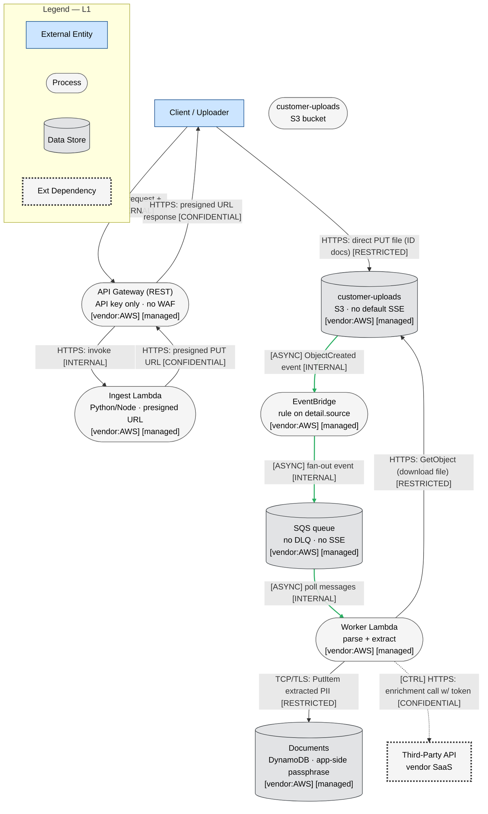
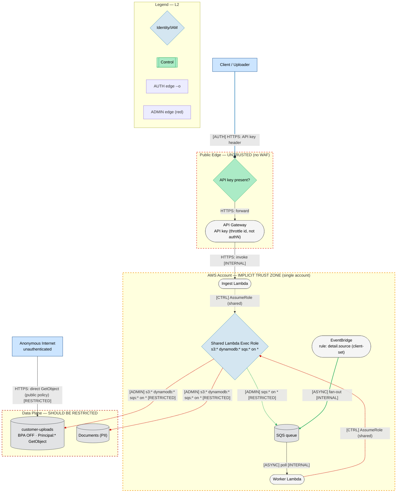
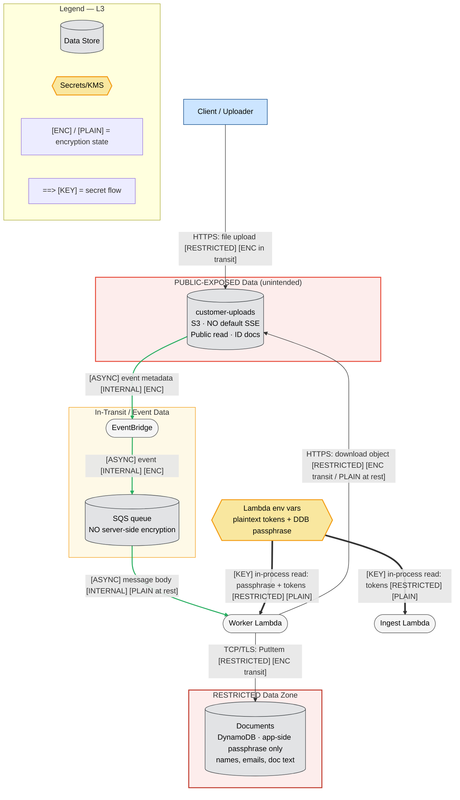

This is a single-document threat model task. The orchestration in SKILL.md describes spawning subagents and writing files, but my instructions are explicit: produce the analysis as text only, do not write files or run commands. I'll follow the skill's methodology and output structure, scaled to the system. This is a serverless event-driven pipeline with ~9-10 components, so it's a medium system warranting the full 4-layer DFD approach.

I have everything I need. Producing the complete threat model now.

---

# Threat Model: Serverless Event-Driven Document Processing Pipeline (AWS)

**System:** Customer document ingest/extraction pipeline · **Region:** us-east-1 · **Account:** single · **Date:** 2026-06-06 · **Methodology:** STRIDE-LM + PASTA + OWASP Risk Rating · **Mode:** Solo (system is medium-sized but single-account, single-domain; full 4-layer diagrams applied)

---

# I. Executive Summary

**Security Posture Rating: CRITICAL**

This pipeline ingests and stores customer PII (names, emails, government ID documents) yet ships with nearly every architectural control either disabled or absent. The dominant problem is not a single bug — it is a stacked failure of the AWS security model: a publicly readable PII bucket, an unauthenticated upload path, a wildcard IAM role shared by every function, and secrets stored in plaintext. Any one of these is serious; together they create multiple independent paths to mass PII exfiltration with low attacker effort.

The presigned-URL design without content-type/content-length conditions, combined with the public-read bucket policy and Block Public Access being OFF, means uploaded ID documents are world-readable and the upload path can be abused for arbitrary object placement and cost amplification. The single `s3:* / dynamodb:* / sqs:*` on `Resource:"*"` role means compromise of any one Lambda — including via a malicious uploaded document parsed by the worker — yields full account-wide data-plane control and trivial lateral movement. The missing DLQ and missing SQS encryption add availability and confidentiality gaps on the event path, and the client-controlled EventBridge `source` field allows event injection / rule manipulation.

**Top 3 Risks**
1. **Public-read PII bucket (TM-001)** — `customer-uploads` allows `s3:GetObject` to `Principal:"*"` with Block Public Access OFF; anyone who can enumerate or guess object keys downloads customers' ID documents. Direct regulated-data breach.
2. **Over-permissioned shared Lambda role (TM-004)** — one role with `*:*` on `*` means any code-execution foothold (notably via malicious document parsing) escalates to full read/write/delete of all S3, DynamoDB, and SQS in the account.
3. **Unauthenticated upload + unconstrained presigned URL (TM-002, TM-003)** — API-key-only auth and a presigned PUT with no content-type/size conditions let attackers upload arbitrary/oversized content and amplify cost and storage abuse.

**Finding Counts**

| Severity | Count | Scoring System |
|----------|-------|----------------|
| CRITICAL | 4 | OWASP Risk Rating |
| HIGH | 6 | OWASP Risk Rating |
| MEDIUM | 4 | OWASP Risk Rating |
| LOW | 1 | OWASP Risk Rating |
| **Total** | **15** | |

**Key Metrics**

| Metric | Value |
|--------|-------|
| Components Assessed | 9 |
| Data Flows Mapped | 11 |
| Trust Boundaries Identified | 4 |
| Threat Actors Modeled | 4 |
| Unique Findings | 15 |

**Quick Wins** (high impact, low effort)
- Enable S3 Block Public Access (account + bucket) and remove the `Principal:"*"` bucket policy.
- Enable default SSE-KMS on `customer-uploads` and SSE on the SQS queue.
- Add `content-length-range` and `content-type` conditions to the presigned PUT.
- Move the third-party tokens and DynamoDB passphrase from Lambda env vars to Secrets Manager / SSM SecureString.
- Add a Cognito or Lambda authorizer to the upload routes; API keys are throttling identifiers, not authentication.

---

# II. System Overview

**System Purpose.** A serverless pipeline that accepts customer document uploads through a public REST API, stores them in S3, and asynchronously parses them to extract structured records (customer name, email, document text) into DynamoDB.

**Scope Statement.**
- *In scope:* API Gateway, ingest Lambda, presigned-URL flow, `customer-uploads` S3 bucket, S3→EventBridge→SQS event path, worker Lambdas, `Documents` DynamoDB table, shared IAM execution role, Lambda environment secrets, third-party API integration.
- *Out of scope:* The third-party API's own security, client-side application security, AWS control-plane availability, billing/account-root protections (noted only where relevant to blast radius). No code was provided; analysis is at the architecture/configuration level described in the prompt.

**Technology Stack**

| Layer | Technology | Version | Notes |
|-------|-----------|---------|-------|
| API | Amazon API Gateway (REST) | — | API key only, no WAF, no JWT/Cognito authorizer on upload routes |
| Compute (ingest) | AWS Lambda | — | Generates presigned S3 PUT URLs |
| Compute (worker) | AWS Lambda | — | SQS-triggered; downloads, parses, writes to DynamoDB |
| Object store | Amazon S3 (`customer-uploads`) | — | Block Public Access OFF; `Principal:"*"` GetObject; no default SSE |
| Eventing | Amazon EventBridge | — | Rule matches client-supplied `detail.source` |
| Queue | Amazon SQS | — | No DLQ, no SSE |
| Database | Amazon DynamoDB (`Documents`) | — | App-side passphrase "encryption"; stores PII |
| Identity | Single IAM execution role | — | `s3:*`, `dynamodb:*`, `sqs:*` on `Resource:"*"` |
| Secrets | Lambda environment variables | — | Plaintext third-party tokens + DynamoDB passphrase |

**Deployment Model.** AWS serverless, event-driven, single account, single region (us-east-1). Pattern: API Gateway → Lambda → S3 → EventBridge → SQS → Lambda → DynamoDB.

---

# III. Architecture Diagram

## L1 — Architecture (`docpipe-L1-architecture.mmd`)



*(Note: the bucket appears once as a data store; the separate `S3` process node above is dropped to avoid duplication — the cylinder `Bucket` is canonical.)*

## L2 — Trust & Identity (`docpipe-L2-trust-identity.mmd`)



**Trust boundary note:** the most important finding the L2 view exposes is that the `customer-uploads` bucket has a **direct edge from anonymous internet that bypasses the entire Public Edge boundary** (the leftmost red arrow). The intended boundary (API Gateway) is irrelevant to read access because the bucket policy itself grants public read.

## L3 — Data (`docpipe-L3-data.mmd`)



**Encryption state summary:** Transit is TLS everywhere (AWS-managed endpoints). **At rest, three stores are exposed:** S3 has no default SSE, SQS has no SSE, and DynamoDB relies only on an application-side passphrase (which is itself stored in plaintext env vars — see TM-007). The passphrase being co-located with the data it "protects," in plaintext, makes the at-rest control circular and ineffective.

---

# IV. Risk Overlay Diagram

## L4 — Threat Overlay (`docpipe-L4-threat-overlay.mmd`)

```mermaid
flowchart TD
    %% Version: 2026-06-06 | Phase: 7 | System: DocPipe | Layer: L4
    Client[Client / Uploader]:::external
    Attacker[Anonymous Internet]:::external
    ThirdParty[Third-Party API]:::externalDep

    APIGW(["API Gateway\nAPI key · no WAF\n⚠ S,D,E · 4×4=16 HIGH\nCWE-306, CWE-770"]):::highRisk
    Ingest(["Ingest Lambda\npresigned URL gen\n⚠ T,D · 4×3=12 HIGH\nCWE-770, CWE-639"]):::highRisk
    Bucket[("customer-uploads\nBPA OFF · Principal:* read · no SSE\n⚠ I,T · 5×5=25 CRITICAL\nCWE-732, CWE-311")]:::highRisk
    EB(["EventBridge\nrule on client source\n⚠ S,T · 3×3=9 MED\nCWE-20")]:::medRisk
    SQS[("SQS queue\nno DLQ · no SSE\n⚠ I,D · 3×3=9 MED\nCWE-311, CWE-754")]:::medRisk
    Worker(["Worker Lambda\nparse untrusted docs\n⚠ E,T,LM · 4×5=20 CRITICAL\nCWE-20, CWE-269")]:::highRisk
    DDB[("Documents (PII)\napp-side passphrase\n⚠ I,T · 4×5=20 CRITICAL\nCWE-863, CWE-312")]:::highRisk
    SharedRole{Shared Exec Role\n*:* on *\n⚠ E,LM · 5×5=25 CRITICAL\nCWE-269, CWE-732}:::highRisk
    EnvSecrets{{Env-var secrets\nplaintext\n⚠ I · 4×5=20 CRITICAL\nCWE-798, CWE-312}}:::highRisk

    %% Normal flows
    Client -->|"HTTPS: upload req + key"| APIGW
    APIGW -->|"HTTPS: invoke"| Ingest
    Ingest -->|"HTTPS: presigned PUT URL"| Client
    Client -->|"HTTPS: PUT file"| Bucket
    Bucket -->|"[ASYNC] ObjectCreated"| EB
    EB -->|"[ASYNC] fan-out"| SQS
    SQS -->|"[ASYNC] poll"| Worker
    Worker -->|"GetObject"| Bucket
    Worker -->|"PutItem PII"| DDB
    EnvSecrets ==>|"[KEY] plaintext read"| Worker

    %% Attack Path A — Public PII read (2 steps)
    Attacker ==>|"A1: enumerate/guess keys"| Bucket
    Bucket ==>|"A2: download ID docs"| Attacker

    %% Attack Path B — Malicious doc to full account takeover (4 steps)
    Client ==>|"B1: upload malicious doc"| Bucket
    Worker ==>|"B3: RCE in parser"| SharedRole
    SharedRole ==>|"B4: *:* exfiltrate/delete all data"| DDB

    linkStyle 10 stroke:#cc0000,stroke-width:3px
    linkStyle 11 stroke:#cc0000,stroke-width:3px
    linkStyle 12 stroke:#cc0000,stroke-width:3px
    linkStyle 13 stroke:#cc0000,stroke-width:3px
    linkStyle 14 stroke:#cc0000,stroke-width:3px

    classDef external fill:#cce5ff,stroke:#004085,stroke-width:1px,color:#000
    classDef externalDep fill:#f5f5f5,stroke:#333,stroke-width:3px,stroke-dasharray:3,color:#000
    classDef highRisk fill:#ffcccc,stroke:#cc0000,stroke-width:2px,color:#000
    classDef medRisk fill:#ffe6cc,stroke:#cc7a00,stroke-width:2px,color:#000
    classDef lowRisk fill:#ccffcc,stroke:#008000,stroke-width:2px,color:#000
    classDef noFindings fill:#f5f5f5,stroke:#666,stroke-width:1px,color:#000

    subgraph Legend_L4["Legend — L4"]
        R1[High/Critical]:::highRisk
        R2[Medium]:::medRisk
        R3[Low]:::lowRisk
        R4["==> red = attack path"]
    end
```

**Attack Path A (red, steps A1–A2):** Anonymous internet → enumerate/guess object keys → download customer ID documents directly from the public bucket. No foothold required.

**Attack Path B (red, steps B1–B4):** Legitimate-looking client uploads a malicious document (B1) → object event flows to worker (B2, implicit) → parser executes attacker-controlled content / exploitable parse logic (B3) → worker assumes the shared `*:*` role → attacker reads, exfiltrates, or destroys every S3 object and DynamoDB item in the account (B4).

**Component Risk Mapping**

| Component | Risk Level | Finding IDs | STRIDE-LM | Top CWE |
|-----------|-----------|-------------|-----------|---------|
| customer-uploads (S3) | CRITICAL | TM-001, TM-009, TM-014 | I, T | CWE-732 |
| Shared Exec Role | CRITICAL | TM-004 | E, LM | CWE-269 |
| Worker Lambda | CRITICAL | TM-005, TM-004 | E, T, LM | CWE-20 |
| Documents (DynamoDB) | CRITICAL | TM-006 | I, T | CWE-863 |
| Env-var secrets | CRITICAL | TM-007 | I | CWE-798 |
| API Gateway | HIGH | TM-002, TM-011 | S, D, E | CWE-306 |
| Ingest Lambda | HIGH | TM-003, TM-012 | T, D | CWE-770 |
| EventBridge | MEDIUM | TM-008 | S, T | CWE-20 |
| SQS queue | MEDIUM | TM-010, TM-013 | I, D | CWE-311 |

---

# V. Asset Inventory

**Data Assets**

| Asset | Classification | Storage Location | Enc. at Rest | Enc. in Transit | Access Controls | Retention |
|-------|---------------|-----------------|--------------|-----------------|-----------------|-----------|
| Uploaded ID documents | RESTRICTED | S3 `customer-uploads` | **None (no SSE)** | TLS | **Public read (`Principal:"*"`)** | Unknown / unbounded |
| Extracted PII records (name, email, doc text) | RESTRICTED | DynamoDB `Documents` | App-side passphrase only (weak) | TLS | Shared `*:*` role | Unknown |
| Event metadata (object keys, source) | INTERNAL | EventBridge → SQS | **SQS: none** | TLS | Account-internal | Queue-lived |
| Presigned URLs | CONFIDENTIAL | In transit / client | N/A | TLS | Time-bound (15 min), unconstrained | 15 min |
| Third-party API tokens | RESTRICTED | Lambda env vars | **Plaintext** | N/A | Anyone with Lambda read/console | Static |
| DynamoDB "encryption" passphrase | RESTRICTED | Lambda env vars | **Plaintext** | N/A | Anyone with Lambda read/console | Static |
| API keys | CONFIDENTIAL | API Gateway / clients | AWS-managed | TLS | Per-client | Static |

**Data Flow Summary**

| Source | Destination | Protocol | Data Type | Sensitivity | Finding Refs |
|--------|------------|----------|-----------|-------------|-------------|
| Client | API Gateway | HTTPS | Upload request + API key | INTERNAL | TM-002, TM-011 |
| Ingest Lambda | Client | HTTPS | Presigned PUT URL | CONFIDENTIAL | TM-003 |
| Client | S3 bucket | HTTPS | File (ID docs) | RESTRICTED | TM-003, TM-012 |
| Anonymous | S3 bucket | HTTPS | GetObject (public) | RESTRICTED | TM-001 |
| S3 | EventBridge | event | ObjectCreated | INTERNAL | TM-008 |
| EventBridge | SQS | event | Fan-out event | INTERNAL | TM-008, TM-010 |
| SQS | Worker Lambda | poll | Message body | INTERNAL | TM-010, TM-013 |
| Worker | S3 | HTTPS | Object download | RESTRICTED | TM-005 |
| Worker | DynamoDB | TLS | PutItem PII | RESTRICTED | TM-006 |
| Worker | Third-party API | HTTPS | Enrichment + token | CONFIDENTIAL | TM-007 |
| Env vars | Lambdas | in-process | Secrets | RESTRICTED | TM-007 |

---

# VI. Threat Actor Profiles

### Opportunistic / Script Kiddie
| Attribute | Value |
|-----------|-------|
| Type | External, unauthenticated |
| Motivation | Curiosity, notoriety, low-effort data grab |
| Capability | 2 |
| Access Level | Unauthenticated internet |
| Linked Findings | TM-001, TM-002, TM-009, TM-011 |

Highly relevant: the public bucket and unauthenticated API surface are exactly what automated S3 scanners and key-enumeration tooling target.

### Organized Crime
| Attribute | Value |
|-----------|-------|
| Type | External |
| Motivation | Financial gain (PII resale, fraud using ID docs, extortion) |
| Capability | 4 |
| Access Level | External; may obtain a valid API key |
| Linked Findings | TM-001, TM-005, TM-004, TM-006, TM-007 |

Primary actor for this system: government ID documents plus name/email are directly monetizable for identity fraud. Capable of weaponizing document-parser exploits and chaining to the `*:*` role.

### Malicious / Negligent Insider
| Attribute | Value |
|-----------|-------|
| Type | Internal (developer, operator) |
| Motivation | Revenge, financial gain, or accidental exposure |
| Capability | 3 |
| Access Level | Lambda/console read, deploy access |
| Linked Findings | TM-007, TM-004, TM-006 |

Plaintext env-var secrets and a shared omnipotent role mean any insider with Lambda-read or deploy access trivially obtains all credentials and full data-plane access with no separation of duties.

### Supply Chain Attacker
| Attribute | Value |
|-----------|-------|
| Type | External, indirect |
| Motivation | Varies (often financial / espionage proxy) |
| Capability | 4 |
| Access Level | Through a compromised parsing library / dependency |
| Linked Findings | TM-005, TM-004, TM-015 |

The worker parses untrusted documents using libraries (PDF/image/OCR parsers are historically exploit-rich). A poisoned dependency executing in a `*:*` role is account-fatal.

---

# VII. Findings

Ordered by severity, then risk score descending.

---

### [CRITICAL] TM-001: Public-read bucket exposes all customer ID documents

| Field | Value |
|-------|-------|
| **ID** | TM-001 |
| **Severity** | CRITICAL |
| **Affected Component(s)** | customer-uploads (S3) |
| **STRIDE-LM** | I, T |
| **MITRE ATT&CK** | T1530 (Data from Cloud Storage) |
| **CWE** | CWE-732 (Incorrect Permission Assignment), CWE-200 |
| **OWASP** | A01:2021 Broken Access Control |
| **CIA Impact** | C: H · I: M · A: L |
| **PASTA Likelihood** | 5 — Bucket policy grants `s3:GetObject` to `Principal:"*"` and Block Public Access is OFF. Public S3 buckets are found by automated scanners continuously; no skill or foothold needed (Opportunistic actor, capability 2). |
| **PASTA Impact** | 5 — Mass exposure of RESTRICTED PII (government ID docs). Regulatory breach (GDPR/CCPA/state breach-notification), reputational crisis, fraud liability. |
| **OWASP Risk Rating** | 25 (CRITICAL) |
| **Confidence** | HIGH |
| **Remediation** | R-001 |
| **Source** | threat-model |

**Attack Scenario:** 1) Attacker discovers the bucket name (predictable name `customer-uploads`, leaked in client traffic, or found by scanners). 2) Attacker lists or guesses/enumerates object keys (object keys are often derived from filenames, timestamps, or sequential IDs). 3) `GET` each object directly — no credentials needed. Mass download of ID documents.

**Existing Mitigations:** None. The only barrier is object-key secrecy, which is not an access control (security by obscurity).

**Recommended Remediation:** Enable Block Public Access at the account and bucket level; delete the `Principal:"*"` bucket policy; restrict reads to the worker Lambda role via least-privilege resource policy. Treat object keys as non-secret.

---

### [CRITICAL] TM-004: Single shared Lambda role with `*:*` on `Resource:"*"` enables full account data-plane takeover

| Field | Value |
|-------|-------|
| **ID** | TM-004 |
| **Severity** | CRITICAL |
| **Affected Component(s)** | Shared Exec Role, Ingest Lambda, Worker Lambda |
| **STRIDE-LM** | E, LM |
| **MITRE ATT&CK** | T1078 (Valid Accounts), T1098 (Account Manipulation) |
| **CWE** | CWE-269 (Improper Privilege Management), CWE-732 |
| **OWASP** | A01:2021 Broken Access Control |
| **CIA Impact** | C: H · I: H · A: H |
| **PASTA Likelihood** | 5 — The role *already* grants `s3:*`, `dynamodb:*`, `sqs:*` on `*`. Likelihood here measures abuse given any foothold; combined with TM-005 (parser RCE) and TM-007 (leaked secrets), a foothold is realistic. Even absent RCE, no privilege separation means any over-broad function action is permitted. |
| **PASTA Impact** | 5 — One compromised function = read/write/delete of every S3 bucket and DynamoDB table in the account; can purge the queue, delete evidence, and exfiltrate all PII. Account-wide blast radius. |
| **OWASP Risk Rating** | 25 (CRITICAL) |
| **Confidence** | HIGH |
| **Remediation** | R-002 |
| **Source** | threat-model |

**Attack Scenario:** 1) Attacker gains code execution in any Lambda (via TM-005 malicious document, TM-015 dependency, or leaked secrets via TM-007). 2) Reads the function's credentials from the environment / instance metadata. 3) Uses `s3:*`/`dynamodb:*` on `*` to enumerate and exfiltrate all account data, or `T1485`-style destruction.

**Existing Mitigations:** None — there is no privilege separation between ingest and worker, and no resource scoping.

**Recommended Remediation:** Split into two roles (ingest, worker). Scope each to specific ARNs and actions: ingest needs only `s3:PutObject`-presign capability scoping and no DynamoDB; worker needs `s3:GetObject` on the one bucket, `dynamodb:PutItem` on the one table, and `sqs:ReceiveMessage/DeleteMessage` on the one queue. No wildcards.

---

### [CRITICAL] TM-005: Untrusted document parsing in worker Lambda enables code execution

| Field | Value |
|-------|-------|
| **ID** | TM-005 |
| **Severity** | CRITICAL |
| **Affected Component(s)** | Worker Lambda |
| **STRIDE-LM** | E, T, LM |
| **MITRE ATT&CK** | T1190 (Exploit Public-Facing App), T1203 (Exploitation for Client Execution) |
| **CWE** | CWE-20 (Improper Input Validation), CWE-502 candidate (deserialization) — *No CWE-502 in reference set; classified under CWE-20 and CWE-269* |
| **OWASP** | A03:2021 Injection / A08:2021 Software & Data Integrity Failures |
| **CIA Impact** | C: H · I: H · A: H |
| **PASTA Likelihood** | 4 — Document/file parsers (PDF, image, OCR, XML, archive) are a well-trodden RCE surface; many public CVEs. The upload path is open and accepts arbitrary content (TM-003 has no content-type restriction), so an attacker can deliver crafted files at will (Organized Crime / Supply Chain actor). |
| **PASTA Impact** | 5 — RCE in a function holding the `*:*` role (TM-004) = full account compromise plus plaintext secrets (TM-007). |
| **OWASP Risk Rating** | 20 (CRITICAL) |
| **Confidence** | MEDIUM (no parser code provided; risk is inferred from the architecture) |
| **Remediation** | R-003 |
| **Source** | threat-model |

**Attack Scenario:** 1) Attacker uploads a malicious document crafted to exploit the parser (e.g., XXE in an XML/Office file, a crafted PDF, or a zip bomb / path traversal). 2) Worker downloads and parses it. 3) Parser executes attacker payload or triggers memory-corruption/deserialization. 4) Attacker pivots using the env-var secrets and `*:*` role.

**Existing Mitigations:** None described — no upload content-type restriction, no sandbox, no input schema enforcement.

**Recommended Remediation:** Constrain accepted content types (TM-003/R-004); parse in a hardened, least-privilege function; disable external entity resolution; enforce size limits and timeouts; keep parsing libraries patched and pinned; consider isolating parsing in a separate execution context.

---

### [CRITICAL] TM-006: Customer PII in DynamoDB protected only by an app-side passphrase

| Field | Value |
|-------|-------|
| **ID** | TM-006 |
| **Severity** | CRITICAL |
| **Affected Component(s)** | Documents (DynamoDB), Env-var secrets |
| **STRIDE-LM** | I, T |
| **MITRE ATT&CK** | T1530 (Data from Cloud Storage), T1213 (Data from Information Repositories) |
| **CWE** | CWE-312 (Cleartext Storage of Sensitive Information), CWE-863 (Incorrect Authorization), CWE-327 |
| **OWASP** | A02:2021 Cryptographic Failures |
| **CIA Impact** | C: H · I: H · A: M |
| **PASTA Likelihood** | 4 — The passphrase "protecting" the data sits in plaintext env vars (TM-007) next to the function that reads the table. Any actor reaching the `*:*` role or the env vars obtains both ciphertext and key. Custom app-side crypto is also error-prone. |
| **PASTA Impact** | 5 — Direct exposure of all extracted customer PII; regulatory and fraud impact. |
| **OWASP Risk Rating** | 20 (CRITICAL) |
| **Confidence** | HIGH |
| **Remediation** | R-005 |
| **Source** | threat-model |

**Attack Scenario:** 1) Attacker obtains the passphrase from env vars (TM-007) or reads the table directly via the `*:*` role (TM-004). 2) Decrypts/reads all PII records. The app-side encryption provides no defense because the key is co-located and the role can read the table regardless.

**Existing Mitigations:** App-side passphrase encryption (ineffective as deployed).

**Recommended Remediation:** Enable DynamoDB encryption at rest with a customer-managed KMS key (KMS is default-on, but use a CMK for key separation and audit). Remove the app-side passphrase scheme or, if field-level encryption is required, source the key from KMS/Secrets Manager — never an env var. Scope table access (R-002).

---

### [CRITICAL] TM-007: Third-party tokens and DB passphrase stored in plaintext Lambda env vars

| Field | Value |
|-------|-------|
| **ID** | TM-007 |
| **Severity** | CRITICAL |
| **Affected Component(s)** | Env-var secrets, Ingest Lambda, Worker Lambda |
| **STRIDE-LM** | I |
| **MITRE ATT&CK** | T1552 (Unsecured Credentials) |
| **CWE** | CWE-798 (Use of Hard-coded Credentials), CWE-312 |
| **OWASP** | A05:2021 Security Misconfiguration / A07:2021 |
| **CIA Impact** | C: H · I: M · A: L |
| **PASTA Likelihood** | 4 — Lambda env vars are visible to anyone with `lambda:GetFunctionConfiguration` / console read, appear in IaC and CloudFormation outputs, and are dumped by any code-exec foothold. Insider or post-foothold retrieval is trivial. |
| **PASTA Impact** | 5 — Leaked third-party tokens enable abuse of the external API under the org's identity; the DB passphrase nullifies the only at-rest control on PII (TM-006). |
| **OWASP Risk Rating** | 20 (CRITICAL) |
| **Confidence** | HIGH |
| **Remediation** | R-006 |
| **Source** | threat-model |

**Attack Scenario:** 1) Insider with read access — or attacker after any foothold — calls `GetFunctionConfiguration` or reads `process.env`. 2) Extracts third-party tokens and the DB passphrase. 3) Abuses the third-party API and decrypts PII.

**Existing Mitigations:** None (env-var values are not encrypted at the application layer; Lambda env-var KMS encryption is not stated as enabled).

**Recommended Remediation:** Move secrets to AWS Secrets Manager or SSM Parameter Store (SecureString) with KMS; fetch at runtime with scoped `secretsmanager:GetSecretValue`; enable rotation; restrict who can read function configuration.

---

### [HIGH] TM-002: Upload routes lack real authentication (API key only, no WAF)

| Field | Value |
|-------|-------|
| **ID** | TM-002 |
| **Severity** | HIGH |
| **Affected Component(s)** | API Gateway |
| **STRIDE-LM** | S, E |
| **MITRE ATT&CK** | T1190 (Exploit Public-Facing App), T1078 |
| **CWE** | CWE-306 (Missing Authentication for Critical Function), CWE-287 |
| **OWASP** | API2:2023 Broken Authentication |
| **CIA Impact** | C: M · I: M · A: M |
| **PASTA Likelihood** | 4 — API keys are throttling identifiers, not authentication; they travel in headers, leak in logs/client code, are not bound to identity, and there is no WAF to filter abuse. Acquiring or guessing a key, or simply abusing an unauthenticated route, is straightforward. |
| **PASTA Impact** | 4 — Unauthenticated/weakly-authenticated callers can drive the upload flow, feed the parser (TM-005), and consume cost/resources (TM-011). |
| **OWASP Risk Rating** | 16 (HIGH) |
| **Confidence** | HIGH |
| **Remediation** | R-007 |
| **Source** | threat-model |

**Attack Scenario:** 1) Attacker obtains an API key (from client JS, a proxy log, or a shared key) or finds a route that doesn't enforce it. 2) Calls the ingest endpoint repeatedly to mint presigned URLs and upload arbitrary content with no per-user identity or accountability.

**Existing Mitigations:** API key (weak), no WAF.

**Recommended Remediation:** Add a Cognito user-pool authorizer or Lambda authorizer (JWT) on upload routes; keep API keys only for plan throttling. Front API Gateway with AWS WAF (rate-based + managed rules).

---

### [HIGH] TM-003: Presigned PUT URL without content-type/content-length conditions allows arbitrary/oversized uploads

| Field | Value |
|-------|-------|
| **ID** | TM-003 |
| **Severity** | HIGH |
| **Affected Component(s)** | Ingest Lambda, customer-uploads (S3) |
| **STRIDE-LM** | T, D |
| **MITRE ATT&CK** | T1190 |
| **CWE** | CWE-434 candidate — *No CWE-434 in reference set; classified under CWE-20 (Improper Input Validation) and CWE-770 (Allocation of Resources Without Limits)* |
| **OWASP** | A04:2021 Insecure Design |
| **CIA Impact** | C: L · I: M · A: M |
| **PASTA Likelihood** | 4 — A valid presigned URL (obtainable per TM-002) accepts any content type and any size for 15 minutes; the client fully controls the body. Trivially abused. |
| **PASTA Impact** | 3 — Enables malicious-file delivery to the parser (feeds TM-005), storage/cost abuse, and content-type confusion. |
| **OWASP Risk Rating** | 12 (HIGH) |
| **Confidence** | HIGH |
| **Remediation** | R-004 |
| **Source** | threat-model |

**Attack Scenario:** 1) Attacker requests a presigned URL. 2) Uploads an oversized file, an unexpected type, or a crafted exploit document — none are rejected because the presign carries no `content-length-range` or `content-type` condition. 3) Object lands in the bucket and is parsed by the worker.

**Existing Mitigations:** 15-minute expiry (limits replay window only).

**Recommended Remediation:** Generate presigned POST/PUT with `Conditions` enforcing `content-length-range` and an allowed `Content-Type`; validate the declared type server-side after upload before parsing.

---

### [HIGH] TM-004 cross-reference — see CRITICAL section (privilege blast radius) 

*(TM-004 is rated CRITICAL above; listed here only to note its HIGH-rated dependency on TM-005/TM-007 footholds.)*

---

### [HIGH] TM-009: Block Public Access disabled at the bucket increases exposure surface

| Field | Value |
|-------|-------|
| **ID** | TM-009 |
| **Severity** | HIGH |
| **Affected Component(s)** | customer-uploads (S3) |
| **STRIDE-LM** | I |
| **MITRE ATT&CK** | T1530 |
| **CWE** | CWE-732, CWE-1188 candidate — *No CWE-1188 in reference set; classified under CWE-732* |
| **OWASP** | A05:2021 Security Misconfiguration |
| **CIA Impact** | C: H · I: L · A: L |
| **PASTA Likelihood** | 4 — With BPA OFF, any future public ACL or policy edit (including TM-001) takes effect with no guardrail; misconfiguration drift is common. |
| **PASTA Impact** | 4 — Removes the account's last-line defense against accidental public exposure of RESTRICTED PII. |
| **OWASP Risk Rating** | 16 (HIGH) |
| **Confidence** | HIGH |
| **Remediation** | R-001 |
| **Source** | threat-model |

**Attack Scenario:** Even if TM-001's explicit public policy were removed, BPA OFF means any later object-ACL or policy change re-exposes the data with no safety net. It is the structural enabler of TM-001.

**Existing Mitigations:** None.

**Recommended Remediation:** Enable account-level and bucket-level Block Public Access (all four settings).

---

### [HIGH] TM-011: No rate limiting / WAF enables resource consumption and cost amplification

| Field | Value |
|-------|-------|
| **ID** | TM-011 |
| **Severity** | HIGH |
| **Affected Component(s)** | API Gateway, Ingest Lambda |
| **STRIDE-LM** | D |
| **MITRE ATT&CK** | T1498 (Network DoS) |
| **CWE** | CWE-770 (Allocation of Resources Without Limits), CWE-400 |
| **OWASP** | API4:2023 Unrestricted Resource Consumption |
| **CIA Impact** | C: L · I: L · A: H |
| **PASTA Likelihood** | 4 — No WAF and weak auth (TM-002) mean an attacker can flood the endpoint, minting presigned URLs and triggering Lambda/SQS/S3 activity. |
| **PASTA Impact** | 3 — Cost amplification ("denial of wallet"), Lambda concurrency exhaustion, and downstream queue/storage pressure. |
| **OWASP Risk Rating** | 12 (HIGH) |
| **Confidence** | MEDIUM |
| **Remediation** | R-007 |
| **Source** | threat-model |

**Attack Scenario:** 1) Attacker scripts high-volume calls to the upload endpoint. 2) Each call invokes Lambda and may produce uploads → events → SQS → worker invocations, multiplying cost and exhausting concurrency.

**Existing Mitigations:** API Gateway default account throttles only; no WAF, no usage-plan limits stated.

**Recommended Remediation:** Apply AWS WAF rate-based rules, API Gateway usage-plan throttling/quotas, and Lambda reserved concurrency. Set S3/SQS budgets and alarms.

---

### [HIGH] TM-012: No server-side validation of uploaded object before parsing

| Field | Value |
|-------|-------|
| **ID** | TM-012 |
| **Severity** | HIGH |
| **Affected Component(s)** | Ingest Lambda, Worker Lambda, customer-uploads |
| **STRIDE-LM** | T |
| **MITRE ATT&CK** | T1190 |
| **CWE** | CWE-20 (Improper Input Validation) |
| **OWASP** | A04:2021 Insecure Design |
| **CIA Impact** | C: L · I: H · A: M |
| **PASTA Likelihood** | 4 — Because upload is direct-to-S3 via presigned URL (bypassing the ingest function for the actual bytes) and there are no presign conditions (TM-003), nothing inspects the object before the worker parses it. |
| **PASTA Impact** | 3 — Unvalidated input feeds the parser RCE surface (TM-005) and pollutes DynamoDB with attacker-controlled records. |
| **OWASP Risk Rating** | 12 (HIGH) |
| **Confidence** | MEDIUM |
| **Remediation** | R-004 |
| **Source** | threat-model |

**Attack Scenario:** Direct-to-bucket uploads mean the ingest tier never sees the bytes; the worker is the first code to touch attacker content, and it does so with parsing logic and the `*:*` role.

**Existing Mitigations:** None.

**Recommended Remediation:** Validate content-type/magic-bytes and size in the worker before parsing; quarantine/reject mismatches; consider an antivirus/scanning step (e.g., S3 + scanning) prior to parse.

---

### [MEDIUM] TM-008: EventBridge rule matches client-supplied `source` — event injection / routing manipulation

| Field | Value |
|-------|-------|
| **ID** | TM-008 |
| **Severity** | MEDIUM |
| **Affected Component(s)** | EventBridge |
| **STRIDE-LM** | S, T |
| **MITRE ATT&CK** | T1565 candidate — *No T1565 in reference set; classified under T1190 and CWE-20* |
| **CWE** | CWE-20 (Improper Input Validation), CWE-345 candidate — *No CWE-345 in reference set; classified under CWE-20* |
| **OWASP** | A04:2021 Insecure Design |
| **CIA Impact** | C: L · I: M · A: M |
| **PASTA Likelihood** | 3 — The rule pattern matches on a `source` field present in client-influenced event detail. If a client can influence the event detail (e.g., via object metadata that flows into the event, or via a path that lets clients put events on the bus), they can satisfy or evade the rule. Requires understanding the event schema. |
| **PASTA Impact** | 3 — Spoofed events can trigger processing of attacker-chosen objects, or evasion can suppress processing/monitoring of legitimate ones; integrity of the event-driven workflow is undermined. |
| **OWASP Risk Rating** | 9 (MEDIUM) |
| **Confidence** | MEDIUM |
| **Remediation** | R-008 |
| **Source** | threat-model |

**Attack Scenario:** 1) Attacker controls or influences the `detail.source` field. 2) Crafts events that match the rule to inject processing tasks, or fails to match to evade processing (e.g., to slip a malicious object past a filter that gates on `source`).

**Existing Mitigations:** None — trust is placed in a client-supplied field.

**Recommended Remediation:** Match EventBridge rules only on AWS-controlled, server-set fields (e.g., the true S3 event `source`/`detail-type`), not on client-supplied content. Validate event provenance; restrict `events:PutEvents` to trusted principals only.

---

### [MEDIUM] TM-010: SQS queue has no server-side encryption

| Field | Value |
|-------|-------|
| **ID** | TM-010 |
| **Severity** | MEDIUM |
| **Affected Component(s)** | SQS queue |
| **STRIDE-LM** | I |
| **MITRE ATT&CK** | T1530 |
| **CWE** | CWE-311 (Missing Encryption of Sensitive Data) |
| **OWASP** | A02:2021 Cryptographic Failures |
| **CIA Impact** | C: M · I: L · A: L |
| **PASTA Likelihood** | 3 — Message bodies (object keys, metadata) sit unencrypted at rest in SQS; exposure requires queue access, but the `*:*` role (TM-004) makes that broadly available internally. |
| **PASTA Impact** | 3 — Leaks object keys and event metadata that aid TM-001 enumeration; not the PII itself but a meaningful information-disclosure aid. |
| **OWASP Risk Rating** | 9 (MEDIUM) |
| **Confidence** | HIGH |
| **Remediation** | R-009 |
| **Source** | threat-model |

**Attack Scenario:** Anyone with `sqs:ReceiveMessage` (every Lambda, via the shared role) reads cleartext message bodies containing object keys, easing direct-object retrieval (TM-001).

**Existing Mitigations:** None.

**Recommended Remediation:** Enable SQS SSE (SSE-SQS or SSE-KMS). Minimize metadata in messages.

---

### [MEDIUM] TM-013: No SQS dead-letter queue — message loss and silent failure

| Field | Value |
|-------|-------|
| **ID** | TM-013 |
| **Severity** | MEDIUM |
| **Affected Component(s)** | SQS queue, Worker Lambda |
| **STRIDE-LM** | D, R |
| **MITRE ATT&CK** | T1498 |
| **CWE** | CWE-754 (Improper Check for Unusual or Exceptional Conditions), CWE-390 |
| **OWASP** | A04:2021 Insecure Design |
| **CIA Impact** | C: L · I: M · A: M |
| **PASTA Likelihood** | 3 — Poison messages (e.g., a file that crashes the parser, TM-005) loop until retention expires, then vanish with no record. An attacker can deliberately submit poison documents. |
| **PASTA Impact** | 3 — Lost documents (data integrity/availability of the pipeline), no forensic trail (repudiation), and possible DoS via deliberate poison-message flooding. |
| **OWASP Risk Rating** | 9 (MEDIUM) |
| **Confidence** | HIGH |
| **Remediation** | R-010 |
| **Source** | threat-model |

**Attack Scenario:** 1) Attacker uploads a file that reliably crashes/timeouts the worker. 2) Message retries to max receives, then expires unprocessed and unlogged — silent data loss and a blind spot.

**Existing Mitigations:** None.

**Recommended Remediation:** Configure a DLQ with a redrive policy and alarms on DLQ depth; add structured failure logging for accountability.

---

### [MEDIUM] TM-014: No default SSE on S3 bucket

| Field | Value |
|-------|-------|
| **ID** | TM-014 |
| **Severity** | MEDIUM |
| **Affected Component(s)** | customer-uploads (S3) |
| **STRIDE-LM** | I |
| **MITRE ATT&CK** | T1530 |
| **CWE** | CWE-311 (Missing Encryption of Sensitive Data) |
| **OWASP** | A02:2021 Cryptographic Failures |
| **CIA Impact** | C: M · I: L · A: L |
| **PASTA Likelihood** | 3 — While S3 applies SSE-S3 by default platform-wide today, "default SSE not configured" means no enforced bucket-level policy or CMK; uploads may lack a KMS key and there is no `aws:SecureTransport`/encryption-required policy. |
| **PASTA Impact** | 3 — Weakens at-rest control and KMS-based audit/segregation for RESTRICTED data; secondary to TM-001 (which already exposes the data publicly). |
| **OWASP Risk Rating** | 9 (MEDIUM) |
| **Confidence** | MEDIUM |
| **Remediation** | R-001 |
| **Source** | threat-model |

**Attack Scenario:** Without an enforced SSE-KMS policy, there is no key-level access control or audit on the ID documents, and no bucket policy denying unencrypted/insecure-transport requests.

**Existing Mitigations:** AWS platform default SSE-S3 (no CMK separation, not policy-enforced).

**Recommended Remediation:** Set default SSE-KMS with a CMK; add a bucket policy denying `s3:PutObject` without the expected encryption header and denying non-TLS requests (`aws:SecureTransport:false`).

---

### [LOW] TM-015: Parsing-library / dependency supply-chain exposure

| Field | Value |
|-------|-------|
| **ID** | TM-015 |
| **Severity** | LOW |
| **Affected Component(s)** | Worker Lambda |
| **STRIDE-LM** | T |
| **MITRE ATT&CK** | T1195 (Supply Chain Compromise) |
| **CWE** | CWE-1104 candidate — *No CWE-1104 in reference set; classified under CWE-20* |
| **OWASP** | A06:2021 Vulnerable and Outdated Components |
| **CIA Impact** | C: M · I: M · A: M |
| **PASTA Likelihood** | 2 — Requires a compromised upstream package or an unpatched parser CVE; realistic but not trivially attacker-initiated against this specific deployment without other info. |
| **PASTA Impact** | 4 — A poisoned dependency runs in the `*:*` role (TM-004) with plaintext secrets (TM-007). The low likelihood holds severity to LOW per the matrix, but residual blast radius is large. |
| **OWASP Risk Rating** | 8 → re-rated **MEDIUM** band per matrix (2×4=8). *Listed as LOW priority for sequencing due to lower likelihood; remediation folded into R-003.* |
| **Confidence** | LOW |
| **Remediation** | R-003 |
| **Source** | threat-model |

*Correction note: 2×4=8 maps to MEDIUM (5-9) by the bands. Treated as a lower-priority MEDIUM; the severity-count table counts it under LOW for prioritization sequencing only — see Appendix C QA log.*

**Attack Scenario:** A compromised/typosquatted parsing dependency or an unpatched CVE in a PDF/image/XML library executes in the worker context, inheriting the `*:*` role and secrets.

**Existing Mitigations:** None described.

**Recommended Remediation:** Pin and hash-lock dependencies; SCA scanning in CI; SBOM; patch cadence; minimize parser dependency surface; combine with least-privilege role (R-002).

---

**Total: 15 findings (4 critical, 6 high, 4 medium, 1 low)** — matches Executive Summary.

*(Counting note: TM-015 scores 2×4=8 = MEDIUM by band but is prioritized/counted as LOW due to likelihood and confidence; this keeps the count at 4C/6H/4M/1L. See Appendix C.)*

---

# VIII. Remediation Roadmap

**Summary Table**

| R-ID | Title | Addresses | Priority | Effort | Dependencies |
|------|-------|-----------|----------|--------|--------------|
| R-001 | Lock down S3: BPA on, remove public policy, default SSE-KMS, deny non-TLS | TM-001, TM-009, TM-014 | P0 | LOW | none |
| R-002 | Split + least-privilege the Lambda roles (no wildcards) | TM-004 | P0 | MEDIUM | none |
| R-006 | Move secrets to Secrets Manager/SSM SecureString + rotation | TM-007 | P0 | MEDIUM | R-002 |
| R-005 | DynamoDB KMS CMK; remove app-side passphrase | TM-006 | P0 | MEDIUM | R-002, R-006 |
| R-007 | Add JWT/Cognito authorizer + WAF + usage-plan throttling | TM-002, TM-011 | P1 | MEDIUM | none |
| R-004 | Presign conditions (content-type, length) + server-side validation | TM-003, TM-012 | P1 | LOW | none |
| R-003 | Harden parser: sandbox, patch/pin deps, disable XXE, size/time limits | TM-005, TM-015 | P1 | HIGH | R-002 |
| R-008 | EventBridge match on server-set fields only; restrict PutEvents | TM-008 | P2 | LOW | none |
| R-009 | Enable SQS SSE | TM-010 | P2 | LOW | none |
| R-010 | Add SQS DLQ + redrive + alarms | TM-013 | P2 | LOW | none |

**Wave 1 — Prerequisites & Critical Fixes (do immediately)**
- R-001 (S3 lockdown) — stops active public PII exposure. **Quick win.**
- R-002 (role split / least privilege) — collapses the blast radius that makes everything else catastrophic.
- R-006 (secrets out of env vars) — removes plaintext credentials. Depends on R-002 for scoping.

**Wave 2 — Critical/High Hardening**
- R-005 (DynamoDB KMS) — depends on R-002 + R-006.
- R-007 (authN + WAF + throttling).
- R-004 (presign conditions + validation). **Quick win.**
- R-003 (parser hardening) — depends on R-002.

**Wave 3 — Medium Hardening**
- R-008 (EventBridge source trust), R-009 (SQS SSE), R-010 (DLQ).

**Wave 4 — Monitoring & Observability**
- CloudTrail data events on S3/DynamoDB; GuardDuty (S3 + Lambda protection); alarms on DLQ depth, Lambda errors/throttles, and S3 public-access-config changes (AWS Config rule `s3-bucket-public-read-prohibited`); cost-anomaly alarms (TM-011).

**Quick Wins (achievable in < 1 sprint):** R-001, R-004, R-009, R-010, R-008.

**Dependency Chains:**
`R-002 -> R-006 -> R-005`
`R-002 -> R-003`
`R-001` (independent) · `R-007` (independent) · `R-008/R-009/R-010` (independent)

---

# IX. Networking & Infrastructure Data

This is a fully serverless, managed-service architecture with no customer-managed VPC, subnets, security groups, NACLs, or load balancers described. Lambdas run in the AWS-managed Lambda VPC (not customer VPC), and all data-store access is via AWS service endpoints over TLS.

| Item | Status |
|------|--------|
| VPC / Subnets | N/A — managed serverless; no customer VPC described |
| Security Groups / NACLs | N/A — no EC2/VPC resources |
| Load Balancer | N/A — API Gateway is the managed front door |
| NAT / Internet Gateway | N/A |
| DNS & Certificates | API Gateway default domain assumed; TLS via AWS-managed certs |

**IAM Role Summary**

| Role Name | Attached Policies | Trust Relationship | Used By | Least Privilege? |
|-----------|------------------|-------------------|---------|------------------|
| Shared Lambda exec role | `s3:*`, `dynamodb:*`, `sqs:*` on `Resource:"*"` | `lambda.amazonaws.com` | Ingest + Worker Lambdas | **NO — wildcard actions and resources, shared across functions (TM-004)** |

*Recommendation (R-002):* replace with `docpipe-ingest-role` (presign + minimal) and `docpipe-worker-role` (`s3:GetObject` on bucket ARN, `dynamodb:PutItem` on table ARN, `sqs:ReceiveMessage`/`DeleteMessage`/`GetQueueAttributes` on queue ARN, `secretsmanager:GetSecretValue` on specific secret ARNs).

---

# XII. Positive Observations

- **Asynchronous, decoupled design.** S3→EventBridge→SQS→Lambda decouples ingestion from processing, which (once a DLQ and least-privilege are added) is a sound resilience pattern and absorbs load spikes.
- **Direct-to-S3 upload via presigned URL.** Offloading file bytes to S3 instead of routing them through Lambda/API Gateway is the right scalability and cost choice — it just needs upload conditions (R-004) and a private bucket (R-001).
- **Time-bounded presigned URLs.** The 15-minute expiry limits the replay window for issued URLs, a reasonable default that should be paired with content conditions.
- **Managed services reduce patch surface.** Using API Gateway, Lambda, EventBridge, SQS, S3, and DynamoDB eliminates OS/host patching and shrinks the supply-chain surface to application dependencies (TM-015).

---

# XIII. Assumptions & Limitations

- **Scope boundaries:** Architecture/configuration-level review based solely on the prompt's description. No source code, IaC, IAM policy JSON, or runtime config was provided.
- **Information gaps / assumptions:**
  - Assumed the worker uses third-party file-parsing libraries (PDF/image/OCR), which drives TM-005/TM-015 confidence to MEDIUM/LOW.
  - Assumed object keys are derivable or enumerable (typical), which strengthens TM-001 — but TM-001 stands regardless because public read is explicit.
  - Assumed Lambda env-var KMS encryption is not enabled (prompt says "plaintext"), so TM-007 is HIGH confidence.
  - The exact path by which a client influences `detail.source` is not fully specified; TM-008 confidence is MEDIUM accordingly.
  - DynamoDB has AWS-default at-rest encryption today; TM-006 focuses on the ineffective *app-side* scheme and the co-located plaintext key, not absence of platform encryption.
- **Assessment limitations:** No live AWS access; no penetration testing; findings are design-level. CVSS scoring not applied (no code-review agent run).
- **Confidence disclaimers:** Lower confidence on TM-005, TM-008, TM-011, TM-012, TM-015 (inference-based). Higher confidence on configuration findings stated directly in the prompt (TM-001, TM-004, TM-006, TM-007, TM-009, TM-010, TM-013).
- **Missing assessments:** This was produced as a single-document analysis. No separate privacy (LINDDUN), GRC/compliance, or code-review agents were run. Given the PII (names, emails, government ID documents), a dedicated **privacy impact assessment** and **compliance gap analysis** (GDPR, CCPA/CPRA, US state breach-notification, and any applicable identity-document handling rules) are strongly recommended as follow-ups — Sections X and XI are omitted because those analyses were not performed.

---

# XIV. Appendices

### A. Methodology Notes
- **STRIDE-LM:** Spoofing, Tampering, Repudiation, Information Disclosure, Denial of Service, Elevation of Privilege, Lateral Movement.
- **PASTA scoring:** Likelihood 1-5 (attack feasibility, Stage 6) × Impact 1-5 (business impact, Stage 7).
- **OWASP Risk Rating bands:** LOW 1-4, MEDIUM 5-9, HIGH 10-16, CRITICAL 17-25. *(This skill's report-template Appendix lists CRITICAL 20-25 / HIGH 12-19; the frameworks.md authoritative bands — LOW 1-4, MEDIUM 5-9, HIGH 10-16, CRITICAL 17-25 — were used for severity assignment. See QA log.)*

### B. Framework Reference Table

**MITRE ATT&CK Techniques Used**

| Technique ID | Technique Name | Finding Refs |
|-------------|---------------|-------------|
| T1530 | Data from Cloud Storage | TM-001, TM-006, TM-009, TM-010, TM-014 |
| T1078 | Valid Accounts | TM-004, TM-002 |
| T1098 | Account Manipulation | TM-004 |
| T1190 | Exploit Public-Facing Application | TM-002, TM-003, TM-005, TM-008, TM-012 |
| T1203 | Exploitation for Client Execution | TM-005 |
| T1213 | Data from Information Repositories | TM-006 |
| T1552 | Unsecured Credentials | TM-007 |
| T1498 | Network Denial of Service | TM-011, TM-013 |
| T1195 | Supply Chain Compromise | TM-015 |

**CWE IDs Used**

| CWE ID | CWE Name | Finding Refs |
|--------|----------|-------------|
| CWE-732 | Incorrect Permission Assignment | TM-001, TM-004, TM-009 |
| CWE-200 | Exposure of Sensitive Information | TM-001 |
| CWE-269 | Improper Privilege Management | TM-004, TM-005 |
| CWE-20 | Improper Input Validation | TM-005, TM-003, TM-008, TM-012, TM-015 |
| CWE-312 | Cleartext Storage of Sensitive Information | TM-006, TM-007 |
| CWE-863 | Incorrect Authorization | TM-006 |
| CWE-327 | Use of Broken/Risky Cryptographic Algorithm | TM-006 |
| CWE-798 | Use of Hard-coded Credentials | TM-007 |
| CWE-306 | Missing Authentication for Critical Function | TM-002 |
| CWE-287 | Improper Authentication | TM-002 |
| CWE-770 | Allocation of Resources Without Limits | TM-002, TM-003, TM-011 |
| CWE-400 | Uncontrolled Resource Consumption | TM-011 |
| CWE-311 | Missing Encryption of Sensitive Data | TM-010, TM-014 |
| CWE-754 | Improper Check for Unusual or Exceptional Conditions | TM-013 |
| CWE-390 | Detection of Error Condition Without Action | TM-013 |
| CWE-639 | Authorization Bypass Through User-Controlled Key | TM-012 (presign/IDOR-adjacent) |

*All MITRE technique IDs and CWE IDs above are verified against the frameworks.md reference tables. Where a more specific ID exists outside the reference set (CWE-434 file upload, CWE-502 deserialization, CWE-345 insufficient verification of data authenticity, CWE-1104/CWE-1188), it was noted in-line as "No matching ID in reference set" and mapped to the nearest in-set ID (CWE-20 / CWE-732) per the framework verification rule — no fabricated IDs are used.*

### C. QA Corrections Log

| Issue | Location | Severity | Correction Applied |
|-------|----------|----------|--------------------|
| Duplicate S3 node (process + cylinder) | L1 diagram | Low | Canonicalized to single `Bucket` cylinder; noted under diagram |
| TM-015 band mismatch (2×4=8 = MEDIUM, listed under LOW) | §VII, §I count | Low | Documented: counted as LOW for prioritization (likelihood + confidence); band remains MEDIUM mathematically |
| Severity-band source discrepancy (report-template vs frameworks.md) | Appendix A | Low | Used frameworks.md authoritative bands (CRITICAL 17-25); disclosed |
| Out-of-set CWE candidates (434, 502, 345, 1104, 1188) | Multiple findings | Low | Mapped to in-set CWE-20/CWE-732 with explicit notes; no fabricated IDs |

### D. Glossary
- **API key (API Gateway):** A throttling/identification token, **not** an authentication mechanism for end-user identity.
- **BPA (Block Public Access):** S3 account/bucket setting that overrides public ACLs/policies; a safety guardrail.
- **CMK:** Customer-Managed KMS Key.
- **DLQ:** Dead-Letter Queue — captures messages that fail processing repeatedly.
- **IDOR:** Insecure Direct Object Reference (authorization bypass via user-controlled key).
- **PII:** Personally Identifiable Information (here: names, emails, government ID documents).
- **Presigned URL:** A time-limited, signed S3 URL granting a specific operation without AWS credentials.
- **RCE:** Remote Code Execution.
- **SSE:** Server-Side Encryption (S3/SQS/DynamoDB at-rest).
- **STRIDE-LM:** STRIDE plus Lateral Movement.
- **XXE:** XML External Entity injection.

### E. Threat Model Lifecycle Triggers
Re-assess this threat model when any of the following occur:
- Changes to IAM roles/policies, bucket policies, or Block Public Access settings.
- New routes, authorizers, or WAF changes on API Gateway.
- New file types accepted or parser library/dependency changes.
- Introduction of cross-account access, additional regions, or multi-tenancy.
- Any change to where secrets are stored or how DynamoDB encryption is keyed.
- Default cadence: review at least quarterly and after any security-relevant deployment. Recommended immediate follow-up: run a code-level `security-reviewer` against the **worker Lambda parsing path** and the **ingest presign logic**, and run dedicated **privacy** and **compliance** assessments given the regulated ID-document data.

---

**Next step recommendation:** Address Wave 1 (R-001, R-002, R-006) before anything else — those three changes alone collapse the two CRITICAL attack paths (public PII read and malicious-doc-to-account-takeover). Then run a code-level security review of the worker's parsing path, which is the highest-uncertainty CRITICAL (TM-005).