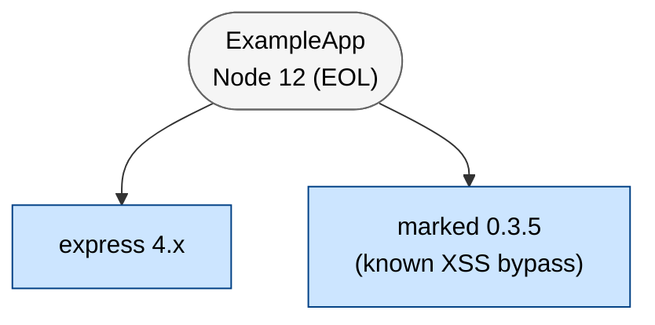

# Analytical & Communication Visuals

Coverage matrices, the risk heat map, the ATT&CK layer, the authorization matrix, and the dependency
graph. These complement the DFD layers and companion diagrams. Each is **generated by reasoning** —
the formats below exist so the result is consistent and machine-verifiable, not to script content.
Each is produced only when its precondition holds (else mark NOT APPLICABLE with a one-line reason).

---

## §1 STRIDE-per-Element Coverage Matrix  *(always)*

Demonstrates that every element was considered against every STRIDE-LM category — auditable
exhaustiveness, not just the threats that were found.

- **Rows**: each DFD element (external entity / process / data store / data flow), keyed by recon id.
  Group by trust zone when there are >20 elements.
- **Columns**: the seven STRIDE-LM categories, in order: `S T R I D E LM`.
- **Cells**: a finding id (`TM-NNN`), `n/a` (category inapplicable to that element type), or `clean`
  (examined, no finding). **No blank cells.**

```markdown
## STRIDE-per-Element Coverage Matrix

| Element | S | T | R | I | D | E | LM |
|---------|---|---|---|---|---|---|----|
| C1 API gateway | TM-002 | clean | clean | clean | clean | TM-004 | clean |
| D1 User DB | n/a | TM-006 | n/a | TM-003 | clean | n/a | clean |
| E1 Anonymous user | TM-001 | n/a | clean | n/a | n/a | n/a | n/a |
```

Every `TM-NNN` placed here must exist in `findings.json`, and every finding's (element, category)
must appear in the matching cell — the matrix is a faithful projection of the findings.

---

## §2 Likelihood × Impact Risk Heat Map  *(when ≥1 scored finding)*

A 5×5 grid placing each finding at the cell matching its own likelihood and impact, banded by the
OWASP severity bands in `frameworks.md` (LOW 1–4, MED 5–9, HIGH 10–16, CRIT 17–25).

```markdown
## Risk Heat Map (Likelihood × Impact)

| Impact \ Likelihood | 1 | 2 | 3 | 4 | 5 |
|---------------------|---|---|---|---|---|
| **5** |  |  | TM-008 | TM-003 | TM-001 |
| **4** |  |  | TM-012 | TM-006 |  |
| **3** |  | TM-020 | TM-002 |  |  |
| **2** | TM-016 |  |  |  |  |
| **1** |  |  |  |  |  |
```

Every scored finding appears exactly once, at the cell `(likelihood, impact)` matching its own
scores. (A Mermaid `quadrantChart` scatter may accompany it but is decorative — the 5×5 grid is
authoritative.)

---

## §3 MITRE ATT&CK Technique Layer  *(when ≥1 finding has a technique)*

A markdown technique table grouped by tactic, plus — when ≥5 techniques are mapped — a Navigator
JSON layer that imports into the ATT&CK Navigator.

```markdown
## MITRE ATT&CK Technique Coverage

| Tactic | Technique | ID | Findings |
|--------|-----------|----|----------|
| Initial Access | Exploit Public-Facing App | T1190 | TM-002 |
| Execution | Command and Scripting Interpreter | T1059 | TM-001 |
| Collection | Data from Cloud Storage | T1530 | TM-005 |
```

```json
{
  "name": "Threat model — ExampleApp",
  "domain": "enterprise-attack",
  "techniques": [
    {"techniqueID": "T1190", "score": 75, "comment": "TM-002"},
    {"techniqueID": "T1059", "score": 90, "comment": "TM-001"}
  ]
}
```

The set of technique ids shown equals the distinct `mitre` ids across the findings — no technique
invented in the layer that no finding maps to.

---

## §3a MITRE ATLAS Technique Layer  *(when `has_ai_ml`)*

The adversarial-ML counterpart of §3, for AI/ML targets. MITRE ATLAS ships an ATT&CK-Navigator-compatible
layer schema, so this reuses the **same Navigator JSON emitter** — the only load-bearing differences are
`domain: "atlas-atlas"` and the `AML.` technique-id prefix. Produced only when `coverage.context.has_ai_ml`
is true; on a non-AI target it is not emitted and every other artifact (including the §3 ATT&CK layer) is
unchanged.

```markdown
## MITRE ATLAS Technique Coverage

| ATLAS Tactic | Technique | ID | Findings |
|--------------|-----------|----|----------|
| Execution | LLM Prompt Injection | AML.T0051 | TM-007 |
| Persistence | Poison Training Data | AML.T0020 | TM-009 |
| Exfiltration | Exfiltration via ML Inference API | AML.T0024 | TM-011 |
```

```json
{
  "name": "ATLAS layer — ExampleAIApp",
  "domain": "atlas-atlas",
  "techniques": [
    {"techniqueID": "AML.T0051", "score": 20, "comment": "TM-007 (indirect prompt injection)"},
    {"techniqueID": "AML.T0020", "score": 15, "comment": "TM-009 (RAG poisoning)"}
  ]
}
```

Grounding rule (identical to §3, over the `atlas[]` field): the technique ids shown are a **subset of the
distinct `atlas[]` ids across the findings** — no technique on the layer that no finding maps to, and every
sub-technique's parent technique also present. Select ids from the MITRE ATLAS reference table in
`frameworks.md`. The eval (`diagram_checks.analytical_checks`) detects this layer **only** by
`domain: "atlas-atlas"` + the `AML.` prefix and never runs the ATT&CK `T####` regex over an ATLAS id.

---

## §3b OWASP-LLM Top-10 Coverage Checklist  *(when `has_ai_ml`)*

A coverage **checklist**, **not a second diagram** — OWASP-LLM content is a subset of ATLAS, so this is a
projection of the ATLAS layer, rendered through the **same table renderer as the §1 STRIDE matrix**. Fixed
10-row enum (LLM01–LLM10). Each row resolves to a finding id / `n-a` / `clean` by asking "does any finding's
own `atlas[]` id fall in this class's crosswalk set?" (the OWASP-LLM→ATLAS crosswalk in `frameworks.md`). A
row whose crosswalk set matches no finding is a legitimate `n-a` / `clean` — honest abstention.

- **Header**: the first column MUST be labeled `OWASP-LLM` (this is how the eval locates the checklist and
  scopes the `malformed-owasp-llm` id guardrail to it — a stray OWASP-category cell elsewhere is not
  mis-read).
- **Cells**: a finding id (`TM-NNN`), `n-a` (class inapplicable to this system), or `clean` (in scope,
  examined, no finding). No blank cells.

```markdown
## OWASP-LLM Top-10 Coverage Checklist

| OWASP-LLM | Class | Coverage |
|-----------|-------|----------|
| LLM01:2025 | Prompt Injection | TM-007 |
| LLM02:2025 | Sensitive Information Disclosure | TM-011 |
| LLM03:2025 | Supply Chain | clean |
| LLM04:2025 | Data and Model Poisoning | TM-009 |
| LLM05:2025 | Improper Output Handling | clean |
| LLM06:2025 | Excessive Agency | n-a |
| LLM07:2025 | System Prompt Leakage | clean |
| LLM08:2025 | Vector and Embedding Weaknesses | TM-009 |
| LLM09:2025 | Misinformation | n-a |
| LLM10:2025 | Unbounded Consumption | clean |
```

Use the verified official `LLM01:2025`–`LLM10:2025` ids from the OWASP-LLM Top-10 table in `frameworks.md`;
the eval format-checks each id against `^LLM(0[1-9]|10):2025$` and never requires any particular class to be
covered.

---

## §4 Authorization (RBAC) Matrix  *(when ≥2 roles/principals)*

Roles × resources, with an explicit `anonymous` / unauthenticated row, marking `allow` / `deny` /
`GAP` (where access is allowed but should not be — these point at the authz findings). Declare the
roles in `recon.json` `roles[]` (include anonymous) so the matrix is required.

```markdown
## Authorization (RBAC) Matrix

| Role \ Resource | /profile/:id | /admin | /benefits |
|-----------------|--------------|--------|-----------|
| anonymous       | deny         | deny   | deny      |
| user            | GAP (IDOR, TM-006) | deny | allow |
| admin           | allow        | allow  | allow     |
```

---

## §5 SBOM / Dependency Graph  *(when external deps are backed by a manifest)*

A dependency graph rooted at the application, with external dependencies as `:::externalDep` leaves;
flag risky deps (EOL / known-CVE / archived) per the `risk` note declared on the recon element. Set
`manifest` on the recon external_dep so the graph is required.



(For larger trees a CycloneDX-style table with versions + CVEs is an acceptable substitute, kept
under the same `## SBOM` / `## Dependency` heading.)

**Verification stamp (what the eval matches).** The deterministic check
(`evals/reliability/diagram_checks.py`) recognizes this graph by a `Type:` token — here `Type: SBOM`
(or `Type: Dependency`) — on the diagram's `%% Version: ...` stamp. Matching is case-insensitive and
tolerates a hyphen or a space between words, and the token is accepted either after a `|` field
separator (`%% Version: ... | Type: SBOM`) or as a bare `%% type: sbom` line. The Version stamp form
alone is sufficient. Same convention as the companion diagrams in `mermaid-diagrams.md` §5.

---

## §6 Threat-to-Control Coverage Matrix  *(when ≥1 finding)*

The **defensive dual** of the STRIDE-per-element matrix: STRIDE proves every element was *examined*;
this proves every finding was *addressed* — or that the gap is explicit. Each finding maps to ≥1
control, or is explicitly dispositioned `accepted-risk` / `none`; a finding with neither is shown as
an explicit `GAP` cell (the RBAC-matrix convention), never left blank.

- **Rows**: each finding, keyed by its `TM-NNN` id.
- **Columns**: `Finding | Control(s) | Control Name | Framework Ref | Disposition`.
- **Cells**: `Control(s)` is the control id(s) `CTL-NNN` (comma-separated), or `GAP` when the finding
  has no control; `Control Name` is the normalized action (migrated from free-text remediation);
  `Framework Ref` is the normalized NIST-800-53 / D3FEND id or `—`; `Disposition` is one of
  `mitigated` / `accepted-risk` / `none` (with a one-line reason for the abstentions). An **uncovered**
  finding (no control, no disposition) shows `GAP` with an empty disposition — the eval flags it.

```markdown
## Threat-to-Control Coverage Matrix

| Finding | Control(s) | Control Name | Framework Ref | Disposition |
|---------|------------|--------------|---------------|-------------|
| TM-001 | CTL-001 | Enforce mTLS on service-to-service calls | SC-8 | mitigated |
| TM-004 | GAP | — | — | none (static asset, no runtime control applies) |
| TM-006 | GAP | — | — |  |
```

This matrix is a **faithful projection of `findings.json`**: every finding id appears as a row, each
listed `CTL-NNN` is one the finding declares, and a zero-control finding shows `GAP`. The eval
(`diagram_checks.analytical_checks`) checks presence + projection only — it detects the table by its
`Control` + `Disposition` columns and never judges whether the listed control is the *correct*
remediation (that is the agent's / coverage-judge's call).

**`CTL-NNN` vs `R-NNN` (not duplication).** `CTL-NNN` is the addressable *control object* in
`findings.json` — what this matrix and, later, attack-defense counter-edges point at. `R-NNN`
(report Section VIII) is the *remediation-roadmap* sequencing item. They are aligned, not merged: one
`R-NNN` roadmap item may carry out several `CTL-NNN` controls. Each control's `counters[]` is
**reserved** for the attack-defense-tree change to attach the attack-node ids it interdicts; it
defaults empty here and no grounding is enforced on it yet.
